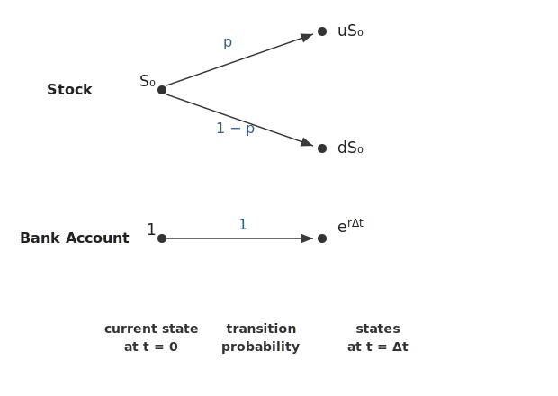
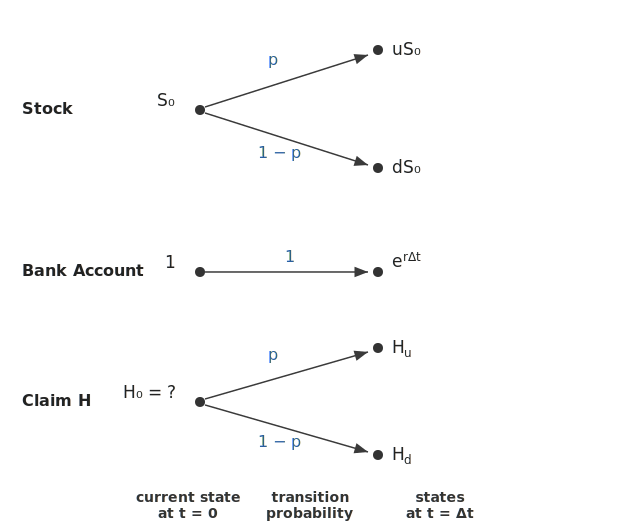

# Binomial Asset Pricing Model

## Introduction

The **binomial asset pricing model**, developed by **Cox, Ross, and Rubinstein (1979)**, provides a discrete-time framework for modeling stock price evolution and pricing derivative securities. At each time step, the stock price can move to one of two possible values—**up** or **down**—by predetermined factors.

Despite its apparent simplicity, the binomial model captures the *essential logic* of arbitrage-free pricing and serves as the conceptual foundation for continuous-time models, most notably the **Black–Scholes framework**.

The discrete-time setting offers several key advantages:

- **Computational tractability**: step-by-step valuation via backward induction
- **Flexibility**: natural treatment of American options, dividends, and time-varying parameters
- **Path-dependent payoffs**: compatibility with barrier, lookback, and exotic options
- **Pedagogical clarity**: finite-state algebraic setting for core pricing principles

More fundamentally, the binomial model reveals the structure underlying modern asset pricing:

- **No-arbitrage** restrictions on prices
- **Replication** and **uniqueness** of values
- Emergence of a **risk-neutral probability**
- **Martingale pricing** of discounted assets
- The **binomial-to-Black–Scholes limit**

We proceed deliberately in this discrete framework to understand arbitrage-free pricing *before* passing to continuous time.

!!! info "Prerequisites"
    - Basic probability (expectation, conditional expectation)
    - [Martingales](../../ch02/filtration_and_martingales/martingales.md) (discrete-time definition)
    - Familiarity with present value and compounding

!!! abstract "Learning Objectives"
    By the end of this section, you will be able to:
    
    1. Set up the one-period binomial model with proper notation
    2. Derive the no-arbitrage condition $d < e^{r\Delta t} < u$
    3. Construct the risk-neutral probability $q$
    4. Understand the martingale interpretation of arbitrage-free pricing

---

## One-Period Model Setup

We begin with a **one-period market** on the discrete time grid $t \in \{0, \Delta t\}$, where $\Delta t > 0$ is the length of the period.

!!! note "Notation Convention"
    Throughout this chapter, we use $\Delta t$ for the discrete time step to distinguish from the infinitesimal $dt$ in continuous-time models. When we later take the limit $\Delta t \to 0$ with $n$ periods such that $n \Delta t = T$, the binomial model converges to Black–Scholes.
    
    We use **continuous compounding** for the risk-free rate: over one period, the risk-free asset grows by the factor $e^{r \Delta t}$.

### Assets

The market consists of two traded assets:

**Risk-free asset (bank account):**

Starting with $B_0 = 1$, the bank account grows deterministically:

$$
B_{\Delta t} = e^{r \Delta t}
$$

where $r \geq 0$ is the continuously compounded risk-free rate.

**Risky asset (stock):**

Starting with $S_0 > 0$, the stock price at time $\Delta t$ takes one of two values:

$$
S_{\Delta t} =
\begin{cases}
u S_0 & \text{with probability } p \quad \text{(up state)} \\[6pt]
d S_0 & \text{with probability } 1-p \quad \text{(down state)}
\end{cases}
$$

where:

- $u > 1$ is the **up factor** (stock increases by factor $u$)
- $0 < d < 1$ is the **down factor** (stock decreases by factor $d$)
- $p \in (0,1)$ is the **physical probability** of an up move

<figure markdown="span">
  
  <figcaption markdown="span">**Figure 1:** One-period binomial model. The stock price evolves from $S_0$ to either $uS_0$ (up) or $dS_0$ (down) with physical probabilities $p$ and $1 - p$. The bank account grows deterministically from 1 to $e^{r\Delta t}$.</figcaption>
</figure>

!!! example "Numerical Example"
    Let $S_0 = 100$, $u = 1.1$, $d = 0.9$, $r = 0.05$, $\Delta t = 1$ year.
    
    - Up state: $S_{\Delta t} = 110$
    - Down state: $S_{\Delta t} = 90$
    - Bank account: $B_{\Delta t} = e^{0.05} \approx 1.051$

### Portfolios

A **portfolio** is described by holdings $(\Delta, \beta)$, where:

- $\Delta \in \mathbb{R}$: number of shares of stock (can be negative for short positions)
- $\beta \in \mathbb{R}$: units of the bank account (can be negative for borrowing)

The portfolio value at each time is:

$$
V_0 = \Delta S_0 + \beta B_0 = \Delta S_0 + \beta
$$

$$
V_{\Delta t} = \Delta S_{\Delta t} + \beta B_{\Delta t} = \Delta S_{\Delta t} + \beta e^{r \Delta t}
$$

!!! note "Self-Financing Property"
    In the one-period model, the holdings $(\Delta, \beta)$ are fixed at time $0$ and held until time $\Delta t$. There are no intermediate cash flows—the portfolio is automatically **self-financing**.
    
    In multi-period models, self-financing means that any rebalancing is done using only the current portfolio value, with no external injection or withdrawal of funds.

---

## Contingent Claims and the Pricing Problem

A **contingent claim** (or **derivative**) is any payoff that depends on the terminal stock price:

$$
H = H(S_{\Delta t}) = 
\begin{cases}
H_u & \text{if } S_{\Delta t} = u S_0 \\[4pt]
H_d & \text{if } S_{\Delta t} = d S_0
\end{cases}
$$

<figure markdown="span">
  
  <figcaption markdown="span">**Figure 2:** One-period binomial model with a contingent claim. The stock price evolves from $S_0$ to either $uS_0$ (up) or $dS_0$ (down) with physical probabilities $p$ and $1 - p$. The bank account grows deterministically from $1$ to $e^{r\Delta t}$. A contingent claim $H$ pays $H_u$ or $H_d$ at $t = \Delta t$ depending on the stock outcome. The central question of the binomial model is: what is the fair price $H_0$ at $t = 0$?</figcaption>
</figure>

!!! example "Common Examples"
    - **European call option**: $H = (S_{\Delta t} - K)^+ = \max(S_{\Delta t} - K, 0)$
    - **European put option**: $H = (K - S_{\Delta t})^+$
    - **Digital call option**: $H = \mathbf{1}_{\{S_{\Delta t} > K\}}$
    - **Digital put option**: $H = \mathbf{1}_{\{S_{\Delta t} < K\}}$
    - **Forward contract**: $H = S_{\Delta t} - F$

The central question of asset pricing is:

> **What is the fair price $V_0$ of the payoff $H$ at time $0$?**

We will answer this question through three equivalent perspectives:

1. **Replication** (uniqueness of prices) — covered in [Replicating Portfolio](replicating_portfolio.md)
2. **Delta Hedging** (risk elimination) — covered in [Delta Hedging](delta_hedging.md)
3. **Risk-neutral pricing** (valuation by expectation) — covered in [Risk-Neutral Measure](risk_neutral_measure.md)

---

## No-Arbitrage Condition

### Definition of Arbitrage

An **arbitrage** is a trading strategy that generates profit without risk. Formally:

!!! definition "Arbitrage"
    A portfolio $(\Delta, \beta)$ is an **arbitrage** if:
    
    1. $V_0 \leq 0$ (zero or negative initial cost)
    2. $V_{\Delta t} \geq 0$ in **all** states (no possibility of loss)
    3. $\mathbb{P}(V_{\Delta t} > 0) > 0$ (positive probability of profit)
    
    A market is **arbitrage-free** if no such portfolio exists.

The no-arbitrage principle is the foundation of modern financial theory: in a well-functioning market, arbitrage opportunities should not persist.

### Derivation of the No-Arbitrage Condition

We now derive the condition on $(u, d, r)$ that ensures the market is arbitrage-free.

**Case 1: What if $e^{r \Delta t} \geq u$?**

Consider the portfolio: short 1 share of stock, invest proceeds in the bank.

- Initial value: $V_0 = -S_0 + S_0 = 0$
- Terminal value in up state: $V_{\Delta t} = -uS_0 + S_0 e^{r \Delta t} \geq -uS_0 + uS_0 = 0$
- Terminal value in down state: $V_{\Delta t} = -dS_0 + S_0 e^{r \Delta t} > -dS_0 + dS_0 = 0$

Since $d < u$, we have strict inequality in the down state. This is an arbitrage: zero cost, non-negative payoff, strictly positive in one state.

**Conclusion:** If $e^{r \Delta t} \geq u$, arbitrage exists. Therefore, no-arbitrage requires $e^{r \Delta t} < u$.

**Case 2: What if $e^{r \Delta t} \leq d$?**

Consider the portfolio: buy 1 share of stock, finance by borrowing from the bank.

- Initial value: $V_0 = S_0 - S_0 = 0$
- Terminal value in up state: $V_{\Delta t} = uS_0 - S_0 e^{r \Delta t} > uS_0 - uS_0 = 0$
- Terminal value in down state: $V_{\Delta t} = dS_0 - S_0 e^{r \Delta t} \geq dS_0 - dS_0 = 0$

Since $u > d$, we have strict inequality in the up state. This is an arbitrage.

**Conclusion:** If $e^{r \Delta t} \leq d$, arbitrage exists. Therefore, no-arbitrage requires $e^{r \Delta t} > d$.

!!! success "No-Arbitrage Condition"
    The one-period binomial market is arbitrage-free if and only if:
    
    $$
    \boxed{d < e^{r \Delta t} < u}
    $$
    
    **Interpretation:** The risk-free return must lie strictly between the worst and best stock returns. If the bank always beats the stock (even in the up state), or the stock always beats the bank (even in the down state), arbitrage is possible.

---

## Geometric Interpretation

The no-arbitrage condition has an elegant geometric interpretation in terms of **discounted prices**.

Define the **discounted stock price**:

$$
\tilde{S}_{\Delta t} := \frac{S_{\Delta t}}{e^{r \Delta t}} = \frac{S_{\Delta t}}{B_{\Delta t}}
$$

This measures the stock price in units of the bank account (the **numéraire**).

The discounted terminal values are:

$$
\tilde{S}_{\Delta t} = 
\begin{cases}
\dfrac{u S_0}{e^{r \Delta t}} & \text{(up state)} \\[10pt]
\dfrac{d S_0}{e^{r \Delta t}} & \text{(down state)}
\end{cases}
$$

The no-arbitrage condition $d < e^{r \Delta t} < u$ is equivalent to:

$$
\frac{d S_0}{e^{r \Delta t}} < S_0 < \frac{u S_0}{e^{r \Delta t}}
$$

!!! tip "Convex Hull Interpretation"
    The current stock price $S_0$ lies in the **interior** of the interval spanned by the discounted future values:
    
    $$
    S_0 \in \left( \frac{d S_0}{e^{r \Delta t}}, \frac{u S_0}{e^{r \Delta t}} \right)
    $$
    
    Equivalently, $S_0$ can be written as a **strict convex combination** of the discounted future values. This convexity property is the geometric essence of no-arbitrage and generalizes to higher dimensions (multiple assets, multiple periods).

---

## Risk-Neutral Probability

The convex hull interpretation suggests that we can express $S_0$ as a weighted average of discounted future values. This leads to the **risk-neutral probability**.

### Derivation

We seek a probability $q \in (0,1)$ such that:

$$
S_0 = e^{-r \Delta t} \mathbb{E}^{\mathbb{Q}}[S_{\Delta t}]
$$

where $\mathbb{E}^{\mathbb{Q}}$ denotes expectation under a new probability measure $\mathbb{Q}$ with $\mathbb{Q}(\text{up}) = q$.

Expanding the expectation:

$$
S_0 = e^{-r \Delta t} \left( q \cdot u S_0 + (1-q) \cdot d S_0 \right)
$$

Dividing both sides by $S_0$ and multiplying by $e^{r \Delta t}$:

$$
e^{r \Delta t} = q \cdot u + (1-q) \cdot d
$$

Expanding and solving for $q$:

$$
e^{r \Delta t} = qu + d - qd = d + q(u - d)
$$

$$
q(u - d) = e^{r \Delta t} - d
$$

$$
\boxed{q = \frac{e^{r \Delta t} - d}{u - d}}
$$

!!! success "Risk-Neutral Probability"
    Under the no-arbitrage condition $d < e^{r \Delta t} < u$, there exists a **unique** probability $q \in (0,1)$ given by:
    
    $$
    q = \frac{e^{r \Delta t} - d}{u - d}, \qquad 1 - q = \frac{u - e^{r \Delta t}}{u - d}
    $$

### Verification that q ∈ (0,1)

The no-arbitrage condition guarantees $q$ is a valid probability:

- **$q > 0$:** Since $e^{r \Delta t} > d$, the numerator $e^{r \Delta t} - d > 0$, and since $u > d$, the denominator $u - d > 0$. Thus $q > 0$.

- **$q < 1$:** Since $e^{r \Delta t} < u$, we have $e^{r \Delta t} - d < u - d$, so $q < 1$.

This confirms that $q \in (0,1)$ if and only if the no-arbitrage condition holds.

### Risk-Neutral Measure

Define a probability measure $\mathbb{Q}$ on the one-period state space by:

$$
\mathbb{Q}(\text{up}) = q, \qquad \mathbb{Q}(\text{down}) = 1 - q
$$

This probability measure $\mathbb{Q}$ is called the **risk-neutral measure** (or **equivalent martingale measure**).

!!! warning "Risk-Neutral ≠ Physical"
    The risk-neutral probability $q$ is generally **different** from the physical probability $p$:
    
    - $p$ describes how the stock actually moves in the real world
    - $q$ is a mathematical construct for pricing derivatives
    
    The term "risk-neutral" reflects that under $\mathbb{Q}$, the expected return on the stock equals the risk-free rate—as if investors were indifferent to risk.

---

## Martingale Interpretation

Under the risk-neutral measure $\mathbb{Q}$, the stock price satisfies:

$$
S_0 = e^{-r \Delta t} \mathbb{E}^{\mathbb{Q}}[S_{\Delta t}]
$$

Equivalently, the **discounted stock price** $\tilde{S}_t := e^{-rt} S_t$ satisfies:

$$
\tilde{S}_0 = S_0 = e^{-r \Delta t} \mathbb{E}^{\mathbb{Q}}[S_{\Delta t}] = \mathbb{E}^{\mathbb{Q}}\left[ e^{-r \Delta t} S_{\Delta t} \right] = \mathbb{E}^{\mathbb{Q}}[\tilde{S}_{\Delta t}]
$$

!!! success "Martingale Property"
    Under the risk-neutral measure $\mathbb{Q}$, the discounted stock price is a **martingale**:
    
    $$
    \mathbb{E}^{\mathbb{Q}}[\tilde{S}_{\Delta t} \mid \mathcal{F}_0] = \tilde{S}_0
    $$
    
    This is the discrete-time analog of the continuous-time result. See [Martingales](../../ch02/filtration_and_martingales/martingales.md) for the general definition.

This martingale property is the key to pricing contingent claims: if discounted asset prices are martingales under $\mathbb{Q}$, then by no-arbitrage, discounted derivative prices must also be martingales. This leads to the **risk-neutral pricing formula**:

$$
V_0 = e^{-r \Delta t} \mathbb{E}^{\mathbb{Q}}[H]
$$

The derivation of this formula via replication is the subject of the [next section](replicating_portfolio.md).

---

## Summary

| Concept | Formula/Condition |
|---------|-------------------|
| No-arbitrage condition | $d < e^{r \Delta t} < u$ |
| Risk-neutral probability | $q = \dfrac{e^{r \Delta t} - d}{u - d}$ |
| Martingale property | $S_0 = e^{-r \Delta t} \mathbb{E}^{\mathbb{Q}}[S_{\Delta t}]$ |
| Discounted price | $\tilde{S}_t = e^{-rt} S_t$ is a $\mathbb{Q}$-martingale |

!!! abstract "Key Takeaways"
    1. The **no-arbitrage condition** $d < e^{r \Delta t} < u$ ensures the risk-free return lies between the worst and best stock returns.
    
    2. No-arbitrage is equivalent to the existence of a **risk-neutral probability** $q \in (0,1)$.
    
    3. Under the risk-neutral measure, **discounted prices are martingales**—this is the foundation of derivative pricing.
    
    4. The risk-neutral probability $q$ depends only on $(u, d, r, \Delta t)$, **not** on the physical probability $p$.

---

## What's Next

This introductory section established the one-period framework. The subsequent sections develop the theory:

| Section | Topic |
|---------|-------|
| [Replicating Portfolio](replicating_portfolio.md) | Replication with stock-bond and state prices |
| [Delta Hedging](delta_hedging.md) | Pricing via risk elimination |
| [Risk-Neutral Measure](risk_neutral_measure.md) | The measure $\mathbb{Q}$ and expectation pricing |
| [Multi-Period Model](multi_period_binomial_model.md) | Trees, backward induction, dynamic hedging |
| [American Options on Trees](american_options_on_trees.md) | Early exercise and optimal stopping |
| [Trinomial Model](trinomial_model.md) | Incomplete markets and non-unique pricing |
| [Binomial to Black–Scholes](binomial_to_black_scholes_limit.md) | The continuous-time limit |

---

## Exercises

**Exercise 1.** Consider a one-period binomial model with $S_0 = 80$, $u = 1.25$, $d = 0.85$, $r = 0.03$, and $\Delta t = 1$. Verify that the no-arbitrage condition $d < e^{r\Delta t} < u$ is satisfied. Compute the risk-neutral probability $q$ and confirm that $q \in (0, 1)$.

??? success "Solution to Exercise 1"
    We have $S_0 = 80$, $u = 1.25$, $d = 0.85$, $r = 0.03$, and $\Delta t = 1$.

    **No-arbitrage condition:** We need $d < e^{r\Delta t} < u$, i.e., $0.85 < e^{0.03} < 1.25$.

    Computing $e^{0.03} \approx 1.03045$, we verify:

    $$
    0.85 < 1.03045 < 1.25 \quad \checkmark
    $$

    **Risk-neutral probability:**

    $$
    q = \frac{e^{r\Delta t} - d}{u - d} = \frac{1.03045 - 0.85}{1.25 - 0.85} = \frac{0.18045}{0.40} = 0.4511
    $$

    Since $0 < 0.4511 < 1$, we confirm $q \in (0,1)$.

---

**Exercise 2.** Prove that if $e^{r\Delta t} = u$, an arbitrage portfolio exists. Construct the portfolio explicitly, compute its cost and payoff in each state, and identify it as a Type 1 or Type 2 arbitrage.

??? success "Solution to Exercise 2"
    We must show that if $e^{r\Delta t} = u$, an arbitrage exists. Consider the portfolio: short 1 share of stock and invest $S_0$ in the bank account.

    **Initial cost:** $V_0 = -S_0 + S_0 = 0$.

    **Terminal values:**

    - Up state: $V_{\Delta t} = -uS_0 + S_0 e^{r\Delta t} = -uS_0 + uS_0 = 0$
    - Down state: $V_{\Delta t} = -dS_0 + S_0 e^{r\Delta t} = -dS_0 + uS_0 = (u - d)S_0 > 0$

    since $u > d$.

    This portfolio satisfies: (1) $V_0 = 0$, (2) $V_{\Delta t} \geq 0$ in all states, and (3) $V_{\Delta t} > 0$ with positive probability (in the down state). This is a **Type 1 arbitrage** (zero cost, non-negative payoff, positive probability of profit).

---

**Exercise 3.** In the one-period binomial model, show that the discounted stock price $\tilde{S}_{\Delta t} = e^{-r\Delta t} S_{\Delta t}$ is a $\mathbb{Q}$-martingale by verifying

$$
\mathbb{E}^{\mathbb{Q}}[\tilde{S}_{\Delta t}] = S_0
$$

directly from the definition of $q$.

??? success "Solution to Exercise 3"
    We need to verify $\mathbb{E}^{\mathbb{Q}}[\tilde{S}_{\Delta t}] = S_0$ where $\tilde{S}_{\Delta t} = e^{-r\Delta t} S_{\Delta t}$.

    $$
    \mathbb{E}^{\mathbb{Q}}[\tilde{S}_{\Delta t}] = e^{-r\Delta t}\bigl(q \cdot uS_0 + (1-q) \cdot dS_0\bigr) = e^{-r\Delta t} S_0 \bigl(qu + (1-q)d\bigr)
    $$

    Substituting $q = \frac{e^{r\Delta t} - d}{u - d}$:

    $$
    qu + (1-q)d = \frac{(e^{r\Delta t} - d)u + (u - e^{r\Delta t})d}{u - d} = \frac{e^{r\Delta t}(u - d)}{u - d} = e^{r\Delta t}
    $$

    Therefore:

    $$
    \mathbb{E}^{\mathbb{Q}}[\tilde{S}_{\Delta t}] = e^{-r\Delta t} S_0 \cdot e^{r\Delta t} = S_0
    $$

    This confirms the martingale property.

---

**Exercise 4.** A stock has $S_0 = 50$, $u = 1.15$, $d = 0.90$, and $r = 0.06$ with $\Delta t = 0.5$. Compute the risk-neutral probability $q$. Then price a European call with strike $K = 52$ and a European put with strike $K = 52$ using the formula $V_0 = e^{-r\Delta t}(q H_u + (1 - q) H_d)$. Verify that put-call parity holds.

??? success "Solution to Exercise 4"
    Given $S_0 = 50$, $u = 1.15$, $d = 0.90$, $r = 0.06$, $\Delta t = 0.5$.

    **Risk-neutral probability:**

    $$
    q = \frac{e^{0.06 \times 0.5} - 0.90}{1.15 - 0.90} = \frac{e^{0.03} - 0.90}{0.25} = \frac{1.03045 - 0.90}{0.25} = \frac{0.13045}{0.25} = 0.5218
    $$

    **Stock prices at $\Delta t$:**

    - Up: $S_u = 1.15 \times 50 = 57.50$
    - Down: $S_d = 0.90 \times 50 = 45.00$

    **European call** ($K = 52$):

    - $H_u^C = (57.50 - 52)^+ = 5.50$
    - $H_d^C = (45.00 - 52)^+ = 0$

    $$
    C_0 = e^{-0.03}(0.5218 \times 5.50 + 0.4782 \times 0) = 0.97045 \times 2.8699 = 2.785
    $$

    **European put** ($K = 52$):

    - $H_u^P = (52 - 57.50)^+ = 0$
    - $H_d^P = (52 - 45.00)^+ = 7.00$

    $$
    P_0 = e^{-0.03}(0.5218 \times 0 + 0.4782 \times 7.00) = 0.97045 \times 3.3474 = 3.248
    $$

    **Put-call parity verification:**

    $$
    C_0 - P_0 = 2.785 - 3.248 = -0.463
    $$

    $$
    S_0 - Ke^{-r\Delta t} = 50 - 52 \times e^{-0.03} = 50 - 50.463 = -0.463 \quad \checkmark
    $$

---

**Exercise 5.** The risk-neutral probability $q = (e^{r\Delta t} - d)/(u - d)$ depends only on $(u, d, r, \Delta t)$ and not on the physical probability $p$. Explain intuitively why the physical probability is irrelevant for derivative pricing in the binomial model. What role does $p$ play in practice?

??? success "Solution to Exercise 5"
    The risk-neutral probability $q = (e^{r\Delta t} - d)/(u - d)$ depends only on the model parameters $(u, d, r, \Delta t)$ and not on $p$ because the pricing formula is derived from **no-arbitrage** (replication or hedging), not from expected returns under the physical measure.

    **Intuitive explanation:** The option price is determined by the cost of the replicating portfolio $(\Delta, B)$. The replication equations require the portfolio payoff to match the option payoff in **every** state:

    - Up state: $\Delta \cdot uS_0 + B \cdot e^{r\Delta t} = H_u$
    - Down state: $\Delta \cdot dS_0 + B \cdot e^{r\Delta t} = H_d$

    These equations involve only $u$, $d$, $r$, and the payoffs $H_u$, $H_d$. The probability $p$ of reaching each state never appears because the portfolio must replicate in **both** states simultaneously, regardless of which is more likely.

    **Role of $p$ in practice:** The physical probability $p$ is relevant for risk management (computing VaR, expected P&L), portfolio optimization, and forecasting actual returns. It determines the real-world distribution of gains and losses but is irrelevant for arbitrage-free pricing.

---

**Exercise 6.** In the convex hull interpretation, the no-arbitrage condition is equivalent to $S_0$ lying in the interior of the interval between the discounted future stock values. Show that this condition can be written as

$$
\frac{dS_0}{e^{r\Delta t}} < S_0 < \frac{uS_0}{e^{r\Delta t}}
$$

and explain why the interior (strict inequalities) is necessary for the risk-neutral probability to be a valid probability measure.

??? success "Solution to Exercise 6"
    The discounted future stock values are $\frac{uS_0}{e^{r\Delta t}}$ and $\frac{dS_0}{e^{r\Delta t}}$. The condition $d < e^{r\Delta t} < u$ is equivalent to:

    $$
    \frac{dS_0}{e^{r\Delta t}} < S_0 < \frac{uS_0}{e^{r\Delta t}}
    $$

    To see this, divide $d < e^{r\Delta t}$ by $e^{r\Delta t}$ to get $d/e^{r\Delta t} < 1$, then multiply by $S_0$ to get $dS_0/e^{r\Delta t} < S_0$. Similarly, $e^{r\Delta t} < u$ gives $1 < u/e^{r\Delta t}$, so $S_0 < uS_0/e^{r\Delta t}$.

    **Why strict inequalities are necessary:** The risk-neutral probability is $q = (e^{r\Delta t} - d)/(u - d)$. For $q$ to be a valid probability, we need $q \in (0,1)$:

    - $q > 0$ requires $e^{r\Delta t} - d > 0$, i.e., $e^{r\Delta t} > d$ (strict inequality)
    - $q < 1$ requires $e^{r\Delta t} - d < u - d$, i.e., $e^{r\Delta t} < u$ (strict inequality)

    If either inequality were non-strict (boundary case), then $q = 0$ or $q = 1$, meaning one state would have zero probability under $\mathbb{Q}$. This would violate the requirement that $\mathbb{Q}$ be **equivalent** to $\mathbb{P}$ (both measures must assign positive probability to all states), and arbitrage would exist as shown in the text.
