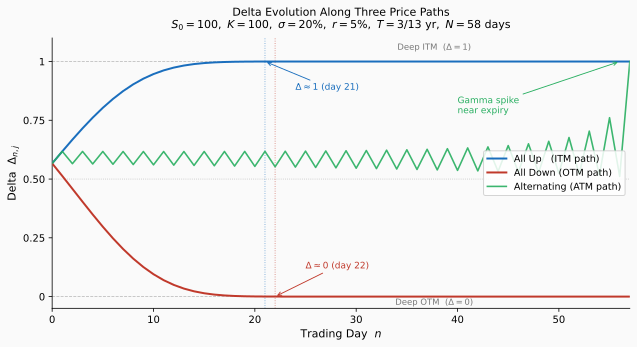

# Multi-Period Binomial Model

## Introduction

This section extends the one-period binomial model to **multiple time periods**. The multi-period framework enables:

- **Realistic option pricing**: Options with arbitrary maturities
- **Dynamic delta hedging**: Rebalancing the hedge as the stock evolves
- **Path to continuous time**: Foundation for Black–Scholes convergence

The key insight is that multi-period pricing reduces to **repeated application** of one-period pricing via **backward induction**.

!!! info "Prerequisites"
    - [Binomial Model](binomial_model.md) (one-period setup)
    - [Replicating Portfolio](replicating_portfolio.md) (replication approach)
    - [Delta Hedging](delta_hedging.md) (hedging approach)
    - [Risk-Neutral Measure](risk_neutral_measure.md) (expectation pricing)

!!! abstract "Learning Objectives"
    By the end of this section, you will be able to:
    
    1. Construct a multi-period binomial tree
    2. Price European options via backward induction
    3. Implement dynamic delta hedging through the tree
    4. Understand the self-financing property

---

## The Multi-Period Tree

### Time Structure

Fix a maturity $T$ and divide it into $N$ equal periods:

$$
\Delta t = \frac{T}{N}
$$

Time points: $t_n = n \cdot \Delta t$ for $n = 0, 1, \ldots, N$.

### Node Indexing

Each node is indexed by $(n, j)$ where:

- $n = 0, 1, \ldots, N$ is the **time index**
- $j = 0, 1, \ldots, n$ is the **state index** (number of up moves)

### Stock Prices

At node $(n, j)$, the stock price is:

$$
\boxed{S_{n,j} = S_0 \cdot u^j \cdot d^{n-j}}
$$

### The Recombining Property

With $u = e^{\sigma\sqrt{\Delta t}}$ and $d = e^{-\sigma\sqrt{\Delta t}} = 1/u$:

$$
ud = 1
$$

An up-then-down path reaches the same price as a down-then-up path. The tree **recombines**, giving only $n+1$ nodes at time $n$ (not $2^n$).

### Tree Visualization (N = 3)

<figure markdown="span">
  
  <figcaption markdown="span">**Figure 1:** Three-period recombining binomial tree with log-scale node spacing. Node $(n, j)$ has price $S_{n,j} = u^j d^{n-j} S_0$. The tree is mirror-symmetric around $S_0$ under the CRR parametrization $d = 1/u$, where up and down moves are equal in magnitude in log space: $\log u = -\log d = \sigma\sqrt{\Delta t}$.</figcaption>
</figure>

### Computational Advantage

| Tree Type | Nodes at Time $n$ | Total Nodes |
|-----------|-------------------|-------------|
| Recombining | $n + 1$ | $O(N^2)$ |
| Non-recombining | $2^n$ | $O(2^N)$ |

---

## Backward Induction for European Options

### The Algorithm

**Step 1: Terminal condition** ($n = N$)

Set option values equal to payoffs:

$$
V_{N,j} = H(S_{N,j})
$$

**Step 2: Backward recursion** ($n = N-1, N-2, \ldots, 0$)

At each node $(n, j)$, the option value is the discounted risk-neutral expectation:

$$
\boxed{V_{n,j} = e^{-r\Delta t}\left[qV_{n+1,j+1} + (1-q)V_{n+1,j}\right]}
$$

where $q = \frac{e^{r\Delta t} - d}{u - d}$.

**Step 3: Output**

The option price is $V_{0,0}$.

### Why Backward Induction Works

At each node, we apply the one-period pricing formula. The option at node $(n,j)$ is a one-period claim with:

- Up-state payoff: $V_{n+1,j+1}$
- Down-state payoff: $V_{n+1,j}$

By risk-neutral pricing:

$$
V_{n,j} = e^{-r\Delta t}\mathbb{E}^{\mathbb{Q}}[V_{n+1} \mid \text{at node } (n,j)]
$$

---

## Dynamic Delta Hedging

### The Hedging Strategy

At each node $(n, j)$, we construct a **locally replicating portfolio**:

- Hold $\Delta_{n,j}$ shares of stock
- Hold $B_{n,j}$ units of bond (cash)

The portfolio replicates the option over the next period.

### Computing Delta at Each Node

From the one-period hedging formula:

$$
\boxed{\Delta_{n,j} = \frac{V_{n+1,j+1} - V_{n+1,j}}{S_{n,j}(u - d)}}
$$

This is the **local hedge ratio**—the number of shares to hold at node $(n,j)$.

### Computing the Cash Position

$$
\boxed{B_{n,j} = e^{-r\Delta t}\left(V_{n+1,j+1} - \Delta_{n,j} \cdot uS_{n,j}\right)}
$$

Or equivalently:

$$
B_{n,j} = V_{n,j} - \Delta_{n,j} \cdot S_{n,j}
$$

### The Rebalancing Process

1. **At $t = 0$**: Enter position $(\Delta_{0,0}, B_{0,0})$
2. **At $t = \Delta t$**: Stock has moved to state $j$
   - Old portfolio value: $\Delta_{0,0} \cdot S_{1,j} + B_{0,0} \cdot e^{r\Delta t}$
   - This equals $V_{1,j}$ (by construction)
   - **Rebalance** to new position $(\Delta_{1,j}, B_{1,j})$
3. **Repeat** at each time step until maturity

### Self-Financing Property

The rebalancing requires **no external cash**. The value of the old portfolio exactly equals the cost of the new portfolio:

$$
\Delta_{n-1,k} \cdot S_{n,j} + B_{n-1,k} \cdot e^{r\Delta t} = V_{n,j} = \Delta_{n,j} \cdot S_{n,j} + B_{n,j}
$$

This is the **self-financing property**—the hedging strategy is implementable without adding or withdrawing funds.

---

## Complete Numerical Example

### Parameters

| Parameter | Value |
|-----------|-------|
| $S_0$ | $100$ |
| $K$ | $100$ |
| $r$ | $5\%$ per year |
| $\sigma$ | $20\%$ per year |
| $T$ | $1$ year |
| $N$ | $3$ periods |

### Computed Values

$$
\Delta t = \frac{1}{3}, \quad u = e^{0.2\sqrt{1/3}} = 1.1224, \quad d = \frac{1}{u} = 0.8909
$$

$$
e^{r\Delta t} = e^{0.05/3} = 1.0168, \quad q = \frac{1.0168 - 0.8909}{1.1224 - 0.8909} = 0.5439
$$

### Stock Price Tree

| Node | Price |
|------|-------|
| $S_{0,0}$ | $100.00$ |
| $S_{1,1}$ | $112.24$ |
| $S_{1,0}$ | $89.09$ |
| $S_{2,2}$ | $125.98$ |
| $S_{2,1}$ | $100.00$ |
| $S_{2,0}$ | $79.37$ |
| $S_{3,3}$ | $141.40$ |
| $S_{3,2}$ | $112.24$ |
| $S_{3,1}$ | $89.09$ |
| $S_{3,0}$ | $70.72$ |

### Option Values (European Call, K = 100)

**Terminal payoffs** ($n = 3$):

$$
V_{3,3} = 41.40, \quad V_{3,2} = 12.24, \quad V_{3,1} = 0, \quad V_{3,0} = 0
$$

**At $n = 2$**:

$$\begin{array}{lll}
V_{2,2} &=&\displaystyle e^{-0.0167}[0.5439 \times 41.40 + 0.4561 \times 12.24] = 0.9835 \times 28.10 = 27.63\\
V_{2,1} &=&\displaystyle e^{-0.0167}[0.5439 \times 12.24 + 0.4561 \times 0] = 0.9835 \times 6.66 = 6.55\\
V_{2,0} &=&\displaystyle e^{-0.0167}[0.5439 \times 0 + 0.4561 \times 0] = 0
\end{array}$$

**At $n = 1$**:

$$\begin{array}{lll}
V_{1,1} &=&\displaystyle e^{-0.0167}[0.5439 \times 27.63 + 0.4561 \times 6.55] = 0.9835 \times 18.02 = 17.72\\
V_{1,0} &=&\displaystyle e^{-0.0167}[0.5439 \times 6.55 + 0.4561 \times 0] = 0.9835 \times 3.56 = 3.50
\end{array}$$

**At $n = 0$**:

$$
V_{0,0} = e^{-0.0167}[0.5439 \times 17.72 + 0.4561 \times 3.50] = 0.9835 \times 11.23 = 11.04
$$

!!! success "European Call Price"

    $$C_0 = 11.04$$

### Delta at Each Node

$$\begin{array}{lll}
\Delta_{2,2} &=&\displaystyle \frac{41.40 - 12.24}{125.98 \times 0.2315} = \frac{29.16}{29.16} = 1.00\\
\Delta_{2,1} &=&\displaystyle \frac{12.24 - 0}{100 \times 0.2315} = \frac{12.24}{23.15} = 0.529\\
\Delta_{2,0} &=&\displaystyle \frac{0 - 0}{79.37 \times 0.2315} = 0\\
\Delta_{1,1} &=&\displaystyle \frac{27.63 - 6.55}{112.24 \times 0.2315} = \frac{21.08}{25.98} = 0.812\\
\Delta_{1,0} &=&\displaystyle \frac{6.55 - 0}{89.09 \times 0.2315} = \frac{6.55}{20.62} = 0.318\\
\Delta_{0,0} &=&\displaystyle \frac{17.72 - 3.50}{100 \times 0.2315} = \frac{14.22}{23.15} = 0.614
\end{array}$$

### Delta Hedging Through the Tree

**Initial position** ($t = 0$):

$$
\text{Hold } \Delta_{0,0} = 0.614 \text{ shares (cost } 61.40\text{)}, \quad \text{Borrow } B_{0,0} = 11.04 - 61.40 = -50.36
$$

$$
\text{Portfolio value} = 11.04 = \text{option price} \checkmark
$$

**After up move** ($t = \Delta t$, stock at $112.24$):

$$\begin{array}{lll}
\text{Stock position: }&& 0.614 \times 112.24 = 68.92\\
\text{Cash position: }&& {-50.36} \times e^{0.0167} = -51.20\\
\text{Portfolio value: }&& 68.92 - 51.20 = 17.72 = V_{1,1} \checkmark
\end{array}$$

**Rebalance**: increase to $\Delta_{1,1} = 0.812$ shares — buy $0.812 - 0.614 = 0.198$ shares at $112.24$ (cost $22.22$), new cash position: $-51.20 - 22.22 = -73.42$.

**After down move** ($t = \Delta t$, stock at $89.09$):

$$\begin{array}{lll}
\text{Stock position: }&& 0.614 \times 89.09 = 54.70\\
\text{Cash position: }&& {-50.36} \times e^{0.0167} = -51.20\\
\text{Portfolio value: }&& 54.70 - 51.20 = 3.50 = V_{1,0} \checkmark
\end{array}$$

The hedging strategy **perfectly replicates** the option value at every node.

---

## Properties of Multi-Period Delta

### Delta Evolution

As we move through the tree:

- **Stock rises** → Call delta increases (approaches 1)
- **Stock falls** → Call delta decreases (approaches 0)
- **Near expiration** → Delta becomes more extreme (0 or 1)

### Gamma: Rate of Change of Delta

The **gamma** measures how fast delta changes:

$$
\Gamma_{n,j} \approx \frac{\Delta_{n+1,j+1} - \Delta_{n+1,j}}{S_{n+1,j+1} - S_{n+1,j}}
$$

High gamma means more frequent rebalancing is needed.

### Delta at Maturity

At expiration:

$$
\Delta_{N-1,j} = \frac{V_{N,j+1} - V_{N,j}}{S_{N-1,j}(u-d)} = 
\begin{cases}
1 & \text{if both nodes in-the-money} \\
\frac{\text{payoff spread}}{\text{price spread}} & \text{if one node ITM} \\
0 & \text{if both nodes out-of-the-money}
\end{cases}
$$

---

## Algorithm Summary

### European Option Pricing

```
Input: S₀, K, r, σ, T, N, option_type
Output: V₀

1. Δt = T/N, u = exp(σ√Δt), d = 1/u
2. q = (exp(rΔt) - d) / (u - d)
3. For j = 0 to N:
      V[N,j] = payoff(S₀ × uʲ × d^(N-j), K)
4. For n = N-1 down to 0:
      For j = 0 to n:
          V[n,j] = exp(-rΔt) × [q×V[n+1,j+1] + (1-q)×V[n+1,j]]
5. Return V[0,0]
```

### Memory-Efficient Implementation

Only store one time slice:

```
V = array[N+1]
// Initialize terminal payoffs
For n = N-1 down to 0:
    For j = 0 to n:
        V[j] = exp(-rΔt) × [q×V[j+1] + (1-q)×V[j]]
Return V[0]
```

**Complexity**: $O(N^2)$ time, $O(N)$ space.

---

## Python Implementation: Replicating Portfolio Simulation

The following code simulates dynamic delta hedging of a European call option with **daily rebalancing** over $T = 3/13$ years (approximately 3 trading weeks, $N = 58$ trading days). At each node it prints `stock_value`, `mma_value` (money-market account), `total_value`, and `delta`, with `payoff` and replicating portfolio value at maturity.

```python
"""
Replicating Portfolio Simulation — Multi-Period Binomial Model
==============================================================
Simulates dynamic delta hedging of a European call option with
daily rebalancing over T = 3/13 years (~3 trading weeks).

Parameters match the textbook's running example (S0=100, K=100,
r=5%, sigma=20%) with N chosen so that dt = 1 trading day.
"""

import numpy as np
import matplotlib.pyplot as plt

# ── Parameters ────────────────────────────────────────────────────────────────
S0    = 100.0          # initial stock price
K     = 100.0          # strike price
r     = 0.05           # risk-free rate (annual)
sigma = 0.20           # volatility (annual)
T     = 3 / 13         # maturity in years  (≈ 3 trading weeks)

TRADING_DAYS_PER_YEAR = 252
N  = round(T * TRADING_DAYS_PER_YEAR)   # number of time steps (= trading days)
dt = T / N                               # length of one period in years

# ── CRR Parameters ────────────────────────────────────────────────────────────
u = np.exp(sigma * np.sqrt(dt))   # up factor
d = 1.0 / u                       # down factor  (recombining: ud = 1)
R = np.exp(r * dt)                # money-market account growth per period
q = (R - d) / (u - d)            # risk-neutral probability of an up move

# ── Build Stock-Price Tree  S[n, j] = S0 · u^j · d^(n-j) ────────────────────
S = np.zeros((N + 1, N + 1))
for n in range(N + 1):
    for j in range(n + 1):
        S[n, j] = S0 * (u ** j) * (d ** (n - j))

# ── Backward Induction for Option Values ─────────────────────────────────────
V = np.zeros((N + 1, N + 1))
for j in range(N + 1):                    # terminal payoffs
    V[N, j] = max(S[N, j] - K, 0.0)

for n in range(N - 1, -1, -1):            # backward recursion
    for j in range(n + 1):
        V[n, j] = np.exp(-r * dt) * (q * V[n + 1, j + 1] + (1 - q) * V[n + 1, j])

# ── Delta at Each Interior Node  Δ[n, j] ─────────────────────────────────────
Delta = np.zeros((N, N + 1))
for n in range(N):
    for j in range(n + 1):
        Delta[n, j] = (V[n + 1, j + 1] - V[n + 1, j]) / (S[n, j] * (u - d))

# ── Path Simulation ───────────────────────────────────────────────────────────
def simulate(path_moves: list[str]) -> list[dict]:
    """
    Simulate the replicating portfolio along a given price path.

    Parameters
    ----------
    path_moves : list of 'u' or 'd', length N
        The sequence of up/down moves for the stock.

    Returns
    -------
    List of dicts, one per time step n = 0, 1, …, N.
    Each dict contains:
        n                  – time index (trading day)
        stock_price        – S[n, j]
        delta              – shares held (None at maturity)
        stock_value        – delta * S[n, j]  (market value of stock leg)
        mma_value          – cash/bond position value
        total_value        – stock_value + mma_value  (= replicating portfolio)
        option_value       – V[n, j] from tree (None at maturity)
        payoff             – (S - K)^+  (only at maturity, else None)
    """
    assert len(path_moves) == N, f"path_moves must have length N={N}"

    records = []
    j = 0  # state index (number of up moves so far)

    # ── t = 0: set up the initial portfolio ───────────────────────────────────
    delta = Delta[0, 0]
    B     = V[0, 0] - delta * S[0, 0]   # cash leg  (negative → borrowed)

    records.append({
        'n':            0,
        'stock_price':  S[0, 0],
        'delta':        delta,
        'stock_value':  delta * S[0, 0],
        'mma_value':    B,
        'total_value':  V[0, 0],
        'option_value': V[0, 0],
        'payoff':       None,
    })

    # ── t = 1 … N: evolve and rebalance ──────────────────────────────────────
    for n in range(1, N + 1):
        if path_moves[n - 1] == 'u':
            j += 1
        # else j unchanged (down move)

        # portfolio value BEFORE rebalancing (self-financing: no cash injection)
        stock_value = delta * S[n, j]
        mma_value   = B * R                  # cash grew at risk-free rate
        total_value = stock_value + mma_value

        at_maturity = (n == N)

        if at_maturity:
            records.append({
                'n':            n,
                'stock_price':  S[n, j],
                'delta':        None,
                'stock_value':  stock_value,
                'mma_value':    mma_value,
                'total_value':  total_value,
                'option_value': None,
                'payoff':       max(S[n, j] - K, 0.0),
            })
        else:
            # rebalance to new delta (self-financing: adjust cash to match)
            delta_new = Delta[n, j]
            B_new     = V[n, j] - delta_new * S[n, j]

            records.append({
                'n':            n,
                'stock_price':  S[n, j],
                'delta':        delta_new,
                'stock_value':  stock_value,
                'mma_value':    mma_value,
                'total_value':  total_value,
                'option_value': V[n, j],
                'payoff':       None,
            })

            delta = delta_new
            B     = B_new

    return records


# ── Printing ──────────────────────────────────────────────────────────────────
def print_results(records: list[dict], title: str) -> None:
    """Pretty-print node-by-node replication table."""
    header = (
        f"{'Day':>4}  {'Stock':>8}  {'Delta':>7}  "
        f"{'Stock Val':>10}  {'MMA Val':>10}  {'Total Val':>10}  "
        f"{'Option Val':>10}  {'Payoff':>8}"
    )
    sep = "─" * len(header)

    print(f"\n{'═' * len(header)}")
    print(f"  {title}")
    print(f"{'═' * len(header)}")
    print(f"  S0={S0}  K={K}  r={r:.0%}  σ={sigma:.0%}  "
          f"T={T:.4f} yr  N={N} days")
    print(f"  u={u:.6f}  d={d:.6f}  R={R:.6f}  q={q:.6f}")
    print(f"  Option price V(0,0) = {V[0, 0]:.4f}")
    print(sep)
    print(header)
    print(sep)

    for row in records:
        delta_str  = f"{row['delta']:.4f}"  if row['delta']  is not None else "  N/A "
        optval_str = f"{row['option_value']:.4f}" if row['option_value'] is not None else "  —   "
        payoff_str = f"{row['payoff']:.4f}" if row['payoff'] is not None else "  —   "

        print(
            f"{row['n']:>4}  "
            f"{row['stock_price']:>8.4f}  "
            f"{delta_str:>7}  "
            f"{row['stock_value']:>10.4f}  "
            f"{row['mma_value']:>10.4f}  "
            f"{row['total_value']:>10.4f}  "
            f"{optval_str:>10}  "
            f"{payoff_str:>8}"
        )

    print(sep)
    final = records[-1]
    print(f"  Final replicating portfolio value : {final['total_value']:>10.4f}")
    print(f"  Final option payoff               : {final['payoff']:>10.4f}")
    print(f"  Replication error                 : {abs(final['total_value'] - final['payoff']):>10.6f}")
    print(f"{'═' * len(header)}\n")


# ── Run Three Illustrative Paths ──────────────────────────────────────────────

# 1. All-up path (deep in-the-money at maturity)
path_all_up   = ['u'] * N
res_up = simulate(path_all_up)
print_results(res_up, "Path 1 — All Up (stock finishes deep ITM)")

# 2. All-down path (deep out-of-the-money at maturity)
path_all_down = ['d'] * N
res_down = simulate(path_all_down)
print_results(res_down, "Path 2 — All Down (stock finishes OTM, payoff = 0)")

# 3. Alternating up/down path (stock oscillates near S0)
path_alt = (['u', 'd'] * (N // 2 + 1))[:N]
res_alt = simulate(path_alt)
print_results(res_alt, "Path 3 — Alternating (stock stays near ATM)")


# ── Delta Evolution Plot ───────────────────────────────────────────────────────
def path_deltas(path_moves: list[str]) -> list[float]:
    """Extract the delta sequence along a given path (length N, days 0..N-1)."""
    j = 0
    deltas = [Delta[0, 0]]
    for n in range(1, N):
        if path_moves[n - 1] == 'u':
            j += 1
        deltas.append(Delta[n, j])
    return deltas


def plot_delta_evolution(save_path: str = 'delta_evolution.svg') -> None:
    """Plot delta along all three illustrative paths and save to file."""
    days  = np.arange(N)
    d_up  = path_deltas(['u'] * N)
    d_dn  = path_deltas(['d'] * N)
    d_alt = path_deltas((['u', 'd'] * (N // 2 + 1))[:N])

    fig, ax = plt.subplots(figsize=(9, 5))
    fig.patch.set_facecolor('#FAFAFA')
    ax.set_facecolor('#FAFAFA')

    # reference lines
    ax.axhline(1.0, color='#BBBBBB', linewidth=0.8, linestyle='--', zorder=1)
    ax.axhline(0.5, color='#BBBBBB', linewidth=0.8, linestyle=':',  zorder=1)
    ax.axhline(0.0, color='#BBBBBB', linewidth=0.8, linestyle='--', zorder=1)

    # three paths
    ax.plot(days, d_up,  color='#1A6EBD', linewidth=2.0, label='All Up   (ITM path)',    zorder=3)
    ax.plot(days, d_dn,  color='#C0392B', linewidth=2.0, label='All Down (OTM path)',    zorder=3)
    ax.plot(days, d_alt, color='#27AE60', linewidth=1.6, label='Alternating (ATM path)', zorder=3, alpha=0.9)

    # annotation: delta → 1
    sat_up = next(i for i, v in enumerate(d_up) if v >= 0.9999)
    ax.axvline(sat_up, color='#1A6EBD', linewidth=0.9, linestyle=':', alpha=0.6)
    ax.annotate(f'$\\Delta \\approx 1$ (day {sat_up})',
                xy=(sat_up, 1.0), xytext=(sat_up + 3, 0.88),
                fontsize=9, color='#1A6EBD',
                arrowprops=dict(arrowstyle='->', color='#1A6EBD', lw=0.9))

    # annotation: delta → 0
    sat_dn = next(i for i, v in enumerate(d_dn) if v <= 0.0001)
    ax.axvline(sat_dn, color='#C0392B', linewidth=0.9, linestyle=':', alpha=0.6)
    ax.annotate(f'$\\Delta \\approx 0$ (day {sat_dn})',
                xy=(sat_dn, 0.0), xytext=(sat_dn + 3, 0.12),
                fontsize=9, color='#C0392B',
                arrowprops=dict(arrowstyle='->', color='#C0392B', lw=0.9))

    # annotation: gamma spike
    ax.annotate('Gamma spike\nnear expiry',
                xy=(N - 2, d_alt[-1]), xytext=(N - 18, 0.78),
                fontsize=9, color='#27AE60',
                arrowprops=dict(arrowstyle='->', color='#27AE60', lw=0.9))

    # zone labels
    ax.text(N * 0.65, 1.05,  'Deep ITM  ($\\Delta = 1$)', fontsize=8.5, color='#777777', ha='center')
    ax.text(N * 0.65, -0.035, 'Deep OTM  ($\\Delta = 0$)', fontsize=8.5, color='#777777', ha='center')

    ax.set_xlabel('Trading Day  $n$', fontsize=11)
    ax.set_ylabel('Delta  $\\Delta_{n,j}$', fontsize=11)
    ax.set_title(
        'Delta Evolution Along Three Price Paths\n'
        r'$S_0=100,\ K=100,\ \sigma=20\%,\ r=5\%,\ T=3/13\ \mathrm{yr},\ N=58\ \mathrm{days}$',
        fontsize=11, pad=10,
    )
    ax.set_xlim(0, N - 1)
    ax.set_ylim(-0.05, 1.10)
    ax.set_yticks([0.0, 0.25, 0.50, 0.75, 1.0])
    ax.legend(loc='center right', fontsize=9.5, framealpha=0.85)
    ax.spines[['top', 'right']].set_visible(False)

    plt.tight_layout()
    plt.savefig(save_path, bbox_inches='tight')
    print(f"Delta evolution plot saved to: {save_path}")
    plt.show()


plot_delta_evolution(save_path='delta_evolution.svg')
```

### Output

Three paths are simulated to illustrate the full range of hedging behavior. Each path uses the same initial portfolio ($V_{0,0} = 4.3940$, $\Delta_{0,0} = 0.5665$ shares, $B_{0,0} = -52.2539$ borrowed). Each row shows the portfolio state **before** rebalancing, verifying the self-financing condition $\Delta_{n-1} \cdot S_{n,j} + B_{n-1} \cdot R = V_{n,j}$ at every step.

**Path 1 — All Up** (stock finishes deep ITM at $S_T = 207.86$, payoff $= 107.86$)

As the stock rises, delta climbs from $0.5665$ toward $1.0$ (reached by day 22) and the MMA balance stabilizes at $\approx -100$. By day 22 the position is fully hedged: hold 1 share, borrow the PV of the strike — equivalent to a forward contract.

```
═════════════════════════════════════════════════════════════════════════════════
  Path 1 — All Up (stock finishes deep ITM)
═════════════════════════════════════════════════════════════════════════════════
  S0=100.0  K=100.0  r=5%  σ=20%  T=0.2308 yr  N=58 days
  u=1.012695  d=0.987464  R=1.000199  q=0.504731
  Option price V(0,0) = 4.3940
─────────────────────────────────────────────────────────────────────────────────
 Day     Stock    Delta   Stock Val     MMA Val   Total Val  Option Val    Payoff
─────────────────────────────────────────────────────────────────────────────────
   0  100.0000   0.5665     56.6479    -52.2539      4.3940      4.3940      —
   1  101.2695   0.6177     57.3670    -52.2643      5.1028      5.1028      —
   2  102.5552   0.6678     63.3460    -57.4605      5.8855      5.8855      —
   3  103.8572   0.7159     69.3527    -62.6102      6.7424      6.7424      —
   4  105.1757   0.7612     75.2941    -67.6212      7.6729      7.6729      —
   5  106.5109   0.8031     81.0788    -72.4039      8.6749      8.6749      —
  ...
  20  128.6995   0.9998    128.6326    -99.1794     29.4533     29.4533      —
  21  130.3334   0.9999    130.3033    -99.2362     31.0670     31.0670      —
  22  131.9881   1.0000    131.9756    -99.2739     32.7018     32.7018      —
  23  133.6637   1.0000    133.6591    -99.3015     34.3576     34.3576      —
  ...
  56  202.6821   1.0000    202.6821    -99.9602    102.7219    102.7219      —
  57  205.2553   1.0000    205.2553    -99.9801    105.2752    105.2752      —
  58  207.8611     N/A     207.8611   -100.0000    107.8611        —     107.8611
─────────────────────────────────────────────────────────────────────────────────
  Final replicating portfolio value :   107.8611
  Final option payoff               :   107.8611
  Replication error                 :   0.000000
═════════════════════════════════════════════════════════════════════════════════
```

**Path 2 — All Down** (stock finishes OTM at $S_T = 48.11$, payoff $= 0$)

Delta falls rapidly as the option goes out-of-the-money. By day 27 the hedge is completely unwound ($\Delta \approx 0$, both legs $\approx 0$), and the portfolio costs nothing to maintain for the remaining 31 days.

```
═════════════════════════════════════════════════════════════════════════════════
  Path 2 — All Down (stock finishes OTM, payoff = 0)
═════════════════════════════════════════════════════════════════════════════════
  S0=100.0  K=100.0  r=5%  σ=20%  T=0.2308 yr  N=58 days
  u=1.012695  d=0.987464  R=1.000199  q=0.504731
  Option price V(0,0) = 4.3940
─────────────────────────────────────────────────────────────────────────────────
 Day     Stock    Delta   Stock Val     MMA Val   Total Val  Option Val    Payoff
─────────────────────────────────────────────────────────────────────────────────
   0  100.0000   0.5665     56.6479    -52.2539      4.3940      4.3940      —
   1   98.7464   0.5130     55.9377    -52.2643      3.6734      3.6734      —
   2   97.5085   0.4583     50.0188    -46.9897      3.0291      3.0291      —
   3   96.2861   0.4033     44.1232    -41.6626      2.4606      2.4606      —
   4   95.0790   0.3492     38.3469    -36.3803      1.9666      1.9666      —
   5   93.8871   0.2970     32.7873    -31.2432      1.5441      1.5441      —
  ...
  22   75.7644   0.0001      0.0193     -0.0192      0.0001      0.0001      —
  ...
  27   71.1330   0.0000      0.0000     -0.0000      0.0000      0.0000      —
  ...
  56   49.3383   0.0000      0.0000      0.0000      0.0000      0.0000      —
  57   48.7198   0.0000      0.0000      0.0000      0.0000      0.0000      —
  58   48.1091     N/A       0.0000      0.0000      0.0000        —       0.0000
─────────────────────────────────────────────────────────────────────────────────
  Final replicating portfolio value :     0.0000
  Final option payoff               :     0.0000
  Replication error                 :   0.000000
═════════════════════════════════════════════════════════════════════════════════
```

**Path 3 — Alternating** (stock oscillates near $S_0 = 100$, expires ATM, payoff $= 0$)

Delta oscillates around $0.56$–$0.62$ for most of the life of the option. Near expiry the gamma spike drives rapid delta swings (day 56: $0.511$; day 57: $1.000$) as the option teeters on the boundary. The total portfolio value decays steadily from $4.39$ to $0$ — pure theta cost despite the stock returning to its initial price.

```
═════════════════════════════════════════════════════════════════════════════════
  Path 3 — Alternating (stock stays near ATM)
═════════════════════════════════════════════════════════════════════════════════
  S0=100.0  K=100.0  r=5%  σ=20%  T=0.2308 yr  N=58 days
  u=1.012695  d=0.987464  R=1.000199  q=0.504731
  Option price V(0,0) = 4.3940
─────────────────────────────────────────────────────────────────────────────────
 Day     Stock    Delta   Stock Val     MMA Val   Total Val  Option Val    Payoff
─────────────────────────────────────────────────────────────────────────────────
   0  100.0000   0.5665     56.6479    -52.2539      4.3940      4.3940      —
   1  101.2695   0.6177     57.3670    -52.2643      5.1028      5.1028      —
   2  100.0000   0.5653     61.7677    -57.4605      4.3072      4.3072      —
   3  101.2695   0.6175     57.2500    -52.2355      5.0145      5.0145      —
   4  100.0000   0.5641     61.7478    -57.5286      4.2191      4.2191      —
   5  101.2695   0.6173     57.1308    -52.2058      4.9249      4.9249      —
  ...
  54  100.0000   0.5166     70.3871    -69.4011      0.9860      0.9860      —
  55  101.2695   0.7609     52.3111    -50.6794      1.6317      1.6317      —
  56  100.0000   0.5110     76.0916    -75.4409      0.6507      0.6507      —
  57  101.2695   1.0000     51.7525    -50.4631      1.2894      1.2894      —
  58  100.0000     N/A     100.0000   -100.0000      0.0000        —       0.0000
─────────────────────────────────────────────────────────────────────────────────
  Final replicating portfolio value :     0.0000
  Final option payoff               :     0.0000
  Replication error                 :   0.000000
═════════════════════════════════════════════════════════════════════════════════
```

### Key Observations

| Path | Final stock | Delta evolution | Replication error |
|------|-------------|-----------------|-------------------|
| All Up | $207.86$ (deep ITM) | $0.5665 \to 1.0000$ by day 22, then holds | $0.000000$ |
| All Down | $48.11$ (deep OTM) | $0.5665 \to 0.0000$ by day 27, portfolio liquidates | $0.000000$ |
| Alternating | $100.00$ (ATM at expiry) | Oscillates $\approx 0.55$–$0.62$; gamma spike at days 56–57 | $0.000000$ |

Three features stand out. First, **self-financing holds exactly**: replication error is zero on every path by construction — no external cash ever enters or leaves the portfolio. Second, **delta reflects moneyness**: on the all-up path, once delta hits $1.0$ the MMA stabilizes at $\approx -100$, the discounted strike, which is the deep-ITM limit of a call (equivalent to a forward). Third, **theta decay is visible on the ATM path**: the portfolio value drifts from $4.39$ to $0$ despite the stock returning to $S_0 = 100$ — the option premium paid at inception is exactly the cost of this time decay, with the gamma spike near expiry reflecting the binary payoff risk when the stock teeters at the strike.

<figure markdown="span">
  
  <figcaption markdown="span">**Figure 2:** Delta evolution along three price paths over $N = 58$ daily rebalancing steps ($T = 3/13$ yr, $S_0 = K = 100$, $\sigma = 20\%$, $r = 5\%$). The **blue (ITM)** path shows delta saturating at $1$ by day 21 once the option is sufficiently deep in-the-money. The **red (OTM)** path shows delta collapsing to $0$ by day 22 as the option expires worthless. The **green (ATM)** path oscillates near $\Delta = 0.5$ throughout, with a sharp gamma spike in the final two days as the option teeters at the strike.</figcaption>
</figure>


---

## Summary

| Concept | Formula |
|---------|---------|
| Stock price at $(n,j)$ | $S_{n,j} = S_0 u^j d^{n-j}$ |
| Risk-neutral probability | $q = \dfrac{e^{r\Delta t} - d}{u-d}$ |
| European backward recursion | $V_{n,j} = e^{-r\Delta t}[qV_{n+1,j+1} + (1-q)V_{n+1,j}]$ |
| Delta at node | $\Delta_{n,j} = \dfrac{V_{n+1,j+1} - V_{n+1,j}}{S_{n,j}(u-d)}$ |
| Cash position | $B_{n,j} = V_{n,j} - \Delta_{n,j} S_{n,j}$ |

!!! abstract "Key Takeaways"
    1. **Backward induction**: Multi-period pricing reduces to repeated one-period pricing.
    
    2. **Dynamic delta hedging**: The hedge ratio changes at each node and must be rebalanced.
    
    3. **Self-financing**: Rebalancing requires no external cash — the strategy is implementable.
    
    4. **Recombining tree**: $O(N^2)$ complexity makes computation tractable.
    
    5. **Convergence**: As $N \to \infty$, the model converges to Black–Scholes.

---

## What's Next

| Section | Topic |
|---------|-------|
| [American Options on Trees](american_options_on_trees.md) | Early exercise and the optimal stopping problem |
| [Trinomial Model](trinomial_model.md) | Three-state extension and incomplete markets |
| [Binomial to Black–Scholes](binomial_to_black_scholes_limit.md) | Continuous-time limit |

---

## Exercises

**Exercise 1.** Consider a 2-period binomial model with $S_0 = 50$, $u = 1.2$, $d = 0.85$, $r = 3\%$, and $\Delta t = 0.5$. Construct the full stock price tree (all nodes), compute the risk-neutral probability $q$, and price a European put with strike $K = 50$ using backward induction.

---

**Exercise 2.** Using the 3-period tree from the text ($S_0 = 100$, $\sigma = 20\%$, $r = 5\%$, $T = 1$, $N = 3$), compute the delta $\Delta_{n,j}$ and the cash position $B_{n,j}$ at every interior node. Verify the self-financing property by showing that the portfolio value after rebalancing at node $(1,1)$ equals $V_{1,1}$.

---

**Exercise 3.** Prove that in a recombining binomial tree with $ud = 1$, the stock price at node $(n, j)$ depends only on the number of up moves $j$ and not on the order in which up and down moves occur. How many distinct stock prices exist at time step $n$? Compare this to a non-recombining tree.

---

**Exercise 4.** Price a European call with strike $K = 100$ on the 3-period tree from the text using the **direct formula**:

$$
V_0 = e^{-rT} \sum_{j=0}^{N} \binom{N}{j} q^j (1-q)^{N-j} (S_0 u^j d^{N-j} - K)^+
$$

and verify that the result matches the backward induction price $V_{0,0} = 11.04$.

---

**Exercise 5.** The memory-efficient backward induction algorithm uses a single array of size $N+1$ instead of the full $(N+1) \times (N+1)$ grid. Write pseudocode for the memory-efficient algorithm that also tracks the delta at each node. What is the time and space complexity?

---

**Exercise 6.** Consider a European **butterfly spread** with payoff $H(S_T) = (S_T - K_1)^+ - 2(S_T - K_2)^+ + (S_T - K_3)^+$ where $K_1 = 90$, $K_2 = 100$, $K_3 = 110$. Using the 3-period tree from the text, price this spread by backward induction. Verify your answer by pricing each call component separately and combining via linearity.
