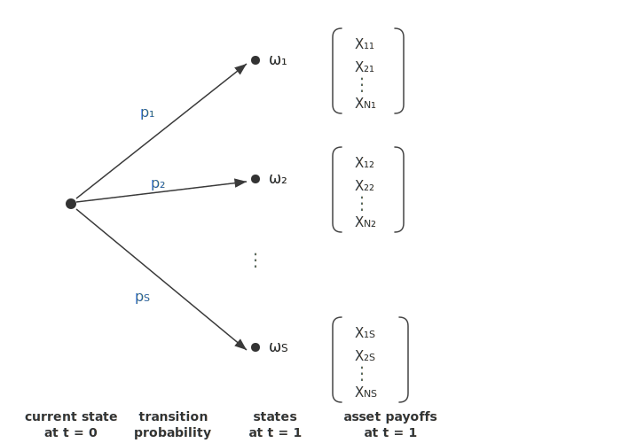

# Arrow-Debreu Securities and State Prices

!!! warning "Incomplete page"
    This page is missing the required five-section structure (Concept Definition, Explanation, Diagram / Example). Content needs to be reorganized and expanded.

Arrow-Debreu securities and state prices are foundational concepts in financial economics that provide a unified framework for pricing any financial asset. Introduced by Kenneth Arrow and Gérard Debreu in the 1950s, these ideas establish the theoretical basis for no-arbitrage pricing, risk-neutral valuation, and the completeness of financial markets.

!!! abstract "Learning Objectives"
    After completing this section, you should understand:
    
    - What Arrow-Debreu securities are and how they define state prices
    - How state prices relate to no-arbitrage conditions and risk-neutral pricing
    - The connection between state prices, stochastic discount factors, and equivalent martingale measures
    - How to extract state prices from observed market prices
    - Practical applications to derivative pricing and portfolio theory

---

## Setup: A Discrete-State Economy

Consider a single-period economy with time $t = 0$ (today) and $t = 1$ (future). At $t = 1$, exactly one of $S$ possible **states of the world** $\omega_1, \omega_2, \ldots, \omega_S$ will occur. Each state $\omega_s$ occurs with a known physical (real-world) probability $p_s > 0$, where

$$
\sum_{s=1}^{S} p_s = 1
$$

There are $N$ traded assets in this economy. Asset $j$ has a known price $P_j$ at $t = 0$ and delivers a state-contingent payoff $X_j(\omega_s) = X_{js}$ at $t = 1$. We can organize these payoffs into a **payoff matrix**:

$$
\mathbf{X} = \begin{pmatrix} X_{11} & X_{12} & \cdots & X_{1S} \\ X_{21} & X_{22} & \cdots & X_{2S} \\ \vdots & \vdots & \ddots & \vdots \\ X_{N1} & X_{N2} & \cdots & X_{NS} \end{pmatrix}
$$

where row $j$ represents the payoffs of asset $j$ across all states, and column $s$ represents the payoffs of all assets in state $s$.

<figure markdown="span">
  
  <figcaption markdown="span">Figure 1: A single-period economy. From the current state at $t = 0$, the economy transitions with probabilities $p_1, p_2, \ldots, p_S$ into one of $S$ possible states at $t = 1$. Each state $\omega_s$ determines a column of the payoff matrix $\mathbf{X}$, giving the payoffs $(X_{1s}, X_{2s}, \ldots, X_{Ns})^\top$ for all $N$ assets.</figcaption>
</figure>

---

## Arrow-Debreu Securities

### Definition

!!! info "Definition: Arrow-Debreu Security"
    An **Arrow-Debreu security** (also called a **pure state security** or **primitive security**) for state $s$ is a financial contract that pays exactly **1 unit of currency** if state $\omega_s$ occurs and **0** in all other states.

Formally, the Arrow-Debreu security for state $s$ has the payoff vector:

$$
\mathbf{e}_s = (0, \ldots, 0, \underbrace{1}_{s\text{-th position}}, 0, \ldots, 0)^\top
$$

If we have $S$ states, there are $S$ possible Arrow-Debreu securities $\mathbf{e}_1, \mathbf{e}_2, \ldots, \mathbf{e}_S$, which together form the **identity matrix** $\mathbf{I}_S$.

### Intuition

Arrow-Debreu securities isolate and "price" individual states of the world. They decompose uncertainty into its most elementary components. Any asset with an arbitrary payoff profile can be viewed as a portfolio of Arrow-Debreu securities:

$$
\text{If asset } j \text{ pays } X_{js} \text{ in state } s, \text{ then: } \quad \mathbf{X}_j = \sum_{s=1}^{S} X_{js} \, \mathbf{e}_s
$$

This makes Arrow-Debreu securities the "building blocks" of all financial claims.

!!! example "Example: Two-State Economy"
    Suppose the economy has two states: **Boom** ($\omega_1$) and **Recession** ($\omega_2$).
    
    - The Arrow-Debreu security for Boom pays $(1, 0)$: you receive \$1 if the economy booms, \$0 otherwise.
    - The Arrow-Debreu security for Recession pays $(0, 1)$: you receive \$1 if recession occurs, \$0 otherwise.
    
    A stock that pays \$120 in Boom and \$80 in Recession is equivalent to holding 120 units of the Boom Arrow-Debreu security and 80 units of the Recession Arrow-Debreu security.

---

## State Prices

### Definition

!!! info "Definition: State Price"
    The **state price** $\phi_s$ is the price at $t = 0$ of the Arrow-Debreu security for state $s$. That is, $\phi_s$ is the cost today of receiving \$1 if and only if state $\omega_s$ occurs at $t = 1$.

The vector of state prices is:

$$
\boldsymbol{\phi} = (\phi_1, \phi_2, \ldots, \phi_S)^\top
$$

### Pricing Any Asset with State Prices

If state prices exist, the price of **any** asset $j$ with payoffs $(X_{j1}, X_{j2}, \ldots, X_{jS})$ is simply:

$$
\boxed{P_j = \sum_{s=1}^{S} \phi_s \, X_{js} = \boldsymbol{\phi}^\top \mathbf{X}_j}
$$

This is the **fundamental pricing equation**. It says that an asset's price equals the sum of its payoffs in each state, weighted by the state prices.

In matrix form for all $N$ assets:

$$
\mathbf{P} = \mathbf{X} \, \boldsymbol{\phi}
$$

where $\mathbf{P} = (P_1, P_2, \ldots, P_N)^\top$ is the vector of asset prices.

### Properties of State Prices

!!! tip "Key Properties"
    Under the assumption of **no arbitrage**:

    1. **Positivity**: $\phi_s > 0$ for all $s = 1, 2, \ldots, S$. Every state is "valuable" — investors are willing to pay a positive price for insurance against any possible state.
    
    2. **Sum relates to the risk-free rate**: If a risk-free bond exists paying \$1 in every state, its price is
    
    $$
    P_{\text{rf}} = \sum_{s=1}^{S} \phi_s = \frac{1}{1 + r_f}
    $$
    
    where $r_f$ is the one-period risk-free interest rate. Thus, $\sum_s \phi_s < 1$ when $r_f > 0$.
    
    3. **Linearity**: Pricing is linear — the price of a portfolio equals the portfolio of prices.

---

## No-Arbitrage and the Existence of State Prices

### Arbitrage

An **arbitrage opportunity** is a trading strategy that costs nothing (or less) today and yields a non-negative payoff in all future states with a strictly positive payoff in at least one state. Formally, a portfolio $\boldsymbol{\theta} = (\theta_1, \ldots, \theta_N)^\top$ is an arbitrage if:

$$
\boldsymbol{\theta}^\top \mathbf{P} \leq 0, \quad \mathbf{X}^\top \boldsymbol{\theta} \geq \mathbf{0}, \quad \text{and} \quad \mathbf{X}^\top \boldsymbol{\theta} \neq \mathbf{0}
$$

### The Fundamental Theorem (First Version)

!!! success "Theorem: No-Arbitrage $\iff$ Existence of Positive State Prices"
    There are **no arbitrage opportunities** in the market if and only if there exists a strictly positive state price vector $\boldsymbol{\phi} \gg \mathbf{0}$ such that:
    
    $$
    \mathbf{P} = \mathbf{X} \, \boldsymbol{\phi}
    $$

This is a form of the **First Fundamental Theorem of Asset Pricing** in finite-state settings. It connects the economic condition (no free lunch) to a mathematical condition (existence of positive pricing functionals).

**Proof sketch**:

- ($\Leftarrow$) If $\boldsymbol{\phi} \gg 0$ exists, then any portfolio $\boldsymbol{\theta}$ with $\mathbf{X}^\top \boldsymbol{\theta} \geq 0$ must have $\boldsymbol{\theta}^\top \mathbf{P} = \boldsymbol{\theta}^\top \mathbf{X} \boldsymbol{\phi} \geq 0$, ruling out arbitrage.
- ($\Rightarrow$) Follows from the **Separating Hyperplane Theorem** (Farkas' Lemma): if no arbitrage exists, the set of achievable payoffs and the positive orthant can be separated, implying the existence of $\boldsymbol{\phi} \gg 0$.

---

## State Prices and Risk-Neutral Pricing

### Constructing the Risk-Neutral Measure

State prices naturally give rise to **risk-neutral probabilities**. Define:

$$
\boxed{q_s = \phi_s \,(1 + r_f) = \frac{\phi_s}{\sum_{k=1}^{S} \phi_k}}
$$

Since $\phi_s > 0$ for all $s$ and $\sum_s q_s = 1$, the $q_s$ form a valid probability measure $\mathbb{Q}$, called the **risk-neutral measure** (or **equivalent martingale measure**).

### Risk-Neutral Pricing Formula

Under $\mathbb{Q}$, the fundamental pricing equation becomes:

$$
P_j = \sum_{s=1}^{S} \phi_s \, X_{js} = \frac{1}{1+r_f} \sum_{s=1}^{S} q_s \, X_{js} = \frac{1}{1+r_f} \, \mathbb{E}^{\mathbb{Q}}[X_j]
$$

$$
\boxed{P_j = \frac{\mathbb{E}^{\mathbb{Q}}[X_j]}{1 + r_f}}
$$

!!! tip "Interpretation"
    Under the risk-neutral measure, every asset earns the risk-free rate in expectation. The asset price equals the **discounted expected payoff under $\mathbb{Q}$**. This is not because investors are risk-neutral — rather, risk aversion is already embedded in the distortion from $p_s$ to $q_s$.

### Comparing Physical and Risk-Neutral Probabilities

| State | Physical Prob. $p_s$ | State Price $\phi_s$ | Risk-Neutral Prob. $q_s$ |
|:---:|:---:|:---:|:---:|
| Boom | High | Low (relative to $p_s$) | Low |
| Recession | Low | High (relative to $p_s$) | High |

Risk-neutral probabilities **overweight bad states** (where marginal utility is high) and **underweight good states** relative to physical probabilities. This reflects the market's aggregate risk aversion.

---

## Stochastic Discount Factor (Pricing Kernel)

The **stochastic discount factor** (SDF), also called the **pricing kernel**, connects state prices to physical probabilities:

$$
\boxed{m_s = \frac{\phi_s}{p_s}}
$$

The SDF allows us to write the pricing equation using physical probabilities:

$$
P_j = \sum_{s=1}^{S} \phi_s \, X_{js} = \sum_{s=1}^{S} p_s \, m_s \, X_{js} = \mathbb{E}^{\mathbb{P}}[m \cdot X_j]
$$

$$
\boxed{P_j = \mathbb{E}^{\mathbb{P}}[m \cdot X_j]}
$$

!!! info "Interpretation of the SDF"
    - $m_s$ reflects the **marginal rate of substitution** between consumption today and consumption in state $s$.
    - In equilibrium models (e.g., CCAPM), $m_s = \beta \frac{u'(C_1(\omega_s))}{u'(C_0)}$, where $\beta$ is the time discount factor and $u$ is the utility function.
    - The SDF is high in "bad" states (low consumption) and low in "good" states (high consumption).

### Relationships Summary

The three representations — state prices, risk-neutral probabilities, and the SDF — are equivalent ways to enforce no-arbitrage:

$$
\phi_s = \frac{q_s}{1 + r_f} = p_s \cdot m_s
$$

| Representation | Pricing Formula | Key Object |
|:---|:---|:---|
| State Prices | $P = \sum_s \phi_s X_s$ | $\phi_s$ |
| Risk-Neutral | $P = \frac{1}{1+r_f}\mathbb{E}^{\mathbb{Q}}[X]$ | $q_s$ |
| SDF / Pricing Kernel | $P = \mathbb{E}^{\mathbb{P}}[m \cdot X]$ | $m_s$ |

---

## Complete Markets

### Definition

!!! info "Definition: Complete Market"
    A market is **complete** if every state-contingent payoff can be replicated by a portfolio of traded assets. Formally, the market is complete if for any payoff vector $\mathbf{c} \in \mathbb{R}^S$, there exists a portfolio $\boldsymbol{\theta} \in \mathbb{R}^N$ such that $\mathbf{X}^\top \boldsymbol{\theta} = \mathbf{c}$.

This requires $\text{rank}(\mathbf{X}) = S$, which in turn requires $N \geq S$ (at least as many assets as states).

### Uniqueness of State Prices

!!! success "Theorem: Completeness $\iff$ Unique State Prices"
    If the market is arbitrage-free, then:

    - **Complete market**: The state price vector $\boldsymbol{\phi}$ is **unique**. There is a unique risk-neutral measure $\mathbb{Q}$ and a unique SDF.
    - **Incomplete market**: Multiple state price vectors (and risk-neutral measures) are consistent with no-arbitrage. Assets can be priced, but not all contingent claims have a unique price.

This is related to the **Second Fundamental Theorem of Asset Pricing**.

!!! example "Example: Complete vs. Incomplete"
    **Complete**: 3 states, 3 linearly independent assets $\Rightarrow$ $\text{rank}(\mathbf{X}) = 3 = S$ $\Rightarrow$ unique $\boldsymbol{\phi}$.
    
    **Incomplete**: 3 states, 2 assets $\Rightarrow$ $\text{rank}(\mathbf{X}) \leq 2 < 3$ $\Rightarrow$ infinitely many $\boldsymbol{\phi}$ consistent with no-arbitrage.

---

## Extracting State Prices from Market Data

### From Observed Prices

Given $N$ assets with price vector $\mathbf{P}$ and payoff matrix $\mathbf{X}$, state prices solve:

$$
\mathbf{X} \, \boldsymbol{\phi} = \mathbf{P}
$$

- If $N = S$ and $\mathbf{X}$ has full rank: $\boldsymbol{\phi} = \mathbf{X}^{-1} \mathbf{P}$ (unique solution).
- If $N > S$: overdetermined system; use least squares or check consistency.
- If $N < S$: underdetermined; infinitely many solutions (incomplete market).

### Numerical Example

!!! example "Extracting State Prices: Two-State Example"
    Consider two states (Boom, Recession) and two assets:
    
    - **Risk-free bond**: Price = \$0.95, pays \$1 in both states.
    - **Stock**: Price = \$50, pays \$70 in Boom, \$40 in Recession.
    
    The payoff matrix and price vector are:
    
    $$
    \mathbf{X} = \begin{pmatrix} 1 & 1 \\ 70 & 40 \end{pmatrix}, \quad \mathbf{P} = \begin{pmatrix} 0.95 \\ 50 \end{pmatrix}
    $$
    
    Solving $\mathbf{X} \boldsymbol{\phi} = \mathbf{P}$:
    
    $$
    \begin{cases} \phi_1 + \phi_2 = 0.95 \\ 70\phi_1 + 40\phi_2 = 50 \end{cases}
    $$
    
    From the first equation: $\phi_2 = 0.95 - \phi_1$. Substituting:
    
    $$
    70\phi_1 + 40(0.95 - \phi_1) = 50 \implies 30\phi_1 = 12 \implies \phi_1 = 0.4
    $$
    
    $$
    \phi_2 = 0.95 - 0.4 = 0.55
    $$
    
    **Results**:
    
    | | Boom ($\omega_1$) | Recession ($\omega_2$) |
    |:---|:---:|:---:|
    | State Price $\phi_s$ | 0.40 | 0.55 |
    | Risk-Neutral Prob. $q_s = \phi_s / 0.95$ | 0.4211 | 0.5789 |
    
    Note that $\phi_2 > \phi_1$: the market prices recession insurance more highly than boom insurance, reflecting aggregate risk aversion. The risk-neutral probability of recession (0.5789) exceeds its physical probability (which might be, say, 0.3), distorting probabilities toward the "bad" state.

---

## From Option Prices: The Breeden-Litzenberger Result

In continuous-state settings, state prices can be extracted from **European option prices**. If $C(K)$ denotes the price of a European call option with strike $K$ on an asset with terminal price $S_T$, and the state price density is $\phi(s)$, then:

$$
C(K) = \int_K^{\infty} (s - K) \, \phi(s) \, ds
$$

Differentiating twice with respect to $K$:

$$
\boxed{\phi(K) = e^{r_f T} \frac{\partial^2 C}{\partial K^2}\bigg|_{K}}
$$

This is the **Breeden-Litzenberger formula**. It shows that the curvature of the call price function with respect to the strike price reveals the state price density (and hence the risk-neutral density).

!!! tip "Practical Implication"
    Butterfly spreads (long calls at $K - \Delta K$ and $K + \Delta K$, short two calls at $K$) approximate $\frac{\partial^2 C}{\partial K^2}$ and thus provide discrete estimates of state prices. This is the basis for extracting implied risk-neutral distributions from option markets.

---

## Multi-Period Extension

In a multi-period setting with times $t = 0, 1, \ldots, T$, the state price framework extends naturally via **state-price processes**.

### State-Price Deflator

A **state-price deflator** (or **numeraire portfolio process**) $\{\pi_t\}$ satisfies:

$$
P_t^{(j)} = \frac{1}{\pi_t} \mathbb{E}_t^{\mathbb{P}}[\pi_T \cdot X_T^{(j)}]
$$

for any asset $j$, where $\mathbb{E}_t^{\mathbb{P}}[\cdot]$ denotes the conditional expectation under the physical measure given information at time $t$.

### Recursive Pricing

Between any two adjacent periods $t$ and $t+1$:

$$
P_t = \mathbb{E}_t^{\mathbb{P}}[m_{t+1} \cdot (P_{t+1} + D_{t+1})]
$$

where $m_{t+1} = \pi_{t+1}/\pi_t$ is the **one-period SDF** and $D_{t+1}$ is any intermediate dividend.

---

## Connections to Other Topics

!!! note "Broader Context"
    State prices and Arrow-Debreu securities connect to many central topics in financial mathematics:
    
    - **Risk-Neutral Valuation**: State prices provide the discrete foundation for the risk-neutral pricing approach used in continuous-time models (Black-Scholes, etc.).
    - **Fundamental Theorems of Asset Pricing**: The existence and uniqueness of state prices correspond to the first and second fundamental theorems.
    - **Derivative Pricing**: Options and other derivatives are priced as portfolios of Arrow-Debreu securities.
    - **Term Structure Models**: State prices across maturities determine the yield curve and the prices of zero-coupon bonds.
    - **Portfolio Theory**: Complete markets allow perfect hedging; incomplete markets require optimization under constraints.
    - **Consumption-Based Models**: The SDF interpretation links asset pricing to macroeconomic fundamentals via the Euler equation.

---

## Summary

| Concept | Definition | Key Formula |
|:---|:---|:---|
| Arrow-Debreu Security | Pays \$1 in one state, \$0 otherwise | Payoff $= \mathbf{e}_s$ |
| State Price $\phi_s$ | Price of the Arrow-Debreu security for state $s$ | $P_j = \sum_s \phi_s X_{js}$ |
| Risk-Neutral Probability $q_s$ | $\phi_s$ rescaled to sum to 1 | $q_s = \phi_s(1+r_f)$ |
| Stochastic Discount Factor $m_s$ | State price per unit probability | $m_s = \phi_s / p_s$ |
| Complete Market | Every payoff is replicable | $\text{rank}(\mathbf{X}) = S$ |
| Breeden-Litzenberger | State prices from option prices | $\phi(K) = e^{rT} \partial^2 C / \partial K^2$ |

---
