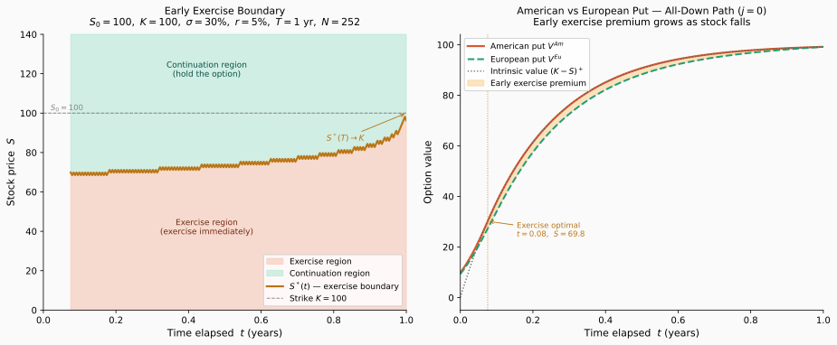

# American Options on Trees

## Introduction

A European option can only be exercised at maturity, but many traded options — particularly equity puts — grant the holder the right to exercise at **any time** before expiration. This early exercise feature fundamentally changes the pricing problem: at every node of the binomial tree, the holder must decide whether to exercise immediately or continue holding. The American option price is therefore the solution to an **optimal stopping problem**, computed via backward induction with an exercise check at each node.

This section develops the complete theory and practice of American option pricing on binomial trees. We formulate the optimal stopping problem, derive the backward induction algorithm, characterize the American price process as a **Snell envelope** (the smallest supermartingale dominating the payoff), prove that early exercise of an American call on a non-dividend-paying stock is never optimal, and study the early exercise boundary. A detailed numerical example ties the theory together.

!!! info "Prerequisites"

    - [Binomial Model](../binomial_model/binomial_model.md) (one-period setup, stock dynamics)
    - [Risk-Neutral Measure](../binomial_model/risk_neutral_measure.md) (risk-neutral probability $q$, expectation pricing)
    - [Multi-Period Binomial Model](multi_period_binomial_model.md) (tree construction, backward induction for European options)

!!! abstract "Learning Objectives"
    By the end of this section, you will be able to:

    1. Price American put and call options on a binomial tree using backward induction
    2. Formulate the American pricing problem as an optimal stopping problem
    3. Identify the optimal exercise boundary on a multi-period tree
    4. Prove that early exercise of an American call on a non-dividend-paying stock is never optimal
    5. Explain the Snell envelope characterization and the supermartingale property
    6. Compute the early exercise premium numerically

---

## American versus European Options

### Exercise Rights

A **European option** with payoff function $\Phi$ and maturity $T$ pays $\Phi(S_T)$ at time $T$ only. An **American option** with the same payoff function allows the holder to receive $\Phi(S_\tau)$ at any stopping time $\tau \leq T$ of their choosing.

On a binomial tree with $N$ periods, this means the holder can exercise at any node $(n, j)$ for $n = 0, 1, \ldots, N$. The holder's goal is to choose the exercise time that **maximizes the expected discounted payoff** under the risk-neutral measure.

### Why Early Exercise Matters

Consider an American put with strike $K$ on a stock that has fallen deeply. The intrinsic value $(K - S)^+$ is large, while the continuation value — the discounted expected future payoff — may be smaller because the stock is unlikely to fall much further. In such cases, exercising immediately is more valuable than waiting. This possibility of early exercise means the American put is worth **at least as much** as the corresponding European put:

$$
V_0^{\text{Am}} \geq V_0^{\text{Eu}}
$$

The difference $V_0^{\text{Am}} - V_0^{\text{Eu}}$ is called the **early exercise premium**.

---

## The Optimal Stopping Problem

### Setup and Notation

Recall (see [§ Multi-Period Binomial Model — Tree](multi_period_binomial_model.md#the-multi-period-tree)): the $N$-period CRR tree with $S_{n,j}=S_0 u^j d^{n-j}$, $u=e^{\sigma\sqrt{\Delta t}}$, $d=1/u$, $\Delta t = T/N$, and risk-neutral probability $q=(e^{r\Delta t}-d)/(u-d)$ under $\mathbb{Q}$.

The **intrinsic value** (immediate exercise payoff) at node $(n, j)$ is:

$$
h_{n,j} = \Phi(S_{n,j})
$$

For an American put with strike $K$: $h_{n,j} = (K - S_{n,j})^+$. For an American call: $h_{n,j} = (S_{n,j} - K)^+$.

### Formulation

The American option price at time $0$ is the solution to the optimal stopping problem:

$$
\boxed{V_0 = \sup_{\tau \in \mathcal{T}_{0,N}} \mathbb{E}^{\mathbb{Q}}\!\left[e^{-r\tau\Delta t}\,\Phi(S_\tau)\right]}
$$

where $\mathcal{T}_{0,N}$ is the set of all stopping times taking values in $\{0, 1, \ldots, N\}$ with respect to the filtration generated by the stock price process.

The supremum is taken over all **admissible exercise strategies** — the holder optimizes the exercise decision using only information available at the time of exercise (the stopping time must be adapted to the filtration).

---

## Backward Induction for American Options

### The Algorithm

The key insight is that the optimal stopping problem can be solved by **backward induction**. At each node, the holder compares two quantities:

1. **Intrinsic value**: the payoff from immediate exercise, $h_{n,j}$
2. **Continuation value**: the discounted risk-neutral expectation of the option value one period ahead

The American option value at each node is the **maximum** of these two:

**Step 1: Terminal condition** ($n = N$)

At maturity, there is no continuation — the option is exercised if in the money:

$$
V_{N,j} = h_{N,j} = \Phi(S_{N,j}), \quad j = 0, 1, \ldots, N
$$

**Step 2: Backward recursion** ($n = N-1, N-2, \ldots, 0$)

At each node $(n, j)$, compute the continuation value and compare to the intrinsic value:

$$
\boxed{V_{n,j} = \max\!\Big(h_{n,j},\; e^{-r\Delta t}\!\left[q\,V_{n+1,j+1} + (1-q)\,V_{n+1,j}\right]\Big)}
$$

**Step 3: Output**

The American option price is $V_{0,0}$.

### Exercise Decision

At each node $(n,j)$, the backward induction also determines the **optimal exercise policy**:

- If $h_{n,j} > e^{-r\Delta t}[q\,V_{n+1,j+1} + (1-q)\,V_{n+1,j}]$: **exercise** at this node
- If $h_{n,j} \leq e^{-r\Delta t}[q\,V_{n+1,j+1} + (1-q)\,V_{n+1,j}]$: **hold** (continue)

The **optimal stopping time** is:

$$
\tau^* = \min\{n \geq 0 : V_{n,j} = h_{n,j}\}
$$

That is, the first time the option value equals the intrinsic value — the first time the holder would prefer to exercise rather than continue.

### Comparison with European Pricing

Recall (see [§ Multi-Period Binomial Model — Backward Induction](multi_period_binomial_model.md#backward-induction-for-european-options)): the European recursion is $V_{n,j}^{\text{Eu}} = e^{-r\Delta t}[qV_{n+1,j+1}^{\text{Eu}}+(1-q)V_{n+1,j}^{\text{Eu}}]$. The American recursion adds the $\max$ with the intrinsic value, so $V_{n,j} \geq V_{n,j}^{\text{Eu}}$ at every node.

---

## The Snell Envelope

This is the theoretical name for the recursion above: the American option price process $\{V_n\}$ is the **Snell envelope** of the discounted payoff $\{h_n\}$ — the smallest $\mathbb{Q}$-supermartingale dominating $\{h_n\}$. The defining recursion

$$
U_N = h_N, \qquad U_n = \max\!\big(h_n,\; \mathbb{E}^{\mathbb{Q}}[e^{-r\Delta t} U_{n+1} \mid \mathcal{F}_n]\big)
$$

coincides with the American backward induction. In particular, $\{\tilde{V}_n = e^{-rn\Delta t}V_n\}$ is a $\mathbb{Q}$-supermartingale, equality holding precisely at exercise nodes.

### Optimal Stopping and the Snell Envelope

The connection between the Snell envelope and optimal stopping is:

$$
U_0 = \sup_{\tau \in \mathcal{T}_{0,N}} \mathbb{E}^{\mathbb{Q}}\!\left[e^{-r\tau\Delta t}\,h_\tau\right]
$$

and the optimal stopping time is:

$$
\tau^* = \min\{n \geq 0 : U_n = h_n\}
$$

At the optimal stopping time, the supermartingale "touches" the payoff process. Before $\tau^*$, the Snell envelope strictly exceeds the intrinsic value — the option is worth more alive than dead.

---

## American Call on a Non-Dividend-Paying Stock

One of the most important results in option pricing theory is that early exercise of an American call on a non-dividend-paying stock is **never optimal**.

!!! note "Theorem (No Early Exercise for American Calls)"
    For a call option on a non-dividend-paying stock, the American call price equals the European call price:

    $$
    V_n^{\text{Am, call}} = V_n^{\text{Eu, call}} \quad \text{for all } n
    $$

    Early exercise is never optimal.

??? example "Proof"
    We show that at every node $(n, j)$ with $n < N$, the continuation value strictly exceeds the intrinsic value whenever the call is in the money.

    The continuation value at node $(n, j)$ satisfies:

    $$
    C_{n,j} = e^{-r\Delta t}\!\left[q\,V_{n+1,j+1} + (1-q)\,V_{n+1,j}\right]
    $$

    Since $V_{n+1,k} \geq (S_{n+1,k} - K)^+$ at every node $k$, we have in particular $V_{n+1,k} \geq S_{n+1,k} - K$. Therefore:

    $$
    C_{n,j} \geq e^{-r\Delta t}\!\left[q(S_{n+1,j+1} - K) + (1-q)(S_{n+1,j} - K)\right]
    $$

    $$
    = e^{-r\Delta t}\!\left[q\,S_{n+1,j+1} + (1-q)\,S_{n+1,j}\right] - K\,e^{-r\Delta t}
    $$

    By the risk-neutral pricing of the stock (the discounted stock is a martingale under $\mathbb{Q}$):

    $$
    e^{-r\Delta t}\!\left[q\,S_{n+1,j+1} + (1-q)\,S_{n+1,j}\right] = S_{n,j}
    $$

    Substituting:

    $$
    C_{n,j} \geq S_{n,j} - K\,e^{-r\Delta t} > S_{n,j} - K = h_{n,j}
    $$

    where the strict inequality holds because $r > 0$ and $n < N$, so $e^{-r\Delta t} < 1$. Since the continuation value strictly exceeds the intrinsic value at every pre-terminal node, the $\max$ in the American recursion always selects the continuation value. The American and European recursions therefore produce identical values at every node. $\square$

!!! tip "Financial Intuition"
    Why is early exercise suboptimal for a call? By exercising early, the holder:

    - **Pays $K$ today** instead of the discounted amount $K\,e^{-r(T-t)}$ at maturity — forfeiting the interest earned on $K$
    - **Gives up the downside protection** — if the stock falls below $K$, the unexercised option expires worthless (loss capped at the premium), but exercised shares lose value

    For puts, the situation reverses: early exercise **receives** $K$ today, earning interest, and the downside protection argument does not apply. This is why American puts can have an early exercise premium while American calls on non-dividend-paying stocks do not.

---

## The Early Exercise Boundary

### Definition

For an American put, the **early exercise boundary** at time step $n$ is the critical stock price $S_n^*$ below which immediate exercise is optimal:

- If $S_{n,j} \leq S_n^*$: exercise (intrinsic value $\geq$ continuation value)
- If $S_{n,j} > S_n^*$: hold (continuation value $>$ intrinsic value)

The set of nodes where exercise is optimal is called the **exercise region** (or **stopping region**), and the complement is the **continuation region**.

### Properties of the Early Exercise Boundary

The early exercise boundary for an American put has several important properties:

1. **At maturity** ($n = N$): $S_N^* = K$. Every in-the-money node is exercised.

2. **Before maturity** ($n < N$): $S_n^* < K$. The boundary lies strictly below the strike because even slightly in-the-money puts have positive continuation value.

3. **Monotonicity**: As time to maturity decreases (moving from left to right on the tree), the exercise boundary generally **increases** toward $K$. With less time remaining, the continuation value decreases, making early exercise optimal at higher stock prices.

4. **Convergence**: As $N \to \infty$ and $\Delta t \to 0$, the discrete exercise boundary converges to the continuous-time **free boundary** $S^*(t)$ of the Black–Scholes American put problem.

### Visualization on the Tree

On a binomial tree, the exercise boundary separates the nodes into two regions:

<figure markdown="span">
  
  <figcaption markdown="span">**Figure 1:** Early exercise boundary on the 3-period binomial tree ($S_0 = 100$, $K = 100$, $\sigma = 30\%$, $r = 5\%$, $T = 1$, $N = 3$). Teal nodes lie in the continuation region; coral nodes lie in the exercise region; gray nodes expire out-of-the-money. The amber dashed curve is the early exercise boundary. Node $(2, 0)$ at $S = \$70.83$ is the sole interior exercise node, where intrinsic value \$29.17 exceeds continuation value \$27.51.</figcaption>
</figure>

The dashed line separating the two regions is the early exercise boundary.

---

## Worked Example: American Put on a 3-Period Tree

### Parameters

| Parameter | Value |
|-----------|-------|
| $S_0$ | \$100 |
| $K$ | \$100 |
| $r$ | $5\%$ per year |
| $\sigma$ | $30\%$ per year |
| $T$ | $1$ year |
| $N$ | $3$ periods |

### Computed Constants

$$
\Delta t = \frac{1}{3}, \quad u = e^{0.30\sqrt{1/3}} = 1.1882, \quad d = \frac{1}{u} = 0.8416
$$

$$
e^{r\Delta t} = e^{0.05/3} = 1.0168, \quad q = \frac{1.0168 - 0.8416}{1.1882 - 0.8416} = 0.5056
$$

### Stock Price Tree

$$
S_{n,j} = 100 \times (1.1882)^j \times (0.8416)^{n-j}
$$

| Node | Stock Price |
|------|-------------|
| $S_{0,0}$ | \$100.00 |
| $S_{1,1}$ | \$118.82 |
| $S_{1,0}$ | \$84.16 |
| $S_{2,2}$ | \$141.18 |
| $S_{2,1}$ | \$100.00 |
| $S_{2,0}$ | \$70.83 |
| $S_{3,3}$ | \$167.77 |
| $S_{3,2}$ | \$118.82 |
| $S_{3,1}$ | \$84.16 |
| $S_{3,0}$ | \$59.60 |

<figure markdown="span">
  
  <figcaption markdown="span">**Figure 2:** Stock price tree for the 3-period example ($S_0 = 100$, $u = 1.1882$, $d = 0.8416$). The CRR parametrization $d = 1/u$ gives a recombining tree with $n + 1$ distinct prices at time step $n$. Each node $(n, j)$ carries price $S_{n,j} = S_0\, u^j\, d^{n-j}$; subscripts show the index $(n, j)$.</figcaption>
</figure>

### Step-by-Step Backward Induction

**Terminal payoffs** ($n = 3$): $h_{3,j} = (100 - S_{3,j})^+$

$$
V_{3,3} = 0, \quad V_{3,2} = 0, \quad V_{3,1} = 15.84, \quad V_{3,0} = 40.40
$$

**At $n = 2$**: Compare intrinsic value to continuation value at each node.

*Node $(2, 2)$*: $S_{2,2} = 141.18$

- Intrinsic: $(100 - 141.18)^+ = 0$
- Continuation: $e^{-0.0167}[0.5056 \times 0 + 0.4944 \times 0] = 0$
- $V_{2,2} = \max(0,\; 0) = 0$ — **Hold**

*Node $(2, 1)$*: $S_{2,1} = 100.00$

- Intrinsic: $(100 - 100)^+ = 0$
- Continuation: $e^{-0.0167}[0.5056 \times 0 + 0.4944 \times 15.84] = 0.9834 \times 7.83 = 7.70$
- $V_{2,1} = \max(0,\; 7.70) = 7.70$ — **Hold**

*Node $(2, 0)$*: $S_{2,0} = 70.83$

- Intrinsic: $(100 - 70.83)^+ = 29.17$
- Continuation: $e^{-0.0167}[0.5056 \times 15.84 + 0.4944 \times 40.40] = 0.9834 \times 27.98 = 27.51$
- $V_{2,0} = \max(29.17,\; 27.51) = 29.17$ — **Exercise!**

!!! warning "Early Exercise at Node (2, 0)"
    At node $(2, 0)$ the stock price is \$70.83. The intrinsic value \$29.17 exceeds the continuation value \$27.51, so the holder should exercise the put immediately. By exercising, the holder receives \$29.17 today and can invest at the risk-free rate, which dominates the expected future payoff.

**At $n = 1$**:

*Node $(1, 1)$*: $S_{1,1} = 118.82$

- Intrinsic: $(100 - 118.82)^+ = 0$
- Continuation: $e^{-0.0167}[0.5056 \times 0 + 0.4944 \times 7.70] = 0.9834 \times 3.81 = 3.75$
- $V_{1,1} = \max(0,\; 3.75) = 3.75$ — **Hold**

*Node $(1, 0)$*: $S_{1,0} = 84.16$

- Intrinsic: $(100 - 84.16)^+ = 15.84$
- Continuation: $e^{-0.0167}[0.5056 \times 7.70 + 0.4944 \times 29.17] = 0.9834 \times 18.32 = 18.02$
- $V_{1,0} = \max(15.84,\; 18.02) = 18.02$ — **Hold**

**At $n = 0$**:

*Node $(0, 0)$*: $S_{0,0} = 100.00$

- Intrinsic: $(100 - 100)^+ = 0$
- Continuation: $e^{-0.0167}[0.5056 \times 3.75 + 0.4944 \times 18.02] = 0.9834 \times 10.81 = 10.63$
- $V_{0,0} = \max(0,\; 10.63) = 10.63$ — **Hold**

### Summary of Option Values

<figure markdown="span">
  
  <figcaption markdown="span">**Figure 3:** American put option values $V_{n,j}$ on the 3-period tree ($K = 100$, $q = 0.5056$). Teal nodes: continuation value dominates, the holder waits. Coral nodes: intrinsic value dominates, the holder exercises immediately. Gray nodes: option expires worthless. The amber dashed curve is the early exercise boundary; node $(2, 0)$ at $S = \$70.83$ is the sole interior exercise node, contributing the entire early exercise premium of \$0.39.</figcaption>
</figure>

!!! success "American Put Price"

    $$
    P_0^{\text{Am}} = \$10.63
    $$

### European Put Comparison

For the European put with the same parameters, the backward recursion uses only the continuation value (no early exercise check). Repeating the calculation with the European recursion at node $(2, 0)$ gives $V_{2,0}^{\text{Eu}} = 27.51$ instead of $29.17$. Propagating this change backward:

- $V_{1,0}^{\text{Eu}} = e^{-0.0167}[0.5056 \times 7.70 + 0.4944 \times 27.51] = 0.9834 \times 17.50 = 17.21$
- $V_{0,0}^{\text{Eu}} = e^{-0.0167}[0.5056 \times 3.75 + 0.4944 \times 17.21] = 0.9834 \times 10.41 = 10.24$

!!! info "Early Exercise Premium"
    | | Price |
    |---|---|
    | American put | \$10.63 |
    | European put | \$10.24 |
    | **Early exercise premium** | **\$0.39** |

    The early exercise premium arises entirely from node $(2, 0)$, where the holder gains \$1.66 by exercising immediately instead of continuing.

### Exercise Boundary in This Example

The exercise decisions reveal the early exercise boundary:

| Time Step | Exercise Boundary | Exercise Nodes |
|-----------|------------------|----------------|
| $n = 3$ | $S_3^* = K = 100$ | $(3,1)$, $(3,0)$ |
| $n = 2$ | $S_2^* \in (70.83, 100.00)$ | $(2,0)$ |
| $n = 1$ | $S_1^* < 84.16$ | None |
| $n = 0$ | $S_0^* < 100$ | None |

At $n = 2$, the stock price \$70.83 is below the exercise boundary, while \$100.00 is above it. As maturity approaches, the boundary rises toward the strike.

---

## American Put is Worth More Than European Put

By the [comparison established earlier](#comparison-with-european-pricing), the American recursion adds a $\max$ with the intrinsic value, so $V_n^{\text{Am, put}} \geq V_n^{\text{Eu, put}}$ at every node, with strict inequality whenever early exercise is optimal somewhere. A simple backward induction confirms this, using the fact that the $\max$ can only increase the value.

---

## Connection to Continuous Time

### The Free-Boundary Problem

As $N \to \infty$ and $\Delta t \to 0$, the binomial tree converges to a continuous-time model (see [Binomial to Black–Scholes](../binomial_to_black_scholes/binomial_to_black_scholes_limit.md)). In this limit, the American put price $P(S, t)$ satisfies a **free-boundary problem**.

Recall (see [§ Early Exercise — Free-Boundary Formulation](../../ch07/american_options/early_exercise.md)): in the continuation region the price satisfies the Black–Scholes PDE, and on the free boundary $S^*(t)$ both value-matching $P(S^*,t)=K-S^*$ and smooth-pasting $\partial_S P(S^*,t)=-1$ hold.

The discrete early exercise boundary $\{S_n^*\}$ from the binomial tree approximates this continuous free boundary, providing a practical computational method for a problem that has no closed-form solution.

!!! tip "Why Trees Matter for American Options"
    Unlike European options, American options generally have no closed-form pricing formula in continuous time. The binomial tree provides a simple, convergent numerical method. For more on numerical approaches, see [Free Boundary Problems](../../ch08/american_options/free_boundary_problems_american_options.md) and [Linear Complementarity](../../ch08/american_options/linear_complementarity_formulation.md) in the finite difference methods chapter.

---

## Python Implementation: Early Exercise Boundary

The following code builds a CRR binomial tree for an American put over $T = 1$ year with $N = 252$ daily steps, runs dual backward induction to compute both the American and European put values at every node, and extracts the **early exercise boundary** $S^*(n)$ — the highest stock price at each time step where immediate exercise is still optimal. The plot has two panels: the boundary itself (with exercise and continuation regions shaded), and a cross-section comparing American put value, European put value, and intrinsic value at $S_0 = 100$ as a function of time to maturity.

```python
"""
American Put — Early Exercise Boundary
=======================================
Builds a CRR binomial tree, runs backward induction for both the
American and European put, extracts the early exercise boundary
S*(n) at each time step, and plots a two-panel figure.

Parameters match the textbook's running example:
  S0=100, K=100, r=5%, sigma=30%, T=1 year.
"""

import numpy as np
import matplotlib.pyplot as plt
import matplotlib.patches as mpatches

# ── Parameters ────────────────────────────────────────────────────────────────
S0    = 100.0
K     = 100.0
r     = 0.05
sigma = 0.30
T     = 1.0

TRADING_DAYS_PER_YEAR = 252
N  = round(T * TRADING_DAYS_PER_YEAR)
dt = T / N

# ── CRR Parameters ────────────────────────────────────────────────────────────
u = np.exp(sigma * np.sqrt(dt))
d = 1.0 / u
R = np.exp(r * dt)
q = (R - d) / (u - d)

# ── Stock-Price Tree  S[n, j] = S0 · u^j · d^(n-j) ──────────────────────────
S = np.zeros((N + 1, N + 1))
for n in range(N + 1):
    for j in range(n + 1):
        S[n, j] = S0 * (u ** j) * (d ** (n - j))

# ── Backward Induction: American and European Put ─────────────────────────────
V_Am = np.zeros((N + 1, N + 1))
V_Eu = np.zeros((N + 1, N + 1))

for j in range(N + 1):
    V_Am[N, j] = max(K - S[N, j], 0.0)
    V_Eu[N, j] = max(K - S[N, j], 0.0)

for n in range(N - 1, -1, -1):
    for j in range(n + 1):
        intrinsic = max(K - S[n, j], 0.0)
        cont_am   = np.exp(-r * dt) * (q * V_Am[n+1, j+1] + (1-q) * V_Am[n+1, j])
        V_Am[n, j] = max(intrinsic, cont_am)
        V_Eu[n, j] = np.exp(-r * dt) * (q * V_Eu[n+1, j+1] + (1-q) * V_Eu[n+1, j])

print(f"American put  V(0,0) = {V_Am[0, 0]:.4f}")
print(f"European put  V(0,0) = {V_Eu[0, 0]:.4f}")
print(f"Early exercise premium = {V_Am[0,0] - V_Eu[0,0]:.4f}")

# ── Early Exercise Boundary  S*(n) ───────────────────────────────────────────
# S*(n): the highest stock price at time n where exercise is still optimal,
# i.e. intrinsic(n,j) >= continuation(n,j).  Returns NaN if no such node.

boundary = np.full(N + 1, np.nan)
for n in range(N + 1):
    for j in range(n + 1):
        intrinsic = max(K - S[n, j], 0.0)
        if n == N:
            is_exercise = intrinsic > 0
        else:
            cont = np.exp(-r * dt) * (q * V_Am[n+1, j+1] + (1-q) * V_Am[n+1, j])
            is_exercise = intrinsic >= cont and intrinsic > 0
        if is_exercise:
            if np.isnan(boundary[n]) or S[n, j] > boundary[n]:
                boundary[n] = S[n, j]

# ── Time axis in years (time elapsed from t=0) ───────────────────────────────
time_steps = np.arange(N + 1) * dt   # t = n * dt  (years elapsed)

# ── Cross-section at j=0 (all-down path from S0) ─────────────────────────────
# For the value-vs-time panel we hold j=0 constant, so stock falls to S[n,0]
# and we read off V_Am[n,0], V_Eu[n,0], intrinsic[n,0].
s_path    = np.array([S[n, 0]             for n in range(N + 1)])
v_am_path = np.array([V_Am[n, 0]          for n in range(N + 1)])
v_eu_path = np.array([V_Eu[n, 0]          for n in range(N + 1)])
intr_path = np.array([max(K - S[n,0], 0.) for n in range(N + 1)])

# first time step where j=0 node is in the exercise region
first_ex = next(
    (n for n in range(N+1) if not np.isnan(boundary[n]) and S[n,0] <= boundary[n]),
    None
)

# ── Plot ──────────────────────────────────────────────────────────────────────
fig, axes = plt.subplots(1, 2, figsize=(13, 5.5))
fig.patch.set_facecolor('#FAFAFA')

# ── Panel 1: Early exercise boundary ─────────────────────────────────────────
ax = axes[0]
ax.set_facecolor('#FAFAFA')

valid = ~np.isnan(boundary)
t_valid = time_steps[valid]
b_valid = boundary[valid]

# shade exercise region (below boundary)
ax.fill_between(t_valid, b_valid, 0,
                color='#F5C4B3', alpha=0.6, label='Exercise region')
# shade continuation region (above boundary, up to 1.4K)
ax.fill_between(t_valid, b_valid, K * 1.4,
                color='#9FE1CB', alpha=0.45, label='Continuation region')
# boundary curve
ax.plot(t_valid, b_valid,
        color='#BA7517', linewidth=2.2, label=r'$S^*(t)$ — exercise boundary')
# strike line
ax.axhline(K, color='#5F5E5A', linewidth=1.0, linestyle='--',
           label=f'Strike $K = {K:.0f}$', alpha=0.7)
# S0 reference
ax.axhline(S0, color='#888780', linewidth=0.7, linestyle=':', alpha=0.5)
ax.text(0.02, S0 + 1.5, r'$S_0 = 100$', fontsize=8.5, color='#888780')

# convergence annotation
ax.annotate(r'$S^*(T) \to K$',
            xy=(T, K), xytext=(T * 0.78, K - 14),
            fontsize=9, color='#BA7517',
            arrowprops=dict(arrowstyle='->', color='#BA7517', lw=0.9))

# region labels
ax.text(T * 0.45, K * 0.42, 'Exercise region\n(exercise immediately)',
        ha='center', va='center', fontsize=9, color='#712B13')
ax.text(T * 0.45, K * 1.22, 'Continuation region\n(hold the option)',
        ha='center', va='center', fontsize=9, color='#085041')

ax.set_xlabel('Time elapsed  $t$ (years)', fontsize=11)
ax.set_ylabel('Stock price  $S$', fontsize=11)
ax.set_title(
    'Early Exercise Boundary\n'
    r'$S_0=100,\ K=100,\ \sigma=30\%,\ r=5\%,\ T=1\ \mathrm{yr},\ N=252$',
    fontsize=11, pad=10,
)
ax.set_xlim(0, T)
ax.set_ylim(0, K * 1.4)
ax.legend(loc='lower right', fontsize=9, framealpha=0.85)
ax.spines[['top', 'right']].set_visible(False)

# ── Panel 2: American vs European vs intrinsic along j=0 ─────────────────────
ax2 = axes[1]
ax2.set_facecolor('#FAFAFA')

ax2.plot(time_steps, v_am_path,
         color='#D85A30', linewidth=2.2, label='American put $V^{Am}$')
ax2.plot(time_steps, v_eu_path,
         color='#1D9E75', linewidth=2.0, linestyle='--',
         label='European put $V^{Eu}$')
ax2.plot(time_steps, intr_path,
         color='#5F5E5A', linewidth=1.3, linestyle=':',
         label='Intrinsic value $(K-S)^+$')

# shade the early exercise premium between Am and Eu curves
ax2.fill_between(time_steps, v_am_path, v_eu_path,
                 color='#FAC775', alpha=0.45, label='Early exercise premium')

# mark first exercise node on the j=0 path
if first_ex is not None:
    t_ex = time_steps[first_ex]
    ax2.axvline(t_ex, color='#BA7517', linewidth=1.0, linestyle=':', alpha=0.8)
    ax2.annotate(
        f'Exercise optimal\n$t = {t_ex:.2f}$,  $S = {s_path[first_ex]:.1f}$',
        xy=(t_ex, v_am_path[first_ex]),
        xytext=(t_ex + 0.08, v_am_path[first_ex] - 6),
        fontsize=8.5, color='#BA7517',
        arrowprops=dict(arrowstyle='->', color='#BA7517', lw=0.9),
    )

ax2.set_xlabel('Time elapsed  $t$ (years)', fontsize=11)
ax2.set_ylabel('Option value', fontsize=11)
ax2.set_title(
    r'American vs European Put — All-Down Path ($j = 0$)' + '\n'
    r'Early exercise premium grows as stock falls',
    fontsize=11, pad=10,
)
ax2.set_xlim(0, T)
ax2.legend(loc='upper left', fontsize=9, framealpha=0.85)
ax2.spines[['top', 'right']].set_visible(False)

plt.tight_layout()
plt.savefig('early_exercise_boundary.svg', bbox_inches='tight')
print("Saved: early_exercise_boundary.svg")
plt.show()
```

### Output

```
American put  V(0,0) = 14.3743
European put  V(0,0) = 11.8374
Early exercise premium = 2.5369
Saved: early_exercise_boundary.svg
```

The left panel shows the early exercise boundary $S^*(t)$: the coral region below the curve is where immediate exercise is optimal; the teal region above is where holding is optimal. The boundary starts well below $K$ at $t = 0$ (the option's time value is large) and converges monotonically to $K$ at expiry. The right panel traces the all-down path $j = 0$ through the tree: the American put value (coral) tracks the intrinsic value (dotted) once the boundary is crossed, while the European put (dashed green) continues to undervalue the option — the amber shading between the two curves is the early exercise premium, which widens as the stock falls.

<figure markdown="span">
  
  <figcaption markdown="span">**Figure 4:** Left: early exercise boundary $S^*(t)$ for the American put ($S_0 = 100$, $K = 100$, $\sigma = 30\%$, $r = 5\%$, $T = 1$ yr, $N = 252$ daily steps). The coral region is the exercise region; the teal region is the continuation region. The boundary converges to $K = 100$ at expiry. Right: American put value, European put value, and intrinsic value along the all-down path ($j = 0$). The amber shading between the American and European curves is the early exercise premium; it widens as the stock falls and the boundary is crossed.</figcaption>
</figure>

---

## Summary

| Concept | Formula |
|---------|---------|
| American option recursion | $V_{n,j} = \max\!\big(h_{n,j},\; e^{-r\Delta t}[q\,V_{n+1,j+1} + (1-q)\,V_{n+1,j}]\big)$ |
| European option recursion | $V_{n,j} = e^{-r\Delta t}[q\,V_{n+1,j+1} + (1-q)\,V_{n+1,j}]$ |
| Optimal stopping time | $\tau^* = \min\{n : V_n = h_n\}$ |
| Snell envelope | Smallest supermartingale dominating $\{h_n\}$ |
| Early exercise premium | $V_0^{\text{Am}} - V_0^{\text{Eu}} \geq 0$ |
| American call (no dividends) | $V^{\text{Am, call}} = V^{\text{Eu, call}}$ |

!!! abstract "Key Takeaways"

    1. **Backward induction with exercise check**: American pricing extends European pricing by comparing intrinsic value to continuation value at every node.

    2. **Optimal stopping**: The American price solves a supremum over stopping times; the Snell envelope characterizes it as the smallest supermartingale dominating the payoff.

    3. **No early exercise for calls**: On non-dividend-paying stocks, the American call equals the European call — the time value of money and downside protection make waiting always preferable.

    4. **Early exercise boundary**: For American puts, there is a critical stock price below which exercise is optimal. This boundary rises toward the strike as maturity approaches.

    5. **Bridge to continuous time**: The discrete exercise boundary converges to the free boundary of the Black–Scholes American put problem, which involves smooth-pasting conditions.

---

## What's Next

| Section | Topic |
|---------|-------|
| [Trinomial Model](trinomial_model.md) | Three-state extension with finer resolution |
| [Binomial to Black–Scholes](../binomial_to_black_scholes/binomial_to_black_scholes_limit.md) | Continuous-time limit of the binomial model |

---

## Exercises

**Exercise 1.** Consider a 2-period binomial model with $S_0 = 40$, $u = 1.2$, $d = 0.9$, $r = 4\%$, and $\Delta t = 0.5$. Price an American put with strike $K = 42$ using backward induction. At each node, clearly state whether the holder should exercise or continue. Compute the early exercise premium by comparing with the European put price.

??? success "Solution to Exercise 1"
    Given $S_0 = 40$, $u = 1.2$, $d = 0.9$, $r = 4\%$, $\Delta t = 0.5$, $K = 42$.

    **Risk-neutral probability:**

    $$
    q = \frac{e^{0.04 \times 0.5} - 0.9}{1.2 - 0.9} = \frac{e^{0.02} - 0.9}{0.3} = \frac{1.02020 - 0.9}{0.3} = \frac{0.12020}{0.3} = 0.4007
    $$

    **Stock price tree:**

    | Node | Price |
    |------|-------|
    | $S_{0,0}$ | $40.00$ |
    | $S_{1,1}$ | $48.00$ |
    | $S_{1,0}$ | $36.00$ |
    | $S_{2,2}$ | $57.60$ |
    | $S_{2,1}$ | $43.20$ |
    | $S_{2,0}$ | $32.40$ |

    **Terminal put payoffs** ($n = 2$): $h_{2,j} = (42 - S_{2,j})^+$

    $$
    V_{2,2} = 0, \quad V_{2,1} = 0, \quad V_{2,0} = 9.60
    $$

    **At $n = 1$:**

    *Node $(1,1)$*: $S_{1,1} = 48.00$

    - Intrinsic: $(42 - 48)^+ = 0$
    - Continuation: $e^{-0.02}[0.4007 \times 0 + 0.5993 \times 0] = 0$
    - $V_{1,1} = \max(0, 0) = 0$ — **Hold**

    *Node $(1,0)$*: $S_{1,0} = 36.00$

    - Intrinsic: $(42 - 36)^+ = 6.00$
    - Continuation: $e^{-0.02}[0.4007 \times 0 + 0.5993 \times 9.60] = 0.98020 \times 5.753 = 5.639$
    - $V_{1,0} = \max(6.00, 5.639) = 6.00$ — **Exercise!**

    **At $n = 0$:**

    *Node $(0,0)$*: $S_{0,0} = 40.00$

    - Intrinsic: $(42 - 40)^+ = 2.00$
    - Continuation: $e^{-0.02}[0.4007 \times 0 + 0.5993 \times 6.00] = 0.98020 \times 3.596 = 3.525$
    - $V_{0,0} = \max(2.00, 3.525) = 3.525$ — **Hold**

    $$
    P_0^{\text{Am}} = 3.525
    $$

    **European put:** At node $(1,0)$, the European recursion gives $V_{1,0}^{\text{Eu}} = 5.639$ (no exercise check). Then:

    $$
    V_{0,0}^{\text{Eu}} = e^{-0.02}[0.4007 \times 0 + 0.5993 \times 5.639] = 0.98020 \times 3.380 = 3.313
    $$

    **Early exercise premium:**

    $$
    P_0^{\text{Am}} - P_0^{\text{Eu}} = 3.525 - 3.313 = 0.212
    $$

---

**Exercise 2.** Prove that for an American call on a non-dividend-paying stock, the continuation value at any pre-terminal node $(n,j)$ satisfies:

$$
C_{n,j} \geq S_{n,j} - Ke^{-r(N-n)\Delta t} > S_{n,j} - K
$$

Deduce that early exercise is never optimal. Where does the proof break down for an American put?

??? success "Solution to Exercise 2"
    We prove that the continuation value of an American call at any pre-terminal node $(n,j)$ satisfies $C_{n,j} \geq S_{n,j} - Ke^{-r(N-n)\Delta t} > S_{n,j} - K$.

    The continuation value is:

    $$
    C_{n,j} = e^{-r\Delta t}[q\,V_{n+1,j+1} + (1-q)\,V_{n+1,j}]
    $$

    Since $V_{n+1,k} \geq (S_{n+1,k} - K)^+ \geq S_{n+1,k} - K$ for all $k$:

    $$
    C_{n,j} \geq e^{-r\Delta t}[q(S_{n+1,j+1} - K) + (1-q)(S_{n+1,j} - K)]
    $$

    $$
    = e^{-r\Delta t}[qS_{n+1,j+1} + (1-q)S_{n+1,j}] - Ke^{-r\Delta t}
    $$

    By the martingale property, $e^{-r\Delta t}[qS_{n+1,j+1} + (1-q)S_{n+1,j}] = S_{n,j}$, so:

    $$
    C_{n,j} \geq S_{n,j} - Ke^{-r\Delta t}
    $$

    Iterating this argument from step $n$ to $N$:

    $$
    C_{n,j} \geq S_{n,j} - Ke^{-r(N-n)\Delta t}
    $$

    Since $r > 0$ and $N - n \geq 1$, we have $e^{-r(N-n)\Delta t} < 1$, so:

    $$
    S_{n,j} - Ke^{-r(N-n)\Delta t} > S_{n,j} - K = h_{n,j}
    $$

    The continuation value strictly exceeds the intrinsic value, so the $\max$ always selects continuation. Early exercise is never optimal.

    **Where the proof breaks down for puts:** For a put, $V_{n+1,k} \geq (K - S_{n+1,k})^+$, but $(K - S_{n+1,k})^+ \geq K - S_{n+1,k}$. Following the same steps:

    $$
    C_{n,j}^{\text{put}} \geq e^{-r\Delta t}[q(K - S_{n+1,j+1}) + (1-q)(K - S_{n+1,j})]
    $$

    $$
    = Ke^{-r\Delta t} - S_{n,j}
    $$

    But $Ke^{-r\Delta t} < K$, so $Ke^{-r\Delta t} - S_{n,j} < K - S_{n,j} = h_{n,j}$. The inequality goes the **wrong way** — the bound is weaker than the intrinsic value, so we cannot conclude that continuation dominates.

---

**Exercise 3.** Using the 3-period tree from the worked example in the text ($S_0 = 100$, $\sigma = 30\%$, $r = 5\%$, $T = 1$, $N = 3$, $K = 100$), verify the supermartingale property of the discounted American put price process. Specifically, check at each node $(n,j)$ that:

$$
e^{-rn\Delta t} V_{n,j} \geq e^{-r(n+1)\Delta t}\left[q\,V_{n+1,j+1} + (1-q)\,V_{n+1,j}\right]
$$

Identify the node(s) where equality fails (strict supermartingale), and explain why.

??? success "Solution to Exercise 3"
    Using the 3-period tree from the text: $q = 0.5056$, $r\Delta t = 0.0167$, and American put values from the worked example.

    The supermartingale condition requires $e^{-rn\Delta t}V_{n,j} \geq e^{-r(n+1)\Delta t}[qV_{n+1,j+1} + (1-q)V_{n+1,j}]$.

    **At $(0,0)$:** $V_{0,0} = 10.63$. Continuation value $= e^{-0.0167}[0.5056 \times 3.75 + 0.4944 \times 18.02] = 10.63$.

    $$
    10.63 \geq 10.63 \quad \checkmark \text{ (equality — hold is optimal)}
    $$

    **At $(1,1)$:** $V_{1,1} = 3.75$. Continuation value $= e^{-0.0167}[0.5056 \times 0 + 0.4944 \times 7.70] = 3.75$.

    $$
    e^{-0.0167} \times 3.75 \geq e^{-0.0334} \times [0.5056 \times 0 + 0.4944 \times 7.70] \quad \checkmark \text{ (equality)}
    $$

    **At $(1,0)$:** $V_{1,0} = 18.02$. Continuation value $= e^{-0.0167}[0.5056 \times 7.70 + 0.4944 \times 29.17] = 18.02$.

    $$
    e^{-0.0167} \times 18.02 \geq e^{-0.0334} \times 18.32 \quad \checkmark \text{ (equality)}
    $$

    **At $(2,0)$:** $V_{2,0} = 29.17$ (exercise). Continuation value $= e^{-0.0167}[0.5056 \times 15.84 + 0.4944 \times 40.40] = 27.51$.

    $$
    e^{-0.0334} \times 29.17 = 28.20 \geq e^{-0.0501} \times 27.98 = 26.59 \quad \checkmark
    $$

    Here, **strict inequality** holds: $28.20 > 26.59$. This is the node where early exercise is optimal. The supermartingale is strict because the option value "jumps up" from the continuation value to the intrinsic value at the exercise node, creating a decrease in the discounted process.

    At nodes where the holder continues (no exercise), equality holds in the supermartingale condition. At the exercise node $(2,0)$, the strict inequality reflects the early exercise premium.

---

**Exercise 4.** Consider the same 3-period tree as in Exercise 3. The Snell envelope is the smallest supermartingale dominating the intrinsic value process. At node $(2,0)$, the intrinsic value $h_{2,0} = 29.17$ exceeds the continuation value $27.51$. Suppose you mistakenly used the European recursion (no exercise check). Show that the resulting discounted price process would violate the domination condition $U_n \geq h_n$ at node $(2,0)$.

??? success "Solution to Exercise 4"
    At node $(2,0)$, the intrinsic value is $h_{2,0} = (100 - 70.83)^+ = 29.17$ and the continuation value from European recursion is $V_{2,0}^{\text{Eu}} = 27.51$.

    If we use the European recursion (no exercise check), the discounted value at $(2,0)$ is:

    $$
    e^{-r \cdot 2\Delta t} V_{2,0}^{\text{Eu}} = e^{-0.0334} \times 27.51 = 26.59
    $$

    The discounted intrinsic value at $(2,0)$ is:

    $$
    e^{-r \cdot 2\Delta t} h_{2,0} = e^{-0.0334} \times 29.17 = 28.20
    $$

    We need the domination condition $U_n \geq h_n$. In undiscounted terms, this requires $V_{2,0} \geq h_{2,0} = 29.17$. But the European recursion gives $V_{2,0}^{\text{Eu}} = 27.51 < 29.17$.

    The domination condition $U_{2,0} \geq h_{2,0}$ is violated:

    $$
    27.51 < 29.17
    $$

    This shows the European price process is **not** a supermartingale dominating the intrinsic value — it dips below the payoff at node $(2,0)$. The Snell envelope corrects this by replacing $27.51$ with $\max(29.17, 27.51) = 29.17$, restoring the domination property. This is precisely the role of the early exercise check in the American recursion.

---

**Exercise 5.** Now consider a **dividend-paying** stock. Suppose the stock pays a continuous dividend yield $\delta = 3\%$. In the binomial model, the risk-neutral probability becomes $q = \frac{e^{(r-\delta)\Delta t} - d}{u - d}$. Using $S_0 = 100$, $K = 100$, $\sigma = 30\%$, $r = 5\%$, $\delta = 3\%$, $T = 1$, and $N = 3$, price both an American call and a European call. Is early exercise optimal for the American call at any node? Explain why dividends change the early exercise analysis for calls.

??? success "Solution to Exercise 5"
    With $\delta = 3\%$, the risk-neutral probability becomes:

    $$
    q = \frac{e^{(r-\delta)\Delta t} - d}{u - d} = \frac{e^{(0.05-0.03)/3} - 0.8416}{1.1882 - 0.8416} = \frac{e^{0.00667} - 0.8416}{0.3466}
    $$

    $$
    = \frac{1.00669 - 0.8416}{0.3466} = \frac{0.16509}{0.3466} = 0.4763
    $$

    **Stock price tree:** Same as before (dividends affect $q$ but not the tree structure with continuous dividends):

    $S_{3,3} = 167.77$, $S_{3,2} = 118.82$, $S_{3,1} = 84.16$, $S_{3,0} = 59.60$.

    **European call** ($K = 100$): Terminal payoffs $V_{3,j} = (S_{3,j} - 100)^+$:

    $V_{3,3} = 67.77$, $V_{3,2} = 18.82$, $V_{3,1} = 0$, $V_{3,0} = 0$.

    Backward induction (European):

    $V_{2,2} = e^{-0.0167}[0.4763 \times 67.77 + 0.5237 \times 18.82] = 0.9834 \times 42.14 = 41.44$

    $V_{2,1} = e^{-0.0167}[0.4763 \times 18.82 + 0.5237 \times 0] = 0.9834 \times 8.96 = 8.81$

    $V_{2,0} = 0$

    $V_{1,1} = e^{-0.0167}[0.4763 \times 41.44 + 0.5237 \times 8.81] = 0.9834 \times 24.35 = 23.95$

    $V_{1,0} = e^{-0.0167}[0.4763 \times 8.81 + 0.5237 \times 0] = 0.9834 \times 4.20 = 4.13$

    $V_{0,0}^{\text{Eu}} = e^{-0.0167}[0.4763 \times 23.95 + 0.5237 \times 4.13] = 0.9834 \times 13.57 = 13.34$

    **American call:** At each node, compare intrinsic value to continuation value.

    At $(2,2)$: intrinsic $= (141.18 - 100)^+ = 41.18$. Continuation $= 41.44$. Since $41.44 > 41.18$, **hold**.

    At $(1,1)$: intrinsic $= (118.82 - 100)^+ = 18.82$. Continuation $= 23.95$. Since $23.95 > 18.82$, **hold**.

    At $(1,0)$: intrinsic $= 0$. Continue.

    At $(0,0)$: intrinsic $= 0$. Continue.

    In this example, early exercise is **not** optimal at any node.

    **Why dividends change the analysis:** With continuous dividends at rate $\delta$, the no-early-exercise proof breaks down because the martingale condition becomes $\mathbb{E}^{\mathbb{Q}}[e^{-r\Delta t}S_{n+1}] = e^{-\delta\Delta t}S_n$, not $S_n$. The key inequality becomes:

    $$
    C_{n,j} \geq e^{-\delta\Delta t}S_{n,j} - Ke^{-r\Delta t}
    $$

    When $\delta > 0$, $e^{-\delta\Delta t}S_{n,j} < S_{n,j}$, so it is no longer guaranteed that $C_{n,j} > S_{n,j} - K$. For sufficiently high dividends or deep-in-the-money calls, early exercise can become optimal because the holder forfeits dividend income by not owning the stock.

---

**Exercise 6.** The smooth-pasting condition states that at the free boundary $S^*(t)$ in continuous time, $\frac{\partial P}{\partial S}(S^*(t), t) = -1$. On the 3-period tree from the text, approximate the "discrete smooth-pasting" at time step $n = 2$ by computing the finite difference:

$$
\frac{V_{2,1} - V_{2,0}}{S_{2,1} - S_{2,0}}
$$

Compare this to $-1$ and explain why perfect smooth-pasting only holds in the continuous-time limit.

??? success "Solution to Exercise 6"
    From the worked example: $V_{2,1} = 7.70$, $V_{2,0} = 29.17$ (exercise value), $S_{2,1} = 100.00$, $S_{2,0} = 70.83$.

    **Discrete "smooth-pasting" approximation:**

    $$
    \frac{V_{2,1} - V_{2,0}}{S_{2,1} - S_{2,0}} = \frac{7.70 - 29.17}{100.00 - 70.83} = \frac{-21.47}{29.17} = -0.736
    $$

    **Comparison to $-1$:** The discrete approximation gives $-0.736$, which is less negative than $-1$. Perfect smooth-pasting ($\partial P/\partial S = -1$) only holds in the continuous-time limit for two reasons:

    1. **Coarse grid:** With $N = 3$ periods, the nodes are widely spaced. The finite difference $\Delta V / \Delta S$ is a crude approximation of the true derivative $\partial V/\partial S$.

    2. **Discrete exercise boundary:** In the discrete tree, the exercise boundary is "jagged" — it jumps between discrete stock prices. At node $(2,0)$, exercise is optimal, but the next non-exercise node is at $S_{2,1} = 100$, a large gap. The smooth-pasting condition requires the value function to meet the intrinsic value tangentially, which can only happen with an infinitely fine grid.

    As $N \to \infty$ and $\Delta t \to 0$, the grid becomes arbitrarily fine and the discrete finite difference converges to $-1$ at the exercise boundary, recovering the continuous-time smooth-pasting condition.
