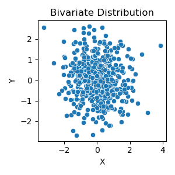
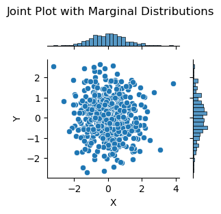
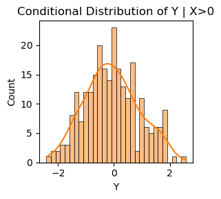

# Multivariate Distributions

!!! info "Source"
    Converted from **1.3 Random Variables II** in the
    *quantitative-finance-notebooks* collection.
    Reference: Wasserman (2004) *All of Statistics*, Ch. 2.

---

## 1. Bivariate Distributions

Given a pair of discrete random variables $X$ and $Y$, define the **joint mass function** by $f(x, y) = \mathbb{P}(X = x, Y = y)$.

Here is a bivariate distribution for two random variables $X$ and $Y$ each taking values 0 or 1:

$$
\begin{array}{c|cc|c}
    & Y=0 & Y=1 & \text{Total} \\
\hline
X=0 & 1/9 & 2/9 & 1/3 \\
X=1 & 2/9 & 4/9 & 2/3 \\
\hline
\text{Total} & 1/3 & 2/3 & 1 \\
\end{array}
$$

Thus, $f(1, 1) = \mathbb{P}(X = 1, Y = 1) = 4/9$.

In the continuous case, we call a function $f(x, y)$ a **PDF** for the random variables $(X, Y)$ if:

1. $f(x, y) \geq 0$ for all $(x, y)$,
2. $\int_{-\infty}^{\infty} \int_{-\infty}^{\infty} f(x, y)\, dx\, dy = 1$, and
3. for any set $A \subset \mathbb{R} \times \mathbb{R}$, $\mathbb{P}((X, Y) \in A) = \int\!\!\int_A f(x, y)\, dx\, dy$.

The **joint CDF** is $F_{X,Y}(x, y) = \mathbb{P}(X \leq x, Y \leq y)$.

---

## 2. Marginal Distributions

A **marginal distribution** describes the probability of one random variable, regardless of the value of any other.

If $(X, Y)$ have a joint distribution with mass function $f_{X,Y}$, the **marginal mass function** for $X$ is:

$$
f_X(x) = \mathbb{P}(X = x) = \sum_{y} f(x, y),
$$

and similarly for $Y$:

$$
f_Y(y) = \mathbb{P}(Y = y) = \sum_{x} f(x, y).
$$

Example:

$$
\begin{array}{c|cc|c}
    & Y=0 & Y=1 & \text{Total} \\
\hline
X=0 & 1/10 & 2/10 & 3/10 \\
X=1 & 3/10 & 4/10 & 7/10 \\
\hline
\text{Total} & 4/10 & 6/10 & 1 \\
\end{array}
$$

For continuous random variables, the **marginal densities** are:

$$
f_X(x) = \int f(x, y)\, dy, \qquad f_Y(y) = \int f(x, y)\, dx.
$$

For example, if $f_{X,Y}(x, y) = e^{-(x+y)}$ for $x, y \geq 0$, then $f_X(x) = e^{-x} \int_0^{\infty} e^{-y}\, dy = e^{-x}$.

---

## 3. Independent Distributions

Two random variables $X$ and $Y$ are **independent** if, for every sets $A$ and $B$:

$$
\mathbb{P}(X \in A, Y \in B) = \mathbb{P}(X \in A)\,\mathbb{P}(Y \in B),
$$

and we write $X \perp Y$.

??? example "Example: Independent joint distribution"

    $$
    \begin{array}{c|cc|c}
        & Y = 0 & Y = 1 & \text{Total} \\
    \hline
    X = 0 & 1/4 & 1/4 & 1/2 \\
    X = 1 & 1/4 & 1/4 & 1/2 \\
    \hline
    \text{Total} & 1/2 & 1/2 & 1 \\
    \end{array}
    $$

    Here $f_X(0)\,f_Y(0) = (1/2)(1/2) = 1/4 = f(0, 0)$, confirming independence.

??? example "Example: Dependent joint distribution"

    $$
    \begin{array}{c|cc|c}
        & Y = 0 & Y = 1 & \text{Total} \\
    \hline
    X = 0 & 1/2 & 0 & 1/2 \\
    X = 1 & 0 & 1/2 & 1/2 \\
    \hline
    \text{Total} & 1/2 & 1/2 & 1 \\
    \end{array}
    $$

    These are **not** independent because $f_X(0)\,f_Y(1) = 1/4$ yet $f(0, 1) = 0$.

---

## 4. Conditional Distributions

If $X$ and $Y$ are discrete, the **conditional probability mass function** is:

$$
f_{X \mid Y}(x \mid y) = \frac{f_{X,Y}(x, y)}{f_Y(y)}, \qquad f_Y(y) > 0.
$$

For continuous random variables, the **conditional probability density function** is:

$$
f_{X \mid Y}(x \mid y) = \frac{f_{X,Y}(x, y)}{f_Y(y)},
$$

and

$$
\mathbb{P}(X \in A \mid Y = y) = \int_A f_{X \mid Y}(x \mid y)\, dx.
$$

---

## 5. Multivariate Distributions and IID Samples

Let $X = (X_1, \ldots, X_n)$ be a **random vector**. We say $X_1, \ldots, X_n$ are **independent** if:

$$
\mathbb{P}(X_1 \in A_1, \ldots, X_n \in A_n) = \prod_{i=1}^n \mathbb{P}(X_i \in A_i).
$$

If $X_1, \ldots, X_n$ are independent and each has the same marginal distribution with CDF $F$, we say they are **IID** (independent and identically distributed) and write $X_1, \ldots, X_n \sim F$.

### 5.1 Multinomial Distribution

The multivariate version of a Binomial. Let $p = (p_1, \ldots, p_k)$ where $p_j \geq 0$ and $\sum_{j=1}^k p_j = 1$. Draw $n$ times with replacement and let $X_j$ count the number of times category $j$ appears. Then $X \sim \text{Multinomial}(n, p)$ with probability function:

$$
f(x) = \binom{n}{x_1, \ldots, x_k} p_1^{x_1} \cdots p_k^{x_k}, \qquad \binom{n}{x_1, \ldots, x_k} = \frac{n!}{x_1! \cdots x_k!}.
$$

### 5.2 Multivariate Normal Distribution

Let $Z = (Z_1, \ldots, Z_k)^T$ where $Z_1, \ldots, Z_k \sim N(0, 1)$ are independent. The density of $Z$ is:

$$
f(z) = \frac{1}{(2\pi)^{k/2}} \exp\!\left\{-\frac{1}{2} z^T z\right\}.
$$

We write $Z \sim N(0, I)$ (**standard multivariate normal**).

More generally, $X \sim N(\mu, \Sigma)$ has density:

$$
f(x; \mu, \Sigma) = \frac{1}{(2\pi)^{k/2} |\Sigma|^{1/2}} \exp\!\left\{-\frac{1}{2}(x - \mu)^T \Sigma^{-1}(x - \mu)\right\},
$$

where $|\Sigma|$ is the determinant of $\Sigma$, $\mu$ is a vector of length $k$, and $\Sigma$ is a $k \times k$ symmetric, positive definite matrix.

Since $\Sigma$ is symmetric and positive definite, there exists $\Sigma^{1/2}$ such that $\Sigma = \Sigma^{1/2}\Sigma^{1/2}$. If $Z \sim N(0, I)$ and $X = \mu + \Sigma^{1/2}Z$, then $X \sim N(\mu, \Sigma)$.

Partitioning $X = (X_a, X_b)$, $\mu = (\mu_a, \mu_b)$, and $\Sigma$ conformally:

1. **Marginal:** $X_a \sim N(\mu_a, \Sigma_{aa})$.
2. **Conditional:** $X_b \mid X_a = x_a \sim N\!\left(\mu_b + \Sigma_{ba}\Sigma_{aa}^{-1}(x_a - \mu_a),\; \Sigma_{bb} - \Sigma_{ba}\Sigma_{aa}^{-1}\Sigma_{ab}\right)$.
3. **Linear combination:** $a^T X \sim N(a^T\mu,\; a^T\Sigma\, a)$.
4. **Mahalanobis distance:** $(X - \mu)^T\Sigma^{-1}(X - \mu) \sim \chi^2_k$.
