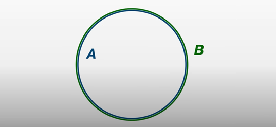
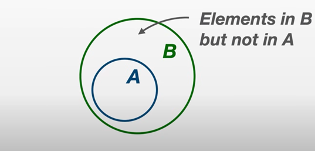
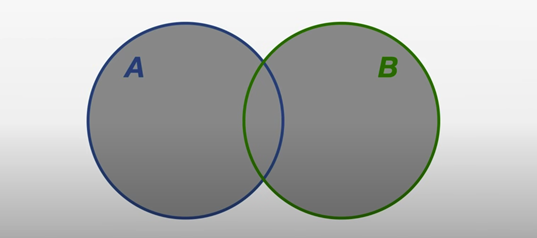
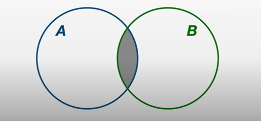
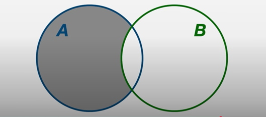
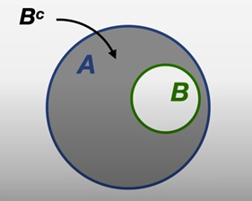
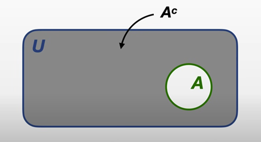

# Set Theory and Basic Probability

!!! info "Source"
    Converted from **1.1 Set Theory and Basic Probability** in the
    *quantitative-finance-notebooks* collection.
    References: Wood (2021) video on set theory; Wasserman (2004) *All of Statistics*, Ch. 1.

---

## 1. Set Theory

### 1.1 The Basics

A **set** is a collection of objects (elements). For example, a set containing the numbers 1, 2, 3 would be written as $\{1, 2, 3\}$, which we can name as

$$
A = \{1, 2, 3\}.
$$

To express symbolically that an element belongs to a set we use $\in$, and to express that it does not belong we use $\notin$. For example, if $A = \{1, 2, 3\}$, then $1 \in A$, $2 \in A$, but $4 \notin A$.

In most cases, we do not write out all the elements in a set but will write a shorthand description using **set builder notation**. For example, the set of prime numbers could be written as

$$
P = \{p \mid p \text{ is a prime}\},
$$

or

$$
P = \{p \colon p \text{ is a prime}\}.
$$

Here $p$ is a variable which must satisfy some criterion we call the **predicate**, since its belonging to the set is predicated on some criterion.

**Two sets are equal** if they both contain the **same elements**. For example, if $a \in A$, $a \in B$ and for all $b \in B$, $b \in A$, then $A = B$. This definition means that the order of the elements does not matter, we only need to show that they share the same elements.

The **size** or **cardinality** of a set is the number of elements it contains. For example, the cardinality of $A$ is $|A| = 3$.

### 1.2 Subsets

A set is a **subset** of another if all of its elements are also elements of another set. Consider $A = \{2, 4, 6\}$ and $B = \{1, 2, 3, 4, 5, 6\}$. We write $A \subseteq B$ to denote that "$A$ is a subset of $B$". **Subsets are always sets themselves**.

All sets are subsets of themselves. We can use this to define **set equality**: if $A \subseteq B$ and $B \subseteq A$, then $A = B$.

If $A \subseteq B$ but $A \neq B$, then $A$ is a **proper subset** of $B$.

An intuitive property of subsets is that if $A \subseteq B$ and $B \subseteq C$, then $A \subseteq C$.

### 1.3 The Empty Set

The empty set $\emptyset$ is a set which contains no elements.

- **$\emptyset$ is a subset of any set.** Since $\emptyset$ has no elements, all of its elements (vacuously) belong to any set $A$, so $\emptyset \subseteq A$.
- **$\emptyset$ is unique.** If $\emptyset_1$ and $\emptyset_2$ are both empty sets, then $\emptyset_1 \subseteq \emptyset_2$ and $\emptyset_2 \subseteq \emptyset_1$, so $\emptyset_1 = \emptyset_2$.

### 1.4 Union and Intersection

The **union** of two sets $A$ and $B$ is the set containing all the elements in $A$ as well as all the elements in $B$:

$$
A \cup B = \{x \colon x \in A \textbf{ or } x \in B\}.
$$

The **intersection** of sets $A$ and $B$ is the set containing elements that are in both $A$ and $B$:

$$
A \cap B = \{x \colon x \in A \textbf{ and } x \in B\}.
$$

Let $A = \{0, 1\}$ and $B = \{1, 2, 3\}$. Then:

- $A \cup B = \{0, 1, 2, 3\}$
- $A \cap B = \{1\}$

**Properties of the Union:**

1. $A \cup \emptyset = A$
2. $A \cup A = A$
3. If $A \subseteq B$, then $A \cup B = B$
4. $A \cup B = B \cup A$
5. $A \cup (B \cup C) = (A \cup B) \cup C$

**Properties of the Intersection:**

1. $A \cap \emptyset = \emptyset$
2. $A \cap A = A$
3. If $A \subseteq B$, then $A \cap B = A$
4. $A \cap B = B \cap A$
5. $A \cap (B \cap C) = (A \cap B) \cap C$

There is a useful identity for the cardinality of the union:

$$
|A \cup B| = |A| + |B| - |A \cap B|.
$$

For three sets $A$, $B$ and $C$, the **distributive property** gives:

$$
A \cup (B \cap C) = (A \cup B) \cap (A \cup C)
$$

$$
A \cap (B \cup C) = (A \cap B) \cup (A \cap C).
$$

### 1.5 The Complement

The **set-theoretic difference** of two sets $A$ and $B$ is the set of all elements in $A$ that are not in $B$:

$$
A \setminus B = \{x \in A \colon x \notin B\}.
$$

For example, if $A = \{1, 2, 3, 4, 5\}$ and $B = \{2, 4, 6, 8\}$, then $A \setminus B = \{1, 3, 5\}$ and $B \setminus A = \{6, 8\}$.

If $B \subseteq A$, the set-theoretic difference is called the **complement** of $B$ with respect to $A$, usually denoted $B^c$.

The **universal set** is the set of all elements that are relevant for some given topic of interest.

The **complement negates the predicate**: if $A = \{x \in B \colon P\}$, then $A^c = \{x \in B \colon \neg P\}$.

**Properties of Complements** (let $A, B \subseteq U$):

1. $\emptyset^c = U$
2. $U^c = \emptyset$
3. $(A^c)^c = A$
4. If $A \subseteq B$, then $B^c \subseteq A^c$

### 1.6 De Morgan's Laws

If $A$ and $B$ are subsets of the universal set $U$, then:

$$
(A \cup B)^c = A^c \cap B^c
$$

$$
(A \cap B)^c = A^c \cup B^c.
$$

### 1.7 Sets of Sets, Power Sets, Indexed Families

The elements of a set may be sets themselves. For example,

$$
A = \bigl\{\{0\},\; \{0, 1\},\; \{0, 1, 2\}\bigr\}.
$$

The **power set** contains all subsets of a given set:

$$
\mathcal{P}(A) = \{X \colon X \subseteq A\}.
$$

For $A = \{0, 1\}$:

$$
\mathcal{P}(A) = \bigl\{\emptyset,\; \{0\},\; \{1\},\; \{0, 1\}\bigr\}.
$$

**Indexed families of sets** are where each element is indexed:

$$
A = \{A_i \colon i \in I\}.
$$

---

## 2. Probability

### 2.1 Sample Spaces and Events

The **sample space** $\Omega$ is the set of possible outcomes of an experiment. Points $\omega$ in $\Omega$ are called **sample outcomes**. Subsets of $\Omega$ are called **events**.

For example, if we toss a coin twice, then $\Omega = \{HH, HT, TH, TT\}$. The event that the first toss is heads is $A = \{HH, HT\}$.

We say that $A_1, A_2, \ldots$ are **disjoint** (or **mutually exclusive**) if $A_i \cap A_j = \emptyset$ whenever $i \neq j$. A **partition** of $\Omega$ is a sequence of disjoint sets $A_1, A_2, \ldots$ such that $\bigcup_{i=1}^{\infty} A_i = \Omega$.

Given an event $A$, the **indicator function** is:

$$
I_A(\omega) = \begin{cases} 1 & \text{if } \omega \in A \\ 0 & \text{if } \omega \notin A. \end{cases}
$$

A function $\mathbb{P}$ that assigns a real number $\mathbb{P}(A)$ to each event $A$ is a **probability distribution** if it satisfies:

- **Axiom 1:** $\mathbb{P}(A) \geq 0$ for every event $A$.
- **Axiom 2:** $\mathbb{P}(\Omega) = 1$.
- **Axiom 3:** If $A_1, A_2, \ldots$ are disjoint, then $\mathbb{P}\!\left(\bigcup_{i=1}^{\infty} A_i\right) = \sum_{i=1}^{\infty} \mathbb{P}(A_i)$.

For any events $A$ and $B$:

$$
\mathbb{P}(A \cup B) = \mathbb{P}(A) + \mathbb{P}(B) - \mathbb{P}(A \cap B).
$$

### 2.2 Probability on Finite Sample Spaces

If the sample space $\Omega = \{\omega_1, \ldots, \omega_n\}$ is finite and each outcome is equally likely, then:

$$
\mathbb{P}(A) = \frac{|A|}{|\Omega|},
$$

which is called the **uniform probability distribution**.

The number of ways of ordering $n$ objects is $n! = n(n-1)(n-2) \cdots 2 \cdot 1$. The **binomial coefficient** is:

$$
\binom{n}{k} = \frac{n!}{k!(n-k)!},
$$

read "$n$ choose $k$."

### 2.3 Independent Events

$A$ and $B$ are **independent** if and only if

$$
\mathbb{P}(A \cap B) = \mathbb{P}(A)\,\mathbb{P}(B).
$$

### 2.4 Conditional Probability

If $\mathbb{P}(B) > 0$, then the **conditional probability** of $A$ given $B$ is:

$$
\mathbb{P}(A \mid B) = \frac{\mathbb{P}(A \cap B)}{\mathbb{P}(B)}.
$$

$A$ and $B$ are independent if and only if $\mathbb{P}(A \mid B) = \mathbb{P}(A)$.

### 2.5 Bayes' Theorem

$$
\mathbb{P}(A \mid B) = \frac{\mathbb{P}(B \mid A)\,\mathbb{P}(A)}{\mathbb{P}(B)}.
$$
