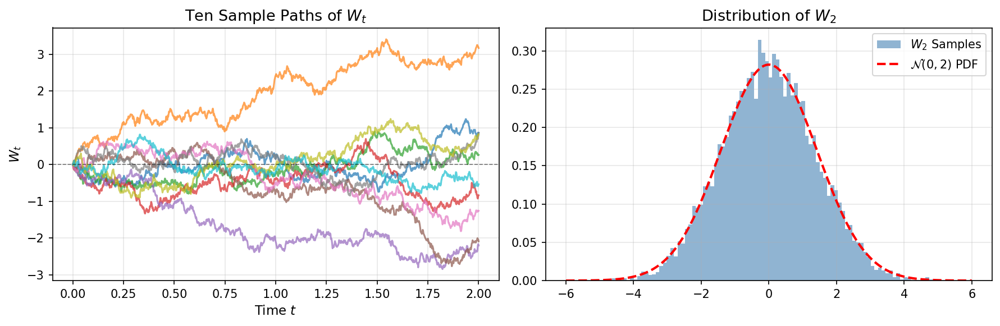

# Brownian Motion

## Introduction

Having established the discrete random walk and its scaling limit via Donsker's theorem, we now define **Brownian motion** axiomatically. Brownian motion (also called the **Wiener process**) is the canonical continuous-time random motion that serves as the foundation for:

- Stochastic calculus and stochastic differential equations
- Mathematical finance (Black-Scholes theory)
- Statistical physics (diffusion processes)
- Filtering theory and signal processing

Brownian motion is the **only** stochastic process that is simultaneously:
1. Continuous
2. Markov
3. Has stationary independent increments
4. Has Gaussian increments

This uniqueness makes it the fundamental building block for continuous-time stochastic modeling.

## Intuitive Construction

Before giving the formal definition, we develop intuition through discrete approximations that can be performed "by hand."

### Construction via Standard Normal Increments

Consider the following discrete-to-continuous procedure:

| Quantity | Notation |
|----------|----------|
| Number of ticks per year | $n$ |
| Standard normal coin flip at tick $k$ | $X_k$ |
| Number of ticks between $0$ and $t$ | $nt$ |
| Cumulative standard normal coin flips up to time $t$ | $\displaystyle\sum_{k=1}^{nt}X_k$ |
| **Normalized cumulative sum** | $\displaystyle B_t= \frac{1}{\sqrt{n}}\sum_{k=1}^{nt}X_k$ |

where $X_k \stackrel{\text{iid}}{\sim} \mathcal{N}(0,1)$.

**Key observation:** As $n \to \infty$, by the central limit theorem (more precisely, Donsker's theorem), $B_t$ converges to Brownian motion.

### Construction via Fair Coin Flips

Equivalently, using $\{-1, +1\}$ random variables:

| Quantity | Notation |
|----------|----------|
| Number of ticks per year | $n$ |
| Fair coin flip at tick $k$ ($H = 1$, $T = -1$) | $X_k$ |
| Number of ticks between $0$ and $t$ | $nt$ |
| Cumulative fair coin flips up to time $t$ | $\displaystyle\sum_{k=1}^{nt}X_k$ |
| **Normalized cumulative sum** | $\displaystyle B_t= \frac{1}{\sqrt{n}}\sum_{k=1}^{nt}X_k$ |

where $\mathbb{P}(X_k = 1) = \mathbb{P}(X_k = -1) = 1/2$.

### Construction via General i.i.d. Increments

More generally, for any i.i.d. sequence $\{X_k\}$ with $\mathbb{E}[X_k] = \mu$ and $\text{Var}(X_k) = \sigma^2$:

$$B_t= \frac{1}{\sqrt{n}}\sum_{k=1}^{nt}\frac{X_k-\mu}{\sigma}$$

By Donsker's invariance principle, all three constructions yield the same limit: **Brownian motion**.

### Example: Concrete Path Construction

**Problem:** We flip a fair coin 10 times and get: $HHTHTTHHHT$

Construct a Brownian motion sample path up to time $t = 1$.

**Solution:** With $n = 10$ ticks per year:

| Time | $0/10$ | $1/10$ | $2/10$ | $3/10$ | $4/10$ | $5/10$ | $6/10$ | $7/10$ | $8/10$ | $9/10$ | $10/10$ |
|------|--------|--------|--------|--------|--------|--------|--------|--------|--------|--------|---------|
| Coin flip | — | $H$ | $H$ | $T$ | $H$ | $T$ | $T$ | $H$ | $H$ | $H$ | $T$ |
| Conversion | — | $1$ | $1$ | $-1$ | $1$ | $-1$ | $-1$ | $1$ | $1$ | $1$ | $-1$ |
| Cum sum | $0$ | $1$ | $2$ | $1$ | $2$ | $1$ | $0$ | $1$ | $2$ | $3$ | $2$ |
| $B_t$ | $0$ | $0.316$ | $0.632$ | $0.316$ | $0.632$ | $0.316$ | $0$ | $0.316$ | $0.632$ | $0.949$ | $0.632$ |

This piecewise linear path approximates a true Brownian path. As $n \to \infty$, such approximations converge to continuous Brownian motion.

## Axiomatic Definition

**Definition 1.3.1** (Standard Brownian Motion)

A **standard Brownian motion** $\{W_t\}_{t \ge 0}$ on a probability space $(\Omega,\mathcal{F},\mathbb{P})$ is a stochastic process satisfying:

**(i) Initial condition:**

$$W_0 = 0 \quad \text{almost surely}$$

**(ii) Independent increments:** For $0 \le t_0 < t_1 < \cdots < t_n$, the increments

$$W_{t_1}-W_{t_0},\quad W_{t_2}-W_{t_1},\quad \ldots,\quad W_{t_n}-W_{t_{n-1}}$$

are independent random variables.

**(iii) Stationary increments:** For $0 \le s < t$,

$$W_t - W_s \sim \mathcal{N}(0,t-s)$$

**(iv) Continuity of paths:** The map $t \mapsto W_t(\omega)$ is continuous for almost every $\omega \in \Omega$.

**Remark 1:** Conditions (i)-(iii) specify the finite-dimensional distributions (Gaussian with specific covariance). Condition (iv) selects the continuous version among all processes with these distributions.

**Remark 2:** Properties (ii) and (iii) together make Brownian motion a **Lévy process** (continuous-time analog of random walk with independent, stationary increments).

## Finite-Dimensional Distributions

### Joint Distribution

**Proposition 1.3.2**

For any $0 \le t_1 < t_2 < \cdots < t_n$, the random vector $(W_{t_1}, W_{t_2}, \ldots, W_{t_n})$ is multivariate Gaussian with mean zero and covariance matrix $\Sigma$ where

$$\Sigma_{ij} = \mathbb{E}[W_{t_i} W_{t_j}] = \min(t_i,t_j)$$

**Proof:**

Write the vector in terms of independent increments. Define $\Delta W_k = W_{t_k} - W_{t_{k-1}}$ and $\Delta t_k = t_k - t_{k-1}$ for $k = 1, \ldots, n$ (with $t_0 = 0$):

$$\begin{pmatrix} W_{t_1} \\ W_{t_2} \\ \vdots \\ W_{t_n} \end{pmatrix}
= 
\begin{pmatrix} 
1 & 0 & \cdots & 0 \\
1 & 1 & \cdots & 0 \\
\vdots & \vdots & \ddots & \vdots \\
1 & 1 & \cdots & 1
\end{pmatrix}
\begin{pmatrix} \Delta W_1 \\ \Delta W_2 \\ \vdots \\ \Delta W_n \end{pmatrix}$$

Since the increments $\Delta W_k \sim \mathcal{N}(0, \Delta t_k)$ are independent Gaussians, their linear combination is Gaussian. The covariance is:

$$\mathbb{E}[W_{t_i} W_{t_j}] = \sum_{k=1}^{\min(i,j)} \mathbb{E}[(\Delta W_k)^2] = \sum_{k=1}^{\min(i,j)} \Delta t_k = t_{\min(i,j)} = \min(t_i, t_j) \quad \square$$

**Corollary 1.3.3**

$$\mathbb{E}[W_t] = 0, \quad \mathbb{E}[W_t^2] = t, \quad \mathbb{E}[W_s W_t] = \min(s,t)$$

### Characteristic Function

**Proposition 1.3.4**

For $0 \le s < t$ and $\lambda \in \mathbb{R}$:

$$\boxed{
\mathbb{E}\left[e^{i\lambda(W_t-W_s)}\right]
=
\exp\left(-\frac{1}{2}\lambda^2(t-s)\right)
}$$

## Covariance Structure

**Theorem 1.3.5** (Covariance Formula)

For all $s,t \ge 0$:

$$\boxed{\mathbb{E}[W_s W_t] = \min(s,t)}$$

**Proof:**

Without loss of generality, assume $s \le t$. Then:

$$\mathbb{E}[W_s W_t] = \mathbb{E}[W_s (W_s + (W_t - W_s))] = \mathbb{E}[W_s^2] + \mathbb{E}[W_s(W_t - W_s)]$$

By independent increments, $W_s$ and $W_t - W_s$ are independent, so:

$$\mathbb{E}[W_s(W_t - W_s)] = \mathbb{E}[W_s]\mathbb{E}[W_t - W_s] = 0$$

Therefore: $\mathbb{E}[W_s W_t] = \mathbb{E}[W_s^2] = s = \min(s,t) \quad \square$

**Implications of the covariance structure:**

1. **Non-differentiability**: If $W_t$ were differentiable, then $\text{Cov}(W_s, W_t) \sim st$, not $\min(s,t)$
2. **Long-range correlation**: $W_s$ and $W_t$ are correlated for all $s, t$ (not just nearby times)
3. **Self-similarity**: The $\min$ structure is scale-invariant

## Simulation: Basic Path Generation

We now illustrate the theoretical properties with computational examples.

### Monte Carlo Method

To simulate Brownian motion on $[0, T]$ with $n$ time steps:

1. **Time discretization:** $t_i = i \cdot \Delta t$ where $\Delta t = T/n$
2. **Independent increments:** $\Delta W_i = W_{t_{i+1}} - W_{t_i} \sim \mathcal{N}(0, \Delta t)$
3. **Path construction:** $W_{t_i} = \sum_{j=1}^{i} \Delta W_j$ (cumulative sum)

```python
import matplotlib.pyplot as plt
import numpy as np
import scipy.stats as stats

# Simulation parameters
num_paths = 10_000
num_steps = 1_000
maturity_time = 2

np.random.seed(42)  # Fixed seed for reproducibility

# Generate time grid
dt = maturity_time / num_steps
time_steps = np.linspace(0, maturity_time, num_steps + 1)

# Generate Brownian motion paths
dW = np.random.normal(0, np.sqrt(dt), size=(num_paths, num_steps))
brownian_paths = np.cumsum(np.hstack([np.zeros((num_paths, 1)), dW]), axis=1)

# Create figure with two subplots
fig, (ax_paths, ax_distribution) = plt.subplots(1, 2, figsize=(12, 4))

# Plot 10 sample paths
ax_paths.set_title(f'Ten Sample Paths of $W_t$', fontsize=13)
for i in range(10):
    ax_paths.plot(time_steps, brownian_paths[i, :], alpha=0.7, linewidth=1.5)
ax_paths.set_xlabel('Time $t$', fontsize=11)
ax_paths.set_ylabel('$W_t$', fontsize=11)
ax_paths.axhline(0, color='black', linestyle='--', linewidth=0.8, alpha=0.5)
ax_paths.grid(alpha=0.3)

# Plot distribution at maturity
ax_distribution.set_title(f'Distribution of $W_{{{maturity_time}}}$', fontsize=13)
ax_distribution.hist(brownian_paths[:, -1], bins=100, density=True, 
                     alpha=0.6, color='steelblue', label=f"$W_{{{maturity_time}}}$ Samples")

# Overlay theoretical Gaussian density
x_range = np.linspace(-6, 6, 200)
theoretical_pdf = stats.norm(loc=0, scale=np.sqrt(maturity_time)).pdf(x_range)
ax_distribution.plot(x_range, theoretical_pdf, '--r', linewidth=2, 
                     label=f"$\mathcal{{N}}(0,{maturity_time})$ PDF")
ax_distribution.legend(fontsize=10)
ax_distribution.grid(alpha=0.3)

plt.tight_layout()
plt.show()

# Verify mean and variance
print(f"Sample mean: {np.mean(brownian_paths[:, -1]):.6f} (theoretical: 0)")
print(f"Sample variance: {np.var(brownian_paths[:, -1], ddof=1):.6f} (theoretical: {maturity_time})")
```

**Output:**
```
Sample mean: -0.002860 (theoretical: 0)
Sample variance: 1.931260 (theoretical: 2)
```



**Interpretation:**

- **Left plot**: Paths start at origin, are continuous but "wiggly", and diverge as time increases
- **Right plot**: Histogram matches theoretical Gaussian density, confirming $W_T \sim \mathcal{N}(0, T)$

## Construction via Kolmogorov Extension

### Step 1: Specify Finite-Dimensional Distributions

For any finite collection of times $0 \le t_1 < \cdots < t_n$, define:

$$(W_{t_1}, \ldots, W_{t_n}) \sim \mathcal{N}(0, \Sigma), \quad \Sigma_{ij} = \min(t_i, t_j)$$

### Step 2: Verify Consistency

**Kolmogorov consistency conditions:** For any permutation and any subcollection of times, the marginal distributions must agree. This follows from the $\min$ covariance structure.

### Step 3: Apply Kolmogorov Extension Theorem

**Theorem 1.3.6** (Kolmogorov Extension)

If the finite-dimensional distributions are consistent, there exists a probability space and a stochastic process with these distributions.

### Step 4: Ensure Continuity

**Theorem 1.3.7** (Kolmogorov-Chentsov Continuity Theorem)

If there exist constants $\alpha, \beta, C > 0$ such that

$$\mathbb{E}[|W_t - W_s|^\alpha] \le C|t - s|^{1+\beta}$$

then $W$ has a continuous modification.

**Verification:** For $\alpha = 4$: $\mathbb{E}[|W_t - W_s|^4] = 3(t-s)^2$, so we can take $\beta = 1$ (since $2 = 1 + \beta$). By the theorem, this guarantees the existence of a continuous modification with Hölder continuity of any exponent $\gamma < \frac{\beta}{\alpha} = \frac{1}{4}$. In fact, Brownian motion is Hölder continuous with any exponent $\gamma < 1/2$. $\square$

## Scaling Property

**Theorem 1.3.8** (Scaling / Self-Similarity)

For any $c > 0$:

$$\boxed{W_{ct} \overset{d}{=} \sqrt{c} \, W_t}$$

**Proof:**

Both sides are Gaussian with mean zero and variance $ct$. The finite-dimensional distributions match by the $\min$ covariance structure. $\square$

**Interpretation:** Brownian motion has **no intrinsic time scale**. The Hurst exponent $H = 1/2$ characterizes standard Brownian motion.

### Simulation: Self-Similarity

```python
import matplotlib.pyplot as plt
import numpy as np
import scipy.stats as stats

T = 1.0
num_paths = 5000
c_values = [0.25, 1, 4]
max_c = max(c_values)

# Need to simulate up to time max_c * T = 4
num_steps = 4000  # 1000 steps per unit time
np.random.seed(42)  # Fixed seed for reproducibility

dt = (max_c * T) / num_steps
dW = np.random.normal(0, np.sqrt(dt), size=(num_paths, num_steps))
W = np.cumsum(np.hstack([np.zeros((num_paths, 1)), dW]), axis=1)

fig, axes = plt.subplots(1, 3, figsize=(15, 4))
for idx, c in enumerate(c_values):
    ax = axes[idx]
    
    # W_{cT}: value at time c*T
    cT_idx = int(c * T / dt)
    W_cT = W[:, cT_idx]
    
    # sqrt(c) * W_T: value at time T, scaled by sqrt(c)
    T_idx = int(T / dt)
    sqrt_c_W_T = np.sqrt(c) * W[:, T_idx]
    
    bins = np.linspace(-3*np.sqrt(c*T), 3*np.sqrt(c*T), 50)
    ax.hist(W_cT, bins=bins, density=True, alpha=0.5, color='blue', label=f'$W_{{{c}T}}$')
    ax.hist(sqrt_c_W_T, bins=bins, density=True, alpha=0.5, color='red', label=f'$\\sqrt{{{c}}} W_T$')
    ax.plot(np.linspace(bins[0], bins[-1], 200), 
            stats.norm(0, np.sqrt(c*T)).pdf(np.linspace(bins[0], bins[-1], 200)), 
            'k--', linewidth=2)
    ax.set_title(f'$c = {c}$', fontsize=12)
    ax.legend(fontsize=9)
    ax.grid(alpha=0.3)
plt.suptitle('Self-Similarity: $W_{ct} \\overset{d}{=} \\sqrt{c} W_t$', fontsize=14)
plt.tight_layout()
plt.show()
```


**Interpretation:** The blue and red histograms overlap almost perfectly for each value of $c$, confirming that $W_{ct}$ and $\sqrt{c} W_t$ have the same distribution. The black dashed line shows the theoretical $\mathcal{N}(0, cT)$ density.

## Nowhere Differentiability

**Theorem 1.3.9** (Nowhere Differentiability)

With probability one, for every $t \ge 0$

$$\limsup_{h \to 0} \frac{|W_{t+h}-W_t|}{|h|} = \infty$$

**Lévy's modulus of continuity:** The precise local behavior is given by:

$$\limsup_{h \to 0^+} \frac{|W_{t+h} - W_t|}{\sqrt{2h \log(1/h)}} = 1 \quad \text{a.s.}$$

This result, due to Paul Lévy, quantifies the exact rate of oscillation of Brownian paths.

**Implications:**

- Brownian paths are continuous but nowhere differentiable
- Total variation is infinite: $\int_0^T |dW_t| = \infty$ a.s.
- Classical calculus fails; we need **Itô calculus**

## Quadratic Variation

**Theorem 1.3.10** (Quadratic Variation)

For any partition $\Pi_n$ with mesh $|\Pi_n| \to 0$:

$$\boxed{\sum_{i=0}^{n-1} (W_{t_{i+1}}-W_{t_i})^2 \xrightarrow{\mathbb{P}} T}$$

**Proof:**

Let $Q_n = \sum_{i=0}^{n-1} (W_{t_{i+1}} - W_{t_i})^2$. For a uniform partition with mesh $|\Pi_n| = T/n$:

- $\mathbb{E}[Q_n] = \sum_{i=0}^{n-1} \mathbb{E}[(W_{t_{i+1}} - W_{t_i})^2] = \sum_{i=0}^{n-1} (t_{i+1} - t_i) = T$
- $\text{Var}(Q_n) = \sum_{i=0}^{n-1} \text{Var}((W_{t_{i+1}} - W_{t_i})^2) = \sum_{i=0}^{n-1} 2(t_{i+1} - t_i)^2 = 2n \cdot \frac{T^2}{n^2} = \frac{2T^2}{n} \to 0$

where we used $\text{Var}(Z^2) = 2\sigma^4$ for $Z \sim \mathcal{N}(0, \sigma^2)$.

By Chebyshev's inequality: $Q_n \xrightarrow{\mathbb{P}} T$. $\square$

**Notation:** $\langle W \rangle_T = T$ or $d\langle W \rangle_t = dt$

**This is the foundation for Itô's formula:** $(dW_t)^2 = dt$, not 0.

### Simulation: Quadratic Variation

```python
import matplotlib.pyplot as plt
import numpy as np

maturity_time = 1.0
num_steps_list = [10, 50, 100, 500, 1000, 5000]
num_trials = 1000

np.random.seed(42)  # Fixed seed for reproducibility
qv_results = []

for num_steps in num_steps_list:
    dt = maturity_time / num_steps
    qv_paths = np.zeros(num_trials)
    for trial in range(num_trials):
        dW = np.random.normal(0, np.sqrt(dt), size=num_steps)
        W = np.cumsum(np.insert(dW, 0, 0))
        qv_paths[trial] = np.sum(np.diff(W)**2)
    qv_results.append({'num_steps': num_steps, 'mean': np.mean(qv_paths), 'std': np.std(qv_paths)})

fig, ax = plt.subplots(figsize=(8, 5))
means = [r['mean'] for r in qv_results]
stds = [r['std'] for r in qv_results]
steps = [r['num_steps'] for r in qv_results]

ax.errorbar(steps, means, yerr=stds, fmt='o-', capsize=5, label='Sample mean ± std')
ax.axhline(maturity_time, color='r', linestyle='--', linewidth=2, label=f'Theoretical: $T = {maturity_time}$')
ax.set_xlabel('Number of time steps $n$', fontsize=12)
ax.set_ylabel('Quadratic Variation', fontsize=12)
ax.set_xscale('log')
ax.legend()
ax.grid(alpha=0.3)
plt.show()

print("Quadratic Variation Convergence:")
for r in qv_results:
    print(f"  n = {r['num_steps']:4d}: mean = {r['mean']:.4f}, std = {r['std']:.4f}")
```

**Output:**
```
Quadratic Variation Convergence:
  n =   10: mean = 1.0068, std = 0.4524
  n =   50: mean = 1.0028, std = 0.2036
  n =  100: mean = 0.9967, std = 0.1396
  n =  500: mean = 1.0025, std = 0.0626
  n = 1000: mean = 1.0017, std = 0.0444
  n = 5000: mean = 0.9997, std = 0.0198
```


**Interpretation:** As the number of time steps increases, the quadratic variation converges to $T = 1$ with decreasing standard deviation proportional to $1/\sqrt{n}$.

## Martingale Property

**Definition 1.3.10a** (Natural Filtration)

The **natural filtration** of Brownian motion is $\mathcal{F}_t = \sigma(W_s : 0 \leq s \leq t)$, the $\sigma$-algebra generated by the process up to time $t$. This represents the information available by observing the Brownian path up to time $t$.

**Theorem 1.3.11** (Martingale Property)

$$\boxed{\mathbb{E}[W_t \mid \mathcal{F}_s] = W_s, \quad 0 \le s \le t}$$

**Corollary 1.3.12:** $W_t^2 - t$ is also a martingale.

## Strong Markov Property

**Definition 1.3.13** (Stopping Time)

A random variable $\tau: \Omega \to [0, \infty]$ is a **stopping time** if $\{\tau \le t\} \in \mathcal{F}_t$ for all $t$.

**Theorem 1.3.14** (Strong Markov Property)

For any stopping time $\tau$ with $\mathbb{P}(\tau < \infty) = 1$:

$$\boxed{W_{\tau+t} - W_\tau \text{ is independent of } \mathcal{F}_\tau}$$

and has the same distribution as $W_t$.

## Connection to Heat Equation

**Theorem 1.3.15** (Feynman-Kac for Heat Equation)

Define $u(x,t) = \mathbb{E}[f(x + W_t)]$. Then $u$ satisfies:

$$\boxed{\frac{\partial u}{\partial t} = \frac{1}{2} \frac{\partial^2 u}{\partial x^2}}$$

with initial condition $u(x, 0) = f(x)$.

## First Passage Times

**Definition 1.3.16** (Hitting Time)

For $a \in \mathbb{R}$: $\tau_a = \inf\{t \ge 0 : W_t = a\}$

**Theorem 1.3.17** (Recurrence): $\mathbb{P}(\tau_a < \infty) = 1$ for all $a$.

**Theorem 1.3.18** (Expected Hitting Time): $\mathbb{E}[\tau_a] = \infty$ for $a \neq 0$.

The first passage time has density:

$$f_{\tau_a}(t) = \frac{|a|}{\sqrt{2\pi t^3}} \exp\left(-\frac{a^2}{2t}\right), \quad t > 0$$

### Simulation: First Passage Times

```python
import matplotlib.pyplot as plt
import numpy as np

a = 1.0
num_paths = 10_000
T_max = 5.0
num_steps = 5_000

np.random.seed(42)  # Fixed seed for reproducibility
first_passage_times = []
dt = T_max / num_steps
time_grid = np.linspace(0, T_max, num_steps + 1)

for _ in range(num_paths):
    dW = np.random.normal(0, np.sqrt(dt), size=num_steps)
    W = np.cumsum(np.insert(dW, 0, 0))
    crossing_indices = np.where(W >= a)[0]
    if len(crossing_indices) > 0:
        first_passage_times.append(time_grid[crossing_indices[0]])

first_passage_times = np.array(first_passage_times)

fig, ax = plt.subplots(figsize=(8, 5))
ax.hist(first_passage_times, bins=50, density=True, alpha=0.6, label='Simulated')
t_range = np.linspace(0.01, T_max, 500)
theoretical_density = (a / np.sqrt(2 * np.pi * t_range**3)) * np.exp(-a**2 / (2 * t_range))
ax.plot(t_range, theoretical_density, 'r--', linewidth=2, label='Theoretical')
ax.set_xlabel('First Passage Time $\\tau_a$', fontsize=12)
ax.set_ylabel('Density', fontsize=12)
ax.set_xlim(0, 5)
ax.legend()
ax.grid(alpha=0.3)
plt.show()

print(f"Hitting probability by t = {T_max}: {len(first_passage_times)/num_paths:.4f}")
print(f"Mean first passage time (conditional on hitting): {np.mean(first_passage_times):.4f}")
```

**Output:**
```
Hitting probability by t = 5.0: 0.6437
Mean first passage time (conditional on hitting): 1.5146
```


**Interpretation:** The hitting probability increases with the time horizon. The theoretical hitting probability is $\mathbb{P}(\tau_a \leq T) = 2(1 - \Phi(a/\sqrt{T}))$ where $\Phi$ is the standard normal CDF.

## Simulation: Covariance Structure

This example verifies the covariance formula $\mathbb{E}[W_s W_t] = \min(s,t)$.

```python
import matplotlib.pyplot as plt
import numpy as np

T = 2.0
num_paths = 10_000
num_time_points = 20

np.random.seed(42)  # Fixed seed for reproducibility
time_points = np.linspace(0, T, num_time_points + 1)
dt = T / num_time_points

dW = np.random.normal(0, np.sqrt(dt), size=(num_paths, num_time_points))
W = np.cumsum(np.hstack([np.zeros((num_paths, 1)), dW]), axis=1)

sample_cov = np.cov(W.T)
theoretical_cov = np.minimum(time_points[:, None], time_points[None, :])

fig, (ax1, ax2) = plt.subplots(1, 2, figsize=(12, 4))
im1 = ax1.imshow(sample_cov, cmap='RdBu_r', origin='lower', extent=[0, T, 0, T])
ax1.set_title('Sample Covariance', fontsize=12)
plt.colorbar(im1, ax=ax1)

im2 = ax2.imshow(theoretical_cov, cmap='RdBu_r', origin='lower', extent=[0, T, 0, T])
ax2.set_title('Theoretical: $\\min(s,t)$', fontsize=12)
plt.colorbar(im2, ax=ax2)
plt.tight_layout()
plt.show()

print(f"RMSE: {np.sqrt(np.mean((sample_cov - theoretical_cov)**2)):.6f}")
print(f"Max absolute error: {np.max(np.abs(sample_cov - theoretical_cov)):.6f}")
```

**Output:**
```
RMSE: 0.011630
Max absolute error: 0.032415
```


**Interpretation:** The sample covariance matrix closely matches the theoretical $\min(s,t)$ structure, with small errors due to finite sample size.

## Summary

Brownian motion is uniquely characterized by:

1. **Continuous paths** (nowhere differentiable, infinite variation)
2. **Gaussian increments** with variance equal to time elapsed
3. **Independent increments** (Markov property and strong Markov property)
4. **Quadratic variation** $\langle W \rangle_t = t$ (foundation for Itô calculus)
5. **Martingale property** (essential for stochastic integration)
6. **Self-similarity** with Hurst exponent $H = 1/2$
7. **Connection to PDEs** (probabilistic representation of heat equation solutions)

The simulations in this section have verified these properties numerically:
- Basic path generation confirms $W_t \sim \mathcal{N}(0, t)$
- Self-similarity verified via distributional comparison
- Quadratic variation converges to $t$ as mesh refines
- First passage time distributions match theoretical predictions
- Covariance structure matches $\min(s, t)$

The rigorous construction via Kolmogorov extension theorem shows that such a process exists and is unique (up to modification).

## Exercises

### Basic Properties

1. Show that $\mathbb{E}[W_t] = 0$ and $\text{Var}(W_t) = t$ directly from the axiomatic definition.

2. Compute $\mathbb{E}[W_s W_t]$ for $0 \le s \le t$ using the independent increments property.

3. Deduce that $(W_t)_{t \ge 0}$ has stationary increments, i.e., $W_t - W_s \overset{d}{=} W_{t-s}$.

### Gaussian Increments

Let $0 \le s < t$.

4. Show that $W_t - W_s \sim \mathcal{N}(0, t - s)$ from the definition.

5. Prove that $W_t - W_s$ is independent of $\mathcal{F}_s = \sigma(W_u : u \le s)$.

6. Compute the characteristic function $\mathbb{E}[e^{i\lambda(W_t - W_s)}]$.

### Path Continuity

7. Show that $\mathbb{E}[(W_t - W_s)^2] = |t - s|$.

8. Use Kolmogorov's continuity theorem to justify the existence of a continuous modification. (Hint: Show $\mathbb{E}[|W_t - W_s|^4] = 3(t-s)^2$.)

9. Why does Brownian motion fail to be differentiable almost surely? (Hint: Consider what differentiability would imply for $\mathbb{E}[(W_{t+h} - W_t)^2]/h^2$ as $h \to 0$.)

### Martingale Properties

10. Show that $(W_t)_{t \ge 0}$ is a martingale with respect to its natural filtration.

11. Show that $(W_t^2 - t)_{t \ge 0}$ is a martingale.

12. Is $(W_t^3)_{t \ge 0}$ a martingale? Justify your answer by computing $\mathbb{E}[W_t^3 | \mathcal{F}_s]$.

### Covariation

Let $W_t$ and $\widetilde{W}_t$ be independent Brownian motions.

13. Compute the quadratic covariation $\langle W, \widetilde{W} \rangle_t$.

14. What is $\langle W, \widetilde{W} \rangle_t$ if $\widetilde{W}_t = \rho W_t + \sqrt{1-\rho^2} B_t$, where $B_t$ is independent of $W_t$?

15. Interpret the result in terms of correlation between the two processes.

### Exponential Martingale

Define $M_t := \exp\left( \lambda W_t - \frac{1}{2} \lambda^2 t \right)$ for $\lambda \in \mathbb{R}$.

16. Show that $(M_t)_{t \ge 0}$ is a martingale.

17. Compute $\mathbb{E}[M_t]$.

18. Explain why this exponential martingale is fundamental in stochastic calculus and mathematical finance (hint: Girsanov theorem, risk-neutral pricing).

### Law of the Iterated Logarithm

The law of the iterated logarithm states that

$$\limsup_{t \to 0^+} \frac{W_t}{\sqrt{2 t \log \log (1/t)}} = 1 \quad \text{a.s.}$$

19. Interpret this result intuitively in terms of path oscillation.

20. What does it say about the "roughness" of Brownian paths near $t = 0$?

21. Why is this result incompatible with differentiability?

### Challenge Problems

22. Show that Brownian motion has infinite total variation on any interval $[0, T]$ almost surely.

23. Prove that Brownian motion is Hölder continuous of any order $\alpha < 1/2$, but of no order $\alpha \ge 1/2$.

24. (Time Reversal) Let $\tilde{W}_t = W_T - W_{T-t}$ for $t \in [0, T]$. Show that $\tilde{W}$ is also a Brownian motion on $[0, T]$.

## References

- Billingsley, P. (1995). *Probability and Measure*, 3rd ed. Wiley.
- Karatzas, I., & Shreve, S. E. (1991). *Brownian Motion and Stochastic Calculus*, 2nd ed. Springer.
- Kallenberg, O. (2002). *Foundations of Modern Probability*, 2nd ed. Springer.
- Mörters, P., & Peres, Y. (2010). *Brownian Motion*. Cambridge University Press.
- Revuz, D., & Yor, M. (1999). *Continuous Martingales and Brownian Motion*, 3rd ed. Springer.
- Glasserman, P. (2003). *Monte Carlo Methods in Financial Engineering*. Springer.
- Kloeden, P. E., & Platen, E. (1992). *Numerical Solution of Stochastic Differential Equations*. Springer.
