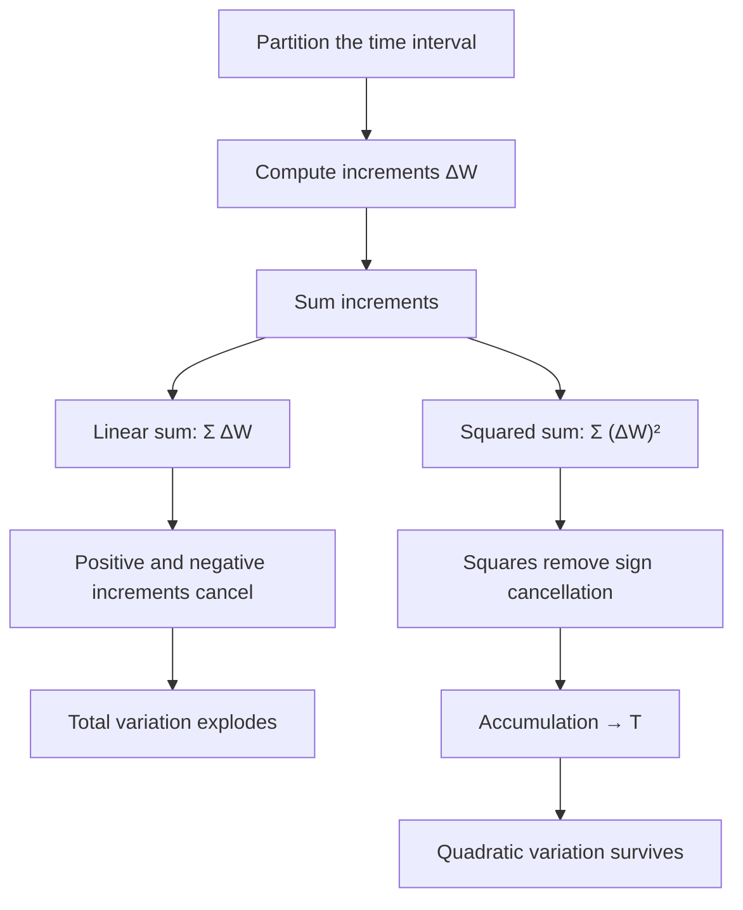
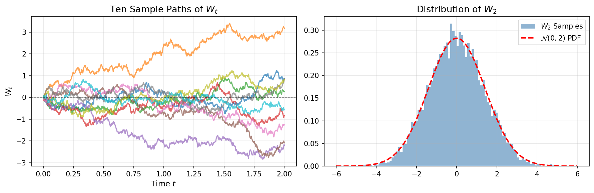
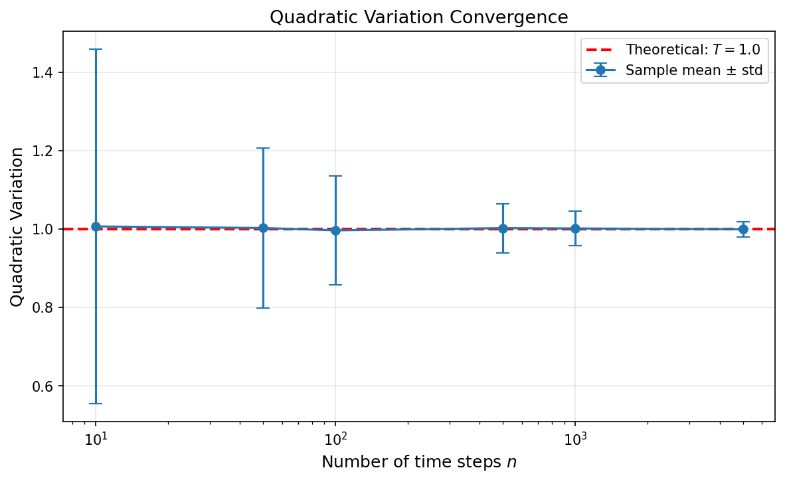
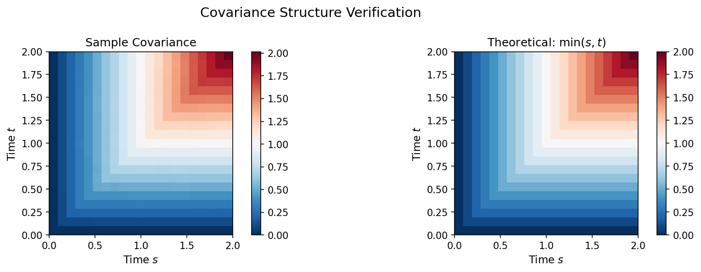

# Brownian Motion

### Introduction

Having established the discrete random walk and its scaling limit via Donsker's theorem, we now define **Brownian motion** axiomatically. Brownian motion (also called the **Wiener process**) is the canonical continuous-time random motion that serves as the foundation for:

- Stochastic calculus and stochastic differential equations
- Mathematical finance (Black-Scholes theory)
- Statistical physics (diffusion processes)
- Filtering theory and signal processing

A standard Brownian motion is any stochastic process with continuous paths, independent increments, and stationary Gaussian increments whose variance equals the time difference, starting from zero. Any two such processes are equal in law (up to modification), making Brownian motion the fundamental building block for continuous-time stochastic modeling. The precise axiomatic definition is given below.

### Intuitive Construction

Before giving the formal definition, we develop intuition through discrete approximations that can be performed "by hand."

#### Construction via Standard Normal Increments

Consider the following discrete-to-continuous procedure:

| Quantity | Notation |
|----------|----------|
| Number of ticks per year | $n$ |
| Standard normal increment at tick $k$ | $X_k$ |
| Number of ticks between $0$ and $t$ | $\lfloor nt \rfloor$ |
| Cumulative increments up to time $t$ | $\displaystyle\sum_{k=1}^{\lfloor nt \rfloor}X_k$ |
| **Normalized cumulative sum** | $\displaystyle B_t= \frac{1}{\sqrt{n}}\sum_{k=1}^{\lfloor nt \rfloor}X_k$ |

where $X_k \stackrel{\text{iid}}{\sim} \mathcal{N}(0,1)$.

**Key observation:** As $n \to \infty$, by the central limit theorem (more precisely, Donsker's theorem), $B_t$ converges to Brownian motion.

#### Construction via Fair Coin Flips

Equivalently, using $\{-1, +1\}$ random variables:

| Quantity | Notation |
|----------|----------|
| Number of ticks per year | $n$ |
| Fair coin flip at tick $k$ ($H = 1$, $T = -1$) | $X_k$ |
| Number of ticks between $0$ and $t$ | $\lfloor nt \rfloor$ |
| Cumulative fair coin flips up to time $t$ | $\displaystyle\sum_{k=1}^{\lfloor nt \rfloor}X_k$ |
| **Normalized cumulative sum** | $\displaystyle B_t= \frac{1}{\sqrt{n}}\sum_{k=1}^{\lfloor nt \rfloor}X_k$ |

where $\mathbb{P}(X_k = 1) = \mathbb{P}(X_k = -1) = 1/2$.

#### Construction via General i.i.d. Increments

More generally, for any i.i.d. sequence $\{X_k\}$ with $\mathbb{E}[X_k] = \mu$ and $\text{Var}(X_k) = \sigma^2$:

$$B_t= \frac{1}{\sqrt{n}}\sum_{k=1}^{\lfloor nt \rfloor}\frac{X_k-\mu}{\sigma}$$

By Donsker's invariance principle, all three constructions yield the same limit: **Brownian motion**.

#### Example: Concrete Path Construction

**Problem:** We flip a fair coin 10 times and get: $HHTHTTHHHT$

Construct a Brownian motion sample path up to time $t = 1$.

**Solution:** With $n = 10$ ticks per year:

| Time | $0/10$ | $1/10$ | $2/10$ | $3/10$ | $4/10$ | $5/10$ | $6/10$ | $7/10$ | $8/10$ | $9/10$ | $10/10$ |
|------|--------|--------|--------|--------|--------|--------|--------|--------|--------|--------|---------|
| Coin flip | — | $H$ | $H$ | $T$ | $H$ | $T$ | $T$ | $H$ | $H$ | $H$ | $T$ |
| Conversion | — | $1$ | $1$ | $-1$ | $1$ | $-1$ | $-1$ | $1$ | $1$ | $1$ | $-1$ |
| Cum sum | $0$ | $1$ | $2$ | $1$ | $2$ | $1$ | $0$ | $1$ | $2$ | $3$ | $2$ |
| $B_t$ | $0$ | $0.316$ | $0.632$ | $0.316$ | $0.632$ | $0.316$ | $0$ | $0.316$ | $0.632$ | $0.949$ | $0.632$ |

Connecting the grid points linearly gives a piecewise linear approximation to a Brownian path. As $n \to \infty$, such approximations converge to continuous Brownian motion.

### Axiomatic Definition

**Definition 1.3.1** (Standard Brownian Motion)

A **standard Brownian motion** $\{W_t\}_{t \ge 0}$ on a probability space $(\Omega,\mathcal{F},\mathbb{P})$ is a stochastic process satisfying:

**(i) Initial condition:**

$$W_0 = 0 \quad \text{almost surely}$$

**(ii) Independent increments:** For $0 \le t_0 < t_1 < \cdots < t_n$, the increments

$$W_{t_1}-W_{t_0},\quad W_{t_2}-W_{t_1},\quad \ldots,\quad W_{t_n}-W_{t_{n-1}}$$

are independent random variables.

**(iii) Gaussian stationary increments:** For $0 \le s < t$,

$$W_t - W_s \sim \mathcal{N}(0,t-s)$$

**(iv) Continuity of paths:** The map $t \mapsto W_t(\omega)$ is continuous for almost every $\omega \in \Omega$.

**Remark 1:** Conditions (i)-(iii) specify the finite-dimensional distributions (Gaussian with specific covariance). Condition (iv) selects the continuous version among all processes with these distributions.

**Remark 2:** Properties (ii) and (iii) together make Brownian motion a **Lévy process** (continuous-time analog of random walk with independent, stationary increments).

### Finite-Dimensional Distributions

#### Joint Distribution

The axiomatic properties fully determine the joint law of Brownian motion at any finite collection of times.

**Proposition 1.3.2**

For any $0 \le t_1 < t_2 < \cdots < t_n$, the random vector $(W_{t_1}, W_{t_2}, \ldots, W_{t_n})$ is multivariate Gaussian with mean zero and covariance matrix $\Sigma$ where

$$\Sigma_{ij} = \mathbb{E}[W_{t_i} W_{t_j}] = \min(t_i,t_j)$$

**Proof:**

Write the vector in terms of independent increments. Define $\Delta W_k = W_{t_k} - W_{t_{k-1}}$ and $\Delta t_k = t_k - t_{k-1}$ for $k = 1, \ldots, n$ (with $t_0 = 0$):

$$\begin{pmatrix} W_{t_1} \\ W_{t_2} \\ \vdots \\ W_{t_n} \end{pmatrix}
= 
\begin{pmatrix} 
1 & 0 & \cdots & 0 \\
1 & 1 & \cdots & 0 \\
\vdots & \vdots & \ddots & \vdots \\
1 & 1 & \cdots & 1
\end{pmatrix}
\begin{pmatrix} \Delta W_1 \\ \Delta W_2 \\ \vdots \\ \Delta W_n \end{pmatrix}$$

Since the increments $\Delta W_k \sim \mathcal{N}(0, \Delta t_k)$ are independent Gaussians, their linear combination is Gaussian. The covariance is:

$$\mathbb{E}[W_{t_i} W_{t_j}] = \sum_{k=1}^{\min(i,j)} \mathbb{E}[(\Delta W_k)^2] = \sum_{k=1}^{\min(i,j)} \Delta t_k = t_{\min(i,j)} = \min(t_i, t_j) \quad \square$$

#### Characteristic Function

**Proposition 1.3.3**

For $0 \le s < t$ and $\lambda \in \mathbb{R}$:

$$\boxed{
\mathbb{E}\left[e^{i\lambda(W_t-W_s)}\right]
=
\exp\left(-\frac{1}{2}\lambda^2(t-s)\right)
}$$

### Covariance Structure

The following formula is the most important single fact about the second-order structure of Brownian motion.

**Theorem 1.3.4** (Covariance Formula)

For all $s,t \ge 0$:

$$\boxed{\mathbb{E}[W_s W_t] = \min(s,t)}$$

**Proof:**

Without loss of generality, assume $s \le t$. Since Brownian increments are independent and centered, write $W_t = W_s + (W_t - W_s)$. Because $W_s$ and $W_t - W_s$ are independent and the increment has mean zero,

$$\mathbb{E}[W_s(W_t - W_s)] = 0$$

Hence $\mathbb{E}[W_s W_t] = \mathbb{E}[W_s^2] = s = \min(s,t)$. $\square$

**Intuition from the covariance structure:**

- **Persistent covariance**: Increments are independent, but the levels $W_s$ and $W_t$ remain correlated for all $s, t$
- **Self-similarity**: The $\min$ structure is scale-invariant

The covariance structure completely determines the Gaussian process. We now turn to path-level properties, beginning with the fundamental scaling symmetry.

### Scaling Property

The next result shows that Brownian motion is statistically self-similar under time rescaling.

**Theorem 1.3.5** (Scaling / Self-Similarity)

For any $c > 0$:

$$\boxed{W_{ct} \overset{d}{=} \sqrt{c} \, W_t}$$

**Proof:**

For any $t_1, \ldots, t_n$, both $(W_{ct_1}, \ldots, W_{ct_n})$ and $(\sqrt{c}\,W_{t_1}, \ldots, \sqrt{c}\,W_{t_n})$ are centered Gaussian vectors. Since their covariance matrices coincide — $\min(ct_i, ct_j) = c\,\min(t_i, t_j)$ — their distributions agree. $\square$

**Interpretation:** Brownian motion has **no intrinsic time scale**: zooming into the path produces another Brownian motion after rescaling. The Hurst exponent $H = 1/2$ characterizes standard Brownian motion.

### Martingale Property

**Theorem 1.3.6** (Martingale Property)

The following processes are martingales with respect to the natural filtration
$\mathcal{F}_t = \sigma(W_s : s \le t)$:

(i) $W_t$ — standard Brownian motion itself.

(ii) $W_t^2 - t$ — the "variance-adjusted" process.

**Proof of (i).** For $s \le t$, write $W_t = W_s + (W_t - W_s)$. Since $W_t - W_s$ is
independent of $\mathcal{F}_s$ and has mean zero:

$$\mathbb{E}[W_t \mid \mathcal{F}_s] = W_s + \mathbb{E}[W_t - W_s \mid \mathcal{F}_s] = W_s + 0 = W_s. \quad \square$$

**Proof of (ii).** Using $W_t^2 = (W_s + (W_t - W_s))^2 = W_s^2 + 2W_s(W_t-W_s) + (W_t-W_s)^2$:

$$\mathbb{E}[W_t^2 - t \mid \mathcal{F}_s]
= W_s^2 + 2W_s \cdot 0 + (t-s) - t = W_s^2 - s. \quad \square$$

The martingale property of $W_t$ expresses the "fair game" character of Brownian motion:
given the past, the best prediction of the future value is the current value. The
martingale $W_t^2 - t$ will be central to the theory of stochastic integration.

### Nowhere Differentiability

Because increments scale like $\sqrt{\Delta t}$, the ratio $(W_{t+h} - W_t)/h$ typically behaves like $1/\sqrt{h}$, which diverges as $h \to 0$. This means paths are too rough for classical derivatives. The next two results make this precise: paths are nowhere differentiable, yet their squared increments accumulate in a controlled way.

**Theorem 1.3.7** (Nowhere Differentiability)

With probability one, for every $t \ge 0$

$$\limsup_{h \to 0} \frac{|W_{t+h}-W_t|}{|h|} = \infty$$

**Lévy's modulus of continuity:** The precise local behavior is given by:

$$\limsup_{h \to 0^+} \frac{|W_{t+h} - W_t|}{\sqrt{2h \log(1/h)}} = 1 \quad \text{a.s.}$$

This result, due to Paul Lévy, quantifies the exact rate of oscillation of Brownian paths.

**Implications:**

- Brownian paths are continuous but nowhere differentiable
- Total variation is infinite: $\int_0^T |dW_t| = \infty$ a.s.
- Classical calculus fails; we need **Itô calculus**

### Quadratic Variation

Brownian increments are of order $\sqrt{\Delta t}$. When increments are summed linearly, positive and negative contributions cancel and the total variation diverges. However, when increments are squared, the sign disappears and the contributions accumulate. This accumulation produces the **quadratic variation**, which converges to the elapsed time.


```mermaid
flowchart TD

A[Partition the time interval] --> B[Compute increments ΔW]
B --> C[Sum increments]

C --> D1["Linear sum: Σ ΔW"]
C --> D2["Squared sum: Σ (ΔW)²"]

D1 --> E1[Positive and negative increments cancel]
E1 --> F1[Total variation explodes]

D2 --> E2[Squares remove sign cancellation]
E2 --> F2["Accumulation → T"]

F2 --> G[Quadratic variation survives]
```

**Theorem 1.3.8** (Quadratic Variation)

For any partition $\Pi_n$ with mesh $|\Pi_n| \to 0$:

$$\boxed{\sum_{i=0}^{n-1} (W_{t_{i+1}}-W_{t_i})^2 \xrightarrow{\mathbb{P}} T}$$

**Proof:**

Let $Q_n = \sum_{i=0}^{n-1} (W_{t_{i+1}} - W_{t_i})^2$. For a uniform partition with mesh $|\Pi_n| = T/n$:

- $\mathbb{E}[Q_n] = \sum_{i=0}^{n-1} \mathbb{E}[(W_{t_{i+1}} - W_{t_i})^2] = \sum_{i=0}^{n-1} (t_{i+1} - t_i) = T$
Since the increments $W_{t_{i+1}} - W_{t_i}$ are independent Gaussian variables, their squares are independent. Hence

- $\text{Var}(Q_n) = \sum_{i=0}^{n-1} \text{Var}((W_{t_{i+1}} - W_{t_i})^2) = \sum_{i=0}^{n-1} 2(t_{i+1} - t_i)^2 = 2n \cdot \frac{T^2}{n^2} = \frac{2T^2}{n} \to 0$

where we used $\text{Var}(Z^2) = 2\sigma^4$ for $Z \sim \mathcal{N}(0, \sigma^2)$.

By Chebyshev's inequality: $Q_n \xrightarrow{\mathbb{P}} T$. $\square$

**Remark:** The convergence above is in probability. Along refining partitions, one can strengthen this to almost sure convergence; this pathwise interpretation is used in Itô calculus.

**Notation:** $[W]_T = T$, written differentially as $dW_t^2 = dt$.

**This is the foundation for Itô's formula:** $(dW_t)^2 = dt$, not 0.

### Martingale Property

The martingale property of Brownian motion — $\mathbb{E}[W_t \mid \mathcal{F}_s] = W_s$ — and the related result that $W_t^2 - t$ is a martingale are established with full proofs in **Theorem 1.3.6** above. The natural filtration is:

**Definition 1.3.9** (Natural Filtration)

The **natural filtration** of Brownian motion is $\mathcal{F}_t = \sigma(W_s : 0 \leq s \leq t)$, the $\sigma$-algebra generated by the process up to time $t$. This represents all information available from observing the path up to time $t$.

### Computational Verification

We now confirm the theoretical properties developed above through Monte Carlo simulation.

#### Sample Paths and Terminal Distribution

To simulate Brownian motion on $[0, T]$ with $n$ time steps:

1. **Time discretization:** $t_i = i \cdot \Delta t$ where $\Delta t = T/n$
2. **Independent increments:** $\Delta W_i = W_{t_{i+1}} - W_{t_i} \sim \mathcal{N}(0, \Delta t)$
3. **Path construction:** $W_{t_i} = \sum_{j=1}^{i} \Delta W_j$ (cumulative sum)

```python
import matplotlib.pyplot as plt
import numpy as np
import scipy.stats as stats

# Simulation parameters
num_paths = 10_000
num_steps = 1_000
maturity_time = 2

np.random.seed(42)  # Fixed seed for reproducibility

# Generate time grid
dt = maturity_time / num_steps
time_steps = np.linspace(0, maturity_time, num_steps + 1)

# Generate Brownian motion paths
dW = np.random.normal(0, np.sqrt(dt), size=(num_paths, num_steps))
brownian_paths = np.cumsum(np.hstack([np.zeros((num_paths, 1)), dW]), axis=1)

# Create figure with two subplots
fig, (ax_paths, ax_distribution) = plt.subplots(1, 2, figsize=(12, 4))

# Plot 10 sample paths
ax_paths.set_title(f'Ten Sample Paths of $W_t$', fontsize=13)
for i in range(10):
    ax_paths.plot(time_steps, brownian_paths[i, :], alpha=0.7, linewidth=1.5)
ax_paths.set_xlabel('Time $t$', fontsize=11)
ax_paths.set_ylabel('$W_t$', fontsize=11)
ax_paths.axhline(0, color='black', linestyle='--', linewidth=0.8, alpha=0.5)
ax_paths.grid(alpha=0.3)

# Plot distribution at maturity
ax_distribution.set_title(f'Distribution of $W_{{{maturity_time}}}$', fontsize=13)
ax_distribution.hist(brownian_paths[:, -1], bins=100, density=True,
                     alpha=0.6, color='steelblue', label=f"$W_{{{maturity_time}}}$ Samples")

# Overlay theoretical Gaussian density
x_range = np.linspace(-6, 6, 200)
theoretical_pdf = stats.norm(loc=0, scale=np.sqrt(maturity_time)).pdf(x_range)
ax_distribution.plot(x_range, theoretical_pdf, '--r', linewidth=2,
                     label=f"$\mathcal{{N}}(0,{maturity_time})$ PDF")
ax_distribution.legend(fontsize=10)
ax_distribution.grid(alpha=0.3)

plt.tight_layout()
plt.show()

# Verify mean and variance
print(f"Sample mean: {np.mean(brownian_paths[:, -1]):.6f} (theoretical: 0)")
print(f"Sample variance: {np.var(brownian_paths[:, -1], ddof=1):.6f} (theoretical: {maturity_time})")
```

**Output:**
```
Sample mean: -0.002860 (theoretical: 0)
Sample variance: 1.931260 (theoretical: 2)
```



**Interpretation:**

- **Left plot**: Paths start at origin, are continuous but "wiggly", and diverge as time increases
- **Right plot**: Histogram matches theoretical Gaussian density, confirming $W_T \sim \mathcal{N}(0, T)$

#### Quadratic Variation Convergence

```python
import matplotlib.pyplot as plt
import numpy as np

maturity_time = 1.0
num_steps_list = [10, 50, 100, 500, 1000, 5000]
num_trials = 1000

np.random.seed(42)  # Fixed seed for reproducibility
qv_results = []

for num_steps in num_steps_list:
    dt = maturity_time / num_steps
    qv_paths = np.zeros(num_trials)
    for trial in range(num_trials):
        dW = np.random.normal(0, np.sqrt(dt), size=num_steps)
        W = np.cumsum(np.insert(dW, 0, 0))
        qv_paths[trial] = np.sum(np.diff(W)**2)
    qv_results.append({'num_steps': num_steps, 'mean': np.mean(qv_paths), 'std': np.std(qv_paths)})

fig, ax = plt.subplots(figsize=(8, 5))
means = [r['mean'] for r in qv_results]
stds = [r['std'] for r in qv_results]
steps = [r['num_steps'] for r in qv_results]

ax.errorbar(steps, means, yerr=stds, fmt='o-', capsize=5, label='Sample mean ± std')
ax.axhline(maturity_time, color='r', linestyle='--', linewidth=2, label=f'Theoretical: $T = {maturity_time}$')
ax.set_xlabel('Number of time steps $n$', fontsize=12)
ax.set_ylabel('Quadratic Variation', fontsize=12)
ax.set_xscale('log')
ax.legend()
ax.grid(alpha=0.3)
plt.show()

print("Quadratic Variation Convergence:")
for r in qv_results:
    print(f"  n = {r['num_steps']:4d}: mean = {r['mean']:.4f}, std = {r['std']:.4f}")
```

**Output:**
```
Quadratic Variation Convergence:
  n =   10: mean = 1.0068, std = 0.4524
  n =   50: mean = 1.0028, std = 0.2036
  n =  100: mean = 0.9967, std = 0.1396
  n =  500: mean = 1.0025, std = 0.0626
  n = 1000: mean = 1.0017, std = 0.0444
  n = 5000: mean = 0.9997, std = 0.0198
```



**Interpretation:** As the number of time steps increases, the quadratic variation converges to $T = 1$ with decreasing standard deviation proportional to $1/\sqrt{n}$.

#### Covariance Structure

This example verifies the covariance formula $\mathbb{E}[W_s W_t] = \min(s,t)$.

```python
import matplotlib.pyplot as plt
import numpy as np

T = 2.0
num_paths = 10_000
num_time_points = 20

np.random.seed(42)  # Fixed seed for reproducibility
time_points = np.linspace(0, T, num_time_points + 1)
dt = T / num_time_points

dW = np.random.normal(0, np.sqrt(dt), size=(num_paths, num_time_points))
W = np.cumsum(np.hstack([np.zeros((num_paths, 1)), dW]), axis=1)

sample_cov = np.cov(W.T)
theoretical_cov = np.minimum(time_points[:, None], time_points[None, :])

fig, (ax1, ax2) = plt.subplots(1, 2, figsize=(12, 4))
im1 = ax1.imshow(sample_cov, cmap='RdBu_r', origin='lower', extent=[0, T, 0, T])
ax1.set_title('Sample Covariance', fontsize=12)
plt.colorbar(im1, ax=ax1)

im2 = ax2.imshow(theoretical_cov, cmap='RdBu_r', origin='lower', extent=[0, T, 0, T])
ax2.set_title('Theoretical: $\\min(s,t)$', fontsize=12)
plt.colorbar(im2, ax=ax2)
plt.tight_layout()
plt.show()

print(f"RMSE: {np.sqrt(np.mean((sample_cov - theoretical_cov)**2)):.6f}")
print(f"Max absolute error: {np.max(np.abs(sample_cov - theoretical_cov)):.6f}")
```

**Output:**
```
RMSE: 0.011630
Max absolute error: 0.032415
```



**Interpretation:** The sample covariance matrix closely matches the theoretical $\min(s,t)$ structure, with small errors due to finite sample size.

### Summary

The central message of this chapter is that Brownian paths are **continuous but rough**:

- Increments are $O(\sqrt{\Delta t})$, not $O(\Delta t)$
- Paths are continuous but nowhere differentiable
- Total variation is infinite
- Quadratic variation survives: $[W]_t = t$
- Therefore classical calculus fails, and **Itô calculus** is needed

Brownian motion is characterized, up to modification, by:

1. **Continuous paths** (nowhere differentiable, infinite variation)
2. **Independent increments**, each **stationary and Gaussian** with variance equal to the time difference
3. **Quadratic variation** $[W]_t = t$ (foundation for Itô calculus; square-bracket notation is used consistently throughout — see the Quadratic Variation chapter for the relation to angle-bracket notation)
4. **Martingale property** (essential for stochastic integration)
5. **Self-similarity** with Hurst exponent $H = 1/2$

The simulations in this chapter have verified these properties numerically:

- Basic path generation confirms $W_t \sim \mathcal{N}(0, t)$
- Quadratic variation converges to $t$ as mesh refines
- Covariance structure matches $\min(s, t)$

## Exercises

#### Basic Properties

1. Show that $\mathbb{E}[W_t] = 0$ and $\text{Var}(W_t) = t$ directly from the axiomatic definition.

??? success "Solution to Exercise 1"
    From the axiomatic definition, $W_t - W_0 \sim \mathcal{N}(0, t - 0) = \mathcal{N}(0, t)$ (property (iii)), and $W_0 = 0$ a.s. (property (i)). Therefore $W_t \sim \mathcal{N}(0, t)$, which gives:

    $$
    \mathbb{E}[W_t] = 0, \quad \text{Var}(W_t) = \mathbb{E}[W_t^2] - (\mathbb{E}[W_t])^2 = t - 0 = t
    $$

---

2. Compute $\mathbb{E}[W_s W_t]$ for $0 \le s \le t$ using the independent increments property.

??? success "Solution to Exercise 2"
    Assume $0 \le s \le t$. Write $W_t = W_s + (W_t - W_s)$, where $W_t - W_s$ is independent of $W_s$ (by property (ii), since $W_s = W_s - W_0$ and $W_t - W_s$ are increments over disjoint intervals).

    $$
    \mathbb{E}[W_s W_t] = \mathbb{E}[W_s(W_s + (W_t - W_s))] = \mathbb{E}[W_s^2] + \mathbb{E}[W_s(W_t - W_s)]
    $$

    By independence and $\mathbb{E}[W_t - W_s] = 0$:

    $$
    \mathbb{E}[W_s(W_t - W_s)] = \mathbb{E}[W_s]\mathbb{E}[W_t - W_s] = 0 \cdot 0 = 0
    $$

    Therefore $\mathbb{E}[W_s W_t] = \mathbb{E}[W_s^2] = s = \min(s, t)$.

---

3. Deduce that $(W_t)_{t \ge 0}$ has stationary increments, i.e., $W_t - W_s \overset{d}{=} W_{t-s}$.

??? success "Solution to Exercise 3"
    By property (iii), $W_t - W_s \sim \mathcal{N}(0, t-s)$ and $W_{t-s} - W_0 = W_{t-s} \sim \mathcal{N}(0, t-s)$. Since both are Gaussian with the same mean (0) and variance ($t - s$), they have the same distribution:

    $$
    W_t - W_s \overset{d}{=} W_{t-s}
    $$

    This is stationarity of increments: the distribution of the increment depends only on the length $t - s$, not on the starting time $s$.

#### Gaussian Increments

---

#### Gaussian Increments

Let $0 \le s < t$.

4. Show that $W_t - W_s \sim \mathcal{N}(0, t - s)$ from the definition.

??? success "Solution to Exercise 4"
    This follows directly from property (iii) of the definition: for $0 \le s < t$, the increment $W_t - W_s \sim \mathcal{N}(0, t - s)$.

---

5. Prove that $W_t - W_s$ is independent of $\mathcal{F}_s = \sigma(W_u : u \le s)$.

??? success "Solution to Exercise 5"
    By property (ii), for any $0 \le t_0 < t_1 < \cdots < t_n$, the increments $W_{t_1} - W_{t_0}, W_{t_2} - W_{t_1}, \ldots$ are independent. In particular, $W_t - W_s$ is independent of $W_{s} - W_{0}, W_{s/2} - W_0, \ldots$ and all events in $\sigma(W_u : u \le s)$.

    More precisely, $W_t - W_s$ is independent of $\sigma(W_{t_1} - W_{t_0}, \ldots, W_{t_k} - W_{t_{k-1}})$ for any partition $0 = t_0 < t_1 < \cdots < t_k = s$. Since the $\sigma$-algebra $\mathcal{F}_s = \sigma(W_u : u \le s)$ is generated by such increments, $W_t - W_s$ is independent of $\mathcal{F}_s$.

---

6. Compute the characteristic function $\mathbb{E}[e^{i\lambda(W_t - W_s)}]$.

??? success "Solution to Exercise 6"
    Since $W_t - W_s \sim \mathcal{N}(0, t-s)$, the characteristic function is:

    $$
    \mathbb{E}[e^{i\lambda(W_t - W_s)}] = e^{-\frac{1}{2}\lambda^2(t-s)}
    $$

    This follows from the general formula for the characteristic function of $\mathcal{N}(\mu, \sigma^2)$: $\mathbb{E}[e^{i\lambda X}] = e^{i\lambda\mu - \frac{1}{2}\lambda^2\sigma^2}$. With $\mu = 0$ and $\sigma^2 = t - s$, the result follows.

#### Path Continuity

---

#### Path Continuity

7. Show that $\mathbb{E}[(W_t - W_s)^2] = |t - s|$.

??? success "Solution to Exercise 7"
    Since $W_t - W_s \sim \mathcal{N}(0, t-s)$:

    $$
    \mathbb{E}[(W_t - W_s)^2] = \text{Var}(W_t - W_s) + (\mathbb{E}[W_t - W_s])^2 = (t - s) + 0 = |t - s|
    $$

---

8. Use Kolmogorov's continuity theorem to justify the existence of a continuous modification. (Hint: Show $\mathbb{E}[|W_t - W_s|^4] = 3(t-s)^2$.)

??? success "Solution to Exercise 8"
    Kolmogorov's continuity theorem requires $\mathbb{E}[|X_t - X_s|^p] \le C|t-s|^{1+\beta}$ for some $p > 0$ and $\beta > 0$.

    For Brownian motion with $p = 4$: Since $W_t - W_s \sim \mathcal{N}(0, t-s)$ and $\mathbb{E}[Z^4] = 3$ for $Z \sim \mathcal{N}(0,1)$:

    $$
    \mathbb{E}[|W_t - W_s|^4] = \mathbb{E}[(W_t - W_s)^4] = 3(t-s)^2 = 3|t-s|^{1+1}
    $$

    This gives $C = 3$, $\beta = 1$, $p = 4$. By Kolmogorov's theorem, $W$ has a continuous modification that is Hölder-$\alpha$ for any $\alpha < \beta/p = 1/4$. Taking larger $p$ (which is allowed since all Gaussian moments are finite) improves the bound to $\alpha < 1/2 - 1/p$, and letting $p \to \infty$ gives continuity with Hölder exponent up to (but not including) $1/2$.

---

9. Why does Brownian motion fail to be differentiable almost surely? (Hint: Consider what differentiability would imply for $\mathbb{E}[(W_{t+h} - W_t)^2]/h^2$ as $h \to 0$.)

??? success "Solution to Exercise 9"
    If $W$ were differentiable at some point $t$ with derivative $L$, then $W_{t+h} - W_t \approx Lh$ for small $h$, so:

    $$
    \frac{\mathbb{E}[(W_{t+h} - W_t)^2]}{h^2} = \frac{h}{h^2} = \frac{1}{h} \to \infty \quad \text{as } h \to 0
    $$

    But differentiability would require $\mathbb{E}[(W_{t+h} - W_t)^2]/h^2 \to L^2$ (finite). The divergence $1/h \to \infty$ shows this is impossible. The difference quotient $(W_{t+h} - W_t)/h$ has variance $1/h \to \infty$, meaning it fluctuates without bound rather than converging to a limit.

#### Martingale Properties

---

#### Martingale Properties

10. Show that $(W_t)_{t \ge 0}$ is a martingale with respect to its natural filtration.

??? success "Solution to Exercise 10"
    For $s \le t$, write $W_t = W_s + (W_t - W_s)$. Since $W_t - W_s$ is independent of $\mathcal{F}_s = \sigma(W_u : u \le s)$ and has mean zero:

    $$
    \mathbb{E}[W_t | \mathcal{F}_s] = \mathbb{E}[W_s + (W_t - W_s) | \mathcal{F}_s] = W_s + \mathbb{E}[W_t - W_s | \mathcal{F}_s] = W_s + \mathbb{E}[W_t - W_s] = W_s + 0 = W_s
    $$

    Also, $\mathbb{E}[|W_t|] = \sqrt{2t/\pi} < \infty$ for all $t$, and $W_t$ is adapted to $\mathcal{F}_t$. So $(W_t)$ is a martingale.

---

11. Show that $(W_t^2 - t)_{t \ge 0}$ is a martingale.

??? success "Solution to Exercise 11"
    Write $W_t^2 = (W_s + (W_t - W_s))^2 = W_s^2 + 2W_s(W_t - W_s) + (W_t - W_s)^2$. Taking conditional expectations:

    $$
    \mathbb{E}[W_t^2 | \mathcal{F}_s] = W_s^2 + 2W_s \cdot \mathbb{E}[W_t - W_s | \mathcal{F}_s] + \mathbb{E}[(W_t - W_s)^2 | \mathcal{F}_s]
    $$

    $$
    = W_s^2 + 2W_s \cdot 0 + (t - s) = W_s^2 + (t - s)
    $$

    Therefore:

    $$
    \mathbb{E}[W_t^2 - t | \mathcal{F}_s] = W_s^2 + (t - s) - t = W_s^2 - s
    $$

    This confirms $(W_t^2 - t)$ is a martingale.

---

12. Is $(W_t^3)_{t \ge 0}$ a martingale? Justify your answer by computing $\mathbb{E}[W_t^3 | \mathcal{F}_s]$. (Hint: use the Gaussian moments of $W_t - W_s$.)

??? success "Solution to Exercise 12"
    $(W_t^3)$ is **not** a martingale. Compute $\mathbb{E}[W_t^3 | \mathcal{F}_s]$ by expanding $W_t = W_s + (W_t - W_s)$. Let $\Delta = W_t - W_s$:

    $$
    W_t^3 = (W_s + \Delta)^3 = W_s^3 + 3W_s^2\Delta + 3W_s\Delta^2 + \Delta^3
    $$

    Taking conditional expectations (using $\mathbb{E}[\Delta | \mathcal{F}_s] = 0$, $\mathbb{E}[\Delta^2 | \mathcal{F}_s] = t - s$, $\mathbb{E}[\Delta^3 | \mathcal{F}_s] = 0$):

    $$
    \mathbb{E}[W_t^3 | \mathcal{F}_s] = W_s^3 + 0 + 3W_s(t-s) + 0 = W_s^3 + 3W_s(t-s)
    $$

    Since $\mathbb{E}[W_t^3 | \mathcal{F}_s] = W_s^3 + 3W_s(t-s) \neq W_s^3$ (unless $t = s$), the process $(W_t^3)$ is not a martingale. However, one can check that $W_t^3 - 3tW_t$ is a martingale.

#### Covariation

---

#### Covariation

Let $W_t$ and $\widetilde{W}_t$ be independent Brownian motions.

13. Compute the quadratic covariation $\langle W, \widetilde{W} \rangle_t$.

??? success "Solution to Exercise 13"
    If $W_t$ and $\widetilde{W}_t$ are independent Brownian motions, the cross variation is:

    $$
    \langle W, \widetilde{W} \rangle_t = \lim_{\|\Pi\| \to 0} \sum_i (W_{t_{i+1}} - W_{t_i})(\widetilde{W}_{t_{i+1}} - \widetilde{W}_{t_i})
    $$

    The expectation of each term is $\mathbb{E}[\Delta W_i \cdot \Delta\widetilde{W}_i] = 0$ (by independence), and the variance of the sum is:

    $$
    \text{Var}\left(\sum_i \Delta W_i \cdot \Delta\widetilde{W}_i\right) = \sum_i \text{Var}(\Delta W_i \cdot \Delta\widetilde{W}_i) = \sum_i (\Delta t_i)^2 \le \|\Pi\| \cdot T \to 0
    $$

    Therefore $\langle W, \widetilde{W} \rangle_t = 0$.

---

14. What is $\langle W, \widetilde{W} \rangle_t$ if $\widetilde{W}_t = \rho W_t + \sqrt{1-\rho^2} B_t$, where $B_t$ is independent of $W_t$?

??? success "Solution to Exercise 14"
    With $\widetilde{W}_t = \rho W_t + \sqrt{1-\rho^2} B_t$ where $B_t$ is independent of $W_t$:

    $$
    \langle W, \widetilde{W} \rangle_t = \langle W, \rho W + \sqrt{1-\rho^2} B \rangle_t = \rho \langle W, W \rangle_t + \sqrt{1-\rho^2} \langle W, B \rangle_t
    $$

    Since $\langle W, W \rangle_t = t$ and $\langle W, B \rangle_t = 0$ (by independence):

    $$
    \langle W, \widetilde{W} \rangle_t = \rho t
    $$

---

15. Interpret the result in terms of correlation between the two processes.

??? success "Solution to Exercise 15"
    The result $\langle W, \widetilde{W} \rangle_t = \rho t$ shows that the quadratic covariation per unit time equals the correlation $\rho$ between the two processes. This means:

    - $\rho = 1$: The processes move in lockstep; $\langle W, \widetilde{W} \rangle_t = t = \langle W, W \rangle_t$
    - $\rho = 0$: The processes are independent; $\langle W, \widetilde{W} \rangle_t = 0$
    - $\rho = -1$: The processes move in opposite directions; $\langle W, \widetilde{W} \rangle_t = -t$

    In multi-asset finance, $\rho$ governs the diversification benefit: the portfolio variance depends on the cross variation between asset returns.

#### Challenge Problems (Optional Advanced)

---

#### Challenge Problems (Optional Advanced)

16. Show that Brownian motion has infinite total variation on any interval $[0, T]$ almost surely.

??? success "Solution to Exercise 16"
    For the uniform partition $\Pi_n$ of $[0, T]$ with $\Delta t = T/n$, each $|\Delta W_i| = |W_{t_{i+1}} - W_{t_i}|$ satisfies $\mathbb{E}[|\Delta W_i|] = \sqrt{2\Delta t/\pi} = \sqrt{2T/(\pi n)}$.

    The expected total variation is:

    $$
    \mathbb{E}[V_1(W, \Pi_n)] = n \cdot \sqrt{\frac{2T}{\pi n}} = \sqrt{\frac{2nT}{\pi}} \to \infty
    $$

    For a lower bound on the total variation itself: by the Cauchy-Schwarz inequality,

    $$
    V_1(W, \Pi_n) = \sum_i |\Delta W_i| \ge \frac{(\sum_i |\Delta W_i|)^2}{\sum_i |\Delta W_i|} \ge \frac{\sum_i (\Delta W_i)^2}{\max_i |\Delta W_i|}
    $$

    As $\|\Pi_n\| \to 0$: the numerator converges to $T$ in $L^2$ (quadratic variation), and the denominator converges to $0$ in probability (by Hölder continuity). Therefore $V_1(W, \Pi_n) \to \infty$ in probability, and $V_1(W) = \sup_\Pi V_1(W, \Pi) = +\infty$ a.s.

---

17. Prove that Brownian motion is Hölder continuous of any order $\alpha < 1/2$, but of no order $\alpha \ge 1/2$.

??? success "Solution to Exercise 17"
    **Hölder-$\alpha$ for $\alpha < 1/2$:** Since $W_t - W_s \sim \mathcal{N}(0, t-s)$, for any $p > 2$:

    $$
    \mathbb{E}[|W_t - W_s|^p] = C_p |t-s|^{p/2}
    $$

    Kolmogorov's continuity criterion (with $\beta = p/2 - 1 > 0$) gives Hölder-$\alpha$ for $\alpha < \beta/p = 1/2 - 1/p$. Taking $p \to \infty$ yields $\alpha < 1/2$.

    **Not Hölder-$1/2$:** By the law of the iterated logarithm:

    $$
    \limsup_{h \to 0^+} \frac{|W_{t+h} - W_t|}{\sqrt{2h\log\log(1/h)}} = 1 \quad \text{a.s.}
    $$

    If $W$ were Hölder-$1/2$, we would have $|W_{t+h} - W_t| \le C\sqrt{h}$, so the limsup would be 0. The limsup being 1 contradicts this, so $W$ is not Hölder-$1/2$.

---

18. (Time Reversal) Let $\tilde{W}_t = W_T - W_{T-t}$ for $t \in [0, T]$. Show that $\tilde{W}$ is also a Brownian motion on $[0, T]$.

??? success "Solution to Exercise 18"
    Define $\tilde{W}_t = W_T - W_{T-t}$ for $t \in [0, T]$. We verify the four properties:

    **(i)** $\tilde{W}_0 = W_T - W_T = 0$.

    **(ii) Independent increments:** For $0 \le t_0 < t_1 < \cdots < t_n \le T$:

    $$
    \tilde{W}_{t_k} - \tilde{W}_{t_{k-1}} = (W_T - W_{T-t_k}) - (W_T - W_{T-t_{k-1}}) = W_{T-t_{k-1}} - W_{T-t_k}
    $$

    Since $T - t_n < T - t_{n-1} < \cdots < T - t_0$, these are increments of $W$ over disjoint intervals (in reverse order), hence independent.

    **(iii) Gaussian stationary increments:**

    $$
    \tilde{W}_t - \tilde{W}_s = W_{T-s} - W_{T-t} \sim \mathcal{N}(0, (T-s) - (T-t)) = \mathcal{N}(0, t-s)
    $$

    **(iv) Continuous paths:** $t \mapsto \tilde{W}_t = W_T - W_{T-t}$ is continuous since $W$ has continuous paths.

---

19. (Exponential Martingale) Define $M_t := \exp\left( \lambda W_t - \frac{1}{2} \lambda^2 t \right)$ for $\lambda \in \mathbb{R}$. Show that $(M_t)_{t \ge 0}$ is a martingale and compute $\mathbb{E}[M_t]$. Explain why this is fundamental in stochastic calculus and mathematical finance (hint: Girsanov theorem, risk-neutral pricing).

??? success "Solution to Exercise 19"
    Define $M_t = \exp(\lambda W_t - \frac{1}{2}\lambda^2 t)$. We show this is a martingale.

    For $s \le t$, write $W_t = W_s + (W_t - W_s)$:

    $$
    \mathbb{E}[M_t | \mathcal{F}_s] = \mathbb{E}\left[\exp\left(\lambda W_s + \lambda(W_t - W_s) - \frac{1}{2}\lambda^2 t\right) \Big| \mathcal{F}_s\right]
    $$

    $$
    = \exp\left(\lambda W_s - \frac{1}{2}\lambda^2 t\right) \cdot \mathbb{E}\left[e^{\lambda(W_t - W_s)}\right]
    $$

    Since $W_t - W_s \sim \mathcal{N}(0, t-s)$, the MGF gives $\mathbb{E}[e^{\lambda(W_t - W_s)}] = e^{\frac{1}{2}\lambda^2(t-s)}$. Therefore:

    $$
    \mathbb{E}[M_t | \mathcal{F}_s] = \exp\left(\lambda W_s - \frac{1}{2}\lambda^2 t + \frac{1}{2}\lambda^2(t-s)\right) = \exp\left(\lambda W_s - \frac{1}{2}\lambda^2 s\right) = M_s
    $$

    Also, $\mathbb{E}[M_t] = M_0 = e^0 = 1$ for all $t$.

    **Significance:** The exponential martingale is the Radon-Nikodym derivative used in the **Girsanov theorem** to change probability measures. In finance, it transforms the real-world measure $\mathbb{P}$ to the risk-neutral measure $\mathbb{Q}$ under which discounted asset prices are martingales, enabling arbitrage-free option pricing.

---

20. (Law of the Iterated Logarithm) The law of the iterated logarithm states that $\limsup_{t \to 0^+} \frac{W_t}{\sqrt{2 t \log \log (1/t)}} = 1$ a.s. Interpret this result in terms of path oscillation and explain why it is incompatible with differentiability.

??? success "Solution to Exercise 20"
    The law of the iterated logarithm states:

    $$
    \limsup_{t \to 0^+} \frac{W_t}{\sqrt{2t\log\log(1/t)}} = 1 \quad \text{a.s.}
    $$

    **Interpretation:** Near $t = 0$, the largest fluctuations of $W_t$ are of order $\sqrt{2t\log\log(1/t)}$. This is slightly larger than $\sqrt{t}$ (by the slowly varying factor $\sqrt{\log\log(1/t)}$).

    **Incompatibility with differentiability:** If $W$ were differentiable at $t = 0$ with derivative $L$, then $W_t \approx Lt$ for small $t$, which means:

    $$
    \frac{W_t}{\sqrt{2t\log\log(1/t)}} \approx \frac{Lt}{\sqrt{2t\log\log(1/t)}} = L\sqrt{\frac{t}{2\log\log(1/t)}} \to 0
    $$

    But the limsup is 1, not 0. The LIL shows that Brownian motion oscillates at rate $\sqrt{t\log\log(1/t)}$, which is infinitely faster than the linear rate $t$ required for differentiability. The oscillations never "calm down" at any time scale.

### References

- Billingsley, P. (1995). *Probability and Measure*, 3rd ed. Wiley.
- Karatzas, I., & Shreve, S. E. (1991). *Brownian Motion and Stochastic Calculus*, 2nd ed. Springer.
- Kallenberg, O. (2002). *Foundations of Modern Probability*, 2nd ed. Springer.
- Mörters, P., & Peres, Y. (2010). *Brownian Motion*. Cambridge University Press.
- Revuz, D., & Yor, M. (1999). *Continuous Martingales and Brownian Motion*, 3rd ed. Springer.
- Glasserman, P. (2003). *Monte Carlo Methods in Financial Engineering*. Springer.
- Kloeden, P. E., & Platen, E. (1992). *Numerical Solution of Stochastic Differential Equations*. Springer.
