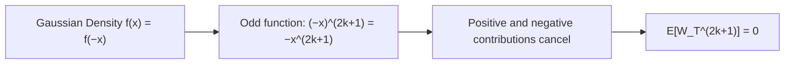
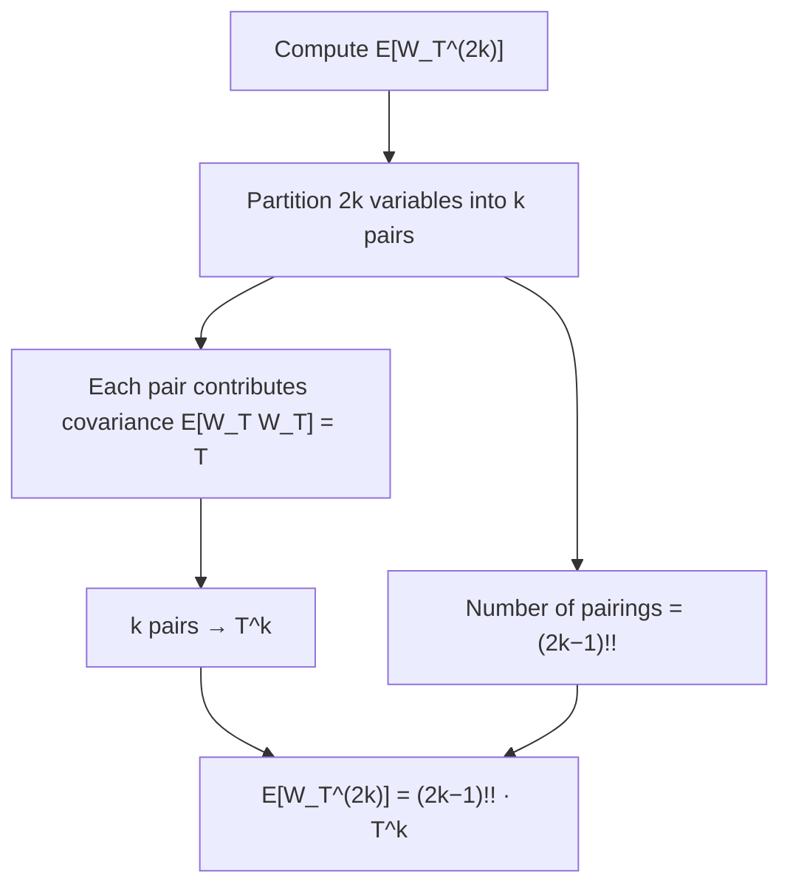
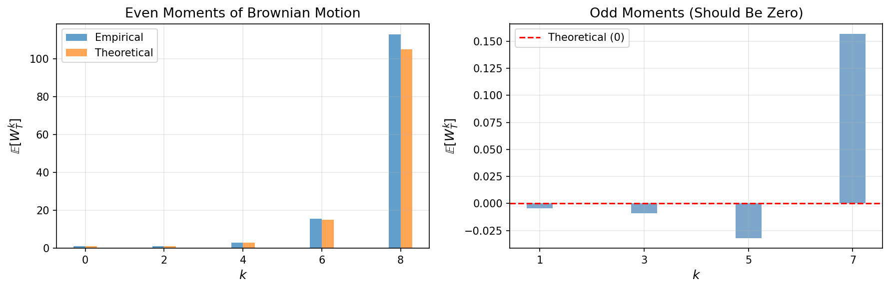

# Moments of Brownian Motion

## Introduction

In **Brownian Motion Foundations**, we established that for standard Brownian motion $\{W_t\}_{t \ge 0}$:

$$\mathbb{E}[W_t] = 0, \quad \mathbb{E}[W_t^2] = t$$

These are the first two moments. But what about higher moments? Can we find explicit formulas for $\mathbb{E}[W_t^k]$ for all $k$?

Understanding the complete moment structure of Brownian motion provides:

1. **Analytical tools** for computing expectations of functions of Brownian motion
2. **Connections to combinatorics** (pairings and double factorials)
3. **Moment-matching techniques** in option pricing and risk management
4. **Verification tools** for numerical schemes and Monte Carlo estimators

We derive the complete moment structure using the **moment generating function**.

## Moment Generating Function

### Definition

For a random variable $X$, the **moment generating function** is:

$$M_X(\theta) := \mathbb{E}[e^{\theta X}]$$

provided the expectation exists in a neighborhood of $\theta = 0$.

The MGF determines all moments via differentiation:

$$\mathbb{E}[X^k] = M_X^{(k)}(0)$$

### MGF of the Normal Distribution

**Theorem** (Gaussian MGF)

If $X \sim \mathcal{N}(\mu, \sigma^2)$, then:

$$M_X(\theta) = \exp\left(\mu \theta + \frac{1}{2} \sigma^2 \theta^2\right)$$

**Proof:**

$$M_X(\theta) = \int_{-\infty}^{\infty} e^{\theta x} \frac{1}{\sqrt{2\pi \sigma^2}} \exp\left( -\frac{(x - \mu)^2}{2 \sigma^2} \right) dx$$

Completing the square in the exponent:

$$-\frac{(x - \mu)^2}{2\sigma^2} + \theta x = -\frac{(x - (\mu + \sigma^2 \theta))^2}{2\sigma^2} + \mu \theta + \frac{1}{2}\sigma^2 \theta^2$$

Factoring out the constant:

$$M_X(\theta) = e^{\mu \theta + \frac{1}{2}\sigma^2 \theta^2} \int_{-\infty}^{\infty} \frac{1}{\sqrt{2\pi \sigma^2}} \exp\left( -\frac{(x - (\mu + \sigma^2 \theta))^2}{2\sigma^2} \right) dx = e^{\mu \theta + \frac{1}{2}\sigma^2 \theta^2}$$

since the integrand is the density of a normal distribution with mean $\mu + \sigma^2\theta$. $\square$

**Corollary**

For Brownian motion at time $T$, $W_T \sim \mathcal{N}(0, T)$, so:

$$M_{W_T}(\theta) = \mathbb{E}[e^{\theta W_T}] = \exp\left(\frac{1}{2} \theta^2 T\right)$$

## Complete Moment Structure

### Main Result

**Theorem** (Moments of Brownian Motion)

Let $W_T$ be Brownian motion at time $T > 0$. Then:

$$\mathbb{E}[W_T^{2k+1}] = 0 \quad \text{for all } k \ge 0$$

$$\mathbb{E}[W_T^{2k}] = \frac{(2k)!}{k! \, 2^k} T^k = (2k-1)!! \cdot T^k \quad \text{for all } k \ge 0$$

where $(2k-1)!! = 1 \cdot 3 \cdot 5 \cdots (2k-1)$ is the **double factorial**.

Thus:

$$\mathbb{E}[W_T^2] = T, \quad \mathbb{E}[W_T^4] = 3T^2, \quad \mathbb{E}[W_T^6] = 15T^3$$

The moment sequence uniquely characterizes the Gaussian distribution.

### Intuition

Two key ideas explain the result.

**Symmetry of the Gaussian distribution.**
Since $W_T \sim \mathcal{N}(0, T)$, its distribution is symmetric around zero. Odd powers of a symmetric variable cancel:



**Pairing of variables.**
Even moments arise from pairing factors of $W_T$. For example, $W_T^4 = W_T \cdot W_T \cdot W_T \cdot W_T$ can be grouped into pairs in three ways:

```
(1,2)(3,4)    (1,3)(2,4)    (1,4)(2,3)
```

Each pair contributes the covariance $\mathbb{E}[W_T W_T] = T$, so each pairing gives $T^2$. Since there are $3 = 3!!$ pairings:

$$\mathbb{E}[W_T^4] = 3T^2$$

In general, the number of ways to partition $2k$ objects into $k$ pairs is $(2k-1)!!$:



This is known as **Isserlis' theorem** (or **Wick's theorem**).

### Proof

Since $W_T \sim \mathcal{N}(0, T)$:

$$M_{W_T}(\theta) = \mathbb{E}[e^{\theta W_T}] = e^{T\theta^2/2}$$

Because $M_{W_T}$ is an **even function** of $\theta$, all odd derivatives vanish:

$$\mathbb{E}[W_T^{2k+1}] = M_{W_T}^{(2k+1)}(0) = 0$$

For even moments, expand:

$$e^{T\theta^2/2} = \sum_{j=0}^\infty \frac{1}{j!} \left(\frac{T\theta^2}{2}\right)^j = \sum_{j=0}^\infty \frac{T^j}{j! \, 2^j} \theta^{2j}$$

Since $M_{W_T}(\theta) = e^{T\theta^2/2}$ is finite for all $\theta$, the series for $e^{\theta W_T}$ is absolutely integrable, so expectation and summation can be interchanged. Comparing coefficients of $\theta^{2k}$:

$$\frac{\mathbb{E}[W_T^{2k}]}{(2k)!} = \frac{T^k}{k! \, 2^k} \implies \mathbb{E}[W_T^{2k}] = \frac{(2k)!}{k! \, 2^k} T^k$$

Using:

$$(2k)! = [2k \cdot (2k-2) \cdots 2] \cdot [(2k-1) \cdot (2k-3) \cdots 1] = 2^k \cdot k! \cdot (2k-1)!!$$

we obtain:

$$\mathbb{E}[W_T^{2k}] = (2k-1)!! \cdot T^k \quad \square$$

### Alternative Derivation

$$\mathbb{E}[W_T^{2k}] = \int_{-\infty}^{\infty} x^{2k} \frac{1}{\sqrt{2\pi T}} e^{-x^2/(2T)} dx$$

Substituting $y = x/\sqrt{T}$:

$$= T^k \int_{-\infty}^{\infty} y^{2k} \frac{1}{\sqrt{2\pi}} e^{-y^2/2} \, dy = (2k-1)!! \cdot T^k$$

where the integral can be evaluated recursively using integration by parts.

### Explicit Values

**Table of first few moments:**

| Moment order $k$ | $\mathbb{E}[W_T^k]$ | Value at $T=1$ |
|-----|---------------------|----------------|
| 0 | 1 | 1 |
| 1 | 0 | 0 |
| 2 | $T$ | 1 |
| 3 | 0 | 0 |
| 4 | $3T^2$ | 3 |
| 5 | 0 | 0 |
| 6 | $15T^3$ | 15 |
| 7 | 0 | 0 |
| 8 | $105T^4$ | 105 |
| 10 | $945T^5$ | 945 |

**Pattern:** Even moments grow as $(2k-1)!! \cdot T^k$, where:

$$1!! = 1, \quad 3!! = 3 \cdot 1 = 3, \quad 5!! = 5 \cdot 3 \cdot 1 = 15, \quad 7!! = 7 \cdot 5 \cdot 3 \cdot 1 = 105, \quad \ldots$$

The sequence $1, 3, 15, 105, \ldots$ reflects the combinatorial growth of pairings.

## Simulation: Verifying Moment Formulas

Since $W_T \sim \mathcal{N}(0, T)$, we can simulate terminal values directly.

```python
import matplotlib.pyplot as plt
import numpy as np
from scipy.special import factorial2  # double factorial: (-1)!! = 1 by convention

# Parameters
T = 1.0
num_paths = 100_000
max_moment = 8

np.random.seed(42)  # Fixed seed for reproducibility

# Simulate terminal values W_T directly
W_T = np.sqrt(T) * np.random.randn(num_paths)

# Compute empirical moments
empirical_moments = []
theoretical_moments = []

for k in range(max_moment + 1):
    emp = np.mean(W_T**k)
    empirical_moments.append(emp)
    
    if k % 2 == 1:  # Odd moments
        theo = 0
    else:  # Even moments: (k-1)!! * T^(k/2)
        theo = factorial2(k - 1, exact=True) * T**(k // 2) if k > 0 else 1
    theoretical_moments.append(theo)

# Display results
print("Moment Verification (T = 1.0):")
print("-" * 55)
print(f"{'k':<4} {'Empirical':<15} {'Theoretical':<15} {'Rel. Error':<15}")
print("-" * 55)
for k in range(max_moment + 1):
    emp = empirical_moments[k]
    theo = theoretical_moments[k]
    if theo != 0:
        rel_err = abs(emp - theo) / abs(theo) * 100
        print(f"{k:<4} {emp:<15.6f} {theo:<15.6f} {rel_err:<15.2f}%")
    else:
        print(f"{k:<4} {emp:<15.6f} {theo:<15.6f} {'—':<15}")

# Plot
fig, (ax1, ax2) = plt.subplots(1, 2, figsize=(12, 4))

# Left: Even moments comparison
even_k = list(range(0, max_moment + 1, 2))
even_emp = [empirical_moments[k] for k in even_k]
even_theo = [theoretical_moments[k] for k in even_k]

ax1.bar(np.array(even_k) - 0.15, even_emp, width=0.3, label='Empirical', alpha=0.7)
ax1.bar(np.array(even_k) + 0.15, even_theo, width=0.3, label='Theoretical', alpha=0.7)
ax1.set_xlabel('$k$', fontsize=12)
ax1.set_ylabel('$\\mathbb{E}[W_T^k]$', fontsize=12)
ax1.set_title('Even Moments of Brownian Motion', fontsize=13)
ax1.legend()
ax1.set_xticks(even_k)
ax1.grid(alpha=0.3)

# Right: Odd moments (should be near zero)
odd_k = list(range(1, max_moment + 1, 2))
odd_emp = [empirical_moments[k] for k in odd_k]

ax2.bar(odd_k, odd_emp, width=0.5, alpha=0.7)
ax2.axhline(0, color='red', linestyle='--', linewidth=1.5, label='Theoretical (0)')
ax2.set_xlabel('$k$', fontsize=12)
ax2.set_ylabel('$\\mathbb{E}[W_T^k]$', fontsize=12)
ax2.set_title('Odd Moments (Should Be Zero)', fontsize=13)
ax2.legend()
ax2.set_xticks(odd_k)
ax2.grid(alpha=0.3)

plt.tight_layout()
plt.savefig('figures/fig06_moments.png', dpi=150, bbox_inches='tight')
plt.show()
```

**Output:**
```
Moment Verification (T = 1.0):
-------------------------------------------------------
k    Empirical       Theoretical     Rel. Error
-------------------------------------------------------
0    1.000000        1.000000        0.00%
1    -0.004592       0.000000        —
2    0.997020        1.000000        0.30%
3    -0.008994       0.000000        —
4    3.020101        3.000000        0.67%
5    -0.031931       0.000000        —
6    15.473554       15.000000       3.16%
7    0.156897        0.000000        —
8    112.934493      105.000000      7.56%
```



**Interpretation:**

- **Even moments** (left plot): Empirical values closely match theoretical $(2k-1)!! \cdot T^k$
- **Odd moments** (right plot): Values are near zero as expected (small deviations due to finite sample size)
- **Relative error** increases with $k$ because the variance of the sample moment $\frac{1}{N}\sum W_T^{2k}$ grows rapidly with moment order, so higher moments require many more samples for accurate estimation

## Growth of Higher Moments

Using Stirling's approximation,

$$(2k-1)!! = \frac{(2k)!}{2^k k!} \sim \sqrt{2} \left(\frac{2k}{e}\right)^k$$

so as $k \to \infty$:

$$\mathbb{E}[W_T^{2k}] \sim \sqrt{2} \left(\frac{2kT}{e}\right)^k$$

Moments grow faster than exponentially in $k$, at a factorial scale. Although the Gaussian distribution has rapidly decaying tails, the high powers $x^{2k}$ amplify rare large observations. This explains why high-order moments are difficult to estimate accurately in Monte Carlo simulations.

**Comparison with bounded processes:**

For a process $X_t$ bounded by $|X_t| \le M$:

$$\mathbb{E}[X_T^{2k}] \le M^{2k}$$

The moment sequence is dominated by a geometric sequence, not factorials.

## Applications

### Computing Expectations

**Example:** Compute $\mathbb{E}\left[\left(\int_0^T W_s ds\right)^2\right]$.

**Solution:**

By Fubini's theorem:

$$\mathbb{E}\left[\left(\int_0^T W_s ds\right)^2\right] = \mathbb{E}\left[\int_0^T \int_0^T W_s W_t \, ds \, dt\right]$$

$$= \int_0^T \int_0^T \mathbb{E}[W_s W_t] \, ds \, dt = \int_0^T \int_0^T \min(s,t) \, ds \, dt$$

Splitting the region:

$$= 2\int_0^T \int_0^s t \, dt \, ds = 2\int_0^T \frac{s^2}{2} ds = \frac{T^3}{3}$$

This uses $\mathbb{E}[W_s W_t] = \min(s,t)$ from the covariance structure, which is derivable from the second moment.

### Moment Matching in Finance

For geometric Brownian motion:

$$S_T = S_0 e^{(\mu - \sigma^2/2)T + \sigma W_T}$$

The moments $\mathbb{E}[W_T^k]$ determine $\mathbb{E}[S_T^k]$ via:

$$\mathbb{E}[S_T^k] = S_0^k e^{k(\mu - \sigma^2/2)T} \mathbb{E}[e^{k\sigma W_T}] = S_0^k e^{k\mu T + k^2\sigma^2T/2}$$

### Variance of $W_T^2$

Using the moment formulas:

$$\text{Var}(W_T^2) = \mathbb{E}[W_T^4] - (\mathbb{E}[W_T^2])^2 = 3T^2 - T^2 = 2T^2$$

In Monte Carlo simulation, $W_T^2 - T$ can serve as a **control variate** (zero mean, variance $2T^2$).

### Checking Numerical Schemes

For Euler-Maruyama discretization of $dX_t = dW_t$:

$$X_N = \sum_{n=0}^{N-1} \sqrt{\Delta t} \, Z_n, \quad Z_n \sim \mathcal{N}(0,1)$$

Checking $\mathbb{E}[X_N^2] = T$ and $\mathbb{E}[X_N^4] = 3T^2$ against the theoretical values verifies the scheme.

## Further Connections

The moment structure of Gaussian variables is closely related to **Hermite polynomials**, which form an orthogonal basis in $L^2(\mathbb{R}, e^{-x^2/2}dx)$. Expanding powers of Gaussian variables in this basis leads to the **Wiener chaos decomposition**, an important tool in stochastic analysis and Malliavin calculus. These ideas will appear later in the study of stochastic integrals.

## Summary

The complete moment structure of Brownian motion is:

1. **Odd moments vanish:** $\mathbb{E}[W_T^{2k+1}] = 0$ (by symmetry)
2. **Even moments:** $\mathbb{E}[W_T^{2k}] = (2k-1)!! \cdot T^k$ (by MGF method)
3. **Growth rate:** Moments grow as $\sim \sqrt{2}(2kT/e)^k$ (faster than exponential)

**Key ideas:**

- The Gaussian MGF determines all moments
- Odd moments vanish by symmetry
- Even moments correspond to pairings of variables (Isserlis' theorem)
- Moments grow rapidly with order

**Looking ahead:**

These moment formulas will be used in:
- **Itô's formula** (Section 3.3): Computing $\mathbb{E}[f(W_T)]$ for nonlinear $f$
- **Feynman–Kac formula** (Section 5.5): Solving PDEs via expectations
- **Monte Carlo methods**: Variance reduction and moment matching

## Exercises

1. Verify that $\mathbb{E}[W_T^6] = 15T^3$ by direct integration against the Gaussian density.

2. Compute $\mathbb{E}[W_T^8]$ using the MGF method.

3. Show that $\text{Var}(W_T^2) = 2T^2$ using the fourth moment formula.

4. For geometric Brownian motion $S_T = S_0 e^{(\mu - \sigma^2/2)T + \sigma W_T}$, compute $\mathbb{E}[S_T]$ and $\text{Var}(S_T)$ using the MGF of $W_T$.

5. Prove that $(2k-1)!! = \frac{(2k)!}{2^k k!}$ by induction or direct counting argument.

6. Show that $\mathbb{E}[(W_T - W_S)^4] = 3(T-S)^2$ for $S < T$ using the moment formula and independent increments.

## References

- Karatzas, I., & Shreve, S. E. (1991). *Brownian Motion and Stochastic Calculus*, 2nd ed. Springer. (Chapter 1)
- Nualart, D. (2006). *The Malliavin Calculus and Related Topics*, 2nd ed. Springer. (Wiener chaos decomposition)
- Janson, S. (1997). *Gaussian Hilbert Spaces*. Cambridge University Press. (Hermite polynomials and moments)
- Simon, B. (2015). *Basic Complex Analysis*. American Mathematical Society. (Generating functions and moment problems)
