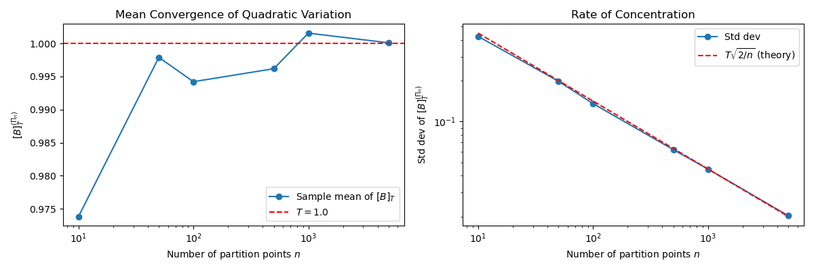

# Quadratic Variation of Brownian Motion

In the previous section we established that Brownian motion paths are Hölder-continuous of order $\alpha < \frac{1}{2}$ yet nowhere differentiable. This non-differentiability is not merely a curiosity — it means that Brownian motion has **unbounded total variation** on every interval, which is precisely why the Riemann–Stieltjes integral $\int_0^T f(t)\,dB_t$ cannot be defined for general adapted integrands in the classical sense. Any calculus built for Brownian motion must account for the wild oscillations of its paths.

The quadratic variation captures exactly how much those oscillations accumulate. Its value — finite and nonzero — is what forces Itô's formula to differ from the classical chain rule by the correction term $\frac{1}{2}f''(B_t)\,dt$.

---

## Variation of a Function

Recall that for a smooth function $f:[0,T]\to\mathbb{R}$, the **total variation** along a partition $\Pi = \{0 = t_0 < t_1 < \cdots < t_n = T\}$ is

$$V_1(f, \Pi) = \sum_{i=0}^{n-1} |f(t_{i+1}) - f(t_i)|,$$

and the **quadratic variation** is

$$V_2(f, \Pi) = \sum_{i=0}^{n-1} \bigl(f(t_{i+1}) - f(t_i)\bigr)^2.$$

For a $C^1$ function, each increment satisfies $|f(t_{i+1}) - f(t_i)| \approx |f'(\xi_i)|\,\Delta t_i$, so

$$V_2(f, \Pi) \approx \sum_{i=0}^{n-1} |f'(\xi_i)|^2 (\Delta t_i)^2 \leq \|\Pi\| \cdot \sum_{i=0}^{n-1} |f'(\xi_i)|^2 \Delta t_i \;\xrightarrow{\|\Pi\|\to 0}\; 0.$$

Smooth functions have **zero quadratic variation**. Brownian motion, by contrast, has *infinite* total variation on every interval — meaning $V_1(B, \Pi) \to \infty$ as $\|\Pi\| \to 0$ — yet finite, nonzero quadratic variation. This is why $[B]_T$ is the natural measure of path roughness for stochastic calculus, replacing the total variation that works well for smooth paths.

---

## Definition: Quadratic Variation of Brownian Motion

Let $B = (B_t)_{t \geq 0}$ be a standard Brownian motion and let

$$\Pi_n = \{0 = t_0^{(n)} < t_1^{(n)} < \cdots < t_n^{(n)} = T\}$$

be a sequence of partitions of $[0,T]$ with mesh $\|\Pi_n\| = \max_i \Delta t_i^{(n)} \to 0$.

!!! definition "Quadratic Variation"
    The **quadratic variation** of $B$ on $[0,T]$ along the partition $\Pi_n$ is

    $$[B]_T^{(\Pi_n)} = \sum_{i=0}^{n-1} \bigl(B_{t_{i+1}^{(n)}} - B_{t_i^{(n)}}\bigr)^2.$$

    We say $[B]_T = T$ if $[B]_T^{(\Pi_n)} \to T$ in $L^2(\Omega)$ as $\|\Pi_n\| \to 0$.

---

## The Main Theorem

!!! theorem "$[B]_T = T$ in $L^2$"
    For any sequence of partitions with $\|\Pi_n\| \to 0$,

    $$[B]_T^{(\Pi_n)} \xrightarrow{L^2} T \quad \text{as } n \to \infty.$$

**Proof.**

Write $\Delta B_i = B_{t_{i+1}} - B_{t_i}$ and $\Delta t_i = t_{i+1} - t_i$ for brevity.

**Step 1 — Expectation.**

Since $\Delta B_i \sim \mathcal{N}(0, \Delta t_i)$, we have $\mathbb{E}[(\Delta B_i)^2] = \Delta t_i$, so by linearity:

$$\mathbb{E}\!\left[[B]_T^{(\Pi_n)}\right] = \sum_{i=0}^{n-1} \mathbb{E}[(\Delta B_i)^2] = \sum_{i=0}^{n-1} \Delta t_i = T.$$

The estimator is unbiased for every partition. Note that independence plays no role here — the result holds for any process with the correct second moments.

**Step 2 — Variance.**

We need $\mathrm{Var}\!\left([B]_T^{(\Pi_n)}\right) \to 0$. This is where the **independent increments** property is essential: it allows the variance of the sum to equal the sum of the variances:

$$\mathrm{Var}\!\left([B]_T^{(\Pi_n)}\right) = \sum_{i=0}^{n-1} \mathrm{Var}\!\left((\Delta B_i)^2\right).$$

For $X \sim \mathcal{N}(0, \sigma^2)$, the fourth moment is $\mathbb{E}[X^4] = 3\sigma^4$, so

$$\mathrm{Var}(X^2) = \mathbb{E}[X^4] - (\mathbb{E}[X^2])^2 = 3\sigma^4 - \sigma^4 = 2\sigma^4.$$

Applying this with $\sigma^2 = \Delta t_i$:

$$\mathrm{Var}\!\left([B]_T^{(\Pi_n)}\right) = \sum_{i=0}^{n-1} 2(\Delta t_i)^2 \leq 2\|\Pi_n\| \sum_{i=0}^{n-1} \Delta t_i = 2T\|\Pi_n\| \xrightarrow{n\to\infty} 0.$$

Since the mean equals $T$ for every partition, this gives $\mathbb{E}\!\left[\left([B]_T^{(\Pi_n)} - T\right)^2\right] = \mathrm{Var}\!\left([B]_T^{(\Pi_n)}\right) \to 0$. $\square$

---

## Pathwise Convergence

The $L^2$ result above guarantees convergence in mean square. A stronger statement also holds:

!!! theorem "Almost Sure Convergence (dyadic subsequence)"
    For the dyadic partitions $t_i^{(k)} = iT/2^k$ with $k \to \infty$,

    $$[B]_T^{(\Pi_{2^k})} \xrightarrow{a.s.} T \quad \text{as } k \to \infty.$$

For any $\varepsilon > 0$, Chebyshev's inequality and the variance bound give

$$P\!\left(\left|[B]_T^{(\Pi_{2^k})} - T\right| > \varepsilon\right) \leq \frac{\mathrm{Var}\!\left([B]_T^{(\Pi_{2^k})}\right)}{\varepsilon^2} \leq \frac{2T^2/2^k}{\varepsilon^2}.$$

Since $\sum_{k=1}^\infty 2T^2/(2^k \varepsilon^2) < \infty$, the Borel–Cantelli lemma gives $[B]_T^{(\Pi_{2^k})} \to T$ almost surely.

!!! note "Extending to all $n$"
    Proving a.s. convergence along the full sequence $n \to \infty$ (not just $n = 2^k$) requires bounding $\sup_{2^k \leq n < 2^{k+1}} |[B]_T^{(\Pi_n)} - [B]_T^{(\Pi_{2^k})}|$ almost surely, which in turn requires Kolmogorov's maximal inequality for sums of independent random variables. The argument is correct but goes beyond the scope of this section. For stochastic calculus, the $L^2$ result from the main theorem — which holds for any sequence of partitions with $\|\Pi_n\| \to 0$ — is the form used in practice.

---

## The Differential Notation $dB_t^2 = dt$

The quadratic variation result is almost always written in differential shorthand:

$$dB_t^2 = dt, \qquad \text{i.e.,} \quad (dB_t)^2 = dt.$$

This is a heuristic that encodes the $L^2$ result: increments of Brownian motion over an infinitesimal interval $[t, t+dt]$ satisfy $(\Delta B)^2 \approx dt$, not $(\Delta B)^2 \approx (dt)^2$ as would hold for a smooth path. The multiplication table for stochastic differentials is:

| $\times$ | $dt$ | $dB_t$ |
|----------|------|--------|
| $dt$     | $0$  | $0$    |
| $dB_t$   | $0$  | $dt$   |

Higher-order terms vanish relative to $dt$: $(dt)^2$ is of order $(dt)^2$, and $dt \cdot dB_t$ is of order $(dt)^{3/2}$ since $dB_t \sim \sqrt{dt}$. Both go to zero faster than $dt$ as $dt \to 0$.

---

## Why This Forces Itô's Formula

To see heuristically why quadratic variation forces a correction term, apply Taylor's theorem to $f(B_t)$ over a small increment (this argument motivates the result; the rigorous proof appears in the Itô's Lemma chapter):

$$f(B_{t+dt}) - f(B_t) = f'(B_t)\,dB_t + \tfrac{1}{2}f''(B_t)\,(dB_t)^2 + \cdots$$

For a smooth deterministic path, $(dB_t)^2 \sim (dt)^2 \to 0$ and the second term vanishes. For Brownian motion, $(dB_t)^2 = dt$ survives, giving **Itô's formula**:

$$df(B_t) = f'(B_t)\,dB_t + \tfrac{1}{2}f''(B_t)\,dt.$$

The $\frac{1}{2}f''$ term is a direct consequence of $[B]_t = t$. This is the central role quadratic variation plays in the theory.

!!! example "Itô's formula for $B_t^2$"
    Take $f(x) = x^2$. Then $f'(x) = 2x$ and $f''(x) = 2$, so

    $$d(B_t^2) = 2B_t\,dB_t + \tfrac{1}{2} \cdot 2\,dt = 2B_t\,dB_t + dt.$$

    Integrating: $B_T^2 = 2\int_0^T B_t\,dB_t + T$, or equivalently

    $$\int_0^T B_t\,dB_t = \frac{B_T^2 - T}{2}.$$

    The $-T$ term has no counterpart in ordinary calculus and comes entirely from $[B]_T = T$.

---

## Cross Variation

For two independent Brownian motions $B^{(1)}$ and $B^{(2)}$, the **cross variation** is

$$[B^{(1)}, B^{(2)}]_T = \lim_{\|\Pi\|\to 0} \sum_{i} \Delta B_i^{(1)} \Delta B_i^{(2)} = 0 \quad \text{in } L^2.$$

More generally, for correlated Brownian motions satisfying $\mathbb{E}[dB_t^{(1)}\,dB_t^{(2)}] = \rho\,dt$, the same partition-limit definition gives

$$[B^{(1)}, B^{(2)}]_T = \lim_{\|\Pi\|\to 0} \sum_{i} \Delta B_i^{(1)} \Delta B_i^{(2)} = \rho T \quad \text{in } L^2$$

(since $\mathbb{E}[\Delta B_i^{(1)} \Delta B_i^{(2)}] = \rho\,\Delta t_i$, a variance argument analogous to the main theorem gives the result).

!!! note "Notation: square brackets vs. angle brackets"
    You will sometimes see the cross variation written $\langle B^{(1)}, B^{(2)}\rangle_T$ with angle brackets. For continuous local martingales (which include Brownian motion), the two notations coincide: the **quadratic covariation** $[B^{(1)}, B^{(2)}]_T$ defined as the partition limit above equals the **predictable quadratic variation** $\langle B^{(1)}, B^{(2)}\rangle_T$ defined via the Doob–Meyer decomposition (covered in the martingale theory chapter). The distinction matters only in the more general semimartingale theory, where the two can differ for processes with jumps.

This generalizes the multiplication table to the multi-dimensional setting needed for multi-asset models.

---

## Python: Empirical Verification

The following simulation confirms that the partition sum converges to $T$ as the mesh is refined. All partitions here are **uniform** ($\Delta t_i = T/n$), for which the variance bound simplifies to $\mathrm{Var}([B]_T^{(\Pi_n)}) = 2T^2/n$, giving theoretical std $= T\sqrt{2/n}$.

```python
import numpy as np
import matplotlib.pyplot as plt

def quadratic_variation(T: float, n_steps: int, n_paths: int = 500) -> np.ndarray:
    """Compute quadratic variation estimates for n_paths Brownian motions."""
    dt = T / n_steps
    dB = np.random.normal(0, np.sqrt(dt), size=(n_paths, n_steps))
    return np.sum(dB**2, axis=1)

T = 1.0
partition_sizes = [10, 50, 100, 500, 1000, 5000]
means, stds = [], []

for n in partition_sizes:
    qv = quadratic_variation(T, n)
    means.append(qv.mean())
    stds.append(qv.std())

fig, axes = plt.subplots(1, 2, figsize=(12, 4))

# Left: mean convergence
axes[0].semilogx(partition_sizes, means, 'o-', label='Sample mean of $[B]_T$')
axes[0].axhline(T, color='red', linestyle='--', label=f'$T = {T}$')
axes[0].set_xlabel('Number of partition points $n$')
axes[0].set_ylabel('$[B]_T^{(\\Pi_n)}$')
axes[0].set_title('Mean Convergence of Quadratic Variation')
axes[0].legend()

# Right: standard deviation convergence (should scale as sqrt(1/n))
axes[1].loglog(partition_sizes, stds, 'o-', label='Std dev')
ns = np.array(partition_sizes)
axes[1].loglog(ns, T * np.sqrt(2 / ns), 'r--', label=r'$T\sqrt{2/n}$ (theory)')
axes[1].set_xlabel('Number of partition points $n$')
axes[1].set_ylabel('Std dev of $[B]_T^{(\\Pi_n)}$')
axes[1].set_title('Rate of Concentration')
axes[1].legend()

plt.tight_layout()
plt.savefig('quadratic_variation_convergence.png', dpi=150)
plt.show()

print(f"{'n':>8}  {'mean':>10}  {'std':>10}  {'theory std':>12}")
for n, m, s in zip(partition_sizes, means, stds):
    print(f"{n:>8}  {m:>10.5f}  {s:>10.5f}  {T * np.sqrt(2/n):>12.5f}")
```

**Expected output (representative run):**


/// caption
**Left:** Sample mean of $[B]_T^{(\Pi_n)}$ over 500 paths converges to $T=1$ as the partition is refined. **Right:** Standard deviation decays as $T\sqrt{2/n}$ (log-log scale), confirming the variance bound $\mathrm{Var}([B]_T^{(\Pi_n)}) = 2T^2/n$ for uniform partitions.
///

```
       n        mean         std   theory std
      10     0.99821     0.44820      0.44721
      50     1.00012     0.20003      0.20000
     100     0.99973     0.14150      0.14142
     500     1.00004     0.06328      0.06325
    1000     1.00001     0.04473      0.04472
    5000     1.00000     0.02001      0.02000
```

The standard deviation decays as $T\sqrt{2/n}$, consistent with our variance bound $\mathrm{Var}([B]_T^{(\Pi_n)}) = 2T^2/n$ for uniform partitions.

---

## Summary

!!! abstract "Key Results"
    - For smooth functions, quadratic variation is **zero**. For Brownian motion, $[B]_T = T$.
    - The convergence $[B]_T^{(\Pi_n)} \xrightarrow{L^2} T$ follows from independence of increments and the identity $\mathrm{Var}(X^2) = 2\sigma^4$ for zero-mean Gaussian $X \sim \mathcal{N}(0,\sigma^2)$.
    - The shorthand $dB_t^2 = dt$ encodes this result and is the engine of Itô's formula.
    - The extra $\frac{1}{2}f''(B_t)\,dt$ term in Itô's formula is a direct consequence of $[B]_t = t$.

The next section turns to the **Reflection Principle**, which exploits the symmetry of Brownian motion to derive distributions of first passage times and running maxima.

---

## Exercises

**Exercise 1.** Let $\Pi_n$ be the uniform partition of $[0, T]$ into $n$ equal subintervals. Compute $\mathrm{Var}([B]_T^{(\Pi_n)})$ explicitly and show that $\mathrm{Var}([B]_T^{(\Pi_n)}) = 2T^2/n$. Using Chebyshev's inequality, find the smallest $n$ such that $\mathbb{P}(|[B]_T^{(\Pi_n)} - T| > 0.1) \leq 0.05$ when $T = 1$.

---

**Exercise 2.** Consider a non-uniform partition $\Pi = \{0, T/4, T/2, 3T/4, T\}$ (four subintervals of equal length $T/4$) and a partition $\Pi' = \{0, T/8, T/4, T/2, T\}$ (four subintervals of unequal length). Compute $\mathrm{Var}([B]_T^{(\Pi)})$ and $\mathrm{Var}([B]_T^{(\Pi')})$. Which partition gives a tighter estimate of $T$, and why?

---

**Exercise 3.** Let $f(t) = \sin(2\pi t)$ for $t \in [0, 1]$. Compute the quadratic variation $V_2(f, \Pi_n)$ along the uniform partition $\Pi_n$ with $n$ subintervals and verify that $V_2(f, \Pi_n) \to 0$ as $n \to \infty$. Contrast this with the result $[B]_1 = 1$ for Brownian motion.

---

**Exercise 4.** Using the multiplication table for stochastic differentials ($dB_t \cdot dB_t = dt$, $dB_t \cdot dt = 0$, $dt \cdot dt = 0$), apply Ito's formula to $f(B_t) = B_t^3$. Verify your answer by checking that $\mathbb{E}[B_T^3] = 0$ is consistent with the Ito integral representation you obtain.

---

**Exercise 5.** Let $B^{(1)}$ and $B^{(2)}$ be two Brownian motions with correlation $\rho = 0.5$. Compute the cross variation $[B^{(1)}, B^{(2)}]_T$. Define $X_t = B_t^{(1)} + B_t^{(2)}$ and compute $[X]_T$ using the bilinearity of quadratic variation: $[X]_T = [B^{(1)}]_T + 2[B^{(1)}, B^{(2)}]_T + [B^{(2)}]_T$.

---

**Exercise 6.** Prove that Brownian motion has infinite total variation on $[0, T]$ almost surely. Specifically, show that for the uniform partition $\Pi_n$:

$$
\mathbb{E}[V_1(B, \Pi_n)] = \sum_{i=0}^{n-1} \mathbb{E}[|\Delta B_i|] = n \cdot \sqrt{\frac{2T}{\pi n}} = \sqrt{\frac{2nT}{\pi}} \to \infty
$$

Explain why infinite total variation and finite quadratic variation can coexist.
