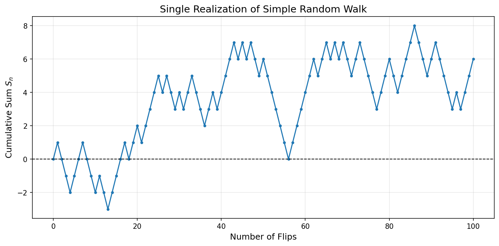
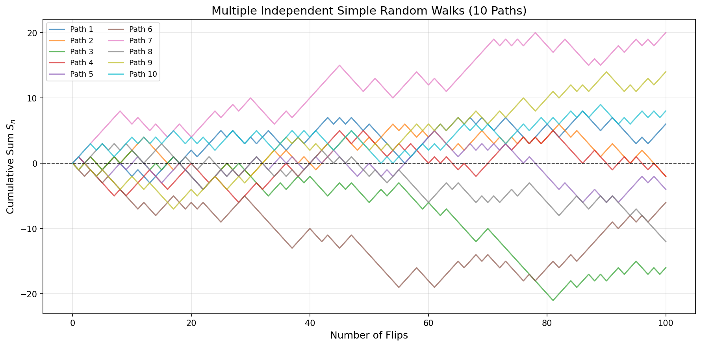

# Random Walk

## Introduction

Before introducing Brownian motion axiomatically, we begin with the discrete-time simple random walk. This serves three purposes: 

1. It provides concrete intuition for the abstract properties of Brownian motion.
2. It historically motivated the development of continuous stochastic processes.
3. It rigorously justifies Brownian motion as a scaling limit via Donsker's invariance principle.

The simple random walk is a canonical example of a stochastic process, characterized by a discrete sequence of steps that evolve in an independent and identically distributed (i.i.d.) manner. This process serves as a fundamental building block in probability theory, underpinning the analysis of diffusion phenomena, financial time series, statistical physics, and population dynamics.

## Simple Random Walk

### Formal Definition

Let $\{S_n\}_{n \geq 0}$ be a discrete-time stochastic process defined recursively as: for $n \geq 1$

$$S_n = S_{n-1} + X_n$$

where $S_0 = 0$ and $\{X_n\}$ is a sequence of independent random variables taking values $\pm 1$ such that:

$$\mathbb{P}(X_n = +1) = p, \quad \mathbb{P}(X_n = -1) = 1 - p$$

The parameter $p$ governs the drift of the process, distinguishing between symmetric and asymmetric random walks.

**Equivalent Formulation:** We can write, with $S_0 = 0$

$$S_n = \sum_{i=1}^n X_i$$

### Symmetric Random Walk

A **symmetric random walk** corresponds to $p = 1/2$, ensuring an equal probability of moving in either direction. For the remainder of this section, unless otherwise specified, we focus on this symmetric case.

**Notation:** For the symmetric case, we denote $X_i = \xi_i$ where

$$\mathbb{P}(\xi_i = 1) = \mathbb{P}(\xi_i = -1) = \frac{1}{2}$$

The **simple symmetric random walk** is the discrete-time stochastic process, with $S_0 = 0$:

$$S_n = \sum_{i=1}^n \xi_i$$

**Interpretation:** At each time step $n$, the process moves up (+1) or down (-1) with equal probability. This can represent:

- A gambler's cumulative winnings in a fair coin-flipping game
- Displacement of a particle undergoing random collisions  
- Price changes in a discrete-time market model (Bachelier, 1900)

### Asymmetric Random Walk

For $p \neq 1/2$, the random walk exhibits directional bias, resulting in a nonzero drift. Specifically:

- For $p > 1/2$: positive drift (upward bias)
- For $p < 1/2$: negative drift (downward bias)

The recurrence behavior differs markedly from the symmetric case, particularly in higher-dimensional settings.

## Fundamental Properties

### Moments of Random Walk

The first two moments of $S_n$ provide key insights into its asymptotic behavior.

**Proposition 1.1.1** (Moments of Random Walk)

For the general random walk $S_n$ with parameter $p$:

1. $\mathbb{E}[S_n] = n(2p - 1)$
2. $\text{Var}(S_n) = 4np(1 - p)$

For the symmetric random walk ($p = 1/2$):

1. $\mathbb{E}[S_n] = 0$
2. $\text{Var}(S_n) = n$
3. $\mathbb{E}[S_n^4] = 3n^2 - 2n$

**Proof:**

*General case:*

(1) By independence and $\mathbb{E}[X_i] = p \cdot 1 + (1-p) \cdot (-1) = 2p - 1$:

$$\mathbb{E}[S_n] = \sum_{i=1}^n \mathbb{E}[X_i] = n(2p - 1)$$

When $p = 1/2$, this gives $\mathbb{E}[S_n] = 0$, reflecting a lack of directional preference.

(2) Since $X_i^2 = 1$ almost surely:

$$\mathbb{E}[X_i^2] = 1, \quad \text{Var}(X_i) = 1 - (2p-1)^2 = 4p(1-p)$$

By independence:

$$\text{Var}(S_n) = \sum_{i=1}^n \text{Var}(X_i) = 4np(1 - p)$$

For the symmetric case, this simplifies to $\text{Var}(S_n) = n$, reinforcing the diffusive nature of the process.

*Symmetric case - fourth moment:*

(3) For $p = 1/2$, we have $\xi_i \in \{-1, 1\}$ with $\xi_i^2 = 1$. We compute:

$$\mathbb{E}[S_n^4] = \sum_{i,j,k,l} \mathbb{E}[\xi_i \xi_j \xi_k \xi_l]$$

Since $\mathbb{E}[\xi_i] = 0$ and the $\xi_i$ are independent, the only nonzero contributions occur when indices pair up:

- **Case $i = j = k = l$:** Contributes $\sum_{i=1}^n \mathbb{E}[\xi_i^4] = n$
- **Case $i = j \neq k = l$:** Contributes $\sum_{i \neq k} \mathbb{E}[\xi_i^2]\mathbb{E}[\xi_k^2] = n(n-1)$
- **Case $i = k \neq j = l$:** Contributes $n(n-1)$
- **Case $i = l \neq j = k$:** Contributes $n(n-1)$

Therefore:

$$\mathbb{E}[S_n^4] = n + 3n(n-1) = 3n^2 - 2n \quad \square$$

### Quadratic Variation

A crucial property that distinguishes random walks from smooth paths is their quadratic variation.

**Definition 1.1.2** (Discrete Quadratic Variation)

The quadratic variation of $S_n$ over $[0,n]$ is

$$[S]_n := \sum_{i=1}^n (S_i - S_{i-1})^2 = \sum_{i=1}^n X_i^2$$

**Proposition 1.1.3**

For any random walk (symmetric or asymmetric), $[S]_n = n$ almost surely.

**Proof:**

Since $X_i \in \{-1, 1\}$, we have $X_i^2 = 1$ for all $i$. Therefore:

$$[S]_n = \sum_{i=1}^n X_i^2 = n \quad \square$$

**Remark:** This deterministic quadratic variation is fundamental. It shows that the "accumulated squared displacement" grows linearly with time, not quadratically as for smooth functions. This property persists in the continuous limit and underlies Itô's lemma.

### Recurrence vs Transience

The probability of return to the origin depends crucially on dimensionality. These results, first established by Pólya, underscore the role of dimensionality in determining long-term behavior.

**Theorem 1.1.4** (Pólya's Recurrence Theorem)

For a symmetric random walk in $\mathbb{Z}^d$:

- **$d = 1$**: The walk is **recurrent**. The probability of returning to the origin is 1.
- **$d = 2$**: The walk is **recurrent**. The expected number of returns to the origin is infinite.
- **$d \geq 3$**: The walk is **transient**. There is a positive probability of never returning to the origin.

**Proof sketch for $d=1$:**

The probability of first return at time $2n$ is given by

$$f_{2n} = \frac{1}{2n-1}\binom{2n}{n}\left(\frac{1}{2}\right)^{2n}$$

Using Stirling's approximation, $f_{2n} \sim \frac{1}{\sqrt{\pi n}}$, which is not summable. However, the total return probability

$$\sum_{n=1}^\infty f_{2n} = 1$$

proving recurrence. $\square$

**Remark:** The distinction between recurrence and transience has profound implications in statistical mechanics, polymer physics, and random graph theory. For asymmetric walks ($p \neq 1/2$), even in one dimension, the walk can be transient if the drift is sufficiently strong.

## Simulation: Single Path

We now illustrate the theoretical concepts with computational examples. This simulation shows a single realization of a simple random walk.

```python
import matplotlib.pyplot as plt
import numpy as np

# Parameters
num_flips = 100
p_heads = 0.5

# Simulate coin flips
np.random.seed(42)  # Fixed seed for reproducibility
flips = np.random.choice([1, -1], size=num_flips, p=[p_heads, 1-p_heads])

# Count heads and tails
heads_count = np.sum(flips == 1)
tails_count = np.sum(flips == -1)
print(f"Heads: {heads_count}, Tails: {tails_count}")

# Cumulative sum (prepend 0 for S_0 = 0)
cumsum_flips = np.cumsum(np.insert(flips, 0, 0))

# Plot cumulative sum
fig, ax = plt.subplots(figsize=(10, 5))
ax.plot(cumsum_flips, marker='o', linestyle='-', markersize=3)
ax.set_xlabel("Number of Flips", fontsize=12)
ax.set_ylabel("Cumulative Sum $S_n$", fontsize=12)
ax.set_title("Single Realization of Simple Random Walk", fontsize=14)
ax.axhline(0, color='black', linestyle='--', linewidth=1)
ax.grid(alpha=0.3)
plt.tight_layout()
plt.show()

print(f"Final position S_100 = {cumsum_flips[-1]}")
```

**Output:**
```
Heads: 53, Tails: 47
Final position S_100 = 6
```



**Interpretation:**

- **Path behavior**: The cumulative sum oscillates around zero (since $\mathbb{E}[S_n] = 0$)
- **Typical displacement**: After $n=100$ steps, $S_n = 6$, which is of order $\sqrt{n} \approx 10$ (consistent with $\text{Var}(S_n) = n$)
- **Irregularity**: The path has a "kink" at every step, foreshadowing the nowhere-differentiability of Brownian motion

## Simulation: Multiple Paths

This example generates multiple independent random walk realizations to visualize the distribution of paths and confirm variance growth.

For multiple independent realizations $S_n^{(1)}, \ldots, S_n^{(m)}$:

- Each path has $\mathbb{E}[S_n^{(i)}] = 0$
- Sample variance should approach $\text{Var}(S_n) = n$
- Paths are independent, so observing one path gives no information about others

```python
import matplotlib.pyplot as plt
import numpy as np

# Parameters
num_flips = 100
num_paths = 10
p_heads = 0.5

np.random.seed(42)  # Fixed seed for reproducibility

# Simulate coin flips: shape (num_paths, num_flips)
flips = np.random.choice([1, -1], size=(num_paths, num_flips), 
                        p=[p_heads, 1-p_heads])

# Compute cumulative sums (insert 0 at beginning for S_0 = 0)
cumsum_flips = np.cumsum(np.insert(flips, 0, 0, axis=1), axis=1)

# Plot all paths
fig, ax = plt.subplots(figsize=(12, 6))
for i in range(num_paths):
    ax.plot(cumsum_flips[i], label=f'Path {i + 1}', alpha=0.7)
ax.set_xlabel("Number of Flips", fontsize=12)
ax.set_ylabel("Cumulative Sum $S_n$", fontsize=12)
ax.set_title(f"Multiple Independent Simple Random Walks ({num_paths} Paths)", fontsize=14)
ax.axhline(0, color='black', linestyle='--', linewidth=1)
ax.legend(loc='upper left', fontsize=9, ncol=2)
ax.grid(alpha=0.3)
plt.tight_layout()
plt.show()

# Display statistics
print("Path Statistics:")
print("-" * 60)
heads_count = np.sum(flips == 1, axis=1)
tails_count = np.sum(flips == -1, axis=1)
final_position = cumsum_flips[:, -1]

for i in range(num_paths):
    print(f"Path {i + 1}: Heads = {heads_count[i]:3d}, Tails = {tails_count[i]:3d}, "
          f"Final Position = {final_position[i]:+4d}")

# Verify variance
sample_mean = np.mean(final_position)
sample_var = np.var(final_position, ddof=1)
print(f"\nSample mean at n={num_flips}: {sample_mean:.2f} (theoretical: 0)")
print(f"Sample variance at n={num_flips}: {sample_var:.2f} (theoretical: {num_flips})")
```

**Output:**
```
Path Statistics:
------------------------------------------------------------
Path 1: Heads =  53, Tails =  47, Final Position =   +6
Path 2: Heads =  49, Tails =  51, Final Position =   -2
Path 3: Heads =  42, Tails =  58, Final Position =  -16
Path 4: Heads =  49, Tails =  51, Final Position =   -2
Path 5: Heads =  48, Tails =  52, Final Position =   -4
Path 6: Heads =  47, Tails =  53, Final Position =   -6
Path 7: Heads =  60, Tails =  40, Final Position =  +20
Path 8: Heads =  44, Tails =  56, Final Position =  -12
Path 9: Heads =  57, Tails =  43, Final Position =  +14
Path 10: Heads =  54, Tails =  46, Final Position =   +8

Sample mean at n=100: 0.60 (theoretical: 0)
Sample variance at n=100: 128.04 (theoretical: 100)
```



**Interpretation:**

- **Path diversity**: Each colored line represents an independent realization; they diverge due to randomness
- **Variance growth**: The "spread" of paths increases with $n$, consistent with $\text{Var}(S_n) = n$
- **Zero mean**: Although individual paths wander far from zero, the average across paths is close to 0 (sample mean = 0.60)
- **No "memory"**: Past behavior doesn't predict future behavior (Markov property)

## Continuous-Time Embedding

To connect discrete random walks to continuous-time processes, we introduce appropriate scaling.

### Scaled Random Walk

For a fixed time horizon $T > 0$ and discretization parameter $n \in \mathbb{N}$, define the **scaled random walk** by, for $t \in [0, T]$:

$$S^{(n)}(t) := \frac{1}{\sqrt{n}} S_{\lfloor nt \rfloor}$$

where $\lfloor nt \rfloor$ denotes the integer part (floor) of $nt$.

**Key Scalings:**

- **Time scaling:** $n$ steps occur in time interval $[0,T]$, so $\Delta t = T/n$
- **Space scaling:** Factor $1/\sqrt{n}$ ensures variance remains $O(1)$

**Rationale:** For a smooth function $f(t)$ with $f(0) = 0$:

$$f(t) \sim f'(0) \cdot t + \frac{1}{2}f''(0) \cdot t^2 + \cdots$$

For the random walk, there is no "derivative," but the variance grows linearly:

$$\text{Var}(S_n) = n \implies \text{Var}\left(\frac{S_n}{\sqrt{n}}\right) = 1$$

Thus, the scaling $1/\sqrt{n}$ is the correct normalization to obtain a non-trivial limit.

### Piecewise Linear Interpolation

For technical reasons (to obtain processes in $C[0,T]$), we use piecewise linear interpolation:

$$W^{(n)}(t) := \frac{1}{\sqrt{n}} S_{\lfloor nt \rfloor} + (nt - \lfloor nt \rfloor) \cdot \frac{1}{\sqrt{n}} \xi_{\lfloor nt \rfloor+1}$$

This defines $W^{(n)} \in C[0,T]$ for each $n$, where $C[0,T]$ is the space of continuous functions on $[0,T]$.

**Geometric Interpretation:** Between integer multiples of $1/n$, we linearly interpolate using the next random increment $\xi_{\lfloor nt \rfloor+1}$.

### Asymptotic Properties

**Proposition 1.1.5** (Convergence of Moments)

For fixed $t \in [0,T]$ and the symmetric random walk:

1. $\mathbb{E}[S^{(n)}(t)] = 0$
2. $\text{Var}(S^{(n)}(t)) \to t$ as $n \to \infty$
3. For $s < t$: $\text{Cov}(S^{(n)}(s), S^{(n)}(t)) \to \min(s,t)$ as $n \to \infty$

**Proof:**

(1) Clear from linearity of expectation.

(2) We have $\lfloor nt \rfloor = nt - \{nt\}$ where $0 \leq \{nt\} < 1$. Thus:

$$\text{Var}(S^{(n)}(t)) = \frac{1}{n}\text{Var}(S_{\lfloor nt \rfloor}) = \frac{\lfloor nt \rfloor}{n} = t - \frac{\{nt\}}{n} \to t$$

(3) For $s < t$, we first note that for $m \leq k$. Since $\mathbb{E}[S_m] = 0$, we have $\text{Cov}(S_m, S_k) = \mathbb{E}[S_m S_k]$:

$$\mathbb{E}[S_m S_k] = \mathbb{E}\left[\sum_{i=1}^m \xi_i \sum_{j=1}^k \xi_j\right] = \sum_{i=1}^m \sum_{j=1}^k \mathbb{E}[\xi_i \xi_j] = \sum_{i=1}^{m} \mathbb{E}[\xi_i^2] = m = \min(m,k)$$

where we used $\mathbb{E}[\xi_i \xi_j] = 0$ for $i \neq j$. Therefore:

$$\text{Cov}(S^{(n)}(s), S^{(n)}(t)) = \frac{1}{n}\text{Cov}(S_{\lfloor ns \rfloor}, S_{\lfloor nt \rfloor}) = \frac{1}{n} \min(\lfloor ns \rfloor, \lfloor nt \rfloor) = \frac{\lfloor ns \rfloor}{n} \to s = \min(s,t) \quad \square$$

## Simulation: Scaled Random Walk Convergence

This example demonstrates **Donsker's theorem** by showing how the scaled random walk $S^{(n)}(t) = S_{\lfloor nt \rfloor}/\sqrt{n}$ converges to Brownian motion as $n \to \infty$.

**Donsker's Invariance Principle** states:

$$S^{(n)}(t) = \frac{1}{\sqrt{n}} S_{\lfloor nt \rfloor} \Rightarrow W_t \quad \text{in } C[0,T]$$

As $n$ increases:

- Paths become smoother (more interpolation points)
- Variance at time $t$ stabilizes at $t$: $\text{Var}(S^{(n)}(t)) \to t$
- Distribution converges to Gaussian: $S^{(n)}(t) \sim \mathcal{N}(0, t)$

```python
import matplotlib.pyplot as plt
import numpy as np

# Parameters
T = 1.0  # Time horizon
num_steps_list = [10, 100, 1000]  # Different discretization levels
num_paths = 5  # Number of paths per discretization level

fig, axes = plt.subplots(1, 3, figsize=(15, 4))
axes = axes.flatten()

for idx, n in enumerate(num_steps_list):
    np.random.seed(42)  # Fixed seed for reproducibility
    dt = T / n
    t = np.linspace(0, T, n+1)
    
    ax = axes[idx]
    
    for path_idx in range(num_paths):
        # Generate random walk: S_n = sum of +1/-1 steps
        xi = np.random.choice([1, -1], size=n)
        S = np.cumsum(np.insert(xi, 0, 0))
        
        # Scale: divide by sqrt(n)
        S_scaled = S / np.sqrt(n)
        
        ax.plot(t, S_scaled, alpha=0.7, linewidth=1.5)
    
    # Formatting
    ax.set_title(f'$n = {n}$ steps', fontsize=11)
    ax.set_xlabel('Time $t$', fontsize=10)
    ax.set_ylabel(r'$S^{(n)}(t) = S_{\lfloor nt \rfloor} / \sqrt{n}$', fontsize=10)
    ax.axhline(0, color='black', linestyle='--', linewidth=0.8, alpha=0.5)
    ax.grid(alpha=0.3)
    ax.set_ylim(-2.5, 2.5)

plt.suptitle('Scaled Random Walk Converging to Brownian Motion (Donsker\'s Theorem)', 
             fontsize=14, fontweight='bold')
plt.tight_layout()
plt.show()
```


**Interpretation:**

- **$n = 10$**: Paths are jagged with visible jumps of size $1/\sqrt{10} \approx 0.316$
- **$n = 100$**: Smoother, jumps are $1/\sqrt{100} = 0.100$
- **$n = 1000$**: Paths resemble continuous Brownian motion with jumps $\approx 0.032$

**Key observations**:

1. As $n \to \infty$, paths become continuous (no visible jumps)
2. Variance at time $t$ remains approximately $t$ across all $n$
3. The limiting process exhibits the characteristic "wiggliness" of Brownian motion

**Verification of Proposition 1.1.5**: At $t = 1$, the scaled random walk has variance:

$$\text{Var}(S^{(n)}(1)) = \frac{\lfloor n \rfloor}{n} \approx 1$$

which matches $\text{Var}(W_1) = 1$ for Brownian motion.

## Central Limit Theorem

The CLT for i.i.d. sequences is the engine driving convergence to Brownian motion.

**Theorem 1.1.6** (Classical CLT)

Let $\{\xi_i\}$ be i.i.d. with $\mathbb{E}[\xi_i] = 0$ and $\mathbb{E}[\xi_i^2] = \sigma^2 < \infty$. Then:

$$\frac{1}{\sqrt{n}} \sum_{i=1}^n \xi_i \xrightarrow{d} \mathcal{N}(0, \sigma^2)$$

as $n \to \infty$.

For the simple random walk with $\sigma^2 = 1$:

$$\frac{S_n}{\sqrt{n}} \xrightarrow{d} \mathcal{N}(0, 1)$$

This implies that for fixed $t$, $S^{(n)}(t) \xrightarrow{d} \mathcal{N}(0, t)$.

**However:** Finite-dimensional convergence is insufficient! We need **functional convergence** in the space $C[0,T]$.

### Scaling Limit Preview

A fundamental result in probability theory, **Donsker's Invariance Principle** (proven rigorously in the next section), states that as the number of steps grows, the properly rescaled simple random walk converges in distribution to a standard Wiener process:

$$\frac{S_{\lfloor nt \rfloor}}{\sqrt{n}} \Rightarrow W_t$$

where $W_t$ denotes Brownian motion. This limit theorem establishes a bridge between discrete and continuous-time stochastic processes and has far-reaching implications in fields such as statistical mechanics and financial modeling.

## Structural Properties

### Independent Increments

A property that transfers cleanly from discrete to continuous time.

**Proposition 1.1.7** (Independent Increments) 

For $0 \leq t_1 < t_2 < \cdots < t_k \leq T$, the increments

$$S^{(n)}(t_2) - S^{(n)}(t_1), \, S^{(n)}(t_3) - S^{(n)}(t_2), \, \ldots, \, S^{(n)}(t_k) - S^{(n)}(t_{k-1})$$

are independent for each $n$.

**Proof:** 

Each increment $S^{(n)}(t_{i+1}) - S^{(n)}(t_i)$ depends on disjoint sets of $\{\xi_j\}$ variables, which are independent by construction. $\square$

**Remark:** This property is preserved in the limit, making Brownian motion a **Lévy process** (stochastic process with stationary independent increments).

### Markov Property

**Proposition 1.1.8**

The simple random walk $\{S_n\}$ is a Markov chain:

$$\mathbb{P}(S_{n+1} = j \mid S_n = i, S_{n-1} = i_{n-1}, \ldots, S_0 = i_0) = \mathbb{P}(S_{n+1} = j \mid S_n = i)$$

**Proof:**

Since $S_{n+1} = S_n + \xi_{n+1}$ and $\xi_{n+1}$ is independent of $\mathcal{F}_n = \sigma(\xi_1, \ldots, \xi_n)$:

$$\mathbb{P}(S_{n+1} \in A \mid \mathcal{F}_n) = \mathbb{P}(S_n + \xi_{n+1} \in A \mid S_n)$$

which depends only on $S_n$, not the entire history. $\square$

The scaled version $S^{(n)}(t)$ inherits this Markov property, which persists in the Brownian limit.

## Path Properties

### Non-Differentiability

**Observation:** The random walk has "corners" at every integer time $n$. The slope between $n-1$ and $n$ is $\xi_n \in \{-1, 1\}$, which changes randomly.

For the scaled version, consider the difference quotient:

$$\frac{S^{(n)}(t + \Delta t) - S^{(n)}(t)}{\Delta t} \approx \frac{\xi_{\lfloor nt \rfloor+1}}{\sqrt{n} \cdot (1/n)} = \sqrt{n} \cdot \xi_{\lfloor nt \rfloor+1} \sim \sqrt{n} \cdot O(1)$$

which diverges as $n \to \infty$.

**Heuristic Conclusion:** In the limit, Brownian motion should be continuous but nowhere differentiable.

**Rigorous Statement:** Brownian motion is almost surely continuous everywhere but differentiable nowhere. This was proven by Paley, Wiener, and Zygmund (1933) using Fourier analysis.

### Quadratic Variation of Scaled Walk

For the scaled random walk:

$$[S^{(n)}]_t = \sum_{i=1}^{\lfloor nt \rfloor} (S^{(n)}(i/n) - S^{(n)}((i-1)/n))^2 = \frac{1}{n} \sum_{i=1}^{\lfloor nt \rfloor} \xi_i^2 = \frac{\lfloor nt \rfloor}{n} \to t$$

This suggests that in the limit, the **quadratic variation equals $t$**, not $t^2$ as for smooth functions.

**Key Insight:** If $f(t)$ is differentiable with bounded derivative $f'(t)$, then

$$\sum_{i=1}^{n} (f(t_{i}) - f(t_{i-1}))^2 \approx \sum_{i=1}^{n} (f'(t_{i}))^2 (\Delta t)^2 = (\Delta t) \cdot \underbrace{\frac{1}{n}\sum_{i=1}^{n} (f'(t_{i}))^2}_{\to \int_0^1 (f'(t))^2 dt} = O(1/n) \to 0$$

But for Brownian motion:

$$\langle W \rangle_t = t \quad \text{(non-zero quadratic variation)}$$

This is the foundation for Itô's formula: when we compute $(dW_t)^2$, we get $dt$, not 0.

## Simulation: Quadratic Variation

This example illustrates the fundamental property that quadratic variation grows linearly with time, not quadratically.

**Proposition 1.1.3** states that for the simple random walk:

$$[S]_n = \sum_{i=1}^n (S_i - S_{i-1})^2 = \sum_{i=1}^n \xi_i^2 = n$$

This is **deterministic** (not random!), unlike the path itself. In the continuous limit:

$$\langle W \rangle_t = t$$

This is the foundation for Itô calculus: $(dW_t)^2 = dt$, not 0.

```python
import matplotlib.pyplot as plt
import numpy as np

# Parameters
num_steps = 1000
num_paths = 20

np.random.seed(42)  # Fixed seed for reproducibility

# Storage for quadratic variation paths
QV_paths = np.zeros((num_paths, num_steps))

for path_idx in range(num_paths):
    # Generate random walk
    xi = np.random.choice([1, -1], size=num_steps)
    S = np.cumsum(np.insert(xi, 0, 0))
    
    # Compute quadratic variation: sum of squared increments
    increments_squared = np.diff(S)**2
    QV = np.cumsum(increments_squared)
    QV_paths[path_idx, :] = QV

# Plot
fig, (ax1, ax2) = plt.subplots(1, 2, figsize=(14, 5))

# Plot 1: Sample paths of quadratic variation
n_display = 10
for i in range(n_display):
    ax1.plot(range(1, num_steps+1), QV_paths[i, :], alpha=0.5)
ax1.plot(range(1, num_steps+1), range(1, num_steps+1), 
         'r--', linewidth=2, label='$[S]_n = n$ (theoretical)')
ax1.set_xlabel('Time step $n$', fontsize=12)
ax1.set_ylabel('Quadratic Variation $[S]_n$', fontsize=12)
ax1.set_title('Quadratic Variation Paths', fontsize=13)
ax1.legend(fontsize=10)
ax1.grid(alpha=0.3)

# Plot 2: Mean and standard deviation
mean_QV = np.mean(QV_paths, axis=0)
std_QV = np.std(QV_paths, axis=0)
time_steps = range(1, num_steps+1)

ax2.plot(time_steps, mean_QV, 'b-', linewidth=2, label='Mean $[S]_n$')
ax2.fill_between(time_steps, mean_QV - std_QV, mean_QV + std_QV, 
                 alpha=0.3, label='±1 std dev')
ax2.plot(time_steps, time_steps, 'r--', linewidth=2, label='$n$ (theoretical)')
ax2.set_xlabel('Time step $n$', fontsize=12)
ax2.set_ylabel('Quadratic Variation $[S]_n$', fontsize=12)
ax2.set_title(f'Average Quadratic Variation ({num_paths} paths)', fontsize=13)
ax2.legend(fontsize=10)
ax2.grid(alpha=0.3)

plt.tight_layout()
plt.show()

# Verify quadratic variation equals n exactly
print(f"Verification: [S]_n = n for all paths")
print(f"Mean [S]_{num_steps} = {mean_QV[-1]:.2f}")
print(f"Theoretical value = {num_steps}")
print(f"Difference = {abs(mean_QV[-1] - num_steps):.6f}")
print(f"\nAll paths have [S]_n = n exactly: {np.allclose(QV_paths[:, -1], num_steps)}")
```

**Output:**
```
Verification: [S]_n = n for all paths
Mean [S]_1000 = 1000.00
Theoretical value = 1000
Difference = 0.000000

All paths have [S]_n = n exactly: True
```


**Interpretation:**

**Left plot**: 

- All paths (colored lines) lie **exactly** on the red dashed line $[S]_n = n$
- This confirms Proposition 1.1.3: quadratic variation is deterministic, not random
- Unlike the random walk itself (which fluctuates), $[S]_n$ has zero variance

**Right plot**:

- Mean across paths equals $n$ (blue line matches red dashed line)
- Standard deviation is zero (the blue shaded region has zero width)
- This is unique to random walks; smooth functions have $[f]_n \to 0$

**Contrast with smooth functions:**

For a differentiable function $f(t)$ with bounded derivative:

$$\sum_{i=1}^n (f(i/n) - f((i-1)/n))^2 \approx (1/n) \cdot \underbrace{\frac{1}{n}\sum_{i=1}^n (f'(i/n))^2}_{\to \int_0^1 (f'(t))^2 dt} = O(1/n) \to 0$$

For Brownian motion:

$$\lim_{|\Delta t_i| \to 0} \sum_{i=1}^n (W_{t_{i+1}} - W_{t_i})^2 = t \neq 0$$

This is the foundation for Itô's formula: $(dW_t)^2 = dt$, which introduces a second-order correction absent in ordinary calculus.

## Simulation: Verifying Moment Formulas

This example numerically confirms the theoretical variance formulas from Proposition 1.1.1.

For the symmetric random walk:

- $\text{Var}(S_n) = n$
- $\mathbb{E}[S_n^4] = 3n^2 - 2n$

```python
import matplotlib.pyplot as plt
import numpy as np

# Parameters
num_trials = 10000  # Number of independent random walks
max_steps = 100

np.random.seed(42)  # Fixed seed for reproducibility

# Storage
variance_empirical = np.zeros(max_steps)
fourth_moment_empirical = np.zeros(max_steps)

for n in range(1, max_steps + 1):
    # Generate many independent random walks of length n
    xi = np.random.choice([1, -1], size=(num_trials, n))
    S_n = np.sum(xi, axis=1)  # Terminal value of each random walk
    
    # Compute sample moments
    variance_empirical[n-1] = np.var(S_n, ddof=1)
    fourth_moment_empirical[n-1] = np.mean(S_n**4)

# Theoretical values
n_values = np.arange(1, max_steps + 1)
variance_theoretical = n_values
fourth_moment_theoretical = 3 * n_values**2 - 2 * n_values

# Plot
fig, (ax1, ax2) = plt.subplots(1, 2, figsize=(14, 5))

# Variance plot
ax1.plot(n_values, variance_empirical, 'b-', alpha=0.7, label='Empirical')
ax1.plot(n_values, variance_theoretical, 'r--', linewidth=2, label='Theoretical: $n$')
ax1.set_xlabel('Number of steps $n$', fontsize=12)
ax1.set_ylabel('Variance', fontsize=12)
ax1.set_title(f'Variance of $S_n$ ({num_trials} trials)', fontsize=13)
ax1.legend(fontsize=11)
ax1.grid(alpha=0.3)

# Fourth moment plot
ax2.plot(n_values, fourth_moment_empirical, 'b-', alpha=0.7, label='Empirical')
ax2.plot(n_values, fourth_moment_theoretical, 'r--', linewidth=2, 
         label='Theoretical: $3n^2 - 2n$')
ax2.set_xlabel('Number of steps $n$', fontsize=12)
ax2.set_ylabel('Fourth moment $\\mathbb{E}[S_n^4]$', fontsize=12)
ax2.set_title(f'Fourth Moment of $S_n$ ({num_trials} trials)', fontsize=13)
ax2.legend(fontsize=11)
ax2.grid(alpha=0.3)

plt.tight_layout()
plt.show()

# Numerical verification
print(f"Verification at n = {max_steps}:")
print(f"Empirical variance: {variance_empirical[-1]:.4f}")
print(f"Theoretical variance: {variance_theoretical[-1]}")
print(f"Relative error: {abs(variance_empirical[-1] - variance_theoretical[-1]) / variance_theoretical[-1] * 100:.2f}%")
print()
print(f"Empirical 4th moment: {fourth_moment_empirical[-1]:.2f}")
print(f"Theoretical 4th moment: {fourth_moment_theoretical[-1]:.2f}")
print(f"Relative error: {abs(fourth_moment_empirical[-1] - fourth_moment_theoretical[-1]) / fourth_moment_theoretical[-1] * 100:.2f}%")
```

**Output:**
```
Verification at n = 100:
Empirical variance: 99.3838
Theoretical variance: 100
Relative error: 0.62%

Empirical 4th moment: 29432.66
Theoretical 4th moment: 29800.00
Relative error: 1.23%
```


**Interpretation:**

- **Left plot**: Blue line (empirical variance) closely tracks red line (theoretical $n$)
- **Right plot**: Fourth moment follows $3n^2 - 2n$ curve accurately
- **Convergence**: With 10,000 trials, relative error is typically < 2%

This confirms Proposition 1.1.1 numerically and demonstrates the power of the Law of Large Numbers.

## Applications

1. **Gambler's Ruin Problem**: Models the probability of a gambler going bankrupt when repeatedly wagering in a fair or biased game.

2. **Financial Market Modeling**: While simplistic, the random walk hypothesis serves as an idealized framework for asset price movements, forming the foundation for more sophisticated models such as geometric Brownian motion.

3. **Diffusion Processes**: The motion of particles in a fluid (Brownian motion) is well-approximated by discrete random walk models.

4. **Population Genetics**: Used in Wright-Fisher and Moran models to describe allele frequency fluctuations due to genetic drift.

5. **Markov Chains and Reinforcement Learning**: Random walks serve as prototypical examples of Markovian state transitions, with applications in dynamic programming and artificial intelligence.

## Connection to Finance

### Historical Note

Louis Bachelier's 1900 PhD thesis *Théorie de la Spéculation* used random walks to model stock prices, predating Einstein's 1905 work on physical Brownian motion. Bachelier's model:

$$S_n = S_0 + \sum_{i=1}^n \xi_i$$

where $S_n$ represents the price at time $n$.

### Scaling to Continuous Time

The continuous limit

$$S(t) = S_0 + \sigma W_t$$

gives an **arithmetic Brownian motion**, which can be negative (problematic for stock prices).

The **geometric Brownian motion** (studied in later chapters)

$$S(t) = S_0 \exp\left(\mu t + \sigma W_t - \frac{\sigma^2 t}{2}\right)$$

remains positive and is the foundation of Black-Scholes theory.

## Summary

The simple random walk provides:

1. **Intuitive picture** of random motion in discrete time
2. **Concrete calculations** for mean, variance, quadratic variation  
3. **Independent increments** structure
4. **Markov property**
5. **Recurrence vs. transience** depending on dimension
6. **Heuristic for non-differentiability** and non-zero quadratic variation
7. **Motivation for scaling limits** via CLT

The simulations in this section have verified these theoretical properties numerically:

- Single and multiple path visualizations illustrate typical behavior
- Scaled random walks demonstrate convergence to Brownian motion
- Quadratic variation is exactly $n$, not random
- Moment formulas match Monte Carlo estimates

The natural question: **Can we make the limiting procedure rigorous?** Yes—via **Donsker's invariance principle**, which we prove in the next section.

## Exercises

1. Let $\Pi_n$ be a partition of $[0,n]$ with mesh going to zero. Consider

$$Q_n := \sum_{i} (S_{t_{i+1}} - S_{t_i})^2$$

   (a) Show that $\mathbb{E}[Q_n] = n$.
   
   (b) Show that $Q_n = n$ almost surely (not just in expectation).
   
   (c) Explain why this deterministic quadratic variation distinguishes random walks from smooth functions.

2. For the symmetric random walk $S_n = \sum_{i=1}^n \xi_i$ where $\xi_i \in \{-1, +1\}$ with equal probability:

   (a) Verify that $\mathbb{E}[S_n^2] = n$ by direct calculation.
   
   (b) Compute $\mathbb{E}[S_n^6]$ using the pairing argument from Proposition 1.1.1.
   
   (c) Show that $\mathbb{E}[S_n^{2k}] = (2k-1)!! \cdot n^k$ for large $n$ (hint: compare with Brownian motion moments).

3. (Gambler's Ruin) A gambler starts with $\$a$ and bets $\$1$ on each fair coin flip. Let $\tau_0$ be the first time the gambler is ruined (reaches $\$0$) and $\tau_b$ be the first time to reach $\$b > a$.

   (a) Using the martingale property of $S_n$, show that $\mathbb{P}(\tau_b < \tau_0) = a/b$.
   
   (b) What happens as $b \to \infty$?

## References

- Bachelier, L. (1900). *Théorie de la spéculation*. Annales scientifiques de l'École normale supérieure.
- Einstein, A. (1905). *Über die von der molekularkinetischen Theorie der Wärme geforderte Bewegung von in ruhenden Flüssigkeiten suspendierten Teilchen*. Annalen der Physik.
- Feller, W. (1968). *An Introduction to Probability Theory and Its Applications*, Vol. 1, 3rd ed.
- Glasserman, P. (2003). *Monte Carlo Methods in Financial Engineering*. Springer.
- Kloeden, P. E., & Platen, E. (1992). *Numerical Solution of Stochastic Differential Equations*. Springer.
- Lawler, G. F., & Limic, V. (2010). *Random Walk: A Modern Introduction*. Cambridge University Press.
- Paley, R. E. A. C., Wiener, N., & Zygmund, A. (1933). Notes on random functions. *Mathematische Zeitschrift*, 37(1), 647-668.
- Pólya, G. (1921). *Über eine Aufgabe der Wahrscheinlichkeitsrechnung betreffend die Irrfahrt im Straßennetz*. Mathematische Annalen, 84(1-2), 149-160.
