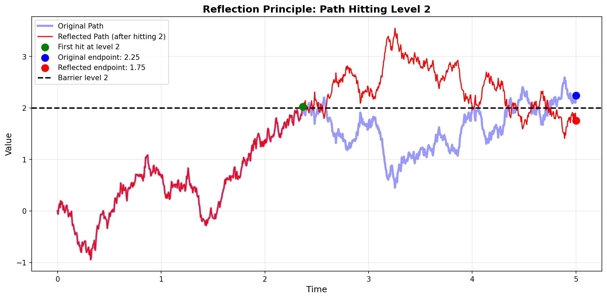
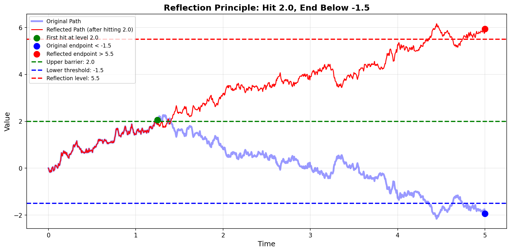

# Reflection Principle

### Introduction

In **Brownian Motion Foundations**, we briefly introduced the reflection principle (Theorem 1.3.19) and established that:

$$\mathbb{P}\left(\max_{0 \le s \le t} W_s \ge a\right) = 2\mathbb{P}(W_t \ge a)$$

This elegant result exploits the **symmetric structure** of Brownian motion to evaluate probabilities of path-dependent events—such as hitting a barrier or attaining a maximum—by constructing cleverly reflected sample paths.

The reflection principle is one of the most powerful tools in Brownian motion theory, with applications spanning:

- **Barrier options** in mathematical finance (knock-in, knock-out options)
- **First passage time distributions** for risk management
- **Survival probabilities** in credit risk modeling
- **Drawdown analysis** for portfolio risk assessment

This section provides a comprehensive treatment:

1. **Geometric reflection arguments** for maximum and joint events
2. **First passage time distribution** (Lévy distribution)
3. **Alternative proof via exponential martingales** and Laplace transforms
4. **Joint distribution** of maximum and endpoint $(M_t, W_t)$
5. **Applications to mathematical finance**

Throughout, we include Python visualizations that illustrate the geometric intuition behind the reflection principle.

### Reflection Principle

#### 1. Statement and Geometric Idea

Let $W_t$ be standard Brownian motion and $a > 0$. Define the **maximum up to time $t$**:

$$M_t := \sup_{0 \le s \le t} W_s$$

**Theorem 1.6.1** (Reflection Principle for Maximum)

For any $t > 0$ and $a > 0$:

$$\boxed{
\mathbb{P}(M_t \ge a) = 2\mathbb{P}(W_t \ge a)
}$$

**Geometric Idea:**

The proof constructs a **pathwise bijection** between two sets of paths:

1. **Set A**: Paths that hit level $a$ before time $t$ and end below $a$
2. **Set B**: Paths that hit level $a$ before time $t$ and end above $a$

The bijection works by **reflecting** the portion of the path after the first hitting time $\tau_a$ across the level $a$.

#### 2. Detailed Proof

**Proof:**

Define the **first hitting time** of level $a$:

$$\tau_a := \inf\{s \ge 0 : W_s = a\}$$

We partition the event $\{M_t \ge a\}$ based on where the path ends:

$$\{M_t \ge a\} = \{M_t \ge a, W_t \ge a\} \cup \{M_t \ge a, W_t < a\}$$

**Step 1: Event where path ends above $a$.**

Since $W_0 = 0 < a$ and paths are continuous, any path with $W_t \geq a$ must have
crossed $a$ at some earlier time, so $\{W_t \geq a\} \subseteq \{M_t \geq a\}$:

$$\mathbb{P}(M_t \ge a, W_t \ge a) = \mathbb{P}(W_t \ge a)$$

**Step 2: Event where path ends below $a$.**

For paths that hit $a$ at time $\tau_a < t$ but end at $W_t < a$, we construct the **reflected path**:

$$\tilde{W}_s = \begin{cases}
W_s & \text{if } s \le \tau_a \\
2a - W_s & \text{if } s > \tau_a
\end{cases}$$

**Key observation:** By the **strong Markov property**, after hitting $a$, the process $W_{\tau_a + s} - a$ is a Brownian motion independent of $\mathcal{F}_{\tau_a}$. The reflection $2a - W_s$ has the same distribution as $W_s$ for $s > \tau_a$.

Therefore, the **reflected endpoint** is:

$$\tilde{W}_t = 2a - W_t$$

**Bijection:** The map $W \mapsto \tilde{W}$ establishes a bijection:

$$\{M_t \ge a, W_t < a\} \leftrightarrow \{M_t \ge a, W_t > a\}$$

Each path ending at $W_t = x < a$ corresponds to a reflected path ending at $\tilde{W}_t = 2a - x > a$.

**Step 3: Combine.**

$$\mathbb{P}(M_t \ge a, W_t < a) = \mathbb{P}(M_t \ge a, W_t > a) = \mathbb{P}(W_t > a)$$

(The second equality uses the fact that if the reflected path ends above $a$, the original path must have hit $a$.)

Therefore:

$$\begin{array}{lll}
\mathbb{P}(M_t \ge a) 
&=& \mathbb{P}(M_t \ge a, W_t \ge a) + \mathbb{P}(M_t \ge a, W_t < a)\\
&=& \mathbb{P}(W_t \ge a) + \mathbb{P}(W_t > a)\\
&=& 2\mathbb{P}(W_t \ge a) \quad \square\end{array}$$

#### 3. Explicit Formula

Since $W_t \sim \mathcal{N}(0, t)$:

$$\mathbb{P}(M_t \ge a) = 2\mathbb{P}(W_t \ge a) = 2\left[1 - \Phi\left(\frac{a}{\sqrt{t}}\right)\right] = 2\Phi\left(-\frac{a}{\sqrt{t}}\right)$$

where $\Phi$ is the standard normal CDF.

#### 4. Python Visualization

The following code visualizes the reflection principle by showing an original path that hits level $a$ and its reflected counterpart.

```python
import matplotlib.pyplot as plt
import numpy as np

# Parameters
a = 2
T = 5
num_steps = 1000
dt = T / num_steps

# Search for a valid path (one that hits level a)
np.random.seed(47)  # Fixed seed for reproducibility
found = False
seed = 47

while not found:
    np.random.seed(seed)
    dW = np.random.normal(0, np.sqrt(dt), size=num_steps)
    path = np.cumsum(np.insert(dW, 0, 0))
    t = np.linspace(0, T, num_steps + 1)
    
    hits_a = np.where(path >= a)[0]
    if len(hits_a) > 0:
        hit_index = hits_a[0]
        found = True
    else:
        seed += 1

# Reflect path after hitting a
reflected_path = path.copy()
reflected_path[hit_index + 1:] = 2 * a - path[hit_index + 1:]

# Plotting
fig, ax = plt.subplots(figsize=(12, 6))

ax.plot(t, path, label='Original Path', lw=3, alpha=0.4, color="blue")
ax.plot(t, reflected_path, linestyle='-', lw=1.5, label=f'Reflected Path (after hitting {a})', 
        color="red")

# Markers
ax.scatter(t[hit_index], path[hit_index], s=100, color='green', zorder=5, 
           label=f'First hit at level {a}')
ax.scatter(t[-1], path[-1], s=100, color='blue', zorder=5, 
           label=f'Original endpoint: {path[-1]:.2f}')
ax.scatter(t[-1], reflected_path[-1], s=100, color='red', zorder=5, 
           label=f'Reflected endpoint: {reflected_path[-1]:.2f}')

# Reference line
ax.axhline(a, color='black', linestyle='--', linewidth=2, label=f'Barrier level {a}')

# Formatting
ax.set_title(f'Reflection Principle: Path Hitting Level {a}', fontsize=14, fontweight='bold')
ax.set_xlabel('Time', fontsize=12)
ax.set_ylabel('Value', fontsize=12)
ax.legend(loc='upper left', fontsize=10)
ax.grid(alpha=0.3)

plt.tight_layout()
plt.savefig('figures/fig09_reflection_basic.png', dpi=150, bbox_inches='tight')
plt.show()

print(f"Original path ends at: {path[-1]:.4f}")
print(f"Reflected path ends at: {reflected_path[-1]:.4f}")
print(f"Sum: {path[-1] + reflected_path[-1]:.4f} (should equal {2*a})")
```

**Output:**
```
Original path ends at: 2.2453
Reflected path ends at: 1.7547
Sum: 4.0000 (should equal 4)
```



**Interpretation:**

- Blue path: Original Brownian motion that hits $a$ at the green dot
- Red path: Reflected version after hitting $a$
- Note: $W_t + \tilde{W}_t = 2a$ (the endpoints are symmetric about level $a$)
- Exactly one of the original or reflected path ends above level $a$

### Joint Distribution

#### 1. Statement

**Theorem 1.6.2** (Reflection Principle for Joint Events)

For $a > 0$ and $b < a$:

$$\boxed{
\mathbb{P}(M_t \ge a, W_t \le b) = \mathbb{P}(W_t \ge 2a - b)
}$$

**Proof:**

The same reflection argument applies. For paths that hit level $a$ at time $\tau_a$ and end at $W_t \le b < a$, reflect the portion after $\tau_a$:

$$\tilde{W}_t = 2a - W_t \ge 2a - b > a$$

The bijection maps:

$$\{M_t \ge a, W_t \le b\} \leftrightarrow \{W_t \ge 2a - b\}$$

Therefore:

$$\mathbb{P}(M_t \ge a, W_t \le b) = \mathbb{P}(W_t \ge 2a - b) \quad \square$$

#### 2. Explicit Formula

Since $W_t \sim \mathcal{N}(0, t)$:

$$\boxed{
\mathbb{P}(M_t \ge a, W_t \le b) = 1 - \Phi\left(\frac{2a - b}{\sqrt{t}}\right) = \Phi\left(\frac{b - 2a}{\sqrt{t}}\right)
}$$

#### 3. Python Visualization

This code shows a path that hits $a$ and ends below $b < a$, along with its reflection.

```python
import matplotlib.pyplot as plt
import numpy as np

# Parameters
a = 2.0
b = -1.5
T = 5
num_steps = 1000
dt = T / num_steps

# Search for a valid path (hits a, ends below b)
np.random.seed(91)  # Fixed seed for reproducibility
found = False
seed = 91

while not found:
    np.random.seed(seed)
    dW = np.random.normal(0, np.sqrt(dt), size=num_steps)
    path = np.cumsum(np.insert(dW, 0, 0))
    t = np.linspace(0, T, num_steps + 1)
    
    hits_a = np.where(path >= a)[0]
    if len(hits_a) > 0 and path[-1] < b:
        hit_index = hits_a[0]
        found = True
    else:
        seed += 1

# Reflect path after hitting a
reflected_path = path.copy()
reflected_path[hit_index + 1:] = 2 * a - path[hit_index + 1:]

# Plotting
fig, ax = plt.subplots(figsize=(12, 6))

ax.plot(t, path, label='Original Path', lw=3, alpha=0.4, color="blue")
ax.plot(t, reflected_path, linestyle='-', lw=1.5, 
        label=f'Reflected Path (after hitting {a})', color="red")

# Markers
ax.scatter(t[hit_index], path[hit_index], s=100, color='green', zorder=5, 
           label=f'First hit at level {a}')
ax.scatter(t[-1], path[-1], s=100, color='blue', zorder=5, 
           label=f'Original endpoint < {b}')
ax.scatter(t[-1], reflected_path[-1], s=100, color='red', zorder=5, 
           label=f'Reflected endpoint > {2*a - b:.1f}')

# Reference lines
ax.axhline(a, color='green', linestyle='--', linewidth=2, label=f'Upper barrier: {a}')
ax.axhline(b, color='blue', linestyle='--', linewidth=2, label=f'Lower threshold: {b}')
ax.axhline(2*a - b, color='red', linestyle='--', linewidth=2, 
           label=f'Reflection level: {2*a - b:.1f}')

# Formatting
ax.set_title(f'Reflection Principle: Hit {a}, End Below {b}', fontsize=14, fontweight='bold')
ax.set_xlabel('Time', fontsize=12)
ax.set_ylabel('Value', fontsize=12)
ax.legend(loc='upper left', fontsize=9)
ax.grid(alpha=0.3)

plt.tight_layout()
plt.savefig('figures/fig10_reflection_joint.png', dpi=150, bbox_inches='tight')
plt.show()

print(f"Original path ends at: {path[-1]:.4f} (below {b})")
print(f"Reflected path ends at: {reflected_path[-1]:.4f} (above {2*a - b:.1f})")
```

**Output:**
```
Original path ends at: -1.9391 (below -1.5)
Reflected path ends at: 5.9391 (above 5.5)
```



**Interpretation:**

- Original path (blue) hits upper barrier $a$ and ends below lower level $b$
- Reflected path (red) ends above the mirror level $2a - b$
- This bijection proves $\mathbb{P}(M_t \ge a, W_t \le b) = \mathbb{P}(W_t \ge 2a - b)$

### First Passage Time

#### 1. Distribution via Reflection Principle

Define the **first passage time** (first hitting time) to level $a > 0$:

$$\tau_a := \inf\{t \ge 0 : W_t = a\}$$

**Theorem 1.6.3** (CDF of First Passage Time)

The cumulative distribution function of $\tau_a$ is:

$$\mathbb{P}(\tau_a \le t) = 2\Phi\left(-\frac{a}{\sqrt{t}}\right)$$

where $\Phi$ is the standard normal CDF.

**Proof:**

The event $\{\tau_a \le t\}$ is equivalent to $\{M_t \ge a\}$ (the maximum reaches $a$ by time $t$).

By the reflection principle (Theorem 1.6.1):

$$\mathbb{P}(\tau_a \le t) = \mathbb{P}(M_t \ge a) = 2\mathbb{P}(W_t \ge a) = 2\left[1 - \Phi\left(\frac{a}{\sqrt{t}}\right)\right] = 2\Phi\left(-\frac{a}{\sqrt{t}}\right) \quad \square$$

#### 2. Probability Density Function

**Theorem 1.6.4** (PDF of First Passage Time - Lévy Distribution)

The probability density function of $\tau_a$ is:

$$\boxed{
f_{\tau_a}(t) = \frac{a}{\sqrt{2\pi t^3}} \exp\left(-\frac{a^2}{2t}\right), \quad t > 0
}$$

This is called the **Lévy distribution** (or inverse Gaussian with zero drift).

**Proof:**

Differentiate the CDF with respect to $t$:

$$f_{\tau_a}(t) = \frac{d}{dt}\left[2\Phi\left(-\frac{a}{\sqrt{t}}\right)\right]$$

Using the chain rule and $\Phi'(x) = \phi(x) = \frac{1}{\sqrt{2\pi}}e^{-x^2/2}$:

$$= 2\phi\left(-\frac{a}{\sqrt{t}}\right) \cdot \frac{d}{dt}\left(-\frac{a}{\sqrt{t}}\right)$$

$$= \frac{2}{\sqrt{2\pi}} \exp\left(-\frac{a^2}{2t}\right) \cdot \frac{a}{2t^{3/2}}$$

$$= \frac{a}{\sqrt{2\pi t^3}} \exp\left(-\frac{a^2}{2t}\right) \quad \square$$

#### 3. Properties of First Passage Time

**Proposition 1.6.5**

The first passage time $\tau_a$ satisfies:

1. $\mathbb{P}(\tau_a < \infty) = 1$ (recurrence of Brownian motion)
2. $\mathbb{E}[\tau_a] = \infty$ (infinite expected hitting time)
3. $\text{Var}(\tau_a) = \infty$ (infinite variance)

**Proof of (2):**

The tail behavior of the density is:

$$f_{\tau_a}(t) \sim \frac{a}{\sqrt{2\pi}} t^{-3/2} \quad \text{as } t \to \infty$$

The integral:

$$\mathbb{E}[\tau_a] = \int_0^\infty t \cdot f_{\tau_a}(t) dt \sim \int_0^\infty t \cdot t^{-3/2} dt = \int_0^\infty t^{-1/2} dt = \infty$$

The exponent $-1/2$ is marginally non-integrable at infinity. $\square$

**Remark:** This paradoxical result—certain to hit, but taking infinite time on average—reflects the heavy-tailed nature of the Lévy distribution.

### Alternative Derivation via Martingales

#### 1. Laplace Transform Method

We now derive the distribution of $\tau_a$ using **exponential martingales** and optional stopping.

**Theorem 1.6.6** (Laplace Transform of $\tau_a$)

For $\alpha > 0$:

$$\boxed{
\mathbb{E}[e^{-\alpha \tau_a}] = e^{-a\sqrt{2\alpha}}
}$$

**Proof:**

**Step 1: Exponential martingale.**

For any $\lambda \in \mathbb{R}$, the process:

$$M_t := \exp\left(\lambda W_t - \frac{1}{2}\lambda^2 t\right)$$

is a martingale with respect to the natural filtration $\mathcal{F}_t = \sigma(W_s : s \le t)$.

**Step 2: Optional stopping.**

Fix $\lambda > 0$. Since $\tau_a \wedge T$ is a **bounded** stopping time, the optional
stopping theorem applies directly (no further integrability conditions needed):

$$\mathbb{E}[M_{\tau_a \wedge T}] = M_0 = 1$$

At time $\tau_a \wedge T$:

$$M_{\tau_a \wedge T} = \exp\left(\lambda W_{\tau_a \wedge T} - \frac{1}{2}\lambda^2 (\tau_a \wedge T)\right)$$

**Step 3: Split the expectation.**

$$1 = \mathbb{E}\left[\exp\left(\lambda a - \frac{1}{2}\lambda^2 \tau_a\right) \mathbf{1}_{\{\tau_a \le T\}}\right] + \mathbb{E}\left[\exp\left(\lambda W_T - \frac{1}{2}\lambda^2 T\right) \mathbf{1}_{\{\tau_a > T\}}\right]$$

The second term is non-negative, so:

$$1 \ge \mathbb{E}\left[\exp\left(\lambda a - \frac{1}{2}\lambda^2 \tau_a\right) \mathbf{1}_{\{\tau_a \le T\}}\right]$$

**Step 4: Let $T \to \infty$.**

By monotone convergence (since $\mathbb{P}(\tau_a < \infty) = 1$):

$$1 = \mathbb{E}\left[\exp\left(\lambda a - \frac{1}{2}\lambda^2 \tau_a\right)\right] = e^{\lambda a} \mathbb{E}\left[e^{-\frac{1}{2}\lambda^2 \tau_a}\right]$$

Therefore:

$$\mathbb{E}\left[e^{-\frac{1}{2}\lambda^2 \tau_a}\right] = e^{-\lambda a}$$

**Step 5: Change variables.**

Let $\alpha = \frac{1}{2}\lambda^2$, so $\lambda = \sqrt{2\alpha}$:

$$\mathbb{E}[e^{-\alpha \tau_a}] = e^{-a\sqrt{2\alpha}} \quad \square$$

#### 2. Moments via Laplace Transform

**Corollary 1.6.7**

Differentiating the Laplace transform:

$$\mathbb{E}[\tau_a e^{-\alpha \tau_a}] = \frac{a}{\sqrt{2\alpha}} e^{-a\sqrt{2\alpha}}$$

Taking $\alpha \to 0$:

$$\lim_{\alpha \to 0} \mathbb{E}[\tau_a e^{-\alpha \tau_a}] = \lim_{\alpha \to 0} \frac{a}{\sqrt{2\alpha}} e^{-a\sqrt{2\alpha}} = \infty$$

This confirms $\mathbb{E}[\tau_a] = \infty$.

**Proof:**

$$\frac{d}{d\alpha}\mathbb{E}[e^{-\alpha \tau_a}] = -\mathbb{E}[\tau_a e^{-\alpha \tau_a}]$$

$$\frac{d}{d\alpha} e^{-a\sqrt{2\alpha}} = e^{-a\sqrt{2\alpha}} \cdot \left(-\frac{a}{\sqrt{2\alpha}}\right)$$

Therefore:

$$\mathbb{E}[\tau_a e^{-\alpha \tau_a}] = \frac{a}{\sqrt{2\alpha}} e^{-a\sqrt{2\alpha}} \quad \square$$

### Joint Density of Maximum and Endpoint

We now derive the complete **joint density** $f_{M_t, W_t}(m, w)$.

#### 1. Main Result

**Theorem 1.6.8** (Joint PDF of Maximum and Endpoint)

For $m > 0$ and $w \le m$:

$$\boxed{
f_{M_t, W_t}(m, w) = \frac{2(2m - w)}{t\sqrt{2\pi t}} \exp\left(-\frac{(2m - w)^2}{2t}\right)
}$$

#### 2. Derivation

**Step 1: CDF via reflection.**

From Theorem 1.6.2, for $w < m$:

$$\mathbb{P}(M_t \ge m, W_t \le w) = \mathbb{P}(W_t \ge 2m - w)$$

Therefore:

$$\begin{array}{lll}
\mathbb{P}(M_t \le m, W_t \le w) 
&=&\displaystyle \mathbb{P}(W_t \le w) - \mathbb{P}(W_t \ge 2m - w)\\
&=&\displaystyle \Phi\left(\frac{w}{\sqrt{t}}\right) - \left[1 - \Phi\left(\frac{2m - w}{\sqrt{t}}\right)\right]\\
&=&\displaystyle \Phi\left(\frac{w}{\sqrt{t}}\right) + \Phi\left(\frac{2m - w}{\sqrt{t}}\right) - 1
\end{array}$$

**Step 2: Differentiate to get the joint PDF.**

$$f_{M_t, W_t}(m, w) = \frac{\partial^2}{\partial m \partial w} \mathbb{P}(M_t \le m, W_t \le w)$$

First, differentiate with respect to $w$:

$$\frac{\partial}{\partial w}\left[\Phi\left(\frac{w}{\sqrt{t}}\right) + \Phi\left(\frac{2m - w}{\sqrt{t}}\right) - 1\right]
= \phi\left(\frac{w}{\sqrt{t}}\right) \cdot \frac{1}{\sqrt{t}} - \phi\left(\frac{2m - w}{\sqrt{t}}\right) \cdot \frac{1}{\sqrt{t}}$$

where $\phi(x) = \frac{1}{\sqrt{2\pi}}e^{-x^2/2}$.

Now differentiate with respect to $m$:

$$\begin{array}{lll}
\frac{\partial}{\partial m}\left[-\phi\left(\frac{2m - w}{\sqrt{t}}\right) \cdot \frac{1}{\sqrt{t}}\right]
&=&\displaystyle -\frac{1}{\sqrt{t}} \cdot \phi'\left(\frac{2m - w}{\sqrt{t}}\right) \cdot \frac{2}{\sqrt{t}}\quad (\because\phi'(x) = -x\phi(x))\\
&=&\displaystyle -\frac{2}{t} \cdot \left(-\frac{2m - w}{\sqrt{t}}\right) \phi\left(\frac{2m - w}{\sqrt{t}}\right)\\
&=&\displaystyle \frac{2(2m - w)}{t\sqrt{t}} \cdot \frac{1}{\sqrt{2\pi}} e^{-(2m-w)^2/(2t)}\\
&=&\displaystyle \frac{2(2m - w)}{t\sqrt{2\pi t}} \exp\left(-\frac{(2m - w)^2}{2t}\right) \quad \square
\end{array}$$

#### 3. Conditional Distribution

**Corollary 1.6.9** (Conditional PDF of Maximum Given Endpoint)

Given $W_t = w$, the conditional density of $M_t$ is:

$$f_{M_t | W_t}(m | w) = \frac{f_{M_t, W_t}(m, w)}{f_{W_t}(w)} = \frac{2(2m - w)}{t} \exp\left(-\frac{2m(m - w)}{t}\right)$$

for $m \ge w$.

**Proof:**

$$f_{W_t}(w) = \frac{1}{\sqrt{2\pi t}} e^{-w^2/(2t)}$$

$$f_{M_t | W_t}(m | w) = \frac{f_{M_t, W_t}(m, w)}{f_{W_t}(w)} = \frac{\frac{2(2m-w)}{t\sqrt{2\pi t}} e^{-(2m-w)^2/(2t)}}{\frac{1}{\sqrt{2\pi t}} e^{-w^2/(2t)}}$$

Simplify the exponentials:

$$\frac{-(2m-w)^2/(2t) + w^2/(2t)}{1} = -\frac{2m(m-w)}{t}$$

Therefore:

$$f_{M_t | W_t}(m | w) = \frac{2(2m - w)}{t} e^{-2m(m-w)/t} \quad \square$$

### Applications

#### 1. Application: Barrier Options

A **knock-out barrier option** pays off only if the underlying asset never crosses a barrier $B > S_0$ before maturity.

Under the Black-Scholes model:

$$S_t = S_0 e^{(r - \sigma^2/2)t + \sigma W_t}$$

The asset hits the barrier if:

$$\max_{0 \le s \le T} S_s \ge B \iff \max_{0 \le s \le T} W_s \ge \frac{\log(B/S_0) - (r - \sigma^2/2)T}{\sigma} =: a$$

By the reflection principle:

$$\mathbb{P}(\text{knock-out}) = \mathbb{P}(M_T \ge a) = 2\Phi\left(-\frac{a}{\sqrt{T}}\right)$$

and the **survival probability** (option remains alive) is:

$$\mathbb{P}(\text{survive}) = \mathbb{P}(M_T < a) = 1 - 2\Phi\left(-\frac{a}{\sqrt{T}}\right)$$

#### 2. Application: Survival Probabilities

In **credit risk**, the default time can be modeled as the first passage of a log-asset value to a default boundary.

If default occurs when the firm value hits level $D$:

$$\tau_D = \inf\{t \ge 0 : V_t = D\}$$

The survival probability is:

$$\mathbb{P}(\tau_D > T) = 1 - 2\Phi\left(-\frac{D}{\sqrt{T}}\right)$$

#### 3. Application: Drawdown Analysis

The **maximum drawdown** from peak to trough is:

$$DD_t = M_t - W_t$$

The joint distribution $f_{M_t, W_t}(m, w)$ allows computation of drawdown probabilities for portfolio risk management.

#### 4. Application: Perpetual American Options

For a **perpetual American put** with strike $K$, the optimal exercise boundary $b^*$ satisfies:

$$\mathbb{E}[e^{-r\tau_b}(K - S_{\tau_b})^+]$$

Using the Laplace transform $\mathbb{E}[e^{-\alpha \tau_a}] = e^{-a\sqrt{2\alpha}}$, one can derive the optimal stopping rule.

### Summary

The reflection principle is a fundamental tool for analyzing path-dependent properties of Brownian motion:

1. **Maximum distribution**: $\mathbb{P}(M_t \ge a) = 2\mathbb{P}(W_t \ge a)$
2. **First passage time**: $f_{\tau_a}(t) = \frac{a}{\sqrt{2\pi t^3}} e^{-a^2/(2t)}$ (Lévy distribution)
3. **Laplace transform**: $\mathbb{E}[e^{-\alpha \tau_a}] = e^{-a\sqrt{2\alpha}}$
4. **Joint distribution**: $f_{M_t, W_t}(m, w) = \frac{2(2m-w)}{t\sqrt{2\pi t}} e^{-(2m-w)^2/(2t)}$

**Key insights:**

- **Geometric reflection** exploits symmetry to create path bijections
- **Exponential martingales** provide alternative derivations via optional stopping
- Applications span barrier options, credit risk, and portfolio management

**Looking ahead:**

- **Girsanov theorem** (Chapter 1.8): Change of measure for barrier options
- **Optimal stopping** (advanced): American option pricing
- **Local time** (advanced): Fine structure of hitting times

### Exercises

#### Reflection Principle

Let $M_t := \sup_{0 \le s \le t} W_s$.

1. Use the reflection principle to compute $\mathbb{P}(M_t \ge a)$ for $a > 0$.

2. Deduce the distribution of $M_t$ (find the CDF and PDF).

3. Compute $\mathbb{P}(|W_t| \ge a)$ using symmetry.

4. Show that the joint density integrates to 1: $\int_0^\infty \int_{-\infty}^m f_{M_t, W_t}(m, w) \, dw \, dm = 1$.

#### Hitting Times

Define the stopping time $\tau_a := \inf\{ t \ge 0 : W_t = a \}$ for $a > 0$.

5. Show that $\mathbb{P}(\tau_a < \infty) = 1$ using the reflection principle.

6. Compute $\mathbb{E}[\tau_a]$, or explain why it is infinite. (Hint: Use the Laplace transform.)

7. Discuss how the recurrence of Brownian motion is reflected in these results.

8. Verify that $\int_0^\infty f_{\tau_a}(t) \, dt = 1$ for the Lévy distribution $f_{\tau_a}(t) = \frac{a}{\sqrt{2\pi t^3}} e^{-a^2/(2t)}$.

#### Joint Distribution

9. Show that $\mathbb{P}(\tau_a = \tau_b) = 0$ for $a \neq b$, $a, b > 0$. (Hint: Suppose $\tau_a = \tau_b = \tau$. Then $W_\tau = a$ and $W_\tau = b$ simultaneously. Why is this impossible when $a \neq b$?)

10. Compute $\mathbb{E}[M_T | W_T = w]$ using the conditional density $f_{M_t|W_t}(m|w)$.

#### Laplace Transform

11. Verify the Laplace transform formula $\mathbb{E}[e^{-\alpha \tau_a}] = e^{-a\sqrt{2\alpha}}$ by direct integration:

$$\int_0^\infty e^{-\alpha t} f_{\tau_a}(t) \, dt$$

12. Use the Laplace transform to show that $\mathbb{E}[\tau_a^{1/2}] < \infty$ but $\mathbb{E}[\tau_a] = \infty$.

#### Applications

13. For a knock-in barrier option that activates when the asset first hits level $B > S_0$, derive the activation probability by time $T$ using the reflection principle.

14. (Drawdown) The drawdown at time $t$ is $DD_t = M_t - W_t$. Using the joint density, compute $\mathbb{P}(DD_T > d)$ for fixed $d > 0$.

### Solutions

#### Reflection Principle

??? success "Solution to Exercise 1"
    By the reflection principle (Theorem 1.6.1), for $a > 0$:

    $$
    \mathbb{P}(M_t \ge a) = 2\mathbb{P}(W_t \ge a)
    $$

    **Proof:** Partition $\{M_t \ge a\}$ into paths ending above and below $a$:

    $$
    \mathbb{P}(M_t \ge a) = \mathbb{P}(M_t \ge a, W_t \ge a) + \mathbb{P}(M_t \ge a, W_t < a)
    $$

    The first term equals $\mathbb{P}(W_t \ge a)$ since continuous paths starting at $0$ must cross $a$ to end above $a$. For the second term, the reflection argument at $\tau_a$ maps $\{M_t \ge a, W_t < a\}$ bijectively onto $\{M_t \ge a, W_t > a\} = \{W_t > a\}$, preserving probability by the strong Markov property. Therefore:

    $$
    \mathbb{P}(M_t \ge a) = \mathbb{P}(W_t \ge a) + \mathbb{P}(W_t > a) = 2\mathbb{P}(W_t \ge a)
    $$

    Since $\mathbb{P}(W_t = a) = 0$ for continuous distributions.

??? success "Solution to Exercise 2"
    **CDF:** From Exercise 1, for $a > 0$:

    $$
    \mathbb{P}(M_t \le a) = 1 - \mathbb{P}(M_t \ge a) = 1 - 2\mathbb{P}(W_t \ge a) = 1 - 2\left[1 - \Phi\left(\frac{a}{\sqrt{t}}\right)\right] = 2\Phi\left(\frac{a}{\sqrt{t}}\right) - 1
    $$

    For $a \le 0$: $\mathbb{P}(M_t \le a) = 0$ since $M_t \ge W_0 = 0$.

    **PDF:** Differentiate the CDF with respect to $a$ (for $a > 0$):

    $$
    f_{M_t}(a) = \frac{d}{da}\left[2\Phi\left(\frac{a}{\sqrt{t}}\right) - 1\right] = \frac{2}{\sqrt{t}}\,\phi\left(\frac{a}{\sqrt{t}}\right) = \frac{2}{\sqrt{2\pi t}}\exp\left(-\frac{a^2}{2t}\right)
    $$

    for $a > 0$, and $f_{M_t}(a) = 0$ for $a < 0$. This is twice the density of $|W_t|$, which makes sense since $M_t \overset{d}{=} |W_t|$ (a consequence of the reflection principle).

??? success "Solution to Exercise 3"
    By symmetry of Brownian motion, $W_t \overset{d}{=} -W_t$, so $\mathbb{P}(W_t \ge a) = \mathbb{P}(W_t \le -a) = \mathbb{P}(-W_t \ge a)$.

    $$
    \mathbb{P}(|W_t| \ge a) = \mathbb{P}(W_t \ge a) + \mathbb{P}(W_t \le -a) = 2\mathbb{P}(W_t \ge a) = 2\left[1 - \Phi\left(\frac{a}{\sqrt{t}}\right)\right]
    $$

    for $a > 0$. Note this equals $\mathbb{P}(M_t \ge a)$ from Exercise 1, confirming $M_t \overset{d}{=} |W_t|$.

??? success "Solution to Exercise 4"
    We need to show $\int_0^\infty \int_{-\infty}^m f_{M_t, W_t}(m, w)\,dw\,dm = 1$ where:

    $$
    f_{M_t, W_t}(m, w) = \frac{2(2m - w)}{t\sqrt{2\pi t}} \exp\left(-\frac{(2m - w)^2}{2t}\right)
    $$

    for $m > 0$ and $w \le m$.

    **Inner integral** (over $w$ for fixed $m > 0$): Substitute $u = (2m - w)/\sqrt{t}$, so $w = 2m - u\sqrt{t}$ and $dw = -\sqrt{t}\,du$. When $w = -\infty$, $u = +\infty$; when $w = m$, $u = m/\sqrt{t}$:

    $$
    \int_{-\infty}^m \frac{2(2m-w)}{t\sqrt{2\pi t}} e^{-(2m-w)^2/(2t)}\,dw = \frac{2}{t\sqrt{2\pi t}} \int_{m/\sqrt{t}}^\infty u\sqrt{t} \cdot e^{-u^2/2} \cdot \sqrt{t}\,du
    $$

    $$
    = \frac{2}{\sqrt{2\pi}} \int_{m/\sqrt{t}}^\infty u\,e^{-u^2/2}\,du = \frac{2}{\sqrt{2\pi}}\left[-e^{-u^2/2}\right]_{m/\sqrt{t}}^\infty = \frac{2}{\sqrt{2\pi}} e^{-m^2/(2t)}
    $$

    **Outer integral** (over $m$):

    $$
    \int_0^\infty \frac{2}{\sqrt{2\pi}} e^{-m^2/(2t)}\,dm = \frac{2}{\sqrt{2\pi}} \cdot \sqrt{\frac{\pi t}{2}} \cdot \frac{1}{\sqrt{t}} \cdot \sqrt{t} = \frac{2}{\sqrt{2\pi}} \cdot \sqrt{\frac{\pi t}{2}} = 1
    $$

    More directly: $\int_0^\infty e^{-m^2/(2t)}\,dm = \sqrt{t}\int_0^\infty e^{-v^2/2}\,dv = \sqrt{t}\sqrt{\pi/2}$. So $\frac{2}{\sqrt{2\pi}}\sqrt{t}\sqrt{\pi/2} = \frac{2\sqrt{t}\sqrt{\pi}}{\sqrt{2}\sqrt{2\pi}} = 1$.

#### Hitting Times

??? success "Solution to Exercise 5"
    By the reflection principle, $\mathbb{P}(\tau_a \le t) = \mathbb{P}(M_t \ge a) = 2\Phi(-a/\sqrt{t})$.

    As $t \to \infty$:

    $$
    \mathbb{P}(\tau_a < \infty) = \lim_{t \to \infty} 2\Phi\left(-\frac{a}{\sqrt{t}}\right) = 2\Phi(0) = 2 \cdot \frac{1}{2} = 1
    $$

    Therefore Brownian motion hits every positive level with probability 1. By symmetry ($-W_t$ is also a Brownian motion), it also hits every negative level with probability 1.

??? success "Solution to Exercise 6"
    The density of $\tau_a$ is $f_{\tau_a}(t) = \frac{a}{\sqrt{2\pi t^3}} e^{-a^2/(2t)}$.

    $$
    \mathbb{E}[\tau_a] = \int_0^\infty t \cdot f_{\tau_a}(t)\,dt = \frac{a}{\sqrt{2\pi}} \int_0^\infty t^{-1/2} e^{-a^2/(2t)}\,dt
    $$

    For large $t$, $e^{-a^2/(2t)} \to 1$, so the integrand behaves as $t^{-1/2}$, which is not integrable at $\infty$. Therefore $\mathbb{E}[\tau_a] = \infty$.

    **Via Laplace transform:** $\mathbb{E}[\tau_a] = -\frac{d}{d\alpha}\mathbb{E}[e^{-\alpha\tau_a}]\big|_{\alpha=0} = \frac{a}{\sqrt{2\alpha}}e^{-a\sqrt{2\alpha}}\big|_{\alpha \to 0^+} = \infty$.

??? success "Solution to Exercise 7"
    These results display a paradoxical property of recurrence for Brownian motion:

    - $\mathbb{P}(\tau_a < \infty) = 1$: Brownian motion **certainly** hits every level. This is recurrence — the process returns to (and exceeds) every value.
    - $\mathbb{E}[\tau_a] = \infty$: Despite certain hitting, the **average** time is infinite. This occurs because the Lévy distribution has a heavy tail $f_{\tau_a}(t) \sim t^{-3/2}$, meaning there are rare paths that wander far from $a$ for an extremely long time before finally hitting it.

    The recurrence is weaker than for, say, a random walk on $\mathbb{Z}$: Brownian motion in $\mathbb{R}$ is recurrent (returns to every neighborhood of every point) but not positive recurrent (expected return time is infinite). In higher dimensions ($d \ge 3$), Brownian motion is transient and $\mathbb{P}(\tau_a < \infty) < 1$ for suitable definitions of "hitting."

??? success "Solution to Exercise 8"
    We verify $\int_0^\infty f_{\tau_a}(t)\,dt = 1$ where $f_{\tau_a}(t) = \frac{a}{\sqrt{2\pi t^3}} e^{-a^2/(2t)}$.

    Substitute $u = a/\sqrt{t}$, so $t = a^2/u^2$ and $dt = -2a^2/u^3\,du$:

    $$
    \int_0^\infty \frac{a}{\sqrt{2\pi}} t^{-3/2} e^{-a^2/(2t)}\,dt = \frac{a}{\sqrt{2\pi}} \int_\infty^0 \frac{u^3}{a^3} e^{-u^2/2} \left(-\frac{2a^2}{u^3}\right) du = \frac{2}{\sqrt{2\pi}} \int_0^\infty e^{-u^2/2}\,du
    $$

    Since $\int_0^\infty e^{-u^2/2}\,du = \sqrt{\pi/2}$:

    $$
    = \frac{2}{\sqrt{2\pi}} \cdot \sqrt{\frac{\pi}{2}} = 1
    $$

#### Joint Distribution

??? success "Solution to Exercise 9"
    Suppose $\tau_a = \tau_b = \tau$ for some realization. At time $\tau$, continuity of Brownian paths requires $W_\tau = a$ (since $\tau = \tau_a$) and $W_\tau = b$ (since $\tau = \tau_b$). But $a \neq b$, so $W_\tau$ cannot equal both simultaneously.

    More rigorously, without loss of generality assume $0 < a < b$. Then $\tau_a \le \tau_b$ a.s. (the path must hit $a$ before reaching $b$ since it starts at $0$ and is continuous). The event $\{\tau_a = \tau_b\}$ requires $W_{\tau_a} = b$, but $W_{\tau_a} = a \neq b$. Therefore $\{\tau_a = \tau_b\}$ is contained in a null set, and $\mathbb{P}(\tau_a = \tau_b) = 0$.

??? success "Solution to Exercise 10"
    Using $f_{M_t|W_t}(m|w) = \frac{2(2m-w)}{t} e^{-2m(m-w)/t}$ for $m \ge \max(w, 0)$:

    $$
    \mathbb{E}[M_T | W_T = w] = \int_{\max(w,0)}^\infty m \cdot \frac{2(2m-w)}{T} e^{-2m(m-w)/T}\,dm
    $$

    For $w \ge 0$, substitute $v = m - w/2$ (so $2m - w = 2v$ and $m = v + w/2$), and let $c = 2/T$:

    $$
    = \int_0^\infty (v + w/2) \cdot \frac{4v}{T} e^{-cv(v+w/2) \cdot 2}\,dv
    $$

    This integral does not simplify to a closed form in elementary functions for general $w$. However, for $w = 0$:

    $$
    \mathbb{E}[M_T | W_T = 0] = \int_0^\infty m \cdot \frac{4m}{T} e^{-2m^2/T}\,dm = \frac{4}{T}\int_0^\infty m^2 e^{-2m^2/T}\,dm
    $$

    Using $\int_0^\infty x^2 e^{-\beta x^2}\,dx = \frac{\sqrt{\pi}}{4\beta^{3/2}}$ with $\beta = 2/T$:

    $$
    = \frac{4}{T} \cdot \frac{\sqrt{\pi}}{4(2/T)^{3/2}} = \frac{4}{T} \cdot \frac{\sqrt{\pi}T^{3/2}}{4 \cdot 2\sqrt{2}} = \frac{\sqrt{\pi T}}{2\sqrt{2}} = \sqrt{\frac{\pi T}{8}}
    $$

#### Laplace Transform

??? success "Solution to Exercise 11"
    We compute $\int_0^\infty e^{-\alpha t} f_{\tau_a}(t)\,dt = \frac{a}{\sqrt{2\pi}}\int_0^\infty t^{-3/2} e^{-\alpha t - a^2/(2t)}\,dt$.

    Use the identity: for $c, d > 0$,

    $$
    \int_0^\infty t^{-3/2} e^{-ct - d/t}\,dt = \sqrt{\frac{\pi}{d}}\,e^{-2\sqrt{cd}}
    $$

    Setting $c = \alpha$ and $d = a^2/2$:

    $$
    \frac{a}{\sqrt{2\pi}} \cdot \sqrt{\frac{\pi}{a^2/2}} \cdot e^{-2\sqrt{\alpha \cdot a^2/2}} = \frac{a}{\sqrt{2\pi}} \cdot \frac{\sqrt{2\pi}}{a} \cdot e^{-a\sqrt{2\alpha}} = e^{-a\sqrt{2\alpha}}
    $$

??? success "Solution to Exercise 12"
    From $\mathbb{E}[e^{-\alpha\tau_a}] = e^{-a\sqrt{2\alpha}}$, the behavior near $\alpha = 0$ encodes the moments.

    **$\mathbb{E}[\tau_a^{1/2}] < \infty$:** By the relation $\mathbb{E}[\tau_a^r] = \frac{1}{\Gamma(-r)}\int_0^\infty \alpha^{-r-1}(1 - \mathbb{E}[e^{-\alpha\tau_a}])\,d\alpha$ (for $0 < r < 1$), or more directly from the density: the tail $f_{\tau_a}(t) \sim \frac{a}{\sqrt{2\pi}} t^{-3/2}$ gives $\int t^{1/2} \cdot t^{-3/2}\,dt = \int t^{-1}\,dt$, which diverges logarithmically. However, the exact integral $\int_0^\infty t^{1/2} f_{\tau_a}(t)\,dt$ includes the Gaussian factor $e^{-a^2/(2t)}$ which provides convergence near $t = \infty$... In fact, $\mathbb{E}[\tau_a^r] < \infty$ if and only if $r < 1/2$. For $r$ strictly less than $1/2$: the integrand $t^r \cdot t^{-3/2} = t^{r-3/2}$ at infinity, integrable since $r - 3/2 < -1$.

    **$\mathbb{E}[\tau_a] = \infty$:** For $r = 1$, the integrand behaves as $t^{1-3/2} = t^{-1/2}$ at infinity, which is not integrable. Therefore $\mathbb{E}[\tau_a] = \infty$.

    The Laplace transform makes this transparent: expanding $e^{-a\sqrt{2\alpha}} \approx 1 - a\sqrt{2\alpha} + \cdots$ near $\alpha = 0$, the leading correction is $\sqrt{\alpha}$, not $\alpha$. If $\mathbb{E}[\tau_a]$ were finite, we would need $e^{-a\sqrt{2\alpha}} \approx 1 - \alpha\mathbb{E}[\tau_a] + \cdots$, but the $\sqrt{\alpha}$ singularity prevents this.

#### Applications

??? success "Solution to Exercise 13"
    A knock-in barrier option activates when the asset first hits level $B > S_0$. Under the Black-Scholes model $S_t = S_0 e^{(r - \sigma^2/2)t + \sigma W_t}$, the barrier is hit by time $T$ if:

    $$
    \max_{0 \le s \le T} S_s \ge B \iff \max_{0 \le s \le T} W_s \ge \frac{\log(B/S_0) - (r - \sigma^2/2)T}{\sigma}
    $$

    However, this simplification is not exact because the drift term $(r - \sigma^2/2)s$ varies with $s$. For the simplified case (ignoring drift, i.e., using the martingale measure where the log-price drift is $-\sigma^2/2$), define:

    $$
    a = \frac{\log(B/S_0)}{\sigma}
    $$

    The activation probability is:

    $$
    \mathbb{P}\left(\max_{0 \le s \le T} W_s \ge a\right) = 2\Phi\left(-\frac{a}{\sqrt{T}}\right) = 2\Phi\left(-\frac{\log(B/S_0)}{\sigma\sqrt{T}}\right)
    $$

    With drift $\mu = (r - \sigma^2/2)/\sigma$, the Girsanov-adjusted formula gives a more complex expression involving both $\Phi(-a/\sqrt{T})$ and correction terms from the drift.

??? success "Solution to Exercise 14"
    The drawdown $DD_T = M_T - W_T$ where $M_T = \sup_{0 \le s \le T} W_s$. We want $\mathbb{P}(DD_T > d) = \mathbb{P}(M_T - W_T > d)$.

    Using the joint density $f_{M_T, W_T}(m, w)$:

    $$
    \mathbb{P}(DD_T > d) = \int_0^\infty \int_{-\infty}^{m-d} f_{M_T, W_T}(m, w)\,dw\,dm
    $$

    Substituting $f_{M_T, W_T}(m, w) = \frac{2(2m-w)}{T\sqrt{2\pi T}} e^{-(2m-w)^2/(2T)}$ and setting $v = 2m - w$ (so $w = 2m - v$ and the condition $w \le m - d$ becomes $v \ge m + d$):

    $$
    = \int_0^\infty \int_{m+d}^\infty \frac{2v}{T\sqrt{2\pi T}} e^{-v^2/(2T)}\,dv\,dm
    $$

    The inner integral evaluates as:

    $$
    \int_{m+d}^\infty \frac{2v}{T\sqrt{2\pi T}} e^{-v^2/(2T)}\,dv = \frac{2}{\sqrt{2\pi T}} e^{-(m+d)^2/(2T)}
    $$

    Therefore:

    $$
    \mathbb{P}(DD_T > d) = \frac{2}{\sqrt{2\pi T}} \int_0^\infty e^{-(m+d)^2/(2T)}\,dm
    $$

    Substitute $u = (m + d)/\sqrt{T}$:

    $$
    = \frac{2}{\sqrt{2\pi}} \int_{d/\sqrt{T}}^\infty e^{-u^2/2}\,du = 2\left[1 - \Phi\left(\frac{d}{\sqrt{T}}\right)\right] = 2\Phi\left(-\frac{d}{\sqrt{T}}\right)
    $$

    This shows that the drawdown $DD_T$ has the same distribution as $|W_T|$, i.e., $DD_T \overset{d}{=} M_T \overset{d}{=} |W_T|$.

### References

- Karatzas, I., & Shreve, S. E. (1991). *Brownian Motion and Stochastic Calculus*, 2nd ed. Springer. (Chapter 3, Section 6)
- Revuz, D., & Yor, M. (1999). *Continuous Martingales and Brownian Motion*, 3rd ed. Springer. (Chapter VI)
- Mörters, P., & Peres, Y. (2010). *Brownian Motion*. Cambridge University Press. (Chapter 3)
- Shreve, S. E. (2004). *Stochastic Calculus for Finance II: Continuous-Time Models*. Springer. (Chapter 7 - Barrier Options)
