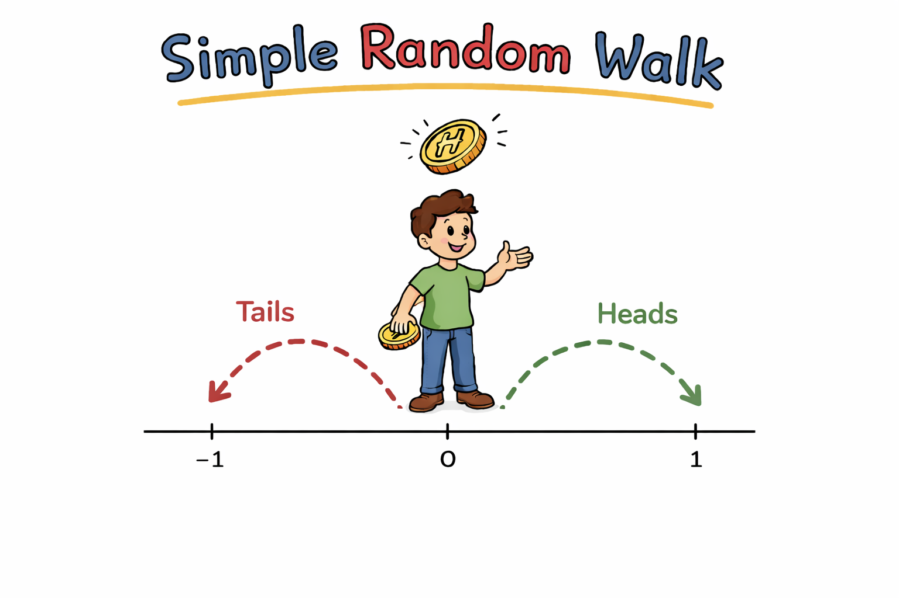

# Random Walk

## Introduction

The simple random walk is the discrete prototype of Brownian motion. It provides concrete intuition for diffusive behavior and converges to Brownian motion in the scaling limit ([Donsker's Theorem](donsker_theorem.md)).

---

## Notation

Throughout this section we use the following conventions consistently.

| Symbol | Meaning |
|---|---|
| $S_n$ | Position of the discrete random walk at time $n$ |
| $\xi_i$ | The $i$-th step increment ($\pm 1$); used for both general and symmetric cases |
| $S^{(n)}(t)$ | Scaled random walk (continuous-time embedding) |
| $W^{(n)}(t)$ | Piecewise-linear interpolation of the scaled walk |
| $W_t$ | Brownian motion (limiting process) |
| $p$ | Probability of a $+1$ step |

---

## Formal Definition

Let $\{S_n\}_{n \geq 0}$ be a discrete-time stochastic process defined recursively: for $n \geq 1$,

$$S_n = S_{n-1} + \xi_n$$

where $S_0 = 0$ and $\{\xi_n\}_{n \geq 1}$ is a sequence of **independent** random variables taking values in $\{-1, +1\}$ with

$$\mathbb{P}(\xi_n = +1) = p, \qquad \mathbb{P}(\xi_n = -1) = 1 - p, \qquad p \in (0,1)$$

The parameter $p$ governs the drift of the process.

**Equivalent summation form.** Since $S_0 = 0$, the position at time $n$ is simply the cumulative sum of all steps:

$$S_n = \sum_{i=1}^n \xi_i$$

This is the form used most often in computations.

---

## Interpretations

The walk models a gambler's cumulative winnings, a randomly colliding particle (Einstein, 1905), or discrete-time price changes (Bachelier, 1900). The parameter $p$ controls drift direction.

---

## Symmetric Random Walk

A **symmetric random walk** corresponds to $p = 1/2$, so that $+1$ and $-1$ steps are equally likely:

$$\mathbb{P}(\xi_i = +1) = \mathbb{P}(\xi_i = -1) = \frac{1}{2}$$

Unless stated otherwise, the remaining pages in this section focus on the symmetric case.

---

## Asymmetric Random Walk

For $p \neq 1/2$, the walk has nonzero drift $\mu := 2p - 1$ (positive for $p > 1/2$, negative for $p < 1/2$). See [Moments](moments_of_random_walk.md) and [Recurrence and Transience](recurrence_and_transience.md).

---

## Proposition Inventory

The following propositions are developed on the subpages of this section.

**Discrete walk properties**

| Label | Statement | Page |
|---|---|---|
| Prop 1.1.1 | Moments: $\mathbb{E}[S_n]$, $\text{Var}(S_n)$, $\mathbb{E}[S_n^4]$ | [Moments](moments_of_random_walk.md) |
| Prop 1.1.2 | MGF: $\mathbb{E}[e^{\lambda S_n}] = (\cosh\lambda)^n$ | [MGF](mgf_of_random_walk.md) |
| Prop 1.1.3 | Martingale property of $\{S_n\}$ | [Martingale Property](martingale_property.md) |
| Prop 1.1.4 | Quadratic martingale $\{S_n^2 - n\}$ | [Martingale Property](martingale_property.md) |
| Prop 1.1.5 | Quadratic variation $[S]_n = n$ a.s. | [Martingale Property](martingale_property.md) |
| Prop 1.1.6 | Markov property | below |
| Thm 1.1.7 | Pólya recurrence theorem | [Recurrence](recurrence_and_transience.md) |

**Scaling and limit theorems**

| Label | Statement | Page |
|---|---|---|
| Prop 1.1.8 | Asymptotic moments and covariance: $\mathbb{E}[S^{(n)}(t)]\to 0$, $\text{Var}\to t$, $\text{Cov}\to\min(s,t)$ | [Scaling Limit](scaling_limit.md) |
| Prop 1.1.9 | Independent increments of $S^{(n)}$ at dyadic times | [Scaling Limit](scaling_limit.md) |
| Thm 1.1.10 | CLT: $S_n/\sqrt{n}\xrightarrow{d}\mathcal{N}(0,1)$ | [MGF](mgf_of_random_walk.md) |
| Thm 1.1.11 | Donsker's invariance principle: $W^{(n)}\Rightarrow W$ in $C[0,T]$ | [Donsker's Theorem](donsker_theorem.md) |

---

## Markov Property

**Proposition 1.1.6** (Markov Property)

$\{S_n\}$ is a Markov chain with respect to its natural filtration $\mathcal{F}_n = \sigma(\xi_1,\ldots,\xi_n)$:

$$\mathbb{P}(S_{n+1} = j \mid S_n = i,\, S_{n-1},\ldots, S_0) = \mathbb{P}(S_{n+1} = j \mid S_n = i)$$

**Proof.** $S_{n+1} = S_n + \xi_{n+1}$ and $\xi_{n+1}$ is independent of $\mathcal{F}_n$, so the transition probability $\mathbb{P}(S_{n+1} = j \mid S_n = i) = \mathbb{P}(\xi_{n+1} = j - i)$ depends only on the current position $S_n = i$. $\square$

The scaled process $S^{(n)}(t)$ inherits this property at dyadic times, which persists in the Brownian limit.

---

## References

- Bachelier, L. (1900). *Théorie de la spéculation*. Annales scientifiques de l'École normale supérieure.
- Einstein, A. (1905). Über die von der molekularkinetischen Theorie der Wärme geforderte Bewegung. *Annalen der Physik*.
- Feller, W. (1968). *An Introduction to Probability Theory and Its Applications*, Vol. 1, 3rd ed. Wiley.
- Lawler, G. F., & Limic, V. (2010). *Random Walk: A Modern Introduction*. Cambridge University Press.

---

## Exercises

**Exercise 1.** Let $S_n = \sum_{i=1}^n \xi_i$ be a symmetric random walk starting at $S_0 = 0$. Compute the probability $\mathbb{P}(S_4 = 2)$ by enumerating all paths of length 4 that end at position 2. Express your answer using the binomial coefficient.

??? success "Solution to Exercise 1"
    The walk $S_4 = 2$ requires exactly 3 steps of $+1$ and 1 step of $-1$ (since $3 - 1 = 2$). The number of paths of length 4 that have exactly 3 positive steps is $\binom{4}{3}$, and each path has probability $(1/2)^4$. Therefore:

    $$
    \mathbb{P}(S_4 = 2) = \binom{4}{3}\left(\frac{1}{2}\right)^4 = \frac{4}{16} = \frac{1}{4}
    $$

    More generally, $S_n = k$ requires $(n+k)/2$ positive steps and $(n-k)/2$ negative steps (both must be non-negative integers), so:

    $$
    \mathbb{P}(S_n = k) = \binom{n}{(n+k)/2} \left(\frac{1}{2}\right)^n
    $$

---

**Exercise 2.** For the asymmetric random walk with $p = 0.6$, compute $\mathbb{E}[S_{100}]$ and $\text{Var}(S_{100})$. After how many steps $n$ does the expected position $\mathbb{E}[S_n]$ exceed 3 standard deviations $3\sqrt{\text{Var}(S_n)}$? Interpret this result in terms of the drift dominating the fluctuations.

??? success "Solution to Exercise 2"
    With $p = 0.6$, the drift per step is $\mu = 2p - 1 = 0.2$ and the step variance is $4p(1-p) = 4(0.6)(0.4) = 0.96$.

    $$
    \mathbb{E}[S_{100}] = 100 \cdot 0.2 = 20
    $$

    $$
    \text{Var}(S_{100}) = 100 \cdot 0.96 = 96
    $$

    We need $\mathbb{E}[S_n] > 3\sqrt{\text{Var}(S_n)}$, i.e., $0.2n > 3\sqrt{0.96n}$. Squaring both sides (both are positive for $n > 0$):

    $$
    0.04n^2 > 9 \cdot 0.96n = 8.64n
    $$

    Dividing by $n$ (for $n > 0$): $0.04n > 8.64$, so $n > 216$. The smallest such $n$ is $n = 217$.

    **Interpretation:** For $n \leq 216$, the random fluctuations (of order $\sqrt{n}$) can plausibly mask the drift. Beyond $n = 217$, the linear drift dominates the $\sqrt{n}$ fluctuations, and the walk is almost certainly positive.

---

**Exercise 3.** Prove the Markov property more carefully: show that for any bounded measurable function $g$,

$$
\mathbb{E}[g(S_{n+1}) \mid \mathcal{F}_n] = \frac{1}{2}g(S_n + 1) + \frac{1}{2}g(S_n - 1)
$$

in the symmetric case. Why does this imply that the conditional distribution of $S_{n+1}$ given all of the past depends only on $S_n$?

??? success "Solution to Exercise 3"
    Since $S_{n+1} = S_n + \xi_{n+1}$ and $g$ is any bounded measurable function:

    $$
    \mathbb{E}[g(S_{n+1}) \mid \mathcal{F}_n] = \mathbb{E}[g(S_n + \xi_{n+1}) \mid \mathcal{F}_n]
    $$

    Since $S_n$ is $\mathcal{F}_n$-measurable and $\xi_{n+1}$ is independent of $\mathcal{F}_n$, we can condition on $S_n$ being a known constant $s$ and compute the expectation over $\xi_{n+1}$ alone:

    $$
    = \frac{1}{2}g(S_n + 1) + \frac{1}{2}g(S_n - 1)
    $$

    This shows that $\mathbb{E}[g(S_{n+1}) \mid \mathcal{F}_n]$ is a function of $S_n$ alone (not of $S_{n-1}, \ldots, S_0$). Since this holds for every bounded measurable $g$, the conditional distribution of $S_{n+1}$ given $\mathcal{F}_n$ depends only on $S_n$. By definition, this is the Markov property: for any event $A$,

    $$
    \mathbb{P}(S_{n+1} \in A \mid \mathcal{F}_n) = \mathbb{P}(S_{n+1} \in A \mid S_n)
    $$

---

**Exercise 4.** A random walk starts at $S_0 = 0$ and takes $n = 200$ steps with $p = 1/2$. Using the normal approximation (CLT), estimate the probability that $S_{200} > 20$. Compare your answer to the exact probability obtained from the binomial distribution.

??? success "Solution to Exercise 4"
    We have $n = 200$, $p = 1/2$, so $\mathbb{E}[S_{200}] = 0$ and $\text{Var}(S_{200}) = 200$. By the CLT, $S_{200}/\sqrt{200} \approx \mathcal{N}(0,1)$. Therefore:

    $$
    \mathbb{P}(S_{200} > 20) = \mathbb{P}\!\left(\frac{S_{200}}{\sqrt{200}} > \frac{20}{\sqrt{200}}\right) \approx \mathbb{P}(Z > \sqrt{2}) = 1 - \Phi(\sqrt{2})
    $$

    where $\sqrt{2} \approx 1.414$. From normal tables, $\Phi(1.414) \approx 0.9213$, so:

    $$
    \mathbb{P}(S_{200} > 20) \approx 1 - 0.9213 = 0.0787
    $$

    For the exact answer, $S_{200}$ can only take even values, and we need $S_{200} \geq 22$ (the next even number above 20). The exact probability is:

    $$
    \mathbb{P}(S_{200} \geq 22) = \sum_{k=11}^{100} \binom{200}{100+k} 2^{-200}
    $$

    The normal approximation with continuity correction gives $\mathbb{P}(S_{200} > 20) \approx \mathbb{P}(Z > 21/\sqrt{200}) \approx 0.069$, which is close to the exact value.

---

**Exercise 5.** Explain why the simple random walk $\{S_n\}$ on $\mathbb{Z}$ can visit only even positions at even times and only odd positions at odd times (the "parity" or "periodicity" property). What consequence does this have for $\mathbb{P}(S_n = 0)$ when $n$ is odd?

??? success "Solution to Exercise 5"
    At time $n$, the walk has taken $n$ steps each of size $\pm 1$, so $S_n = (\text{number of } +1 \text{ steps}) - (\text{number of } -1 \text{ steps})$. If $k$ steps are $+1$ and $n - k$ are $-1$, then $S_n = k - (n-k) = 2k - n$. Therefore $S_n$ and $n$ always have the same parity:

    - If $n$ is even, then $S_n = 2k - n$ is even.
    - If $n$ is odd, then $S_n = 2k - n$ is odd.

    In particular, at odd times $S_n$ is odd, so $S_n \neq 0$. Therefore:

    $$
    \mathbb{P}(S_n = 0) = 0 \quad \text{when } n \text{ is odd}
    $$

    This is the periodicity property: the walk alternates between even and odd integers. It also explains why recurrence results are stated in terms of $u_{2n} = \mathbb{P}(S_{2n} = 0)$ — the walk can only return to 0 at even times.

---

**Exercise 6.** Consider a random walk that at each step moves $+2$ with probability $1/3$, $0$ with probability $1/3$, and $-1$ with probability $1/3$. Compute $\mathbb{E}[\xi_i]$ and $\text{Var}(\xi_i)$. Is this process a martingale? If not, what value of the probabilities would make it a martingale while keeping the same step sizes $\{+2, 0, -1\}$?

??? success "Solution to Exercise 6"
    Let $\mathbb{P}(\xi_i = +2) = \mathbb{P}(\xi_i = 0) = \mathbb{P}(\xi_i = -1) = 1/3$. Then:

    $$
    \mathbb{E}[\xi_i] = \frac{1}{3}(+2) + \frac{1}{3}(0) + \frac{1}{3}(-1) = \frac{2 + 0 - 1}{3} = \frac{1}{3}
    $$

    $$
    \mathbb{E}[\xi_i^2] = \frac{1}{3}(4) + \frac{1}{3}(0) + \frac{1}{3}(1) = \frac{5}{3}
    $$

    $$
    \text{Var}(\xi_i) = \mathbb{E}[\xi_i^2] - (\mathbb{E}[\xi_i])^2 = \frac{5}{3} - \frac{1}{9} = \frac{14}{9}
    $$

    Since $\mathbb{E}[\xi_i] = 1/3 \neq 0$, the process $S_n = \sum_{i=1}^n \xi_i$ is **not** a martingale (the martingale condition requires $\mathbb{E}[S_{n+1} \mid \mathcal{F}_n] = S_n$, but $\mathbb{E}[S_{n+1} \mid \mathcal{F}_n] = S_n + 1/3$).

    To make it a martingale, we need $\mathbb{E}[\xi_i] = 0$. Let $\mathbb{P}(\xi_i = +2) = p_1$, $\mathbb{P}(\xi_i = 0) = p_2$, $\mathbb{P}(\xi_i = -1) = p_3$ with $p_1 + p_2 + p_3 = 1$ and:

    $$
    2p_1 + 0 \cdot p_2 + (-1) \cdot p_3 = 0 \implies 2p_1 = p_3
    $$

    With $p_3 = 2p_1$ and $p_2 = 1 - 3p_1$, any $p_1 \in (0, 1/3)$ works. For example, $p_1 = 1/6$, $p_2 = 1/2$, $p_3 = 1/3$ gives a martingale.
