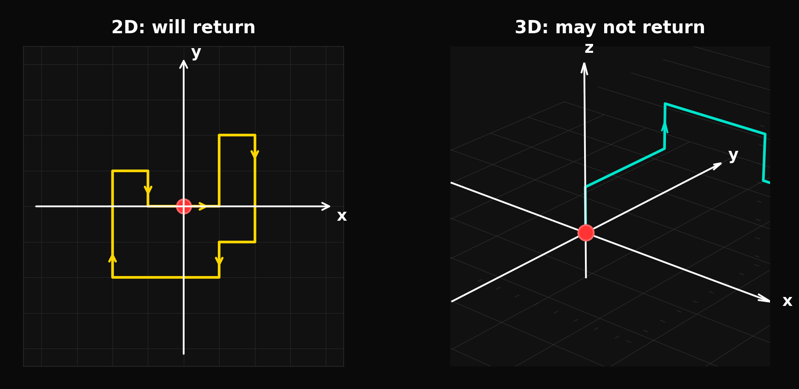

# Recurrence and Transience

!!! warning "Incomplete page"
    This page is missing the required five-section structure (Concept Definition, Explanation, Diagram / Example). Content needs to be reorganized and expanded.

> "A drunken man will find his way home, but a drunken bird may get lost forever."
>
> — Shizuo Kakutani

Whether a random walk returns to its starting point depends critically on the dimension of the space it lives in. This dichotomy, first established by Pólya (1921), is one of the most striking results in probability theory.

---

## Setup

A random walk on $\mathbb{Z}^d$ is called:

- **Recurrent** if it returns to the origin with probability 1.
- **Transient** if it returns to the origin with probability strictly less than 1, i.e., it eventually escapes to infinity.

Define the **return probability** and **first-return probability** generating functions:

$$U(s) = \sum_{n=0}^{\infty} u_{2n}\, s^{2n}, \qquad F(s) = \sum_{n=1}^{\infty} f_{2n}\, s^{2n}, \qquad s \in [0,1]$$

where

- $u_{2n} := \mathbb{P}(S_{2n} = 0)$ is the probability of being at the origin at time $2n$,
- $f_{2n} := \mathbb{P}(\text{first return to origin at time } 2n)$.

These are connected by the **renewal relation**

$$U(s) = \frac{1}{1 - F(s)}$$

which follows from decomposing visits to the origin by the time of the first return. The walk is recurrent if and only if $F(1) = \sum_{n=1}^\infty f_{2n} = 1$, which by the renewal relation holds if and only if $U(1) = \sum_{n=0}^\infty u_{2n} = \infty$.

---

## Pólya's Recurrence Theorem

**Theorem 1.1.6** (Pólya's Recurrence Theorem)

For the symmetric random walk on $\mathbb{Z}^d$:

- **$d = 1$:** recurrent — returns to origin with probability 1.
- **$d = 2$:** recurrent — returns to origin with probability 1.
- **$d \geq 3$:** transient — positive probability of never returning.

We prove all three cases via the generating function criterion $U(1) < \infty \Leftrightarrow$ transient.

---

### Proof for d = 1

The probability of return to 0 at time $2n$ (we can only return at even times) is

$$u_{2n} = \mathbb{P}(S_{2n} = 0) = \binom{2n}{n}\left(\frac{1}{2}\right)^{2n}$$

By Stirling's approximation $n! \sim \sqrt{2\pi n}\,(n/e)^n$:

$$\binom{2n}{n} = \frac{(2n)!}{(n!)^2} \sim \frac{\sqrt{4\pi n}\,(2n/e)^{2n}}{2\pi n\,(n/e)^{2n}} = \frac{4^n}{\sqrt{\pi n}}$$

so $u_{2n} \sim \frac{1}{\sqrt{\pi n}}$. Since $\sum_{n=1}^\infty \frac{1}{\sqrt{\pi n}} = \infty$, we have $U(1) = \infty$, hence the walk is **recurrent**.

### Proof for d = 2

In two dimensions, a step is a unit vector in one of the four directions $\{\pm e_1, \pm e_2\}$, each with probability $1/4$. The return probability at time $2n$ factors over coordinates:

$$u_{2n}^{(2)} = \left[\binom{2n}{n}\left(\frac{1}{2}\right)^{2n}\right]^2 \sim \frac{1}{\pi n}$$

Again $\sum_n u_{2n}^{(2)} = \infty$, so the 2D walk is **recurrent**.

### Proof for d >= 3

In $d$ dimensions, $u_{2n}^{(d)} \sim C_d \cdot n^{-d/2}$ for a constant $C_d > 0$. Since $d/2 > 1$ for $d \geq 3$, the series $\sum_n n^{-d/2}$ converges by the $p$-series test ($p = d/2 > 1$). Therefore $U^{(d)}(1) < \infty$, which forces $F^{(d)}(1) < 1$: the walk is **transient**. $\square$

---

## Asymmetric Walk in d = 1

For $p \neq 1/2$, any nonzero drift makes the 1D walk transient. By the Strong Law of Large Numbers:

$$\frac{S_n}{n} \to \mathbb{E}[X_1] = 2p - 1 \neq 0 \quad \text{almost surely.}$$

So $S_n \to +\infty$ (if $p > 1/2$) or $S_n \to -\infty$ (if $p < 1/2$) almost surely. The walk visits each integer only finitely many times, regardless of how small $|p - 1/2|$ is. There is no threshold — any drift, however small, destroys recurrence.

---

## Implications

The recurrence/transience dichotomy has consequences far beyond the random walk:

- **Statistical mechanics:** recurrence in $d \leq 2$ is related to the absence of a phase transition in the Ising model below dimension 2 (Peierls argument).
- **Polymer physics:** transience in $d \geq 3$ models the fact that a long polymer in 3D has positive probability of having no self-intersections.
- **Population genetics:** recurrence in $d = 1$ underpins the certainty of genetic drift in the Wright–Fisher model (see [Applications](applications_random_walk.md)).
- **Potential theory:** the connection $U(1) < \infty \Leftrightarrow$ transient is the probabilistic version of the Green's function being finite.

---

## References

- Pólya, G. (1921). Über eine Aufgabe der Wahrscheinlichkeitsrechnung betreffend die Irrfahrt im Straßennetz. *Mathematische Annalen*, 84(1–2), 149–160.
- Kakutani, S. Attributed. Quoted in Durrett, R. (2010). *Probability: Theory and Examples*, 4th ed. Cambridge University Press, p. 162.
- Feller, W. (1968). *An Introduction to Probability Theory and Its Applications*, Vol. 1, 3rd ed. Wiley.
- Lawler, G. F., & Limic, V. (2010). *Random Walk: A Modern Introduction*. Cambridge University Press.
- Spitzer, F. (1964). *Principles of Random Walk*. Springer.
