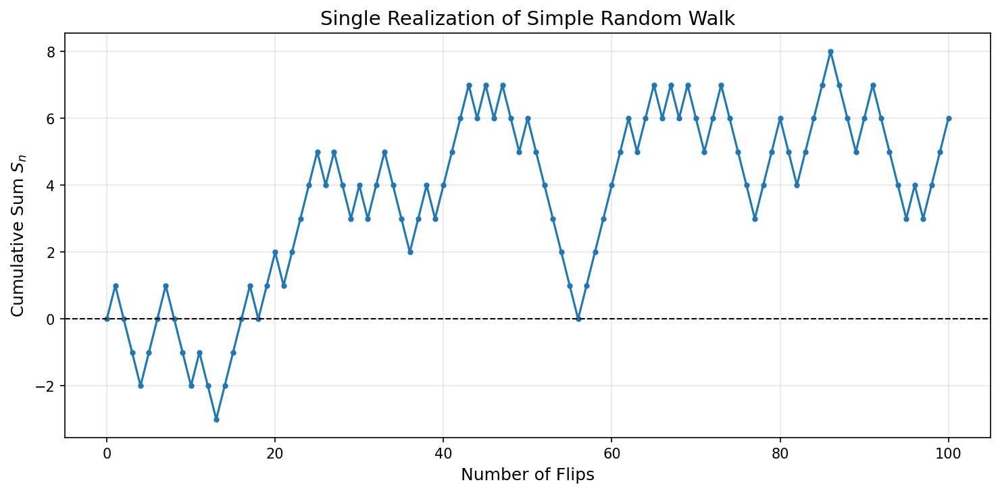
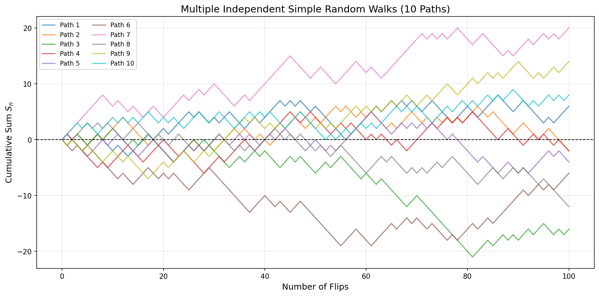
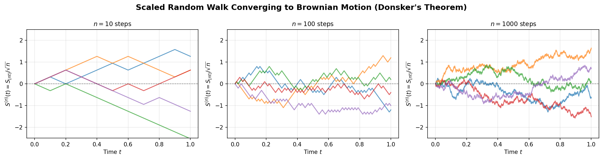
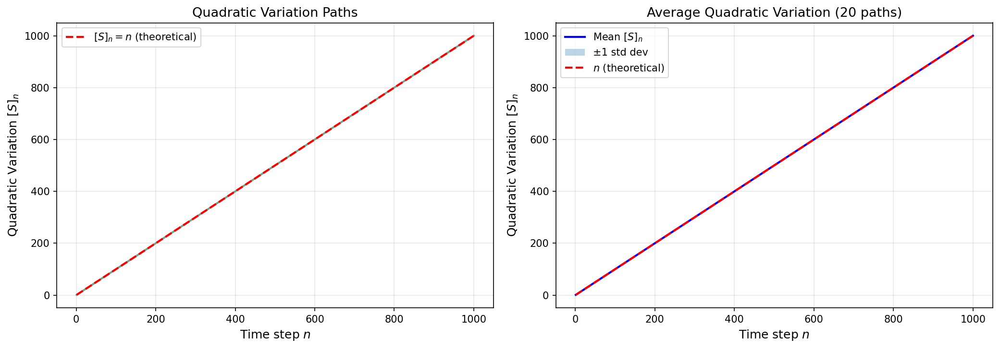
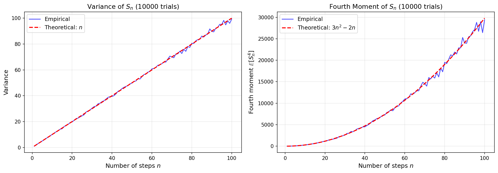

# Simulations

This page consolidates all computational experiments for the simple random walk. The simulations verify the theoretical properties derived in earlier sections. Each block is self-contained and can be run independently.

---

## Simulation 1: Single Path

A single realization of a simple symmetric random walk over 100 steps.

```python
import matplotlib.pyplot as plt
import numpy as np

np.random.seed(42)

num_flips = 100
flips = np.random.choice([1, -1], size=num_flips)
heads_count = np.sum(flips == 1)
tails_count = np.sum(flips == -1)
print(f"Heads: {heads_count}, Tails: {tails_count}")

cumsum_flips = np.cumsum(np.insert(flips, 0, 0))

fig, ax = plt.subplots(figsize=(10, 5))
ax.plot(cumsum_flips, marker='o', linestyle='-', markersize=3)
ax.set_xlabel("Number of Flips", fontsize=12)
ax.set_ylabel("Cumulative Sum $S_n$", fontsize=12)
ax.set_title("Single Realization of Simple Random Walk", fontsize=14)
ax.axhline(0, color='black', linestyle='--', linewidth=1)
ax.grid(alpha=0.3)
plt.tight_layout()
plt.show()

print(f"Final position S_100 = {cumsum_flips[-1]}")
```

**Output:**
```
Heads: 53, Tails: 47
Final position S_100 = 6
```



**What to observe:**

- The path oscillates around zero, consistent with $\mathbb{E}[S_n] = 0$.
- Final position $S_{100} = 6$ is of order $\sqrt{100} = 10$, consistent with $\text{SD}(S_n) = \sqrt{n}$.
- Every step produces a "kink" — no tangent exists anywhere, foreshadowing the nowhere-differentiability of Brownian motion.

---

## Simulation 2: Multiple Paths

Ten independent realizations plotted together illustrate path diversity and variance growth.

```python
import matplotlib.pyplot as plt
import numpy as np

np.random.seed(42)

num_flips = 100
num_paths = 10

flips = np.random.choice([1, -1], size=(num_paths, num_flips))
cumsum_flips = np.cumsum(np.insert(flips, 0, 0, axis=1), axis=1)

fig, ax = plt.subplots(figsize=(12, 6))
for i in range(num_paths):
    ax.plot(cumsum_flips[i], label=f'Path {i + 1}', alpha=0.7)
ax.set_xlabel("Number of Flips", fontsize=12)
ax.set_ylabel("Cumulative Sum $S_n$", fontsize=12)
ax.set_title(f"Multiple Independent Simple Random Walks ({num_paths} Paths)", fontsize=14)
ax.axhline(0, color='black', linestyle='--', linewidth=1)
ax.legend(loc='upper left', fontsize=9, ncol=2)
ax.grid(alpha=0.3)
plt.tight_layout()
plt.show()

final_position = cumsum_flips[:, -1]
print(f"Sample mean at n={num_flips}: {np.mean(final_position):.2f}  (theoretical: 0)")
print(f"Sample variance at n={num_flips}: {np.var(final_position, ddof=1):.2f}  (theoretical: {num_flips})")
```

**Output:**
```
Sample mean at n=100: 0.60  (theoretical: 0)
Sample variance at n=100: 128.04  (theoretical: 100)
```



**What to observe:**

- The "spread" of paths grows with $n$, consistent with $\text{Var}(S_n) = n$.
- Individual paths wander far from zero, but the cross-path average is close to 0.
- With only 10 paths, the sample variance ($128$) is a noisy estimate of the theoretical value ($100$); use Simulation 5 for a reliable check with $10{,}000$ trials.

---

## Simulation 3: Scaled Walk Converging to Brownian Motion

Donsker's theorem predicts $S^{(n)}(t) = S_{\lfloor nt \rfloor}/\sqrt{n} \Rightarrow W_t$ as $n \to \infty$. As $n$ increases, the paths become smoother and approach the continuous, "wiggly" character of Brownian motion.

```python
import matplotlib.pyplot as plt
import numpy as np

T = 1.0
num_steps_list = [10, 100, 1000]
num_paths = 5

fig, axes = plt.subplots(1, 3, figsize=(15, 4))

np.random.seed(42)  # Set once — paths are independent across discretization levels

for idx, n in enumerate(num_steps_list):
    t = np.linspace(0, T, n + 1)
    ax = axes[idx]
    for _ in range(num_paths):
        xi = np.random.choice([1, -1], size=n)
        S = np.cumsum(np.insert(xi, 0, 0))
        ax.plot(t, S / np.sqrt(n), alpha=0.7, linewidth=1.5)
    ax.set_title(f'$n = {n}$ steps', fontsize=11)
    ax.set_xlabel('Time $t$', fontsize=10)
    ax.set_ylabel(r'$S^{(n)}(t)$', fontsize=10)
    ax.axhline(0, color='black', linestyle='--', linewidth=0.8, alpha=0.5)
    ax.grid(alpha=0.3)
    ax.set_ylim(-2.5, 2.5)

plt.suptitle("Scaled Random Walk Converging to Brownian Motion (Donsker's Theorem)",
             fontsize=14, fontweight='bold')
plt.tight_layout()
plt.show()
```



**What to observe:**

| $n$ | Jump size $1/\sqrt{n}$ | Character |
|---|---|---|
| 10 | 0.316 | Jagged, visibly discrete |
| 100 | 0.100 | Smoother |
| 1000 | 0.032 | Visually continuous |

The variance at $t = 1$ is $\lfloor n \rfloor / n \approx 1$ for all $n$, consistent with $\text{Var}(W_1) = 1$.

---

## Simulation 4: Quadratic Variation

Proposition 1.1.5 states $[S]_n = n$ **almost surely** — deterministically, not as a statistical average. This simulation makes that striking fact visual.

```python
import matplotlib.pyplot as plt
import numpy as np

np.random.seed(42)

num_steps = 1000
num_paths = 20

QV_paths = np.zeros((num_paths, num_steps))
for k in range(num_paths):
    xi = np.random.choice([1, -1], size=num_steps)
    S = np.cumsum(np.insert(xi, 0, 0))
    QV_paths[k, :] = np.cumsum(np.diff(S)**2)

n_range = range(1, num_steps + 1)

fig, ax = plt.subplots(figsize=(9, 5))
for i in range(num_paths):
    ax.plot(n_range, QV_paths[i, :], alpha=0.4, linewidth=1)
ax.plot(n_range, list(n_range), 'r--', linewidth=2.5, label='$[S]_n = n$ (theoretical)', zorder=5)
ax.set_xlabel('Time step $n$', fontsize=12)
ax.set_ylabel('Quadratic Variation $[S]_n$', fontsize=12)
ax.set_title('All 20 paths lie exactly on $[S]_n = n$', fontsize=13)
ax.legend(fontsize=11)
ax.grid(alpha=0.3)
plt.tight_layout()
plt.show()

print(f"All paths equal n exactly: {np.allclose(QV_paths[:, -1], num_steps)}")
```

**Output:**
```
All paths equal n exactly: True
```



**What to observe:** Every colored path lies exactly on the red dashed line $[S]_n = n$. There is no spread — the quadratic variation has zero randomness. Compare this to the position $S_n$ itself (Simulation 2), which has spread $\sim\sqrt{n}$. The contrast illustrates why $[S]_n = n$ is a *structural* property, not a probabilistic one.

---

## Simulation 5: Verifying Moment Formulas

Monte Carlo verification of $\text{Var}(S_n) = n$ and $\mathbb{E}[S_n^4] = 3n^2 - 2n$ with 10,000 independent trials.

```python
import matplotlib.pyplot as plt
import numpy as np

np.random.seed(42)

num_trials = 10000
max_steps = 100

variance_empirical = np.zeros(max_steps)
fourth_moment_empirical = np.zeros(max_steps)

for n in range(1, max_steps + 1):
    xi = np.random.choice([1, -1], size=(num_trials, n))
    S_n = np.sum(xi, axis=1)
    variance_empirical[n-1] = np.var(S_n, ddof=1)
    fourth_moment_empirical[n-1] = np.mean(S_n**4)

n_values = np.arange(1, max_steps + 1)
variance_theoretical = n_values
fourth_moment_theoretical = 3 * n_values**2 - 2 * n_values

fig, (ax1, ax2) = plt.subplots(1, 2, figsize=(14, 5))

ax1.plot(n_values, variance_empirical, 'b-', alpha=0.7, label='Empirical')
ax1.plot(n_values, variance_theoretical, 'r--', linewidth=2, label='Theoretical: $n$')
ax1.set_xlabel('Steps $n$', fontsize=12)
ax1.set_ylabel('Variance', fontsize=12)
ax1.set_title(f'Variance of $S_n$ ({num_trials:,} trials)', fontsize=13)
ax1.legend(fontsize=11)
ax1.grid(alpha=0.3)

ax2.plot(n_values, fourth_moment_empirical, 'b-', alpha=0.7, label='Empirical')
ax2.plot(n_values, fourth_moment_theoretical, 'r--', linewidth=2, label='Theoretical: $3n^2-2n$')
ax2.set_xlabel('Steps $n$', fontsize=12)
ax2.set_ylabel('$\\mathbb{E}[S_n^4]$', fontsize=12)
ax2.set_title(f'Fourth Moment of $S_n$ ({num_trials:,} trials)', fontsize=13)
ax2.legend(fontsize=11)
ax2.grid(alpha=0.3)

plt.tight_layout()
plt.show()

print(f"At n = {max_steps}:")
print(f"  Var: empirical = {variance_empirical[-1]:.2f}, theoretical = {max_steps},  "
      f"error = {abs(variance_empirical[-1]-max_steps)/max_steps*100:.2f}%")
print(f"  E[S^4]: empirical = {fourth_moment_empirical[-1]:.1f}, "
      f"theoretical = {fourth_moment_theoretical[-1]},  "
      f"error = {abs(fourth_moment_empirical[-1]-fourth_moment_theoretical[-1])/fourth_moment_theoretical[-1]*100:.2f}%")
```

**Output:**
```
At n = 100:
  Var: empirical = 99.38, theoretical = 100,  error = 0.62%
  E[S^4]: empirical = 29432.7, theoretical = 29800,  error = 1.23%
```



**What to observe:** Both empirical curves track their theoretical counterparts closely. Relative error below 2% with $10{,}000$ trials is expected by the Law of Large Numbers; it would shrink as $1/\sqrt{\text{num\_trials}}$ if the number of trials were increased.
