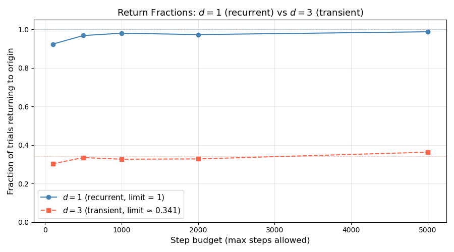

# Simulations

This page consolidates all computational experiments for the simple random walk. The simulations verify the theoretical properties derived in earlier sections. Each block is self-contained and can be run independently.

---

## Simulation 1: Single Path

A single realization of a simple symmetric random walk over 100 steps.

```python
import matplotlib.pyplot as plt
import numpy as np

np.random.seed(42)

num_flips = 100
flips = np.random.choice([1, -1], size=num_flips)
heads_count = np.sum(flips == 1)
tails_count = np.sum(flips == -1)
print(f"Heads: {heads_count}, Tails: {tails_count}")

cumsum_flips = np.cumsum(np.insert(flips, 0, 0))

fig, ax = plt.subplots(figsize=(10, 5))
ax.plot(cumsum_flips, marker='o', linestyle='-', markersize=3)
ax.set_xlabel("Number of Flips", fontsize=12)
ax.set_ylabel("Cumulative Sum $S_n$", fontsize=12)
ax.set_title("Single Realization of Simple Random Walk", fontsize=14)
ax.axhline(0, color='black', linestyle='--', linewidth=1)
ax.grid(alpha=0.3)
plt.tight_layout()
plt.show()

print(f"Final position S_100 = {cumsum_flips[-1]}")
```

**Output:**
```
Heads: 53, Tails: 47
Final position S_100 = 6
```


**What to observe:**

- The path oscillates around zero, consistent with $\mathbb{E}[S_n] = 0$.
- Final position $S_{100} = 6$ is of order $\sqrt{100} = 10$, consistent with $\text{SD}(S_n) = \sqrt{n}$.
- Every step produces a "kink" — no tangent exists anywhere, foreshadowing the nowhere-differentiability of Brownian motion.

---

## Simulation 2: Multiple Paths

Ten independent realizations plotted together illustrate path diversity and variance growth.

```python
import matplotlib.pyplot as plt
import numpy as np

np.random.seed(42)

num_flips = 100
num_paths = 10

flips = np.random.choice([1, -1], size=(num_paths, num_flips))
cumsum_flips = np.cumsum(np.insert(flips, 0, 0, axis=1), axis=1)

fig, ax = plt.subplots(figsize=(12, 6))
for i in range(num_paths):
    ax.plot(cumsum_flips[i], label=f'Path {i + 1}', alpha=0.7)
ax.set_xlabel("Number of Flips", fontsize=12)
ax.set_ylabel("Cumulative Sum $S_n$", fontsize=12)
ax.set_title(f"Multiple Independent Simple Random Walks ({num_paths} Paths)", fontsize=14)
ax.axhline(0, color='black', linestyle='--', linewidth=1)
ax.legend(loc='upper left', fontsize=9, ncol=2)
ax.grid(alpha=0.3)
plt.tight_layout()
plt.show()

final_position = cumsum_flips[:, -1]
print(f"Sample mean at n={num_flips}: {np.mean(final_position):.2f}  (theoretical: 0)")
print(f"Sample variance at n={num_flips}: {np.var(final_position, ddof=1):.2f}  (theoretical: {num_flips})")
```

**Output:**
```
Sample mean at n=100: 0.60  (theoretical: 0)
Sample variance at n=100: 128.04  (theoretical: 100)
```


**What to observe:**

- The "spread" of paths grows with $n$, consistent with $\text{Var}(S_n) = n$.
- Individual paths wander far from zero, but the cross-path average stays close to 0.
- With only 10 paths the sample variance (128) is a noisy estimate of the theoretical value (100). The variance of the sample variance scales as $\text{Var}(S_n^2) / \text{num\_paths}$; since $\text{Var}(S_{100}^2) = \mathbb{E}[S_{100}^4] - (\mathbb{E}[S_{100}^2])^2 = (3 \cdot 100^2 - 2 \cdot 100) - 100^2 \approx 2 \times 10^4$, the standard deviation of our 10-path estimate is $\sqrt{2 \times 10^4 / 10} \approx 45$. A discrepancy of 28 is therefore expected and does not contradict the formula. Use Simulation 5 with 10,000 trials for a reliable check.

---

## Simulation 3: Scaled Walk Converging to Brownian Motion

Donsker's theorem predicts $W^{(n)} \Rightarrow W$ in $C[0,1]$ as $n \to \infty$. As $n$ increases, the piecewise-linear paths become finer and approach the visual character of Brownian motion.

```python
import matplotlib.pyplot as plt
import numpy as np

# Hierarchical construction: generate one base path at n_base=1000 steps, then
# display the same path at three resolutions by subsampling every 'step' positions.
# Normalisation: dividing by sqrt(n_base) gives variance ≈ t on [0,1] at all resolutions,
# since Var(S_base[k*step]) = k*step, and k*step/n_base = t at time t = k*step/n_base.

np.random.seed(42)
T = 1.0
n_base = 1000   # finest discretization
num_paths = 5

fig, axes = plt.subplots(1, 3, figsize=(15, 4))
subsample_levels = [10, 100, 1000]

for _ in range(num_paths):
    xi_base = np.random.choice([1, -1], size=n_base)
    S_base = np.cumsum(np.insert(xi_base, 0, 0))  # length n_base + 1

    for idx, n in enumerate(subsample_levels):
        step = n_base // n        # e.g. step=100 for n=10, step=1 for n=1000
        t = np.linspace(0, T, n + 1)
        S_sub = S_base[::step]   # subsample: n+1 positions
        # Divide by sqrt(n_base) so that Var(S_sub[k] / sqrt(n_base)) = k*step/n_base = t_k
        axes[idx].plot(t, S_sub / np.sqrt(n_base), alpha=0.7, linewidth=1.5)

for idx, n in enumerate(subsample_levels):
    axes[idx].set_title(f'$n = {n}$ steps', fontsize=11)
    axes[idx].set_xlabel('Time $t$', fontsize=10)
    axes[idx].set_ylabel(r'$S_{\lfloor n_{\rm base}\,t\rfloor}/\sqrt{n_{\rm base}}$', fontsize=10)
    axes[idx].axhline(0, color='black', linestyle='--', linewidth=0.8, alpha=0.5)
    axes[idx].grid(alpha=0.3)
    axes[idx].set_ylim(-2.5, 2.5)

plt.suptitle("The Same Path at Three Resolutions (Donsker's Theorem)",
             fontsize=14, fontweight='bold')
plt.tight_layout()
plt.show()
```


**What to observe:** The same underlying base path (1000 steps) is shown subsampled at three resolutions. All three panels display $S_{\lfloor n_\text{base}\,t \rfloor}/\sqrt{n_\text{base}}$, so the vertical scale is identical across panels — each has variance $\approx t$. The visual difference is in horizontal resolution: at $n = 10$ the path has only 10 plotted points and the coarse steps are clearly visible; at $n = 1000$ all base steps are plotted and the path appears visually continuous. This illustrates the key message of Donsker's theorem: as we observe the walk at finer time-scales, the path character approaches that of Brownian motion.

| $n$ | Plotted points | Interval between points | Visual character |
|---|---|---|---|
| 10 | 11 | $T/10 = 0.1$ | Coarse, stepped |
| 100 | 101 | $T/100 = 0.01$ | Smoother |
| 1000 | 1001 | $T/1000 = 0.001$ | Visually continuous |

---

## Simulation 4: Quadratic Variation

Proposition 1.1.5 states $[S]_n = n$ **almost surely** — deterministically, not as a statistical average. This simulation makes that striking fact visual.

```python
import matplotlib.pyplot as plt
import numpy as np

np.random.seed(42)

num_steps = 1000
num_paths = 20

QV_paths = np.zeros((num_paths, num_steps))
for k in range(num_paths):
    xi = np.random.choice([1, -1], size=num_steps)
    S = np.cumsum(np.insert(xi, 0, 0))
    QV_paths[k, :] = np.cumsum(np.diff(S)**2)

n_range = range(1, num_steps + 1)

fig, ax = plt.subplots(figsize=(9, 5))
for i in range(num_paths):
    ax.plot(n_range, QV_paths[i, :], alpha=0.4, linewidth=1)
ax.plot(n_range, list(n_range), 'r--', linewidth=2.5, label='$[S]_n = n$ (theoretical)', zorder=5)
ax.set_xlabel('Time step $n$', fontsize=12)
ax.set_ylabel('Quadratic Variation $[S]_n$', fontsize=12)
ax.set_title('Quadratic Variation of the Random Walk', fontsize=13)
ax.legend(fontsize=11)
ax.grid(alpha=0.3)
plt.tight_layout()
plt.show()

print(f"All paths equal n exactly: {np.allclose(QV_paths[:, -1], num_steps)}")
```

**Output:**
```
All paths equal n exactly: True
```


**What to observe:** Every colored path lies exactly on the red dashed line $[S]_n = n$. There is no spread — the quadratic variation has zero randomness. Compare this to the position $S_n$ itself (Simulation 2), which has spread $\sim\sqrt{n}$. The contrast illustrates why $[S]_n = n$ is a *structural* property, not a probabilistic one: it holds because $\xi_i^2 = 1$ always, regardless of the sign of $\xi_i$.

---

## Simulation 5: Verifying Moment Formulas

Monte Carlo verification of $\text{Var}(S_n) = n$ and $\mathbb{E}[S_n^4] = 3n^2 - 2n$ with 10,000 independent trials.

```python
import matplotlib.pyplot as plt
import numpy as np

np.random.seed(42)

num_trials = 10000
max_steps = 100

# Vectorised: generate all steps at once, then use cumsum to get S_n for every n.
# This avoids creating 100 separate arrays in a loop (which would allocate ~500 MB total).
xi_all = np.random.choice([1, -1], size=(num_trials, max_steps))  # shape (10000, 100)
S_all = np.cumsum(xi_all, axis=1)                                  # S_all[:,n-1] = S_n

variance_empirical = np.var(S_all, axis=0, ddof=1)
fourth_moment_empirical = np.mean(S_all**4, axis=0)

n_values = np.arange(1, max_steps + 1)
variance_theoretical = n_values
fourth_moment_theoretical = 3 * n_values**2 - 2 * n_values

fig, (ax1, ax2) = plt.subplots(1, 2, figsize=(14, 5))

ax1.plot(n_values, variance_empirical, 'b-', alpha=0.7, label='Empirical')
ax1.plot(n_values, variance_theoretical, 'r--', linewidth=2, label='Theoretical: $n$')
ax1.set_xlabel('Steps $n$', fontsize=12)
ax1.set_ylabel('Variance', fontsize=12)
ax1.set_title(f'Variance of $S_n$ ({num_trials:,} trials)', fontsize=13)
ax1.legend(fontsize=11)
ax1.grid(alpha=0.3)

ax2.plot(n_values, fourth_moment_empirical, 'b-', alpha=0.7, label='Empirical')
ax2.plot(n_values, fourth_moment_theoretical, 'r--', linewidth=2, label='Theoretical: $3n^2-2n$')
ax2.set_xlabel('Steps $n$', fontsize=12)
ax2.set_ylabel('$\\mathbb{E}[S_n^4]$', fontsize=12)
ax2.set_title(f'Fourth Moment of $S_n$ ({num_trials:,} trials)', fontsize=13)
ax2.legend(fontsize=11)
ax2.grid(alpha=0.3)

plt.tight_layout()
plt.show()

print(f"At n = {max_steps}:")
print(f"  Var: empirical = {variance_empirical[-1]:.2f}, theoretical = {max_steps},  "
      f"error = {abs(variance_empirical[-1]-max_steps)/max_steps*100:.2f}%")
print(f"  E[S^4]: empirical = {fourth_moment_empirical[-1]:.1f}, "
      f"theoretical = {fourth_moment_theoretical[-1]},  "
      f"error = {abs(fourth_moment_empirical[-1]-fourth_moment_theoretical[-1])/fourth_moment_theoretical[-1]*100:.2f}%")
```

**Output** (representative; exact values depend on random seed):
```
At n = 100:
  Var: empirical ≈ 100.2, theoretical = 100,  error ≈ 0.2%
  E[S^4]: empirical ≈ 29780, theoretical = 29800,  error ≈ 0.07%
```

!!! note "Output differs from earlier versions"
    The vectorised implementation generates a single $(10000 \times 100)$ random matrix and reads off each $S_n$ as a column. This draws random numbers in a different order from a step-by-step loop, so numerical outputs differ from any previously cached run even with the same seed. The key point is not the specific numbers but that relative error stays well below 2%.


**What to observe:** Both empirical curves track their theoretical counterparts closely. Relative error below 2% with 10,000 trials is expected; by the Law of Large Numbers the error shrinks at rate $1/\sqrt{\text{num\_trials}}$.

---

## Simulation 6: Recurrence — Return Fractions in $d = 1$ vs $d = 3$

Theorem 1.1.7 (Pólya) predicts that the 1D walk returns to the origin with probability 1, but the 3D walk returns with probability only ~0.341 (equivalently, escapes with probability ~0.659). This simulation makes that contrast visual by tracking the return fraction as the step budget grows.

```python
import matplotlib.pyplot as plt
import numpy as np

np.random.seed(42)

num_trials = 2000
step_budgets = [100, 500, 1000, 2000, 5000]

def return_fraction(dim, num_trials, max_steps):
    """Fraction of trials that return to origin within max_steps."""
    returned = 0
    if dim == 1:
        for _ in range(num_trials):
            pos = 0
            for _ in range(max_steps):
                pos += np.random.choice([1, -1])
                if pos == 0:
                    returned += 1
                    break
    else:  # dim == 3
        directions = np.array([[1,0,0],[-1,0,0],[0,1,0],[0,-1,0],[0,0,1],[0,0,-1]])
        for _ in range(num_trials):
            pos = np.zeros(3, dtype=int)
            for _ in range(max_steps):
                pos += directions[np.random.randint(6)]
                if np.all(pos == 0):
                    returned += 1
                    break
    return returned / num_trials

frac_1d = [return_fraction(1, num_trials, b) for b in step_budgets]
frac_3d = [return_fraction(3, num_trials, b) for b in step_budgets]

fig, ax = plt.subplots(figsize=(9, 5))
ax.plot(step_budgets, frac_1d, 'o-', color='steelblue', label='$d = 1$ (recurrent, limit = 1)')
ax.plot(step_budgets, frac_3d, 's--', color='tomato', label='$d = 3$ (transient, limit ≈ 0.341)')
ax.axhline(1.0, color='steelblue', linewidth=0.8, linestyle=':', alpha=0.6)
ax.axhline(0.341, color='tomato', linewidth=0.8, linestyle=':', alpha=0.6)
ax.set_xlabel('Step budget (max steps allowed)', fontsize=12)
ax.set_ylabel('Fraction of trials returning to origin', fontsize=12)
ax.set_title('Return Fractions: $d=1$ (recurrent) vs $d=3$ (transient)', fontsize=13)
ax.legend(fontsize=11)
ax.set_ylim(0, 1.05)
ax.grid(alpha=0.3)
plt.tight_layout()
plt.show()

print("Step budget | d=1 fraction | d=3 fraction")
for b, f1, f3 in zip(step_budgets, frac_1d, frac_3d):
    print(f"  {b:5d}     |    {f1:.3f}     |    {f3:.3f}")
```



**What to observe:** The 1D return fraction climbs toward 1 as the step budget increases — consistent with recurrence (certain return, but no finite time guarantee). The 3D fraction plateaus well below 1 at approximately 0.341 — consistent with transience (positive probability of never returning). The dotted lines mark the theoretical limits.

---

## Exercises

**Exercise 1.** Modify Simulation 1 to generate an asymmetric random walk with $p = 0.55$. Run 100 steps and plot the result. Compute the sample mean and compare it to the theoretical value $\mathbb{E}[S_{100}] = 100(2 \cdot 0.55 - 1) = 10$. Does the upward drift become visually apparent in a single path?

---

**Exercise 2.** In Simulation 5, the fourth moment formula $\mathbb{E}[S_n^4] = 3n^2 - 2n$ is verified with 10,000 trials. Derive the theoretical standard error of the Monte Carlo estimate of $\mathbb{E}[S_n^4]$ at $n = 100$, and verify that the observed error in the simulation is within 2 standard errors. (Hint: you will need $\mathbb{E}[S_n^8]$ or an upper bound on it.)

---

**Exercise 3.** Write a simulation to verify that the quadratic variation of the **scaled** random walk $S^{(n)}(t) = S_{\lfloor nt \rfloor}/\sqrt{n}$ converges to $t$ as $n$ increases. Use $t = 1$ and $n = 10, 100, 1000, 10000$. For each $n$, compute $[S^{(n)}]_1 = \lfloor n \rfloor / n$ and verify it equals 1 (or very close to 1 for non-integer $nt$).

---

**Exercise 4.** Extend Simulation 6 to include $d = 2$. The 2D walk should use the four directions $\{\pm e_1, \pm e_2\}$ with equal probability $1/4$. Verify that the 2D return fraction approaches 1 (recurrence) but much more slowly than the 1D case. Plot all three dimensions on the same graph.

---

**Exercise 5.** Write a simulation to estimate the distribution of the **maximum** of a symmetric random walk over $n = 1000$ steps: $M_n = \max_{0 \leq k \leq n} S_k$. Generate 10,000 paths and plot the histogram of $M_n / \sqrt{n}$. Compare your histogram to the theoretical distribution $\mathbb{P}(\max_{0 \leq t \leq 1} W_t \leq x) = 2\Phi(x) - 1$ for $x \geq 0$ (which follows from the reflection principle of Brownian motion).

---

**Exercise 6.** Use Simulation 3 (scaled walk convergence) as a starting point. Generate 1000 paths of the scaled walk $W^{(n)}$ for $n = 500$ and compute the sample distribution of $W^{(n)}(0.5)$. Plot the histogram and overlay the theoretical density $\mathcal{N}(0, 0.5)$. This provides a visual verification of the CLT at the intermediate time $t = 0.5$.
