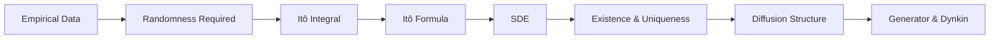

# Chapter 3: Stochastic Differential Equations

This chapter develops stochastic differential equations as the natural continuous-time limit of random systems and builds the analytical framework needed to study them. The entire chapter is driven by the single identity arising from quadratic variation:

$$(dW_t)^2 = dt$$

From this one fact the Itô integral, Itô's formula, and the theory of diffusions all follow.

The structure follows a single pipeline:

$$\text{data} \;\longrightarrow\; \text{randomness} \;\longrightarrow\; \text{Itô calculus} \;\longrightarrow\; \text{SDEs} \;\longrightarrow\; \text{structure}$$

---

## Key Concepts

### **Empirical Motivation**

Financial returns exhibit statistical properties — heavy tails, volatility clustering, and absence of autocorrelation — that deterministic models cannot reproduce.

This forces the introduction of randomness and motivates stochastic modeling. The required integration theory is developed in the next section.

### **Itô Integration**

Classical integration fails for Brownian motion because its paths have unbounded first variation but non-vanishing quadratic variation:

$$(dW_t)^2 = dt$$

The Itô integral is defined as an $L^2$-limit of adapted Riemann sums evaluated at left endpoints and is characterized by the **Itô isometry**:

$$\mathbb{E}\!\left[\left(\int_0^t H_s\, dW_s\right)^{\!2}\right] = \mathbb{E}\!\left[\int_0^t H_s^2\, ds\right]$$

This defines the fundamental stochastic integral and produces continuous martingales. The same quadratic variation identity is what forces a correction term in the chain rule below.

### **Itô's Formula**

Itô's formula is the stochastic chain rule — the fundamental theorem of stochastic calculus. For $f \in C^{1,2}$ and an Itô process $X_t$:

$$df = \frac{\partial f}{\partial t}\, dt + \frac{\partial f}{\partial x}\, dX_t + \frac{1}{2}\frac{\partial^2 f}{\partial x^2}\, (dX_t)^2$$

The extra second-order term arises from quadratic variation. This is the central mechanism that transforms randomness into drift and makes SDEs solvable in closed form when a transformation is available.

### **Stochastic Differential Equations**

An SDE

$$dX_t = b(t, X_t)\, dt + \sigma(t, X_t)\, dW_t$$

defines a stochastic process via its drift $b$ and diffusion coefficient $\sigma$. Solving an SDE means constructing a process satisfying the corresponding integral equation.

Analytical solutions are obtained via Itô transformations; numerical schemes approximate paths when closed forms are unavailable. The question of when a solution exists at all is addressed next.

### **Existence and Uniqueness**

Under Lipschitz and linear growth conditions on $b$ and $\sigma$, an SDE admits a unique **strong solution**. The solution is constructed via Picard iteration, paralleling the classical theory for ODEs.

This establishes when SDE models are mathematically well-defined, setting the stage for studying their structure.

### **Diffusion Processes**

Solutions of SDEs with Markov coefficients form **diffusion processes** — continuous-path Markov processes completely determined by $b$ and $\sigma$. They can be characterized equivalently by:

- SDEs (pathwise description),
- infinitesimal generators (analytic description),
- martingale problems (law-based description).

These three perspectives describe the same object through different lenses and are connected by the generator introduced below.

### **Infinitesimal Generator and Dynkin's Formula**

The generator

$$\mathcal{L}f = b \cdot \nabla f + \tfrac{1}{2}\, a : \nabla^2 f, \qquad a = \sigma\sigma^{\top}$$

captures the instantaneous rate of change of $\mathbb{E}^x[f(X_t)]$. The fundamental identity

$$f(X_t) = f(X_0) + \int_0^t \mathcal{L}f(X_s)\, ds + M_t$$

decomposes the dynamics of $f(X_t)$ into a predictable drift and a martingale fluctuation $M_t$. Taking expectations yields **Dynkin's formula**:

$$\mathbb{E}^x[f(X_t)] = f(x) + \mathbb{E}^x\!\left[\int_0^t \mathcal{L}f(X_s)\, ds\right]$$

which governs the evolution of expectations and is the bridge from stochastic models to pricing PDEs.

---

## Conceptual Flow

Each idea appears exactly once, in the section that owns it; the sections below develop the details.
