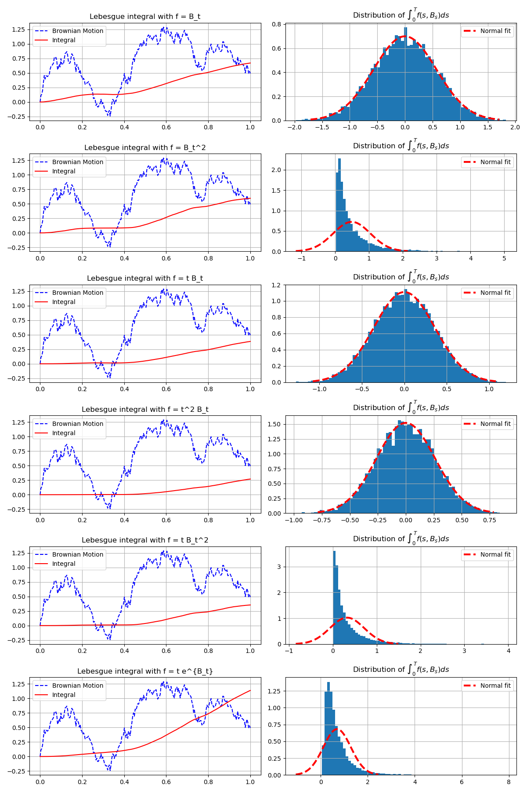

# The Ordinary Time Integral: An Intuitive Introduction

## 1. Concept Definition

This note introduces **time integrals of stochastic processes** and builds intuition for why these "ordinary" integrals behave differently from stochastic integrals such as the Itô integral.

The key idea is that when integrating with respect to **time**, we can integrate each sample path using ordinary calculus. In contrast, when integrating with respect to **Brownian motion**, the integrator itself is irregular, and ordinary calculus no longer applies.

We begin with the familiar integral with respect to **time**:

\[
\int_0^t f(s, B_s)\, ds
\]

Here:

* \(s\) is time
* \(B_s\) is Brownian motion
* \(f(s,B_s)\) is a function that may depend on both time and the Brownian path

Unlike stochastic integration, the integrator \(ds\) is **deterministic**.
Thus the integral behaves like an ordinary time integral. Conceptually, it is ordinary calculus applied to a random time-dependent function.

The construction happens in three steps:

1. Fix a sample path \(\omega\).
2. Treat \(s \mapsto f(s, B_s(\omega))\) as an ordinary function of time.
3. Compute the usual time integral.

For each fixed sample path \(\omega\), the function \(s \mapsto f(s, B_s(\omega))\) is an ordinary time-dependent function. If it is integrable on \([0,t]\), then

\[
\int_0^t f(s, B_s(\omega)) \, ds
\]

is defined pathwise as an ordinary Lebesgue integral. Measure-theoretically, this is simply a Lebesgue integral with respect to the deterministic measure \(ds\). In practice the integral can be approximated numerically using Riemann sums.

Under suitable measurability conditions, the resulting pathwise integral is a **random variable**.

The discrete approximation is given by

\[
\int_0^t f(s,B_s)\, ds
=
\lim_{|\Pi|\to0}
\sum_{k=0}^{n-1}
f(t_k,B_{t_k})(t_{k+1}-t_k)
\]

where

\[
\Pi = \{0 = t_0 < t_1 < \cdots < t_n = t\}
\]

is a partition of the interval.

Because the increment \(ds\) is deterministic, the only randomness comes from the function \(f(s,B_s)\).

---

## 2. Intuition and Financial Interpretation

Think of \(f(s, B_s)\) as a **rate of accumulation** per unit time. Then

\[
f(s,B_s)\,ds
\]

is the small accumulated amount over a short time interval.

Accumulating over the full horizon gives

\[
\int_0^t f(s,B_s)\,ds
\]

the total accumulated quantity.

### Key intuition

* The **rate** \(f(s,B_s)\) may depend on randomness
* But the **increment** \(ds\) is deterministic
* So the integral behaves like ordinary calculus

The randomness changes the *shape* of the curve \(f(s,B_s)\), but the mechanism of accumulation remains the same. This contrasts with stochastic integrals where the increment itself is random.

---

## 3. Discrete Approximation from Coin Flips

To build intuition, we approximate Brownian motion using a scaled random walk.

Divide the interval \([0,1]\) into \(n\) equal steps

\[
\Delta t = \frac{1}{n}
\]

At each step the Brownian increment is approximated by

\[
\Delta B_k = \pm \sqrt{\Delta t}
\]

with equal probability.

This scaling ensures the correct variance: after \(k\) steps, the variance is \(k \Delta t = t_k\), matching the Brownian scaling

\[
\mathrm{Var}(B_{t_k}) = t_k
\]

As the time step shrinks, the scaled random walk converges to Brownian motion. The corresponding discrete sums converge to the continuous-time integral.

Each term in the sum represents the area of a thin rectangle whose height depends on the realized Brownian path:

\[
\sum_{k=0}^{n-1} f(t_k,B_{t_k})\Delta t
\]

Conceptually, we are simply adding up **small contributions accumulated over time**.

---

## 4. Worked Examples

We illustrate the computation using a simple discrete Brownian path generated from coin flips.

Suppose the coin sequence is

\[
H,H,T,H,T,T,H,H,H,T
\]

with

\[
H \rightarrow +1,
\qquad
T \rightarrow -1
\]

Each increment equals

\[
\pm \frac{1}{\sqrt{10}}
\]

so the resulting Brownian path is the cumulative sum scaled by \(1/\sqrt{10}\).

---

### Example 1: Integrating \(B_s\) with respect to time

\[
\int_0^1 B_s \, ds
\]

Using the discrete approximation

\[
\sum B_{t_k}\Delta t
\]

we obtain

\[
\int_0^1 B_s \, ds \approx \frac{13}{10^{3/2}} \approx 0.411
\]

The value depends on the particular Brownian path. Note that the expected value is

\[
E\left[\int_0^1 B_s \, ds\right] = \int_0^1 E[B_s] \, ds = 0
\]

since \(E[B_s] = 0\) for all \(s\), by linearity of expectation and Fubini's theorem. The positive value here has no theoretical significance.

The variance also has a clean closed form. Using \(E[B_s B_t] = \min(s,t)\), one obtains

\[
\mathrm{Var}\!\left(\int_0^1 B_s \, ds\right)
= \int_0^1 \int_0^1 \min(s,t) \, ds \, dt
= \frac{1}{3}
\]

This gives a first nontrivial stochastic calculation and foreshadows the Itô isometry.

---

### Example 2: Integrating time

When the integrand does not depend on the random path at all, the integral becomes deterministic. In this case the integral is identical for every Brownian path.

\[
\int_0^1 s \, ds
\]

Using the same discrete grid

\[
\sum t_k \Delta t
\]

we obtain

\[
\int_0^1 s \, ds \approx 0.45
\]

The exact value from calculus is

\[
\int_0^1 s \, ds = \frac12
\]

The approximation improves as the time grid becomes finer.

---

### Example 3: Integrating \(sB_s\)

Now the integrand depends on both time and the Brownian path.

\[
\int_0^1 s B_s \, ds
\]

Using the discrete approximation

\[
\sum t_k B_{t_k}\Delta t
\]

we obtain

\[
\int_0^1 s B_s \, ds \approx 0.224
\]

This value depends on the realized Brownian path.

---

## 5. Monte Carlo Illustration

The following Python script simulates many Brownian paths and computes several integrals of the form

\[
\int_0^T f(s, B_s) \, ds
\]

using discrete approximations.

```python
import matplotlib.pyplot as plt
import numpy as np
import scipy.stats as stats
from dataclasses import dataclass
from typing import Optional


@dataclass
class BrownianMotionResult:
    time_steps: np.ndarray
    time_step_size: float
    brownian_paths: np.ndarray


class BrownianMotion:
    DEFAULT_STEPS_PER_YEAR = 252

    def __init__(self, maturity_time: float = 1.0, seed: Optional[int] = None):
        if maturity_time <= 0:
            raise ValueError("maturity_time must be positive")
        self.maturity_time = maturity_time
        self.rng = np.random.RandomState(seed)

    def simulate(self, num_paths: int = 1, num_steps: Optional[int] = None) -> BrownianMotionResult:
        if num_paths <= 0:
            raise ValueError("num_paths must be positive")

        if num_steps is None:
            num_steps = int(self.maturity_time * self.DEFAULT_STEPS_PER_YEAR)
        if num_steps <= 0:
            raise ValueError("num_steps must be positive")

        time_steps = np.linspace(0, self.maturity_time, num_steps + 1)
        dt = time_steps[1] - time_steps[0]

        # Brownian increments are sqrt(dt) * Z where Z ~ N(0,1)
        increments = self.rng.standard_normal((num_paths, num_steps)) * np.sqrt(dt)
        brownian_paths = np.concatenate(
            [np.zeros((num_paths, 1)), increments.cumsum(axis=1)],
            axis=1
        )

        return BrownianMotionResult(
            time_steps=time_steps,
            time_step_size=dt,
            brownian_paths=brownian_paths
        )

if __name__ == "__main__":

    num_paths = 10000
    T = 1

    bm = BrownianMotion(maturity_time=T, seed=0)
    result = bm.simulate(num_paths)

    t = result.time_steps
    dt = result.time_step_size
    b = result.brownian_paths

    # approximate ∫ f(s,B_s) ds using a left-point Riemann sum
    # b[:, :-1] excludes the final time point so that each row aligns with dt
    # left-point sampling matches the Itô convention used in the next chapter
    integrands = (
        lambda t,b: b[:, :-1],            # B_t
        lambda t,b: b[:, :-1]**2,         # B_t^2
        lambda t,b: t[:-1]*b[:, :-1],     # t B_t
        lambda t,b: t[:-1]**2*b[:, :-1],  # t^2 B_t
        lambda t,b: t[:-1]*b[:, :-1]**2,  # t B_t^2
        lambda t,b: t[:-1]*np.exp(b[:, :-1])  # t e^{B_t}
    )

    integrands_str = (
        "B_t",
        "B_t^2",
        "t B_t",
        "t^2 B_t",
        "t B_t^2",
        "t e^{B_t}"
    )

    fig, axes = plt.subplots(len(integrands), 2, figsize=(12,3*len(integrands)))

    for i,(integrand,label) in enumerate(zip(integrands,integrands_str)):

        ax0, ax1 = axes[i,0], axes[i,1]

        integral = np.cumsum(integrand(t,b)*dt,axis=1)
        integral = np.concatenate((np.zeros((num_paths,1)),integral),axis=1)

        ax0.set_title(f'Time integral with f = {label}')
        ax0.plot(t,b[0,:],'--b',label='Brownian Motion')
        ax0.plot(t,integral[0,:],'r',label='Integral')
        ax0.legend()
        ax0.grid(True)

        ax1.set_title(r'Distribution of $\int_0^T f(s,B_s)ds$')
        ax1.hist(integral[:,-1],bins=70,density=True)

        mu = integral[:,-1].mean()
        sigma = integral[:,-1].std()

        x = np.linspace(-3,3,101)*sigma+mu
        pdf = stats.norm(loc=mu,scale=sigma).pdf(x)

        ax1.plot(x,pdf,'--r',lw=3,label='Normal curve (matching mean and variance)')
        ax1.legend()
        ax1.grid(True)

    plt.tight_layout()
    plt.show()
```



The dashed normal curve matches the simulated mean and variance and serves only as a visual reference. In general the distribution of these integrals **need not be exactly normal**.

---

## 6. Key Observations from the Simulation

Several important patterns appear:

1. **Each Brownian path produces a different integral value**

\[
\int_0^T f(s, B_s) \, ds
\]

depends on the realized path.

---

2. **The randomness enters through the integrand**

The increment \(ds\) is deterministic.

---

3. **Deterministic integrands produce deterministic integrals**

For example

\[
\int_0^1 s \, ds = 0.5
\]

is the same for every path.

---

4. **Random integrands produce random integrals**

When \(f(s,B_s)\) depends on \(B_s\), the integral becomes a random variable.

---

## 7. Comparison with Itô Integrals

Time integrals and Itô integrals differ fundamentally.

| Feature        | Time integral \( \int f(s,B_s) \, ds \) | Itô integral \( \int f(s,B_s) \, dB_s \) |
| -------------- | ------------------------------- | ---------------------------------------- |
| Integrator     | deterministic time         | Brownian motion  |
| Definition     | pathwise Lebesgue integral | defined as mean-square limit |
| Randomness     | enters through integrand        | enters through integrator  |
| Mean           | depends on integrand                  | zero for square-integrable adapted integrands                |
| Quadratic variation | zero | positive |
| Interpretation | accumulated quantity over time      | accumulation against random fluctuations    |

### Financial interpretation

Time integrals naturally describe quantities that **accumulate deterministically over time**. Examples include

* cumulative cashflow: \(\int_0^t c_s \, ds\)
* accumulated short-rate effect: \(\int_0^t r_s \, ds\)

In contrast, integrals of the form \(\int_0^t \phi_s \, dS_s\) represent **trading gains** from exposure to random price changes.

---

## 8. Summary

The integral

\[
\int_0^t f(s,B_s)\,ds
\]

is an **ordinary time integral**, viewed pathwise as standard calculus and measure-theoretically as a Lebesgue integral in the time variable.

Key points:

* The increment \(ds\) is deterministic.
* Randomness enters only through \(f(s,B_s)\).
* The integral can be approximated using standard Riemann sums.
* Numerical simulations illustrate the distribution of these integrals across many Brownian paths.

---

## 9. Why Ordinary Calculus Breaks for Brownian Motion

Although Brownian motion is continuous, it is extremely irregular. Its **total variation is infinite on every interval**, while its **quadratic variation is finite**. This unusual combination is the fundamental reason stochastic calculus differs from ordinary calculus.

The time integral

\[
\int_0^t f(s, B_s) \, ds
\]

works because the increment \(ds\) is deterministic and smooth. We can approximate the integral using familiar Riemann sums

\[
\sum f(t_k, B_{t_k})(t_{k+1} - t_k)
\]

Now suppose we try to define an integral **with respect to Brownian motion itself**

\[
\int_0^t f(s, B_s) \, dB_s
\]

A natural attempt would be to mimic the previous construction:

\[
\sum f(t_k, B_{t_k})(B_{t_{k+1}} - B_{t_k})
\]

However, Brownian motion behaves very differently from time.

Brownian paths are **continuous but nowhere differentiable** and have infinite variation on every interval. This means that if we add up the absolute increments,

\[
\sum |B_{t_{k+1}} - B_{t_k}|
\]

the total grows without bound as the partition becomes finer.

Because of this irregularity, the limit of discrete sums

\[
\sum f(t_k, B_{t_k}) \Delta B_k
\]

depends on how the integrand is sampled (left point, midpoint, etc.). Different conventions lead to different stochastic integrals, most notably the **Itô integral** and the **Stratonovich integral**.

To make sense of integrals of the form

\[
\int_0^t f(s, B_s) \, dB_s
\]

we must introduce a new definition of integration specifically designed for stochastic processes.

This leads to the **Itô integral**, which we study next.


