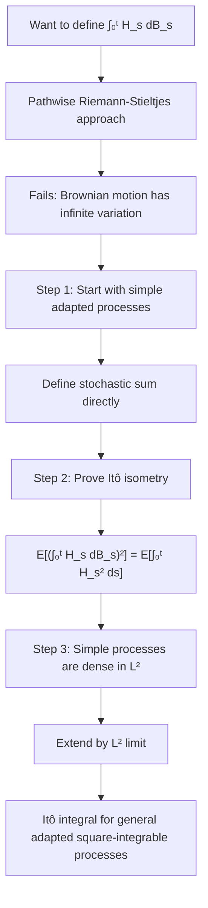
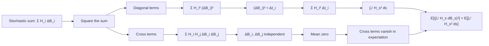

# Construction of the Itô Integral

## Concept Definition

The Itô integral

$$
\int_0^t H_s \, dB_s
$$

defines a stochastic integral with respect to Brownian motion. Unlike classical Riemann-Stieltjes integration, the pathwise construction fails because Brownian motion has infinite variation. Instead, we define first on **simple adapted processes**, then extend by continuity using the **Itô isometry**.

The construction exploits a special property of Brownian motion: although its total variation is infinite, its **quadratic variation** is finite. Because Brownian increments satisfy

$$
(\Delta B)^2 \approx \Delta t
$$

squaring stochastic sums converts random fluctuations into deterministic time increments. This allows us to control the integral in the mean-square sense, leading to the Itô isometry

$$
\mathbb{E}\!\left[\left(\int_0^t H_s \, dB_s\right)^2\right]
= \mathbb{E}\!\left[\int_0^t H_s^2 \, ds\right]
$$

The construction therefore proceeds in two steps:

1. Define the integral for **simple adapted processes**, where stochastic sums are well defined.
2. Extend the definition to general processes using this $L^2$ identity (the Itô isometry).

---

## Motivation: Why Riemann-Stieltjes fails

Classical integration \(\int_0^t f(s) \, dg(s)\) for deterministic functions requires that \(g\) has **bounded variation** on \([0,t]\). Specifically, if

$$
\text{Var}_{[0,t]}(g) := \sup_{\pi} \sum_{i=0}^{n-1} |g(t_{i+1}) - g(t_i)| < \infty
$$

over all partitions \(\pi: 0 = t_0 < t_1 < \cdots < t_n = t\), then the Riemann-Stieltjes integral is well-defined as:

$$
\int_0^t f(s) \, dg(s) = \lim_{|\pi| \to 0} \sum_{i=0}^{n-1} f(t_i^*)(g(t_{i+1}) - g(t_i))
$$

### 1. Brownian motion has unbounded variation

For Brownian motion \(B_t\), we can show that almost surely:

$$
\text{Var}_{[0,t]}(B) = \infty
$$

Brownian paths oscillate so rapidly that the accumulated absolute increments diverge on every interval.

**Proof sketch**: Consider a partition \(\pi_n\) with \(n\) equally-spaced points: \(t_i = it/n\). Write \(\Delta B_i = B_{t_{i+1}} - B_{t_i}\). Then:

$$
\sum_{i=0}^{n-1} |\Delta B_i|
$$

where the \(\Delta B_i\) are i.i.d. \(N(0, t/n)\) increments. Since \(\mathbb{E}[|\Delta B_i|] = \sqrt{2t/(\pi n)}\), the expected total variation grows like

$$
\sum_{i=0}^{n-1} \mathbb{E}[|\Delta B_i|]
= n \cdot \sqrt{\frac{2t}{\pi n}}
= \sqrt{\frac{2nt}{\pi}}
\to \infty
$$

**Conclusion**: Brownian paths have unbounded variation almost surely, so pathwise Riemann-Stieltjes integration is impossible.

However, Brownian motion has **quadratic variation** equal to \(t\), which suggests a different integration theory is possible.

---

## Strategy: \(L^2\)-approximation

The Itô integral is constructed via approximation in the **mean-square sense** rather than pathwise. The key steps are:

1. Define the integral for **simple processes** (piecewise constant, adapted integrands)
2. Show the integral satisfies the **Itô isometry** (an \(L^2\) bound)
3. Extend to general adapted processes in \(L^2\) by continuity

The integral is defined using **mean-square limits rather than pathwise limits**.

---

## Step 1: Simple processes

A **simple process** \(H_t\) has the form:

$$
H_t(\omega) = \sum_{i=0}^{n-1} H_i(\omega) \mathbf{1}_{(t_i, t_{i+1}]}(t)
$$

where:

- \(0 = t_0 < t_1 < \cdots < t_n = T\) is a partition of \([0,T]\)
- Each \(H_i\) is \(\mathcal{F}_{t_i}\)-measurable (adapted)
- \(\mathbb{E}[H_i^2] < \infty\) (square-integrable)

**Interpretation**: \(H_t\) is constant on each interval \((t_i, t_{i+1}]\) and its value on that interval depends only on information available at time \(t_i\). Simple processes correspond to **piecewise constant trading strategies**: the position is decided at time \(t_i\) and held fixed until the next rebalancing date \(t_{i+1}\).

### 1. Definition of the integral for simple processes

For a simple process \(H_t = \sum_{i=0}^{n-1} H_i \mathbf{1}_{(t_i, t_{i+1}]}\), we define:

$$
\boxed{
I_t(H) := \int_0^t H_s \, dB_s
= \sum_{i=0}^{n-1} H_i (B_{t_{i+1} \wedge t} - B_{t_i \wedge t})
}
$$

where \(a \wedge b := \min(a,b)\).

This is a **left-point stochastic Riemann sum** against Brownian increments. The Itô integral accumulates random gains obtained by multiplying the current exposure \(H_i\) by the next unpredictable fluctuation of Brownian motion. At each time step \(t_i\), the process chooses a value \(H_i\) based only on the information available up to that time. This value is then multiplied by the next Brownian increment \(\Delta B_i = B_{t_{i+1}} - B_{t_i}\). Each term \(H_i \Delta B_i\) represents the contribution of the random fluctuation during the interval \((t_i, t_{i+1}]\). Because the increments have mean zero and variance proportional to the time step, the accumulated result behaves like a martingale.

**Key properties**:

1. **Linearity**: \(I_t(\alpha H + \beta K) = \alpha I_t(H) + \beta I_t(K)\)
2. **Martingale property**: \(\{I_t(H)\}_{t \ge 0}\) is a martingale
3. **Mean zero**: \(\mathbb{E}[I_t(H)] = 0\)

### 2. Verification: Martingale property

We verify that \(I_t(H)\) is a martingale. For \(s < t\):

$$
\mathbb{E}[I_t(H) \mid \mathcal{F}_s]
= \mathbb{E}\left[\sum_{i=0}^{n-1} H_i (B_{t_{i+1} \wedge t} - B_{t_i \wedge t}) \,\Big|\, \mathcal{F}_s\right]
$$

The key fact is that Brownian increments after time \(s\) are independent of \(\mathcal{F}_s\) and have mean zero. Consider a term \(H_i(B_{t_{i+1} \wedge t} - B_{t_i \wedge t})\):

- If \(t_{i+1} \le s\): The term is \(\mathcal{F}_s\)-measurable and contributes to \(I_s(H)\).
- If \(s \le t_i\): The entire increment lies after time \(s\), so \(\mathbb{E}[H_i(B_{t_{i+1}} - B_{t_i}) \mid \mathcal{F}_s] = 0\) by independence and mean zero.

For the boundary case \(t_i < s < t_{i+1}\), the increment splits into a past part \(B_s - B_{t_i}\) (which is \(\mathcal{F}_s\)-measurable) and a future part \(B_{t_{i+1} \wedge t} - B_s\) (which has conditional expectation zero). The calculation shows:

$$
\mathbb{E}[I_t(H) \mid \mathcal{F}_s] = I_s(H)
$$

Thus, \(I_t(H)\) is a martingale with respect to the natural filtration.

---

## Step 2: The Itô isometry

The key result that enables extension to general processes is the **Itô isometry**. This identity shows that the stochastic integral behaves like an **isometry between two \(L^2\) spaces**.

### 1. Theorem (Itô Isometry for Simple Processes)

Let \(H_t\) be a simple process. Then:

$$
\boxed{
\mathbb{E}\left[\left(\int_0^t H_s \, dB_s\right)^2\right]
= \mathbb{E}\left[\int_0^t H_s^2 \, ds\right]
}
$$

**Proof**: Write \(H_t = \sum_{i=0}^{n-1} H_i \mathbf{1}_{(t_i, t_{i+1}]}\). Then:

$$
\left(\int_0^t H_s \, dB_s\right)^2
= \left(\sum_{i=0}^{n-1} H_i (B_{t_{i+1} \wedge t} - B_{t_i \wedge t})\right)^2
$$

Expanding the square:

$$
= \sum_{i=0}^{n-1} H_i^2 (B_{t_{i+1} \wedge t} - B_{t_i \wedge t})^2
+ 2 \sum_{i < j} H_i H_j (B_{t_{i+1} \wedge t} - B_{t_i \wedge t})(B_{t_{j+1} \wedge t} - B_{t_j \wedge t})
$$

Taking expectations:

**Term 1**: For each \(i\):

$$
\mathbb{E}[H_i^2 (B_{t_{i+1} \wedge t} - B_{t_i \wedge t})^2]
= \mathbb{E}[H_i^2] \cdot \mathbb{E}[(B_{t_{i+1} \wedge t} - B_{t_i \wedge t})^2]
= \mathbb{E}[H_i^2] \cdot ((t_{i+1} \wedge t) - (t_i \wedge t))
$$

by independence of \(H_i\) and the future increment.

**Term 2**: For \(i < j\), write:

$$
\mathbb{E}[H_i H_j (B_{t_{i+1}} - B_{t_i})(B_{t_{j+1}} - B_{t_j})]
$$

Conditioning on \(\mathcal{F}_{t_{j}}\):

$$
= \mathbb{E}\left[H_i H_j (B_{t_{i+1}} - B_{t_i}) \cdot \mathbb{E}[B_{t_{j+1}} - B_{t_j} \mid \mathcal{F}_{t_j}]\right]
= 0
$$

since \(B_{t_{j+1}} - B_{t_j}\) has zero mean and is independent of \(\mathcal{F}_{t_j}\).

**Combining**:

$$
\mathbb{E}\left[\left(\int_0^t H_s \, dB_s\right)^2\right]
= \sum_{i=0}^{n-1} \mathbb{E}[H_i^2] \cdot ((t_{i+1} \wedge t) - (t_i \wedge t))
= \mathbb{E}\left[\int_0^t H_s^2 \, ds\right]
$$

This completes the proof. \(\square\)

**Intuition from quadratic variation.** The Itô isometry is possible because Brownian motion has finite **quadratic variation** even though it has infinite total variation. Over a small interval of length \(\Delta t\), a Brownian increment satisfies

$$
\Delta B \sim \sqrt{\Delta t}
\qquad\text{so}\qquad
(\Delta B)^2 \sim \Delta t
$$

This means that when we square the stochastic sum \(\sum_i H_i \Delta B_i\), the diagonal terms behave like

$$
\sum_i H_i^2 (\Delta B_i)^2
\approx
\sum_i H_i^2 \Delta t
$$

which is exactly the deterministic time integral \(\int_0^t H_s^2 \, ds\). At the same time, the cross terms vanish in expectation because disjoint Brownian increments are independent and have mean zero. This is the probabilistic reason the Itô isometry holds, and it is the first clear sign that stochastic integration is governed by **quadratic variation rather than ordinary variation**.

Formally, Brownian motion satisfies

$$
\sum_i (B_{t_{i+1}} - B_{t_i})^2 \to t
$$

as the partition mesh tends to zero. This property is called the **quadratic variation** of Brownian motion.

---

## Step 3: Extension to \(L^2\)-adapted processes

We now extend the integral to the class of **adapted square-integrable processes**.

### 1. Definition: \(L^2\)-adapted processes

Let \(\mathcal{L}^2([0,T])\) denote the space of adapted processes \(H = \{H_t\}_{0 \le t \le T}\) satisfying:

$$
\mathbb{E}\left[\int_0^T H_t^2 \, dt\right] < \infty
$$

This is a Hilbert space with inner product:

$$
\langle H, K \rangle
:= \mathbb{E}\left[\int_0^T H_t K_t \, dt\right]
$$

### 2. Extension theorem

**Theorem**: The Itô integral can be uniquely extended from simple processes to all processes in \(\mathcal{L}^2([0,T])\), preserving linearity and the Itô isometry.

**Proof (Sketch)**:

1. **Dense subset**: Simple processes are dense in \(\mathcal{L}^2([0,T])\). For any \(H \in \mathcal{L}^2([0,T])\), there exists a sequence of simple processes \(H^{(n)}\) such that:

$$
\mathbb{E}\left[\int_0^T (H_t - H_t^{(n)})^2 \, dt\right] \to 0
$$

2. **Cauchy sequence**: By the Itô isometry:

$$
\mathbb{E}\left[\left(\int_0^T H_s^{(n)} dB_s - \int_0^T H_s^{(m)} dB_s\right)^2\right]
= \mathbb{E}\left[\int_0^T (H_s^{(n)} - H_s^{(m)})^2 ds\right]
\to 0
$$

Thus, \(\{\int_0^T H_s^{(n)} dB_s\}\) is Cauchy in \(L^2(\Omega)\).

3. **Define the limit**: Since \(L^2(\Omega)\) is complete, define:

$$
\int_0^T H_s \, dB_s := L^2\text{-}\lim_{n \to \infty} \int_0^T H_s^{(n)} dB_s
$$

4. **Well-defined**: The limit is independent of the choice of approximating sequence \(H^{(n)}\).

5. **Itô isometry holds**: By continuity:

$$
\mathbb{E}\left[\left(\int_0^T H_s dB_s\right)^2\right]
= \lim_{n \to \infty} \mathbb{E}\left[\left(\int_0^T H_s^{(n)} dB_s\right)^2\right]
= \lim_{n \to \infty} \mathbb{E}\left[\int_0^T (H_s^{(n)})^2 ds\right]
= \mathbb{E}\left[\int_0^T H_s^2 ds\right]
$$

This completes the construction. \(\square\)

---

## The Itô integral as a process

For \(H \in \mathcal{L}^2([0,T])\), the **Itô integral process** is defined as:

$$
I_t := \int_0^t H_s \, dB_s, \quad 0 \le t \le T
$$

**Key properties** (to be established in the next section):

1. \(I_t\) is a continuous, adapted process
2. \(I_t\) is a martingale
3. \(I_t\) has quadratic variation \([I, I]_t = \int_0^t H_s^2 ds\)

---

??? note "Advanced: Extension to local integrands"

    The construction above requires \(\mathbb{E}[\int_0^T H_t^2 \, dt] < \infty\). For many applications (e.g., stochastic differential equations), we need to integrate processes that may not satisfy this global square-integrability condition.

    A process \(H\) is **locally square-integrable** if there exists a sequence of stopping times \(\tau_n \uparrow \infty\) such that:

    $$
    \mathbb{E}\left[\int_0^{\tau_n \wedge T} H_s^2 \, ds\right] < \infty
    \quad \text{for all } n
    $$

    For such processes, we define:

    $$
    \int_0^t H_s \, dB_s
    := \lim_{n \to \infty} \int_0^{t \wedge \tau_n} H_s \, dB_s
    $$

    The resulting process is a **local martingale** rather than a martingale.

??? note "Advanced: Predictable processes"

    In advanced treatments, the Itô integral is often constructed for **predictable processes** rather than adapted processes. A process is predictable if it is measurable with respect to the \(\sigma\)-algebra generated by left-continuous adapted processes.

    **Key advantage**: Predictability ensures that the integrand \(H_s\) "knows" the value of \(B_s\) only through past information, avoiding subtle measurability issues.

    For continuous adapted processes (which are progressively measurable), the distinction between adapted and predictable is often minimal, and the simpler adapted framework suffices.

---

## Summary

The construction of the Itô integral proceeds in three steps:

1. **Simple processes**: Define \(\int_0^t H_s dB_s\) directly for piecewise constant adapted integrands
2. **Itô isometry**: Establish the \(L^2\)-bound that enables extension
3. **Completion**: Extend to all \(L^2\)-adapted processes via density and continuity

The resulting integral is **not defined pathwise**; it is defined as a limit in \(L^2(\Omega)\) rather than pointwise in \(\omega\). This reflects the fundamental difference between stochastic and classical integration.

**Key takeaways**:

- Brownian motion has unbounded variation, so Riemann-Stieltjes integration fails
- The Itô integral is constructed via \(L^2\)-approximation, exploiting martingale structure
- The **Itô isometry** is the central technical tool:

$$
\mathbb{E}\left[\left(\int_0^t H_s dB_s\right)^2\right]
= \mathbb{E}\left[\int_0^t H_s^2 ds\right]
$$

- Extension to local integrands yields **local martingales**

In the next section, we explore the fundamental properties of the Itô integral: linearity, martingale structure, continuity, and quadratic variation.
