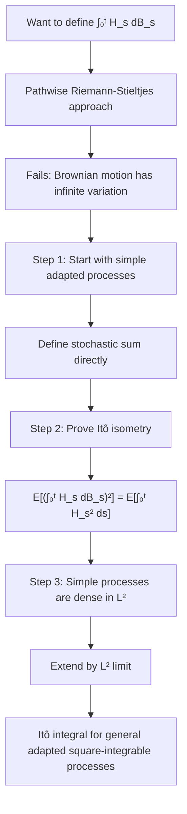
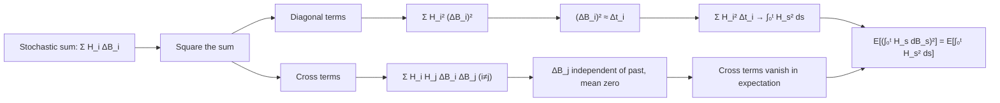

# Construction of the Itô Integral

### 1. Concept Definition

The Itô integral

$$
\int_0^t H_s \, dB_s
$$

defines a stochastic integral with respect to Brownian motion. Unlike classical Riemann-Stieltjes integration, the pathwise construction fails because Brownian motion has infinite variation almost surely. Instead, the integral is defined first on **simple adapted processes**, then extended by continuity using the **Itô isometry**.

The construction exploits a special property of Brownian motion: although its total variation is infinite, its **quadratic variation** is finite. Because Brownian increments satisfy $(\Delta B)^2 \approx \Delta t$, squaring stochastic sums converts random fluctuations into deterministic time increments. This allows us to control the integral in the mean-square sense, leading to the Itô isometry

$$
\mathbb{E}\!\left[\left(\int_0^t H_s \, dB_s\right)^2\right]
= \mathbb{E}\!\left[\int_0^t H_s^2 \, ds\right]
$$

The construction proceeds in three steps:

1. Define the integral for **simple adapted processes**, where stochastic sums are well defined.
2. Establish the **Itô isometry**, which controls the integral in the $L^2$ sense.
3. Extend to general $L^2$-adapted processes by density and continuity.

---

### 2. Why Riemann-Stieltjes Fails

Classical integration $\int_0^t f(s)\, dg(s)$ for deterministic functions requires $g$ to have **bounded variation** on $[0,t]$:

$$
\operatorname{Var}_{[0,t]}(g) := \sup_{\pi} \sum_{i=0}^{n-1} |g(t_{i+1}) - g(t_i)| < \infty
$$

For Brownian motion $B_t$, this condition fails almost surely.

**Proof that Brownian motion has unbounded variation.** Consider a uniform partition with $n$ points: $t_i = it/n$ and increments $\Delta B_i = B_{t_{i+1}} - B_{t_i} \sim \mathcal{N}(0, t/n)$. Since $\mathbb{E}[|\Delta B_i|] = \sqrt{2t/(\pi n)}$, the expected total variation satisfies

$$
\sum_{i=0}^{n-1} \mathbb{E}[|\Delta B_i|]
= n \cdot \sqrt{\frac{2t}{\pi n}}
= \sqrt{\frac{2nt}{\pi}}
\to \infty \quad \text{as } n \to \infty
$$

Since the expected total variation diverges, Brownian paths have unbounded variation almost surely. Pathwise Riemann-Stieltjes integration is therefore impossible.

!!! note
    The expected total variation diverging implies almost sure divergence via the following argument: if $\operatorname{Var}(B) < \infty$ a.s., then by the monotone convergence theorem the expectation would be finite—a contradiction.

However, Brownian motion has **quadratic variation** equal to $t$, which suggests a different integration theory is possible.

---

### 3. Strategy: $L^2$-Approximation

The Itô integral is constructed via approximation in the **mean-square sense** rather than pathwise. The key steps are:

1. Define the integral for **simple processes** (piecewise constant, adapted integrands).
2. Show the integral satisfies the **Itô isometry** (an $L^2$ bound).
3. Extend to general adapted processes in $L^2$ by density and continuity.

---

### 4. Step 1: Simple Processes

A **simple process** $H_t$ has the form:

$$
H_t(\omega) = \sum_{i=0}^{n-1} H_i(\omega) \,\mathbf{1}_{(t_i, t_{i+1}]}(t)
$$

where:

* $0 = t_0 < t_1 < \cdots < t_n = T$ is a partition of $[0,T]$
* Each $H_i$ is $\mathcal{F}_{t_i}$-measurable (adapted)
* $\mathbb{E}[H_i^2] < \infty$ (square-integrable)

Simple processes correspond to **piecewise constant trading strategies**: the position is decided at time $t_i$ using only information available up to $t_i$, and held fixed until the next rebalancing date $t_{i+1}$.

#### Definition for simple processes

For a simple process $H_t = \sum_{i=0}^{n-1} H_i \mathbf{1}_{(t_i, t_{i+1}]}$, define:

$$
\boxed{
I_t(H) := \int_0^t H_s \, dB_s
= \sum_{i=0}^{n-1} H_i (B_{t_{i+1} \wedge t} - B_{t_i \wedge t})
}
$$

where $a \wedge b := \min(a,b)$.

This is a **left-point stochastic Riemann sum**. At each time step $t_i$, the process chooses a value $H_i$ based only on past information, then multiplies by the next Brownian increment $\Delta B_i = B_{t_{i+1}} - B_{t_i}$. Each term $H_i \Delta B_i$ represents the contribution of the random fluctuation during $(t_i, t_{i+1}]$.

**Key properties** (verified directly from the definition):

1. **Linearity**: $I_t(\alpha H + \beta K) = \alpha I_t(H) + \beta I_t(K)$
2. **Martingale property**: $\{I_t(H)\}_{t \ge 0}$ is a martingale
3. **Mean zero**: $\mathbb{E}[I_t(H)] = 0$

#### Martingale property for simple processes

We verify $\mathbb{E}[I_t(H) \mid \mathcal{F}_s] = I_s(H)$ for $s < t$. Consider a term $H_i(B_{t_{i+1} \wedge t} - B_{t_i \wedge t})$:

* If $t_{i+1} \le s$: the term is $\mathcal{F}_s$-measurable and contributes to $I_s(H)$.
* If $s \le t_i$: the increment lies entirely after time $s$, so $\mathbb{E}[H_i(B_{t_{i+1}} - B_{t_i}) \mid \mathcal{F}_s] = 0$ by independence and mean zero.
* Boundary case $t_i < s < t_{i+1}$: the increment splits into a past part $B_s - B_{t_i}$ (which is $\mathcal{F}_s$-measurable) and a future part $B_{t_{i+1} \wedge t} - B_s$ (whose conditional expectation is zero).

Combining these cases gives $\mathbb{E}[I_t(H) \mid \mathcal{F}_s] = I_s(H)$. $\square$

---

### 5. Step 2: The Itô Isometry

**Theorem (Itô Isometry for Simple Processes).** Let $H_t$ be a simple process. Then:

$$
\boxed{
\mathbb{E}\left[\left(\int_0^t H_s \, dB_s\right)^2\right]
= \mathbb{E}\left[\int_0^t H_s^2 \, ds\right]
}
$$

**Proof.** Write $H_t = \sum_{i=0}^{n-1} H_i \mathbf{1}_{(t_i, t_{i+1}]}$. Expanding the square:

$$
\left(\int_0^t H_s \, dB_s\right)^2
= \sum_{i} H_i^2 (\Delta B_i)^2
+ 2 \sum_{i < j} H_i H_j \Delta B_i \Delta B_j
$$

**Cross terms vanish.** For $i < j$, condition on $\mathcal{F}_{t_j}$:

$$
\mathbb{E}[H_i H_j \Delta B_i \Delta B_j]
= \mathbb{E}\!\left[H_i H_j \Delta B_i \cdot \underbrace{\mathbb{E}[\Delta B_j \mid \mathcal{F}_{t_j}]}_{=\,0}\right] = 0
$$

since $\Delta B_j = B_{t_{j+1}} - B_{t_j}$ has mean zero and is independent of $\mathcal{F}_{t_j}$.

**Diagonal terms.** For each $i$, using independence of $H_i$ (which is $\mathcal{F}_{t_i}$-measurable) from the future increment:

$$
\mathbb{E}[H_i^2 (\Delta B_i)^2]
= \mathbb{E}[H_i^2] \cdot \mathbb{E}[(\Delta B_i)^2]
= \mathbb{E}[H_i^2] \cdot (t_{i+1} \wedge t - t_i \wedge t)
$$

Combining:

$$
\mathbb{E}\left[\left(\int_0^t H_s \, dB_s\right)^2\right]
= \sum_{i} \mathbb{E}[H_i^2] \cdot (t_{i+1} \wedge t - t_i \wedge t)
= \mathbb{E}\left[\int_0^t H_s^2 \, ds\right] \quad \square
$$

**Intuition from quadratic variation.** The isometry holds because $(\Delta B_i)^2 \approx \Delta t_i$ (quadratic variation), so diagonal terms behave like $\sum_i H_i^2 \Delta t_i \to \int H_s^2\,ds$, while cross terms vanish because disjoint Brownian increments are independent with mean zero.

---

### 6. Step 3: Extension to $L^2$-Adapted Processes

Let $\mathcal{L}^2([0,T])$ denote the space of adapted processes $H = \{H_t\}_{0 \le t \le T}$ satisfying:

$$
\mathbb{E}\left[\int_0^T H_t^2 \, dt\right] < \infty
$$

This is a Hilbert space with inner product $\langle H, K \rangle := \mathbb{E}[\int_0^T H_t K_t\, dt]$.

**Theorem.** The Itô integral extends uniquely from simple processes to all processes in $\mathcal{L}^2([0,T])$, preserving linearity and the Itô isometry.

**Proof sketch.**

1. **Density.** Simple processes are dense in $\mathcal{L}^2([0,T])$: for any $H \in \mathcal{L}^2([0,T])$, there exist simple processes $H^{(n)}$ with $\mathbb{E}[\int_0^T (H_t - H_t^{(n)})^2\, dt] \to 0$.

2. **Cauchy sequence.** By the Itô isometry:

$$
\mathbb{E}\!\left[\left(\int_0^T H_s^{(n)} dB_s - \int_0^T H_s^{(m)} dB_s\right)^2\right]
= \mathbb{E}\!\left[\int_0^T (H_s^{(n)} - H_s^{(m)})^2 ds\right] \to 0
$$

So $\{\int_0^T H_s^{(n)} dB_s\}$ is Cauchy in $L^2(\Omega)$.

3. **Define the limit.** Since $L^2(\Omega)$ is complete, define:

$$
\int_0^T H_s \, dB_s := L^2\text{-}\lim_{n \to \infty} \int_0^T H_s^{(n)} dB_s
$$

4. **Well-defined.** The limit is independent of the choice of approximating sequence. If $\tilde{H}^{(n)}$ is any other approximating sequence converging to $H$ in $\mathcal{L}^2$, then by the isometry $\|\int H^{(n)}\,dB - \int \tilde{H}^{(n)}\,dB\|_{L^2} = \|H^{(n)} - \tilde{H}^{(n)}\|_{\mathcal{L}^2} \to 0$, so both sequences have the same limit.

5. **Isometry preserved.** By continuity of the $L^2$ norm, the Itô isometry holds for the extended integral. $\square$

---

### 7. The Itô Integral as a Process

For $H \in \mathcal{L}^2([0,T])$, the **Itô integral process** is defined as:

$$
I_t := \int_0^t H_s \, dB_s, \quad 0 \le t \le T
$$

**Key properties** (established rigorously in the next section):

1. $I_t$ is a **continuous** adapted process
2. $I_t$ is a **martingale**
3. $I_t$ has quadratic variation $[I, I]_t = \int_0^t H_s^2\, ds$

The continuity follows from the Burkholder-Davis-Gundy inequality and Kolmogorov's continuity criterion applied to the $L^2$-approximating sequence.

---

### 8. Summary

The construction of the Itô integral proceeds in three steps:

1. **Simple processes**: define $\int_0^t H_s\,dB_s$ directly for piecewise constant adapted integrands.
2. **Itô isometry**: establish the $L^2$-bound $\mathbb{E}[(\int H\,dB)^2] = \mathbb{E}[\int H^2\,ds]$.
3. **Completion**: extend to all $L^2$-adapted processes via density and continuity.

The resulting integral is **not defined pathwise**—it is defined as a limit in $L^2(\Omega)$ rather than pointwise in $\omega$. This reflects the fundamental difference between stochastic and classical integration.

The Itô isometry is the central technical tool: it converts a stochastic problem (controlling the integral) into a deterministic problem (integrating $H_s^2$ over time), which is tractable because Brownian motion has finite quadratic variation.

??? note "Advanced: extension to local integrands"
    The construction above requires $\mathbb{E}[\int_0^T H_t^2\, dt] < \infty$. For many applications—including stochastic differential equations—we need to integrate processes that may not satisfy this global condition.

    A process $H$ is **locally square-integrable** if there exist stopping times $\tau_n \uparrow \infty$ such that $\mathbb{E}[\int_0^{\tau_n \wedge T} H_s^2\, ds] < \infty$ for all $n$. For such $H$, define:

    $$
    \int_0^t H_s \, dB_s := \lim_{n \to \infty} \int_0^{t \wedge \tau_n} H_s \, dB_s
    $$

    The resulting process is a **local martingale** rather than a true martingale.

??? note "Advanced: predictable processes"
    In advanced treatments, the Itô integral is often constructed for **predictable processes**—those measurable with respect to the $\sigma$-algebra generated by left-continuous adapted processes. Predictability ensures that $H_s$ uses only strictly past information, avoiding subtle measurability issues. For continuous adapted processes (which are progressively measurable), the distinction between adapted and predictable is minimal.

---

## Exercises

**Exercise 1.** Let $H_t = \mathbf{1}_{(a,b]}(t)$ for $0 \le a < b \le T$. This is a simple process with a single nonzero piece. Compute $\int_0^T H_s\, dB_s$ directly from the definition for simple processes and verify the Ito isometry for this integrand.

---

**Exercise 2.** Explain why the Riemann-Stieltjes integral $\int_0^T f(s)\, dB_s(\omega)$ cannot be defined pathwise for a continuous function $f$. In your answer, identify which property of Brownian motion causes the failure, and explain why finite variation of the integrator is essential for classical integration.

---

**Exercise 3.** Let $H_t^{(n)} = \sum_{k=0}^{n-1} B_{t_k}\, \mathbf{1}_{(t_k, t_{k+1}]}(t)$ be a simple process approximating $H_t = B_t$ on a uniform partition of $[0,1]$. Compute

$$
\mathbb{E}\!\left[\int_0^1 (B_t - H_t^{(n)})^2\, dt\right]
$$

and show that it tends to zero as $n \to \infty$, verifying that simple processes are dense in $\mathcal{L}^2([0,1])$ for this particular integrand.

---

**Exercise 4.** Using the Ito isometry for simple processes, show that if $H$ and $K$ are simple processes, then

$$
\mathbb{E}\!\left[\int_0^T H_s\, dB_s \cdot \int_0^T K_s\, dB_s\right] = \mathbb{E}\!\left[\int_0^T H_s K_s\, ds\right]
$$

*Hint*: Use the polarization identity $\langle X, Y \rangle = \frac{1}{4}(\|X+Y\|^2 - \|X-Y\|^2)$.

---

**Exercise 5.** Verify the martingale property of the Ito integral for the simple process $H_t = c \cdot \mathbf{1}_{(0, T/2]}(t)$, where $c$ is a constant. Specifically, show that for $s < T/2 < t$, $\mathbb{E}[I_t \mid \mathcal{F}_s] = I_s$.

---

**Exercise 6.** The construction extends the integral from simple processes to $\mathcal{L}^2([0,T])$ using completeness of $L^2(\Omega)$. Suppose $H^{(n)}$ and $\tilde{H}^{(n)}$ are two sequences of simple processes both converging to $H$ in $\mathcal{L}^2([0,T])$. Use the Ito isometry to prove that

$$
\int_0^T H_s^{(n)}\, dB_s \quad \text{and} \quad \int_0^T \tilde{H}_s^{(n)}\, dB_s
$$

converge to the same limit in $L^2(\Omega)$, so the extended integral is well defined.
