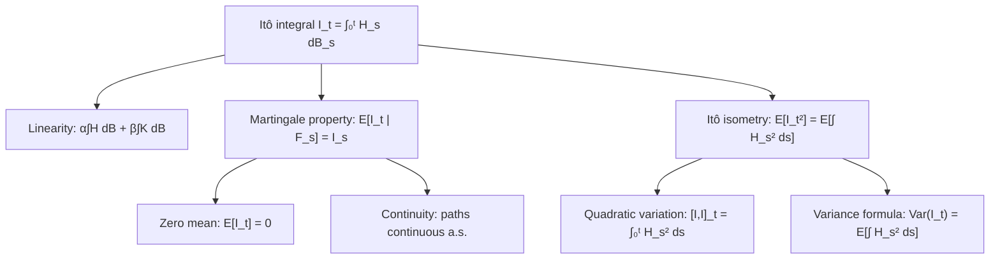

# Properties of the Itô Integral

### 1. Concept Definition

Having constructed the Itô integral $\int_0^t H_s\, dB_s$ for adapted square-integrable processes, we now establish its fundamental properties. These properties—**linearity**, **martingale structure**, **path continuity**, and **quadratic variation**—form the foundation for stochastic calculus and distinguish the Itô integral from classical integration.

The four core properties are summarized below. Let $I_t := \int_0^t H_s\, dB_s$ throughout.

| Property | Statement |
|---|---|
| Linearity | $\int (\alpha H + \beta K)\,dB = \alpha \int H\,dB + \beta \int K\,dB$ |
| Zero mean | $\mathbb{E}[I_t] = 0$ for all $t$ |
| Martingale | $\mathbb{E}[I_t \mid \mathcal{F}_s] = I_s$ for $s \le t$ |
| Itô isometry | $\mathbb{E}[I_t^2] = \mathbb{E}[\int_0^t H_s^2\,ds]$ |
| Continuity | $t \mapsto I_t$ has continuous sample paths a.s. |
| Quadratic variation | $[I,I]_t = \int_0^t H_s^2\,ds$ |

---

### 2. Explanation

#### Linearity

**Theorem.** Let $H, K \in \mathcal{L}^2([0,T])$ and $\alpha, \beta \in \mathbb{R}$. Then:

$$
\int_0^t (\alpha H_s + \beta K_s)\, dB_s
= \alpha \int_0^t H_s\, dB_s + \beta \int_0^t K_s\, dB_s
$$

**Proof.** Linearity holds by definition for simple processes. Since the integral extends by $L^2$-continuity and simple processes are dense, linearity passes to the limit. $\square$

---

#### Martingale property

**Theorem.** Let $H \in \mathcal{L}^2([0,T])$. Then $I_t = \int_0^t H_s\,dB_s$ is a **continuous square-integrable martingale** with respect to $\{\mathcal{F}_t\}$.

**Proof.** We verify the three conditions.

**Adaptedness.** $I_t$ is the $L^2$-limit of $\mathcal{F}_t$-measurable random variables, hence $\mathcal{F}_t$-measurable.

**Integrability.** By the Itô isometry:

$$
\mathbb{E}[I_t^2]
= \mathbb{E}\!\left[\int_0^t H_s^2\, ds\right]
\le \mathbb{E}\!\left[\int_0^T H_s^2\, ds\right]
< \infty
$$

So $\mathbb{E}[|I_t|] \le \sqrt{\mathbb{E}[I_t^2]} < \infty$.

**Martingale condition.** For simple processes, $\mathbb{E}[I_t \mid \mathcal{F}_s] = I_s$ was verified directly in the construction using the independence and mean-zero property of future Brownian increments. For general $H \in \mathcal{L}^2([0,T])$, approximate by simple processes $H^{(n)} \to H$. Since conditional expectation is $L^2$-continuous:

$$
\mathbb{E}[I_t \mid \mathcal{F}_s]
= \lim_{n \to \infty} \mathbb{E}[I_t^{(n)} \mid \mathcal{F}_s]
= \lim_{n \to \infty} I_s^{(n)}
= I_s \quad \square
$$

**Corollary (Zero mean).** $\mathbb{E}[I_t] = \mathbb{E}[I_0] = 0$ for all $t$.

---

#### Path continuity

**Theorem.** Let $H \in \mathcal{L}^2([0,T])$. Then $I_t = \int_0^t H_s\,dB_s$ has a **continuous modification**.

**Proof sketch.** The proof uses the **Burkholder-Davis-Gundy (BDG) inequality**, which bounds moments of a continuous martingale's supremum by its quadratic variation:

$$
\mathbb{E}\!\left[\sup_{u \le T} |I_u|^p\right] \le C_p\, \mathbb{E}\!\left[\left(\int_0^T H_s^2\,ds\right)^{p/2}\right]
$$

For $p = 4$, this gives

$$
\mathbb{E}[|I_t - I_s|^4]
\le C\,(t-s)^2\, \mathbb{E}\!\left[\sup_{u \le T} H_u^4\right]
$$

under appropriate regularity on $H$. By the **Kolmogorov continuity criterion**, since $\mathbb{E}[|I_t - I_s|^4] \le K|t-s|^{1+\varepsilon}$ for some $\varepsilon > 0$, $I_t$ has a continuous modification. $\square$

**Remark.** Continuity is a special feature of integration with respect to Brownian motion. Stochastic integrals with respect to Poisson processes or general semimartingales may have jumps.

---

#### Quadratic variation

**Theorem.** Let $H \in \mathcal{L}^2([0,T])$. Then the quadratic variation of $I_t = \int_0^t H_s\,dB_s$ is:

$$
\boxed{
[I, I]_t = \int_0^t H_s^2 \, ds
}
$$

**Proof (heuristic).** Consider a partition $\pi: 0 = t_0 < t_1 < \cdots < t_n = t$. Each increment is:

$$
I_{t_{i+1}} - I_{t_i} = \int_{t_i}^{t_{i+1}} H_s\, dB_s \approx H_{t_i}(B_{t_{i+1}} - B_{t_i})
$$

for small intervals where $H_s \approx H_{t_i}$. Therefore:

$$
\sum_{i} (I_{t_{i+1}} - I_{t_i})^2
\approx \sum_{i} H_{t_i}^2 (B_{t_{i+1}} - B_{t_i})^2
\to \int_0^t H_s^2\,ds
$$

where the last step uses the quadratic variation of Brownian motion: $\sum_i (\Delta B_i)^2 \to t$. The convergence holds in probability. $\square$

**Corollary.** The process $M_t := I_t^2 - \int_0^t H_s^2\,ds$ is a martingale. This follows from the Doob-Meyer decomposition: $I_t^2$ is a submartingale with compensator $\int_0^t H_s^2\,ds$.

---

#### Itô isometry (restated)

**Theorem (Itô Isometry).** For $H \in \mathcal{L}^2([0,T])$:

$$
\boxed{
\mathbb{E}\!\left[\left(\int_0^t H_s \, dB_s\right)^2\right]
= \mathbb{E}\!\left[\int_0^t H_s^2 \, ds\right]
}
$$

Since $\mathbb{E}[I_t] = 0$, the left side equals $\operatorname{Var}(I_t)$, so the isometry is a **variance formula**.

**Generalization (polarization).** For two processes $H, K \in \mathcal{L}^2([0,T])$:

$$
\mathbb{E}\!\left[\int_0^t H_s\, dB_s \cdot \int_0^t K_s\, dB_s\right]
= \mathbb{E}\!\left[\int_0^t H_s K_s\, ds\right]
$$

This follows by polarization: $\langle H, K \rangle_{L^2} = \tfrac{1}{4}(\|H+K\|^2 - \|H-K\|^2)$.

---

### 3. Diagram

The six properties form an interconnected structure. The martingale property and Itô isometry are the two central pillars from which the others follow.

---

### 4. Examples

#### Example 1: Constant integrand — $H_s = \sigma$

Let $\sigma > 0$ be a constant. Then $I_t = \sigma B_t$.

**Martingale**: $\mathbb{E}[\sigma B_t \mid \mathcal{F}_s] = \sigma B_s$. ✓

**Itô isometry**: $\mathbb{E}[(\sigma B_t)^2] = \sigma^2 t$ and $\mathbb{E}[\int_0^t \sigma^2\, ds] = \sigma^2 t$. ✓

**Quadratic variation**: $[I,I]_t = \sigma^2 t$. ✓

---

#### Example 2: Deterministic integrand — $H_s = s$

$$
I_t = \int_0^t s\, dB_s
$$

Since $H_s = s$ is deterministic, $I_t$ is Gaussian with mean zero and variance

$$
\operatorname{Var}(I_t) = \mathbb{E}\!\left[\int_0^t s^2\, ds\right] = \frac{t^3}{3}
$$

So $I_t \sim \mathcal{N}(0,\, t^3/3)$.

**Quadratic variation**: $[I,I]_t = \int_0^t s^2\, ds = t^3/3$. For this deterministic integrand the quadratic variation is the same deterministic value $t^3/3$ on every path.

---

#### Example 3: Random integrand — $H_s = B_s$

$$
I_t = \int_0^t B_s\, dB_s = \frac{B_t^2 - t}{2}
$$

(from Itô's formula applied to $f(x) = x^2/2$).

**Martingale**: $\frac{B_t^2 - t}{2}$ is indeed a martingale since $B_t^2 - t$ is the well-known martingale. ✓

**Itô isometry**: $\mathbb{E}[(B_t^2-t)^2/4] = \operatorname{Var}(B_t^2)/4 + (t^2 - 2t^2 + t^2)/4$. More directly:

$$
\mathbb{E}\!\left[\int_0^t B_s^2\, ds\right] = \int_0^t \mathbb{E}[B_s^2]\, ds = \int_0^t s\, ds = \frac{t^2}{2}
$$

And $\mathbb{E}[(B_t^2-t)^2/4] = t^2/2$. ✓

**Non-Gaussianity**: since $B_t^2 - t$ is a centered chi-squared random variable (scaled), $I_t = (B_t^2-t)/2$ is **not Gaussian**. Random integrands generally produce non-Gaussian integrals.

---

#### Example 4: Quadratic variation in action

Let $H_s = \sigma(s, B_s)$ for some function $\sigma$. Then the quadratic variation of the Itô process

$$
X_t = x + \int_0^t \mu_s\, ds + \int_0^t \sigma_s\, dB_s
$$

is $[X,X]_t = \int_0^t \sigma_s^2\, ds$. The drift term $\int_0^t \mu_s\, ds$ contributes zero quadratic variation (it has finite variation). This shows that **quadratic variation detects only the stochastic component** of an Itô process.

---

### 5. Summary

The Itô integral $I_t = \int_0^t H_s\,dB_s$ satisfies six fundamental properties:

1. **Linearity**: $\int (\alpha H + \beta K)\,dB = \alpha \int H\,dB + \beta \int K\,dB$
2. **Zero mean**: $\mathbb{E}[I_t] = 0$ for all $t$
3. **Martingale**: $\mathbb{E}[I_t \mid \mathcal{F}_s] = I_s$
4. **Itô isometry**: $\mathbb{E}[I_t^2] = \mathbb{E}[\int_0^t H_s^2\, ds]$
5. **Continuity**: $t \mapsto I_t$ has continuous sample paths a.s.
6. **Quadratic variation**: $[I,I]_t = \int_0^t H_s^2\,ds$

These properties reveal the deep connection between stochastic integration and martingale theory. They form the foundation for:

* **Itô's formula** — the stochastic chain rule
* **Stochastic differential equations**
* **Change of measure** (Girsanov's theorem)
* **Mathematical finance** — option pricing and hedging

In the next section, we introduce **Itô processes**, which combine ordinary and stochastic integration into the general class $dX_t = \mu_t\,dt + \sigma_t\,dB_t$.

??? note "Advanced: martingale representation theorem"
    Every square-integrable martingale $M_t$ adapted to the Brownian filtration $\mathcal{F}_t = \sigma(B_s: s \le t)$ can be represented as:

    $$
    M_t = M_0 + \int_0^t H_s\, dB_s
    $$

    for some adapted process $H \in \mathcal{L}^2([0,T])$. This result—the **martingale representation theorem**—says that in a Brownian filtration, all randomness comes from Brownian motion, and every martingale is a reweighting of Brownian increments via stochastic integration. It is fundamental in option pricing (every hedging strategy can be represented as a stochastic integral) and filtering theory.

??? note "Advanced: local martingales"
    For processes not globally in $\mathcal{L}^2$, the Itô integral is defined as a **local martingale**: there exist stopping times $\tau_n \uparrow \infty$ such that each stopped process $I_{t \wedge \tau_n}$ is a true martingale. Local martingales need not have constant expectation. For example, $\int_0^t e^{B_s}\,dB_s$ is a local martingale but its expectation is not zero in general, since $e^{B_s}$ is not globally square-integrable.
