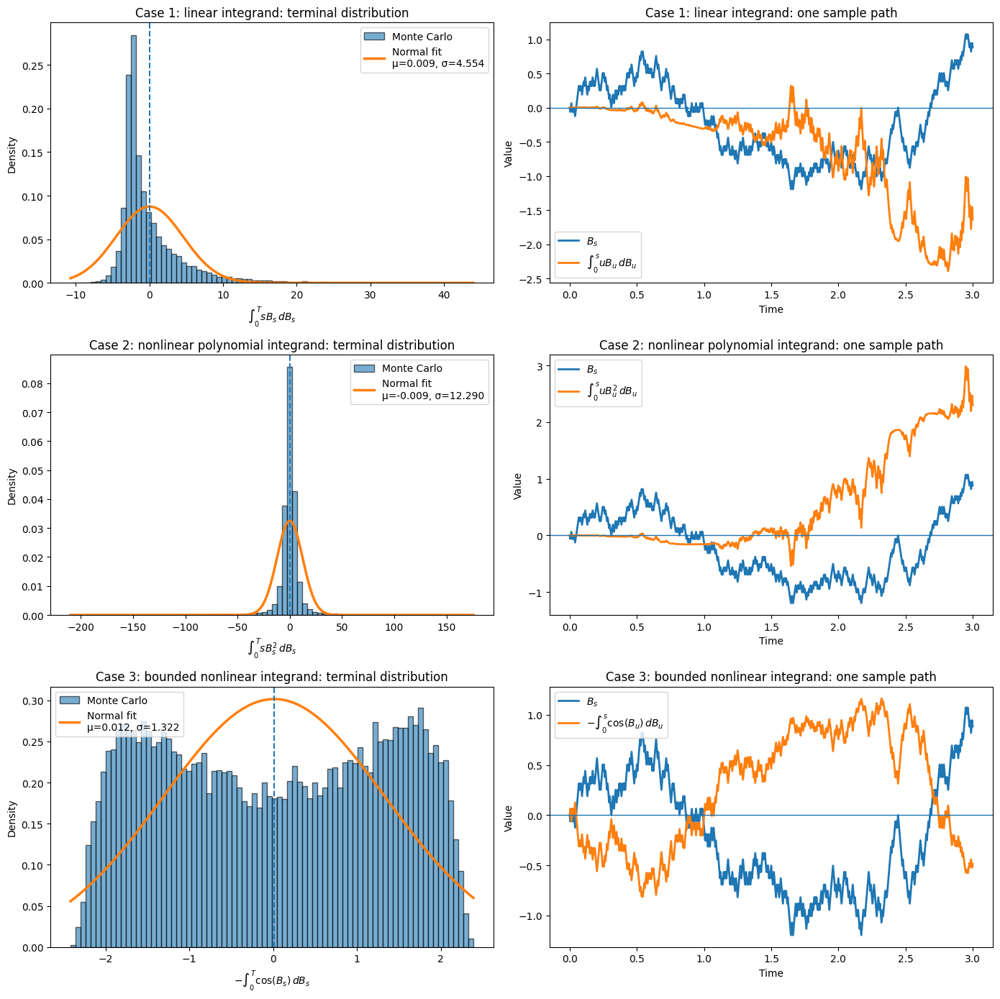

# Itô Integration: An Intuitive Introduction

## 1. Concept Definition

The **Itô integral** extends ordinary integration to the setting where the integrator is **Brownian motion** rather than time. Unlike a classical Riemann–Stieltjes integral, a pathwise construction fails because Brownian paths have unbounded variation almost surely. For a process $H_t$ that depends only on information available up to time $t$ and satisfies the square-integrability condition

$$
\mathbb{E}\!\left[\int_0^T H_t^2\,dt\right] < \infty,
$$

we define

$$
\int_0^T H_t\,dB_t
$$

as the $L^2$-limit of left-endpoint sums

$$
\int_0^T H_t\,dB_t
:= \lim_{|\Pi|\to 0} \sum_{k=0}^{n-1} H_{t_k}\bigl(B_{t_{k+1}}-B_{t_k}\bigr),
$$

where $\Pi = \{0=t_0<t_1<\cdots<t_n=T\}$ is a partition of $[0,T]$, and $|\Pi|$ is its mesh size.

The **left endpoint** matters: at time $t_k$, the value $H_{t_k}$ is allowed to use only present and past information. This is the adaptedness condition, and it reflects the idea that one cannot choose a trading position using future price moves. (Strictly speaking, the standard technical framework requires the integrand to be *predictable* or *progressively measurable*; adaptedness captures the main intuition.) Formally, the available information is represented by the **filtration** $\mathcal{F}_t = \sigma(B_s : 0 \le s \le t)$, and an adapted process $H_t$ is one for which $H_t$ is $\mathcal{F}_t$-measurable.

### Why a new integral is needed

For ordinary calculus, we integrate against time:

$$
\int_0^T f(t)\,dt
$$

In stochastic calculus, we want to integrate against Brownian motion:

$$
\int_0^T H_t\,dB_t
$$

This is not just a notational change. Brownian motion is almost surely nowhere differentiable and has infinite variation on every interval, so the quantity $dB_t/dt$ does not exist in the classical sense. A new construction is required.

A key property of Brownian motion is its **quadratic variation**. If we divide the interval $[0,t]$ into many small steps and sum the squared increments, then

$$
\sum_k (B_{t_{k+1}}-B_{t_k})^2 \to t
$$

in probability as the partition becomes finer (in fact, the convergence holds almost surely). Unlike ordinary calculus, these second-order terms do **not vanish**. This phenomenon is responsible for the extra correction terms that appear in stochastic calculus and ultimately leads to Itô's formula.


Because Brownian increments satisfy $\Delta B \sim \sqrt{\Delta t}$, their squares are of order $\Delta t$, so summing them produces a non-vanishing limit.

---

## 2. Intuition and Financial Interpretation

A useful mental model is a simplified trading problem.

* $B_t$: a stylized price fluctuation process
* $H_t$: the number of shares held at time $t$
* $dB_t$: the random price change over a very short interval
* $H_t\,dB_t$: the incremental profit and loss
* $\int_0^T H_t\,dB_t$: the cumulative profit and loss

The key point is that **the position $H_t$ must be chosen before the next price increment occurs**. This is why the Itô integral uses left-endpoint evaluation.

### Ordinary accumulation versus stochastic accumulation

* In a Lebesgue or Riemann integral, accumulation is driven by deterministic time increments $dt$.
* In an Itô integral, accumulation is driven by random Brownian increments $dB_t$.

So the integral itself is a random variable, and as $t$ varies, it becomes a random process.


---

## 3. Discrete Approximation from Coin Flips

To build intuition, approximate Brownian motion by a scaled random walk. (This is a simple discrete model whose scaling limit is Brownian motion, a fact made precise by Donsker's theorem.)

Divide the interval $[0,1]$ into $n$ equal steps of size

$$
\Delta t = \frac{1}{n}
$$

At each step, let the increment be

$$
\Delta B_k = \pm \sqrt{\Delta t}
$$

with equal probability. This scaling is chosen so that variance accumulates correctly:

$$
\operatorname{Var}(B_t) = t
$$

If the integrand is $H_t$, then the discrete Itô sum is

$$
\sum_{k=0}^{n-1} H_{t_k}\,\Delta B_k
$$

This left-point evaluation is the discrete version of the Itô integral.

### A concrete path

Take $n=10$ and the coin flips

$$
H,\ H,\ T,\ H,\ T,\ T,\ H,\ H,\ H,\ T
$$

Identify heads with $+1$ and tails with $-1$. Then each Brownian increment is

$$
\Delta B_k = \pm \frac{1}{\sqrt{10}}
$$

The resulting path ends at

$$
B_1 = \frac{2}{\sqrt{10}}
$$

This single path will be used in the examples below.

---

## 4. Worked Examples

### Example 1: Integration of B against dB

$$
\int_0^1 B_s\,dB_s
$$

Here the integrand is the current Brownian level, evaluated at the left endpoint. The discrete approximation is

$$
\sum_{k=0}^{9} B_{t_k}\,\Delta B_k
$$

**Financial interpretation**: this is a "follow the price" strategy—you hold $B_s$ shares at time $s$, buying more when the price rises and selling when it falls. (Since $B_s$ can be negative, this includes short positions when the price is below its starting level.)

For the sample path above, the running values are:

| Interval | $B_{t_k}$ | $\Delta B_k$ | Contribution to Itô sum |
| -------- | ------------: | -------------: | ------------------: |
| $[0.0,\,0.1]$ |             0 |  $1/\sqrt{10}$ |                   0 |
| $[0.1,\,0.2]$ | $1/\sqrt{10}$ |  $1/\sqrt{10}$ |              $1/10$ |
| $[0.2,\,0.3]$ | $2/\sqrt{10}$ | $-1/\sqrt{10}$ |             $-2/10$ |
| $[0.3,\,0.4]$ | $1/\sqrt{10}$ |  $1/\sqrt{10}$ |              $1/10$ |
| $[0.4,\,0.5]$ | $2/\sqrt{10}$ | $-1/\sqrt{10}$ |             $-2/10$ |
| $[0.5,\,0.6]$ | $1/\sqrt{10}$ | $-1/\sqrt{10}$ |             $-1/10$ |
| $[0.6,\,0.7]$ |             0 |  $1/\sqrt{10}$ |                   0 |
| $[0.7,\,0.8]$ | $1/\sqrt{10}$ |  $1/\sqrt{10}$ |              $1/10$ |
| $[0.8,\,0.9]$ | $2/\sqrt{10}$ |  $1/\sqrt{10}$ |              $2/10$ |
| $[0.9,\,1.0]$ | $3/\sqrt{10}$ | $-1/\sqrt{10}$ |             $-3/10$ |

So the discrete Itô sum is

$$
\int_0^1 B_s\,dB_s \approx -\frac{3}{10} = -0.3
$$

This matches the exact identity from Itô's formula,

$$
\int_0^1 B_s\,dB_s = \frac{B_1^2-1}{2}
$$

Since $B_1 = 2/\sqrt{10}$,

$$
\frac{B_1^2-1}{2} = \frac{4/10 - 1}{2} = -0.3
$$

This example already shows a characteristic feature of stochastic calculus: the answer is not $B_1^2/2$, but $(B_1^2-1)/2$. The key algebraic reason is the identity

$$
B_{t_{k+1}}^2 - B_{t_k}^2 = 2B_{t_k}\,\Delta B_k + (\Delta B_k)^2
$$

Summing both sides telescopes the left side to $B_1^2 - B_0^2$, and the sum of $(\Delta B_k)^2$ converges to $t$ (quadratic variation). This is the discrete origin of the extra $-t/2$ correction in Itô's formula.

### Example 2: Integration of s against dB

$$
\int_0^1 s\,dB_s
$$

Now the integrand is deterministic: $H_s=s$. The discrete approximation is

$$
\sum_{k=0}^{9} t_k\,\Delta B_k
$$

**Financial interpretation**: this models a strategy where you gradually increase your stock position over time—holding $s$ shares at time $s$, regardless of the current price. At time $s=0.3$ you hold 0.3 shares; at $s=0.9$ you hold 0.9 shares.

For the same path:

| Interval | $t_k$ | $\Delta B_k$ | Contribution to Itô sum |
| -------- | -----: | -------------: | ----------------: |
| $[0.0,\,0.1]$ |      0 |  $1/\sqrt{10}$ |                 0 |
| $[0.1,\,0.2]$ |  $1/10$ |  $1/\sqrt{10}$ |    $1/10^{3/2}$ |
| $[0.2,\,0.3]$ |  $2/10$ | $-1/\sqrt{10}$ |   $-2/10^{3/2}$ |
| $[0.3,\,0.4]$ |  $3/10$ |  $1/\sqrt{10}$ |    $3/10^{3/2}$ |
| $[0.4,\,0.5]$ |  $4/10$ | $-1/\sqrt{10}$ |   $-4/10^{3/2}$ |
| $[0.5,\,0.6]$ |  $5/10$ | $-1/\sqrt{10}$ |   $-5/10^{3/2}$ |
| $[0.6,\,0.7]$ |  $6/10$ |  $1/\sqrt{10}$ |    $6/10^{3/2}$ |
| $[0.7,\,0.8]$ |  $7/10$ |  $1/\sqrt{10}$ |    $7/10^{3/2}$ |
| $[0.8,\,0.9]$ |  $8/10$ |  $1/\sqrt{10}$ |    $8/10^{3/2}$ |
| $[0.9,\,1.0]$ |  $9/10$ | $-1/\sqrt{10}$ |   $-9/10^{3/2}$ |

So the discrete Itô sum is

$$
\int_0^1 s\,dB_s \approx \frac{5}{10^{3/2}} \approx 0.158
$$

This is a good contrast with the ordinary integral

$$
\int_0^1 s\,ds = \frac{1}{2},
$$

which is deterministic. The Itô integral remains random even when the integrand is deterministic, because the randomness comes from $dB_s$.

### Example 3: Integration of sB against dB

$$
\int_0^1 sB_s\,dB_s
$$

Now the integrand depends on both time and the Brownian path: $H_s=sB_s$.

**Financial interpretation**: this is a momentum strategy that scales with time—you hold more shares when the price is high *and* as time progresses. At time $s=0.8$ with $B_s = 2/\sqrt{10}$, you hold $0.8 \times 2/\sqrt{10} \approx 0.51$ shares.

The discrete approximation is

$$
\sum_{k=0}^{9} t_k B_{t_k}\,\Delta B_k
$$

For the same path:

| Interval | $t_k B_{t_k}$ | $\Delta B_k$ | Contribution to Itô sum |
| -------- | ----------------: | -------------: | -------------------------: |
| $[0.0,\,0.1]$ |                 0 |  $1/\sqrt{10}$ |                          0 |
| $[0.1,\,0.2]$ |    $1/10^{3/2}$ |  $1/\sqrt{10}$ |                    $1/100$ |
| $[0.2,\,0.3]$ |    $4/10^{3/2}$ | $-1/\sqrt{10}$ |                   $-4/100$ |
| $[0.3,\,0.4]$ |    $3/10^{3/2}$ |  $1/\sqrt{10}$ |                    $3/100$ |
| $[0.4,\,0.5]$ |    $8/10^{3/2}$ | $-1/\sqrt{10}$ |                   $-8/100$ |
| $[0.5,\,0.6]$ |    $5/10^{3/2}$ | $-1/\sqrt{10}$ |                   $-5/100$ |
| $[0.6,\,0.7]$ |               0 |  $1/\sqrt{10}$ |                          0 |
| $[0.7,\,0.8]$ |    $7/10^{3/2}$ |  $1/\sqrt{10}$ |                    $7/100$ |
| $[0.8,\,0.9]$ |   $16/10^{3/2}$ |  $1/\sqrt{10}$ |                   $16/100$ |
| $[0.9,\,1.0]$ |   $27/10^{3/2}$ | $-1/\sqrt{10}$ |                  $-27/100$ |

So the discrete Itô sum is

$$
\int_0^1 sB_s\,dB_s \approx -\frac{17}{100} = -0.17
$$

This is a typical Itô integral: the value depends strongly on the realized path.

Note the contrast between the three examples. In Example 1, the discrete sum matches the exact identity $(B_1^2-1)/2$ because of a special algebraic relationship from Itô's formula. In Examples 2 and 3, the displayed numbers are pathwise approximations along one chosen sample path; different coin flip sequences would yield different values.

---

## 5. Main Properties

The following properties all follow from the $L^2$ construction of the integral.

### 5.1 Zero mean and the martingale property

If $H_t$ is adapted and square-integrable, then

$$
\mathbb{E}\left[\int_0^T H_t\,dB_t\right]=0
$$

Intuitively, once $H_t$ is chosen using current and past information, the next Brownian increment has conditional mean zero. So there is no predictable gain.

More strongly, the process

$$
M_t := \int_0^t H_s\,dB_s
$$

is a martingale.

### 5.2 Itô isometry

A fundamental identity is

$$
\boxed{
\mathbb{E}\!\left[\left(\int_0^T H_t\,dB_t\right)^2\right]
= \mathbb{E}\!\left[\int_0^T H_t^2\,dt\right]
}
$$

Since the Itô integral has mean zero (martingale property), its second moment equals its variance. So the variance of the stochastic integral equals the expected value of the ordinary integral of $H_t^2$.

### 5.3 Gaussian versus non-Gaussian outcomes

If the integrand is deterministic, such as $H_t=s$, then

$$
\int_0^T H_t\,dB_t
$$

is Gaussian. The structural reason is that the integral is a **linear functional of Brownian motion**, which is a Gaussian process; linear transformations of Gaussian variables remain Gaussian. Combined with Itô isometry, this gives the explicit distribution:

$$
\int_0^T h(t)\,dB_t \sim \mathcal{N}\!\left(0,\;\int_0^T h(t)^2\,dt\right)
$$

If the integrand depends on Brownian motion itself, such as $H_t=tB_t$ or $H_t=tB_t^2$, the result typically **loses Gaussianity**—the distribution may exhibit skewness or heavy tails. (Special exceptions can occur, but non-Gaussianity is the generic outcome for random integrands.)

### 5.4 Continuity

Although Brownian motion is highly irregular, the Itô integral process

$$
t \mapsto \int_0^t H_s\,dB_s
$$

admits a continuous modification (that is, a version with continuous sample paths, unique up to indistinguishability).

### 5.5 Why left endpoints matter

The choice

$$
\sum H_{t_k}(B_{t_{k+1}}-B_{t_k})
$$

uses information available at the beginning of the interval. This is the Itô convention. If one instead uses midpoint sampling, one obtains the **Stratonovich integral**, denoted $\int f \circ dB_s$. For integrands of the form $f(B_s)$ (a function of the Brownian path alone), the two integrals differ by a correction term:

$$
\int_0^t f(B_s) \circ dB_s = \int_0^t f(B_s)\,dB_s + \frac{1}{2}\int_0^t f'(B_s)\,ds
$$

More generally, the Stratonovich–Itô conversion depends on the quadratic covariation structure of the integrand and integrator. The Stratonovich integral obeys the ordinary chain rule (no second-order correction), which is why it is preferred in physics.

---

## 6. Connection with Itô's Formula

The identity from Example 1 is a special case of Itô's formula. For $f(x)=x^2$,

$$
f(B_t)-f(B_0)
= \int_0^t f'(B_s)\,dB_s + \frac{1}{2} \int_0^t f''(B_s)\,ds
$$

Since $f'(x)=2x$ and $f''(x)=2$, this becomes

$$
B_t^2 = 2\int_0^t B_s\,dB_s + t,
$$

and therefore

$$
\boxed{
\int_0^t B_s\,dB_s = \frac{B_t^2 - t}{2}
}
$$

The extra $-t/2$ term is the hallmark of stochastic calculus. It comes from the quadratic variation of Brownian motion, discussed in the section on quadratic variation.

---

## 7. Monte Carlo Illustration (Optional)

The Itô integral can be approximated numerically using a discrete random-walk approximation to Brownian motion. We simulate increments

$$
\Delta B_k = \pm \sqrt{\Delta t}
$$

with equal probability and approximate the stochastic integral by the left-endpoint sum

$$
\sum_{k=0}^{N-1} H_{t_k}\bigl(B_{t_{k+1}}-B_{t_k}\bigr)
$$

The following script compares three Itô integrals with different integrands:

1. $\int_0^T sB_s\,dB_s$ — integrand linear in $B_s$
2. $\int_0^T sB_s^2\,dB_s$ — integrand nonlinear in $B_s$
3. $-\int_0^T \cos(B_s)\,dB_s$ — bounded nonlinear integrand

The first has an explicit variance from Itô isometry:

$$
\operatorname{Var}\!\left(\int_0^T sB_s\,dB_s\right)
= \int_0^T s^2\,\mathbb{E}[B_s^2]\,ds
= \int_0^T s^3\,ds
= \frac{T^4}{4}
$$

The second and third generally produce **non-Gaussian** terminal distributions, even though all three are martingale terminal values with zero mean.

```python
import numpy as np
import matplotlib.pyplot as plt
from scipy.stats import norm

# =========================================================
# Parameters
# =========================================================
T = 3.0
n_per_year = 252
N = int(T * n_per_year)
dt = T / N
sqrt_dt = np.sqrt(dt)

n_paths = 20000
seed = 42
rng = np.random.default_rng(seed)

t = np.linspace(0.0, T, N + 1)

# =========================================================
# Brownian motion from fair coins (Donsker approximation)
# =========================================================
coins = rng.choice([-1, 1], size=(n_paths, N))
dB = coins * sqrt_dt

B = np.zeros((n_paths, N + 1))
B[:, 1:] = np.cumsum(dB, axis=1)

# =========================================================
# Helper to build Itô integrals
# =========================================================
def ito_integral(integrand_values, dB):
    """
    Compute the cumulative Itô sum:
        I_n = sum_{k=0}^{n-1} H_{t_k} (B_{t_{k+1}} - B_{t_k})
    """
    dI = integrand_values * dB
    I = np.zeros((dI.shape[0], dI.shape[1] + 1))
    I[:, 1:] = np.cumsum(dI, axis=1)
    return I

# =========================================================
# Three integrands
# =========================================================
# 1) H_s = s B_s
H1 = t[:-1] * B[:, :-1]
I1 = ito_integral(H1, dB)
I1_T = I1[:, -1]

# 2) H_s = s B_s^2
H2 = t[:-1] * (B[:, :-1] ** 2)
I2 = ito_integral(H2, dB)
I2_T = I2[:, -1]

# 3) H_s = -cos(B_s)
H3 = -np.cos(B[:, :-1])
I3 = ito_integral(H3, dB)
I3_T = I3[:, -1]

# =========================================================
# Summary statistics
# =========================================================
def summarize(name, values, theoretical_sd=None):
    mu = values.mean()
    sigma = values.std(ddof=1)
    print("-" * 70)
    print(name)
    print(f"Mean         : {mu:.6f}")
    print(f"Std          : {sigma:.6f}")
    if theoretical_sd is not None:
        print(f"Theoretical sd: {theoretical_sd:.6f}")
    print(f"5% quantile  : {np.quantile(values, 0.05):.6f}")
    print(f"50% quantile : {np.quantile(values, 0.50):.6f}")
    print(f"95% quantile : {np.quantile(values, 0.95):.6f}")
    return mu, sigma

print(f"T = {T}")
print(f"N = {N}")
print(f"dt = {dt:.6f}")

mu1, sigma1 = summarize(
    "I_T = ∫_0^T s B_s dB_s",
    I1_T,
    theoretical_sd=T**2 / 2
)
mu2, sigma2 = summarize(
    "I_T = ∫_0^T s B_s^2 dB_s",
    I2_T
)
mu3, sigma3 = summarize(
    "I_T = -∫_0^T cos(B_s) dB_s",
    I3_T
)

# =========================================================
# Plot: 3x2 grid (histogram + sample path for each)
# =========================================================
fig, axes = plt.subplots(3, 2, figsize=(14, 14))

cases = [
    (
        I1_T, I1[0], mu1, sigma1,
        r"$\int_0^T s B_s\,dB_s$",
        r"$\int_0^s u B_u\,dB_u$",
        "Case 1: linear integrand"
    ),
    (
        I2_T, I2[0], mu2, sigma2,
        r"$\int_0^T s B_s^2\,dB_s$",
        r"$\int_0^s u B_u^2\,dB_u$",
        "Case 2: nonlinear polynomial integrand"
    ),
    (
        I3_T, I3[0], mu3, sigma3,
        r"$-\int_0^T \cos(B_s)\,dB_s$",
        r"$-\int_0^s \cos(B_u)\,dB_u$",
        "Case 3: bounded nonlinear integrand"
    ),
]

for row, (vals, I_sample, mu, sigma, xlabel, path_label, title_prefix) in enumerate(cases):
    # Histogram + fitted normal density
    ax = axes[row, 0]
    count, bins, _ = ax.hist(
        vals,
        bins=80,
        density=True,
        alpha=0.6,
        edgecolor="black",
        label="Monte Carlo"
    )
    x = np.linspace(bins.min(), bins.max(), 500)
    pdf = norm.pdf(x, mu, sigma)
    ax.plot(x, pdf, linewidth=2.5, label=f"Normal fit\nμ={mu:.3f}, σ={sigma:.3f}")
    ax.axvline(mu, linestyle="--", linewidth=1.5)
    ax.set_title(f"{title_prefix}: terminal distribution")
    ax.set_xlabel(xlabel)
    ax.set_ylabel("Density")
    ax.legend()

    # One sample Brownian path + running integral
    ax = axes[row, 1]
    ax.plot(t, B[0], linewidth=2, label=r"$B_s$")
    ax.plot(t, I_sample, linewidth=2, label=path_label)
    ax.axhline(0.0, linewidth=1)
    ax.set_title(f"{title_prefix}: one sample path")
    ax.set_xlabel("Time")
    ax.set_ylabel("Value")
    ax.legend()

plt.tight_layout()
plt.show()
```

Typical output (with `seed = 42`):

```text
T = 3.0
N = 756
dt = 0.003968
----------------------------------------------------------------------
I_T = ∫_0^T s B_s dB_s
Mean         : 0.0094
Std          : 4.5541
Theoretical sd: 4.5000
5% quantile  : -3.86
50% quantile : -1.63
95% quantile : 8.84
----------------------------------------------------------------------
I_T = ∫_0^T s B_s^2 dB_s
Mean         : -0.0094
Std          : 12.2903
5% quantile  : -11.97
50% quantile : 0.03
95% quantile : 11.68
----------------------------------------------------------------------
I_T = -∫_0^T cos(B_s) dB_s
Mean         : 0.0119
Std          : 1.3225
5% quantile  : -1.98
50% quantile : 0.03
95% quantile : 1.99
```

The first case agrees closely with the theoretical standard deviation ($T^2/2 = 4.5$), illustrating Itô isometry in action.



The simulations illustrate three important phenomena of stochastic integration:

- **Itô isometry accurately predicts variance**: in Case 1 ($H_s = sB_s$), the simulated standard deviation matches the theoretical value $T^2/2$, and the distribution may look fairly bell-shaped even though the integrand is random.
- **Nonlinear random integrands produce non-Gaussian distributions**: in Case 2, the nonlinear dependence on $B_s^2$ typically yields a visibly skewed distribution.
- **Bounded integrands produce concentrated distributions**: in Case 3, the integrand $-\cos(B_s)$ is bounded, so the spread is narrower.

This last example connects naturally with Itô's formula, since for $f(x)=\sin x$,

$$
d(\sin B_t) = \cos(B_t)\,dB_t - \tfrac{1}{2} \sin(B_t)\,dt
$$

So the stochastic integral is related to a transformed Brownian path together with a drift correction.

---

## 8. Summary

The Itô integral

$$
\int_0^T H_t\,dB_t
$$

is the basic building block of stochastic calculus.

* It is defined as a limit of left-endpoint sums.
* The integrand must be adapted and square-integrable.
* The integral has mean zero and defines a martingale.
* Its second moment is governed by Itô isometry: since the mean is zero, this equals the variance.
* Deterministic integrands give Gaussian integrals; random integrands typically produce non-Gaussian distributions.
* The left-endpoint convention is what distinguishes the Itô integral from the Stratonovich integral, which differs by a correction of $\frac{1}{2}\int f'\,ds$.
* Itô's formula reveals the extra correction terms created by Brownian quadratic variation.

The defining feature of stochastic calculus is that Brownian motion has **non-vanishing quadratic variation**, which forces second-order terms to survive in limits and produces the correction terms seen in Itô's formula.

**Why rigorous construction is needed**: The intuitive approach above works for simple integrands, but Brownian motion has infinite variation and is nowhere differentiable—so $dB_s$ cannot be interpreted as a classical differential. A rigorous $L^2$-approximation framework is needed to handle general integrands, prove the martingale property and Itô isometry we used informally, and derive Itô's formula.
