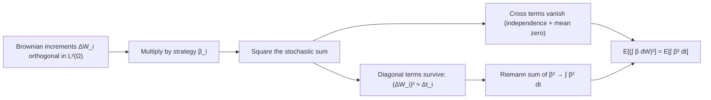

# Itô Isometry

### 1. Concept Definition

The **Itô isometry** is the fundamental identity that governs the second moment of stochastic integrals. Since the Itô integral has mean zero (martingale property), its second moment equals its variance. The identity states: for an adapted, square-integrable process $\beta(t)$,

$$
\boxed{
\mathbb{E}\left[ \left( \int_0^T \beta(t)\, dW_t \right)^2 \right]
= \mathbb{E}\left[ \int_0^T \beta^2(t)\, dt \right]
}
$$

**In words**: the $L^2$ norm of the stochastic integral equals the $L^2$ norm of the integrand in the space $\mathcal{L}^2([0,T])$.

This identity plays the same role for stochastic integrals that **Parseval's identity** plays for Fourier series: energy is preserved under the transform. Stochastic integration is an isometry between two Hilbert spaces:

$$
\mathcal{L}^2([0,T]) \;\longrightarrow\; L^2(\Omega)
$$

$$
\beta \;\longmapsto\; \int_0^T \beta(t)\,dW_t
$$

Distances in $\mathcal{L}^2([0,T])$ (measured by $\mathbb{E}[\int \beta^2\,dt]$) are preserved as distances in $L^2(\Omega)$ (measured by $\mathbb{E}[(\int \beta\,dW)^2]$). This Hilbert space structure is what makes the $L^2$-extension of the integral possible.

---

### 2. Explanation

#### Heuristic setup

Let $W_t$ be a standard Brownian motion and let $\beta(t)$ be a **simple adapted process**: $\beta(t) = \beta_i$ on $[t_i, t_{i+1})$. The Itô integral is approximated by

$$
\int_0^T \beta(t)\, dW_t \;\approx\; \sum_{i=0}^{n-1} \beta_i (W_{t_{i+1}} - W_{t_i})
$$

Each term $\beta_i \Delta W_i$ is the **gain from holding $\beta_i$ units of risk** over the interval $[t_i, t_{i+1}]$.

#### Squaring the sum

To understand the *size* of the integral, examine its second moment. Squaring:

$$
\left( \sum_{i=0}^{n-1} \beta_i \Delta W_i \right)^2
= \underbrace{\sum_{i=0}^{n-1} \beta_i^2 (\Delta W_i)^2}_{\text{diagonal terms}}
+ 2\underbrace{\sum_{i < j} \beta_i \beta_j \Delta W_i \Delta W_j}_{\text{cross terms}}
$$

#### Why cross terms vanish

Let $(\mathcal{F}_t)_{t \ge 0}$ be the natural filtration of $W_t$. Fix $i < j$. Then $\beta_j$ is $\mathcal{F}_{t_j}$-measurable, and $\Delta W_j$ is independent of $\mathcal{F}_{t_j}$ with $\mathbb{E}[\Delta W_j \mid \mathcal{F}_{t_j}] = 0$. Therefore:

$$
\mathbb{E}[\beta_i \beta_j \Delta W_i \Delta W_j]
= \mathbb{E}\!\left[\beta_i \Delta W_i \cdot \beta_j\, \underbrace{\mathbb{E}[\Delta W_j \mid \mathcal{F}_{t_j}]}_{=\, 0}\right] = 0
$$

**Intuition**: $\Delta W_j$ represents **future noise**, independent of everything known at time $t_j$. Conditioning kills the future noise. Brownian increments on disjoint intervals are **orthogonal random variables in $L^2(\Omega)$**.

#### Diagonal terms

We are left with:

$$
\mathbb{E}\!\left[\sum_{i} \beta_i^2 (\Delta W_i)^2\right]
= \sum_{i} \mathbb{E}[\beta_i^2]\, \mathbb{E}[(\Delta W_i)^2]
= \sum_{i} \mathbb{E}[\beta_i^2]\, (t_{i+1} - t_i)
$$

using independence of $\beta_i$ (adapted to $\mathcal{F}_{t_i}$) from the future increment $\Delta W_i$, and $\mathbb{E}[(\Delta W_i)^2] = t_{i+1} - t_i$. As the partition is refined, this Riemann sum converges to:

$$
\mathbb{E}\!\left[\int_0^T \beta^2(t)\, dt\right]
$$

completing the heuristic derivation.

#### Connection to the $L^2$ extension

The isometry is not just an interesting identity—it is the **mechanism of construction**. The rigorous extension of the Itô integral from simple processes to all $\mathcal{L}^2([0,T])$ proceeds by:

1. Defining the integral for simple processes and proving the isometry directly.
2. Using the isometry to show that approximating sequences of simple processes yield Cauchy sequences in $L^2(\Omega)$.
3. Defining the general integral as the $L^2(\Omega)$ limit.

Without the isometry, step 2 fails and the extension is impossible. The isometry is the **stochastic analogue of Parseval's identity**: energy in equals energy out.

---

### 3. Diagram



---

### 4. Examples

#### Example 1: Deterministic integrand $\beta(t) = t$

$$
I = \int_0^1 t\, dW_t
$$

Since $\beta$ is deterministic, the Itô isometry gives:

$$
\operatorname{Var}(I) = \mathbb{E}[I^2] = \int_0^1 t^2\, dt = \frac{1}{3}
$$

A deterministic integrand applied to a Gaussian process gives a Gaussian result, so:

$$
\int_0^1 t\, dW_t \sim \mathcal{N}\!\left(0,\; \frac{1}{3}\right)
$$

#### Example 2: Random integrand $\beta(t) = t W_t$

$$
\operatorname{Var}\!\left(\int_0^T t W_t\, dW_t\right)
= \mathbb{E}\!\left[\int_0^T t^2 W_t^2\, dt\right]
= \int_0^T t^2\, \mathbb{E}[W_t^2]\, dt
= \int_0^T t^3\, dt
= \frac{T^4}{4}
$$

The integral is not Gaussian since $\beta(t) = tW_t$ is a random integrand.

#### Example 3: Numerical verification

The following script verifies the Itô isometry by comparing both sides across three integrands.

```python
import numpy as np

T = 3.0
n_per_year = 252
N = int(T * n_per_year)
dt = T / N
sqrt_dt = np.sqrt(dt)

n_paths = 20000
seed = 42
rng = np.random.default_rng(seed)

t = np.linspace(0.0, T, N + 1)

# Brownian motion from fair coins (Donsker approximation)
coins = rng.choice([-1, 1], size=(n_paths, N))
dB = coins * sqrt_dt

B = np.zeros((n_paths, N + 1))
B[:, 1:] = np.cumsum(dB, axis=1)


def ito_integral(integrand_values, dB):
    """Cumulative left-endpoint Itô sum."""
    dI = integrand_values * dB
    I = np.zeros((dI.shape[0], dI.shape[1] + 1))
    I[:, 1:] = np.cumsum(dI, axis=1)
    return I


# Three integrands
H1 = t[:-1] * B[:, :-1]           # H_s = s B_s
H2 = t[:-1] * (B[:, :-1] ** 2)   # H_s = s B_s^2
H3 = -np.cos(B[:, :-1])           # H_s = -cos(B_s)

I1_T = ito_integral(H1, dB)[:, -1]
I2_T = ito_integral(H2, dB)[:, -1]
I3_T = ito_integral(H3, dB)[:, -1]


def check_ito_isometry(name, H, I_T, dt):
    lhs = np.mean(I_T ** 2)
    rhs = np.mean(np.sum(H ** 2 * dt, axis=1))
    rel_err = abs(lhs - rhs) / rhs if rhs != 0 else float("nan")
    print(f"{name}")
    print(f"  LHS E[(∫ H dB)²]  = {lhs:.6f}")
    print(f"  RHS E[∫ H² dt]    = {rhs:.6f}")
    print(f"  Relative error    = {rel_err:.4%}")


check_ito_isometry("H_s = s B_s      (theoretical RHS = T⁴/4 = 20.25)", H1, I1_T, dt)
check_ito_isometry("H_s = s B_s²", H2, I2_T, dt)
check_ito_isometry("H_s = -cos(B_s)", H3, I3_T, dt)
```

Typical output:

```text
H_s = s B_s      (theoretical RHS = T⁴/4 = 20.25)
  LHS E[(∫ H dB)²]  = 20.738498
  RHS E[∫ H² dt]    = 20.231128
  Relative error    = 2.51%
H_s = s B_s²
  LHS E[(∫ H dB)²]  = 151.042892
  RHS E[∫ H² dt]    = 145.266226
  Relative error    = 3.98%
H_s = -cos(B_s)
  LHS E[(∫ H dB)²]  = 1.749029
  RHS E[∫ H² dt]    = 1.744969
  Relative error    = 0.23%
```

Both sides agree closely in all three cases. The residual errors (~2–4% for the first two cases, <1% for the third) arise from two sources: discretization bias from the coin-flip approximation to Brownian motion, and Monte Carlo sampling error from using a finite number of paths. Both errors decrease as $N$ and `n_paths` increase.

For Case 1, the theoretical value is $\mathbb{E}[\int_0^T t^2 B_t^2\, dt] = \int_0^T t^3\, dt = T^4/4 = 20.25$, which the Monte Carlo estimates bracket from above and below, confirming the isometry.

---

### 5. Summary

* The Itô isometry converts the variance of a stochastic integral into an ordinary (Lebesgue) integral of the squared integrand.
* Cross terms vanish because Brownian increments on disjoint intervals are orthogonal random variables in $L^2(\Omega)$.
* The identity gives stochastic integration a **Hilbert space structure**: it is an isometry $\mathcal{L}^2([0,T]) \to L^2(\Omega)$.
* This structure enables the $L^2$-extension of the integral from simple processes to all adapted square-integrable processes.
* Nearly every structural result about Itô integrals—existence, uniqueness, continuity, the martingale property—traces back to this theorem.

---

## Exercises

**Exercise 1.** Compute the variance of the Ito integral $\int_0^2 (3t + 1)\, dW_t$ using the Ito isometry.

---

**Exercise 2.** Let $\beta(t) = e^{-\alpha t}$ for $\alpha > 0$. Compute

$$
\mathbb{E}\!\left[\left(\int_0^T e^{-\alpha t}\, dW_t\right)^2\right]
$$

and find the limit as $T \to \infty$.

---

**Exercise 3.** In the proof of the Ito isometry for simple processes, the cross terms $\mathbb{E}[\beta_i \beta_j \Delta W_i \Delta W_j] = 0$ for $i < j$. Explain why this argument relies on the left-endpoint evaluation. What would happen if we used right-endpoint evaluation instead?

---

**Exercise 4.** Let $\beta(t) = W_t^2$. Use the Ito isometry to compute

$$
\operatorname{Var}\!\left(\int_0^T W_t^2\, dW_t\right)
$$

*Hint*: You will need $\mathbb{E}[W_t^4] = 3t^2$.

---

**Exercise 5.** The Ito isometry extends to the polarized form: $\mathbb{E}[\int_0^T H\, dW \cdot \int_0^T K\, dW] = \mathbb{E}[\int_0^T HK\, dt]$. Use this to compute the covariance $\operatorname{Cov}(\int_0^1 t\, dW_t,\; \int_0^1 t^2\, dW_t)$.

---

**Exercise 6.** Consider two simple processes $H^{(n)}$ and $H^{(m)}$ that approximate the same integrand $H \in \mathcal{L}^2([0,T])$. Using the Ito isometry, show that

$$
\mathbb{E}\!\left[\left(\int_0^T H_s^{(n)}\, dW_s - \int_0^T H_s^{(m)}\, dW_s\right)^2\right] \to 0
$$

as $n, m \to \infty$. Explain why this makes the sequence of integrals a Cauchy sequence in $L^2(\Omega)$.

---

**Exercise 7.** The analogy between the Ito isometry and Parseval's identity states that stochastic integration preserves $L^2$ norms. In Fourier analysis, Parseval's identity says $\sum_n |c_n|^2 = \frac{1}{2\pi}\int |f|^2\, dx$. Write a brief comparison: what plays the role of the Fourier coefficients $c_n$ in the stochastic setting, and what plays the role of the $L^2$ norm of $f$?

---

## Solutions

??? success "Solution to Exercise 1"
    By the Ito isometry (the integrand $3t + 1$ is deterministic):

    $$
    \operatorname{Var}\!\left(\int_0^2 (3t + 1)\, dW_t\right) = \int_0^2 (3t + 1)^2\, dt
    $$

    Expanding:

    $$
    = \int_0^2 (9t^2 + 6t + 1)\, dt = \left[3t^3 + 3t^2 + t\right]_0^2 = 3(8) + 3(4) + 2 = 24 + 12 + 2 = 38
    $$

??? success "Solution to Exercise 2"
    By the Ito isometry (deterministic integrand):

    $$
    \mathbb{E}\!\left[\left(\int_0^T e^{-\alpha t}\, dW_t\right)^2\right] = \int_0^T e^{-2\alpha t}\, dt = \left[-\frac{1}{2\alpha}e^{-2\alpha t}\right]_0^T = \frac{1}{2\alpha}(1 - e^{-2\alpha T})
    $$

    As $T \to \infty$, since $\alpha > 0$, $e^{-2\alpha T} \to 0$:

    $$
    \lim_{T \to \infty} \frac{1}{2\alpha}(1 - e^{-2\alpha T}) = \frac{1}{2\alpha}
    $$

    The variance converges to a finite limit, reflecting the fact that the exponentially decaying integrand effectively "turns off" the accumulation of Brownian noise at large times.

??? success "Solution to Exercise 3"
    The argument that cross terms vanish uses the tower property of conditional expectation and the independence of future Brownian increments from past information. For $i < j$:

    $$
    \mathbb{E}[\beta_i \beta_j \Delta W_i \Delta W_j] = \mathbb{E}\!\left[\beta_i \beta_j \Delta W_i \cdot \mathbb{E}[\Delta W_j \mid \mathcal{F}_{t_j}]\right] = 0
    $$

    This works because $\beta_j$ is $\mathcal{F}_{t_j}$-measurable (known at the **left** endpoint $t_j$), and $\Delta W_j = W_{t_{j+1}} - W_{t_j}$ is independent of $\mathcal{F}_{t_j}$ with mean zero.

    **With right-endpoint evaluation**, the position $\beta_j$ would be $\mathcal{F}_{t_{j+1}}$-measurable. Then $\beta_j$ would depend on $\Delta W_j$ (since $\Delta W_j$ is part of the information available at $t_{j+1}$). The independence used to kill the cross terms no longer holds. In fact, even the diagonal terms change: $\mathbb{E}[\beta_j^2 (\Delta W_j)^2] \neq \mathbb{E}[\beta_j^2] \cdot \mathbb{E}[(\Delta W_j)^2]$ because $\beta_j$ and $\Delta W_j$ are no longer independent.

    Concretely, for $\beta_j = W_{t_{j+1}}$ and $\Delta W_j = W_{t_{j+1}} - W_{t_j}$: $\beta_j$ is correlated with $\Delta W_j$, and $\mathbb{E}[W_{t_{j+1}} \cdot \Delta W_j] = \mathbb{E}[(\Delta W_j)^2] = \Delta t_j \neq 0$. The entire isometry framework breaks down.

??? success "Solution to Exercise 4"
    By the Ito isometry with $\beta(t) = W_t^2$:

    $$
    \operatorname{Var}\!\left(\int_0^T W_t^2\, dW_t\right) = \mathbb{E}\!\left[\int_0^T W_t^4\, dt\right] = \int_0^T \mathbb{E}[W_t^4]\, dt
    $$

    Using $\mathbb{E}[W_t^4] = 3t^2$ (the fourth moment of $\mathcal{N}(0, t)$):

    $$
    = \int_0^T 3t^2\, dt = 3 \cdot \frac{T^3}{3} = T^3
    $$

??? success "Solution to Exercise 5"
    Since both integrands are deterministic, the polarized Ito isometry gives:

    $$
    \operatorname{Cov}\!\left(\int_0^1 t\, dW_t,\; \int_0^1 t^2\, dW_t\right) = \mathbb{E}\!\left[\int_0^1 t \cdot t^2\, dt\right] = \int_0^1 t^3\, dt = \frac{1}{4}
    $$

    (Since both integrals have mean zero, the covariance equals the expectation of their product.)

??? success "Solution to Exercise 6"
    By linearity of the Ito integral:

    $$
    \int_0^T H_s^{(n)}\, dW_s - \int_0^T H_s^{(m)}\, dW_s = \int_0^T (H_s^{(n)} - H_s^{(m)})\, dW_s
    $$

    By the Ito isometry:

    $$
    \mathbb{E}\!\left[\left(\int_0^T (H_s^{(n)} - H_s^{(m)})\, dW_s\right)^2\right] = \mathbb{E}\!\left[\int_0^T (H_s^{(n)} - H_s^{(m)})^2\, ds\right] = \|H^{(n)} - H^{(m)}\|_{\mathcal{L}^2}^2
    $$

    Since $H^{(n)} \to H$ and $H^{(m)} \to H$ in $\mathcal{L}^2$, the triangle inequality gives:

    $$
    \|H^{(n)} - H^{(m)}\|_{\mathcal{L}^2} \le \|H^{(n)} - H\|_{\mathcal{L}^2} + \|H - H^{(m)}\|_{\mathcal{L}^2} \to 0
    $$

    Therefore $\|H^{(n)} - H^{(m)}\|_{\mathcal{L}^2}^2 \to 0$, which means:

    $$
    \mathbb{E}\!\left[\left(\int_0^T H_s^{(n)}\, dW_s - \int_0^T H_s^{(m)}\, dW_s\right)^2\right] \to 0
    $$

    This shows $\{\int_0^T H_s^{(n)}\, dW_s\}$ is a Cauchy sequence in $L^2(\Omega)$. Since $L^2(\Omega)$ is a complete Hilbert space, the sequence converges to a unique limit, and this limit defines $\int_0^T H_s\, dW_s$.

??? success "Solution to Exercise 7"
    The analogy between the Ito isometry and Parseval's identity can be summarized as follows.

    In **Fourier analysis**, a function $f$ in $L^2$ is decomposed into orthogonal components $c_n e^{inx}$, and Parseval's identity states that the energy of the function equals the sum of energies of the components: $\sum_n |c_n|^2 = \frac{1}{2\pi}\int |f|^2\, dx$.

    In **stochastic integration**, the integrand $\beta(t)$ plays the role of $f$ — it lives in the "input" Hilbert space $\mathcal{L}^2([0,T])$ with norm $\|\beta\|^2 = \mathbb{E}[\int_0^T \beta^2(t)\, dt]$. The stochastic integral $\int_0^T \beta(t)\, dW_t$ plays the role of the "output" living in $L^2(\Omega)$ with norm $\mathbb{E}[(\int \beta\, dW)^2]$.

    The Brownian increments $\Delta W_k$ on disjoint intervals are orthogonal in $L^2(\Omega)$ (independent with mean zero), just as the Fourier basis functions $e^{inx}$ are orthogonal. The contributions $\beta_k \Delta W_k$ play the role of the Fourier coefficients $c_n$: they are the projections of the stochastic integral onto orthogonal "directions" in $L^2(\Omega)$.

    The Ito isometry $\mathbb{E}[(\int \beta\, dW)^2] = \mathbb{E}[\int \beta^2\, dt]$ states that the transform preserves energy, just as Parseval's identity does. In both cases, the identity holds because cross terms vanish due to orthogonality, and only diagonal terms survive.
