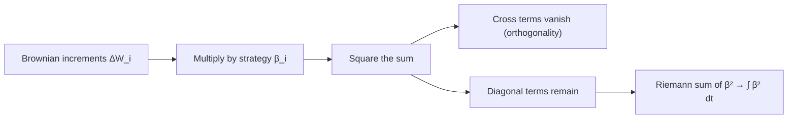

# Itô Isometry

## 1. Concept Definition

The **Itô isometry** is the fundamental identity that governs the second moment—and hence the variance, since the mean is zero—of stochastic integrals. It plays the same role for stochastic integrals that Parseval's identity plays for Fourier series. For an adapted, square-integrable process $\beta(t)$,

$$
\boxed{
\mathbb{E}\left[ \left( \int_0^T \beta(t)\, dW_t \right)^2 \right]
= \mathbb{E}\left[ \int_0^T \beta^2(t)\, dt \right]
}
$$

In words: the $L^2$ norm of the stochastic integral equals the $L^2$ norm of the integrand. Since the Itô integral has mean zero (martingale property), the left side is the **variance**. So the identity tells us that the variance of a stochastic integral is computed by an ordinary (Lebesgue) integral.

This identity also explains why deterministic integrands produce Gaussian stochastic integrals, because the stochastic integral is a linear functional of a Gaussian process and its variance is fully determined by $\int_0^T \beta^2(t)\,dt$.

---

## 2. Explanation

### Heuristic setup

Let $W_t$ be a standard Brownian motion and let $\beta(t)$ be a **simple adapted process**, representing (for intuition) a trading strategy: the number of shares held at each time.

Fix a partition

$$
0 = t_0 < t_1 < \dots < t_n = T,
$$

and assume $\beta(t) = \beta_i$ on $[t_i, t_{i+1})$. The Itô integral is then approximated by the stochastic sum

$$
\int_0^T \beta(t)\, dW_t \;\approx\; \sum_{i=0}^{n-1} \beta_i (W_{t_{i+1}} - W_{t_i})
$$

Each term $\beta_i (W_{t_{i+1}} - W_{t_i})$ can be interpreted as the **gain from holding $\beta_i$ units of risk** over the interval $[t_i, t_{i+1}]$, during which the Brownian motion moves by

$$
\Delta W_i := W_{t_{i+1}} - W_{t_i}
$$

### Squaring the sum

To understand the *size* of the Itô integral, we examine its second moment. Squaring the sum gives

$$
\left( \sum_{i=0}^{n-1} \beta_i \Delta W_i \right)^2
= \sum_{i=0}^{n-1} \beta_i^2 (\Delta W_i)^2
+ 2 \sum_{i < j} \beta_i \beta_j \Delta W_i \Delta W_j
$$

This expansion consists of:

- **Diagonal terms**, corresponding to variances
- **Cross terms**, corresponding to covariances

Taking expectations,

$$
\mathbb{E}\left[ \left( \int_0^T \beta(t)\, dW_t \right)^2 \right]
= \mathbb{E}\left[ \sum_{i=0}^{n-1} \beta_i^2 (\Delta W_i)^2 \right]
+ 2 \sum_{i<j} \mathbb{E}[\beta_i \beta_j \Delta W_i \Delta W_j]
$$

The key step is to understand **why the cross terms vanish**.

### Why the cross terms vanish

Let $(\mathcal{F}_t)_{t \ge 0}$ denote the natural filtration of the Brownian motion. Fix indices $i < j$. Then:

- $\beta_i$ and $\Delta W_i$ are $\mathcal{F}_{t_{i+1}}$-measurable
- $\beta_j$ is $\mathcal{F}_{t_j}$-measurable
- $\Delta W_j$ is **independent of $\mathcal{F}_{t_j}$** and satisfies

$$
\mathbb{E}[\Delta W_j \mid \mathcal{F}_{t_j}] = 0
$$

Using conditional expectation,

$$
\begin{aligned}
\mathbb{E}[\beta_i \beta_j \Delta W_i \Delta W_j]
&= \mathbb{E}\left[ \beta_i \Delta W_i \cdot \beta_j \Delta W_j \right] \\
&= \mathbb{E}\left[ \beta_i \Delta W_i \cdot
\mathbb{E}[ \beta_j \Delta W_j \mid \mathcal{F}_{t_j} ] \right]
\end{aligned}
$$

Since $\beta_j$ is $\mathcal{F}_{t_j}$-measurable,

$$
\mathbb{E}[ \beta_j \Delta W_j \mid \mathcal{F}_{t_j} ]
= \beta_j \, \mathbb{E}[ \Delta W_j \mid \mathcal{F}_{t_j} ] = 0
$$

Therefore,

$$
\mathbb{E}[\beta_i \beta_j \Delta W_i \Delta W_j] = 0
$$

**Intuition**: $\Delta W_j$ represents **future noise**, independent of everything known at time $t_j$. Conditional expectation *kills the future noise*. Brownian increments behave like **orthogonal random variables in $L^2(\Omega)$**.

### The remaining diagonal terms

We are left with

$$
\mathbb{E}\left[ \sum_{i=0}^{n-1} \beta_i^2 (\Delta W_i)^2 \right]
= \sum_{i=0}^{n-1} \mathbb{E}[\beta_i^2] \, \mathbb{E}[(\Delta W_i)^2]
$$

Since

$$
\Delta W_i \sim \mathcal{N}(0, t_{i+1} - t_i),
\quad
\mathbb{E}[(\Delta W_i)^2] = t_{i+1} - t_i,
$$

we obtain

$$
\sum_{i=0}^{n-1} \mathbb{E}[\beta_i^2] \, (t_{i+1} - t_i)
$$

As the partition is refined, this Riemann sum converges to

$$
\mathbb{E}\left[ \int_0^T \beta^2(t)\, dt \right]
$$

### From heuristics to a rigorous theory

To make the argument fully rigorous:

1. Define the Itô integral for **simple adapted processes**.
2. Prove the isometry directly for this class.
3. Extend the definition to general $L^2$-adapted processes by density and completion.

This equips stochastic integration with a **Hilbert space structure**, forming the foundation of modern stochastic calculus. The Itô isometry is the stochastic analogue of **Parseval's identity**: energy in equals energy out.

---

## 3. Diagram



---

## 4. Example

### Deterministic integrand

Consider the simplest non-trivial case: $\beta(t) = t$.

$$
\int_0^1 t\, dW_t
$$

Since $\beta$ is deterministic, the Itô isometry gives

$$
\operatorname{Var}\!\left(\int_0^1 t\, dW_t\right)
= \int_0^1 t^2\, dt
= \frac{1}{3}
$$

This integral is Gaussian (deterministic integrand applied to a Gaussian process), so

$$
\int_0^1 t\, dW_t \sim \mathcal{N}\!\left(0,\; \frac{1}{3}\right)
$$

### Random integrand

For $\beta(t) = t W_t$, the integrand is random and the Itô isometry gives

$$
\operatorname{Var}\!\left(\int_0^T t W_t\, dW_t\right)
= \mathbb{E}\!\left[\int_0^T t^2 W_t^2\, dt\right]
= \int_0^T t^2\, \mathbb{E}[W_t^2]\, dt
= \int_0^T t^3\, dt
= \frac{T^4}{4}
$$

### Numerical verification (Optional)

The following script verifies Itô isometry by comparing both sides of the identity across three integrands.

```python
import numpy as np

# =========================================================
# Parameters
# =========================================================
T = 3.0
n_per_year = 252
N = int(T * n_per_year)
dt = T / N
sqrt_dt = np.sqrt(dt)

n_paths = 20000
seed = 42
rng = np.random.default_rng(seed)

t = np.linspace(0.0, T, N + 1)

# =========================================================
# Brownian motion from fair coins (Donsker approximation)
# =========================================================
coins = rng.choice([-1, 1], size=(n_paths, N))
dB = coins * sqrt_dt

B = np.zeros((n_paths, N + 1))
B[:, 1:] = np.cumsum(dB, axis=1)

# =========================================================
# Helper to build Itô integrals
# =========================================================
def ito_integral(integrand_values, dB):
    """
    Compute the cumulative Itô sum:
        I_n = sum_{k=0}^{n-1} H_{t_k} (B_{t_{k+1}} - B_{t_k})
    """
    dI = integrand_values * dB
    I = np.zeros((dI.shape[0], dI.shape[1] + 1))
    I[:, 1:] = np.cumsum(dI, axis=1)
    return I

# =========================================================
# Three integrands
# =========================================================
# 1) H_s = s B_s
H1 = t[:-1] * B[:, :-1]
I1 = ito_integral(H1, dB)
I1_T = I1[:, -1]

# 2) H_s = s B_s^2
H2 = t[:-1] * (B[:, :-1] ** 2)
I2 = ito_integral(H2, dB)
I2_T = I2[:, -1]

# 3) H_s = -cos(B_s)
H3 = -np.cos(B[:, :-1])
I3 = ito_integral(H3, dB)
I3_T = I3[:, -1]

# =========================================================
# Numerical check of Itô isometry
# E[(∫ H dB)^2] = E[∫ H^2 dt]
# =========================================================
def check_ito_isometry(name, H, I_T, dt):
    lhs = np.mean(I_T**2)                  # Monte Carlo estimate of E[(∫ H dB)^2]
    rhs_paths = np.sum(H**2 * dt, axis=1)  # pathwise approximation of ∫ H^2 dt
    rhs = np.mean(rhs_paths)               # Monte Carlo estimate of E[∫ H^2 dt]
    abs_err = abs(lhs - rhs)
    rel_err = abs_err / rhs if rhs != 0 else np.nan

    print("-" * 70)
    print(f"Itô isometry check: {name}")
    print(f"E[(∫ H dB)^2]      ≈ {lhs:.6f}")
    print(f"E[∫ H^2 dt]        ≈ {rhs:.6f}")
    print(f"Absolute error     = {abs_err:.6f}")
    print(f"Relative error     = {rel_err:.4%}")

# Check all three cases
check_ito_isometry("H_s = s B_s", H1, I1_T, dt)
check_ito_isometry("H_s = s B_s^2", H2, I2_T, dt)
check_ito_isometry("H_s = -cos(B_s)", H3, I3_T, dt)

# Theoretical check for Case 1
print("-" * 70)
print("Theoretical check for H_s = s B_s")
print(f"Theoretical E[∫ H^2 dt] = T^4 / 4 = {T**4 / 4:.6f}")
print(f"Monte Carlo E[(∫ H dB)^2]        ≈ {np.mean(I1_T**2):.6f}")
```

Typical output (with `seed = 42`):

```text
----------------------------------------------------------------------
Itô isometry check: H_s = s B_s
E[(∫ H dB)^2]      ≈ 20.738498
E[∫ H^2 dt]        ≈ 20.231128
Absolute error     = 0.507369
Relative error     = 2.5079%
----------------------------------------------------------------------
Itô isometry check: H_s = s B_s^2
E[(∫ H dB)^2]      ≈ 151.042892
E[∫ H^2 dt]        ≈ 145.266226
Absolute error     = 5.776666
Relative error     = 3.9766%
----------------------------------------------------------------------
Itô isometry check: H_s = -cos(B_s)
E[(∫ H dB)^2]      ≈ 1.749029
E[∫ H^2 dt]        ≈ 1.744969
Absolute error     = 0.004061
Relative error     = 0.2327%
----------------------------------------------------------------------
Theoretical check for H_s = s B_s
Theoretical E[∫ H^2 dt] = T^4 / 4 = 20.250000
Monte Carlo E[(∫ H dB)^2]        ≈ 20.738498
```

In all three cases, the Monte Carlo estimates of $\mathbb{E}\!\left[\left(\int_0^T H_s\,dB_s\right)^2\right]$ and $\mathbb{E}\!\left[\int_0^T H_s^2\,ds\right]$ agree closely, illustrating Itô isometry. The errors decrease as the number of paths increases.

---

## 5. Summary

- The Itô isometry gives the variance of stochastic integrals via an ordinary integral.
- Cross terms vanish because Brownian increments are orthogonal random variables in $L^2(\Omega)$.
- Stochastic integration is an isometry between two Hilbert spaces, defining the $L^2$ geometry of stochastic calculus.
- Nearly all structural results about Itô integrals trace back to this theorem.
