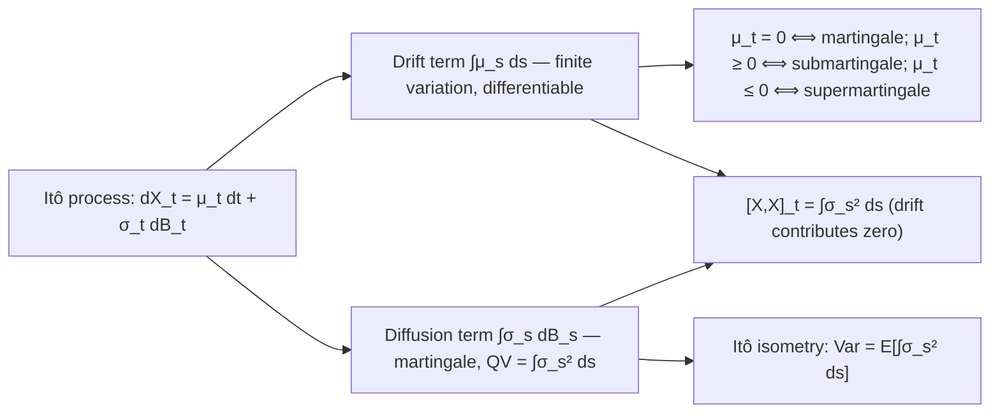

# Itô Processes

### 1. Concept Definition

An **Itô process** is a continuous adapted process $X_t$ that combines an ordinary (Lebesgue) integral and a stochastic (Itô) integral:

$$
\boxed{
X_t = X_0 + \int_0^t \mu_s \, ds + \int_0^t \sigma_s \, dB_s
}
$$

where:

* $X_0$ is an $\mathcal{F}_0$-measurable initial value
* $\mu_t$ is an adapted process with $\int_0^T |\mu_s|\, ds < \infty$ a.s. — the **drift coefficient**
* $\sigma_t$ is an adapted process with $\int_0^T \sigma_s^2\, ds < \infty$ a.s. — the **diffusion coefficient**
* $B_t$ is a standard Brownian motion

**Differential notation.** We write this compactly as:

$$
dX_t = \mu_t\, dt + \sigma_t\, dB_t
$$

with the understanding that this is shorthand for the integral form above. The symbol $dX_t$ is not a derivative—it is an infinitesimal increment. The equality $dX_t = \mu_t\,dt + \sigma_t\,dB_t$ means $X_t - X_s = \int_s^t \mu_u\,du + \int_s^t \sigma_u\,dB_u$ for all $s < t$.

**Structure.** An Itô process is a semimartingale: the sum of a finite-variation process (the drift integral) and a local martingale (the stochastic integral).

* The **drift term** $\int_0^t \mu_s\, ds$ represents deterministic, predictable evolution.
* The **diffusion term** $\int_0^t \sigma_s\, dB_s$ represents random fluctuations.

---

### 2. Explanation

#### Heuristic multiplication rules

The compact notation $dX_t = \mu_t\,dt + \sigma_t\,dB_t$ comes with algebraic rules that encode the quadratic variation structure of Brownian motion:

$$
dt \cdot dt = 0, \qquad dB_t \cdot dt = 0, \qquad dB_t \cdot dB_t = dt
$$

These rules capture the essence of stochastic calculus: deterministic infinitesimals are negligible compared to stochastic ones, and the quadratic variation of Brownian motion is of order $dt$. They are shorthand for rigorous statements about quadratic covariation.

#### Martingale characterization

An Itô process is a martingale if and only if its drift coefficient is zero.

**Theorem.** An Itô process $X_t = X_0 + \int_0^t \mu_s\,ds + \int_0^t \sigma_s\,dB_s$ is:

* a **martingale** if and only if $\mu_t = 0$ a.e.
* a **submartingale** if $\mu_t \ge 0$ a.e.
* a **supermartingale** if $\mu_t \le 0$ a.e.

**Proof.** For $s < t$:

$$
\mathbb{E}[X_t \mid \mathcal{F}_s]
= X_s + \mathbb{E}\!\left[\int_s^t \mu_u\, du \,\Big|\, \mathcal{F}_s\right] + \underbrace{\mathbb{E}\!\left[\int_s^t \sigma_u\, dB_u \,\Big|\, \mathcal{F}_s\right]}_{=\, 0}
$$

The martingale property $\mathbb{E}[X_t \mid \mathcal{F}_s] = X_s$ holds if and only if $\mathbb{E}[\int_s^t \mu_u\,du \mid \mathcal{F}_s] = 0$, which holds if and only if $\mu_t = 0$ a.e. $\square$

#### Quadratic variation

The quadratic variation of an Itô process is determined entirely by its diffusion coefficient.

**Theorem.** $[X,X]_t = \int_0^t \sigma_s^2\, ds$.

**Proof.** The drift integral $\int_0^t \mu_s\,ds$ has finite variation, so its quadratic variation is zero. The quadratic variation is then:

$$
[X,X]_t = \left[\int_0^\cdot \sigma_s\,dB_s,\, \int_0^\cdot \sigma_s\,dB_s\right]_t = \int_0^t \sigma_s^2\, ds
$$

where the last equality is the quadratic variation property of the Itô integral. $\square$

**Corollary.** The **instantaneous variance** (spot volatility squared) of $X_t$ at time $t$ is $\sigma_t^2\,dt$. The diffusion coefficient $|\sigma_t|$ is the instantaneous volatility.

#### Doob-Meyer decomposition

For a general Itô process, the **Doob-Meyer decomposition** is explicit:

$$
X_t = \underbrace{X_0 + \int_0^t \sigma_s\, dB_s}_{M_t \text{ (local martingale)}} + \underbrace{\int_0^t \mu_s\, ds}_{A_t \text{ (finite variation)}}
$$

where $M_t$ is a continuous local martingale and $A_t$ is a continuous process of finite variation. This decomposition is unique up to indistinguishability.

---

### 3. Diagram

---

### 4. Examples

#### Example 1: Brownian motion with drift

$$
dX_t = \mu\, dt + \sigma\, dB_t
\qquad X_0 = x
$$

Here $\mu$ and $\sigma$ are constants. The solution is:

$$
X_t = x + \mu t + \sigma B_t
$$

**Properties**: $\mathbb{E}[X_t] = x + \mu t$, $\operatorname{Var}(X_t) = \sigma^2 t$, and $X_t \sim \mathcal{N}(x + \mu t,\, \sigma^2 t)$.

**Quadratic variation**: $[X,X]_t = \sigma^2 t$.

Used in physics (particle with constant force), and as the local approximation for stock returns in the Black-Scholes model.

---

#### Example 2: Ornstein-Uhlenbeck process

$$
dX_t = -\theta X_t\, dt + \sigma\, dB_t
$$

where $\theta > 0$ (mean-reversion rate) and $\sigma > 0$ (volatility).

**Drift**: $\mu_t = -\theta X_t$ — mean-reverting toward zero. The drift is negative when $X_t > 0$ and positive when $X_t < 0$.

**Diffusion**: $\sigma_t = \sigma$ — constant.

**Not a martingale**: the drift $\mu_t = -\theta X_t$ is generally nonzero.

**Properties**: $X_t$ is Gaussian, and as $t \to \infty$, $X_t$ converges in distribution to $\mathcal{N}(0,\, \sigma^2/(2\theta))$. Used in physics (Langevin equation) and finance (interest rate and volatility models).

---

#### Example 3: Geometric Brownian motion (informal preview)

$$
dS_t = \mu S_t\, dt + \sigma S_t\, dB_t
$$

The coefficients $\mu_t = \mu S_t$ and $\sigma_t = \sigma S_t$ depend on the unknown process $S_t$ itself—this is a **stochastic differential equation** rather than an Itô process with given coefficients. Applying Itô's formula to $\log S_t$ shows the solution is:

$$
S_t = S_0 \exp\!\left(\left(\mu - \tfrac{\sigma^2}{2}\right)t + \sigma B_t\right)
$$

(The $-\sigma^2/2$ correction arises from the quadratic variation of $\sigma B_t$—a hallmark of Itô's formula.)

This process is the foundation of the Black-Scholes option pricing model.

---

#### Example 4: Representation via integration by parts

The process $X_t = \int_0^t B_s\, ds$ (integrated Brownian motion) is not directly an Itô process in the form above. However, using Itô's formula applied to the product $tB_t$:

$$
d(tB_t) = B_t\, dt + t\, dB_t
$$

Integrating: $tB_t = \int_0^t B_s\, ds + \int_0^t s\, dB_s$. Solving for the time integral:

$$
\int_0^t B_s\, ds = tB_t - \int_0^t s\, dB_s
$$

So $X_t$ is an Itô process with $dX_t = B_t\, dt + (-t)\, dB_t$, that is, $\mu_t = B_t$ and $\sigma_t = -t$.

**Quadratic variation**: $[X,X]_t = \int_0^t s^2\, ds = t^3/3$.

This example shows that the class of Itô processes is closed under integration by parts (which requires Itô's formula, studied in the next section).

---

### 5. Summary

Itô processes are the fundamental building blocks of stochastic calculus.

| Component | Role | Key property |
|---|---|---|
| $\mu_t$ (drift) | deterministic evolution | zero quadratic variation |
| $\sigma_t$ (diffusion) | random fluctuations | $[X,X]_t = \int \sigma_s^2\,ds$ |
| $B_t$ (Brownian motion) | source of randomness | $[B,B]_t = t$ |

**General form**: $X_t = X_0 + \int_0^t \mu_s\,ds + \int_0^t \sigma_s\,dB_s$

**Martingale condition**: $\mu_t = 0$ a.e.

**Quadratic variation**: determined entirely by $\sigma_t$; the drift contributes nothing.

The next section develops **Itô's lemma**—the chain rule of stochastic calculus—which computes $df(t, X_t)$ for $f \in C^{1,2}$. This is where the heuristic rule $dB_t \cdot dB_t = dt$ becomes manifest in explicit calculations, and is the principal tool for solving SDEs and deriving option pricing formulas.

??? note "Advanced: multidimensional Itô processes"
    An $n$-dimensional Itô process $\mathbf{X}_t = (X_t^1, \ldots, X_t^n)^\top$ driven by $m$ independent Brownian motions $B^1, \ldots, B^m$ satisfies:

    $$
    dX_t^i = \mu_t^i\, dt + \sum_{j=1}^m \sigma_t^{ij}\, dB_t^j
    $$

    In matrix notation: $d\mathbf{X}_t = \boldsymbol{\mu}_t\, dt + \boldsymbol{\Sigma}_t\, d\mathbf{B}_t$ where $\boldsymbol{\Sigma}_t$ is an $n \times m$ diffusion matrix.

    The quadratic covariation is $[X^i, X^j]_t = \sum_{k=1}^m \int_0^t \sigma_s^{ik}\sigma_s^{jk}\, ds$. In matrix form this is $\int_0^t (\boldsymbol{\Sigma}_s \boldsymbol{\Sigma}_s^\top)_{ij}\, ds$. The multidimensional Itô's lemma for $f \in C^{1,2}(\mathbb{R}_+ \times \mathbb{R}^n)$ involves both first and second partial derivatives:

    $$
    df(t, \mathbf{X}_t)
    = \frac{\partial f}{\partial t}\,dt
    + \sum_i \frac{\partial f}{\partial x_i}\,dX_t^i
    + \frac{1}{2}\sum_{i,j} \frac{\partial^2 f}{\partial x_i \partial x_j}\, d[X^i, X^j]_t
    $$
