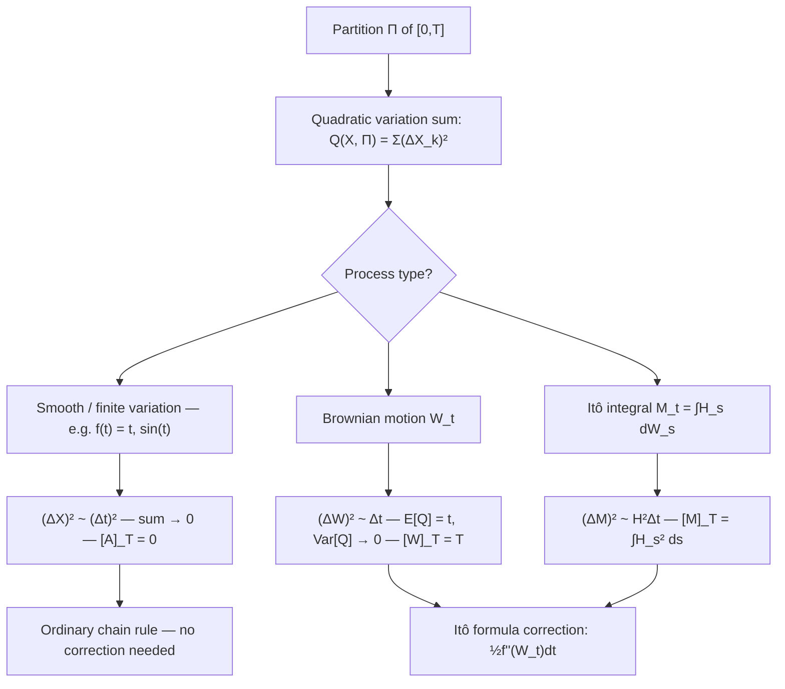

# Quadratic Variation

### 1. Concept Definition

**Quadratic variation** measures the cumulative size of squared increments of a stochastic process. For a partition $\Pi = \{0 = t_0 < t_1 < \cdots < t_n = T\}$ with mesh $\|\Pi\| = \max_k(t_k - t_{k-1})$, the **quadratic variation sum** of a process $X$ is

$$
Q(X, \Pi) := \sum_{k=1}^n (X_{t_k} - X_{t_{k-1}})^2
$$

If this sum converges as $\|\Pi\| \to 0$, the limit is the **quadratic variation** $[X]_T$. More precisely, the quadratic variation process $[X]_t$ is defined on $[0,t]$ for each $t \ge 0$.

Two facts are foundational:

$$
\boxed{[W]_t = t}
\qquad\text{for standard Brownian motion } W_t
$$

$$
\boxed{[A]_T = 0}
\qquad\text{for any process of finite (total) variation}
$$

These two facts have a single consequence: **Brownian motion is categorically different from any smooth or piecewise smooth path**. A differentiable function has zero quadratic variation; Brownian motion has quadratic variation equal to $t$. This distinction is the mechanism behind every correction term in stochastic calculus.

---

### 2. Explanation

#### Why quadratic variation matters

In ordinary calculus, when expanding $f(x + h) - f(x)$ by Taylor's theorem, the second-order term $f''(x)h^2/2$ is negligible because $h^2 \ll h$ as $h \to 0$. In stochastic calculus, the second-order term **survives** because Brownian increments satisfy $(\Delta W)^2 \approx \Delta t$ rather than $(\Delta W)^2 \ll \Delta t$.

This is why Itô's formula has an extra term compared to the ordinary chain rule:

$$
df(W_t) = f'(W_t)\,dW_t + \frac{1}{2}f''(W_t)\,dt
$$

The $\frac{1}{2}f''(W_t)\,dt$ term comes from summing $f''(W_{t_k})(\Delta W_k)^2 \approx f''(W_{t_k})\Delta t_k \to \int f''(W_t)\,dt$. This is exactly the quadratic variation.

#### Proof that $[W]_t = t$

We show $Q(W, \Pi) \to t$ in $L^2$ (and hence in probability) as $\|\Pi\| \to 0$.

Write $\Delta W_k = W_{t_k} - W_{t_{k-1}}$ and $\Delta t_k = t_k - t_{k-1}$. Since $\Delta W_k \sim \mathcal{N}(0, \Delta t_k)$ and the increments are independent:

$$
\mathbb{E}[Q(W, \Pi)]
= \sum_k \mathbb{E}[(\Delta W_k)^2]
= \sum_k \Delta t_k = t
$$

For the variance, use $\operatorname{Var}((\Delta W_k)^2) = 2(\Delta t_k)^2$ (fourth moment of a centred normal):

$$
\operatorname{Var}(Q(W, \Pi))
= \sum_k \operatorname{Var}((\Delta W_k)^2)
= 2\sum_k (\Delta t_k)^2
\le 2\|\Pi\| \sum_k \Delta t_k
= 2\|\Pi\|\, t \;\to\; 0
$$

Since $\mathbb{E}[Q(W,\Pi)] = t$ and $\operatorname{Var}(Q(W,\Pi)) \to 0$, we have $Q(W,\Pi) \to t$ in $L^2$. $\square$

#### Why smooth paths have zero quadratic variation

For a function $f: [0,T] \to \mathbb{R}$ with $|f'(t)| \le M$ for all $t$, each increment satisfies $|f(t_k) - f(t_{k-1})| \le M \Delta t_k$, so

$$
Q(f, \Pi) = \sum_k (f(t_k) - f(t_{k-1}))^2 \le M \sum_k |\Delta f_k| \cdot \Delta t_k \le M^2 \sum_k (\Delta t_k)^2 \le M^2 \|\Pi\| T \to 0
$$

More generally, any process of **bounded variation** has zero quadratic variation.

#### The Itô multiplication table

Quadratic variation is the rigorous content behind the heuristic rules used in stochastic calculus. For a multidimensional Brownian motion $W_t = (W_t^1, \ldots, W_t^m)$:

$$
\boxed{
(dt)^2 = 0, \qquad dt\, dW_t^\alpha = 0, \qquad dW_t^\alpha\, dW_t^\beta = \delta^{\alpha\beta}\, dt
}
$$

These rules arise from the covariation formula $[W^\alpha, W^\beta]_t = \delta^{\alpha\beta} t$.

**Derivation of $dW^\alpha\, dW^\beta = \delta^{\alpha\beta}\,dt$.** For $\alpha = \beta$: we have just shown $[W^\alpha]_t = t$, so $(dW^\alpha)^2 \to dt$. For $\alpha \ne \beta$: $W^\alpha$ and $W^\beta$ are independent Brownian motions with independent increments $\Delta W_k^\alpha$ and $\Delta W_k^\beta$, so

$$
\mathbb{E}\!\left[\sum_k \Delta W_k^\alpha \Delta W_k^\beta\right] = \sum_k \mathbb{E}[\Delta W_k^\alpha]\mathbb{E}[\Delta W_k^\beta] = 0
$$

and the variance of the sum also tends to zero, giving $[W^\alpha, W^\beta]_t = 0$.

#### Quadratic variation of Itô integrals

Let $M_t = \int_0^t H_s\, dW_s$ with $H$ square-integrable and adapted. Then $M$ is a continuous martingale and

$$
\boxed{[M]_t = \int_0^t H_s^2\, ds}
$$

More generally, for $M_t = \int_0^t H_s\, dW_s$ and $N_t = \int_0^t K_s\, dW_s$:

$$
\boxed{[M, N]_t = \int_0^t H_s K_s\, ds}
$$

This generalizes both formulas: setting $H_s = K_s = 1$ gives $[W,W]_t = t$.

---

### 3. Diagram



---

### 4. Examples

#### Example 1: Quadratic variation of $W_t$ — numerical verification

The following script simulates many Brownian paths and plots the quadratic variation sum against the theoretical value $t$.

```python
import numpy as np
import matplotlib.pyplot as plt

T = 1.0
N = 500
dt = T / N
n_paths = 2000
seed = 42
rng = np.random.default_rng(seed)

t = np.linspace(0, T, N + 1)

dW = rng.standard_normal((n_paths, N)) * np.sqrt(dt)
W = np.concatenate([np.zeros((n_paths, 1)), np.cumsum(dW, axis=1)], axis=1)

# Cumulative quadratic variation: [W]_t = Σ_{k: t_k ≤ t} (ΔW_k)²
qv = np.cumsum(dW ** 2, axis=1)
qv = np.concatenate([np.zeros((n_paths, 1)), qv], axis=1)

fig, axes = plt.subplots(1, 2, figsize=(13, 5))

# Left: several sample paths of cumulative QV versus t
ax = axes[0]
for i in range(10):
    ax.plot(t, qv[i], "b", alpha=0.4, linewidth=0.8)
ax.plot(t, t, "r--", linewidth=2, label=r"$[W]_t = t$ (theoretical)")
ax.plot(t, qv.mean(axis=0), "k", linewidth=2, label="Monte Carlo mean")
ax.set_title("Cumulative quadratic variation of $W_t$")
ax.set_xlabel("$t$")
ax.set_ylabel("$[W]_t$")
ax.legend()
ax.grid(True)

# Right: QV at T=1 — distribution across paths
ax = axes[1]
ax.hist(qv[:, -1], bins=60, density=True, alpha=0.7, edgecolor="black")
ax.axvline(1.0, color="r", linestyle="--", linewidth=2, label=r"$[W]_T = T = 1$")
ax.axvline(qv[:, -1].mean(), color="k", linestyle="-", linewidth=2,
           label=f"Monte Carlo mean = {qv[:, -1].mean():.4f}")
ax.set_title(r"Distribution of $[W]_1$ across paths")
ax.set_xlabel(r"$[W]_1$")
ax.set_ylabel("Density")
ax.legend()
ax.grid(True)

plt.tight_layout()
plt.savefig("./image/quadratic_variation_figure.png", dpi=150)
plt.show()

print(f"Monte Carlo mean of [W]_1  : {qv[:, -1].mean():.6f}")
print(f"Monte Carlo std of [W]_1   : {qv[:, -1].std():.6f}")
print(f"Theoretical value          : {T:.6f}")
print(f"Theoretical std (N={N})    : {np.sqrt(2 * dt * T):.6f}")
```


Each sample path of $[W]_t$ (blue) fluctuates around the deterministic line $t$ (red). The Monte Carlo mean (black) tracks $t$ closely. The right panel shows that $[W]_1$ concentrates tightly around $1$—consistent with $\operatorname{Var}([W]_T) = 2T \cdot \Delta t \to 0$ as $\Delta t \to 0$.

---

#### Example 2: Quadratic variation of the Ornstein-Uhlenbeck process

The OU process $dX_t = -\theta X_t\,dt + \sigma\,dB_t$ has $\sigma_t = \sigma$ (constant). Therefore:

$$
[X]_t = \int_0^t \sigma^2\, ds = \sigma^2 t
$$

The drift $-\theta X_t\,dt$ contributes nothing to the quadratic variation. This confirms that **quadratic variation detects only the diffusion coefficient**, regardless of the drift.

---

#### Example 3: Itô's formula from quadratic variation

Apply Itô's formula to $f(x) = x^2$ with $X_t = W_t$:

$$
W_t^2 = W_0^2 + \int_0^t 2W_s\,dW_s + \int_0^t 1\, d[W]_s
= 0 + 2\int_0^t W_s\,dW_s + t
$$

where $d[W]_s = ds$ since $[W]_s = s$.

Rearranging:

$$
\int_0^t W_s\, dW_s = \frac{W_t^2 - t}{2}
$$

The $-t/2$ correction is exactly the quadratic variation of $W$ on $[0,t]$. In ordinary calculus, $\int_0^t x\, dx = x^2/2$; in stochastic calculus, the answer is $W_t^2/2 - t/2$ because the quadratic variation term $\frac{1}{2} \cdot 2 \cdot [W]_t = t$ must be subtracted.

---

### 5. Summary

* The quadratic variation $[X]_t$ is the $L^2$ (and probability) limit of the sum of squared increments $\sum_k (\Delta X_k)^2$ as the partition mesh tends to zero.
* For Brownian motion, $[W]_t = t$, proved by computing that $\mathbb{E}[Q] = t$ and $\operatorname{Var}(Q) \to 0$.
* For smooth or finite-variation processes, $[A]_t = 0$.
* For an Itô integral $M_t = \int_0^t H_s\,dW_s$, the quadratic variation is $[M]_t = \int_0^t H_s^2\,ds$.
* The Itô multiplication table $dW^\alpha\,dW^\beta = \delta^{\alpha\beta}\,dt$ is the symbolic expression of these quadratic variation identities.
* Quadratic variation is the reason Itô's formula differs from the ordinary chain rule: second-order Taylor terms survive in the stochastic setting because $(\Delta W)^2 \approx \Delta t \not\to 0$.
