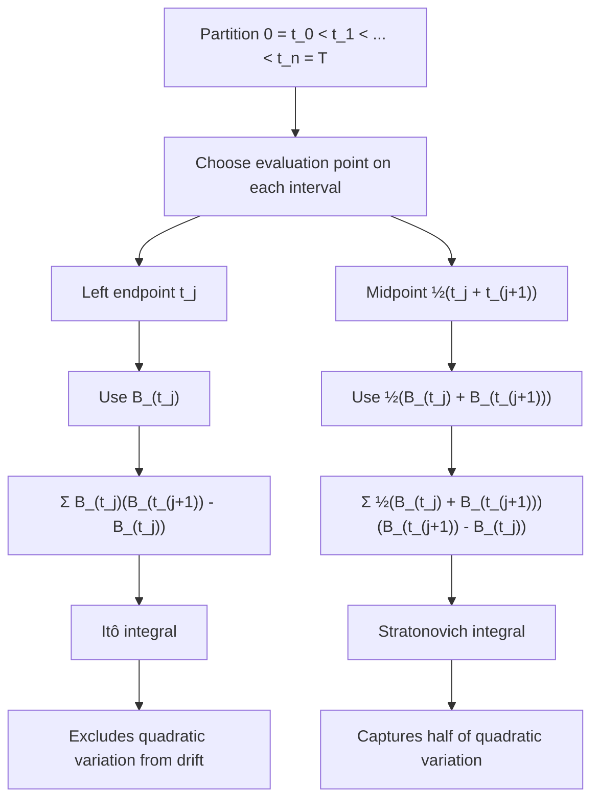
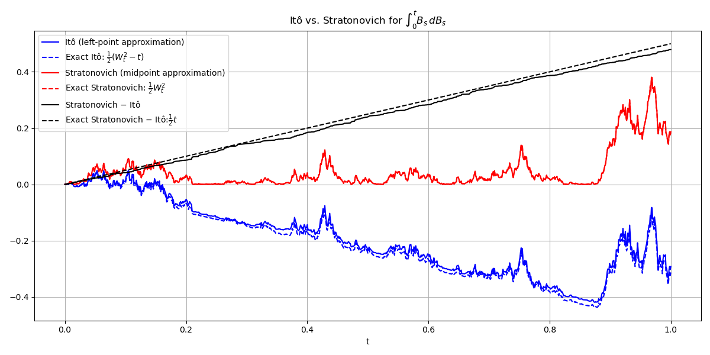

# The Stratonovich Integral

## Concept Definition

The **Stratonovich integral** is a stochastic integral defined using **midpoint sampling**:

$$
\int_0^T f(t,\omega) \circ dB_t
:= \lim_{|\Pi|\to 0} \sum_{j=0}^{n-1}
f\!\left(\frac{t_j + t_{j+1}}{2},\, \omega\right)
(B_{t_{j+1}} - B_{t_j})
$$

The circle notation $\circ\,dB_t$ distinguishes it from the Itô integral, which uses left-point sampling. Both integrals are mathematically valid, but they assign different values to the same formal expression.

The core example that illustrates the difference is

$$
\int_0^t B_s \, dB_s = \frac{1}{2}(B_t^2 - t)
\qquad\text{(Itô)}
$$

$$
\int_0^t B_s \circ dB_s = \frac{1}{2}B_t^2
\qquad\text{(Stratonovich)}
$$

The two integrals differ by $\frac{1}{2}t$, which is exactly the quadratic variation of Brownian motion on $[0,t]$. This correction term appears because midpoint sampling picks up an additional contribution from the quadratic variation that left-point sampling excludes.

In Stratonovich form, the stochastic differential obeys the same formal chain rule as ordinary calculus. This makes the Stratonovich integral the natural choice in physics and geometric modeling, where coordinate invariance and classical differential rules are important.

---

## Why Midpoint Sampling Changes the Limit

The choice of evaluation point in the Riemann sum determines which stochastic integral we obtain. We illustrate this with the integrand $f(t) = B_t$.



**Figure: Left-point vs midpoint sampling in stochastic integration.** The Itô integral evaluates the integrand at the **left endpoint** of each interval, while the Stratonovich integral evaluates it at the **midpoint**. Because Brownian motion has nonzero quadratic variation, these different sampling rules lead to different limits.

The two stochastic integrals differ only in **where the integrand is sampled** on each interval. In the Itô convention, we evaluate at the **left endpoint**, so the integrand depends only on past information. In the Stratonovich convention, we evaluate symmetrically at the **midpoint**, which causes the limit to pick up **half of the quadratic variation** of Brownian motion. That is why the two conventions assign different values to the same formal expression.

### Left-endpoint approximation (Ito)

Evaluating at the left endpoint $t_j^* = t_j$ gives the Itô convention:

$$
\sum_j B_{t_j}(B_{t_{j+1}} - B_{t_j})
$$

Since Brownian increments are independent of the past and have mean zero,

$$
\mathbb{E}[B_{t_j}(B_{t_{j+1}} - B_{t_j})] = 0
$$

so the expected value of the sum is zero. This reflects the **martingale property** of the Itô integral.

---

### Right-endpoint approximation

Evaluating at the right endpoint $t_j^* = t_{j+1}$ gives a different result:

$$
\sum_j B_{t_{j+1}}(B_{t_{j+1}} - B_{t_j})
$$

Writing $B_{t_{j+1}} = B_{t_j} + (B_{t_{j+1}} - B_{t_j})$ and expanding:

$$
\mathbb{E}\bigl[B_{t_{j+1}}(B_{t_{j+1}} - B_{t_j})\bigr]
= \mathbb{E}\bigl[B_{t_j}(B_{t_{j+1}} - B_{t_j})\bigr]
+ \mathbb{E}\bigl[(B_{t_{j+1}} - B_{t_j})^2\bigr]
= 0 + (t_{j+1} - t_j)
$$

Summing over all intervals yields an expected value of $T$. The right-endpoint sum picks up the full quadratic variation.

Right-endpoint sampling is a useful contrast because it also picks up quadratic variation, but the **Stratonovich integral is defined by the symmetric midpoint rule**, not by the right-endpoint rule.

---

### Midpoint approximation (Stratonovich)

The Stratonovich convention evaluates at the midpoint, which can be written as the average of the left and right endpoints:

$$
\frac{1}{2}(B_{t_j} + B_{t_{j+1}})
$$

This midpoint rule picks up exactly **half of the quadratic variation contribution**, which produces the correction term $\frac{1}{2}t$. For $\int_0^T B_t \circ dB_t$, the expected correction is $\frac{1}{2}T$, which explains why

$$
\int_0^t B_s \circ dB_s
= \int_0^t B_s \, dB_s + \frac{1}{2}t
= \frac{1}{2}(B_t^2 - t) + \frac{1}{2}t
= \frac{1}{2}B_t^2
$$

This is exactly the result that the classical chain rule would give for $d(\frac{1}{2}B_t^2) = B_t \, dB_t$, with no correction term.

---

## Quadratic Variation and Its Role

Brownian motion satisfies

$$
\langle B \rangle_T = T
$$

Because Brownian increments satisfy $\Delta B \sim \sqrt{\Delta t}$, we have $(\Delta B)^2 \sim \Delta t$. Summing these squared increments produces the quadratic variation $T$. This nonzero quadratic variation distinguishes Brownian paths from smooth functions and explains why different discretizations lead to different limiting integrals. This nonzero quadratic variation is exactly what causes the difference between the Itô and Stratonovich limits. The Itô integral excludes quadratic variation from the drift, while the Stratonovich integral incorporates half of it implicitly.

---

## The Stratonovich Chain Rule

A key advantage of Stratonovich calculus is that stochastic differentials obey the same formal chain rule as ordinary calculus.

In Stratonovich form, the stochastic differential of $f(X_t)$ for $f \in C^2$ satisfies

$$
df(X_t) = f'(X_t) \circ dX_t
$$

No second-order correction term appears. This contrasts with the Itô formula, where the chain rule acquires an additional $\frac{1}{2}f''(dX)^2$ term.

| Property | Itô | Stratonovich |
|----------|-----|--------------|
| Chain rule | $df = f'dX + \frac{1}{2}f''(dX)^2$ | $df = f' \circ dX$ |
| Martingale | Preserves martingale structure under adapted $L^2$ assumptions | Generally not a martingale because of the correction term |
| Riemann sum | Left endpoint | Midpoint |

---

## Conversion Between Ito and Stratonovich

The two integrals are related by a **correction term** that arises from the **quadratic covariation** between the integrand and the Brownian motion.

For the core example with $f(x) = x$ and $\sigma = 1$:

$$
\int_0^t B_s \circ dB_s
= \int_0^t B_s \, dB_s + \frac{1}{2}\int_0^t 1 \, ds
= \frac{1}{2}(B_t^2 - t) + \frac{1}{2}t
= \frac{1}{2}B_t^2
$$

Comparing the two expressions shows that the Stratonovich integral differs from the Itô integral by the deterministic term $\frac{1}{2}t$. This term arises from the quadratic variation of Brownian motion. More generally, whenever the integrand depends on a stochastic process $X_t$, the correction depends on how that process reacts to Brownian noise.

Suppose the process $X_t$ satisfies the stochastic differential equation

$$
dX_t = b(t,X_t) \, dt + \sigma(t,X_t) \, dW_t
$$

where $\sigma(t,X_t)$ is the **diffusion coefficient**, describing how strongly the Brownian noise affects the process. Then the Stratonovich and Itô integrals are related by:

$$
\boxed{
\int_0^t f(s, X_s) \circ dW_s
= \int_0^t f(s, X_s) \, dW_s
+ \frac{1}{2}\int_0^t \frac{\partial f}{\partial x}(s, X_s)\,\sigma(s, X_s) \, ds
}
$$

Equivalently, using quadratic covariation notation:

$$
\int_0^t f \circ dW = \int_0^t f \, dW + \frac{1}{2}[f, W]_t
$$

where $[f, W]_t$ is the quadratic covariation between $f$ and $W$.

---

## Numerical Illustration

The following script simulates one Brownian path and compares the left-point and midpoint approximations to $\int_0^T B_t \, dB_t$. The plotted output illustrates the difference between the Itô and Stratonovich conventions, together with the closed-form theoretical curves.

```python
import matplotlib.pyplot as plt
import numpy as np
from dataclasses import dataclass
from typing import Optional


@dataclass
class BrownianMotionResult:
    time_steps: np.ndarray
    time_step_size: float
    brownian_paths: np.ndarray
    increments: np.ndarray


class BrownianMotion:
    DEFAULT_STEPS_PER_YEAR = 252

    def __init__(self, maturity_time: float = 1.0, seed: Optional[int] = None):
        if maturity_time <= 0:
            raise ValueError("maturity_time must be positive")
        self.maturity_time = maturity_time
        self.rng = np.random.RandomState(seed)

    def simulate(self, num_paths: int = 1, num_steps: Optional[int] = None) -> BrownianMotionResult:
        if num_paths <= 0:
            raise ValueError("num_paths must be positive")

        if num_steps is None:
            num_steps = int(self.maturity_time * self.DEFAULT_STEPS_PER_YEAR)
        if num_steps <= 0:
            raise ValueError("num_steps must be positive")

        time_steps = np.linspace(0, self.maturity_time, num_steps + 1)
        dt = time_steps[1] - time_steps[0]

        # Brownian increments: ΔW ~ N(0, dt)
        increments = self.rng.standard_normal((num_paths, num_steps)) * np.sqrt(dt)
        brownian_paths = np.concatenate(
            [np.zeros((num_paths, 1)), increments.cumsum(axis=1)],
            axis=1
        )

        return BrownianMotionResult(
            time_steps=time_steps,
            time_step_size=dt,
            brownian_paths=brownian_paths,
            increments=increments
        )


if __name__ == "__main__":

    N = 1000
    bm = BrownianMotion(maturity_time=1.0, seed=42)
    result = bm.simulate(num_paths=1, num_steps=N)

    W = result.brownian_paths[0]
    dW = result.increments[0]
    t = result.time_steps
    dt = result.time_step_size

    # Itô integral (left-point rule): ∑ W_{t_j} ΔW_j
    ito = np.concatenate(([0.0], np.cumsum(W[:-1] * dW)))

    # Stratonovich integral (midpoint rule): ∑ ½(W_{t_j} + W_{t_{j+1}}) ΔW_j
    strat = np.concatenate(([0.0], np.cumsum(0.5 * (W[:-1] + W[1:]) * dW)))

    # Theoretical closed forms
    ito_theory = 0.5 * (W**2 - t)
    strat_theory = 0.5 * W**2

    # Difference between Stratonovich and Itô
    difference = strat - ito

    plt.figure(figsize=(12, 6))
    plt.plot(t, ito, "b-", label="Itô (left-point approximation)")
    plt.plot(t, ito_theory, "b--", label=r"Exact Itô: $\frac{1}{2}(W_t^2 - t)$")
    plt.plot(t, strat, "r-", label="Stratonovich (midpoint approximation)")
    plt.plot(t, strat_theory, "r--", label=r"Exact Stratonovich: $\frac{1}{2}W_t^2$")
    plt.plot(t, difference, "k-", label=r"Stratonovich $-$ Itô")
    plt.plot(t, 0.5 * t, "k--", label=r"Exact Stratonovich $-$ Itô:$\frac{1}{2}t$")
    plt.legend(loc="upper left")
    plt.xlabel("t")
    plt.title(r"Itô vs. Stratonovich for $\int_0^t B_s\,dB_s$")
    plt.grid(True)
    plt.tight_layout()
    plt.show()
```

The dashed curves show the exact closed-form values:

- Itô: $\frac{1}{2}(B_t^2 - t)$
- Stratonovich: $\frac{1}{2}B_t^2$



The numerical approximations closely track their theoretical values. The dotted black curve shows the difference between the Stratonovich and Itô approximations, which follows the dashed $\frac{1}{2}t$ line. This confirms that the gap equals exactly half the quadratic variation.

---

??? note "Advanced: The Wong-Zakai Theorem"

    The **Wong-Zakai theorem** provides deep insight into why the Stratonovich integral appears naturally in physics.

    Consider the SDE:

    $$
    dX_t = b(X_t) \, dt + \sigma(X_t) \, dW_t
    $$

    Now replace Brownian motion $W_t$ by a **smooth approximation** $W_t^{(n)}$ (e.g., piecewise linear interpolation), and solve the ordinary differential equation:

    $$
    \frac{dX_t^{(n)}}{dt} = b(X_t^{(n)}) + \sigma(X_t^{(n)})\frac{dW_t^{(n)}}{dt}
    $$

    **Wong-Zakai Theorem**: As $n \to \infty$, the solutions $X_t^{(n)}$ converge to the solution of the **Stratonovich SDE**:

    $$
    dX_t = b(X_t) \, dt + \sigma(X_t) \circ dW_t
    $$

    not the Itô SDE.

    The equivalent Itô SDE is:

    $$
    dX_t = \left(b(X_t) + \frac{1}{2}\sigma(X_t)\sigma'(X_t)\right)dt + \sigma(X_t) \, dW_t
    $$

    The extra drift term $\frac{1}{2}\sigma\sigma'$ is called the **noise-induced drift** or **Stratonovich correction**.

    **Interpretation**: In many physical models derived from smooth-noise limits, Stratonovich is the more natural formulation. The Itô form requires an explicit correction to account for the fact that white noise is truly delta-correlated.

??? note "Advanced: When to Use Which?"

    **Itô is naturally aligned with:**

    - **Mathematical finance**: risk-neutral pricing, hedging, Black-Scholes
    - **Filtering theory**: Kalman filter, signal processing
    - **Martingale methods**: change of measure, Girsanov theorem
    - **Numerical simulation**: Euler-Maruyama is naturally aligned with the Itô interpretation

    **Stratonovich is naturally aligned with:**

    - **Physics**: Langevin equations, thermodynamics, fluctuation-dissipation
    - **Geometric problems**: stochastic flows on manifolds
    - **Smooth-noise limits**: Wong-Zakai limit of colored noise
    - **Preserving symmetries**: Stratonovich respects coordinate transformations

    The choice between Itô and Stratonovich is not about correctness — both are mathematically valid. The choice depends on the modeling context and which properties are most important for the application.

??? note "Advanced: Overdamped Langevin Equation"

    In physics, the overdamped Langevin equation is often written as:

    $$
    \gamma \frac{dx}{dt} = -V'(x) + \sqrt{2\gamma k_B T}\,\xi(t)
    $$

    where $\xi(t)$ is "white noise."

    Physical interpretation (Wong-Zakai) suggests Stratonovich:

    $$
    dx = -\frac{V'(x)}{\gamma} \, dt + \sqrt{\frac{2k_B T}{\gamma}} \circ dW_t
    $$

    Equivalent Itô form (for state-independent diffusion, the two coincide):

    $$
    dx = -\frac{V'(x)}{\gamma} \, dt + \sqrt{\frac{2k_B T}{\gamma}} \, dW_t
    $$

    When diffusion is state-dependent, the correction term becomes crucial.

---

## Summary

$$
\boxed{
\int_0^t f(s,X_s) \circ dW_s = \int_0^t f(s,X_s) \, dW_s + \frac{1}{2}\int_0^t \frac{\partial f}{\partial x}(s,X_s)\,\sigma(s,X_s) \, ds
}
$$

| Aspect | Itô Integral | Stratonovich Integral |
|--------|--------------|----------------------|
| **Definition** | Left endpoint | Midpoint |
| **Chain rule** | Modified (Itô's lemma) | Classical |
| **Martingale** | Preserved under adapted $L^2$ assumptions | Generally not, due to correction term |
| **Wong-Zakai limit** | No | Yes |
| **Finance** | Standard choice | Rarely used |
| **Physics** | Requires explicit noise correction | Natural formulation |
