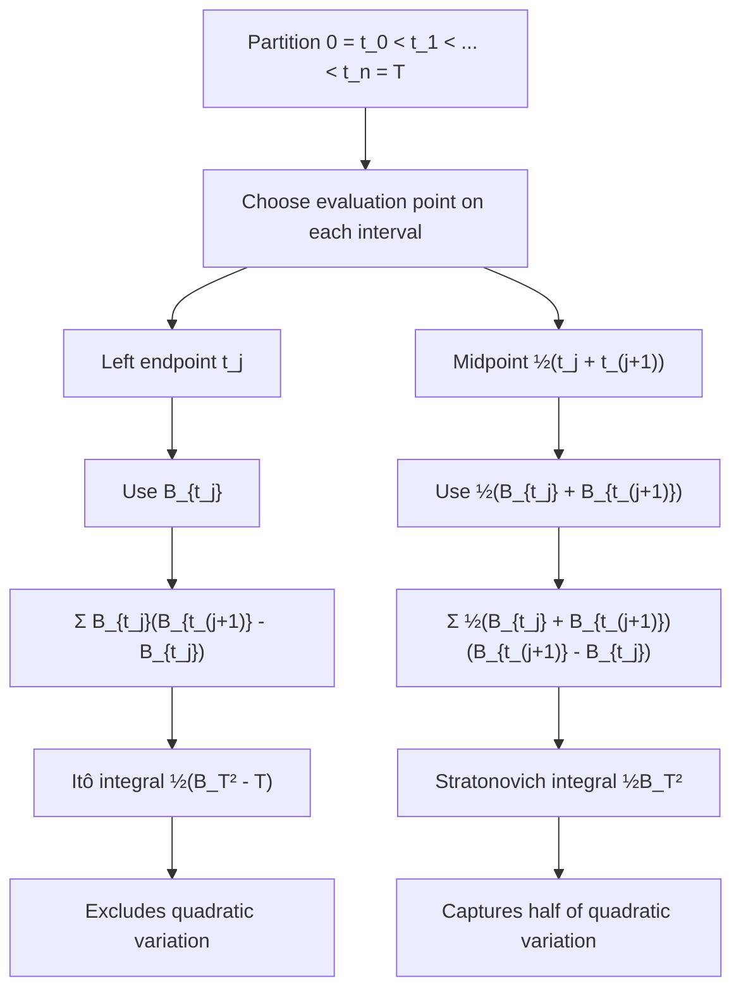

# The Stratonovich Integral

### 1. Concept Definition

The **Stratonovich integral** is a stochastic integral defined using **midpoint sampling**:

$$
\int_0^T f(t,\omega) \circ dB_t
:= \lim_{|\Pi|\to 0} \sum_{j=0}^{n-1}
f\!\left(\frac{t_j + t_{j+1}}{2},\, \omega\right)
(B_{t_{j+1}} - B_{t_j})
$$

The circle notation $\circ\,dB_t$ distinguishes it from the Itô integral, which uses left-endpoint sampling. Both integrals are mathematically valid, but they assign different values to the same formal expression.

The core example that illustrates the difference is

$$
\int_0^t B_s \, dB_s = \frac{1}{2}(B_t^2 - t)
\qquad\text{(Itô)}
$$

$$
\int_0^t B_s \circ dB_s = \frac{1}{2}B_t^2
\qquad\text{(Stratonovich)}
$$

The two integrals differ by $\frac{1}{2}t$, which is exactly half the quadratic variation of Brownian motion on $[0,t]$. The midpoint rule picks up this additional contribution because it evaluates the integrand symmetrically—partially in the future—rather than strictly in the past.

In Stratonovich form, stochastic differentials obey the **classical chain rule**:

$$
df(X_t) = f'(X_t) \circ dX_t \qquad \text{(no second-order correction)}
$$

This makes Stratonovich calculus the natural choice in physics and geometric modeling, where coordinate invariance and classical differential rules are essential.

---

### 2. Why Midpoint Sampling Changes the Limit

The choice of evaluation point in the Riemann sum determines which stochastic integral we obtain. We illustrate with the integrand $f(t) = B_t$.



#### Left-endpoint (Itô)

Evaluating at the left endpoint $t_j^* = t_j$:

$$
\sum_j B_{t_j}(B_{t_{j+1}} - B_{t_j})
$$

Since Brownian increments are independent of the past and have mean zero, each term has $\mathbb{E}[B_{t_j}(B_{t_{j+1}} - B_{t_j})] = 0$. This reflects the **martingale property**: the integral has zero mean.

#### Right-endpoint (for contrast only)

Evaluating at the right endpoint $t_j^* = t_{j+1}$:

$$
\sum_j B_{t_{j+1}}(B_{t_{j+1}} - B_{t_j})
$$

Writing $B_{t_{j+1}} = B_{t_j} + (B_{t_{j+1}} - B_{t_j})$ and expanding:

$$
\mathbb{E}[B_{t_{j+1}}(B_{t_{j+1}} - B_{t_j})]
= \underbrace{\mathbb{E}[B_{t_j}(B_{t_{j+1}} - B_{t_j})]}_{=\,0} + \mathbb{E}[(B_{t_{j+1}} - B_{t_j})^2]
= t_{j+1} - t_j
$$

Summing over all intervals: the right-endpoint sum picks up the **full** quadratic variation $T$.

!!! note
    The right-endpoint rule is shown as a contrast only. It is not a standard stochastic integration convention.

#### Midpoint (Stratonovich)

The midpoint rule evaluates at the average of left and right endpoints:

$$
\frac{1}{2}(B_{t_j} + B_{t_{j+1}})
$$

This is the average of the left-endpoint and right-endpoint evaluations, so it picks up exactly **half** of the quadratic variation. For $\int_0^T B_t \circ dB_t$, the expected correction is $T/2$:

$$
\int_0^t B_s \circ dB_s
= \int_0^t B_s \, dB_s + \frac{1}{2}t
= \frac{1}{2}(B_t^2 - t) + \frac{1}{2}t
= \frac{1}{2}B_t^2
$$

This is exactly the result that the classical chain rule applied to $\frac{d}{dt}\frac{1}{2}B_t^2 = B_t\,\frac{dB_t}{dt}$ would give—if we pretended $B_t$ were differentiable.

---

### 3. The Stratonovich Chain Rule

The principal advantage of Stratonovich calculus is that stochastic differentials obey the same formal chain rule as ordinary calculus. For $f \in C^2$ and an Itô process $X_t$:

**Stratonovich chain rule**: $df(X_t) = f'(X_t) \circ dX_t$

**Itô's formula**: $df(X_t) = f'(X_t)\,dX_t + \frac{1}{2}f''(X_t)\,(dX_t)^2$

The Stratonovich form has no second-order correction. This is why Stratonovich integrals appear naturally when passing from smooth-noise models to white-noise limits (Wong-Zakai theorem), and in geometric problems where the chain rule must behave classically under coordinate changes.

| Property | Itô | Stratonovich |
|---|---|---|
| Chain rule | $df = f'\,dX + \frac{1}{2}f''(dX)^2$ | $df = f' \circ dX$ |
| Martingale | Preserved under adapted $L^2$ assumptions | Not preserved (correction term shifts mean) |
| Riemann sum | Left endpoint | Midpoint |
| Finance | Standard choice | Rarely used |
| Physics / geometry | Requires explicit noise correction | Natural formulation |

---

### 4. Conversion Formula

The two integrals are related by a **correction term** equal to half the quadratic covariation between the integrand and the Brownian motion.

Suppose $X_t$ satisfies $dX_t = b(t,X_t)\,dt + \sigma(t,X_t)\,dW_t$. Then:

$$
\boxed{
\int_0^t f(s, X_s) \circ dW_s
= \int_0^t f(s, X_s) \, dW_s
+ \frac{1}{2}\int_0^t \frac{\partial f}{\partial x}(s, X_s)\,\sigma(s, X_s) \, ds
}
$$

where $\sigma(s,X_s)$ is the diffusion coefficient of $X_t$. Equivalently, using quadratic covariation notation:

$$
\int_0^t f \circ dW = \int_0^t f \, dW + \frac{1}{2}[f({\cdot},X_{\cdot}), W]_t
$$

**Note**: the correction term depends on $\sigma(s,X_s)$—how strongly the Brownian noise affects the process $X_t$. If $f$ does not depend on $X_t$ (deterministic integrand), then $\partial f/\partial x = 0$ and the two integrals coincide.

---

### 5. Numerical Illustration

The following script simulates one Brownian path and compares the left-point and midpoint approximations to $\int_0^T B_t\, dB_t$.

```python
import matplotlib.pyplot as plt
import numpy as np
from dataclasses import dataclass
from typing import Optional


@dataclass
class BrownianMotionResult:
    time_steps: np.ndarray
    time_step_size: float
    brownian_paths: np.ndarray
    increments: np.ndarray


class BrownianMotion:
    DEFAULT_STEPS_PER_YEAR = 252

    def __init__(self, maturity_time: float = 1.0, seed: Optional[int] = None):
        if maturity_time <= 0:
            raise ValueError("maturity_time must be positive")
        self.maturity_time = maturity_time
        self.rng = np.random.RandomState(seed)

    def simulate(self, num_paths: int = 1,
                 num_steps: Optional[int] = None) -> BrownianMotionResult:
        if num_steps is None:
            num_steps = int(self.maturity_time * self.DEFAULT_STEPS_PER_YEAR)
        time_steps = np.linspace(0, self.maturity_time, num_steps + 1)
        dt = time_steps[1] - time_steps[0]
        increments = self.rng.standard_normal((num_paths, num_steps)) * np.sqrt(dt)
        brownian_paths = np.concatenate(
            [np.zeros((num_paths, 1)), increments.cumsum(axis=1)], axis=1
        )
        return BrownianMotionResult(time_steps=time_steps, time_step_size=dt,
                                    brownian_paths=brownian_paths, increments=increments)


if __name__ == "__main__":
    N = 1000
    bm = BrownianMotion(maturity_time=1.0, seed=42)
    result = bm.simulate(num_paths=1, num_steps=N)

    W = result.brownian_paths[0]
    dW = result.increments[0]
    t = result.time_steps

    # Itô integral (left-point): Σ W_{t_j} ΔW_j
    ito = np.concatenate(([0.0], np.cumsum(W[:-1] * dW)))

    # Stratonovich integral (midpoint): Σ ½(W_{t_j} + W_{t_{j+1}}) ΔW_j
    strat = np.concatenate(([0.0], np.cumsum(0.5 * (W[:-1] + W[1:]) * dW)))

    # Theoretical closed forms
    ito_theory = 0.5 * (W**2 - t)
    strat_theory = 0.5 * W**2

    difference = strat - ito

    plt.figure(figsize=(12, 6))
    plt.plot(t, ito,        "b-",  label="Itô (left-point approximation)")
    plt.plot(t, ito_theory, "b--", label=r"Exact Itô: $\frac{1}{2}(W_t^2 - t)$")
    plt.plot(t, strat,        "r-",  label="Stratonovich (midpoint approximation)")
    plt.plot(t, strat_theory, "r--", label=r"Exact Stratonovich: $\frac{1}{2}W_t^2$")
    plt.plot(t, difference, "k-",  label=r"Stratonovich $-$ Itô")
    plt.plot(t, 0.5 * t,    "k--", label=r"Exact difference: $\frac{1}{2}t$")
    plt.legend(loc="upper left", fontsize=9)
    plt.xlabel("$t$")
    plt.title(r"Itô vs. Stratonovich for $\int_0^t B_s\,dB_s$")
    plt.grid(True)
    plt.tight_layout()
    plt.savefig("./image/ito_and_stratonovich_integration.png", dpi=150)
    plt.show()
```


The numerical approximations closely track their theoretical values. The black curve shows the difference between the Stratonovich and Itô approximations; it follows the $t/2$ line (dashed black), confirming that the gap equals exactly half the quadratic variation.

---

### 6. Summary

$$
\boxed{
\int_0^t f(s,X_s) \circ dW_s = \int_0^t f(s,X_s) \, dW_s + \frac{1}{2}\int_0^t \frac{\partial f}{\partial x}(s,X_s)\,\sigma(s,X_s) \, ds
}
\quad \text{where } dX_t = b\,dt + \sigma\,dW_t
$$

The Stratonovich integral and the Itô integral differ by a correction term equal to half the quadratic covariation between the integrand and the driving Brownian motion. The correction is zero when the integrand does not depend on the stochastic process.

| Aspect | Itô | Stratonovich |
|---|---|---|
| Definition | Left endpoint | Midpoint |
| Chain rule | Itô's formula (with correction) | Classical (no correction) |
| Martingale | Preserved under adapted $L^2$ | Not generally preserved |
| Wong-Zakai limit | No | Yes |
| Finance | Standard choice | Rarely used |
| Physics / geometry | Requires noise correction | Natural formulation |

??? note "Advanced: Wong-Zakai theorem"
    The **Wong-Zakai theorem** explains why Stratonovich integrals appear naturally in physics. Replace Brownian motion $W_t$ by a smooth approximation $W_t^{(n)}$ (e.g., piecewise linear interpolation) and solve the ordinary differential equation:

    $$
    \frac{dX_t^{(n)}}{dt} = b(X_t^{(n)}) + \sigma(X_t^{(n)})\frac{dW_t^{(n)}}{dt}
    $$

    As $n \to \infty$, the solutions $X_t^{(n)}$ converge to the solution of the **Stratonovich SDE** $dX_t = b(X_t)\,dt + \sigma(X_t) \circ dW_t$, not the Itô SDE. The equivalent Itô form requires an extra **noise-induced drift** $\frac{1}{2}\sigma(X_t)\sigma'(X_t)\,dt$.

    This means: in physical models derived from smooth-noise limits, Stratonovich is the natural formulation, and the Itô form requires an explicit correction to account for truly delta-correlated (white) noise.

??? note "Advanced: when to use each convention"
    **Itô** is naturally aligned with mathematical finance (risk-neutral pricing, Black-Scholes, Girsanov theorem), filtering theory, and numerical simulation (Euler-Maruyama is Itô by construction).

    **Stratonovich** is naturally aligned with physics (Langevin equations, thermodynamics), stochastic flows on manifolds, smooth-noise limits (Wong-Zakai), and contexts where coordinate-invariant differential rules are essential.

    The choice is not about correctness—both are mathematically valid. It depends on which properties are most important for the application at hand.

??? note "Advanced: overdamped Langevin equation"
    The overdamped Langevin equation is often written in physics as:

    $$
    \gamma \frac{dx}{dt} = -V'(x) + \sqrt{2\gamma k_B T}\,\xi(t)
    $$

    where $\xi(t)$ is white noise. The Wong-Zakai interpretation yields the Stratonovich SDE:

    $$
    dx = -\frac{V'(x)}{\gamma}\, dt + \sqrt{\frac{2k_B T}{\gamma}} \circ dW_t
    $$

    For state-independent diffusion (as here), the Itô and Stratonovich forms coincide. When the diffusion coefficient depends on $x$, the two forms differ by a state-dependent noise-induced drift, which has important physical consequences (e.g., in thermophoresis and stochastic resonance).

---

## Exercises

**Exercise 1.** Compute the Stratonovich integral $\int_0^t s \circ dB_s$. Does it differ from the Ito integral $\int_0^t s\, dB_s$? Explain why or why not, using the conversion formula.

---

**Exercise 2.** Using the conversion formula

$$
\int_0^t f(B_s) \circ dB_s = \int_0^t f(B_s)\, dB_s + \frac{1}{2}\int_0^t f'(B_s)\, ds
$$

compute $\int_0^t B_s^2 \circ dB_s$ and verify that the result is consistent with the classical chain rule applied to $g(x) = x^3/3$.

---

**Exercise 3.** The Stratonovich chain rule gives $d(\sin B_t) = \cos(B_t) \circ dB_t$. Convert this to Ito form by finding $d(\sin B_t)$ using Ito's formula. Identify the drift correction term and verify it matches the conversion formula.

---

**Exercise 4.** Consider the Stratonovich SDE $dX_t = \sigma X_t \circ dB_t$ (no drift in Stratonovich form). Convert this to its equivalent Ito SDE. What drift term appears in the Ito form? Solve the resulting Ito SDE.

---

**Exercise 5.** Let $f(x) = e^x$. Using the Stratonovich chain rule, write $d(e^{B_t})$ in Stratonovich form. Then convert to Ito form and verify that you recover the standard result from Ito's formula.

---

**Exercise 6.** Using the coin-flip approximation with $n = 10$ and the sequence $H, T, H, H, T, H, T, T, H, H$, compute both the left-endpoint (Ito) and midpoint (Stratonovich) sums for $\int_0^1 B_s\, dB_s$. Verify that their difference is approximately $\frac{1}{2} \cdot 1 = 0.5$ times the quadratic variation sum $\sum (\Delta B_k)^2$.

---

**Exercise 7.** Explain why the Stratonovich integral $\int_0^t B_s \circ dB_s = \frac{1}{2}B_t^2$ is not a martingale, while the Ito integral $\int_0^t B_s\, dB_s = \frac{1}{2}(B_t^2 - t)$ is a martingale. What property of the midpoint evaluation causes the martingale property to fail?
