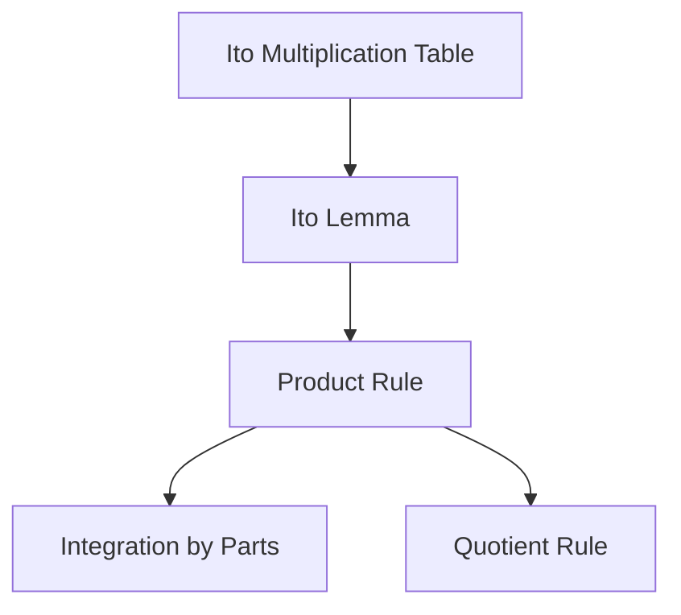

# Itô Product Rule and Derived Identities

## 1. Concept Definition

The **Itô product rule** describes how the product of two Itô processes evolves over time.
It is the stochastic analogue of the classical product rule, with one additional term:

$$
\boxed{
d(X_t Y_t) = X_t\,dY_t + Y_t\,dX_t + d[X,Y]_t
}
$$

where $[X,Y]_t$ is the **quadratic covariation** of $X_t$ and $Y_t$.

The extra term $d[X,Y]_t$ has no classical counterpart. It arises because Brownian
increments satisfy $(dW_t)^2 = dt$, so products of stochastic differentials do not
vanish. The multiplication rules behind this are established in
[From Taylor to Itô](from_taylor_to_ito.md).

From the product rule two further identities follow directly:

- **Stochastic integration by parts**
- **Itô quotient rule**

---

## 2. Why the Classical Product Rule Gains an Extra Term

In classical calculus, $dX\,dY = 0$ because increments scale like $O(dt)$, making
cross terms second-order and negligible. For Itô processes driven by Brownian motion,
$dX_t$ contains a $dW_t$ component with $dW_t = O(\sqrt{dt})$, so

$$
dW_t \cdot dW_t = dt \neq 0
$$

Products of stochastic differentials therefore contribute at first order and cannot
be dropped.

| | Classical calculus | Stochastic calculus |
|---|---|---|
| Product rule | $d(XY) = X\,dY + Y\,dX$ | $d(XY) = X\,dY + Y\,dX + d[X,Y]$ |
| Cross term | $dX\,dY = 0$ | $d[X,Y]_t$ survives |
| Reason | $dX = O(dt)$ | $dX_t$ has a $dW_t$ component: $O(\sqrt{dt})$ |

---

## 3. Itô Product Rule

Let $X_t$ and $Y_t$ be scalar Itô processes:

$$
dX_t = a_t\,dt + b_t\,dW_t, \qquad dY_t = c_t\,dt + e_t\,dW_t
$$

The quadratic covariation is computed by expanding $dX_t\,dY_t$ and applying
the multiplication table $(dW_t)^2 = dt$, $dt\,dW_t = 0$, $(dt)^2 = 0$:

$$
dX_t\,dY_t
= \underbrace{a_t c_t (dt)^2}_{=\,0}
+ \underbrace{a_t e_t\,dt\,dW_t}_{=\,0}
+ \underbrace{b_t c_t\,dW_t\,dt}_{=\,0}
+ \underbrace{b_t e_t\,(dW_t)^2}_{=\,b_t e_t\,dt}
$$

$$
= b_t e_t\,dt
$$

so $d[X,Y]_t = b_t e_t\,dt$. Substituting $dX_t$, $dY_t$, and $d[X,Y]_t$ into
$X_t\,dY_t + Y_t\,dX_t + d[X,Y]_t$:

$$
d(X_t Y_t)
= X_t(c_t\,dt + e_t\,dW_t) + Y_t(a_t\,dt + b_t\,dW_t) + b_t e_t\,dt
$$

Collecting $dt$ and $dW_t$ terms:

$$
d(X_t Y_t)
= (X_t c_t + Y_t a_t + b_t e_t)\,dt
+ (X_t e_t + Y_t b_t)\,dW_t
$$

!!! note "When the correction term vanishes"

    $d[X,Y]_t = 0$ when one process is **deterministic** (so $b_t = 0$ or $e_t = 0$),
    or when the two processes are driven by **independent Brownian motions** (separate driving noises $dW^X$ and $dW^Y$ that are uncorrelated). For the multi-noise case, see [Multidimensional Itô's Lemma](ito_lemma_multidimensional_version.md).

---

## 4. Derived Rules

### 4.1 Stochastic Integration by Parts

Integrate the product rule $d(X_t Y_t) = X_t\,dY_t + Y_t\,dX_t + d[X,Y]_t$
from $0$ to $t$:

$$
X_t Y_t - X_0 Y_0 = \int_0^t X_s\,dY_s + \int_0^t Y_s\,dX_s + [X,Y]_t
$$

Rearranging for $\int_0^t X_s\,dY_s$:

$$
\boxed{
\int_0^t X_s\,dY_s
= X_t Y_t - X_0 Y_0
- \int_0^t Y_s\,dX_s
- [X,Y]_t
}
$$

This is the stochastic analogue of classical integration by parts.

---

### 4.2 Itô Quotient Rule

Write $X_t / Y_t = X_t \cdot Y_t^{-1}$ and derive in two steps.

**Step 1.** Apply Itô's lemma (see [Itô's Lemma](ito_lemma.md)) to $g(y) = y^{-1}$ with $g'(y) = -y^{-2}$
and $g''(y) = 2y^{-3}$:

$$
d(Y_t^{-1})
= -\frac{1}{Y_t^2}\,dY_t + \frac{1}{2} \cdot \frac{2}{Y_t^3}\,(dY_t)^2
= -\frac{dY_t}{Y_t^2} + \frac{e_t^2}{Y_t^3}\,dt
$$

where $(dY_t)^2 = e_t^2\,dt$ from the multiplication table. This shows that $Y_t^{-1}$ is itself an Itô process with diffusion coefficient $-e_t/Y_t^2$.

**Step 2.** Apply the product rule to $X_t \cdot Y_t^{-1}$. Since $Y_t^{-1}$ has diffusion coefficient $-e_t/Y_t^2$ (from Step 1), the quadratic covariation between $X_t$ (diffusion coefficient $b_t$) and $Y_t^{-1}$ is:

$$
d[X, Y^{-1}]_t = b_t \cdot \left(-\frac{e_t}{Y_t^2}\right)dt = -\frac{b_t e_t}{Y_t^2}\,dt
$$

Applying the product rule $d(X_t \cdot Y_t^{-1}) = Y_t^{-1}\,dX_t + X_t\,d(Y_t^{-1}) + d[X, Y^{-1}]_t$
and substituting:

$$
\boxed{
d\!\left(\frac{X_t}{Y_t}\right)
=
\frac{dX_t}{Y_t}
- \frac{X_t\,dY_t}{Y_t^2}
- \frac{b_t e_t}{Y_t^2}\,dt
+ \frac{X_t e_t^2}{Y_t^3}\,dt
}
$$

where $b_t$ is the diffusion coefficient of $X_t$ and $e_t$ is the diffusion coefficient of $Y_t$. The first two terms mirror the classical quotient rule; the last two are the Itô corrections arising from the non-zero quadratic variation of $Y_t$.

---

## 5. Worked Examples

### Example 1 -- Computing the Integral of s dW

Let $X_t = t$ (deterministic) and $Y_t = W_t$, so $dX_t = dt$ and $dY_t = dW_t$.
Since $X_t$ is deterministic, its quadratic covariation with any Itô process is zero,
so $[X, Y]_t = 0$. Note also that $X_0 = 0$.

Applying the integration by parts formula with $X_s = s$, $Y_s = W_s$:

$$
\int_0^t s\,dW_s
= \underbrace{tW_t}_{X_t Y_t}
- \underbrace{0}_{X_0 Y_0\,=\,0}
- \int_0^t W_s\,ds
- \underbrace{0}_{[X,Y]_t}
$$

so

$$
\boxed{
\int_0^t s\,dW_s = tW_t - \int_0^t W_s\,ds
}
$$

---

### Example 2 — Solving the Ornstein–Uhlenbeck SDE

Consider the SDE with initial condition $X_0 = x_0$:

$$
dX_t = -\theta X_t\,dt + \sigma\,dW_t, \qquad X_0 = x_0
$$

Multiply through by the integrating factor $e^{\theta t}$ and let $Y_t = e^{\theta t} X_t$.

Apply the product rule to $Y_t = e^{\theta t} X_t$. Since $e^{\theta t}$ is
deterministic, its quadratic covariation with $X_t$ is zero and the correction
term vanishes:

$$
dY_t = e^{\theta t}\,dX_t + \theta e^{\theta t} X_t\,dt
$$

Substituting the SDE:

$$
dY_t = e^{\theta t}(-\theta X_t\,dt + \sigma\,dW_t) + \theta e^{\theta t} X_t\,dt
= \sigma e^{\theta t}\,dW_t
$$

Integrating from $0$ to $t$:

$$
e^{\theta t} X_t = x_0 + \sigma \int_0^t e^{\theta s}\,dW_s
$$

Therefore

$$
\boxed{
X_t = e^{-\theta t} x_0 + \sigma e^{-\theta t} \int_0^t e^{\theta s}\,dW_s
}
$$

---

## 6. Summary

| Rule | Formula |
|---|---|
| Product rule | $d(XY) = X\,dY + Y\,dX + d[X,Y]$ |
| Integration by parts | $\int_0^t X\,dY = X_t Y_t - X_0 Y_0 - \int_0^t Y\,dX - [X,Y]_t$ |
| Quotient rule | $d(X/Y) = Y^{-1}\,dX - XY^{-2}\,dY - b_t e_t Y^{-2}\,dt + X e_t^2 Y^{-3}\,dt$ |

Here $b_t$ and $e_t$ denote the diffusion coefficients of $X_t$ and $Y_t$ respectively (i.e., the coefficients of $dW_t$ in their SDEs).

The logical dependency is:

The diagram reflects the logical dependency across the section: the multiplication table (established in [From Taylor to Itô](from_taylor_to_ito.md)) feeds into Itô's lemma (see [Itô's Lemma](ito_lemma.md)), which is then used in Section 4.2 to derive the quotient rule. Readers encountering this page before `ito_lemma.md` can treat the lemma as a black box and return to the diagram after reading that page.

$\square$

---

## Exercises

**Exercise 1.** Let $X_t = t$ and $Y_t = W_t^2$. Compute $dY_t$ using Itô's lemma, then apply the product rule to compute $d(tW_t^2)$. Write the result in the form $(\cdots)\,dt + (\cdots)\,dW_t$.

??? success "Solution to Exercise 1"
    First compute $dY_t$ for $Y_t = W_t^2$ using Itô's lemma: $dY_t = 2W_t\,dW_t + dt$.

    Now apply the product rule to $Z_t = tW_t^2 = X_t Y_t$ with $X_t = t$ (deterministic, $dX_t = dt$). Since $X_t$ is deterministic, $d[X, Y]_t = 0$:

    $$
    d(tW_t^2) = t\,dY_t + W_t^2\,dX_t + 0
    $$

    Substituting $dY_t = 2W_t\,dW_t + dt$ and $dX_t = dt$:

    $$
    d(tW_t^2) = t(2W_t\,dW_t + dt) + W_t^2\,dt = (t + W_t^2)\,dt + 2tW_t\,dW_t
    $$

---

**Exercise 2.** Let $X_t$ and $Y_t$ both satisfy $dX_t = dY_t = \sigma\,dW_t$ (pure diffusion, no drift), with $X_0 = x_0$ and $Y_0 = y_0$. Use the product rule to compute $d(X_t Y_t)$. Identify the quadratic covariation term $d[X, Y]_t$ and verify that it equals $\sigma^2\,dt$.

??? success "Solution to Exercise 2"
    With $dX_t = dY_t = \sigma\,dW_t$, the diffusion coefficients are $b_t = e_t = \sigma$. The quadratic covariation is:

    $$
    d[X, Y]_t = b_t e_t\,dt = \sigma^2\,dt
    $$

    Applying the product rule:

    $$
    d(X_t Y_t) = X_t\,dY_t + Y_t\,dX_t + d[X,Y]_t = X_t\sigma\,dW_t + Y_t\sigma\,dW_t + \sigma^2\,dt
    $$

    $$
    = \sigma^2\,dt + \sigma(X_t + Y_t)\,dW_t
    $$

    The covariation $d[X,Y]_t = \sigma^2\,dt$ is verified: both processes have the same diffusion coefficient $\sigma$ and are driven by the same Brownian motion.

---

**Exercise 3.** Derive the stochastic integration by parts formula for $\int_0^t W_s^2\,dW_s$ by choosing $X_s = W_s$ and $Y_s = W_s$, applying the product rule to $d(W_s \cdot W_s)$, and solving for the integral. Verify that your result matches Example 4 from the [Applications](ito_calculus_applications.md) page.

??? success "Solution to Exercise 3"
    First, apply the product rule with $X_s = Y_s = W_s$ to get $d(W_t^2) = 2W_t\,dW_t + dt$, which gives $\int_0^t W_s\,dW_s = \frac{1}{2}(W_t^2 - t)$.

    To derive $\int_0^t W_s^2\,dW_s$, apply integration by parts with $X_s = W_s$ and $Y_s = W_s^2$. From Itô's lemma, $dY_s = 2W_s\,dW_s + ds$, and $dX_s = dW_s$. The diffusion coefficient of $X$ is $1$ and the diffusion coefficient of $Y$ is $2W_s$, so the covariation is $d[X, Y]_s = 2W_s\,dt$.

    The integration by parts formula gives:

    $$
    \int_0^t W_s\,dY_s = W_t \cdot W_t^2 - 0 - \int_0^t W_s^2\,dW_s - [X, Y]_t
    $$

    The left side expands as $\int_0^t W_s(2W_s\,dW_s + ds) = 2\int_0^t W_s^2\,dW_s + \int_0^t W_s\,ds$, and $[X,Y]_t = \int_0^t 2W_s\,ds$. Substituting:

    $$
    2\int_0^t W_s^2\,dW_s + \int_0^t W_s\,ds = W_t^3 - \int_0^t W_s^2\,dW_s - 2\int_0^t W_s\,ds
    $$

    $$
    3\int_0^t W_s^2\,dW_s = W_t^3 - 3\int_0^t W_s\,ds
    $$

    $$
    \int_0^t W_s^2\,dW_s = \frac{1}{3}W_t^3 - \int_0^t W_s\,ds
    $$

    This matches Example 4 from the Applications page.

---

**Exercise 4.** Let $dX_t = \mu X_t\,dt + \sigma X_t\,dW_t$ (geometric Brownian motion). Use the quotient rule to compute $d(1/X_t)$, and show that $1/X_t$ also follows a geometric Brownian motion SDE. Identify its drift and diffusion coefficients.

??? success "Solution to Exercise 4"
    For $dX_t = \mu X_t\,dt + \sigma X_t\,dW_t$, use the quotient rule with $X_t$ in the numerator replaced by the constant $1$ (i.e., compute $d(1/X_t)$). Equivalently, apply Itô's lemma to $g(x) = 1/x$:

    $$
    g'(x) = -x^{-2}, \qquad g''(x) = 2x^{-3}
    $$

    With $\mu_t = \mu X_t$ and $\sigma_t = \sigma X_t$:

    $$
    d(X_t^{-1}) = \left(-X_t^{-2}\mu X_t + \frac{1}{2}(2X_t^{-3})\sigma^2 X_t^2\right)dt + (-X_t^{-2})\sigma X_t\,dW_t
    $$

    $$
    = (-\mu + \sigma^2)X_t^{-1}\,dt - \sigma X_t^{-1}\,dW_t
    $$

    So $1/X_t$ follows a geometric Brownian motion SDE with drift $-\mu + \sigma^2$ and diffusion $-\sigma$. The Itô correction $+\sigma^2$ in the drift arises from the positive curvature of $1/x$.

---

**Exercise 5.** Let $X_t = e^{W_t}$ and $Y_t = e^{-W_t}$. Compute $dX_t$ and $dY_t$ using Itô's lemma. Then use the product rule to compute $d(X_t Y_t)$. Since $X_t Y_t = 1$ for all $t$, verify that $d(X_t Y_t) = 0$ and confirm that the classical terms and the correction term cancel exactly.

??? success "Solution to Exercise 5"
    For $X_t = e^{W_t}$, Itô's lemma gives $dX_t = e^{W_t}\,dW_t + \frac{1}{2}e^{W_t}\,dt$.

    For $Y_t = e^{-W_t}$, Itô's lemma gives $dY_t = -e^{-W_t}\,dW_t + \frac{1}{2}e^{-W_t}\,dt$.

    The diffusion coefficients are $b_t = e^{W_t}$ and $e_t = -e^{-W_t}$. The covariation is:

    $$
    d[X, Y]_t = e^{W_t} \cdot (-e^{-W_t})\,dt = -dt
    $$

    Product rule:

    $$
    d(X_t Y_t) = X_t\,dY_t + Y_t\,dX_t + d[X,Y]_t
    $$

    $$
    = e^{W_t}\!\left(-e^{-W_t}\,dW_t + \frac{1}{2}e^{-W_t}\,dt\right) + e^{-W_t}\!\left(e^{W_t}\,dW_t + \frac{1}{2}e^{W_t}\,dt\right) - dt
    $$

    $$
    = -dW_t + \frac{1}{2}\,dt + dW_t + \frac{1}{2}\,dt - dt
    $$

    $$
    = 0
    $$

    The $dW_t$ terms cancel ($-dW_t + dW_t = 0$), and the $dt$ terms cancel ($\frac{1}{2} + \frac{1}{2} - 1 = 0$). This confirms $d(X_tY_t) = 0$, consistent with $X_tY_t = e^{W_t}e^{-W_t} = 1$.

---

**Exercise 6.** Consider the Ornstein--Uhlenbeck SDE: $dX_t = -\theta X_t\,dt + \sigma\,dW_t$. Let $Y_t = e^{\theta t}$ (deterministic). Apply the product rule to $Z_t = X_t Y_t$ and show that $dZ_t = \sigma e^{\theta t}\,dW_t$. Explain why the quadratic covariation $d[X, Y]_t$ vanishes.

??? success "Solution to Exercise 6"
    For $Z_t = X_t Y_t = X_t e^{\theta t}$ with $Y_t = e^{\theta t}$ deterministic ($dY_t = \theta e^{\theta t}\,dt$):

    The product rule gives $d(X_tY_t) = Y_t\,dX_t + X_t\,dY_t + d[X,Y]_t$.

    Since $Y_t$ is deterministic, its diffusion coefficient is zero, so $d[X,Y]_t = 0$. Substituting $dX_t = -\theta X_t\,dt + \sigma\,dW_t$ and $dY_t = \theta e^{\theta t}\,dt$:

    $$
    dZ_t = e^{\theta t}(-\theta X_t\,dt + \sigma\,dW_t) + X_t \theta e^{\theta t}\,dt
    $$

    $$
    = -\theta X_t e^{\theta t}\,dt + \sigma e^{\theta t}\,dW_t + \theta X_t e^{\theta t}\,dt = \sigma e^{\theta t}\,dW_t
    $$

    The drift terms cancel, leaving $dZ_t = \sigma e^{\theta t}\,dW_t$. The quadratic covariation $d[X,Y]_t$ vanishes because $Y_t = e^{\theta t}$ is a deterministic function of time with no stochastic component (its diffusion coefficient is zero).

---

**Exercise 7.** Let $dX_t = a_t\,dt + b_t\,dW_t$ and $dY_t = c_t\,dt + e_t\,dW_t$. Starting from the product rule $d(X_t Y_t) = X_t\,dY_t + Y_t\,dX_t + d[X,Y]_t$, derive the formula for $d(X_t^2)$ by setting $Y_t = X_t$. Show that

$$
d(X_t^2) = 2X_t\,dX_t + b_t^2\,dt
$$

and interpret the term $b_t^2\,dt$ as the Itô correction.

??? success "Solution to Exercise 7"
    Setting $Y_t = X_t$ in the product rule: $dX_t = a_t\,dt + b_t\,dW_t$, so the diffusion coefficients for both "copies" are $b_t$. The covariation is $d[X, X]_t = b_t^2\,dt$:

    $$
    d(X_t^2) = X_t\,dX_t + X_t\,dX_t + d[X,X]_t = 2X_t\,dX_t + b_t^2\,dt
    $$

    The term $b_t^2\,dt$ is the Itô correction. It arises because $(dX_t)^2 = b_t^2\,dt \neq 0$: the squared diffusion coefficient contributes a deterministic drift to $X_t^2$ that has no classical counterpart. Geometrically, $x^2$ is convex ($f'' = 2 > 0$), so symmetric random fluctuations of size $b_t\,dW_t$ produce a net positive contribution $b_t^2\,dt$ to the expected change in $X_t^2$.
