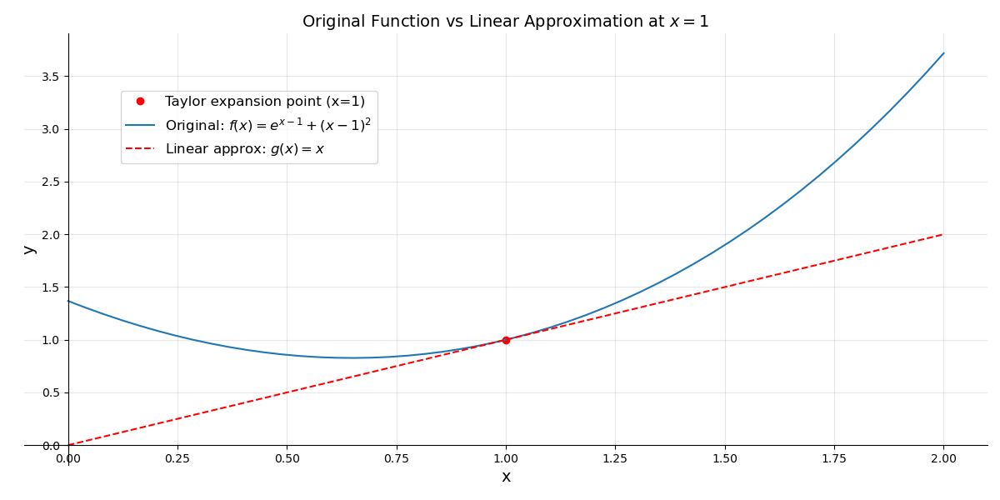
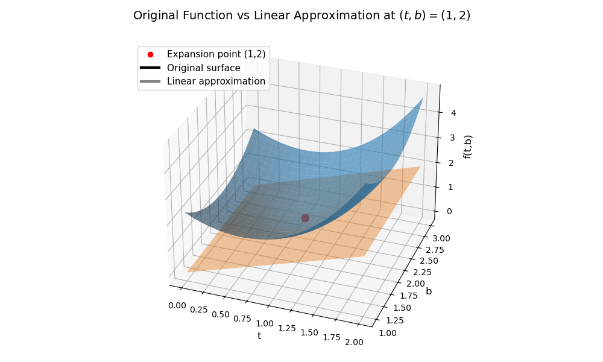

# Taylor Expansion I: Linear Approximation

This section introduces the **first-order Taylor expansion**, also called *linear approximation*. The goal is to build the mindset that “differentials” capture how a function changes under small perturbations—an idea we will later reuse in stochastic calculus.

## Concept

Linear approximation replaces a nonlinear function with its **tangent line** at a point. Because smooth functions locally resemble straight lines, the tangent line provides the best linear approximation near the expansion point.
However, linear approximation **ignores curvature**: wherever the function bends, the tangent line drifts away from the true value. The figures below illustrate this geometric idea. This limitation motivates the quadratic (second-order) approximation covered in the next section.

---

## Linear Approximation in One Variable

For a differentiable function \(f(x)\), the first-order approximation around a point \(x_0\) is

\[
f(x) \approx f(x_0) + f'(x_0)(x - x_0).
\]

In differential shorthand, writing \(\Delta f = f(x) - f(x_0)\) and \(\Delta x = x - x_0\), the same idea reads

\[
\Delta f \approx f'(x_0)\Delta x.
\]

---

## Python Example: Linear Approximation in 1D


### 1. Problem

Approximate \(f(1.1)\) using the linear approximation of \(f\) at \(x_0=1\), where

\[
f(x)=e^{x-1}+(x-1)^2.
\]

This function is a good test case: the exponential introduces curvature while the polynomial keeps derivatives simple to compute by hand.

### 2. Solution

We compute \(f(1)=1\), and

\[
f'(x)=e^{x-1}+2(x-1)\quad\Rightarrow\quad f'(1)=1.
\]

Therefore,

\[
f(1.1) \approx f(1) + f'(1)(1.1-1) = 1 + 1\cdot 0.1 = 1.1.
\]

The true value is \(f(1.1)=e^{0.1}+0.01\approx 1.1152\). The linear approximation slightly **underestimates** the true value because the function is convex near \(x=1\), and the tangent line lies below a convex curve.

```python
import matplotlib.pyplot as plt
import numpy as np

x = np.linspace(0., 2.)

f = np.exp(x - 1) + (x - 1)**2               # original function
g = 1 + 1 * (x - 1)                           # linear approximation: f(x0) + f'(x0)*(x - x0)

fig, ax = plt.subplots(figsize=(12, 6))
ax.plot(1, 1, 'or', label='Expansion point (x=1)')
ax.plot(x, f, label=r'Original: $f(x)=e^{x-1}+(x-1)^2$')
ax.plot(x, g, 'r--', label=r'Linear approx: $g(x)=f(1)+f^\prime(1)(x-1)$')
ax.set_title(r"Original Function vs Linear Approximation at $x=1$", fontsize=14)
ax.set_xlabel("x", fontsize=14)
ax.set_ylabel("y", fontsize=14)
ax.grid(True, alpha=0.3)
ax.legend(loc=(0.1,0.7), fontsize=12)
for spine in ["top","right"]:
    ax.spines[spine].set_visible(False)
for spine in ["bottom","left"]:
    ax.spines[spine].set_position("zero")
plt.tight_layout()
plt.show()
```



*Figure 1. Linear approximation of \(f(x)=e^{x-1}+(x-1)^2\) at \(x=1\). The black curve shows the original function and the dashed red line is the tangent approximation \(g(x)=f(1)+f'(1)(x-1)\).*

Near the expansion point the two curves are almost identical, but the gap grows as we move farther away—confirming that the Taylor approximation is **local**.

---

## Linear Approximation in Two Variables

In one dimension the tangent line approximates a curve. In two dimensions the analogous object is a **tangent plane**: it touches the surface at a single point and approximates the function in a neighbourhood of that point.

For a differentiable function \(f(t,b)\), where \(t\) and \(b\) denote two input variables describing the surface, the first-order approximation around \((t_0,b_0)\) is

\[
f(t,b) \approx f(t_0,b_0)+ f_t(t_0,b_0)(t-t_0) + f_b(t_0,b_0)(b-b_0).
\]

In differential shorthand,

\[
\Delta f \approx f_t\Delta t + f_b\Delta b.
\]

---

## Python Example: Linear Approximation in 2D


### 1. Problem


Approximate \(f(1.1,1.8)\) using the linear approximation at \((t_0,b_0)=(1,2)\), where

\[
f(t,b)=e^{t-1}+(t-1)^2+(b-2)^2.
\]

### 2. Solution

We compute \(f(1,2)=1\). Also,

\[
f_t(t,b)=e^{t-1}+2(t-1)\Rightarrow f_t(1,2)=1,\qquad
f_b(t,b)=2(b-2)\Rightarrow f_b(1,2)=0.
\]

Therefore,

\[
f(1.1,1.8) \approx f(1,2) + f_t(1,2)(0.1) + f_b(1,2)(-0.2) = 1 + 1\cdot 0.1 + 0\cdot(-0.2) = 1.1.
\]

```python
import matplotlib.pyplot as plt
import numpy as np
from matplotlib.lines import Line2D

t = np.linspace(0., 2.)
b = np.linspace(1., 3.)
T, B = np.meshgrid(t, b)

F = np.exp(T - 1) + (T - 1)**2 + (B - 2)**2  # original function
G = 1 + 1 * (T - 1) + 0 * (B - 2)           # linear approximation: f + f_t*Δt + f_b*Δb

fig, ax = plt.subplots(figsize=(10, 6), subplot_kw={'projection': '3d'})
ax.plot_surface(T, B, F, rstride=2, cstride=2, linewidth=0.5, alpha=0.6)
ax.plot_surface(T, B, G, rstride=2, cstride=2, linewidth=0.5, alpha=0.4)

i = np.abs(b - 2).argmin()
j = np.abs(t - 1).argmin()
z = F[i, j]
ax.scatter(t[j], b[i], z, color='red', s=80)

ax.set_title(r"Original Function vs Linear Approximation at $(t,b)=(1,2)$", fontsize=14)
ax.set_xlabel('t', fontsize=12)
ax.set_ylabel('b', fontsize=12)
ax.set_zlabel('f(t,b)', fontsize=12)

custom_lines = [
    Line2D([0], [0], color='red', marker='o', linestyle='None', label='Expansion point (1,2)'),
    Line2D([0], [0], color='black', lw=3, label='Original surface'),
    Line2D([0], [0], color='gray', lw=3, label='Linear approximation'),
]
ax.legend(handles=custom_lines, loc=(0.0, 0.8), fontsize=11)
ax.view_init(elev=30, azim=-70)
plt.tight_layout()
plt.show()
```




*Figure 2. Tangent-plane approximation of the surface \(f(t,b)=e^{t-1}+(t-1)^2+(b-2)^2\) at the point \((1,2)\). The black surface represents the original function and the gray plane is the linear Taylor approximation.*

Near the expansion point the tangent plane closely follows the surface, but drifts away as the inputs move farther from \((1,2)\)—the same local-accuracy pattern seen in one dimension.

---

To capture curvature, we must include second-order terms in the Taylor expansion. This leads to the **quadratic approximation** discussed in the next section.

