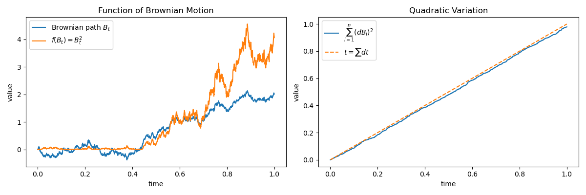

# Taylor Expansion II: Quadratic Approximation

The previous section showed that linear approximations capture local slope. However, many functions bend, and the tangent line cannot capture this curvature.

Quadratic approximation extends this idea by incorporating curvature through **second-order terms**.

Geometrically:

* **Linear approximation** gives a **tangent line** (or tangent plane).
* **Quadratic approximation** gives the **best local quadratic approximation** (or curved surface).

Including the quadratic term allows the approximation to follow the curvature of the function more closely near the expansion point.

---

### Quadratic Approximation in One Variable

Extending the linear approximation from the previous section, we include a second-order term. If \(f\) is twice differentiable near \(x_0\), we can write the **second-order Taylor approximation** as

\[
f(x) \approx
f(x_0)
+ f'(x_0)(x-x_0)
+ \frac12 f''(x_0)(x-x_0)^2.
\]

Using increment notation,

\[
\Delta f
\approx
f'(x_0)\Delta x
+
\frac12 f''(x_0)(\Delta x)^2,
\]

where

\[
\Delta x = x-x_0.
\]

The second term captures the **curvature of the function near the expansion point**.

---

### Python Example: Quadratic Approximation in 1D

#### 1. Problem

Approximate \(f(1.1)\) using the quadratic approximation at \(x_0=1\), where

\[
f(x)=e^{x-1}+(x-1)^2.
\]

This example is useful because the exponential term introduces curvature while the polynomial keeps the derivatives simple.

#### 2. Solution

First compute derivatives.

\[
f'(x)=e^{x-1}+2(x-1)
\]

\[
f''(x)=e^{x-1}+2
\]

Evaluate them at \(x_0=1\):

\[
f(1)=1,\qquad f'(1)=1,\qquad f''(1)=3
\]

Let \(\Delta x = 1.1-1 = 0.1\). The quadratic approximation gives

\[
f(1.1)
\approx
1 + 1(0.1) + \frac12 \cdot 3 (0.1)^2
= 1.115
\]

The true value is \(f(1.1)=e^{0.1}+0.01\approx1.11517\). Compared with the linear approximation (which gives \(1.1\)), the quadratic approximation reduces the error from \(\approx 0.015\) to \(\approx 0.00017\) — a reduction of roughly two orders of magnitude — illustrating how the second-order term captures **local curvature**.

---

### Python Visualization

```python
import matplotlib.pyplot as plt
import numpy as np

x = np.linspace(0., 2.)

# original function
f = np.exp(x - 1) + (x - 1)**2

# quadratic approximation at x=1: f(1) + f'(1)(x-1) + 0.5*f''(1)*(x-1)^2
# f(1)=1, f'(1)=1, f''(1)=3, so 0.5*f''(1)=1.5
h = 1 + (x-1) + 1.5*(x-1)**2

fig, ax = plt.subplots(figsize=(12,6))

ax.plot(1, 1, 'or', label=r'Expansion point ($x=1$)')
ax.plot(x, f, color='steelblue', label=r'Original: $f(x)=e^{x-1}+(x-1)^2$')
ax.plot(x, h, color='orange', linestyle='--', label=r'Quadratic approximation')

ax.set_title("Original Function vs Quadratic Approximation at x=1")
ax.set_xlabel("x")
ax.set_ylabel("y")

ax.grid(True, alpha=0.3)
ax.legend(loc=(0.1, 0.7))
ax.set_ylim(0, 4)

for spine in ["top","right"]:
    ax.spines[spine].set_visible(False)

for spine in ["bottom","left"]:
    ax.spines[spine].set_position("zero")

plt.tight_layout()
plt.show()
```


*Figure 1. Quadratic approximation of \(f(x)=e^{x-1}+(x-1)^2\) at \(x=1\). The blue curve shows the original function, the dashed orange curve is the quadratic Taylor approximation, and the red dot marks the expansion point.*

Near the expansion point the two curves are almost identical. The quadratic curve follows the original function much more closely than the tangent line, illustrating how second-order terms capture **local curvature**.

---

### Quadratic Approximation in Two Variables

For a twice differentiable function \(f(t,b)\), the second-order Taylor expansion includes both **pure second derivatives** and **cross derivatives**.

\[
\Delta f
\approx
f_t\Delta t
+
f_b\Delta b
+
\frac12 f_{tt}(\Delta t)^2
+
\frac12 f_{bb}(\Delta b)^2
+
f_{tb}\Delta t\Delta b
\]

This expansion describes how the surface bends in different directions.

In compact matrix form:

\[
f(x) \approx
f(x_0)
+
\nabla f(x_0)^T(x-x_0)
+
\frac12 (x-x_0)^T H (x-x_0),
\]

where \(H\) is the **Hessian matrix**, the matrix of all second-order partial derivatives of \(f\). It describes how the function bends in different directions.

---

### Python Example: Quadratic Approximation in 2D

#### 1. Problem

Approximate \(f(1.1,1.8)\) using the quadratic approximation at

\[
(t_0,b_0)=(1,2)
\]

where

\[
f(t,b)=e^{t-1}+(t-1)^2+(b-2)^2.
\]

#### 2. Solution

First compute partial derivatives:

\[
f_t=e^{t-1}+2(t-1),\qquad f_b=2(b-2)
\]

Second derivatives:

\[
f_{tt}=e^{t-1}+2,\qquad f_{bb}=2,\qquad f_{tb}=0
\]

Since \(t\) and \(b\) enter the function separately (no cross term), the cross-partial \(f_{tb}=0\), and the cross term in the expansion vanishes.

Evaluate at \((1,2)\):

\[
f(1,2)=1,\qquad f_t(1,2)=1,\qquad f_b(1,2)=0,\qquad f_{tt}(1,2)=3,\qquad f_{bb}(1,2)=2
\]

Let \(\Delta t=0.1\) and \(\Delta b=1.8-2=-0.2\). Substituting all four terms into the expansion explicitly:

\[
f(1.1,1.8)
\approx
\underbrace{1}_{f}
+\underbrace{1(0.1)}_{f_t\Delta t}
+\underbrace{0(-0.2)}_{f_b\Delta b}
+\underbrace{\frac12(3)(0.1)^2}_{0.015}
+\underbrace{\frac12(2)(0.2)^2}_{0.04}
= 1.155
\]

Note that $|\Delta b| = 0.2$ so $\frac12 f_{bb}(\Delta b)^2 = \frac12(2)(0.04) = 0.04$, not $0.2$.

---

### Python Visualization

```python
import matplotlib.pyplot as plt
import numpy as np
from matplotlib.lines import Line2D

t = np.linspace(0.,2.)
b = np.linspace(1.,3.)

T,B = np.meshgrid(t,b)

# original function
F = np.exp(T-1)+(T-1)**2+(B-2)**2

# quadratic approximation: f(1,2) + f_t*(T-1) + 0.5*f_tt*(T-1)^2 + 0.5*f_bb*(B-2)^2
H = 1 + (T-1) + 1.5*(T-1)**2 + (B-2)**2

fig,ax = plt.subplots(figsize=(10,6),subplot_kw={'projection':'3d'})

ax.plot_surface(T,B,F,alpha=0.7,color="b")
ax.plot_surface(T,B,H,alpha=0.4,color="orange")

# expansion point
i = np.abs(b-2).argmin()
j = np.abs(t-1).argmin()
z = F[i,j]

ax.scatter(t[j],b[i],z,color='red',s=80)

ax.set_title("Original Function vs Quadratic Approximation")
ax.set_xlabel("t")
ax.set_ylabel("b")
ax.set_zlabel("f(t,b)")

custom_lines=[
Line2D([0],[0],color='red',marker='o',linestyle='None',label='Expansion point'),
Line2D([0],[0],color='b',lw=3,label='Original surface'),
Line2D([0],[0],color='orange',lw=3,label='Quadratic approximation surface')
]

ax.legend(handles=custom_lines,loc=(0.0,0.8))
ax.view_init(elev=30,azim=-70)

plt.tight_layout()
plt.show()
```


*Figure 2. Quadratic Taylor approximation of the surface \(f(t,b)=e^{t-1}+(t-1)^2+(b-2)^2\) at \((1,2)\). The blue surface represents the original function and the orange surface represents the quadratic approximation. The red dot marks the expansion point.*

Near the expansion point the quadratic surface follows the original function very closely, capturing curvature that the tangent plane misses.

---

Quadratic Taylor expansions play a crucial role in many areas of mathematics. In stochastic calculus, second-order terms become essential because random fluctuations produce non-negligible quadratic effects — an idea that leads directly to **Itô's lemma**.

#### Deterministic vs Brownian Scaling

In deterministic calculus, the quadratic term becomes extremely small as increments shrink. If a variable changes by a small amount \(dt\), then the square of the increment is negligible:

\[
(dt)^2 \ll dt
\]

For this reason, quadratic terms are typically ignored in first-order approximations.

Brownian motion behaves differently. Over a short time interval \(dt\), the increment of a Brownian motion satisfies

\[
\Delta B_t \sim \sqrt{dt}
\]

Because the increment scales with the square root of time, its square satisfies

\[
(\Delta B_t)^2 \sim dt
\]

This scaling is made precise via the quadratic variation of Brownian motion; see [From Taylor to Itô](from_taylor_to_ito.md) and [Quadratic Variation of Brownian Motion](../../ch02/brownian_motion/quadratic_variation_of_brownian_motion.md) for the rigorous statement.

To illustrate these ideas, we simulate a Brownian path and examine both a nonlinear transformation and its quadratic variation.

```python
import numpy as np
import matplotlib.pyplot as plt

# simulation parameters
T = 1
N = 2000
dt = T / N

# fix seed for reproducibility
np.random.seed(42)

# Brownian increments and path
dB = np.sqrt(dt) * np.random.randn(N)
B = np.concatenate(([0], np.cumsum(dB)))

# nonlinear function
F = B**2

# time grids
t_path = np.linspace(0, T, N + 1)
t_incr = np.linspace(dt, T, N)

# quadratic variation and cumulative time
qv = np.cumsum(dB**2)
cum_dt = np.cumsum(np.full(N, dt))

# figure with two axes
fig, (ax1, ax2) = plt.subplots(
    1, 2, figsize=(12, 4)
)

# left plot: Brownian path and transformed path
ax1.plot(t_path, B, label=r"Brownian path $B_t$")
ax1.plot(t_path, F, label=r"$f(B_t)=B_t^2$")
ax1.set_title("Function of Brownian Motion")
ax1.set_xlabel("time")
ax1.set_ylabel("value")
ax1.legend()

# right plot: quadratic variation
ax2.plot(t_incr, qv, label=r"Quadratic variation $\sum(\Delta B_i)^2$")
ax2.plot(t_incr, cum_dt, "--", label=r"Cumulative time $t = \sum dt$")
ax2.set_title("Quadratic Variation")
ax2.set_xlabel("time")
ax2.set_ylabel("value")
ax2.legend()

plt.tight_layout()
plt.show()
```



*Figure 3. Left: a simulated Brownian path \(B_t\) and the transformed process \(B_t^2\). Right: the cumulative squared increments \(\sum (\Delta B_i)^2\) compared with cumulative time \(t = \sum dt\). The close agreement in the right panel illustrates that $(\Delta B_t)^2 \sim \Delta t$, motivating why the squared increment cannot be ignored when expanding functions of Brownian motion.*

Unlike deterministic calculus, the squared increment does **not** vanish. This is why quadratic terms cannot be ignored when expanding functions of Brownian motion. This phenomenon leads directly to the modified Taylor expansion known as **Itô's lemma**.
