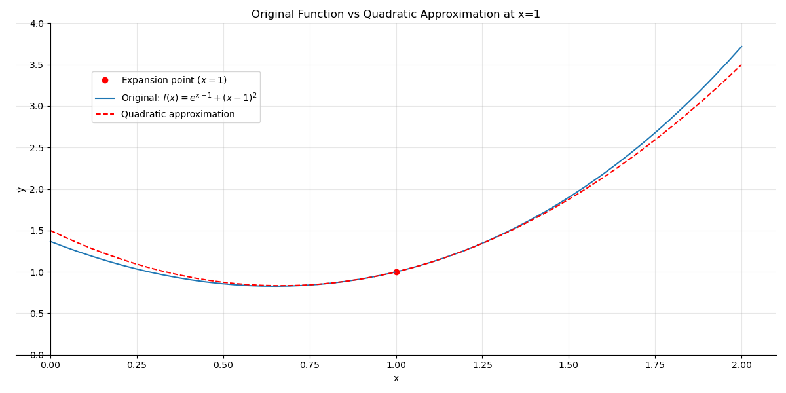
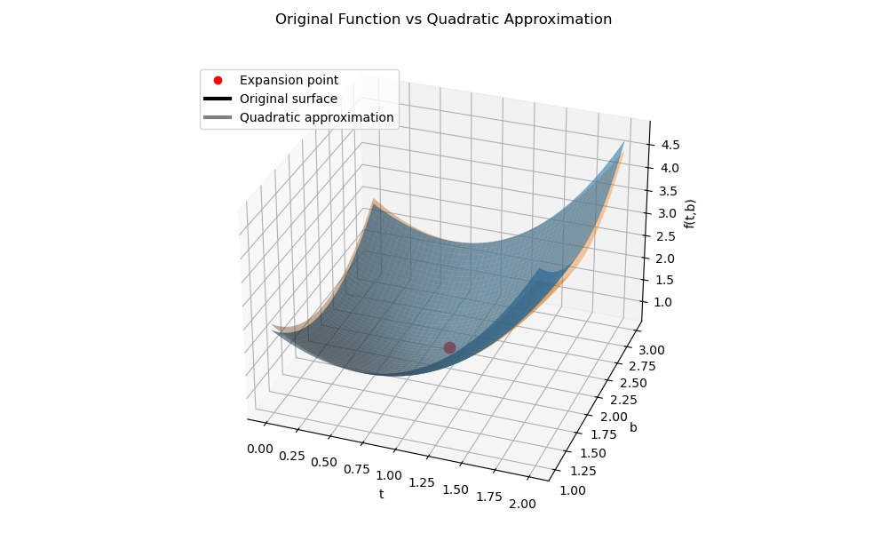

# Taylor Expansion II: Quadratic Approximation

Linear approximation captures only the **first-order change** of a function near a point.
However, many functions bend, and the tangent line cannot capture this curvature.

Quadratic approximation improves the local model by adding **second-order terms** that capture curvature.

Geometrically:

* **Linear approximation** gives a **tangent line** (or tangent plane).
* **Quadratic approximation** gives the **best local quadratic approximation** (or curved surface).

Including the quadratic term allows the approximation to follow the curvature of the function more closely near the expansion point.

---

## Quadratic Approximation in One Variable

Extending the linear approximation from the previous section, we include a second-order term. For a twice differentiable function \(f(x)\), the **second-order Taylor approximation** around a point \(x_0\) is

\[
f(x) \approx
f(x_0)
+ f'(x_0)(x-x_0)
+ \frac12 f''(x_0)(x-x_0)^2.
\]

Using increment notation,

\[
\Delta f
\approx
f'(x_0)\Delta x
+
\frac12 f''(x_0)(\Delta x)^2,
\]

where

\[
\Delta x = x-x_0.
\]

The second term captures the **curvature of the function near the expansion point**.

---

## Python Example: Quadratic Approximation in 1D

### 1. Problem

Approximate \(f(1.1)\) using the quadratic approximation at \(x_0=1\), where

\[
f(x)=e^{x-1}+(x-1)^2.
\]

This example is useful because the exponential term introduces curvature while the polynomial keeps the derivatives simple.

### 2. Solution

First compute derivatives.

\[
f'(x)=e^{x-1}+2(x-1)
\]

\[
f''(x)=e^{x-1}+2
\]

Evaluate them at \(x_0=1\):

\[
f(1)=1,\qquad f'(1)=1,\qquad f''(1)=3
\]

Let \(\Delta x = 1.1-1 = 0.1\). The quadratic approximation gives

\[
f(1.1)
\approx
1 + 1(0.1) + \frac12 \cdot 3 (0.1)^2
= 1.115
\]

The true value is \(f(1.1)=e^{0.1}+0.01\approx1.11517\), so the quadratic approximation is **extremely accurate near the expansion point**. The linear approximation gave 1.1, while the quadratic approximation gives 1.115, which is much closer to the true value.

---

## Python Visualization

```python
import matplotlib.pyplot as plt
import numpy as np

x = np.linspace(0., 2.)

# original function
f = np.exp(x - 1) + (x - 1)**2

# quadratic approximation at x=1
h = x + 1.5*(x-1)**2

fig, ax = plt.subplots(figsize=(12,6))

ax.plot(1,1,'or',label=r'Expansion point ($x=1$)')
ax.plot(x,f,label=r'Original: $f(x)=e^{x-1}+(x-1)^2$')
ax.plot(x,h,'r--',label=r'Quadratic approximation')

ax.set_title("Original Function vs Quadratic Approximation at x=1")
ax.set_xlabel("x")
ax.set_ylabel("y")

ax.grid(True,alpha=0.3)
ax.legend(loc=(0.1,0.7))
ax.set_ylim(0,4)

for spine in ["top","right"]:
    ax.spines[spine].set_visible(False)

for spine in ["bottom","left"]:
    ax.spines[spine].set_position("zero")

plt.tight_layout()
plt.show()
```



*Figure 1. Quadratic approximation of \(f(x)=e^{x-1}+(x-1)^2\) at \(x=1\). The black curve shows the original function, the dashed red curve is the quadratic Taylor approximation, and the red dot marks the expansion point.*

Near the expansion point the two curves are almost identical. The quadratic curve follows the original function much more closely than the tangent line, illustrating how second-order terms capture **local curvature**. This approximation is significantly more accurate than the tangent-line approximation from the previous section.

---

## Quadratic Approximation in Two Variables

For a twice differentiable function \(f(t,b)\), the second-order Taylor expansion includes both **pure second derivatives** and **cross derivatives**.

\[
\Delta f
\approx
f_t\Delta t
+
f_b\Delta b
+
\frac12 f_{tt}(\Delta t)^2
+
\frac12 f_{bb}(\Delta b)^2
+
f_{tb}\Delta t\Delta b
\]

This expansion describes how the surface bends in different directions.

In compact matrix form:

\[
f(x) \approx
f(x_0)
+
\nabla f(x_0)^T(x-x_0)
+
\frac12 (x-x_0)^T H (x-x_0),
\]

where \(H\) is the **Hessian matrix** containing all second-order partial derivatives.

---

## Python Example: Quadratic Approximation in 2D

### 1. Problem

Approximate \(f(1.1,1.8)\) using the quadratic approximation at

\[
(t_0,b_0)=(1,2)
\]

where

\[
f(t,b)=e^{t-1}+(t-1)^2+(b-2)^2.
\]

### 2. Solution

First compute partial derivatives:

\[
f_t=e^{t-1}+2(t-1),\qquad f_b=2(b-2)
\]

Second derivatives:

\[
f_{tt}=e^{t-1}+2,\qquad f_{bb}=2,\qquad f_{tb}=0
\]

Evaluate at \((1,2)\):

\[
f(1,2)=1,\qquad f_t(1,2)=1,\qquad f_b(1,2)=0,\qquad f_{tt}(1,2)=3,\qquad f_{bb}(1,2)=2
\]

Let \(\Delta t=0.1\) and \(\Delta b=-0.2\). Substitute into the expansion:

\[
f(1.1,1.8)
\approx
1
+1(0.1)
+\frac12(3)(0.1)^2
+\frac12(2)(0.2)^2
= 1.155
\]

---

## Python Visualization

```python
import matplotlib.pyplot as plt
import numpy as np
from matplotlib.lines import Line2D

t = np.linspace(0.,2.)
b = np.linspace(1.,3.)

T,B = np.meshgrid(t,b)

# original function
F = np.exp(T-1)+(T-1)**2+(B-2)**2

# quadratic approximation
H = T + 1.5*(T-1)**2 + (B-2)**2

fig,ax = plt.subplots(figsize=(10,6),subplot_kw={'projection':'3d'})

ax.plot_surface(T,B,F,alpha=0.6)
ax.plot_surface(T,B,H,alpha=0.4)

# expansion point
i = np.abs(b-2).argmin()
j = np.abs(t-1).argmin()
z = F[i,j]

ax.scatter(t[j],b[i],z,color='red',s=80)

ax.set_title("Original Function vs Quadratic Approximation")
ax.set_xlabel("t")
ax.set_ylabel("b")
ax.set_zlabel("f(t,b)")

custom_lines=[
Line2D([0],[0],color='red',marker='o',linestyle='None',label='Expansion point'),
Line2D([0],[0],color='black',lw=3,label='Original surface'),
Line2D([0],[0],color='gray',lw=3,label='Quadratic approximation surface')
]

ax.legend(handles=custom_lines,loc=(0.0,0.8))
ax.view_init(elev=30,azim=-70)

plt.tight_layout()
plt.show()
```



*Figure 2. Quadratic Taylor approximation of the surface \(f(t,b)=e^{t-1}+(t-1)^2+(b-2)^2\) at \((1,2)\). The black surface represents the original function and the gray surface represents the quadratic approximation.*

Near the expansion point the quadratic surface follows the original function very closely, capturing curvature that the tangent plane misses.

---

Quadratic Taylor expansions play a crucial role in many areas of mathematics. In stochastic calculus, second-order terms become essential because random fluctuations produce non-negligible quadratic effects—an idea that leads directly to **Itô's lemma**.
