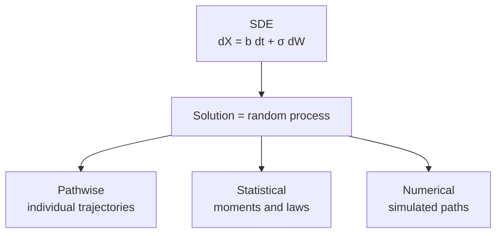

# Stochastic Differential Equations

This section develops the theory of SDEs from definition through solution, verification, analytical methods, moment analysis, and numerical simulation.

The entire section pivots on a single shift in perspective:

> Unlike ODEs, solving an SDE means describing a **random process**, not a single deterministic function.

Everything that follows — the four senses of solution, the analytical techniques, the moment formulas, the numerical schemes — is a consequence of this one distinction.

---

## Three Ways to Understand an SDE

A stochastic differential equation can be approached from three complementary viewpoints. Each supplies what the others cannot.

| Viewpoint | What it describes | Typical output |
| --------- | ----------------- | -------------- |
| **Pathwise** | individual sample trajectories | $X_t$ as an explicit function of $W_t$ |
| **Statistical** | distributional summaries | moments, transition laws, stationary distributions |
| **Numerical** | finite approximations | Monte Carlo paths, empirical expectations |

An explicit pathwise formula, when available, is the strongest result — but most SDEs admit none. Moment analysis delivers useful summary statistics even without closed-form solutions. Numerical simulation handles the remaining cases, including models where the distribution itself is intractable.

---

## Section Roadmap

The pages follow a deliberate progression. Each answers **exactly one question** — other pages reference rather than re-derive.

| Page | One-line role |
| ---- | ------------- |
| **SDE** | what is an SDE |
| **Understanding SDE Solutions** | what is a solution |
| **Verifying SDE Solutions** | how to check a candidate |
| **Solving SDEs** | how to derive a solution |
| **Moment Analysis of SDEs** | how to summarize distributional behavior |
| **SDE Simulation** | how to approximate numerically |

### SDE — what an SDE is

Defines the Itô SDE, the drift and diffusion coefficients, and the integral formulation. Canonical models (Brownian motion with drift, geometric Brownian motion, Ornstein–Uhlenbeck) illustrate the main structural classes: additive noise, multiplicative noise, and mean reversion.

### Understanding SDE Solutions — conceptual anchor

Canonical home for the solution concept. Distinguishes four senses in which an SDE can be solved (explicit pathwise, distributional, PDE/generator, numerical), gives the formal definition of a strong solution, and introduces the transformation viewpoint that underpins every analytical technique.

### Verifying SDE Solutions — mechanics

How to check a proposed solution using Itô's lemma. Worked examples for GBM, OU, and CIR demonstrate the workflow: compute $dX_t$, match drift and diffusion, confirm the initial condition.

### Solving SDEs — toolbox

Direct integration, Itô transformations, integrating factors, and the Lamperti transform. A decision tree tells the reader which technique to try first based on the equation's structure.

### Moment Analysis of SDEs — statistical viewpoint

Expectations, variances, and higher moments via Itô isometry, moment ODEs, and the infinitesimal generator. Extracts quantitative information from SDEs even when no closed-form pathwise solution exists.

### SDE Simulation — numerical viewpoint

Euler–Maruyama, Milstein, log-Euler, exact schemes for GBM/OU/CIR, and multilevel Monte Carlo. Bridges the gap from discrete random walks to continuous SDEs, with convergence analysis and variance reduction.

---

## Conceptual Flow

!!! tip "Transitions between pages"

    - **After SDE**: the equation is defined — but what does it mean to solve it?
    - **After Understanding**: the solution concept is fixed. Two natural questions follow — how to check a candidate, and how to derive one.
    - **After Verifying**: the mechanics are in hand; the solving page systematizes the derivations.
    - **After Solving**: most SDEs have no closed form. The remaining pages turn to weaker characterizations — moments and numerical approximation.
    - **After Moment Analysis**: statistical summaries are available even without explicit solutions. But some models resist even that — leading to simulation.
    - **After Simulation**: all three viewpoints (pathwise, statistical, numerical) are accessible, and the reader can choose the right tool for a given equation.

---

## Role in the Chapter

The SDE section is the structural heart of Chapter 3. Preceding sections supply the machinery — Itô integration (§3.2), Itô's formula (§3.3) — while following sections probe the theory — existence and uniqueness (§3.5), diffusion processes (§3.6), infinitesimal generators. This section is where the objects of interest are defined and put to work.

Later chapters treat SDEs as a given and extend them in specific directions:

- **Chapter 4 (Girsanov)** — changes of measure that modify SDE drifts
- **Chapter 5 (PDEs in Finance)** — the Feynman–Kac bridge from SDEs to PDEs
- **Chapters 6+ (Black–Scholes and beyond)** — SDEs as the modeling language of derivative pricing

Three viewpoints, one equation: the pathwise trajectory, the probability distribution, and the simulated path are all ways of understanding the same stochastic differential equation.
