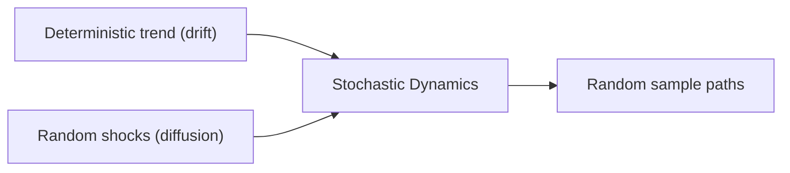
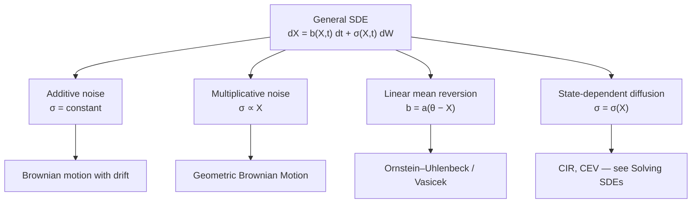

# Stochastic Differential Equations

Many real systems evolve under the influence of both **deterministic trends** and **random fluctuations**. Financial prices respond to unpredictable market forces, physical particles are buffeted by thermal noise, and biological populations vary due to random births and deaths.

A **stochastic differential equation (SDE)** provides a mathematical framework for describing systems whose evolution combines deterministic trends with random fluctuations. It extends an ordinary differential equation by including a random forcing term, typically represented by Brownian motion.

!!! abstract "Learning Goals"
    After completing this section you should be able to:

    - explain what a stochastic differential equation is and why stochastic dynamics arise in real systems
    - interpret the drift and diffusion terms in the equation
    - understand that the differential notation is shorthand for an integral equation involving an Itô stochastic integral
    - recognize the three canonical SDE models: Brownian motion with drift, geometric Brownian motion, and the Ornstein–Uhlenbeck process

---

## 1. What Is a Stochastic Differential Equation?

An **Itô stochastic differential equation** has the form

$$
dX_t = b(t, X_t)\,dt + \sigma(t, X_t)\,dW_t, \qquad X_0 = x
$$

where

| Symbol             | Name                      | Role                              |
| ------------------ | ------------------------- | --------------------------------- |
| $X_t$              | state process             | the quantity we model             |
| $b(t, X_t)$        | **drift** coefficient     | deterministic trend               |
| $\sigma(t, X_t)$   | **diffusion** coefficient | intensity of random fluctuation   |
| $W_t$              | Brownian motion           | source of randomness              |
| $x$                | initial condition         | fixed starting value (deterministic) |

The drift describes **where the process tends to go on average**, while the diffusion determines **how strongly randomness perturbs the system**.

An SDE specifies the **infinitesimal dynamics** of a stochastic process: over a small time interval $dt$, the change in the state $X_t$ is the sum of a deterministic drift component and a random fluctuation driven by Brownian motion.

### Integral Formulation

The differential notation $dX_t = \ldots$ is **shorthand** for an integral equation. The precise mathematical meaning is

$$
X_t = X_0 + \int_0^t b(s, X_s)\,ds + \int_0^t \sigma(s, X_s)\,dW_s
$$

The first integral is an ordinary deterministic integral. The second is an **Itô stochastic integral**, which accounts for the nondifferentiability of Brownian motion.

!!! warning "Important"
    The SDE should always be understood in the integral sense. The differential notation is a convenient shorthand, not a statement about derivatives.

### Why the Integral Form Is Necessary

Brownian motion paths are continuous but **nowhere differentiable** with probability one. Because of this irregular behavior, the derivative $dW_t/dt$ does not exist in the classical sense.

As a result, the expression $dX_t = b(t, X_t)\,dt + \sigma(t, X_t)\,dW_t$ cannot be interpreted using ordinary calculus. Instead, the equation must be understood through its **integral formulation**, where the stochastic term is defined using the Itô stochastic integral.

### Deterministic vs Stochastic Dynamics

| Feature         | Ordinary Differential Equation          | Stochastic Differential Equation                      |
| --------------- | --------------------------------------- | ----------------------------------------------------- |
| Driving force   | deterministic                           | deterministic + random                                |
| Equation form   | $dx_t = f(x_t, t)\,dt$                 | $dX_t = b(t, X_t)\,dt + \sigma(t, X_t)\,dW_t$       |
| Solution        | deterministic function                  | stochastic process                                    |
| Calculus        | ordinary calculus                       | Itô calculus                                          |

---

## 2. Canonical Examples

The general definition above encompasses many different stochastic models. Three classical examples illustrate the most common structures that arise in applications.

### Brownian Motion with Drift — Additive Noise

$$
dX_t = \mu\,dt + \sigma\,dW_t
$$

This is the simplest SDE: the drift and diffusion are **constants**, independent of the state $X_t$.

**Solution:**

$$
X_t = X_0 + \mu t + \sigma W_t
$$

**Properties:**

- $X_t$ is a **Gaussian process**
- $\mathbb{E}[X_t] = X_0 + \mu t$
- $\operatorname{Var}[X_t] = \sigma^2 t$

---

### Geometric Brownian Motion — Multiplicative Noise

$$
dS_t = \mu S_t\,dt + \sigma S_t\,dW_t
$$

Both drift and diffusion are **proportional to the state** — this is **multiplicative noise**. GBM is the foundation of the Black–Scholes model.

**Solution** (obtained by applying Itô's lemma to $\log S_t$):

$$
S_t = S_0 \exp\left[\left(\mu - \frac{\sigma^2}{2}\right)t + \sigma W_t\right]
$$

**Properties:**

- $S_t > 0$ always (prices stay positive)
- $S_t$ follows a **log-normal distribution**
- $\mathbb{E}[S_t] = S_0\,e^{\mu t}$
- The $-\sigma^2/2$ term is the **Itô correction**, which arises from the second-order term in Itô's lemma

---

### Ornstein–Uhlenbeck Process — Mean Reversion

$$
dX_t = a(\theta - X_t)\,dt + \sigma\,dW_t
$$

The drift pulls the process **toward a long-term mean** $\theta$ at speed $a > 0$. This is **mean reversion**.

**Solution** (obtained using the integrating factor method combined with Itô calculus):

$$
X_t = X_0\,e^{-at} + \theta(1 - e^{-at}) + \sigma \int_0^t e^{-a(t-s)}\,dW_s
$$

**Properties:**

- $\mathbb{E}[X_t] \to \theta$ as $t \to \infty$
- $\operatorname{Var}[X_t] \to \frac{\sigma^2}{2a}$ as $t \to \infty$
- **Stationary distribution:** $\mathcal{N}\!\left(\theta,\; \frac{\sigma^2}{2a}\right)$
- Used for **interest rate models** (Vasicek) and **physical systems**

These three models illustrate the most common structures in stochastic dynamics: additive noise, multiplicative noise, and mean-reverting systems.

!!! note "Notation Convention"
    Throughout this chapter, the OU mean-reversion speed is denoted $a$, the long-term mean $\theta$, and the volatility $\sigma$. These parameters appear consistently across the pages on solving, verifying, and moment analysis.

---

## 3. SDE Structure Classification

Different structures lead to different solution methods.

| Structure                 | Example               | Key Feature                         |
| ------------------------- | --------------------- | ----------------------------------- |
| **Additive noise**        | BM with drift         | volatility independent of state     |
| **Multiplicative noise**  | GBM                   | volatility proportional to state    |
| **Mean reversion**        | OU / Vasicek          | process pulled toward long-run mean |
| **State-dependent diffusion** | CIR, CEV          | volatility depends on state         |

Recognizing the structure of an SDE is the **first step in solving it**.

---

## 4. What It Means to Solve an SDE

Unlike ordinary differential equations, an SDE does not produce a single deterministic trajectory. Instead, it generates a **random family of paths**, each corresponding to a different realization of the Brownian motion $W_t$. Studying an SDE therefore involves analyzing both individual sample paths and the probability distributions they generate.

Solving an SDE means obtaining either

- an **explicit pathwise representation** of the process (a formula expressing $X_t$ in terms of $W_t$, $t$, and $X_0$), or
- an **exact characterization of its distribution** (the law, transition density, or moments of $X_t$)

Most SDEs **do not admit closed-form solutions**. When analytical solutions exist, they typically rely on transformations (log transform, integrating factor, Lamperti transform) that simplify the equation. When they do not exist, we turn to numerical simulation.

The key analytical tool is **Itô's lemma**, which replaces the ordinary chain rule in stochastic calculus. The extra second-derivative term — known as the Itô correction — is what distinguishes stochastic calculus from ordinary calculus.

---

## 5. Chapter Roadmap

This section develops SDE theory and methods across the following pages:

| Page | Topic | Key Ideas |
| ---- | ----- | --------- |
| **Understanding SDE Solutions** | solution concepts and existence theory | strong vs weak solutions, existence and uniqueness conditions |
| **Verifying SDE Solutions** | checking proposed solutions | Itô's lemma as a verification tool, worked examples |
| **Techniques for Solving SDEs** | analytical solution methods | direct integration, Itô transforms, integrating factors, Lamperti |
| **Moment Analysis** | computing expectations and variances | moment equations, Itô isometry, generator methods |
| **Simulation Methods** | numerical approximation | Euler–Maruyama, Milstein, exact simulation |

!!! summary "Key Takeaway"
    A stochastic differential equation extends ordinary differential equations by adding a Brownian motion term. The drift captures deterministic trends, the diffusion captures random fluctuations, and the interplay between them — governed by Itô calculus — produces phenomena that have no counterpart in deterministic mathematics.

---

## Exercises

**Exercise 1.** For each of the following SDEs, identify the drift coefficient $b(t, X_t)$ and the diffusion coefficient $\sigma(t, X_t)$, and classify the noise as additive or multiplicative.

(a) $dX_t = 3\,dt + 2\,dW_t$

(b) $dX_t = \mu X_t\,dt + \sigma X_t\,dW_t$

(c) $dX_t = (1 - X_t)\,dt + \sqrt{X_t}\,dW_t$

(d) $dX_t = \sin(t)\,dt + e^{-t}\,dW_t$

---

**Exercise 2.** Write the integral formulation corresponding to the SDE

$$
dX_t = (X_t + t)\,dt + X_t^2\,dW_t, \qquad X_0 = 1
$$

Explain why the differential notation is only shorthand and not a statement about derivatives.

---

**Exercise 3.** Consider the Ornstein–Uhlenbeck process $dX_t = 2(5 - X_t)\,dt + 3\,dW_t$ with $X_0 = 0$.

(a) What is the long-term mean $\mathbb{E}[X_t]$ as $t \to \infty$?

(b) What is the long-term variance $\operatorname{Var}[X_t]$ as $t \to \infty$?

(c) Write down the stationary distribution.

---

**Exercise 4.** For geometric Brownian motion $dS_t = 0.05\,S_t\,dt + 0.2\,S_t\,dW_t$ with $S_0 = 100$:

(a) Write down the explicit solution.

(b) Compute $\mathbb{E}[S_1]$ and $\operatorname{Var}[S_1]$.

(c) Explain why the exponent contains $\mu - \sigma^2/2$ rather than $\mu$.

---

**Exercise 5.** Classify each SDE into one of the four structural categories (additive noise, multiplicative noise, mean reversion, state-dependent diffusion) and state which solution technique you would try first.

(a) $dY_t = -0.5\,Y_t\,dt + 0.1\,dW_t$

(b) $dY_t = r\,Y_t\,dt + \sigma Y_t\,dW_t$

(c) $dY_t = \alpha(\beta - Y_t)\,dt + \gamma\sqrt{Y_t}\,dW_t$

(d) $dY_t = (2t + 1)\,dt + 4\,dW_t$

---

**Exercise 6.** Explain in your own words why an SDE produces a **family of random paths** rather than a single deterministic trajectory. How does this differ from an ordinary differential equation with the same drift term?
