# SDE Simulation

Most SDEs lack closed-form solutions, making **numerical simulation** essential for practical applications. This section develops simulation methods from first principles, starting with an intuitive discrete approximation and progressing to rigorous numerical schemes.

Every Python code block on this page is fully standalone: a reader can copy any single block into a fresh Python file or notebook cell and run it immediately without relying on earlier blocks.

!!! abstract "Learning Goals"
    After completing this section you should be able to:

    - understand how discrete random walks approximate continuous SDEs
    - implement the Euler-Maruyama scheme for general SDEs
    - explain strong and weak convergence and their practical implications
    - apply the Milstein scheme when the diffusion derivative is available
    - use exact simulation for GBM and Ornstein-Uhlenbeck processes
    - simulate multidimensional SDEs with correlated Brownian motions
    - apply variance reduction techniques to improve Monte Carlo efficiency

---

## 1. From Coin Flips to Brownian Motion

### Discrete Random Walk

Before simulating continuous SDEs, we build intuition through a **discrete random walk** that approximates Brownian motion.

**Setup:** Divide the time interval $[0, T]$ into $n$ equal steps of size $\Delta t = T/n$.

$$
\begin{array}{ccccccccccc}
S_0 && S_1 && S_2 && \cdots && S_n \\
t_0 & < & t_1 & < & t_2 & < & \cdots & < & t_n
\end{array}
$$

### Discretizing GBM

For the geometric Brownian motion SDE

$$
\frac{dS}{S} = \mu\,dt + \sigma\,dB_t
$$

we discretize at times $t_0 < t_1 < \cdots < t_n < t_{n+1}$:

$$
\begin{array}{ccccccccccccc}
\frac{dS}{S} & = & \mu & dt & + & \sigma & dB_t \\
\downarrow && \downarrow & \downarrow && \downarrow & \downarrow \\
\frac{S_{n+1} - S_n}{S_n} && \mu & \Delta t && \sigma & \Delta B_n
\end{array}
$$

where $\Delta B_n = B_{t_{n+1}} - B_{t_n} \sim \mathcal{N}(0, \Delta t)$.

**Key insight:** A simple random walk uses $\pm\sqrt{\Delta t}$ increments. As the step size shrinks, this converges to Brownian motion (Donsker's theorem). The actual Brownian increments are Gaussian, not Bernoulli, but the coin-flip model provides the correct intuition.

### Paper-and-Pencil Simulation

**Example:** Simulate GBM with $S_0 = 100$, $\mu = 0.10$, $\sigma = 0.30$, $T = 1$, $n = 10$ (so $\Delta t = 1/10$).

**Updating rule:**

$$
\begin{array}{ccccccccccccc}
\frac{dS}{S} & = & \mu & dt & + & \sigma & dB_t \\
\uparrow && \uparrow & \uparrow && \uparrow & \uparrow \\
\frac{S_{n+1} - S_n}{S_n} && 0.10 & \frac{1}{10} && 0.30 & \pm\sqrt{\frac{1}{10}}
\end{array}
$$

**Simulation table:**

$$
\begin{array}{lrrrrrrrrrrrrrr}
\text{Time} & 0/10 & 1/10 & 2/10 & 3/10 \\
\text{Coin flip} & - & H & H & T \\
\text{Conversion} & - & 1 & 1 & -1 \\
\text{Cum sum} & 0 & 1 & 2 & 1 \\
B_t & 0 & \frac{1}{\sqrt{10}} & \frac{2}{\sqrt{10}} & \frac{1}{\sqrt{10}} \\
dt & - & \frac{1}{10} & \frac{1}{10} & \frac{1}{10} \\
dB_t = B_t - B_{t-dt} & - & \frac{1}{\sqrt{10}} & \frac{1}{\sqrt{10}} & \frac{-1}{\sqrt{10}} \\
\mu \cdot dt + \sigma \cdot dB_t & - & \frac{0.1}{10} + \frac{0.3}{\sqrt{10}} & \frac{0.1}{10} + \frac{0.3}{\sqrt{10}} & \frac{0.1}{10} - \frac{0.3}{\sqrt{10}} \\
S_{t-dt} \cdot (\mu \cdot dt + \sigma \cdot dB_t) & - & 10.4868 & 11.5866 & -10.3602 \\
S_t = S_{t-dt} + S_{t-dt} \cdot (\mu \cdot dt + \sigma \cdot dB_t) & 100 & 110.4868 & 122.0734 & 111.7132 \\
\\
\text{Time} & 4/10 & 5/10 & 6/10 & 7/10 \\
\text{Coin flip} & H & T & T & H \\
\text{Conversion} & 1 & -1 & -1 & 1 \\
\text{Cum sum} & 2 & 1 & 0 & 1 \\
B_t & \frac{2}{\sqrt{10}} & \frac{1}{\sqrt{10}} & \frac{0}{\sqrt{10}} & \frac{1}{\sqrt{10}} \\
dt & \frac{1}{10} & \frac{1}{10} & \frac{1}{10} & \frac{1}{10} \\
dB_t = B_t - B_{t-dt} & \frac{1}{\sqrt{10}} & \frac{-1}{\sqrt{10}} & \frac{-1}{\sqrt{10}} & \frac{1}{\sqrt{10}} \\
\mu \cdot dt + \sigma \cdot dB_t & \frac{0.1}{10} + \frac{0.3}{\sqrt{10}} & \frac{0.1}{10} - \frac{0.3}{\sqrt{10}} & \frac{0.1}{10} - \frac{0.3}{\sqrt{10}} & \frac{0.1}{10} + \frac{0.3}{\sqrt{10}} \\
S_{t-dt} \cdot (\mu \cdot dt + \sigma \cdot dB_t) & 11.7152 & -10.4752 & -9.5861 & 10.8399 \\
S_t = S_{t-dt} + S_{t-dt} \cdot (\mu \cdot dt + \sigma \cdot dB_t) & 123.4284 & 112.9532 & 103.3671 & 114.2070 \\
\\
\text{Time} && 8/10 & 9/10 & 10/10 \\
\text{Coin flip} && H & H & T \\
\text{Conversion} && 1 & 1 & -1 \\
\text{Cum sum} && 2 & 3 & 2 \\
B_t && \frac{2}{\sqrt{10}} & \frac{3}{\sqrt{10}} & \frac{2}{\sqrt{10}} \\
dt && \frac{1}{10} & \frac{1}{10} & \frac{1}{10} \\
dB_t = B_t - B_{t-dt} && \frac{1}{\sqrt{10}} & \frac{1}{\sqrt{10}} & \frac{-1}{\sqrt{10}} \\
\mu \cdot dt + \sigma \cdot dB_t && \frac{0.1}{10} + \frac{0.3}{\sqrt{10}} & \frac{0.1}{10} + \frac{0.3}{\sqrt{10}} & \frac{0.1}{10} - \frac{0.3}{\sqrt{10}} \\
S_{t-dt} \cdot (\mu \cdot dt + \sigma \cdot dB_t) && 11.9767 & 13.2327 & -11.8320 \\
S_t = S_{t-dt} + S_{t-dt} \cdot (\mu \cdot dt + \sigma \cdot dB_t) && 126.1837 & 139.4164 & 127.5844
\end{array}
$$

**Result:** Starting from $S_0 = 100$, we end at $S_T \approx 127.58$ after 10 coin flips.

### From Discrete to Continuous

As $n \to \infty$ (i.e., $\Delta t \to 0$):

- The random walk converges to Brownian motion (by **Donsker's theorem**)
- The discrete stock prices converge to the solution of the SDE
- Coin flips $\{\pm 1\}$ become Gaussian increments $\mathcal{N}(0, \Delta t)$

This limiting process is the foundation of **Euler-Maruyama discretization**.

---

## 2. Euler-Maruyama Scheme

### Derivation

For a general SDE

$$
dX_t = b(t, X_t)\,dt + \sigma(t, X_t)\,dW_t, \quad X_0 = x
$$

integrate from $t_n$ to $t_{n+1}$:

$$
X_{t_{n+1}} = X_{t_n} + \int_{t_n}^{t_{n+1}} b(s, X_s)\,ds + \int_{t_n}^{t_{n+1}} \sigma(s, X_s)\,dW_s
$$

**Euler approximation:** Replace $X_s$ with $X_{t_n}$ (constant on $[t_n, t_{n+1}]$):

$$
X_{t_{n+1}} \approx X_{t_n} + b(t_n, X_{t_n})\Delta t + \sigma(t_n, X_{t_n})\Delta W_n
$$

where $\Delta t = t_{n+1} - t_n$ and $\Delta W_n = W_{t_{n+1}} - W_{t_n} \sim \mathcal{N}(0, \Delta t)$.

**Euler-Maruyama scheme:**

$$
X_{n+1} = X_n + b(t_n, X_n)\Delta t + \sigma(t_n, X_n)\Delta W_n
$$

### Algorithm

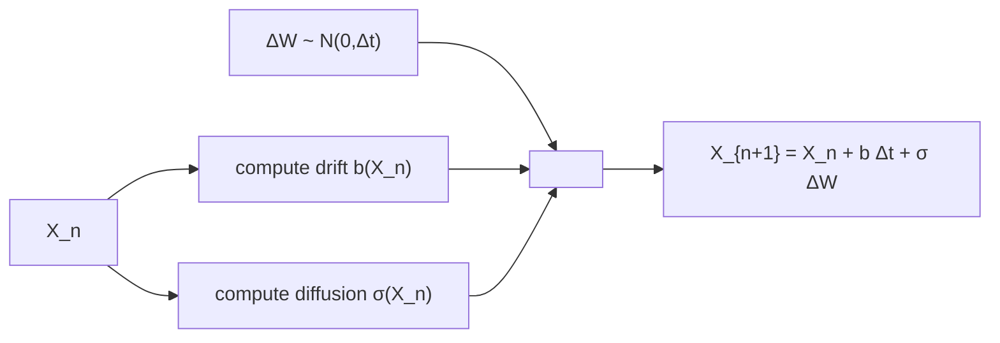

!!! note "Euler-Maruyama Algorithm"
    1. Set time grid: $t_n = n\Delta t$ for $n = 0, 1, \ldots, N$
    2. Initialize: $X_0 = x$
    3. For $n = 0, 1, \ldots, N-1$:
        - Generate $\Delta W_n \sim \mathcal{N}(0, \Delta t)$
        - Update: $X_{n+1} = X_n + b(t_n, X_n)\Delta t + \sigma(t_n, X_n)\Delta W_n$

### Example: Geometric Brownian Motion

```python
import numpy as np
import matplotlib.pyplot as plt

def euler_maruyama(b, sigma, X0, T, N, num_paths=1, seed=None):
    """
    Simulate the SDE
        dX_t = b(t, X_t) dt + sigma(t, X_t) dW_t
    using the Euler-Maruyama scheme.

    Parameters
    ----------
    b : callable
        Drift function b(t, x).
    sigma : callable
        Diffusion function sigma(t, x).
    X0 : float
        Initial value.
    T : float
        Terminal time.
    N : int
        Number of time steps.
    num_paths : int, optional
        Number of simulated sample paths.
    seed : int or None, optional
        Random seed for reproducibility.

    Returns
    -------
    t : np.ndarray
        Time grid of shape (N + 1,).
    X : np.ndarray
        Simulated paths of shape (num_paths, N + 1).
    """
    rng = np.random.default_rng(seed)
    dt = T / N
    t = np.linspace(0.0, T, N + 1)

    X = np.zeros((num_paths, N + 1), dtype=float)
    X[:, 0] = X0

    for path in range(num_paths):
        for n in range(N):
            dW = np.sqrt(dt) * rng.normal()
            X[path, n + 1] = (
                X[path, n]
                + b(t[n], X[path, n]) * dt
                + sigma(t[n], X[path, n]) * dW
            )

    return t, X


# === Geometric Brownian motion ===
# dS_t = mu S_t dt + sig S_t dW_t
mu = 0.10
sig = 0.20
S0 = 100.0
T = 1.0
N = 1000
num_paths = 20


def b(t, S):
    return mu * S


def sigma(t, S):
    return sig * S


t, S = euler_maruyama(b, sigma, S0, T, N, num_paths=num_paths, seed=123)

fig, ax = plt.subplots(figsize=(10, 6))
for i in range(num_paths):
    ax.plot(t, S[i], alpha=0.7)

ax.axhline(S0, linestyle="--", alpha=0.6, label=r"$S_0$")
ax.set_xlabel("Time $t$")
ax.set_ylabel("Stock price $S_t$")
ax.set_title("Geometric Brownian Motion via Euler-Maruyama")
ax.grid(True, alpha=0.3)
ax.legend()
plt.tight_layout()
plt.show()
```

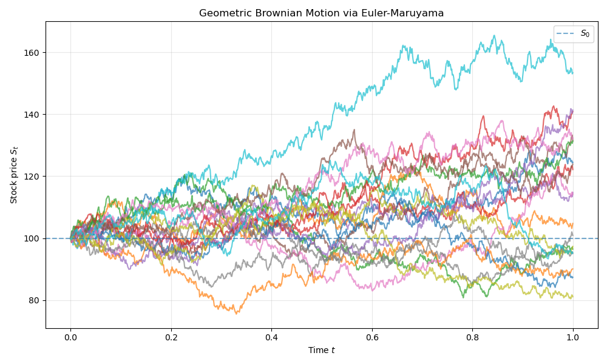

### Example: Ornstein-Uhlenbeck Process

```python
import numpy as np
import matplotlib.pyplot as plt

def euler_maruyama(b, sigma, X0, T, N, num_paths=1, seed=None):
    """
    Simulate the SDE
        dX_t = b(t, X_t) dt + sigma(t, X_t) dW_t
    using the Euler-Maruyama scheme.
    """
    rng = np.random.default_rng(seed)
    dt = T / N
    t = np.linspace(0.0, T, N + 1)

    X = np.zeros((num_paths, N + 1), dtype=float)
    X[:, 0] = X0

    for path in range(num_paths):
        for n in range(N):
            dW = np.sqrt(dt) * rng.normal()
            X[path, n + 1] = (
                X[path, n]
                + b(t[n], X[path, n]) * dt
                + sigma(t[n], X[path, n]) * dW
            )

    return t, X


# === Ornstein-Uhlenbeck process ===
# dX_t = kappa (theta - X_t) dt + sig dW_t
kappa = 2.0
theta = 1.0
sig = 0.30
X0 = 0.50
T = 2.0
N = 1000
num_paths = 20


def b(t, x):
    return kappa * (theta - x)


def sigma(t, x):
    return sig


t, X = euler_maruyama(b, sigma, X0, T, N, num_paths=num_paths, seed=123)

fig, ax = plt.subplots(figsize=(10, 6))
for i in range(num_paths):
    ax.plot(t, X[i], alpha=0.7)

ax.axhline(theta, linestyle="--", linewidth=2, label=rf"Long-run mean $\theta={theta}$")
ax.set_xlabel("Time $t$")
ax.set_ylabel(r"$X_t$")
ax.set_title("Ornstein-Uhlenbeck Process via Euler-Maruyama")
ax.grid(True, alpha=0.3)
ax.legend()
plt.tight_layout()
plt.show()
```

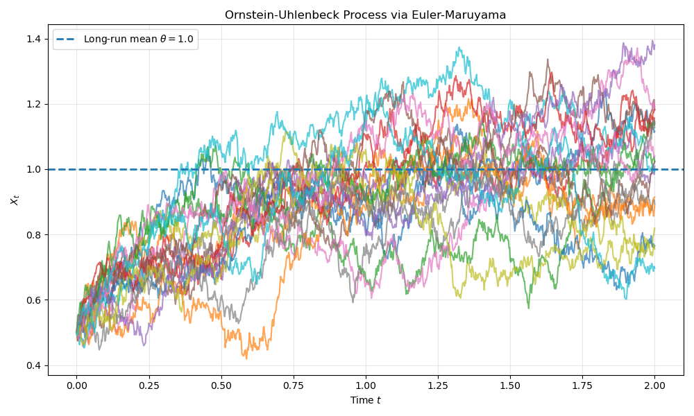

---

## 3. Convergence Analysis

### Strong Convergence

**Definition:** A numerical scheme has **strong convergence of order** $\gamma$ if

$$
\mathbb{E}[|X_T - X_T^{\Delta t}|] = O(\Delta t^\gamma)
$$

where $X_T$ is the true solution and $X_T^{\Delta t}$ is the numerical approximation.

**Theorem:** Under Lipschitz and growth conditions on $b$ and $\sigma$, the Euler-Maruyama scheme has **strong order** $\gamma = 0.5$:

$$
\mathbb{E}[|X_T - X_T^{\Delta t}|] \leq C\sqrt{\Delta t}
$$

**Interpretation:** To reduce error by a factor of 10, we need $\Delta t \to \Delta t / 100$ (100 times more steps).

### Weak Convergence

**Definition:** A scheme has **weak convergence of order** $\beta$ if for all sufficiently smooth functions $g$:

$$
|\mathbb{E}[g(X_T)] - \mathbb{E}[g(X_T^{\Delta t})]| = O(\Delta t^\beta)
$$

**Theorem:** Euler-Maruyama has **weak order** $\beta = 1.0$:

$$
|\mathbb{E}[g(X_T)] - \mathbb{E}[g(X_T^{\Delta t})]| \leq C\Delta t
$$

**Practical implication:** For computing expectations (e.g., option prices), Euler-Maruyama converges faster than for pathwise accuracy.

### Numerical Verification

To test strong convergence, we must compare Euler-Maruyama against the exact solution using **the same Brownian path**. We generate a fine reference path and construct coarser approximations by aggregating increments. The Brownian increments for the coarse grid are constructed by summing the fine-grid increments so that both schemes use the **same underlying Brownian path**.

```python
import numpy as np
import matplotlib.pyplot as plt

def convergence_test_gbm(num_paths=5000, seed=123):
    """
    Numerically verify strong convergence of Euler-Maruyama for GBM
    by comparing against the exact solution using the same Brownian paths.
    """
    rng = np.random.default_rng(seed)

    mu = 0.10
    sig = 0.20
    S0 = 100.0
    T = 1.0

    N_values = [10, 20, 40, 80, 160, 320, 640]
    N_ref = max(N_values)

    # Generate fine Brownian increments
    dt_ref = T / N_ref
    dW_ref = np.sqrt(dt_ref) * rng.normal(size=(num_paths, N_ref))

    # Exact terminal value from the same Brownian path
    W_T = dW_ref.sum(axis=1)
    S_exact = S0 * np.exp((mu - 0.5 * sig**2) * T + sig * W_T)

    errors = []

    for N in N_values:
        block = N_ref // N
        dt = T / N

        # Aggregate fine increments into coarse increments
        dW_coarse = dW_ref.reshape(num_paths, N, block).sum(axis=2)

        # Euler-Maruyama with coarse increments
        S = np.full(num_paths, S0, dtype=float)
        for n in range(N):
            S = S + mu * S * dt + sig * S * dW_coarse[:, n]

        error = np.mean(np.abs(S - S_exact))
        errors.append(error)

    dt_values = T / np.array(N_values, dtype=float)

    # Estimate convergence order via log-log regression
    coeffs = np.polyfit(np.log(dt_values), np.log(errors), 1)
    estimated_order = coeffs[0]

    fig, ax = plt.subplots(figsize=(8, 6))
    ax.loglog(dt_values, errors, "o-", label="Euler-Maruyama error")
    ax.loglog(
        dt_values,
        errors[0] * (dt_values / dt_values[0]) ** 0.5,
        "--",
        label=r"Reference slope $1/2$",
    )
    ax.set_xlabel(r"Step size $\Delta t$")
    ax.set_ylabel("Mean absolute terminal error")
    ax.set_title("Strong Convergence Test for Euler-Maruyama on GBM")
    ax.grid(True, alpha=0.3)
    ax.legend()
    plt.tight_layout()
    plt.show()

    print("N values:      ", N_values)
    print("Errors:        ", [f"{e:.6f}" for e in errors])
    print(f"Estimated strong order: {estimated_order:.3f}")


if __name__ == "__main__":
    convergence_test_gbm()
```

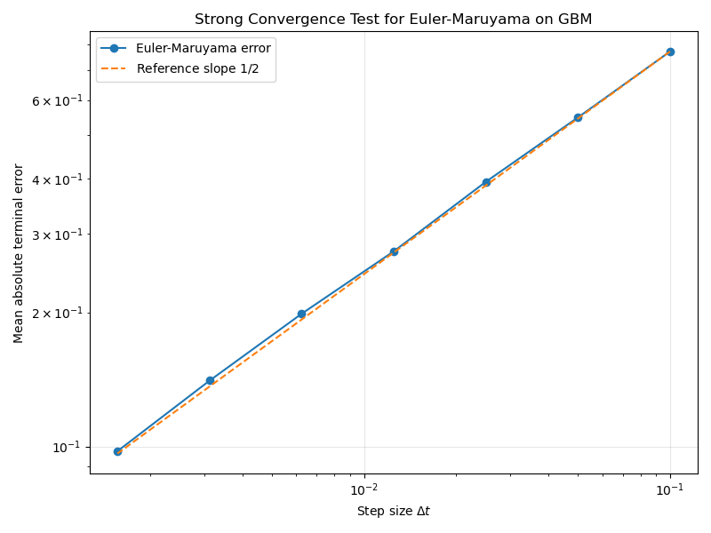

---

## 4. Milstein Scheme

### Motivation

Euler-Maruyama has strong order 0.5. Can we do better? The idea is to include more terms from the **Ito-Taylor expansion**.

### Ito-Taylor Expansion

For $Y_t = X_{t+\Delta t}$, expand using Ito's lemma:

$$
\begin{align}
dX_t &= b(X_t)\,dt + \sigma(X_t)\,dW_t \\
d\sigma(X_t) &= \sigma'(X_t)\,dX_t + \frac{1}{2}\sigma''(X_t)(dX_t)^2 \\
&= \sigma'(X_t)[b(X_t)\,dt + \sigma(X_t)\,dW_t] + \frac{1}{2}\sigma''(X_t)\sigma^2(X_t)\,dt
\end{align}
$$

Keeping terms up to order $\Delta t$:

$$
X_{t+\Delta t} = X_t + b(X_t)\Delta t + \sigma(X_t)\Delta W + \frac{1}{2}\sigma(X_t)\sigma'(X_t)[(\Delta W)^2 - \Delta t]
$$

### Milstein Scheme

$$
X_{n+1} = X_n + b(X_n)\Delta t + \sigma(X_n)\Delta W_n + \frac{1}{2}\sigma(X_n)\sigma'(X_n)[(\Delta W_n)^2 - \Delta t]
$$

**Key term:** $(\Delta W_n)^2 - \Delta t$ captures the **quadratic variation** correction.

### Convergence

**Theorem:** The Milstein scheme has:

- **Strong order** $\gamma = 1.0$ (vs. 0.5 for Euler-Maruyama)
- **Weak order** $\beta = 1.0$ (same as Euler-Maruyama)

### Example: GBM with Euler-Maruyama vs Milstein

```python
import numpy as np
import matplotlib.pyplot as plt

def euler_maruyama(b, sigma, X0, T, N, num_paths=1, seed=None):
    """Euler-Maruyama simulation for a scalar SDE."""
    rng = np.random.default_rng(seed)
    dt = T / N
    t = np.linspace(0.0, T, N + 1)

    X = np.zeros((num_paths, N + 1), dtype=float)
    X[:, 0] = X0

    for path in range(num_paths):
        for n in range(N):
            dW = np.sqrt(dt) * rng.normal()
            X[path, n + 1] = (
                X[path, n]
                + b(t[n], X[path, n]) * dt
                + sigma(t[n], X[path, n]) * dW
            )

    return t, X


def milstein(b, sigma, sigma_prime, X0, T, N, num_paths=1, seed=None):
    """Milstein simulation for a scalar SDE."""
    rng = np.random.default_rng(seed)
    dt = T / N
    t = np.linspace(0.0, T, N + 1)

    X = np.zeros((num_paths, N + 1), dtype=float)
    X[:, 0] = X0

    for path in range(num_paths):
        for n in range(N):
            dW = np.sqrt(dt) * rng.normal()
            x_n = X[path, n]
            correction = 0.5 * sigma(t[n], x_n) * sigma_prime(t[n], x_n) * (dW**2 - dt)
            X[path, n + 1] = (
                x_n + b(t[n], x_n) * dt + sigma(t[n], x_n) * dW + correction
            )

    return t, X


# === GBM parameters ===
mu = 0.10
sig = 0.20
S0 = 100.0
T = 1.0
N = 100
num_paths = 20


def b(t, S):
    return mu * S


def sigma(t, S):
    return sig * S


def sigma_prime(t, S):
    return sig


t_em, S_em = euler_maruyama(b, sigma, S0, T, N, num_paths=num_paths, seed=123)
t_mil, S_mil = milstein(b, sigma, sigma_prime, S0, T, N, num_paths=num_paths, seed=123)

fig, (ax1, ax2) = plt.subplots(1, 2, figsize=(14, 5))

for i in range(num_paths):
    ax1.plot(t_em, S_em[i], alpha=0.7)
ax1.set_title("Euler-Maruyama")
ax1.set_xlabel("Time $t$")
ax1.set_ylabel(r"$S_t$")
ax1.grid(True, alpha=0.3)

for i in range(num_paths):
    ax2.plot(t_mil, S_mil[i], alpha=0.7)
ax2.set_title("Milstein")
ax2.set_xlabel("Time $t$")
ax2.set_ylabel(r"$S_t$")
ax2.grid(True, alpha=0.3)

plt.tight_layout()
plt.show()
```

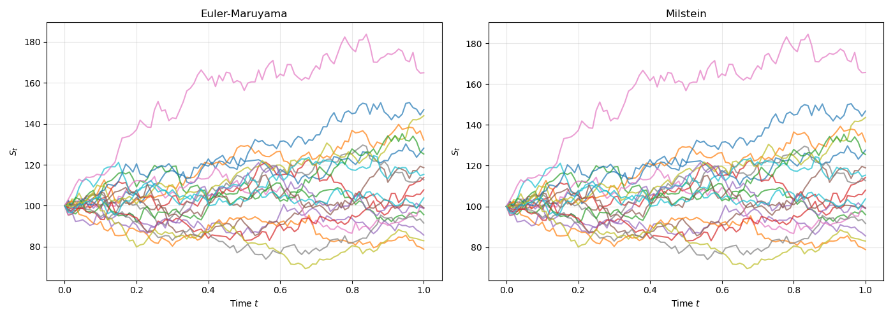

---

## 5. Exact Simulation

When closed-form solutions are available, we can simulate **without discretization error**. Only Monte Carlo error remains.

### Geometric Brownian Motion

The exact solution

$$
S_t = S_0 \exp\!\left[\left(\mu - \frac{\sigma^2}{2}\right)t + \sigma W_t\right]
$$

can be sampled directly by generating $W_t$.

### Ornstein-Uhlenbeck Process

The conditional distribution of the OU process is Gaussian:

$$
X_{t+\Delta t} \mid X_t \sim \mathcal{N}\!\left(X_t\,e^{-\kappa\Delta t} + \theta(1 - e^{-\kappa\Delta t}),\; \frac{\sigma^2}{2\kappa}(1 - e^{-2\kappa\Delta t})\right)
$$

For coding, this is equivalent to:

$$
X_{t+\Delta t} = X_t\,e^{-\kappa\Delta t} + \theta(1 - e^{-\kappa\Delta t}) + \sigma\sqrt{\frac{1 - e^{-2\kappa\Delta t}}{2\kappa}}\;Z, \qquad Z \sim \mathcal{N}(0, 1)
$$

This allows exact step-by-step simulation without any approximation error.

### Comparison: Exact OU vs Euler-Maruyama

```python
import numpy as np
import matplotlib.pyplot as plt

def euler_maruyama(b, sigma, X0, T, N, num_paths=1, seed=None):
    """Euler-Maruyama simulation for a scalar SDE."""
    rng = np.random.default_rng(seed)
    dt = T / N
    t = np.linspace(0.0, T, N + 1)

    X = np.zeros((num_paths, N + 1), dtype=float)
    X[:, 0] = X0

    for path in range(num_paths):
        for n in range(N):
            dW = np.sqrt(dt) * rng.normal()
            X[path, n + 1] = (
                X[path, n]
                + b(t[n], X[path, n]) * dt
                + sigma(t[n], X[path, n]) * dW
            )

    return t, X


def exact_ou(X0, kappa, theta, sigma, T, N, num_paths=1, seed=None):
    """Exact simulation of the Ornstein-Uhlenbeck process on a discrete grid."""
    rng = np.random.default_rng(seed)
    dt = T / N
    t = np.linspace(0.0, T, N + 1)

    X = np.zeros((num_paths, N + 1), dtype=float)
    X[:, 0] = X0

    exp_kappa_dt = np.exp(-kappa * dt)
    mean_coef = 1.0 - exp_kappa_dt
    var = (sigma**2 / (2.0 * kappa)) * (1.0 - np.exp(-2.0 * kappa * dt))
    std = np.sqrt(var)

    for path in range(num_paths):
        for n in range(N):
            mean = X[path, n] * exp_kappa_dt + theta * mean_coef
            X[path, n + 1] = mean + std * rng.normal()

    return t, X


# === OU parameters ===
kappa = 2.0
theta = 1.0
sig = 0.30
X0 = 0.50
T = 2.0
N = 50
num_paths = 5000


def b(t, x):
    return kappa * (theta - x)


def sigma_fn(t, x):
    return sig


t_exact, X_exact = exact_ou(X0, kappa, theta, sig, T, N, num_paths=num_paths, seed=123)
t_em, X_em = euler_maruyama(b, sigma_fn, X0, T, N, num_paths=num_paths, seed=123)

fig, ax = plt.subplots(figsize=(10, 6))
ax.hist(X_exact[:, -1], bins=50, density=True, alpha=0.5, label="Exact")
ax.hist(X_em[:, -1], bins=50, density=True, alpha=0.5, label="Euler-Maruyama")
ax.set_xlabel(r"$X_T$")
ax.set_ylabel("Density")
ax.set_title(f"OU Terminal Distribution Comparison (N = {N})")
ax.grid(True, alpha=0.3)
ax.legend()
plt.tight_layout()
plt.show()

print(f"Exact: mean = {np.mean(X_exact[:, -1]):.4f}, std = {np.std(X_exact[:, -1]):.4f}")
print(f"Euler-Maruyama: mean = {np.mean(X_em[:, -1]):.4f}, std = {np.std(X_em[:, -1]):.4f}")
```

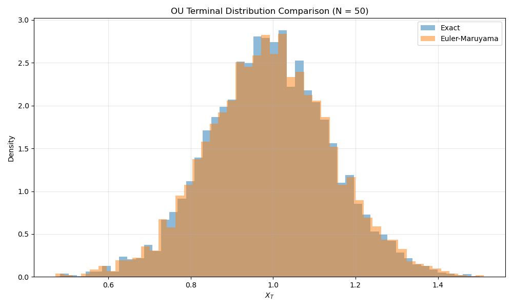

---

## 6. Advanced Schemes

### Predictor-Corrector Methods

A Heun-style predictor-corrector uses Euler to predict, then corrects using the average of drift and diffusion at both endpoints.

```python
import numpy as np
import matplotlib.pyplot as plt

def predictor_corrector(b, sigma, X0, T, N, num_paths=1, seed=None):
    """
    Heun-style predictor-corrector method for a scalar SDE

        dX_t = b(t, X_t) dt + sigma(t, X_t) dW_t

    Parameters
    ----------
    b : callable
        Drift function b(t, x).
    sigma : callable
        Diffusion function sigma(t, x).
    X0 : float
        Initial value.
    T : float
        Terminal time.
    N : int
        Number of time steps.
    num_paths : int, optional
        Number of simulated paths.
    seed : int or None, optional
        Random seed for reproducibility.

    Returns
    -------
    t : np.ndarray
        Time grid of shape (N + 1,).
    X : np.ndarray
        Simulated paths of shape (num_paths, N + 1).
    """
    rng = np.random.default_rng(seed)
    dt = T / N
    t = np.linspace(0.0, T, N + 1)

    X = np.zeros((num_paths, N + 1), dtype=float)
    X[:, 0] = X0

    for path in range(num_paths):
        for n in range(N):
            x_n = X[path, n]
            dW = np.sqrt(dt) * rng.normal()

            # Predictor step
            x_pred = x_n + b(t[n], x_n) * dt + sigma(t[n], x_n) * dW

            # Corrector step
            X[path, n + 1] = (
                x_n
                + 0.5 * (b(t[n], x_n) + b(t[n + 1], x_pred)) * dt
                + 0.5 * (sigma(t[n], x_n) + sigma(t[n + 1], x_pred)) * dW
            )

    return t, X


# === Example: Ornstein-Uhlenbeck process ===
kappa = 2.0
theta = 1.0
sig = 0.30
X0 = 0.50
T = 2.0
N = 1000
num_paths = 20


def b(t, x):
    return kappa * (theta - x)


def sigma(t, x):
    return sig


t, X = predictor_corrector(b, sigma, X0, T, N, num_paths=num_paths, seed=123)

fig, ax = plt.subplots(figsize=(10, 6))
for i in range(num_paths):
    ax.plot(t, X[i], alpha=0.7)

ax.axhline(theta, linestyle="--", linewidth=2, label=rf"Long-run mean $\theta={theta}$")
ax.set_xlabel("Time $t$")
ax.set_ylabel(r"$X_t$")
ax.set_title("Ornstein-Uhlenbeck Process via Predictor-Corrector")
ax.grid(True, alpha=0.3)
ax.legend()
plt.tight_layout()
plt.show()
```


---

## 7. Multidimensional SDEs

### System of SDEs

For $X_t = (X_t^1, \ldots, X_t^d)$ driven by $W_t = (W_t^1, \ldots, W_t^m)$:

$$
dX_t^i = b^i(t, X_t)\,dt + \sum_{j=1}^m \sigma^{ij}(t, X_t)\,dW_t^j
$$

### Correlated Brownian Motions

**Correlation structure:** $d\langle W^i, W^j \rangle_t = \rho_{ij}\,dt$

**Cholesky decomposition:** Write $W_t = L Z_t$ where $Z_t$ has independent components and $L L^T = \rho$.

```python
import numpy as np
import matplotlib.pyplot as plt

def correlated_BM(rho, T, N, num_paths=1, seed=None):
    """
    Generate correlated Brownian motions on a time grid.

    Parameters
    ----------
    rho : np.ndarray
        Correlation matrix of shape (d, d).
    T : float
        Terminal time.
    N : int
        Number of time steps.
    num_paths : int, optional
        Number of paths.
    seed : int or None, optional
        Random seed for reproducibility.

    Returns
    -------
    t : np.ndarray
        Time grid of shape (N + 1,).
    W : np.ndarray
        Brownian paths of shape (num_paths, d, N + 1).
    """
    rng = np.random.default_rng(seed)
    rho = np.asarray(rho, dtype=float)

    if rho.ndim != 2 or rho.shape[0] != rho.shape[1]:
        raise ValueError("rho must be a square correlation matrix.")

    d = rho.shape[0]
    dt = T / N
    t = np.linspace(0.0, T, N + 1)

    L = np.linalg.cholesky(rho)
    W = np.zeros((num_paths, d, N + 1), dtype=float)

    for path in range(num_paths):
        Z = rng.normal(size=(d, N))
        dW = np.sqrt(dt) * (L @ Z)
        W[path, :, 1:] = np.cumsum(dW, axis=1)

    return t, W


# === Example: 2D correlated Brownian motion ===
rho = np.array([
    [1.0, 0.7],
    [0.7, 1.0],
])

T = 1.0
N = 1000
num_paths = 1

t, W = correlated_BM(rho, T, N, num_paths=num_paths, seed=123)

fig, ax = plt.subplots(figsize=(10, 6))
for path in range(num_paths):
    ax.plot(t, W[path, 0], alpha=0.7, label="W1" if path == 0 else None)
    ax.plot(t, W[path, 1], alpha=0.7, linestyle="--", label="W2" if path == 0 else None)

ax.set_xlabel("Time $t$")
ax.set_ylabel("Brownian value")
ax.set_title("Sample Paths of Two Correlated Brownian Motions")
ax.grid(True, alpha=0.3)
ax.legend()
plt.tight_layout()
plt.show()

# Check empirical terminal correlation
terminal_corr = np.corrcoef(W[:, 0, -1], W[:, 1, -1])[0, 1]
print(f"Target correlation:    {rho[0, 1]:.3f}")
print(f"Empirical correlation: {terminal_corr:.3f}")
```

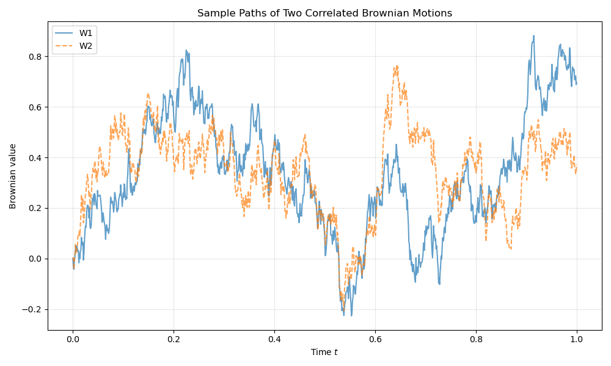

### Example: Heston Model

$$
\begin{cases}
dS_t = \mu S_t\,dt + \sqrt{V_t}\,S_t\,dW_t^1 \\
dV_t = \kappa(\theta - V_t)\,dt + \xi\sqrt{V_t}\,dW_t^2
\end{cases}
$$

with $d\langle W^1, W^2 \rangle_t = \rho\,dt$.

```python
import numpy as np
import matplotlib.pyplot as plt

def heston_euler(S0, V0, mu, kappa, theta, xi, rho, T, N, num_paths=1, seed=None):
    """
    Euler-Maruyama simulation for the Heston model with full truncation:

        dS_t = mu S_t dt + sqrt(V_t) S_t dW_t^1
        dV_t = kappa(theta - V_t) dt + xi sqrt(V_t) dW_t^2

    with corr(dW^1, dW^2) = rho.

    Parameters
    ----------
    S0, V0 : float
        Initial stock price and variance.
    mu, kappa, theta, xi, rho : float
        Heston parameters.
    T : float
        Terminal time.
    N : int
        Number of time steps.
    num_paths : int, optional
        Number of simulated paths.
    seed : int or None, optional
        Random seed for reproducibility.

    Returns
    -------
    t : np.ndarray
        Time grid.
    S : np.ndarray
        Simulated stock price paths, shape (num_paths, N + 1).
    V : np.ndarray
        Simulated variance paths, shape (num_paths, N + 1).
    """
    rng = np.random.default_rng(seed)
    dt = T / N
    t = np.linspace(0.0, T, N + 1)

    S = np.zeros((num_paths, N + 1), dtype=float)
    V = np.zeros((num_paths, N + 1), dtype=float)
    S[:, 0] = S0
    V[:, 0] = V0

    corr = np.array([[1.0, rho], [rho, 1.0]], dtype=float)
    L = np.linalg.cholesky(corr)

    for path in range(num_paths):
        for n in range(N):
            Z = rng.normal(size=2)
            dW = np.sqrt(dt) * (L @ Z)

            s_n = S[path, n]
            v_plus = max(V[path, n], 0.0)  # full truncation

            S[path, n + 1] = s_n + mu * s_n * dt + np.sqrt(v_plus) * s_n * dW[0]
            V[path, n + 1] = V[path, n] + kappa * (theta - v_plus) * dt + xi * np.sqrt(v_plus) * dW[1]

    return t, S, V


# === Example parameters ===
S0 = 100.0
V0 = 0.04
mu = 0.05
kappa = 2.0
theta = 0.04
xi = 0.30
rho = -0.7
T = 1.0
N = 1000
num_paths = 10

t, S, V = heston_euler(
    S0=S0, V0=V0, mu=mu, kappa=kappa, theta=theta,
    xi=xi, rho=rho, T=T, N=N, num_paths=num_paths, seed=123,
)

fig, (ax1, ax2) = plt.subplots(1, 2, figsize=(14, 5))

for i in range(num_paths):
    ax1.plot(t, S[i], alpha=0.7)
ax1.set_title("Heston Model: Stock Price Paths")
ax1.set_xlabel("Time $t$")
ax1.set_ylabel(r"$S_t$")
ax1.grid(True, alpha=0.3)

for i in range(num_paths):
    ax2.plot(t, V[i], alpha=0.7)
ax2.set_title("Heston Model: Variance Paths")
ax2.set_xlabel("Time $t$")
ax2.set_ylabel(r"$V_t$")
ax2.grid(True, alpha=0.3)

plt.tight_layout()
plt.show()

print(f"Final stock mean:      {np.mean(S[:, -1]):.4f}")
print(f"Final variance mean:   {np.mean(V[:, -1]):.4f}")
print(f"Minimum variance seen: {np.min(V):.6f}")
```


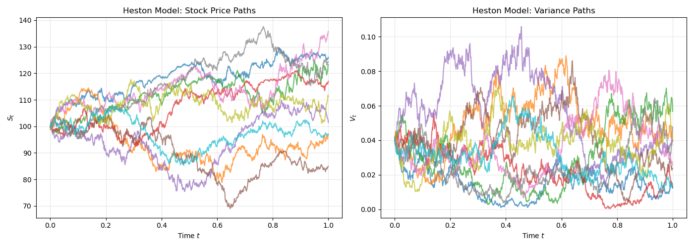


```text
Final stock mean:      111.8044
Final variance mean:   0.0315
Minimum variance seen: 0.000447
```

---

## 8. Error Sources and Variance Reduction

### Two Types of Error

**Total error = Discretization error + Monte Carlo error**

$$
\text{Error} \approx C_1 \Delta t^\gamma + \frac{C_2}{\sqrt{M}}
$$

where $\gamma$ is the strong convergence order and $M$ is the number of Monte Carlo paths.

### Optimal Allocation

To minimize computational cost for fixed error $\varepsilon$, balance the two error sources:

$$
\Delta t^\gamma \approx \frac{1}{\sqrt{M}}
$$

**For Euler-Maruyama** ($\gamma = 0.5$): $\Delta t \sim \varepsilon^{2/3}$, $M \sim \varepsilon^{-4/3}$, total cost $\sim \varepsilon^{-2}$.

**For Milstein** ($\gamma = 1.0$): total cost $\sim \varepsilon^{-5/3}$ (better).

### Antithetic Variates

For each path with increments $\Delta W_n$, simulate another with $-\Delta W_n$. The pair average has lower variance than independent paths.

```python
import numpy as np
import matplotlib.pyplot as plt

def euler_maruyama_antithetic(b, sigma, X0, T, N, num_paths=2, seed=None):
    """
    Euler-Maruyama with antithetic variates for a scalar SDE

        dX_t = b(t, X_t) dt + sigma(t, X_t) dW_t

    The function generates paths in pairs using increments dW and -dW.

    Parameters
    ----------
    b : callable
        Drift function b(t, x).
    sigma : callable
        Diffusion function sigma(t, x).
    X0 : float
        Initial value.
    T : float
        Terminal time.
    N : int
        Number of time steps.
    num_paths : int, optional
        Requested number of paths. Rounded down to the nearest even number.
    seed : int or None, optional
        Random seed.

    Returns
    -------
    t : np.ndarray
        Time grid.
    X : np.ndarray
        Simulated paths of shape (effective_num_paths, N + 1).
    """
    rng = np.random.default_rng(seed)
    dt = T / N
    t = np.linspace(0.0, T, N + 1)

    effective_num_paths = 2 * (num_paths // 2)
    if effective_num_paths == 0:
        raise ValueError("num_paths must be at least 2.")

    X = np.zeros((effective_num_paths, N + 1), dtype=float)
    X[:, 0] = X0

    for pair in range(effective_num_paths // 2):
        dW = np.sqrt(dt) * rng.normal(size=N)

        # Positive path
        for n in range(N):
            x_n = X[2 * pair, n]
            X[2 * pair, n + 1] = x_n + b(t[n], x_n) * dt + sigma(t[n], x_n) * dW[n]

        # Antithetic path
        for n in range(N):
            x_n = X[2 * pair + 1, n]
            X[2 * pair + 1, n + 1] = x_n + b(t[n], x_n) * dt + sigma(t[n], x_n) * (-dW[n])

    return t, X


# === Example: GBM with antithetic paths ===
mu = 0.10
sig = 0.20
S0 = 100.0
T = 1.0
N = 500
num_paths = 20


def b(t, S):
    return mu * S


def sigma(t, S):
    return sig * S


t, X = euler_maruyama_antithetic(b, sigma, S0, T, N, num_paths=num_paths, seed=123)

fig, ax = plt.subplots(figsize=(10, 6))
for i in range(X.shape[0]):
    ax.plot(t, X[i], alpha=0.7)

ax.set_xlabel("Time $t$")
ax.set_ylabel(r"$X_t$")
ax.set_title("GBM via Euler-Maruyama with Antithetic Variates")
ax.grid(True, alpha=0.3)
plt.tight_layout()
plt.show()

# Variance reduction diagnostic
pair_means = 0.5 * (X[0::2, -1] + X[1::2, -1])
plain_terminals = X[:, -1]

print(f"Number of simulated paths: {X.shape[0]}")
print(f"Mean terminal value (all paths):     {np.mean(plain_terminals):.4f}")
print(f"Mean terminal value (pair averages): {np.mean(pair_means):.4f}")
print(f"Std of terminal values:              {np.std(plain_terminals):.4f}")
print(f"Std of pair averages:                {np.std(pair_means):.4f}")
```

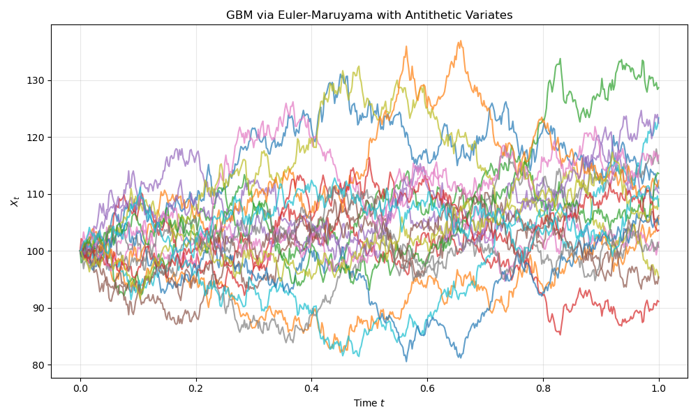


```text
Number of simulated paths: 20
Mean terminal value (all paths):     108.7344
Mean terminal value (pair averages): 108.7344
Std of terminal values:              9.4768
Std of pair averages:                0.4801
```

Other variance reduction techniques include **control variates** (using a known expectation to reduce variance) and **importance sampling** (changing measure to concentrate samples in the relevant region).

---

## 9. Practical Considerations

### Choosing the Time Step

1. **Accuracy requirement:** $\Delta t \lesssim \varepsilon^{2/\gamma}$ for target error $\varepsilon$
2. **Stability:** For mean-reverting SDEs, $\kappa \Delta t < 1$
3. **Non-negativity:** Euler-Maruyama may produce negative values for square-root processes such as CIR. Specialized schemes (full truncation, exact simulation) are preferred
4. **Computational budget:** Balance the number of time steps $N$ and paths $M$

### Scheme Comparison

```python
import numpy as np

def euler_maruyama_terminal_gbm(S0, mu, sig, T, N, num_paths, seed=None):
    rng = np.random.default_rng(seed)
    dt = T / N
    S = np.full(num_paths, S0, dtype=float)

    for _ in range(N):
        dW = np.sqrt(dt) * rng.normal(size=num_paths)
        S = S + mu * S * dt + sig * S * dW

    return S


def milstein_terminal_gbm(S0, mu, sig, T, N, num_paths, seed=None):
    rng = np.random.default_rng(seed)
    dt = T / N
    S = np.full(num_paths, S0, dtype=float)

    for _ in range(N):
        dW = np.sqrt(dt) * rng.normal(size=num_paths)
        correction = 0.5 * (sig * S) * sig * (dW**2 - dt)
        S = S + mu * S * dt + sig * S * dW + correction

    return S


def exact_terminal_gbm(S0, mu, sig, T, num_paths, seed=None):
    rng = np.random.default_rng(seed)
    W_T = np.sqrt(T) * rng.normal(size=num_paths)
    return S0 * np.exp((mu - 0.5 * sig**2) * T + sig * W_T)


mu = 0.10
sig = 0.20
S0 = 100.0
T = 1.0
N = 100
num_paths = 10000

S_exact = exact_terminal_gbm(S0, mu, sig, T, num_paths, seed=123)
S_em = euler_maruyama_terminal_gbm(S0, mu, sig, T, N, num_paths, seed=123)
S_mil = milstein_terminal_gbm(S0, mu, sig, T, N, num_paths, seed=123)

print(f"Exact:    mean = {np.mean(S_exact):.4f}, std = {np.std(S_exact):.4f}")
print(f"Euler:    mean = {np.mean(S_em):.4f}, std = {np.std(S_em):.4f}")
print(f"Milstein: mean = {np.mean(S_mil):.4f}, std = {np.std(S_mil):.4f}")

print("\nMean absolute error versus exact terminal distribution sample:")
print(f"Euler:    {np.mean(np.abs(S_em - S_exact)):.4f}")
print(f"Milstein: {np.mean(np.abs(S_mil - S_exact)):.4f}")
```


```text
Euler:    mean = 110.6295, std = 22.2744
Milstein: mean = 110.6284, std = 22.2810

Mean absolute error versus exact terminal distribution sample:
Euler:    23.7281
Milstein: 23.7279
```

---

## 10. Log-Euler Scheme for Geometric Brownian Motion

### Motivation

The Euler-Maruyama scheme applied directly to GBM can produce **negative prices** if the time step is large. A simple fix is to simulate the **log price** $X_t = \log S_t$.

Using Ito's lemma:

$$
dX_t = \left(\mu - \frac{\sigma^2}{2}\right)dt + \sigma\,dW_t
$$

Now the diffusion is **additive**, so Euler discretization is exact.

### Log-Euler Scheme

$$
S_{n+1} = S_n \exp\!\left[\left(\mu - \frac{\sigma^2}{2}\right)\Delta t + \sigma \Delta W_n\right]
$$

This guarantees $S_n > 0$ for all steps.

```python
import numpy as np
import matplotlib.pyplot as plt

def log_euler_gbm(S0, mu, sigma, T, N, num_paths=1, seed=None):
    """
    Log-Euler simulation for geometric Brownian motion.

        dS_t = mu S_t dt + sigma S_t dW_t

    Parameters
    ----------
    S0 : float
        Initial stock price.
    mu : float
        Drift parameter.
    sigma : float
        Volatility parameter.
    T : float
        Terminal time.
    N : int
        Number of time steps.
    num_paths : int, optional
        Number of simulated paths.
    seed : int or None, optional
        Random seed for reproducibility.

    Returns
    -------
    t : np.ndarray
        Time grid of shape (N + 1,).
    S : np.ndarray
        Simulated paths of shape (num_paths, N + 1).
    """
    rng = np.random.default_rng(seed)

    dt = T / N
    t = np.linspace(0, T, N + 1)

    S = np.zeros((num_paths, N + 1))
    S[:, 0] = S0

    for path in range(num_paths):
        for n in range(N):
            dW = np.sqrt(dt) * rng.normal()

            S[path, n + 1] = S[path, n] * np.exp(
                (mu - 0.5 * sigma**2) * dt + sigma * dW
            )

    return t, S


# === Parameters ===
S0 = 100
mu = 0.1
sigma = 0.2
T = 1
N = 500
num_paths = 20

t, S = log_euler_gbm(S0, mu, sigma, T, N, num_paths=num_paths, seed=123)

fig, ax = plt.subplots(figsize=(10, 6))
for i in range(num_paths):
    ax.plot(t, S[i], alpha=0.7)

ax.set_title("GBM via Log-Euler Scheme")
ax.set_xlabel("Time $t$")
ax.set_ylabel("Stock price $S_t$")
ax.grid(True, alpha=0.3)
plt.tight_layout()
plt.show()
```

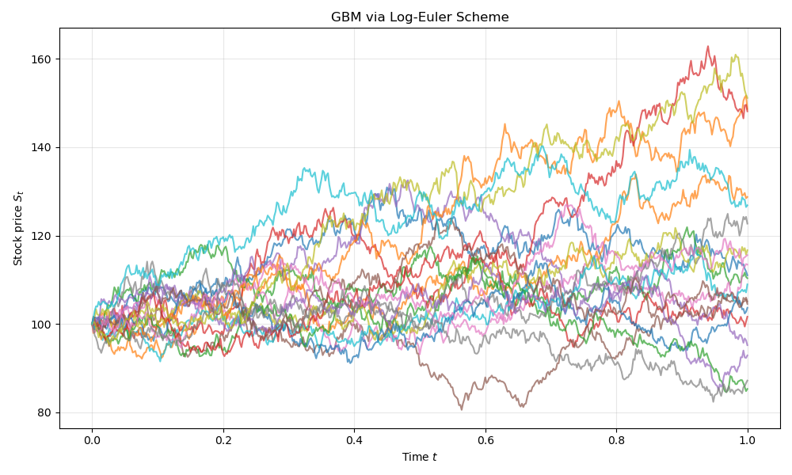

### Advantages

Log-Euler:

- preserves **positivity** ($S_n > 0$ always)
- matches the **exact GBM distribution** (since the log is an additive SDE)
- has **strong order 1** for GBM

This is the preferred scheme for GBM in financial simulations.

---

## 11. Exact Simulation of the CIR Process

## CIR Model

The Cox-Ingersoll-Ross process

$$
dV_t = \kappa(\theta - V_t)\,dt + \sigma\sqrt{V_t}\,dW_t
$$

is widely used for short-rate models and Heston volatility dynamics. The process remains non-negative if the **Feller condition** holds: $2\kappa\theta \geq \sigma^2$.

Euler simulation can violate positivity, so exact sampling is preferred.

## Exact Transition Distribution

The CIR transition law is

$$
V_{t+\Delta t} \sim c \cdot \chi'^2_d(\lambda)
$$

where

$$
c = \frac{\sigma^2(1 - e^{-\kappa\Delta t})}{4\kappa}, \qquad d = \frac{4\kappa\theta}{\sigma^2}, \qquad \lambda = \frac{4\kappa\,e^{-\kappa\Delta t}}{\sigma^2(1 - e^{-\kappa\Delta t})}\,V_t
$$

and $\chi'^2_d(\lambda)$ is the **noncentral chi-square distribution** with $d$ degrees of freedom and noncentrality parameter $\lambda$.

```python
import numpy as np
import matplotlib.pyplot as plt

def exact_cir(V0, kappa, theta, sigma, T, N, num_paths=1, seed=None):
    """
    Exact simulation of the CIR process using the
    noncentral chi-square transition distribution.

    Parameters
    ----------
    V0 : float
        Initial variance.
    kappa : float
        Mean reversion speed.
    theta : float
        Long-run variance.
    sigma : float
        Volatility of variance (vol of vol).
    T : float
        Terminal time.
    N : int
        Number of time steps.
    num_paths : int, optional
        Number of simulated paths.
    seed : int or None, optional
        Random seed for reproducibility.

    Returns
    -------
    t : np.ndarray
        Time grid of shape (N + 1,).
    V : np.ndarray
        Simulated paths of shape (num_paths, N + 1).
    """
    rng = np.random.default_rng(seed)

    dt = T / N
    t = np.linspace(0, T, N + 1)

    V = np.zeros((num_paths, N + 1))
    V[:, 0] = V0

    c = sigma**2 * (1 - np.exp(-kappa * dt)) / (4 * kappa)
    d = 4 * kappa * theta / sigma**2

    for path in range(num_paths):
        for n in range(N):
            lam = (
                4 * kappa * np.exp(-kappa * dt)
                * V[path, n]
                / (sigma**2 * (1 - np.exp(-kappa * dt)))
            )
            V[path, n + 1] = c * rng.noncentral_chisquare(d, lam)

    return t, V


# === Parameters ===
V0 = 0.04
kappa = 2.0
theta = 0.04
sigma = 0.3
T = 1
N = 500
num_paths = 20

t, V = exact_cir(V0, kappa, theta, sigma, T, N, num_paths=num_paths, seed=123)

fig, ax = plt.subplots(figsize=(10, 6))
for i in range(num_paths):
    ax.plot(t, V[i], alpha=0.7)

ax.set_title("Exact CIR Simulation")
ax.set_xlabel("Time $t$")
ax.set_ylabel("Variance $V_t$")
ax.grid(True, alpha=0.3)
plt.tight_layout()
plt.show()
```

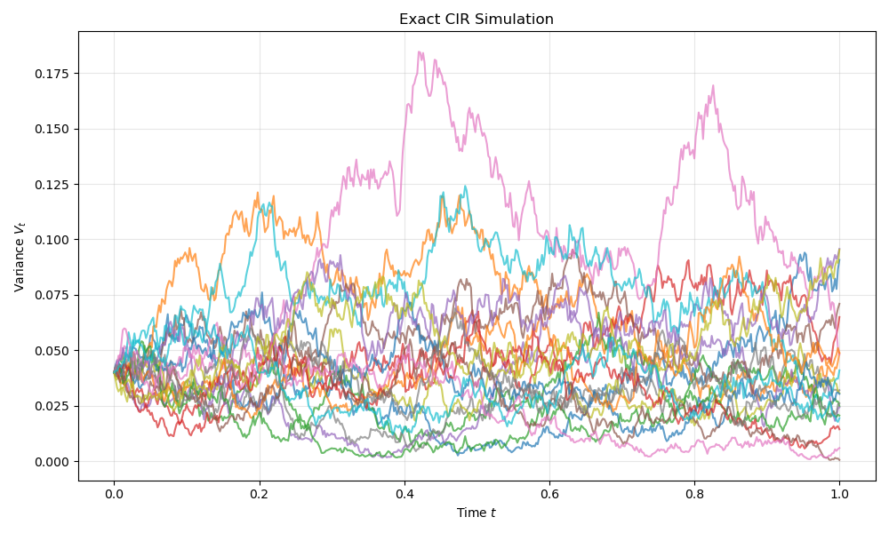

---

## 12. Multilevel Monte Carlo

### Motivation

Standard Monte Carlo requires cost $\sim \varepsilon^{-2}$ to achieve error $\varepsilon$. **Multilevel Monte Carlo (MLMC)** dramatically reduces this cost by distributing work across multiple discretization levels.

### Key Idea

Compute expectations using a **telescoping sum**:

$$
\mathbb{E}[X_L] = \mathbb{E}[X_0] + \sum_{l=1}^{L} \mathbb{E}[X_l - X_{l-1}]
$$

where $X_l$ is the approximation using timestep $\Delta t_l = T \cdot 2^{-l}$. Each difference uses **coupled Brownian paths**. Because $X_l - X_{l-1}$ has **small variance**, far fewer samples are needed at fine levels.

### MLMC Algorithm

1. Simulate many paths on **coarse grids** (cheap, high variance)
2. Simulate fewer paths on **fine grids** (expensive, low variance of the correction)
3. Combine estimates across levels

The optimal cost becomes

$$
\text{cost} \sim \varepsilon^{-2}(\log \varepsilon)^2
$$

which is dramatically cheaper than standard Monte Carlo.

```python
import numpy as np

def gbm_em_step(S, mu, sigma, dt, dW):
    """Single Euler-Maruyama step for GBM."""
    return S + mu * S * dt + sigma * S * dW


def mlmc_gbm(S0, mu, sigma, T, L=4, M=10000, seed=123):
    """
    Multilevel Monte Carlo for GBM terminal value E[S_T].

    Parameters
    ----------
    S0 : float
        Initial stock price.
    mu : float
        Drift parameter.
    sigma : float
        Volatility parameter.
    T : float
        Terminal time.
    L : int, optional
        Number of levels.
    M : int, optional
        Base number of Monte Carlo paths (coarsest level).
    seed : int or None, optional
        Random seed for reproducibility.

    Returns
    -------
    float
        MLMC estimate of E[S_T].
    """
    rng = np.random.default_rng(seed)

    estimate = 0.0

    for level in range(L + 1):

        N = 2**level
        dt = T / N
        num_samples = max(M // (2**level), 1)

        sumY = 0.0

        for _ in range(num_samples):

            # Fine path
            S_f = S0
            dW_fine = np.sqrt(dt) * rng.normal(size=N)

            for n in range(N):
                S_f = gbm_em_step(S_f, mu, sigma, dt, dW_fine[n])

            # Coarse path (aggregate pairs of fine increments)
            if level > 0:
                S_c = S0
                dt_c = 2 * dt

                for n in range(0, N, 2):
                    dW_c = dW_fine[n] + dW_fine[n + 1]
                    S_c = gbm_em_step(S_c, mu, sigma, dt_c, dW_c)

                Y = S_f - S_c
            else:
                Y = S_f

            sumY += Y

        estimate += sumY / num_samples

    return estimate


# === Parameters ===
S0 = 100.0
mu = 0.1
sigma = 0.2
T = 1.0

est = mlmc_gbm(S0, mu, sigma, T)
exact_mean = S0 * np.exp(mu * T)

print(f"MLMC estimate of E[S_T] = {est:.4f}")
print(f"Exact E[S_T]            = {exact_mean:.4f}")
```


```text
MLMC estimate of E[S_T] = 110.6207
Exact E[S_T]            = 110.5171
```

---

## 13. Summary

### Scheme Selection Guide

| Scheme | Strong Order | Weak Order | When to Use |
| ------ | ------------ | ---------- | ----------- |
| **Euler-Maruyama** | 0.5 | 1.0 | general purpose, simple |
| **Milstein** | 1.0 | 1.0 | when $\sigma'$ is available |
| **Predictor-Corrector** | 0.5 | 1.0 | better stability |
| **Log-Euler** | 1.0 | 1.0 | GBM (preserves positivity) |
| **Exact** | N/A | N/A | GBM, OU, CIR (when possible) |
| **MLMC** | N/A | N/A | cost reduction for expectations |

### SDE Simulation Hierarchy

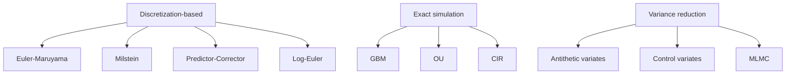

### Computational Complexity

For target error $\varepsilon$ using Euler-Maruyama: $N \sim \varepsilon^{-2/3}$, $M \sim \varepsilon^{-4/3}$, total cost $\sim \varepsilon^{-2}$.

For Milstein (strong order 1.0): total cost $\sim \varepsilon^{-5/3}$.

!!! summary "Key Takeaway"
    Euler-Maruyama is the workhorse of SDE simulation: simple, robust, and applicable to any SDE. Milstein improves pathwise accuracy when the diffusion derivative is tractable. For GBM, the Log-Euler scheme preserves positivity and achieves strong order 1. Exact simulation eliminates time discretization error when closed-form transition distributions are available (GBM, OU, CIR). Multilevel Monte Carlo reduces the cost of computing expectations from $O(\varepsilon^{-2})$ to $O(\varepsilon^{-2}(\log \varepsilon)^2)$. The total simulation error combines discretization error (controlled by step size) and Monte Carlo error (controlled by path count), and balancing these two sources is essential for efficient computation.
