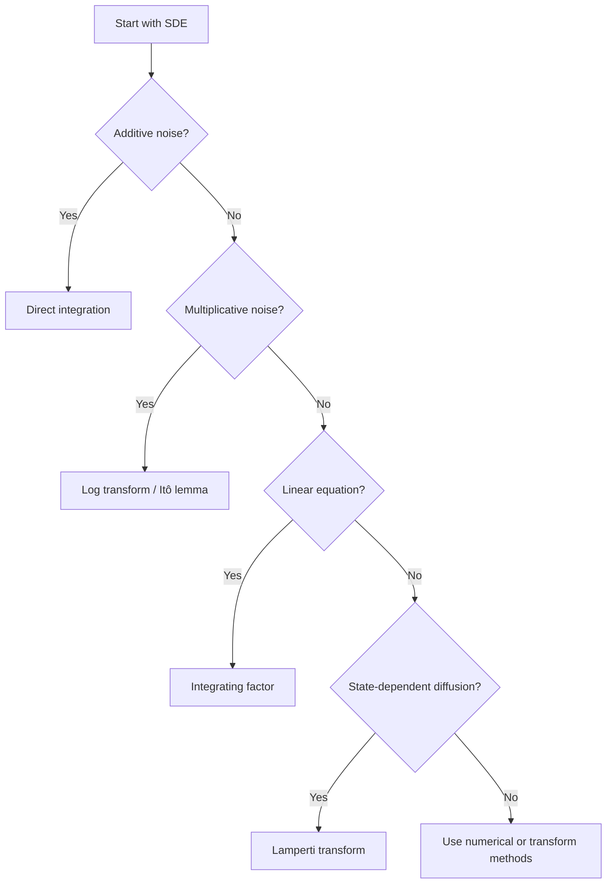

# Techniques for Solving Stochastic Differential Equations

In the previous chapter we discussed what it means to solve an SDE and why explicit solutions are rare. We now examine the main techniques used to solve the classes of SDEs that do admit tractable analytical representations.

!!! abstract "Learning Goals"
    After completing this chapter you should be able to:

    - solve additive-noise SDEs by direct integration
    - use Itô transformations to simplify multiplicative-noise equations
    - solve linear SDEs with integrating factors
    - understand how the Lamperti transform simplifies diffusion terms
    - recognize when to stop searching for closed forms and switch to other methods

---

## 1. Direct Integration

For SDEs where the coefficients depend only on time,

$$
dX_t = b(t)\,dt + \sigma(t)\,dW_t
$$

the solution is obtained by direct integration:

$$
X_t = X_0 + \int_0^t b(s)\,ds + \int_0^t \sigma(s)\,dW_s
$$

This is the stochastic analogue of integrating an ordinary differential equation, except that the random forcing enters through the Itô integral.

---

## 2. Itô Transformations

A central idea in solving SDEs is to choose a transformed variable $Y_t = f(X_t)$ so that the new SDE becomes simpler.

The governing rule is **Itô's lemma**:

$$
dY_t = \left(f_t + b\,f_x + \frac{1}{2}\sigma^2 f_{xx}\right)dt + \sigma\,f_x\,dW_t
$$

The extra second-derivative term $\frac{1}{2}\sigma^2 f_{xx}$ is what distinguishes stochastic calculus from ordinary calculus. Choosing $f$ to cancel state-dependence in the diffusion or to linearize the drift is the core idea of this approach.

---

## 3. Integrating Factors for Linear SDEs

Consider the linear SDE

$$
dX_t = [a(t) + b(t)X_t]\,dt + c(t)\,dW_t
$$

Here $a(t)$, $b(t)$, and $c(t)$ are deterministic time-varying coefficients — $b(t)$ is a generic linear drift coefficient, not the OU long-run mean.

Define the integrating factor

$$
M(t) = \exp\!\left(-\int_0^t b(s)\,ds\right)
$$

By the Itô product rule, $d(M(t)X_t) = M(t)\,dX_t + X_t\,dM(t)$. Since $M(t)$ is a deterministic function of finite variation, no quadratic covariation term appears, and the computation reduces to

$$
d(M(t)X_t) = M(t)a(t)\,dt + M(t)c(t)\,dW_t
$$

Integrating and solving for $X_t$:

$$
X_t = e^{\int_0^t b(u)\,du}\left[
X_0
+ \int_0^t e^{-\int_0^s b(u)\,du}a(s)\,ds
+ \int_0^t e^{-\int_0^s b(u)\,du}c(s)\,dW_s
\right]
$$

!!! tip "Connection to Ordinary Calculus"
    This is the stochastic analogue of the integrating factor method for linear ODEs.

---

## 4. Lamperti Transform

The Lamperti transform converts state-dependent diffusion into constant diffusion, making the equation easier to analyze.

For an SDE of the form

$$
dX_t = b(X_t)\,dt + \sigma(X_t)\,dW_t
$$

define $Y_t = h(X_t)$ where $h'(x) = 1/\sigma(x)$. By Itô's lemma:

$$
dY_t = h'(X_t)\,dX_t + \tfrac{1}{2}h''(X_t)\sigma^2(X_t)\,dt
$$

The diffusion term becomes $h'(X_t)\sigma(X_t)\,dW_t = \frac{\sigma(X_t)}{\sigma(X_t)}\,dW_t = dW_t$, so the transformed process has **unit diffusion coefficient**. The drift of $Y_t$ changes but is now the only remaining structure to handle.

This does not always produce a fully explicit elementary solution, but it often reduces the equation to a more analyzable form — notably for the CIR process, where the Lamperti transform reveals a connection to Bessel processes.

---

## 5. Core Solvable Examples

We now illustrate the main methods on classical models.

---

## Example 1: Brownian Motion with Drift

### SDE

$$
dX_t = \mu\,dt + \sigma\,dW_t, \qquad X_0 \in \mathbb{R}
$$

### Solution

Integrating from $0$ to $t$ gives

$$
X_t = X_0 + \mu t + \sigma W_t
$$

### Distribution

$$
X_t \sim \mathcal{N}(X_0 + \mu t,\; \sigma^2 t)
$$

### Interpretation

This model represents a particle subject to constant drift $\mu$ and random shocks $\sigma\,dW_t$.

!!! tip "Technique Used"
    **Direct integration** works because the noise term does not depend on the state.

---

## Example 2: Geometric Brownian Motion

### SDE

$$
dS_t = \mu S_t\,dt + \sigma S_t\,dW_t, \qquad S_0 > 0
$$

This model describes stock prices in the Black–Scholes framework.

### Key Idea

The equation contains **multiplicative noise**, so naive direct integration is not sufficient. Instead we apply the transformation $Y_t = \log S_t$.

### Apply Itô's Lemma

For $f(S) = \log S$, we have $f'(S) = 1/S$ and $f''(S) = -1/S^2$. Itô's lemma gives

$$
d(\log S_t) = \frac{1}{S_t}\,dS_t - \frac{1}{2}\frac{1}{S_t^2}(dS_t)^2
$$

Substituting $dS_t = \mu S_t\,dt + \sigma S_t\,dW_t$ and using $(dS_t)^2 = \sigma^2 S_t^2\,dt$:

$$
d(\log S_t) = \mu\,dt + \sigma\,dW_t - \frac{\sigma^2}{2}\,dt = \left(\mu - \frac{\sigma^2}{2}\right)dt + \sigma\,dW_t
$$

This is Brownian motion with drift.

### Solution

Integrating and exponentiating:

$$
S_t = S_0 \exp\!\left[\left(\mu - \frac{\sigma^2}{2}\right)t + \sigma W_t\right]
$$

### Distribution

$$
\log S_t \sim \mathcal{N}\!\left(\log S_0 + \left(\mu - \tfrac{1}{2}\sigma^2\right)t,\; \sigma^2 t\right)
$$

!!! success "Result"
    $S_t$ follows a **log-normal distribution**.

### Why the Itô Correction Appears

In stochastic calculus $(dW_t)^2 = dt$, so squaring the diffusion term produces $(\sigma S_t\,dW_t)^2 = \sigma^2 S_t^2\,dt$. This generates the additional drift correction $-\frac{\sigma^2}{2}\,dt$ in the logarithmic equation.

---

## Example 3: Vasicek Model (Ornstein–Uhlenbeck)

### SDE

$$
dr_t = a(\theta - r_t)\,dt + \sigma\,dW_t
$$

Parameters: $\theta$ is the long-run mean, $a > 0$ is the speed of mean reversion, $\sigma$ is the volatility.

### Integrating Factor Method

Rewrite the equation as

$$
dr_t + a\,r_t\,dt = a\theta\,dt + \sigma\,dW_t
$$

Multiply by the integrating factor $e^{at}$. Since $e^{at}$ is a deterministic function with finite variation, the Itô product rule gives $d(e^{at}r_t) = ae^{at}r_t\,dt + e^{at}dr_t$ with no extra quadratic covariation term:

$$
d(e^{at}r_t) = a\theta\,e^{at}\,dt + \sigma\,e^{at}\,dW_t
$$

### Solution

Integrating and multiplying by $e^{-at}$:

$$
r_t = r_0\,e^{-at} + \theta(1 - e^{-at}) + \sigma \int_0^t e^{-a(t-s)}\,dW_s
$$

### Interpretation

The solution contains three components: decay of the initial condition $r_0 e^{-at}$, pull toward the long-run mean $\theta$, and accumulated stochastic shocks. The exponential kernel $e^{-a(t-s)}$ ensures that shocks **fade over time**, which creates the mean-reverting behavior.

---

## 6. Example Atlas

| Model                      | SDE                                                       | Method                              |
| -------------------------- | --------------------------------------------------------- | ----------------------------------- |
| Brownian motion with drift | $dX = \mu\,dt + \sigma\,dW$                              | direct integration                  |
| GBM                        | $dS = \mu S\,dt + \sigma S\,dW$                          | log transform                       |
| Vasicek / OU               | $dr = a(\theta-r)\,dt + \sigma\,dW$                          | integrating factor                  |
| CIR                        | $dr = a(\theta-r)\,dt + \sigma\sqrt{r}\,dW$              | Lamperti transform; Bessel-type analysis |

---

## 7. Mental Checklist for Solving an SDE

When encountering a new stochastic differential equation, the most important step is to **recognize its structure**.

### Step 1 — Identify the Structure

Start from $dX_t = \mu(X_t, t)\,dt + \sigma(X_t, t)\,dW_t$ and ask:

| Question                                      | If Yes                    | Technique           |
| --------------------------------------------- | ------------------------- | ------------------- |
| Does the noise term depend only on time?      | additive noise            | direct integration  |
| Is the diffusion proportional to the state?   | multiplicative noise      | log / Itô transform |
| Is the drift linear in $X_t$?                 | linear SDE                | integrating factor  |
| Does the diffusion depend on $X_t$?           | state-dependent diffusion | Lamperti transform  |

### Step 2 — Try a Transformation

| Transformation       | Purpose                         |
| -------------------- | ------------------------------- |
| $Y = \log X$         | remove multiplicative noise     |
| $Y = X^{1-\beta}$    | simplify power diffusion        |
| integrating factor   | eliminate linear drift          |
| Lamperti transform   | normalize diffusion coefficient |

### Step 3 — Solve the Transformed Equation

After transformation, check if the new equation reduces to a standard additive form $dY_t = \alpha(t)\,dt + \beta(t)\,dW_t$, then solve by direct integration.

### Step 4 — Invert the Transformation

For example: $Y_t = \log S_t \;\Rightarrow\; S_t = e^{Y_t}$.

### Step 5 — Verify the Solution

Always check the result by applying **Itô's lemma**. If the original SDE is recovered, the solution is correct.

### Step 6 — If No Closed Form Exists

If the equation does not simplify after standard transformations, switch to:

- Euler–Maruyama simulation
- Milstein scheme
- PDE methods
- characteristic-function approaches

---

## 8. Common Mistakes When Solving SDEs

### Mistake 1 — Forgetting the Itô Correction Term

When applying Itô's lemma, the second-derivative term must be included:

$$
dY_t = \left(f_t + b\,f_x + \frac{1}{2}\sigma^2 f_{xx}\right)dt + \sigma\,f_x\,dW_t
$$

Students often incorrectly use the ordinary chain rule and omit $\frac{1}{2}\sigma^2 f_{xx}$.

!!! warning "Key Difference from Ordinary Calculus"
    In stochastic calculus $(dW_t)^2 = dt$, which produces the additional second-derivative term.

### Mistake 2 — Treating Brownian Motion Like an Ordinary Function

Brownian motion is **not differentiable**. Expressions like $dW_t/dt$ do not exist in the classical sense. The correct object is the stochastic differential $dW_t$.

### Mistake 3 — Confusing Additive and Multiplicative Noise

Compare $dX_t = \mu\,dt + \sigma\,dW_t$ (additive) with $dS_t = \mu S_t\,dt + \sigma S_t\,dW_t$ (multiplicative). The second equation naturally suggests $Y_t = \log S_t$.

### Mistake 4 — Ignoring State-Dependent Diffusion

Some SDEs contain diffusion terms like $\sigma\sqrt{X_t}$. These usually cannot be solved by direct integration. One instead looks for the **Lamperti transform** or for known structural representations such as the CIR–Bessel connection.

### Mistake 5 — Forgetting to Verify the Solution

After solving an SDE, the result should always be checked by applying Itô's lemma.

### Mistake 6 — Assuming Closed-Form Solutions Always Exist

Most SDEs do not admit elementary explicit pathwise solutions. When standard transformations fail, appropriate alternatives include numerical simulation, PDE methods, moment analysis, and characteristic-function techniques.

---

## 9. Final Perspective

Solving SDEs is rarely about brute-force calculation. The essential skill is to

1. recognize the structure of the equation
2. choose the right transformation or technique
3. verify the result carefully
4. know when to stop and switch to other analytical or numerical tools

That combination of structural recognition and technical fluency is the heart of solving stochastic differential equations.
