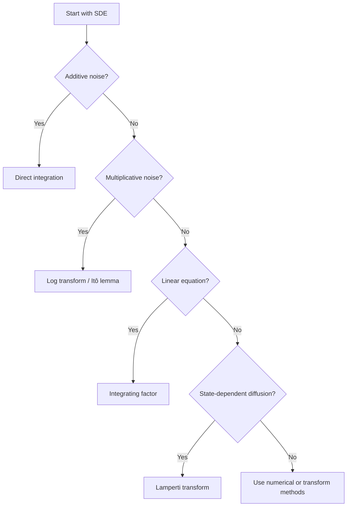

# Techniques for Solving Stochastic Differential Equations

In the previous chapter we discussed what it means to solve an SDE and why explicit solutions are rare. We now examine the main techniques used to solve the classes of SDEs that do admit tractable analytical representations.

!!! tip "Toy mechanism: match the structure, pick the transform"
    Solving an SDE is rarely a calculation — it is a *recognition* followed by a substitution. The four canonical structures each have a canonical transformation:

    - additive noise ($\sigma$ constant) → integrate the noise directly;
    - multiplicative noise ($\sigma \propto X$) → take $\log X$, which has constant diffusion;
    - linear mean-reverting drift → multiply by $e^{at}$, which cancels the drift;
    - state-dependent diffusion → Lamperti transform $h'(x) = 1/\sigma(x)$, which forces the diffusion to be $1$.

    Each transformation is engineered to make *one specific term* disappear, leaving a simpler SDE underneath. The toy version is GBM: the multiplicative noise problem $dS_t = \mu S_t\,dt + \sigma S_t\,dW_t$ becomes the additive-noise problem $d(\log S_t) = (\mu - \tfrac{1}{2}\sigma^2)\,dt + \sigma\,dW_t$ in one step. The four solved examples below are the same one-step routine applied to BM-with-drift, GBM, Vasicek, and CIR.

!!! abstract "Learning Goals"
    After completing this chapter you should be able to:

    - solve additive-noise SDEs by direct integration
    - use Itô transformations to simplify multiplicative-noise equations
    - solve linear SDEs with integrating factors
    - understand how the Lamperti transform simplifies diffusion terms
    - recognize when to stop searching for closed forms and switch to other methods

---

## 1. Direct Integration

For SDEs where the coefficients depend only on time,

$$
dX_t = b(t)\,dt + \sigma(t)\,dW_t
$$

the solution is obtained by direct integration:

$$
X_t = X_0 + \int_0^t b(s)\,ds + \int_0^t \sigma(s)\,dW_s
$$

This is the stochastic analogue of integrating an ordinary differential equation, except that the random forcing enters through the Itô integral.

---

## 2. Itô Transformations

A central idea in solving SDEs is to choose a transformed variable $Y_t = f(X_t)$ so that the new SDE becomes simpler.

Recall (see [§ Itô's Lemma](../ito_lemma/ito_lemma.md)): the governing rule is

$$
dY_t = \left(f_t + b\,f_x + \frac{1}{2}\sigma^2 f_{xx}\right)dt + \sigma\,f_x\,dW_t
$$

The extra second-derivative term $\frac{1}{2}\sigma^2 f_{xx}$ is what distinguishes stochastic calculus from ordinary calculus. Choosing $f$ to cancel state-dependence in the diffusion or to linearize the drift is the core idea of this approach.

---

## 3. Integrating Factors for Linear SDEs

Consider the linear SDE

$$
dX_t = [a(t) + b(t)X_t]\,dt + c(t)\,dW_t
$$

Here $a(t)$, $b(t)$, and $c(t)$ are deterministic time-varying coefficients — $b(t)$ is a generic linear drift coefficient, not the OU long-run mean.

Define the integrating factor

$$
M(t) = \exp\!\left(-\int_0^t b(s)\,ds\right)
$$

By the Itô product rule, $d(M(t)X_t) = M(t)\,dX_t + X_t\,dM(t)$. Since $M(t)$ is a deterministic function of finite variation, no quadratic covariation term appears. Substituting $dX_t = [a(t) + b(t)X_t]\,dt + c(t)\,dW_t$:

$$
d(MX) = Ma(t)\,dt + Mb(t)X_t\,dt + Mc(t)\,dW_t + X_t\,dM
$$

$$
= Ma(t)\,dt + Mc(t)\,dW_t + X_t\bigl(dM + b(t)M\,dt\bigr)
$$

Choosing $M$ so that $dM + b(t)M\,dt = 0$, i.e. $M(t) = \exp\!\left(-\int_0^t b(s)\,ds\right)$, the $X_t$-term vanishes:

$$
d(M(t)X_t) = M(t)a(t)\,dt + M(t)c(t)\,dW_t
$$

Integrating and solving for $X_t$:

$$
X_t = e^{\int_0^t b(u)\,du}\left[
X_0

+ \int_0^t e^{-\int_0^s b(u)\,du}a(s)\,ds
+ \int_0^t e^{-\int_0^s b(u)\,du}c(s)\,dW_s
\right]
$$

!!! tip "Connection to Ordinary Calculus"
    This is the stochastic analogue of the integrating factor method for linear ODEs.

---

## 4. Lamperti Transform

The Lamperti transform converts state-dependent diffusion into constant diffusion, making the equation easier to analyze.

For an SDE of the form

$$
dX_t = b(X_t)\,dt + \sigma(X_t)\,dW_t
$$

define $Y_t = h(X_t)$ where $h'(x) = 1/\sigma(x)$. By Itô's lemma:

$$
dY_t = h'(X_t)\,dX_t + \tfrac{1}{2}h''(X_t)\sigma^2(X_t)\,dt
$$

The diffusion term becomes $h'(X_t)\sigma(X_t)\,dW_t = \frac{\sigma(X_t)}{\sigma(X_t)}\,dW_t = dW_t$, so the transformed process has **unit diffusion coefficient**. The drift of $Y_t$ changes but is now the only remaining structure to handle.

This does not always produce a fully explicit elementary solution, but it often reduces the equation to a more analyzable form — notably for the CIR process, where the Lamperti transform reveals a connection to Bessel processes.

---

## 5. Core Solvable Examples

We now illustrate the main methods on classical models.

---

## Example 1: Brownian Motion with Drift

### SDE

$$
dX_t = \mu\,dt + \sigma\,dW_t, \qquad X_0 \in \mathbb{R}
$$

### Solution

Integrating from $0$ to $t$ gives

$$
X_t = X_0 + \mu t + \sigma W_t
$$

### Distribution

$$
X_t \sim \mathcal{N}(X_0 + \mu t,\; \sigma^2 t)
$$

### Interpretation

This model represents a particle subject to constant drift $\mu$ and random shocks $\sigma\,dW_t$.

!!! tip "Technique Used"
    **Direct integration** works because the noise term does not depend on the state.

---

## Example 2: Geometric Brownian Motion

### SDE

$$
dS_t = \mu S_t\,dt + \sigma S_t\,dW_t, \qquad S_0 > 0
$$

### Method

Multiplicative noise rules out direct integration. Apply the **log transform** $Y_t = \log S_t$.

Recall (see [§ Itô Calculus Applications](../ito_lemma/ito_calculus_applications.md)): applying Itô's lemma to $\log S_t$ yields $d(\log S_t) = (\mu - \tfrac{\sigma^2}{2})\,dt + \sigma\,dW_t$, so

$$
S_t = S_0 \exp\!\left[\left(\mu - \frac{\sigma^2}{2}\right)t + \sigma W_t\right], \qquad \log S_t \sim \mathcal{N}\!\left(\log S_0 + \left(\mu - \tfrac{1}{2}\sigma^2\right)t,\; \sigma^2 t\right)
$$

The Itô correction $-\sigma^2/2$ arises because $(dW_t)^2 = dt$ produces an extra drift when expanding $d(\log S_t)$ — the source of the log-normal law.

---

## Example 3: Vasicek Model (Ornstein–Uhlenbeck)

### SDE

$$
dr_t = a(\theta - r_t)\,dt + \sigma\,dW_t
$$

Parameters: $\theta$ is the long-run mean, $a > 0$ is the speed of mean reversion, $\sigma$ is the volatility.

### Integrating Factor Method

Rewrite the equation as

$$
dr_t + a\,r_t\,dt = a\theta\,dt + \sigma\,dW_t
$$

Multiply by the integrating factor $e^{at}$. Since $e^{at}$ is a deterministic function with finite variation, the Itô product rule gives $d(e^{at}r_t) = ae^{at}r_t\,dt + e^{at}dr_t$ with no extra quadratic covariation term. Substituting $dr_t = a(\theta - r_t)\,dt + \sigma\,dW_t$:

$$
d(e^{at}r_t) = ae^{at}r_t\,dt + e^{at}[a(\theta - r_t)\,dt + \sigma\,dW_t]
$$

$$
= a\theta\,e^{at}\,dt + \sigma\,e^{at}\,dW_t
$$

### Solution

Integrating and multiplying by $e^{-at}$:

$$
r_t = r_0\,e^{-at} + \theta(1 - e^{-at}) + \sigma \int_0^t e^{-a(t-s)}\,dW_s
$$

### Interpretation

The solution contains three components: decay of the initial condition $r_0 e^{-at}$, pull toward the long-run mean $\theta$, and accumulated stochastic shocks. The exponential kernel $e^{-a(t-s)}$ ensures that shocks **fade over time**, which creates the mean-reverting behavior.

---

## 6. Example Atlas

| Model                      | SDE                                                       | Method                              |
| -------------------------- | --------------------------------------------------------- | ----------------------------------- |
| Brownian motion with drift | $dX = \mu\,dt + \sigma\,dW$                              | direct integration                  |
| GBM                        | $dS = \mu S\,dt + \sigma S\,dW$                          | log transform                       |
| Vasicek / OU               | $dr = a(\theta-r)\,dt + \sigma\,dW$                          | integrating factor                  |
| CIR                        | $dr = a(\theta-r)\,dt + \sigma\sqrt{r}\,dW$              | Lamperti transform; Bessel-type analysis |

---

## 7. Mental Checklist for Solving an SDE

When encountering a new stochastic differential equation, the most important step is to **recognize its structure**.

### Step 1 — Identify the Structure

Start from $dX_t = \mu(X_t, t)\,dt + \sigma(X_t, t)\,dW_t$ and ask:

| Question                                      | If Yes                    | Technique           |
| --------------------------------------------- | ------------------------- | ------------------- |
| Does the noise term depend only on time?      | additive noise            | direct integration  |
| Is the diffusion proportional to the state?   | multiplicative noise      | log / Itô transform |
| Is the drift linear in $X_t$?                 | linear SDE                | integrating factor  |
| Does the diffusion depend on $X_t$?           | state-dependent diffusion | Lamperti transform  |

### Step 2 — Try a Transformation

| Transformation       | Purpose                         |
| -------------------- | ------------------------------- |
| $Y = \log X$         | remove multiplicative noise     |
| $Y = X^{1-\beta}$    | simplify power diffusion        |
| integrating factor   | eliminate linear drift          |
| Lamperti transform   | normalize diffusion coefficient |

### Step 3 — Solve the Transformed Equation

After transformation, check if the new equation reduces to a standard additive form $dY_t = \alpha(t)\,dt + \beta(t)\,dW_t$, then solve by direct integration.

### Step 4 — Invert the Transformation

For example: $Y_t = \log S_t \;\Rightarrow\; S_t = e^{Y_t}$.

### Step 5 — Verify the Solution

Always check the result by applying **Itô's lemma**. If the original SDE is recovered, the solution is correct.

### Step 6 — If No Closed Form Exists

If the equation does not simplify after standard transformations, switch to:

- Euler–Maruyama simulation
- Milstein scheme
- PDE methods
- characteristic-function approaches

---

## 8. Common Mistakes

Recall (see [§ Verifying SDE Solutions § Common Pitfalls](verifying_sde_solutions.md#5-common-pitfalls)): forgetting the Itô correction $\tfrac{1}{2}\sigma^2 f_{xx}$, treating $dW_t/dt$ as a derivative, and skipping verification are the recurring traps. Two further pitfalls specific to solving:

- **Confusing additive and multiplicative noise.** Compare $dX_t = \mu\,dt + \sigma\,dW_t$ with $dS_t = \mu S_t\,dt + \sigma S_t\,dW_t$ — only the second suggests $Y_t = \log S_t$.
- **Assuming closed forms always exist.** Most SDEs do not admit elementary pathwise solutions; switch to numerical simulation, PDE methods, moment analysis, or characteristic functions.

---

## 9. Final Perspective

Solving SDEs is rarely about brute-force calculation. The essential skill is to

1. recognize the structure of the equation
2. choose the right transformation or technique
3. verify the result carefully
4. know when to stop and switch to other analytical or numerical tools

That combination of structural recognition and technical fluency is the heart of solving stochastic differential equations.

---

## Exercises

**Exercise 1.** Solve the following SDE by direct integration:

$$
dX_t = (3t^2 + 1)\,dt + e^{-t}\,dW_t, \qquad X_0 = 2
$$

Write down the distribution of $X_t$.

??? success "Solution to Exercise 1"
    The SDE $dX_t = (3t^2 + 1)\,dt + e^{-t}\,dW_t$ has coefficients that depend only on time (not on $X_t$), so we solve by direct integration:

    $$
    X_t = X_0 + \int_0^t (3s^2 + 1)\,ds + \int_0^t e^{-s}\,dW_s = 2 + (t^3 + t) + \int_0^t e^{-s}\,dW_s
    $$

    The stochastic integral $\int_0^t e^{-s}\,dW_s$ is a Gaussian random variable with mean zero and variance, by Itô isometry,

    $$
    \int_0^t e^{-2s}\,ds = \frac{1}{2}(1 - e^{-2t})
    $$

    Therefore:

    $$
    X_t \sim \mathcal{N}\!\left(2 + t^3 + t,\; \frac{1 - e^{-2t}}{2}\right)
    $$

---

**Exercise 2.** Solve the geometric Brownian motion SDE

$$
dV_t = rV_t\,dt + \sigma V_t\,dW_t, \qquad V_0 = V_0
$$

by applying Itô's lemma to $Y_t = \ln V_t$. Show all steps of the transformation, including the Itô correction term.

??? success "Solution to Exercise 2"
    Let $Y_t = \ln V_t$. We apply Itô's lemma with $f(V) = \ln V$, so $f'(V) = 1/V$ and $f''(V) = -1/V^2$.

    **Step 1.** Write Itô's lemma:

    $$
    dY_t = \frac{1}{V_t}\,dV_t + \frac{1}{2}\!\left(-\frac{1}{V_t^2}\right)(dV_t)^2
    $$

    **Step 2.** Substitute $dV_t = rV_t\,dt + \sigma V_t\,dW_t$:

    $$
    \frac{1}{V_t}\,dV_t = r\,dt + \sigma\,dW_t
    $$

    **Step 3.** Compute $(dV_t)^2 = \sigma^2 V_t^2\,dt$ (using $(dW_t)^2 = dt$ and dropping higher-order terms):

    $$
    \frac{1}{2}\!\left(-\frac{1}{V_t^2}\right)\sigma^2 V_t^2\,dt = -\frac{\sigma^2}{2}\,dt
    $$

    **Step 4.** Combine:

    $$
    dY_t = \left(r - \frac{\sigma^2}{2}\right)dt + \sigma\,dW_t
    $$

    This is Brownian motion with drift. Integrating from $0$ to $t$:

    $$
    \ln V_t = \ln V_0 + \left(r - \frac{\sigma^2}{2}\right)t + \sigma W_t
    $$

    Exponentiating:

    $$
    V_t = V_0 \exp\!\left[\left(r - \frac{\sigma^2}{2}\right)t + \sigma W_t\right]
    $$

    The Itô correction term $-\sigma^2/2$ arises from the second derivative $f''(V) = -1/V^2$ combined with the quadratic variation $(dV_t)^2 = \sigma^2 V_t^2\,dt$.

---

**Exercise 3.** Consider the multiplicative-noise SDE

$$
dX_t = 2X_t\,dt + 3X_t\,dW_t, \qquad X_0 = x_0 > 0
$$

(a) Apply Itô's lemma to $Y_t = \ln X_t$.

(b) Solve explicitly for $X_t$.

(c) Find the distribution of $\ln X_t$.

??? success "Solution to Exercise 3"
    Let $Y_t = \ln X_t$. Since $f(x) = \ln x$, we have

    $$
    f'(x) = \frac{1}{x}, \qquad f''(x) = -\frac{1}{x^2}
    $$

    By Itô's lemma,

    $$
    dY_t = \frac{1}{X_t}\,dX_t + \frac{1}{2}\left(-\frac{1}{X_t^2}\right)(dX_t)^2
    $$

    Substitute $dX_t = 2X_t\,dt + 3X_t\,dW_t$:

    $$
    \frac{1}{X_t}\,dX_t = 2\,dt + 3\,dW_t
    $$

    Also,

    $$
    (dX_t)^2 = (3X_t\,dW_t)^2 = 9X_t^2\,dt
    $$

    so the second-order Itô correction term is

    $$
    \frac{1}{2}\left(-\frac{1}{X_t^2}\right)9X_t^2\,dt = -\frac{9}{2}\,dt
    $$

    Therefore,

    $$
    dY_t = \left(2 - \frac{9}{2}\right)dt + 3\,dW_t
    = -\frac{5}{2}\,dt + 3\,dW_t
    $$

    Integrating from $0$ to $t$,

    $$
    Y_t = \ln x_0 - \frac{5}{2}t + 3W_t
    $$

    Hence,

    $$
    X_t = x_0 \exp\!\left(-\frac{5}{2}t + 3W_t\right)
    $$

    Since $Y_t = \ln X_t$ is an affine function of Brownian motion, it is normally distributed:

    $$
    \ln X_t \sim \mathcal{N}\!\left(\ln x_0 - \frac{5}{2}t,\; 9t\right)
    $$

---

**Exercise 4.** Solve the linear SDE

$$
dX_t = (1+t - 2X_t)\,dt + e^t\,dW_t, \qquad X_0 = 1
$$

(a) Write down the integrating factor.

(b) Derive an explicit formula for $X_t$.

(c) Compute $\mathbb{E}[X_t]$.

??? success "Solution to Exercise 4"
    We are given

    $$
    dX_t = (1+t - 2X_t)\,dt + e^t\,dW_t
    $$

    This is a linear SDE of the form

    $$
    dX_t = [a(t) + b(t)X_t]\,dt + c(t)\,dW_t
    $$

    with

    $$
    a(t) = 1+t, \qquad b(t) = -2, \qquad c(t) = e^t
    $$

    **(a) Integrating factor**

    We look for an integrating factor $M(t)$ depending only on time. This ensures that $M$ is deterministic, so the Itô product rule has no quadratic covariation term:

    $$
    d(M_t X_t) = M_t\,dX_t + X_t\,dM_t
    $$

    Substituting $dX_t = (1+t-2X_t)\,dt + e^t\,dW_t$ and grouping:

    $$
    d(M_t X_t) = M_t(1+t)\,dt + M_t e^t\,dW_t + X_t\bigl(dM_t - 2M_t\,dt\bigr)
    $$

    We choose $M$ so that the coefficient of $X_t$ vanishes, i.e. $dM_t = 2M_t\,dt$. This gives $M(t) = e^{2t}$.

    **(b) Explicit solution**

    With $M(t) = e^{2t}$ the $X_t$-term is gone, so

    $$
    d(e^{2t}X_t) = e^{2t}(1+t)\,dt + e^{2t}e^t\,dW_t
    = e^{2t}(1+t)\,dt + e^{3t}\,dW_t
    $$

    Integrating from $0$ to $t$,

    $$
    e^{2t}X_t = X_0 + \int_0^t e^{2s}(1+s)\,ds + \int_0^t e^{3s}\,dW_s
    $$

    Since $X_0 = 1$,

    $$
    e^{2t}X_t = 1 + \int_0^t e^{2s}(1+s)\,ds + \int_0^t e^{3s}\,dW_s
    $$

    Now compute the deterministic integral:

    $$
    \int e^{2s}(1+s)\,ds = \frac{e^{2s}}{4}(1+2s)
    $$

    so

    $$
    \int_0^t e^{2s}(1+s)\,ds
    = \frac{e^{2t}}{4}(1+2t) - \frac{1}{4}
    $$

    Therefore,

    $$
    e^{2t}X_t
    = 1 + \frac{e^{2t}}{4}(1+2t) - \frac{1}{4} + \int_0^t e^{3s}\,dW_s
    $$

    $$
    = \frac{3}{4} + \frac{e^{2t}}{4}(1+2t) + \int_0^t e^{3s}\,dW_s
    $$

    Dividing by $e^{2t}$,

    $$
    X_t
    = \frac{3}{4}e^{-2t} + \frac{1+2t}{4} + e^{-2t}\int_0^t e^{3s}\,dW_s
    $$

    **(c) Expectation**

    The stochastic integral has mean zero, so

    $$
    \mathbb{E}[X_t]
    = \frac{3}{4}e^{-2t} + \frac{1+2t}{4}
    $$

---

**Exercise 5.** Consider the SDE with state-dependent diffusion

$$
dX_t = \mu X_t\,dt + \sigma X_t^\beta\,dW_t, \qquad \beta \neq 1
$$

(a) What is the Lamperti transform $h(x) = \int^x \frac{1}{\sigma s^\beta}\,ds$ for this SDE?

(b) Apply Itô's lemma to $Y_t = h(X_t)$ and verify that the diffusion coefficient of $Y_t$ is constant.

??? success "Solution to Exercise 5"
    **(a)** The Lamperti transform requires $h'(x) = 1/\sigma(x) = 1/(\sigma x^\beta)$. Integrating:

    $$
    h(x) = \int \frac{1}{\sigma x^\beta}\,dx = \frac{x^{1-\beta}}{\sigma(1-\beta)}
    $$

    (valid for $\beta \neq 1$).

    **(b)** Let $Y_t = h(X_t) = \frac{X_t^{1-\beta}}{\sigma(1-\beta)}$. We have $h'(x) = \frac{x^{-\beta}}{\sigma}$ and $h''(x) = \frac{-\beta x^{-\beta-1}}{\sigma}$.

    By Itô's lemma:

    $$
    dY_t = h'(X_t)\,dX_t + \frac{1}{2}h''(X_t)\sigma^2 X_t^{2\beta}\,dt
    $$

    Substituting $dX_t = \mu X_t\,dt + \sigma X_t^\beta\,dW_t$:

    $$\begin{array}{lll}
    dY_t
    &=&\displaystyle h'(X_t)\mu X_t\,dt

    + h'(X_t)\sigma X_t^\beta\,dW_t
    + \frac{1}{2}h''(X_t)\sigma^2 X_t^{2\beta}\,dt\\
    &=&\displaystyle \left( h'(X_t)\mu X_t + \frac{1}{2}h''(X_t)\sigma^2 X_t^{2\beta}\right)\,dt

    + h'(X_t)\sigma X_t^\beta\,dW_t
    \end{array}$$

    The diffusion coefficient of $Y_t$ is:

    $$
    h'(X_t)\cdot \sigma X_t^\beta = \frac{X_t^{-\beta}}{\sigma}\cdot \sigma X_t^\beta = 1
    $$

    This confirms that the diffusion coefficient of $Y_t$ is the constant $1$, independent of $X_t$.

    The drift of $Y_t$ is:

    $$
    h'(X_t)\mu X_t + \frac{1}{2}h''(X_t)\sigma^2 X_t^{2\beta}
    = \frac{\mu X_t^{1-\beta}}{\sigma} - \frac{\beta \sigma X_t^{\beta-1}}{2}
    $$

    which in terms of $Y_t$ becomes a generally nonlinear function of $Y_t$, but the diffusion is constant as required.

---

**Exercise 6.** Consider the SDE

$$
dX_t = X_t^2\,dt + X_t^2\,dW_t
$$

Attempt to apply each of the four standard techniques (direct integration, log transform, integrating factor, Lamperti transform). Explain why none of them reduces this equation to a standard solvable form.

??? success "Solution to Exercise 6"
    We attempt each standard technique on $dX_t = X_t^2\,dt + X_t^2\,dW_t$:

    **Direct integration:** This requires coefficients that depend only on time, not on $X_t$. Here both $b(X_t) = X_t^2$ and $\sigma(X_t) = X_t^2$ are nonlinear functions of the state. Direct integration does not apply.

    **Log transform:** Set $Y_t = \log X_t$. By Itô's lemma:

    $$
    dY_t = \left(X_t - \frac{X_t^2}{2}\right)dt + X_t\,dW_t
    $$

    The coefficients still depend on $X_t = e^{Y_t}$ in a nonlinear way, so the equation is not simplified to a standard solvable form.

    **Integrating factor:** The integrating factor method applies to linear SDEs where the drift is affine in $X_t$. Here the drift $X_t^2$ is quadratic, so the method does not apply.

    **Lamperti transform:** Set $h'(x) = 1/x^2$, giving $h(x) = -1/x$ and $Y_t = -1/X_t$. By Itô's lemma with $h'(x) = 1/x^2$ and $h''(x) = -2/x^3$:

    $$\begin{array}{lll}
    dY_t 
    &=&\displaystyle \frac{1}{X_t^2}(X_t^2\,dt + X_t^2\,dW_t)

    + \frac{1}{2}\!\left(-\frac{2}{X_t^3}\right)X_t^4\,dt\\
    &=&\displaystyle (1 - X_t)\,dt + dW_t
    \end{array}$$

    Since $X_t = -1/Y_t$, we get

    $$
    dY_t = \left(1 + \frac{1}{Y_t}\right)dt + dW_t
    $$

    The diffusion is now constant, but the drift contains the nonlinear term $1/Y_t$, which does not correspond to a standard solvable form.

    None of the four techniques reduces this SDE to a known explicitly solvable equation. Numerical methods or PDE approaches would be needed.

---

**Exercise 7.** Consider the time-varying linear SDE

$$
dX_t = [-a(t)X_t + b(t)]\,dt + c(t)\,dW_t.
$$

(a) Find an integrating factor $M(t)$ depending only on time such that $d(M(t)X_t)$ contains no term proportional to $X_t$.

(b) Use this integrating factor to solve the SDE explicitly.

??? success "Solution to Exercise 7"
    We seek an integrating factor $M(t)$ depending only on time. This is important because then $M$ is deterministic and of finite variation, so the Itô product rule is simple:

    $$
    d(M(t)X_t) = M(t)\,dX_t + X_t\,dM(t)
    $$

    with no quadratic covariation term.

    Substituting $dX_t = [-a(t)X_t + b(t)]\,dt + c(t)\,dW_t$:

    $$
    d(MX)
    = M[-a(t)X_t + b(t)]\,dt + Mc(t)\,dW_t + X_t\,dM
    $$

    Rearranging,

    $$
    d(MX)
    = Mb(t)\,dt + Mc(t)\,dW_t + X_t\bigl(dM - a(t)M\,dt\bigr)
    $$

    We choose $M$ so that the coefficient of $X_t$ vanishes:

    $$
    dM = a(t)M\,dt
    $$

    Hence $M$ must solve the ODE $dM/dt = a(t)M(t)$, so

    $$
    M(t) = \exp\!\left(\int_0^t a(u)\,du\right).
    $$

    With this choice,

    $$
    d(M(t)X_t) = M(t)b(t)\,dt + M(t)c(t)\,dW_t
    $$

    Integrating from $0$ to $t$ and noting $M(0) = 1$:

    $$
    M(t)X_t = X_0 + \int_0^t M(s)b(s)\,ds + \int_0^t M(s)c(s)\,dW_s
    $$

    Therefore,

    $$
    X_t
    = M(t)^{-1}\left[
    X_0 + \int_0^t M(s)b(s)\,ds + \int_0^t M(s)c(s)\,dW_s
    \right]
    $$

    that is,

    $$
    X_t
    =
    \exp\!\left(-\int_0^t a(u)\,du\right)
    \left[
    X_0

    + \int_0^t \exp\!\left(\int_0^s a(u)\,du\right)b(s)\,ds
    + \int_0^t \exp\!\left(\int_0^s a(u)\,du\right)c(s)\,dW_s
    \right].
    $$

    This is the explicit solution.
