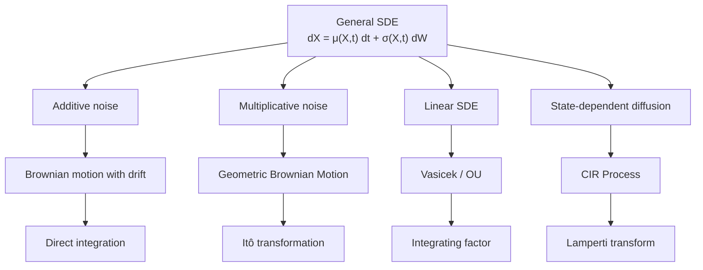
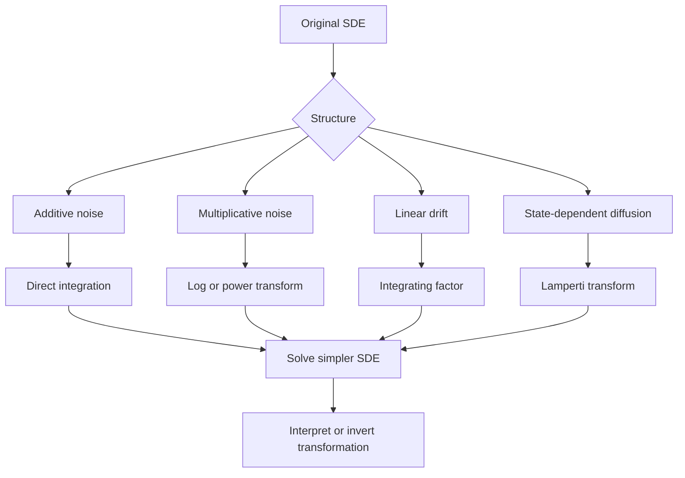
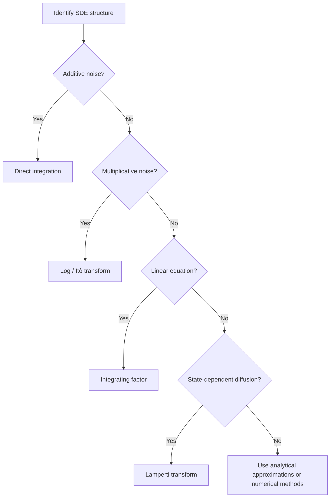

# Understanding Solutions of Stochastic Differential Equations

Stochastic differential equations (SDEs) describe systems that evolve under both deterministic forces and random fluctuations. They appear throughout physics, finance, biology, and engineering.

Because most SDEs cannot be solved in closed form, the goal of this chapter is to understand **what it means to solve an SDE, when analytical solutions exist, and how to recognize the structures that make them tractable**.

!!! abstract "Learning Goals"
    After completing this chapter you should be able to:

    - explain what it means to solve an SDE
    - distinguish between explicit pathwise solutions and distributional characterizations
    - recognize structural classes of SDEs
    - understand why transformations are central to solvability
    - identify when analytical methods are unlikely to succeed

The discussion proceeds in four stages:

1. **What a solution means**
2. **Structural classification of SDEs**
3. **Transformation-based thinking**
4. **Limits of closed-form solvability**

---

## 1. General Form of an SDE

An Itô stochastic differential equation has the form

$$
dX_t = \mu(X_t, t)\,dt + \sigma(X_t, t)\,dW_t
$$

where

| Symbol             | Meaning               |
| ------------------ | --------------------- |
| $X_t$              | stochastic process    |
| $\mu(X_t, t)$     | drift term            |
| $\sigma(X_t, t)$  | diffusion coefficient |
| $W_t$              | Brownian motion       |

The drift describes the **deterministic trend**, while the diffusion term represents **random fluctuations**.

---

## 2. What Does "Solving" an SDE Mean?

In deterministic calculus we solve for a function $x(t)$.

For stochastic differential equations the solution is itself a **random process**.

Solving an SDE typically means obtaining either

- an **explicit representation of the process**
- an **exact characterization of its law or distribution**
- a **transition density**
- enough structure to compute **moments**, **hitting probabilities**, or related quantities

A solution is often expressed in integral form as

$$
X_t = X_0 + \int_0^t \mu(X_s, s)\,ds + \int_0^t \sigma(X_s, s)\,dW_s
$$

For special models one may obtain a more explicit formula such as

$$
X_t = g(W_t, t, X_0)
$$

or another closed-form functional of the Brownian path.

Analytical solutions allow us to

- compute distributions
- derive moments
- analyze long-term behavior
- benchmark numerical algorithms

!!! warning "Important"
    Most SDEs **do not admit elementary closed-form pathwise solutions**.
    In many cases one can still characterize the process through its law, transition density, or associated PDE.

---

## 3. Types of Solvability

It is useful to distinguish several different notions of a "solution."

## Explicit Pathwise Solution

This is the strongest and most concrete case. One writes $X_t$ explicitly in terms of time, the initial condition, and Brownian motion.

Example idea:

$$
X_t = X_0 + \mu t + \sigma W_t
$$

## Distributional Characterization

Sometimes one cannot write a simple explicit formula for the full path, but can still describe the law of $X_t$.

Examples include:

- Gaussian laws for Ornstein–Uhlenbeck processes
- log-normal laws for geometric Brownian motion
- known transition densities for certain diffusion processes

## PDE / Generator Characterization

A diffusion may be analyzed indirectly through its infinitesimal generator or the partial differential equations satisfied by conditional expectations.

## Numerical Solvability

When closed forms are unavailable, the SDE may still be studied effectively through simulation, moment approximations, or PDE solvers.

---

## 4. Types of SDE Structures

Different analytical techniques apply depending on the structure of the equation.

Recognizing the structure of an SDE is the **most important step in solving it**.

---

## 5. The Transformation Viewpoint

Many solvable SDEs become manageable only after a suitable change of variables.

Typical examples include:

- **log transforms** for multiplicative noise
- **integrating factors** for linear drift
- **Lamperti transforms** for state-dependent diffusion

A useful mental model is

$$
\text{complicated SDE}
\;\rightarrow\;
\text{simpler transformed SDE}
\;\rightarrow\;
\text{solution or characterization}
$$

This is one of the central themes of stochastic calculus: we do not usually solve difficult SDEs by brute force, but by transforming them into forms we already understand.

---

## 6. Unified View of Structural Methods

Although the details differ from model to model, the strategy is often the same:

1. identify the equation's structure
2. apply the right transformation
3. solve or simplify the transformed equation
4. interpret the result in the original variables

---

## 7. Diffusion Model Cheat Sheet

The following table summarizes several classical diffusion models and their key structural properties.

| Model | SDE | Key Property | Typical Use |
|---|---|---|---|
| **Brownian Motion** | $dB_t = dW_t$ | pure randomness | building block |
| **BM with Drift** | $dX_t = \mu\,dt + \sigma\,dW_t$ | additive noise | physical diffusion |
| **GBM** | $dS_t = \mu S_t\,dt + \sigma S_t\,dW_t$ | log-normal | stock prices |
| **Vasicek / OU** | $dr_t = a(b - r_t)\,dt + \sigma\,dW_t$ | Gaussian, mean-reverting | interest rates |
| **CIR** | $dr_t = \kappa(\theta - r_t)\,dt + \sigma\sqrt{r_t}\,dW_t$ | non-negative | short-rate models |
| **Heston** | $dv_t = \kappa(\theta - v_t)\,dt + \sigma\sqrt{v_t}\,dW_t$ | stochastic volatility | option pricing |

### Key Structural Differences

| Structure                 | Example Model              | Key Feature                         |
| ------------------------- | -------------------------- | ----------------------------------- |
| **Additive noise**        | Brownian motion with drift | volatility independent of state     |
| **Multiplicative noise**  | GBM                        | volatility proportional to state    |
| **Mean reversion**        | Vasicek                    | process pulled toward long-run mean |
| **Square-root diffusion** | CIR                        | helps enforce non-negativity        |
| **Stochastic volatility** | Heston                     | volatility itself follows an SDE    |

### Quick Method Reference

| Model                      | Main Technique                              |
| -------------------------- | ------------------------------------------- |
| Brownian motion with drift | direct integration                          |
| GBM                        | Itô transformation (log)                    |
| Vasicek / OU               | integrating factor                          |
| CIR                        | Lamperti transform; Bessel-type connection  |

Recognizing these structural patterns helps determine **which analytical techniques apply**.

---

## 8. Analytical Tools for Studying SDEs

Some techniques do not directly produce an explicit pathwise solution, but they still provide powerful analytical information.

## Martingale Methods

If one can identify a function $g(X_t,t)$ such that $M_t = g(X_t,t)$ is a martingale, then conditional expectations can be analyzed through the generator of the diffusion.

This viewpoint leads naturally to the **Kolmogorov backward equation**.

## Feynman–Kac Formula

For

$$
dX_t = b(X_t)\,dt + \sigma(X_t)\,dW_t
$$

quantities of the form

$$
u(t, x) = \mathbb{E}[\phi(X_T) \mid X_t = x]
$$

satisfy a backward PDE of the form

$$
\nu_t + b(x)\,\nu_x + \frac{1}{2}\sigma^2(x)\,\nu_{xx} = 0
$$

in the simplest case. This creates a deep connection between **SDEs and PDEs**.

## Girsanov's Theorem

Girsanov's theorem allows one to change the **drift** of a stochastic process by changing the probability measure.

This is a fundamental tool in areas such as **risk-neutral pricing**.

---

## 9. When Closed-Form Solutions Do Not Exist

Most SDEs cannot be solved analytically in an elementary pathwise sense.

Examples include

- nonlinear stochastic volatility models
- SABR-type models
- multi-factor interest rate models
- jump-diffusions
- coupled nonlinear systems

Even when a simple explicit pathwise formula is unavailable, one may still have access to

- transition densities
- characteristic functions
- moment equations
- PDE representations
- simulation methods

Alternative approaches include

- Euler–Maruyama simulation
- Milstein scheme
- moment equations
- PDE solvers
- characteristic-function methods

---

## 10. Decision Framework

A practical workflow when encountering a new SDE is:

!!! summary "Key Takeaways"
    - Only a small class of SDEs admit elementary closed-form pathwise solutions
    - Many solvable models rely on **transformations**
    - Structural recognition is the first and most important step
    - When common transformations fail, one usually turns to PDE methods, transform methods, or numerical simulation

---

## 11. Bridge to Solution Techniques

In this chapter we focused on **what it means to solve an SDE** and on the structural ideas that determine solvability.

In the next chapter we turn to the main **solution techniques** themselves: direct integration, Itô transformations, integrating factors, Lamperti transforms, and the practical workflow for applying them to classical solvable models.
