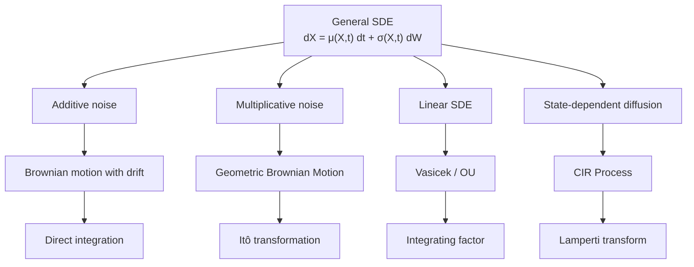
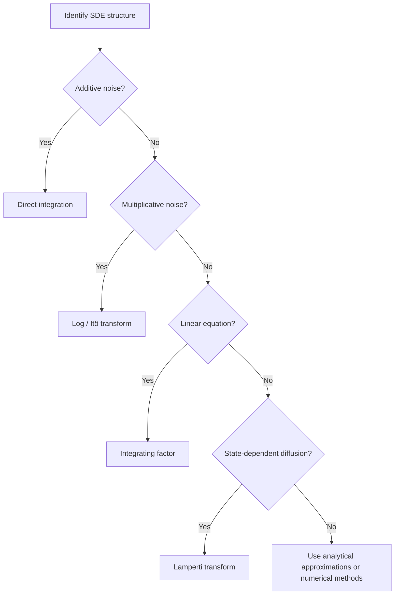

# Understanding Solutions of Stochastic Differential Equations

Stochastic differential equations (SDEs) describe systems that evolve under both deterministic forces and random fluctuations. They appear throughout physics, finance, biology, and engineering.

Because most SDEs cannot be solved in closed form, the goal of this chapter is to understand **what it means to solve an SDE, when analytical solutions exist, and how to recognize the structures that make them tractable**.

!!! abstract "Learning Goals"
    After completing this chapter you should be able to:

    - explain what it means to solve an SDE
    - distinguish between explicit pathwise solutions and distributional characterizations
    - recognize structural classes of SDEs
    - understand why transformations are central to solvability
    - identify when analytical methods are unlikely to succeed

The discussion proceeds in four stages:

1. **What a solution means**
2. **Structural classification of SDEs**
3. **Transformation-based thinking**
4. **Limits of closed-form solvability**

---

## 1. General Form of an SDE

An Itô stochastic differential equation has the form

$$
dX_t = \mu(X_t, t)\,dt + \sigma(X_t, t)\,dW_t
$$

where

| Symbol             | Meaning               |
| ------------------ | --------------------- |
| $X_t$              | stochastic process    |
| $\mu(X_t, t)$     | drift term            |
| $\sigma(X_t, t)$  | diffusion coefficient |
| $W_t$              | Brownian motion       |

The drift describes the **deterministic trend**, while the diffusion term represents **random fluctuations**.

---

## 2. What Does "Solving" an SDE Mean?

In deterministic calculus we solve for a function $x(t)$.

For stochastic differential equations the solution is itself a **random process**.

### Types of Solution

There are several distinct senses in which an SDE can be "solved":

**Explicit pathwise solution.** This is the strongest case. One writes $X_t$ explicitly in terms of time, the initial condition, and Brownian motion — for example, $X_t = X_0 + \mu t + \sigma W_t$. Such formulas allow direct simulation and transparent moment computation.

**Distributional characterization.** Sometimes no simple pathwise formula exists, but the law of $X_t$ is fully known. Examples include the Gaussian law of the OU process and the log-normal law of GBM. Knowing the distribution suffices for computing option prices, risk measures, and other statistical quantities.

**PDE / generator characterization.** A diffusion may be analyzed indirectly through the partial differential equations satisfied by conditional expectations. This approach connects SDEs to the Kolmogorov equations and the Feynman–Kac formula.

**Numerical solvability.** When closed forms are unavailable, the SDE may still be studied effectively through simulation, moment approximations, or PDE solvers.

A solution is often expressed in integral form as

$$
X_t = X_0 + \int_0^t \mu(X_s, s)\,ds + \int_0^t \sigma(X_s, s)\,dW_s
$$

Analytical solutions allow us to compute distributions, derive moments, analyze long-term behavior, and benchmark numerical algorithms.

!!! warning "Important"
    Most SDEs **do not admit elementary closed-form pathwise solutions**.
    In many cases one can still characterize the process through its law, transition density, or associated PDE.

---

## 3. Types of SDE Structures

Different analytical techniques apply depending on the structure of the equation. Recognizing the structure is the **most important step in solving an SDE**.

---

## 4. The Transformation Viewpoint

Many solvable SDEs become manageable only after a suitable change of variables. The central theme is

$$
\text{complicated SDE}
\;\rightarrow\;
\text{simpler transformed SDE}
\;\rightarrow\;
\text{solution or characterization}
$$

We do not usually solve difficult SDEs by brute force, but by transforming them into forms we already understand. Typical transformations include:

- **log transforms** for multiplicative noise — removes state dependence from the diffusion
- **integrating factors** for linear drift — cancels the deterministic decay term
- **Lamperti transforms** for state-dependent diffusion — normalizes the diffusion coefficient to a constant

Although the details differ from model to model, the strategy is the same: identify the equation's structure, apply the appropriate transformation, solve or simplify, then interpret the result in the original variables.

---

## 5. Diffusion Model Cheat Sheet

| Model | SDE | Key Property | Typical Use |
|---|---|---|---|
| **Brownian Motion** | $dB_t = dW_t$ | pure randomness | building block |
| **BM with Drift** | $dX_t = \mu\,dt + \sigma\,dW_t$ | additive noise | physical diffusion |
| **GBM** | $dS_t = \mu S_t\,dt + \sigma S_t\,dW_t$ | log-normal | stock prices |
| **Vasicek / OU** | $dr_t = a(\theta - r_t)\,dt + \sigma\,dW_t$ | Gaussian, mean-reverting | interest rates |
| **CIR** | $dr_t = a(\theta - r_t)\,dt + \sigma\sqrt{r_t}\,dW_t$ | non-negative | short-rate models |
| **Heston** | $dv_t = \kappa(\bar{v} - v_t)\,dt + \xi\sqrt{v_t}\,dW_t$ | stochastic volatility | option pricing |

!!! note "Heston Notation"
    The Heston variance SDE uses the conventional parameters $\kappa$ (mean-reversion speed), $\bar{v}$ (long-run variance), and $\xi$ (vol of vol) to distinguish it from the CIR/Vasicek notation $a$, $\theta$, $\sigma$ used elsewhere in this chapter.

### Key Structural Differences

| Structure                 | Example Model              | Key Feature                         |
| ------------------------- | -------------------------- | ----------------------------------- |
| **Additive noise**        | Brownian motion with drift | volatility independent of state     |
| **Multiplicative noise**  | GBM                        | volatility proportional to state    |
| **Mean reversion**        | Vasicek                    | process pulled toward long-run mean |
| **Square-root diffusion** | CIR                        | helps enforce non-negativity        |
| **Stochastic volatility** | Heston                     | volatility itself follows an SDE    |

### Quick Method Reference

| Model                      | Main Technique                              |
| -------------------------- | ------------------------------------------- |
| Brownian motion with drift | direct integration                          |
| GBM                        | Itô transformation (log)                    |
| Vasicek / OU               | integrating factor                          |
| CIR                        | Lamperti transform; Bessel-type connection  |

---

## 6. Analytical Tools for Studying SDEs

Some techniques do not directly produce an explicit pathwise solution, but still provide powerful analytical information.

### Martingale Methods

If one can identify a function $g(X_t,t)$ such that $M_t = g(X_t,t)$ is a martingale, then conditional expectations can be analyzed through the generator of the diffusion. This viewpoint leads naturally to the **Kolmogorov backward equation**.

### Feynman–Kac Formula

For an SDE $dX_t = b(X_t)\,dt + \sigma(X_t)\,dW_t$, quantities of the form

$$
u(t, x) = \mathbb{E}[\phi(X_T) \mid X_t = x]
$$

satisfy a backward PDE

$$
u_t + b(x)\,u_x + \frac{1}{2}\sigma^2(x)\,u_{xx} = 0
$$

This creates a deep connection between **SDEs and PDEs**, and is the foundation of the Black–Scholes equation in mathematical finance.

### Girsanov's Theorem

Girsanov's theorem allows one to change the **drift** of a stochastic process by changing the probability measure. This is a fundamental tool in **risk-neutral pricing**: under the physical measure $\mathbb{P}$ the drift involves the true return $\mu$, while under the risk-neutral measure $\mathbb{Q}$ it involves the risk-free rate $r$.

---

## 7. When Closed-Form Solutions Do Not Exist

Most SDEs cannot be solved analytically in an elementary pathwise sense. Examples include nonlinear stochastic volatility models, SABR-type models, multi-factor interest rate models, jump-diffusions, and coupled nonlinear systems.

Even when a simple explicit pathwise formula is unavailable, one may still have access to transition densities, characteristic functions, moment equations, PDE representations, and simulation methods. In all these cases the structural classification of §3 remains the starting point: knowing the equation's form determines which analytical or numerical tool to reach for.

---

## 8. Decision Framework

A practical workflow when encountering a new SDE:

!!! summary "Key Takeaways"
    - Only a small class of SDEs admit elementary closed-form pathwise solutions
    - Many solvable models rely on **transformations**
    - Structural recognition is the first and most important step
    - When common transformations fail, one usually turns to PDE methods, transform methods, or numerical simulation

---

## 9. Bridge to Solution Techniques

In this chapter we focused on **conceptual foundations**: what it means to solve an SDE, the four senses of solvability, and the structural patterns that determine which techniques apply.

In the next chapter we turn to the main **solution techniques** themselves: direct integration, Itô transformations, integrating factors, Lamperti transforms, and the practical workflow for applying them to classical solvable models.

---

## Exercises

**Exercise 1.** For each of the following, state which type of solution is being described: explicit pathwise solution, distributional characterization, PDE/generator characterization, or numerical solvability.

(a) $S_t = S_0 \exp[(\mu - \sigma^2/2)t + \sigma W_t]$

(b) The transition density of $r_t$ satisfies the Fokker–Planck equation.

(c) $r_t$ follows a noncentral chi-squared distribution with known parameters.

(d) Euler–Maruyama simulation with $10^6$ sample paths gives $\widehat{\mathbb{E}}[X_T] = 3.14 \pm 0.02$.

---

**Exercise 2.** For the SDE $dX_t = \alpha X_t(1 - X_t)\,dt + \sigma X_t(1 - X_t)\,dW_t$:

(a) Classify the noise structure (additive, multiplicative, or state-dependent diffusion).

(b) Suggest a transformation that might simplify the diffusion coefficient.

(c) Is a closed-form pathwise solution likely? Justify your reasoning.

---

**Exercise 3.** Consider the three canonical transformations:

| Transformation | Target structure |
|---|---|
| $Y_t = \log X_t$ | ? |
| $Y_t = e^{at}(X_t - \theta)$ | ? |
| $Y_t = \int^{X_t} \frac{dx}{\sigma(x)}$ | ? |

Fill in the "Target structure" column by describing what type of SDE each transformation is designed to simplify.

---

**Exercise 4.** The SABR model for forward rates is

$$
dF_t = \sigma_t F_t^\beta\,dW_t^{(1)}, \qquad d\sigma_t = \alpha\,\sigma_t\,dW_t^{(2)}
$$

with $\langle dW_t^{(1)}, dW_t^{(2)} \rangle = \rho\,dt$.

(a) Does this model admit an elementary closed-form pathwise solution? Why or why not?

(b) Which of the four senses of solvability (pathwise, distributional, PDE, numerical) are available for this model?

---

**Exercise 5.** Explain why the Feynman–Kac formula creates a connection between SDEs and PDEs. Specifically, if $u(t,x) = \mathbb{E}[\phi(X_T) \mid X_t = x]$ for an SDE with drift $b(x)$ and diffusion $\sigma(x)$, write down the PDE that $u$ satisfies and explain why this is useful when direct simulation is expensive.

---

**Exercise 6.** A colleague proposes modeling a stock price with the SDE $dS_t = \mu\,dt + \sigma\,dW_t$ (Brownian motion with drift) instead of geometric Brownian motion. Identify at least two problems with this choice from a modeling perspective, referring to the structural classification discussed in this chapter.
