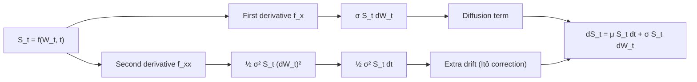
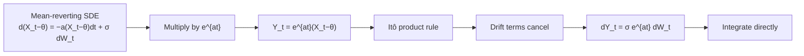
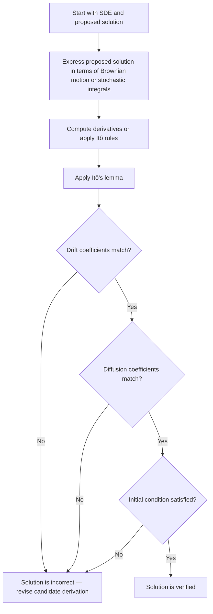
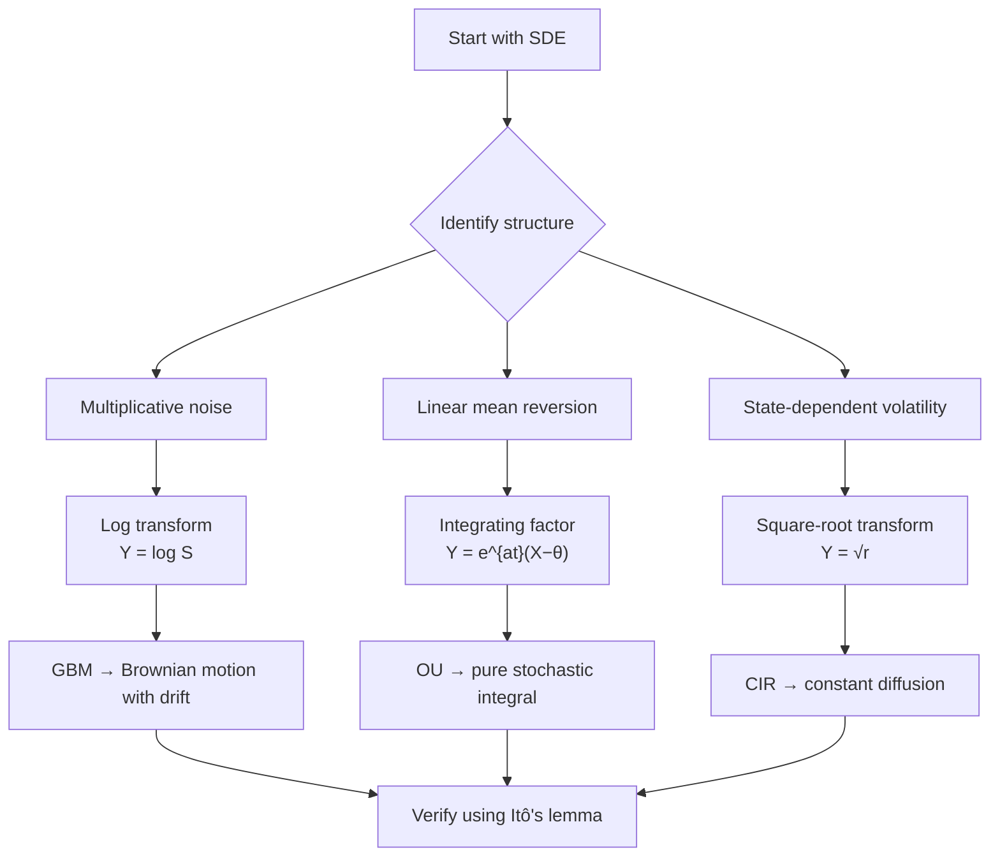

# Verifying SDE Solutions

Given a stochastic differential equation and a proposed solution, we need to verify whether the solution indeed satisfies the SDE. This verification process is fundamental in stochastic calculus: it confirms the correctness of analytical solutions before using them in applications such as pricing, risk management, and simulation.

Verification is typically easier than solving an SDE itself. Once a candidate solution is known, checking it requires only Itô calculus.

!!! abstract "Learning Goals"
    After completing this section you should be able to:

    - state the formal definition of a strong solution to an SDE
    - apply Itô's lemma to compute the differential of a proposed solution
    - match drift and diffusion coefficients to verify correctness
    - recognize common pitfalls in SDE verification

---

## 1. What It Means to Solve an SDE

### Formal Definition

Consider a general SDE

$$
dX_t = \mu(X_t, t)\,dt + \sigma(X_t, t)\,dW_t
$$

We say that $X_t$ is a **strong solution** if it is an adapted, continuous process satisfying the integral equation

$$
X_t = X_0 + \int_0^t \mu(X_s, s)\,ds + \int_0^t \sigma(X_s, s)\,dW_s
$$

almost surely for all $t \geq 0$, where the stochastic integral is understood in the Itô sense.

Note that the solution may depend on the **entire Brownian path** up to time $t$, not simply on the current value $W_t$. For instance, the Ornstein–Uhlenbeck solution involves a stochastic integral over the path.

### Why Verification Works

Under conditions ensuring existence and uniqueness of the SDE, any adapted process whose Itô differential has the same drift and diffusion coefficients as the SDE, and satisfies the initial condition, must coincide with the unique solution.

The verification procedure is:

1. Compute $dX_t$ using **Itô's lemma**
2. Compare the resulting drift and diffusion coefficients with the original SDE
3. Confirm the initial condition

---

## 2. Itô's Lemma

The central tool for verification is Itô's lemma.

**Theorem (Itô's Lemma).** Let $X_t$ be an Itô process satisfying

$$
dX_t = \mu_t\,dt + \sigma_t\,dW_t
$$

and let $f(x, t) \in C^{2,1}(\mathbb{R} \times [0, T])$. Then the differential of $Y_t = f(X_t, t)$ is given by

$$
df(X_t, t) = \left(\frac{\partial f}{\partial t} + \mu_t \frac{\partial f}{\partial x} + \frac{1}{2}\sigma_t^2 \frac{\partial^2 f}{\partial x^2}\right)dt + \sigma_t \frac{\partial f}{\partial x}\,dW_t
$$

**Special case.** When $X_t = W_t$ (standard Brownian motion with $\mu_t = 0$, $\sigma_t = 1$):

$$
df(W_t, t) = \left(\frac{\partial f}{\partial t} + \frac{1}{2}\frac{\partial^2 f}{\partial x^2}\right)dt + \frac{\partial f}{\partial x}\,dW_t
$$

!!! tip "Regularity Requirement"
    Itô's lemma requires $f \in C^{2,1}$: twice continuously differentiable in $x$ and once in $t$. If the proposed solution does not satisfy this condition, the lemma cannot be applied directly.

This formula replaces the ordinary chain rule when stochastic terms are present. The extra $\frac{1}{2}\sigma_t^2 f_{xx}$ term — the **Itô correction** — arises because $(dW_t)^2 = dt$ rather than zero.

---

## 3. Worked Examples

The following examples illustrate the verification procedure for several important models in quantitative finance.

### Example 1: Geometric Brownian Motion

### SDE

$$
dS_t = \mu S_t\,dt + \sigma S_t\,dW_t
$$

with $S_0 > 0$.

### Proposed Solution

$$
S_t = S_0 \exp\left[\left(\mu - \frac{\sigma^2}{2}\right)t + \sigma W_t\right]
$$

### Verification

Write the solution as $S_t = f(W_t, t)$ with

$$
f(x, t) = S_0 \exp\left[\left(\mu - \frac{\sigma^2}{2}\right)t + \sigma x\right]
$$

**Step 1.** Compute partial derivatives.

$$
\frac{\partial f}{\partial t} = \left(\mu - \frac{\sigma^2}{2}\right) S_t, \qquad
\frac{\partial f}{\partial x} = \sigma\,S_t, \qquad
\frac{\partial^2 f}{\partial x^2} = \sigma^2 S_t
$$

**Step 2.** Apply Itô's lemma (special case with $X_t = W_t$).

$$
dS_t = \left[\left(\mu - \frac{\sigma^2}{2}\right)S_t + \frac{1}{2}\sigma^2 S_t\right]dt + \sigma S_t\,dW_t = \mu S_t\,dt + \sigma S_t\,dW_t \checkmark
$$

**Step 3.** Check the initial condition: $f(0, 0) = S_0$. $\checkmark$

The proposed process satisfies the SDE.

### Interpretation

The $-\frac{\sigma^2}{2}$ term in the exponent is the **Itô correction**, arising from the second-order term in Itô's lemma. In ordinary calculus $(dW_t)^2$ would be negligible, but in stochastic calculus $(dW_t)^2 = dt$, producing a nonzero contribution to the drift.

### Where the Itô Correction Comes From

The first derivative produces the **diffusion term**, while the second derivative produces **extra drift**. The $-\sigma^2/2$ term in the exponent exactly cancels this extra drift, making the solution consistent with the original SDE.

---

### Example 2: Ornstein–Uhlenbeck Process

### SDE

$$
dX_t = a(\theta - X_t)\,dt + \sigma\,dW_t
$$

where $a > 0$ is the speed of mean reversion, $\theta$ is the long-term mean, and $\sigma > 0$ is the volatility.

### Proposed Solution

$$
X_t = X_0\,e^{-at} + \theta(1 - e^{-at}) + \sigma \int_0^t e^{-a(t-s)}\,dW_s
$$

### Verification

Rewrite the SDE in terms of the deviation from $\theta$:

$$
d(X_t - \theta) = -a(X_t - \theta)\,dt + \sigma\,dW_t
$$

We cancel the deterministic decay term using an integrating factor. Define $Y_t = e^{at}(X_t - \theta)$. The factor $e^{at}$ is chosen precisely because it converts the $-a Y_t\,dt$ drift into zero: by the Itô product rule (noting that $e^{at}$ has finite variation, so no extra quadratic covariation term appears),

$$
dY_t = ae^{at}(X_t - \theta)\,dt + e^{at}\,d(X_t - \theta)
$$

Substituting $d(X_t - \theta) = -a(X_t - \theta)\,dt + \sigma\,dW_t$:

$$
dY_t = ae^{at}(X_t - \theta)\,dt + e^{at}\left[-a(X_t - \theta)\,dt + \sigma\,dW_t\right] = \sigma\,e^{at}\,dW_t
$$

The drift terms cancel completely. Integrating from $0$ to $t$:

$$
Y_t = Y_0 + \sigma \int_0^t e^{as}\,dW_s
$$

Since $Y_0 = X_0 - \theta$, dividing by $e^{at}$ recovers the proposed solution:

$$
X_t = \theta + (X_0 - \theta)\,e^{-at} + \sigma \int_0^t e^{-a(t-s)}\,dW_s \checkmark
$$

### Why the Integrating Factor Works

The mean-reverting term causes exponential decay toward $\theta$. Multiplying by $e^{at}$ cancels this decay, converting the process into a pure stochastic integral that can be integrated directly.

### Properties

**Conditional mean:** $\mathbb{E}[X_t \mid X_0] = X_0\,e^{-at} + \theta(1 - e^{-at})$

**Conditional variance:** $\operatorname{Var}[X_t \mid X_0] = \dfrac{\sigma^2}{2a}(1 - e^{-2at})$

**Long-term behavior:** $\lim_{t \to \infty} \mathbb{E}[X_t] = \theta$, $\quad \lim_{t \to \infty} \operatorname{Var}[X_t] = \dfrac{\sigma^2}{2a}$

!!! tip "Vasicek Model"
    The Vasicek interest rate model $dr_t = a(\theta - r_t)\,dt + \sigma\,dW_t$ uses the same notation as the OU process above. Its solution and verification follow the same steps.

---

### Example 3: CIR Model — Transformation and Distribution

### SDE

$$
dr_t = a(\theta - r_t)\,dt + \sigma\sqrt{r_t}\,dW_t
$$

where $a, \theta, \sigma > 0$ and the **Feller condition** $2a\theta \geq \sigma^2$ ensures $r_t \geq 0$ for all $t$.

### Verification of the Square-Root Transformation

The CIR model does not admit a simple explicit pathwise solution in elementary functions. However, we can verify useful transformations.

**Claim.** Let $X_t = \sqrt{r_t}$. We derive the SDE for $X_t$.

Apply Itô's lemma to $f(r) = \sqrt{r}$, with $f'(r) = \tfrac{1}{2\sqrt{r}}$ and $f''(r) = -\tfrac{1}{4r^{3/2}}$:

$$
dX_t = \left[\frac{a(\theta - r_t)}{2\sqrt{r_t}} - \frac{\sigma^2}{8\sqrt{r_t}}\right]dt + \frac{\sigma}{2}\,dW_t
$$

Writing everything in terms of $X_t = \sqrt{r_t}$:

$$
dX_t = \left[\frac{a\theta - \sigma^2/4}{2\,X_t} - \frac{a}{2}\,X_t\right]dt + \frac{\sigma}{2}\,dW_t
$$

The diffusion coefficient is now **constant** ($\sigma/2$). The transformed process is closely related to **squared Bessel processes**, which is useful for analytical study.

### Transition Distribution

Conditional on $r_0$, the distribution of $r_t$ for $t > 0$ is a scaled noncentral chi-square distribution:

$$
r_t \sim \frac{\sigma^2(1-e^{-at})}{4a}\;\chi^2_d\!\left(\lambda(t)\right)
$$

where $d = \frac{4a\theta}{\sigma^2}$ is the degrees of freedom and

$$
\lambda(t) = \frac{4a\,e^{-at}}{\sigma^2(1-e^{-at})}\,r_0
$$

is the noncentrality parameter (standard convention: the argument of $\chi^2_d$ is the noncentrality parameter, not the per-degree-of-freedom value). This distribution can be verified by checking that the corresponding density satisfies the **Fokker–Planck equation** (forward Kolmogorov equation):

$$
\frac{\partial p}{\partial t} = -\frac{\partial}{\partial r}[a(\theta-r)\,p] + \frac{1}{2}\frac{\partial^2}{\partial r^2}[\sigma^2 r\,p]
$$

---

## 4. Verification Workflow

### Step-by-Step Checklist

| Step | Action | Check |
| ---- | ------ | ----- |
| 1 | Write down the SDE | $dX_t = \mu(X_t, t)\,dt + \sigma(X_t, t)\,dW_t$ |
| 2 | Identify the proposed solution | may involve stochastic integrals |
| 3 | Compute derivatives or apply Itô rules as needed | $f_t$, $f_x$, $f_{xx}$, product rule |
| 4 | Apply Itô's lemma | include the $\frac{1}{2}\sigma^2 f_{xx}$ term |
| 5 | Match drift coefficients | $dt$ terms must agree |
| 6 | Match diffusion coefficients | $dW_t$ terms must agree |
| 7 | Verify the initial condition | $X_0 = f(W_0, 0)$ or equivalent |

---

## 5. Common Pitfalls

### Forgetting the Itô Correction

The $\frac{1}{2}\sigma^2 f_{xx}$ term is essential. Omitting it amounts to using the ordinary chain rule, which does not hold in stochastic calculus because $(dW_t)^2 = dt$.

### Incorrect Sign in Mean Reversion

In mean-reverting models, the sign convention matters. The drift $a(\theta - X_t)$ pulls the process **toward** $\theta$, while $a(X_t - \theta)$ would push it **away**. Confusing these signs is a frequent source of errors.

### Assuming Solutions Depend Only on the Current Brownian Value

Many SDE solutions involve stochastic integrals over the entire Brownian path, such as $\sigma \int_0^t e^{-a(t-s)}\,dW_s$. These cannot be written as functions of $W_t$ alone. Verification must account for the full path dependence.

### Ignoring Regularity Conditions

Itô's lemma requires $f \in C^{2,1}$. If the transformation is not sufficiently smooth (for example, $f(x) = |x|$ at $x = 0$), the standard lemma does not apply.

### Forgetting That Finite-Variation Processes Have No Itô Term

Deterministic functions such as $e^{at}$ have finite variation. When computing $d(e^{at} X_t)$ using the product rule, no additional Itô correction appears from the deterministic factor — only the stochastic terms in $dX_t$ contribute to quadratic covariation.

!!! summary "Key Takeaway"
    Verifying SDE solutions reduces to computing the differential of the proposed process using Itô's lemma and matching the resulting drift and diffusion coefficients with the original equation.

---

## 6. Unified View: Three Transformation Patterns

The three examples above are instances of the **same strategy**: transform the process to simplify its SDE, then verify the result using Itô calculus.

| Structure              | Transformation                          | Effect                      | Model        |
| ---------------------- | --------------------------------------- | --------------------------- | ------------ |
| multiplicative noise   | $Y_t = \log S_t$                        | removes state dependence    | GBM          |
| linear mean reversion  | $Y_t = e^{at}(X_t - \theta)$           | cancels deterministic drift | OU / Vasicek |
| square-root diffusion  | $Y_t = \sqrt{X_t}$                      | makes diffusion constant    | CIR          |

Recognizing which transformation applies is the key step. Verification then confirms the result mechanically.
