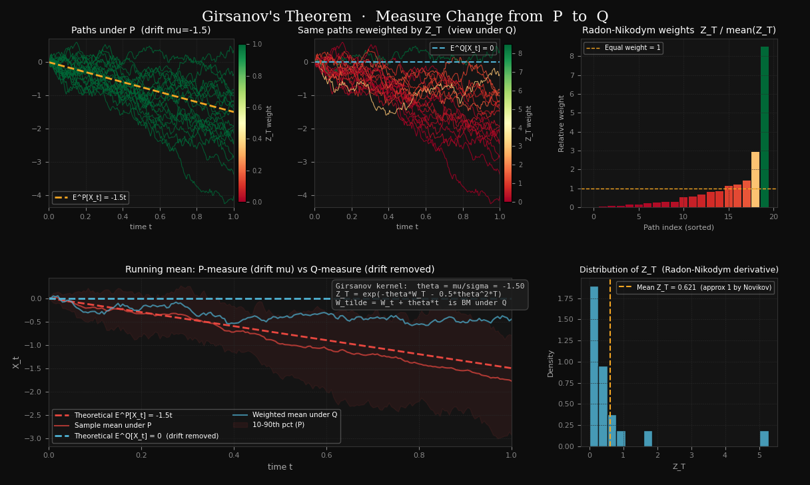

# Girsanov's Theorem


Girsanov's theorem is one of the most powerful tools in mathematical finance. It describes how a change of probability measure modifies the drift of a stochastic process while preserving its Brownian structure. This is essential for pricing derivatives via risk-neutral measures.

!!! note "Standing assumptions"
    All processes in this section are defined on a filtered probability space $(\Omega, \mathcal{F}, \{\mathcal{F}_t\}, \mathbb{P})$ satisfying the usual conditions, and all measure changes are between equivalent probability measures. In financial applications, the Girsanov kernel $\theta_t$ is often denoted $\lambda_t$ and called the **market price of risk**.

---

## Setting and Assumptions

Let $(\Omega, \mathcal{F}, \{\mathcal{F}_t\}, \mathbb{P})$ be a filtered probability space supporting a standard Brownian motion $W_t$.

Let $\theta_t$ be an **adapted process** (the **Girsanov kernel**) satisfying the **Novikov condition**:

$$
\mathbb{E}^{\mathbb{P}}\!\left[
\exp\!\left(\frac{1}{2} \int_0^T \theta_s^2 \,ds\right)
\right] < \infty
$$

This condition ensures that the exponential martingale does not explode and is a true martingale (not just a local martingale).

---

## The Exponential Martingale

Define the **Radon-Nikodym derivative** (also called the **exponential martingale**):

$$
\boxed{
Z_t = \exp\!\left(
-\int_0^t \theta_s\, dW_s
-\frac{1}{2} \int_0^t \theta_s^2 \,ds
\right)
}
$$

**Key properties:**

1. **Strictly positive:** $Z_t > 0$ almost surely for all $t$
2. **Martingale:** Under the original measure $\mathbb{P}$, $Z_t$ is a true martingale
3. **Unit expectation:** $\mathbb{E}^{\mathbb{P}}[Z_t] = 1$ for all $t$

**Why the form?** The specific structure $-\int \theta\,dW_s - \frac{1}{2}\int \theta^2 ds$ arises from Itô's lemma applied to exponential functions, ensuring the martingale property.

---

## The Measure Change

Define a new probability measure $\mathbb{Q}$ on $\mathcal{F}_T$ via:

$$
\boxed{
\frac{d\mathbb{Q}}{d\mathbb{P}}\Big|_{\mathcal{F}_T} = Z_T
}
$$

For any $\mathcal{F}_T$-measurable random variable $X$ with $\mathbb{E}^{\mathbb{P}}[|X| \cdot Z_T] < \infty$, the relationship between expectations under the two measures is:

$$
\mathbb{E}^{\mathbb{Q}}[X] = \mathbb{E}^{\mathbb{P}}[X \cdot Z_T]
$$

For events in the σ-algebra $\mathcal{F}_t$ (where $t \leq T$), since $Z_t$ is a martingale:

$$
\mathbb{Q}(A) = \mathbb{E}^{\mathbb{P}}[Z_T \cdot \mathbf{1}_A] = \mathbb{E}^{\mathbb{P}}[Z_t \cdot \mathbf{1}_A], \quad A \in \mathcal{F}_t
$$

---

## Statement of Girsanov's Theorem

**Theorem (Girsanov, 1960):** Under the new measure $\mathbb{Q}$, the process

$$
\boxed{
\widetilde{W}_t := W_t + \int_0^t \theta_s \,ds
}
$$

is a **standard Brownian motion**.

**Equivalently:** The original Brownian motion $W_t$ can be written as

$$
W_t = \widetilde{W}_t - \int_0^t \theta_s\,ds
$$

under $\mathbb{Q}$.

---

## Interpretation: How the Drift Term Changes

| Perspective | Under $\mathbb{P}$ (Original Measure) | Under $\mathbb{Q}$ (New Measure) |
|-------------|--------------------------------------|--------------------------------|
| Brownian motion | $W_t$ is standard | $\widetilde{W}_t$ is standard |
| Transformed BM | $\widetilde{W}_t = W_t + \int \theta\,ds$ has drift | Driftless |
| What changed | Original measure | Probability measure and interpretation |
| Information structure | Same filtration | Same filtration |
| Volatility | Unchanged | Unchanged |

**Key insight:** The theorem shows that drift can be removed by reweighting paths via a change of measure. The drift term in an SDE representation can change under equivalent measure change — it reflects how we assign probabilities to outcomes, not just the pathwise behavior.

<figure markdown="span">
  { width="100%" }
  <figcaption>
    <strong>Figure 1 — Girsanov's theorem visualized on 200 simulated paths
    (μ = −1.5, σ = 1, T = 1).</strong>
    <em>Top-left:</em> Paths under the physical measure ℙ drawn with equal opacity; the amber
    dashed line tracks the theoretical drift μt.
    <em>Top-center:</em> The same paths under ℚ — opacity is proportional to the
    Radon-Nikodym weight Z<sub>T</sub> = exp(−θW<sub>T</sub> − ½θ²T).
    High-weight paths (those that drifted upward against μ) appear dark and prominent;
    low-weight paths fade to near-invisible, making the measure change immediately visible.
    <em>Top-right:</em> Sorted bar chart of relative Z<sub>T</sub> weights (alpha-coded);
    the amber dashed line marks equal weight (Z̄ = 1), confirming
    𝔼<sup>ℙ</sup>[Z<sub>T</sub>] ≈ 1 (Novikov condition).
    <em>Bottom-left/center:</em> Running means under ℙ (red, drifting at rate μ) vs. the
    Z<sub>T</sub>-weighted mean under ℚ (blue, collapsing to zero), confirming drift removal.
    The shaded band shows the 10th–90th percentile range of paths under ℙ, illustrating
    how the bulk of the distribution shifts downward while the reweighting selects the
    upward-drifting minority.
    <em>Bottom-right:</em> Histogram of Z<sub>T</sub> values (200 samples) — the
    right-skewed lognormal shape centred near 1 is consistent with the martingale property.
  </figcaption>
</figure>

---

## Connection to SDEs: Changing the Drift Term

**Original SDE under $\mathbb{P}$:**

$$
dX_t = \mu(t)\,dt + \sigma(t)\,dW_t
$$

where $\mu(t)$ is the drift.

**Choose Girsanov kernel:** $\theta_t = \frac{\mu(t)}{\sigma(t)}$ (assuming $\sigma(t) \neq 0$)

**Under $\mathbb{Q}$:** Since $W_t = \widetilde{W}_t - \int_0^t \theta_s\,ds$:

$$
dX_t = \mu(t)\,dt + \sigma(t)\left(d\widetilde{W}_t - \theta_t\,dt\right)
$$

$$
= \mu(t)\,dt + \sigma(t)\,d\widetilde{W}_t - \sigma(t)\theta_t\,dt
$$

$$
= \left(\mu(t) - \sigma(t)\theta_t\right)dt + \sigma(t)\,d\widetilde{W}_t
$$

$$
= 0\,dt + \sigma(t)\,d\widetilde{W}_t
$$

$$
= \sigma(t)\,d\widetilde{W}_t
$$

**Result:** The drift term in this representation is removed under $\mathbb{Q}$.

---

## Financial Application: Risk-Neutral Pricing

**Problem:** Price a derivative given the stock price dynamics under the physical measure $\mathbb{P}$:

$$
dS_t = \mu S_t\,dt + \sigma S_t\,dW_t
$$

The risk $\mu$ and risk-free rate $r$ are different, so this is not a martingale.

**Solution via Girsanov:**

1. **Choose Girsanov kernel:** $\theta = \frac{\mu - r}{\sigma}$ (market price of risk)

2. **Define numeraire-relative measure $\mathbb{Q}$:** Use $Z_T = \exp\left(-\int_0^T \theta\,dW_s - \frac{1}{2}\int_0^T \theta^2\,ds\right)$

3. **Under $\mathbb{Q}$:** The discounted stock price becomes a martingale:

$$
d(e^{-rt}S_t) = 0\,dt + e^{-rt}\sigma S_t\,d\widetilde{W}_t
$$

4. **Option price:** Risk-neutral expectation:

$$
C(t, S_t) = e^{-r(T-t)} \mathbb{E}^{\mathbb{Q}}[(S_T - K)^+ | \mathcal{F}_t]
$$

This is the foundation of the Black-Scholes pricing formula.

---

## Example 1: Drifted Brownian Motion

**Original process under $\mathbb{P}$:**

$$
dX_t = \mu\,dt + \sigma\,dW_t, \quad X_0 = 0
$$

where $\mu$ and $\sigma$ are constants.

**Choose Girsanov kernel:** $\theta = \frac{\mu}{\sigma}$ (constant)

**Check Novikov condition:**

$$
\mathbb{E}^{\mathbb{P}}\left[\exp\left(\frac{1}{2}\int_0^T \left(\frac{\mu}{\sigma}\right)^2 ds\right)\right] = \exp\left(\frac{\mu^2 T}{2\sigma^2}\right) < \infty \quad \checkmark
$$

**Exponential martingale:**

$$
Z_t = \exp\left(-\frac{\mu}{\sigma}W_t - \frac{\mu^2 t}{2\sigma^2}\right)
$$

**Under $\mathbb{Q}$ with $d\mathbb{Q}/d\mathbb{P} = Z_T$:**

$$
\widetilde{W}_t := W_t + \frac{\mu}{\sigma}t \text{ is a standard Brownian motion}
$$

**Therefore:** Substituting back into the original SDE:

$$
dX_t = \mu\,dt + \sigma\left(d\widetilde{W}_t - \frac{\mu}{\sigma}dt\right) = 0\,dt + \sigma\,d\widetilde{W}_t = \sigma\,d\widetilde{W}_t
$$

The drift term in this representation has been removed under $\mathbb{Q}$.

**Under $\mathbb{Q}$:**

$$
X_t = \sigma\widetilde{W}_t \sim \mathcal{N}(0, \sigma^2 t)
$$

---

## Example 2: Geometric Brownian Motion (Stock Price)

**Original process under $\mathbb{P}$ (physical measure):**

$$
dS_t = \mu S_t\,dt + \sigma S_t\,dW_t
$$

where:
- $\mu$ = real-world drift (expected return)
- $\sigma$ = volatility
- $r$ = risk-free rate (assumed constant)

**Key observation:** The discounted stock price $e^{-rt}S_t$ is NOT a $\mathbb{P}$-martingale because:

$$
d(e^{-rt}S_t) = -re^{-rt}S_t\,dt + e^{-rt}dS_t
$$

$$
= -re^{-rt}S_t\,dt + e^{-rt}(\mu S_t\,dt + \sigma S_t\,dW_t)
$$

$$
= e^{-rt}S_t(\mu - r)\,dt + e^{-rt}\sigma S_t\,dW_t$$

The $dt$ coefficient is $(\mu - r)S_t e^{-rt} \neq 0$ (unless $\mu = r$), so this is not a martingale.

**Choose Girsanov kernel:** The market price of risk

$$
\theta = \frac{\mu - r}{\sigma}
$$

**Check Novikov condition:**

$$
\mathbb{E}^{\mathbb{P}}\left[\exp\left(\frac{1}{2}\int_0^T \left(\frac{\mu-r}{\sigma}\right)^2 ds\right)\right] = \exp\left(\frac{(\mu-r)^2 T}{2\sigma^2}\right) < \infty \quad \checkmark
$$

**Exponential martingale (Radon-Nikodym derivative):**

$$
Z_t = \exp\left(-\frac{\mu - r}{\sigma}W_t - \frac{(\mu-r)^2 t}{2\sigma^2}\right)
$$

**Under $\mathbb{Q}$ with $d\mathbb{Q}/d\mathbb{P} = Z_T$:**

$$
\widetilde{W}_t := W_t + \frac{\mu - r}{\sigma}t \text{ is a standard Brownian motion}
$$

**Transform the SDE:** Since $W_t = \widetilde{W}_t - \frac{\mu-r}{\sigma}t$:

$$
dS_t = \mu S_t\,dt + \sigma S_t\left(d\widetilde{W}_t - \frac{\mu-r}{\sigma}dt\right)
$$

$$
= \mu S_t\,dt + \sigma S_t\,d\widetilde{W}_t - (\mu - r)S_t\,dt
$$

$$
= rS_t\,dt + \sigma S_t\,d\widetilde{W}_t
$$

**Result under $\mathbb{Q}$ (risk-neutral measure):**

$$
dS_t = rS_t\,dt + \sigma S_t\,d\widetilde{W}_t
$$

Now the discounted stock price is a martingale:

$$
d(e^{-rt}S_t) = -re^{-rt}S_t\,dt + e^{-rt}dS_t
$$

$$
= -re^{-rt}S_t\,dt + e^{-rt}(rS_t\,dt + \sigma S_t\,d\widetilde{W}_t)
$$

$$
= e^{-rt}\sigma S_t\,d\widetilde{W}_t \quad \text{(martingale!)}
$$

**Option pricing:** A European call option with strike $K$ and maturity $T$ has price:

$$
C(t, S_t) = e^{-r(T-t)} \mathbb{E}^{\mathbb{Q}}[(S_T - K)^+ | \mathcal{F}_t]
$$

where the expectation is under the **risk-neutral measure** $\mathbb{Q}$.

**Key insight:** Under $\mathbb{Q}$:
- The expected return of the stock is $r$ (risk-free rate)
- Investors are indifferent to risk
- This is why derivative prices don't depend on $\mu$!

---

## Example 3: Vasicek Model (Interest Rates)

**Original process under $\mathbb{P}$:**

$$
dr_t = \kappa(\bar{r} - r_t)\,dt + \sigma\,dW_t
$$

where:
- $\bar{r}$ = long-run mean interest rate
- $\kappa$ = mean reversion speed
- $\sigma$ = volatility

**Typical market price of risk:** $\lambda$ (constant or time-dependent)

**Girsanov kernel:** $\lambda$ (constant market price of interest rate risk)

**Under the risk-neutral measure $\mathbb{Q}$:**

Define $\widetilde{W}_t = W_t + \lambda t$

$$
dr_t = [\kappa(\bar{r} - r_t) - \lambda\sigma]\,dt + \sigma\,d\widetilde{W}_t
$$

The effective "long-run mean" becomes:

$$
\bar{r}^* = \bar{r} - \frac{\lambda\sigma}{\kappa}
$$

**Financial interpretation:** The market price of interest rate risk ($\lambda$) shifts the equilibrium level of rates from $\bar{r}$ to $\bar{r}^*$. The real-world view ($\mathbb{P}$) and the pricing view ($\mathbb{Q}$) differ precisely by this market price.

---

## Why Girsanov Matters in Finance

Girsanov's theorem is indispensable because:

1. **Separation of expectations from pricing:** The real-world drift $\mu$ (what market participants believe will happen) differs from the risk-neutral drift $r$ (what the market prices in)

2. **Universal pricing formula:** All derivatives can be priced via risk-neutral expectations, regardless of investors' actual beliefs

3. **Model calibration:** We can fit models to market prices using $\mathbb{Q}$ measures, then extract market prices of risk to understand investor preferences

4. **Consistent pricing across assets:** Girsanov ensures that a single choice of numeraire and measure prices all derivatives consistently

5. **Computational advantage:** Working under $\mathbb{Q}$ often simplifies calculations because many prices become martingales

---

## Python: Simulating the Measure Change

The following script reproduces Figure 1. It simulates 200 drifted Brownian motion paths under $\mathbb{P}$,
computes the Radon-Nikodym weights $Z_T$, and visualizes the measure change in six panels.
In the path panels, opacity encodes the weight: high-$Z_T$ paths appear dark and prominent,
while low-$Z_T$ paths fade out, making the measure change immediately visible.

**Dependencies:** `numpy`, `matplotlib`

```python
"""
Girsanov's Theorem – Visualization
====================================
Simulates drifted BM paths under P, computes Radon-Nikodym weights Z_T,
and displays the measure change P → Q in six panels (reproduces Figure 1).
"""

import numpy as np
import matplotlib.pyplot as plt
import matplotlib.gridspec as gridspec

# ── Parameters ────────────────────────────────────────────────────────────────
RNG      = np.random.default_rng(42)
N_PATHS  = 200       # number of simulated paths
N_STEPS  = 200       # discretisation steps
T        = 1.0       # terminal time
MU       = -1.5      # drift under P  (negative, as in the Wikipedia figure)
SIGMA    = 1.0       # diffusion coefficient
dt       = T / N_STEPS
t_grid   = np.linspace(0, T, N_STEPS + 1)

# ── Simulate paths under P: X_t = μt + σW_t ──────────────────────────────────
dW   = RNG.standard_normal((N_PATHS, N_STEPS)) * np.sqrt(dt)
W    = np.hstack([np.zeros((N_PATHS, 1)), np.cumsum(dW, axis=1)])
X_P  = MU * t_grid + SIGMA * W

# ── Girsanov kernel and Radon-Nikodym weights ─────────────────────────────────
# Choose θ = μ/σ so that the drift is completely removed under Q.
theta = MU / SIGMA                                      # = -1.5 here

# Z_T = exp(−θ W_T − ½ θ² T)   [constant θ → stochastic integral = θ·W_T]
Z_T   = np.exp(-theta * W[:, -1] - 0.5 * theta**2 * T)
Z_norm = Z_T / Z_T.mean()                              # relative weights (mean ≈ 1)

# ── Weighted mean under Q ─────────────────────────────────────────────────────
mean_P = X_P.mean(axis=0)
mean_Q = (X_P * Z_T[:, None]).sum(axis=0) / Z_T.sum()

# ── Figure layout ─────────────────────────────────────────────────────────────
AMBER_C  = "#e08b00"
BLUE_C   = "#2196b0"
RED_C    = "#c0392b"
GRID_C   = "#e5e5e5"

fig = plt.figure(figsize=(16, 10), facecolor="white")
fig.suptitle(
    "Girsanov's Theorem  ·  Measure Change from  P  to  Q",
    fontsize=16, color="#111", fontfamily="serif", y=0.98
)
gs = gridspec.GridSpec(2, 3, figure=fig,
                       hspace=0.42, wspace=0.35,
                       left=0.06, right=0.96, top=0.92, bottom=0.08)

ax_P    = fig.add_subplot(gs[0, 0])   # paths under P
ax_Q    = fig.add_subplot(gs[0, 1])   # reweighted paths (view under Q)
ax_wt   = fig.add_subplot(gs[0, 2])   # weight bar chart
ax_mean = fig.add_subplot(gs[1, :2])  # running mean P vs Q
ax_zd   = fig.add_subplot(gs[1, 2])   # Z_T histogram

for ax in [ax_P, ax_Q, ax_wt, ax_mean, ax_zd]:
    ax.set_facecolor("white")
    for spine in ax.spines.values():
        spine.set_color("#ccc")
    ax.tick_params(colors="#444", labelsize=8)
    ax.xaxis.label.set_color("#444")
    ax.yaxis.label.set_color("#444")
    ax.title.set_color("#111")
    ax.grid(color=GRID_C, linewidth=0.5, linestyle="--")

# ── Panel 1: paths under P — equal alpha, black lines ────────────────────────
for i in range(N_PATHS):
    ax_P.plot(t_grid, X_P[i], color="black", lw=0.5, alpha=0.25)

ax_P.plot(t_grid, MU * t_grid, color=AMBER_C, lw=2.2, ls="--",
          label="E^P[X_t] = {}t".format(MU), zorder=5)
ax_P.set_xlim(0, T)
ax_P.set_ylim(X_P.min() - 0.1, X_P.max() + 0.1)
ax_P.set_title("Paths under P  (drift mu={})".format(MU), fontsize=10, pad=6)
ax_P.set_xlabel("time t", fontsize=8)
ax_P.legend(fontsize=7, loc="lower left", framealpha=0.6)

# ── Panel 2: same paths reweighted by Z_T — alpha ∝ Z_norm ──────────────────
alpha_vals = Z_norm / Z_norm.max()
alpha_vals = np.clip(alpha_vals, 0.02, 1.0)

for i in range(N_PATHS):
    ax_Q.plot(t_grid, X_P[i], color="black", lw=0.5, alpha=float(alpha_vals[i]))

ax_Q.axhline(0, color=BLUE_C, lw=1.8, ls="--", label="E^Q[X_t] = 0", zorder=5)
ax_Q.set_xlim(0, T)
ax_Q.set_ylim(X_P.min() - 0.1, X_P.max() + 0.1)
ax_Q.set_title("Same paths reweighted by Z_T  (view under Q)", fontsize=10, pad=6)
ax_Q.set_xlabel("time t", fontsize=8)
ax_Q.legend(fontsize=7, loc="upper right", framealpha=0.6)

# ── Panel 3: weight bar chart ─────────────────────────────────────────────────
sorted_idx = np.argsort(Z_norm)
bar_alphas = np.clip(Z_norm[sorted_idx] / Z_norm.max(), 0.08, 1.0)
bar_colors = [(0.0, 0.0, 0.0, a) for a in bar_alphas]
ax_wt.bar(np.arange(N_PATHS), Z_norm[sorted_idx],
          color=bar_colors, width=0.9, edgecolor="none")
ax_wt.axhline(1.0, color=AMBER_C, lw=1.2, ls="--", label="Equal weight = 1")
ax_wt.set_title("Radon-Nikodym weights  Z_T / mean(Z_T)", fontsize=10)
ax_wt.set_xlabel("Path index (sorted)", fontsize=8)
ax_wt.set_ylabel("Relative weight", fontsize=8)
ax_wt.legend(fontsize=7, framealpha=0.6)

# ── Panel 4: running mean comparison ─────────────────────────────────────────
ax_mean.plot(t_grid, MU * t_grid, color=RED_C, lw=2, ls="--",
             label="Theoretical E^P[X_t] = {}t".format(MU))
ax_mean.plot(t_grid, mean_P, color=RED_C, lw=1.5, alpha=0.7,
             label="Sample mean under P")
ax_mean.axhline(0, color=BLUE_C, lw=2, ls="--",
                label="Theoretical E^Q[X_t] = 0  (drift removed)")
ax_mean.plot(t_grid, mean_Q, color=BLUE_C, lw=1.5, alpha=0.7,
             label="Weighted mean under Q")
ax_mean.fill_between(t_grid,
                     np.percentile(X_P, 10, axis=0),
                     np.percentile(X_P, 90, axis=0),
                     color=RED_C, alpha=0.08, label="10-90th pct (P)")
ax_mean.set_xlim(0, T)
ax_mean.set_title("Running mean: P-measure (drift mu) vs Q-measure (drift removed)", fontsize=10)
ax_mean.set_xlabel("time t", fontsize=9)
ax_mean.set_ylabel("X_t", fontsize=9)
ax_mean.legend(fontsize=7.5, loc="lower left", framealpha=0.6, ncol=2)

# Annotation box
info = (
    "Girsanov kernel:  theta = mu/sigma = {:.2f}\n"
    "Z_T = exp(-theta*W_T - 0.5*theta^2*T)\n"
    "W_tilde = W_t + theta*t  is BM under Q"
).format(theta)
ax_mean.text(0.62, 0.97, info, transform=ax_mean.transAxes,
             fontsize=8, verticalalignment="top", color="#333",
             fontfamily="monospace",
             bbox=dict(boxstyle="round,pad=0.5", facecolor="#f5f5f5",
                       edgecolor="#bbb", alpha=0.9))

# ── Panel 5: Z_T histogram ────────────────────────────────────────────────────
ax_zd.hist(Z_T, bins=40, color=BLUE_C, edgecolor="white", alpha=0.80, density=True)
ax_zd.axvline(Z_T.mean(), color=AMBER_C, lw=1.8, ls="--",
              label="Mean Z_T = {:.3f}  (approx 1 by Novikov)".format(Z_T.mean()))
ax_zd.set_title("Distribution of Z_T  (Radon-Nikodym derivative)", fontsize=9)
ax_zd.set_xlabel("Z_T", fontsize=8)
ax_zd.set_ylabel("Density", fontsize=8)
ax_zd.legend(fontsize=7, framealpha=0.6)

plt.savefig("./image/girsanov_theorem_demo.png", dpi=150,
            bbox_inches="tight", facecolor="white")
plt.show()
```

!!! note "Running the script"
    Save the script as `girsanov_demo.py` alongside your docs folder and run:
    ```bash
    pip install numpy matplotlib
    python girsanov_demo.py
    ```
    The output is saved to `./image/girsanov_theorem_demo.png` (Figure 1 above).

---

## Exercises

**Exercise 1.**
Let $W_t$ be a standard Brownian motion under $\mathbb{P}$ and let $\theta = 0.5$ (constant). Write the explicit form of the Radon-Nikodym derivative $Z_T$ for $T = 1$, verify that the Novikov condition holds, and define the shifted Brownian motion $\widetilde{W}_t$ under $\mathbb{Q}$.

??? success "Solution to Exercise 1"
    With $\theta = 0.5$ constant and $T = 1$, the Radon-Nikodym derivative is:

    $$
    Z_T = \exp\!\left(-\theta W_T - \frac{1}{2}\theta^2 T\right) = \exp\!\left(-0.5\,W_1 - \frac{1}{2}(0.25)(1)\right) = \exp\!\left(-0.5\,W_1 - 0.125\right)
    $$

    **Novikov condition:** We need

    $$
    \mathbb{E}^{\mathbb{P}}\!\left[\exp\!\left(\frac{1}{2}\int_0^1 \theta^2\,ds\right)\right] = \exp\!\left(\frac{1}{2}(0.25)(1)\right) = e^{0.125} < \infty \quad \checkmark
    $$

    Since $\theta$ is constant, the Novikov condition holds trivially (the expectation is a finite constant).

    **Shifted Brownian motion:** Under $\mathbb{Q}$ defined by $d\mathbb{Q}/d\mathbb{P}|_{\mathcal{F}_1} = Z_1$, the process

    $$
    \widetilde{W}_t := W_t + \theta t = W_t + 0.5\,t
    $$

    is a standard Brownian motion. That is, $\widetilde{W}_t$ has independent increments, $\widetilde{W}_0 = 0$, and $\widetilde{W}_t - \widetilde{W}_s \sim \mathcal{N}(0, t-s)$ under $\mathbb{Q}$.

---

**Exercise 2.**
Consider an SDE $dX_t = 3\,dt + 2\,dW_t$ under $\mathbb{P}$, with $X_0 = 0$. Determine the Girsanov kernel $\theta$ that removes the drift entirely. Write the SDE for $X_t$ under the new measure $\mathbb{Q}$ and describe the distribution of $X_t$ under $\mathbb{Q}$.

??? success "Solution to Exercise 2"
    The SDE is $dX_t = 3\,dt + 2\,dW_t$ with $X_0 = 0$. To remove the drift, we need the Girsanov kernel:

    $$
    \theta = \frac{\mu}{\sigma} = \frac{3}{2} = 1.5
    $$

    Under $\mathbb{Q}$ defined by $Z_T = \exp(-1.5\,W_T - \frac{1}{2}(1.5)^2 T)$, the process $\widetilde{W}_t = W_t + 1.5\,t$ is a standard Brownian motion. Substituting $W_t = \widetilde{W}_t - 1.5\,t$:

    $$
    dX_t = 3\,dt + 2\left(d\widetilde{W}_t - 1.5\,dt\right) = 3\,dt + 2\,d\widetilde{W}_t - 3\,dt = 2\,d\widetilde{W}_t
    $$

    Under $\mathbb{Q}$, the SDE is $dX_t = 2\,d\widetilde{W}_t$, which has no drift. Since $X_0 = 0$:

    $$
    X_t = 2\widetilde{W}_t \sim \mathcal{N}(0, 4t)
    $$

    Under $\mathbb{Q}$, $X_t$ is normally distributed with mean $0$ and variance $4t$.

---

**Exercise 3.**
In the geometric Brownian motion example, a stock has parameters $\mu = 0.12$, $\sigma = 0.25$, and $r = 0.04$. Compute the market price of risk $\theta$. Then write the discounted stock price dynamics $d(e^{-rt}S_t)$ under $\mathbb{Q}$ and verify that the $dt$ term vanishes.

??? success "Solution to Exercise 3"
    The market price of risk is:

    $$
    \theta = \frac{\mu - r}{\sigma} = \frac{0.12 - 0.04}{0.25} = \frac{0.08}{0.25} = 0.32
    $$

    Under $\mathbb{Q}$, the stock dynamics become $dS_t = rS_t\,dt + \sigma S_t\,d\widetilde{W}_t = 0.04\,S_t\,dt + 0.25\,S_t\,d\widetilde{W}_t$.

    The discounted stock price satisfies:

    $$
    d(e^{-rt}S_t) = -re^{-rt}S_t\,dt + e^{-rt}\,dS_t
    $$

    $$
    = -0.04\,e^{-rt}S_t\,dt + e^{-rt}(0.04\,S_t\,dt + 0.25\,S_t\,d\widetilde{W}_t)
    $$

    $$
    = e^{-rt}S_t(-0.04 + 0.04)\,dt + 0.25\,e^{-rt}S_t\,d\widetilde{W}_t
    $$

    $$
    = 0.25\,e^{-rt}S_t\,d\widetilde{W}_t
    $$

    The $dt$ term vanishes, confirming that the discounted stock price $e^{-rt}S_t$ is a $\mathbb{Q}$-martingale.

---

**Exercise 4.**
In the Vasicek model under $\mathbb{P}$, $dr_t = 0.3(0.05 - r_t)\,dt + 0.02\,dW_t$ with market price of interest rate risk $\lambda = 0.2$. Compute the risk-neutral long-run mean $\theta^*$. Explain why $\theta^* < \theta$ when $\lambda > 0$ and interpret this economically.

??? success "Solution to Exercise 4"
    In the Vasicek model, $dr_t = \kappa(\theta_{\text{lr}} - r_t)\,dt + \sigma\,dW_t$ with $\kappa = 0.3$, $\theta_{\text{lr}} = 0.05$ (long-run mean), $\sigma = 0.02$, and $\lambda = 0.2$.

    The risk-neutral long-run mean is:

    $$
    \theta^* = \theta_{\text{lr}} - \frac{\lambda\sigma}{\kappa} = 0.05 - \frac{0.2 \times 0.02}{0.3} = 0.05 - \frac{0.004}{0.3} = 0.05 - 0.01\overline{3} \approx 0.0367
    $$

    When $\lambda > 0$, we have $\theta^* < \theta_{\text{lr}}$ because the correction term $\lambda\sigma/\kappa$ is positive.

    **Economic interpretation:** A positive market price of interest rate risk $\lambda > 0$ means that investors demand compensation for bearing interest rate risk. Under the physical measure $\mathbb{P}$, interest rates are expected to revert to the higher level $\theta_{\text{lr}} = 5\%$. But the risk-neutral measure $\mathbb{Q}$ (used for pricing bonds and interest rate derivatives) incorporates this risk premium by lowering the effective long-run mean to $\theta^* \approx 3.67\%$. In other words, bond prices are priced as if rates revert to a lower equilibrium level, reflecting the fact that investors are willing to accept lower yields on bonds because they value the safety of fixed-income instruments.

---

**Exercise 5.**
Girsanov's theorem states that $\widetilde{W}_t = W_t + \int_0^t \theta_s\,ds$ is a Brownian motion under $\mathbb{Q}$. Show that for any two times $0 \leq s < t$, the increment $\widetilde{W}_t - \widetilde{W}_s$ has mean zero and variance $t - s$ under $\mathbb{Q}$.

??? success "Solution to Exercise 5"
    Under $\mathbb{Q}$, $\widetilde{W}_t = W_t + \int_0^t \theta_s\,ds$ is a standard Brownian motion by Girsanov's theorem. We verify the two properties for the increment $\widetilde{W}_t - \widetilde{W}_s$ where $0 \leq s < t$.

    **Mean zero:** Since $\widetilde{W}_t$ is a $\mathbb{Q}$-martingale:

    $$
    \mathbb{E}^{\mathbb{Q}}[\widetilde{W}_t - \widetilde{W}_s \mid \mathcal{F}_s] = \mathbb{E}^{\mathbb{Q}}[\widetilde{W}_t \mid \mathcal{F}_s] - \widetilde{W}_s = \widetilde{W}_s - \widetilde{W}_s = 0
    $$

    Taking unconditional expectations: $\mathbb{E}^{\mathbb{Q}}[\widetilde{W}_t - \widetilde{W}_s] = 0$.

    **Variance $t - s$:** Consider the process $M_u = \widetilde{W}_u^2 - u$ for $u \geq 0$. Since $\widetilde{W}$ is a Brownian motion under $\mathbb{Q}$, by Itô's lemma:

    $$
    d(\widetilde{W}_u^2) = 2\widetilde{W}_u\,d\widetilde{W}_u + du
    $$

    so $\widetilde{W}_u^2 - u$ is a $\mathbb{Q}$-martingale. Therefore:

    $$
    \mathbb{E}^{\mathbb{Q}}[\widetilde{W}_t^2 - t \mid \mathcal{F}_s] = \widetilde{W}_s^2 - s
    $$

    Rearranging:

    $$
    \mathbb{E}^{\mathbb{Q}}[\widetilde{W}_t^2 \mid \mathcal{F}_s] = \widetilde{W}_s^2 + (t - s)
    $$

    The conditional variance is:

    $$
    \mathrm{Var}^{\mathbb{Q}}(\widetilde{W}_t - \widetilde{W}_s \mid \mathcal{F}_s) = \mathbb{E}^{\mathbb{Q}}[(\widetilde{W}_t - \widetilde{W}_s)^2 \mid \mathcal{F}_s]
    $$

    Expanding:

    $$
    = \mathbb{E}^{\mathbb{Q}}[\widetilde{W}_t^2 - 2\widetilde{W}_t\widetilde{W}_s + \widetilde{W}_s^2 \mid \mathcal{F}_s] = \mathbb{E}^{\mathbb{Q}}[\widetilde{W}_t^2 \mid \mathcal{F}_s] - 2\widetilde{W}_s\mathbb{E}^{\mathbb{Q}}[\widetilde{W}_t \mid \mathcal{F}_s] + \widetilde{W}_s^2
    $$

    $$
    = (\widetilde{W}_s^2 + t - s) - 2\widetilde{W}_s^2 + \widetilde{W}_s^2 = t - s
    $$

    This confirms that $\widetilde{W}_t - \widetilde{W}_s$ has mean zero and variance $t - s$ under $\mathbb{Q}$.

---

**Exercise 6.**
Consider a two-dimensional Brownian motion $(W_t^1, W_t^2)$ and a Girsanov kernel $\boldsymbol{\theta} = (\theta_1, \theta_2)$. Write the vector form of the Radon-Nikodym derivative $Z_T$ and state the multivariate Novikov condition. Define the shifted Brownian motions $\widetilde{W}_t^1$ and $\widetilde{W}_t^2$ under $\mathbb{Q}$ and verify they are independent.

??? success "Solution to Exercise 6"
    For a two-dimensional Brownian motion $(W_t^1, W_t^2)$ with Girsanov kernel $\boldsymbol{\theta} = (\theta_1, \theta_2)$, the Radon-Nikodym derivative takes the vector form:

    $$
    Z_T = \exp\!\left(-\sum_{i=1}^{2}\int_0^T \theta_i\,dW_s^i - \frac{1}{2}\sum_{i=1}^{2}\int_0^T \theta_i^2\,ds\right)
    $$

    For constant kernels, this simplifies to:

    $$
    Z_T = \exp\!\left(-\theta_1 W_T^1 - \theta_2 W_T^2 - \frac{1}{2}(\theta_1^2 + \theta_2^2)T\right)
    $$

    The **multivariate Novikov condition** is:

    $$
    \mathbb{E}^{\mathbb{P}}\!\left[\exp\!\left(\frac{1}{2}\int_0^T \|\boldsymbol{\theta}_s\|^2\,ds\right)\right] = \mathbb{E}^{\mathbb{P}}\!\left[\exp\!\left(\frac{1}{2}\int_0^T (\theta_1^2 + \theta_2^2)\,ds\right)\right] < \infty
    $$

    Under $\mathbb{Q}$ defined by $d\mathbb{Q}/d\mathbb{P}|_{\mathcal{F}_T} = Z_T$, the shifted processes are:

    $$
    \widetilde{W}_t^1 := W_t^1 + \int_0^t \theta_1\,ds, \qquad \widetilde{W}_t^2 := W_t^2 + \int_0^t \theta_2\,ds
    $$

    Each $\widetilde{W}_t^i$ is a standard Brownian motion under $\mathbb{Q}$ by the multivariate Girsanov theorem. To verify independence, we compute the cross-variation:

    $$
    \langle \widetilde{W}^1, \widetilde{W}^2 \rangle_t = \left\langle W^1 + \int_0^{\cdot} \theta_1\,ds,\; W^2 + \int_0^{\cdot} \theta_2\,ds \right\rangle_t = \langle W^1, W^2 \rangle_t = 0
    $$

    The cross-variation is zero because $(W_t^1, W_t^2)$ are independent under $\mathbb{P}$ (so $\langle W^1, W^2 \rangle_t = 0$) and the added drift terms have zero quadratic variation. By Lévy's characterization theorem, two continuous martingales with unit quadratic variation and zero cross-variation are independent Brownian motions. Therefore $\widetilde{W}_t^1$ and $\widetilde{W}_t^2$ are independent under $\mathbb{Q}$.

---

**Exercise 7.**
A derivative has payoff $\Phi(S_T) = S_T^2$ and the stock follows GBM with $\mu = 0.10$, $\sigma = 0.20$, $r = 0.03$, $T = 1$. Using the risk-neutral dynamics $dS_t = rS_t\,dt + \sigma S_t\,d\widetilde{W}_t$, compute $\mathbb{E}^{\mathbb{Q}}[S_T^2]$ and hence the price $V_0 = e^{-rT}\mathbb{E}^{\mathbb{Q}}[S_T^2]$. (Hint: find the distribution of $\ln S_T$ under $\mathbb{Q}$ and use the lognormal moment formula.)

??? success "Solution to Exercise 7"
    Under $\mathbb{Q}$, the stock follows $dS_t = rS_t\,dt + \sigma S_t\,d\widetilde{W}_t$ with $r = 0.03$, $\sigma = 0.20$, $T = 1$. By Itô's lemma:

    $$
    \ln S_T = \ln S_0 + \left(r - \frac{\sigma^2}{2}\right)T + \sigma\widetilde{W}_T
    $$

    so $\ln S_T \sim \mathcal{N}\!\left(\ln S_0 + (r - \frac{\sigma^2}{2})T,\; \sigma^2 T\right)$ under $\mathbb{Q}$.

    Substituting: $r - \frac{\sigma^2}{2} = 0.03 - 0.02 = 0.01$ and $\sigma^2 T = 0.04$.

    For a lognormal random variable $S_T$ with $\ln S_T \sim \mathcal{N}(m, v^2)$, the $n$-th moment is:

    $$
    \mathbb{E}[S_T^n] = \exp\!\left(nm + \frac{n^2 v^2}{2}\right)
    $$

    Here $m = \ln S_0 + 0.01$ and $v^2 = 0.04$. For $n = 2$:

    $$
    \mathbb{E}^{\mathbb{Q}}[S_T^2] = \exp\!\left(2(\ln S_0 + 0.01) + \frac{4 \times 0.04}{2}\right) = \exp(2\ln S_0 + 0.02 + 0.08)
    $$

    $$
    = S_0^2 \exp(0.10)
    $$

    The price of the derivative is:

    $$
    V_0 = e^{-rT}\mathbb{E}^{\mathbb{Q}}[S_T^2] = e^{-0.03} \cdot S_0^2 \cdot e^{0.10} = S_0^2 \exp(0.07)
    $$

    Note that the price depends on $r$ and $\sigma$ but **not** on the physical drift $\mu = 0.10$. This is a direct consequence of Girsanov's theorem: the measure change removes $\mu$ from the pricing formula entirely.
