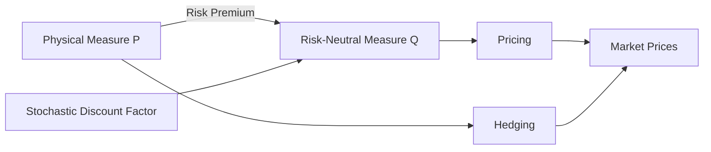

# Measure Change and Financial Interpretation

At the heart of modern quantitative finance lies a simple but powerful idea:

> Prices are expectations — but not under the probabilities we observe.

This chapter explains how **measure change** transforms real-world uncertainty
into a form suitable for pricing, and how this transformation connects
economic intuition with mathematical structure.

---

## Three Objects

All results in this section revolve around three fundamental objects:

* The **physical measure** $\mathbb{P}$:
  describes how asset prices actually evolve, including risk premia.

* The **risk-neutral measure** $\mathbb{Q}$:
  reweights probabilities so that discounted asset prices become martingales,
  enabling arbitrage-free pricing.

* The **stochastic discount factor (SDF)**:
  the economic object that links the two measures, encoding both time value
  and risk preferences.

These are not competing descriptions — they are **different lenses on the same reality**.

---

## Three Problems

The distinction between measures reflects three distinct financial tasks:

| Problem            | Measure      | Interpretation                              |
| ------------------ | ------------ | ------------------------------------------- |
| Pricing            | $\mathbb{Q}$ | Value as discounted expectation             |
| Hedging            | —            | Replication via trading (measure-invariant) |
| Risk / Forecasting | $\mathbb{P}$ | Real-world uncertainty                      |

Confusing these tasks leads to some of the most common conceptual errors in finance.

---

## The Core Transformation

The bridge between $\mathbb{P}$ and $\mathbb{Q}$ is the **risk premium**.

Under the physical measure:

$$
\mu = r + \sigma \theta
$$

where $\theta$ is the market price of risk.

Girsanov’s theorem shows that changing measure removes this premium from the drift,
transforming real-world dynamics into pricing dynamics:

$$
dS_t = r S_t\,dt + \sigma S_t\,dW_t^{\mathbb{Q}}
$$

This is not a change in possible outcomes — only a change in how they are weighted.

---

## A Unifying View

The framework can be summarized as:

* $\mathbb{P}$ explains the world
* **SDF** encodes preferences
* $\mathbb{Q}$ prices claims

or equivalently:

$$
\text{Price} = \mathbb{E}^{\mathbb{P}}[\text{SDF} \times \text{Payoff}]
= \mathbb{E}^{\mathbb{Q}}[\text{Discounted Payoff}]
$$

This equivalence is the conceptual core of modern asset pricing.

---

## What This Chapter Covers

* The distinction between $\mathbb{P}$ and $\mathbb{Q}$
* Risk premium decomposition and its economic meaning
* The relationship between pricing and hedging
* How practitioners use (and adapt) the framework
* When and why the framework breaks down

---

## Guiding Principle

> The physical measure describes reality.
> The risk-neutral measure prices claims in it.
> The stochastic discount factor connects the two.

Understanding this triangle is essential for both theory and practice.
