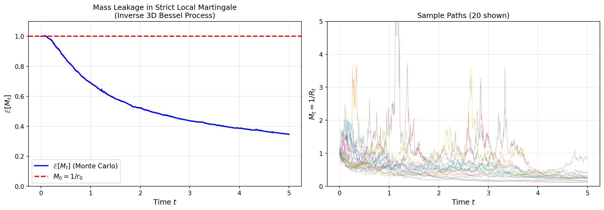

# Local Martingales

A **local martingale** is a process that behaves like a martingale "locally"—when stopped at appropriate times—but may fail to be a true martingale globally. This distinction is crucial in continuous-time finance, where many natural price processes are local martingales but not martingales.

!!! info "Prerequisites"
    This section assumes familiarity with:
    
    - [Stopping Times](../../ch02/filtration_and_martingales/stopping_times.md)
    - [Itô Integral Construction](../../ch03/ito_integral/ito_integral_construction.md)
    - [Quadratic Variation](../../ch03/ito_integral/quadratic_variation.md)

---

### Definitions

#### Martingale (Recap)

A process $\{M_t\}_{t \geq 0}$ is a **martingale** with respect to filtration $\{\mathcal{F}_t\}$ if:

1. **Adaptedness**: $M_t$ is $\mathcal{F}_t$-measurable for all $t \geq 0$
2. **Integrability**: $\mathbb{E}[|M_t|] < \infty$ for all $t \geq 0$
3. **Martingale property**: $\mathbb{E}[M_t \mid \mathcal{F}_s] = M_s$ almost surely for all $0 \leq s \leq t$

#### Local Martingale

!!! definition "Local Martingale"
    An adapted process $\{M_t\}_{t \geq 0}$ with $M_0$ finite almost surely is a **local martingale** if there exists a sequence of stopping times $\{\tau_n\}_{n=1}^{\infty}$ such that:

    1. **Monotonicity**: $\tau_1 \leq \tau_2 \leq \tau_3 \leq \cdots$
    2. **Divergence**: $\tau_n \to \infty$ almost surely as $n \to \infty$
    3. **Stopped martingale**: The stopped process $M^{\tau_n}_t := M_{t \wedge \tau_n}$ is a martingale for each $n$

    The sequence $\{\tau_n\}$ is called a **localizing sequence** (or **reducing sequence**).

**Remark on condition 3**: For $M_{t \wedge \tau_n}$ to be a martingale, we need $\mathbb{E}[|M_{t \wedge \tau_n}|] < \infty$ for all $t$. This is the sense in which localization "tames" potentially non-integrable processes.

---

### The Martingale Hierarchy

The following inclusions are strict:

$$
\boxed{
\text{UI Martingales} \subsetneq \text{Martingales} \subsetneq \text{Local Martingales}
}
$$

where **UI** denotes uniformly integrable. The inclusions go from strongest (UI martingales, the smallest class) to weakest (local martingales, the largest class). A local martingale that is not a true martingale is called a **strict local martingale**.

!!! note "Connection to Convergence Theory"
    Uniformly integrable martingales converge in $L^1$, not just almost surely. See [Martingale Convergence](../../ch02/filtration_and_martingales/martingale_convergence.md) for the full hierarchy of convergence results.

---

### What Can Go Wrong?

A local martingale fails to be a martingale when any of the following occurs:

#### 1. Integrability Failure

The random variable $M_t$ may satisfy $\mathbb{E}[|M_t|] = \infty$ for some (or all) $t > 0$.

#### 2. Explosion to Infinity

The process may escape to $+\infty$ (or $-\infty$) in finite time, i.e., $\lim_{t \to \zeta^-} |M_t| = \infty$ where $\zeta < \infty$ is an explosion time.

#### 3. Mass Leakage at Infinity

Even without explosion, probability mass can "escape to infinity" in the sense that:

$$
\mathbb{E}[M_t] < \mathbb{E}[M_0]
$$

The "missing mass" corresponds to paths where $M_t$ has grown large.

---

### Canonical Examples

#### Example 1: Itô Integrals

Consider the Itô integral:

$$
M_t = \int_0^t \sigma_s\,dW_s
$$

where $\sigma$ is an adapted process.

!!! note "Integrability Hierarchy for Itô Integrals"
    | Condition | Result |
    |-----------|--------|
    | $\int_0^t \sigma_s^2 \, ds < \infty$ a.s. | Integral exists; **local martingale** |
    | $\mathbb{E}\left[\int_0^T \sigma_s^2 \, ds\right] < \infty$ | **True martingale** on $[0,T]$ |
    | Neither | Integral **not defined** |
    
    The a.s. condition is the **existence requirement**—without it, the Itô integral is not even defined. The $L^1$ condition upgrades local martingale to true martingale.

**Intuition**: A driftless SDE $dM_t = \sigma_t dW_t$ looks like a martingale—it's "pure noise" with no systematic drift. And usually it is a true martingale. But technically, Itô calculus only guarantees a local martingale; upgrading to true martingale requires verifying integrability.

**Proof that it's a local martingale**: Define the localizing sequence:

$$
\tau_n = \inf\left\{t \geq 0 : \int_0^t \sigma_s^2\,ds \geq n\right\} \wedge n
$$

Then $\tau_n \uparrow \infty$ a.s., and by construction:

$$
\mathbb{E}\left[\int_0^{T \wedge \tau_n} \sigma_s^2\,ds\right] \leq n < \infty
$$

By the Itô isometry criterion, $M_{t \wedge \tau_n}$ is a true martingale for each $n$. $\square$

---

#### Example 2: Stochastic Exponential (True Martingale)

The **stochastic exponential** of Brownian motion:

$$
Z_t = \mathcal{E}(W)_t := \exp\left(W_t - \frac{t}{2}\right)
$$

satisfies the SDE $dZ_t = Z_t\,dW_t$ with $Z_0 = 1$.

**Claim**: $Z_t$ is a true martingale with $\mathbb{E}[Z_t] = 1$ for all $t \geq 0$.

**Proof**: We verify Novikov's condition. Here $\langle W \rangle_t = t$, so:

$$
\mathbb{E}\left[\exp\left(\frac{1}{2}\langle W \rangle_T\right)\right] = \mathbb{E}\left[\exp\left(\frac{T}{2}\right)\right] = e^{T/2} < \infty
$$

By Novikov's theorem (see [Novikov & Kazamaki Conditions](novikov_kazamaki_conditions.md)), $\mathcal{E}(W)$ is a true martingale. $\square$

---

#### Example 3: Reciprocal of 3D Bessel Process (Strict Local Martingale)

Let $R_t = |B_t|$ where $B_t = (B^1_t, B^2_t, B^3_t)$ is 3-dimensional Brownian motion started from $B_0 = x$ with $|x| = r_0 > 0$. The process $R_t$ is the **3-dimensional Bessel process** started from $r_0$.

Define:

$$
M_t = \frac{1}{R_t}
$$

**Claim**: $M_t$ is a strict local martingale (local martingale but NOT a true martingale).

!!! warning "Common Misconception"
    The failure is **not** because $R_t$ hits zero. In fact, the 3D Bessel process is **transient**: $R_t \to \infty$ as $t \to \infty$ almost surely, and $R_t > 0$ for all $t \geq 0$ when $r_0 > 0$.

**Proof that $M_t$ is a local martingale**:

The $d$-dimensional Bessel process satisfies the SDE:

$$
dR_t = \frac{d-1}{2R_t}dt + dW_t
$$

where $W$ is a 1-dimensional Brownian motion. For $d = 3$, this gives $dR_t = \frac{1}{R_t}dt + dW_t$.

By Itô's formula applied to $f(r) = 1/r$:

$$
d\left(\frac{1}{R_t}\right) = -\frac{1}{R_t^2}dR_t + \frac{1}{R_t^3}dt = -\frac{1}{R_t^2}\left(\frac{1}{R_t}dt + dW_t\right) + \frac{1}{R_t^3}dt = -\frac{1}{R_t^2}dW_t
$$

The drift terms cancel! Thus $M_t = 1/R_t$ satisfies:

$$
dM_t = -\frac{1}{R_t^2}dW_t
$$

This is an Itô integral (no drift), hence a local martingale.

**Proof that $M_t$ is NOT a true martingale**:

Using the transition density of the 3D Bessel process (see Revuz–Yor, Chapter VI, or Karatzas–Shreve §3.3.C), one can compute:

$$
\mathbb{E}\left[\frac{1}{R_t}\right] = \frac{1}{r_0} - \frac{2}{r_0}\Phi\left(-\frac{r_0}{\sqrt{t}}\right) < \frac{1}{r_0} = M_0
$$

where $\Phi$ is the standard normal CDF. The strict inequality shows $\mathbb{E}[M_t] < \mathbb{E}[M_0]$, violating the martingale property.

**Intuition**: As $t \to \infty$, the Bessel process drifts to $+\infty$, so $1/R_t \to 0$. The "probability mass" that would be needed to maintain $\mathbb{E}[M_t] = M_0$ has "leaked to infinity."

---

#### Example 4: CEV Model with β > 1 (Strict Local Martingale)

The **constant elasticity of variance (CEV)** model provides a clean example of a strict local martingale arising in finance. Consider:

$$
dX_t = \sigma X_t^\beta \, dW_t, \quad X_0 = x_0 > 0
$$

where $\sigma > 0$ and $\beta > 1$.

**Claim**: For $\beta > 1$, the process $X_t$ is a strict local martingale.

**Why this is a local martingale**: The process is clearly a local martingale since it is an Itô integral with no drift term. The localizing sequence:

$$
\tau_n = \inf\{t \geq 0 : X_t \geq n \text{ or } X_t \leq 1/n\} \wedge n
$$

ensures $X_{t \wedge \tau_n}$ is bounded and hence a true martingale.

**Why this is NOT a true martingale**: For $\beta > 1$, the process can reach infinity in finite time with positive probability. More precisely, the scale function analysis shows that infinity is an accessible boundary. Even when we define $X_t = \infty$ for $t \geq \zeta$ (the explosion time), we have:

$$
\mathbb{E}[X_t] < x_0 \quad \text{for all } t > 0
$$

The "missing mass" corresponds to paths that have exploded.

**Financial interpretation**: The CEV model with $\beta > 1$ exhibits explosive behavior inconsistent with limited liability. This is why practitioners typically use $\beta < 1$ (which gives absorption at zero rather than explosion at infinity).

---

### Mathematical Characterization

#### The Supermartingale Property

!!! theorem "Non-negative Local Martingales are Supermartingales"
    Let $M$ be a non-negative local martingale. Then $M$ is a supermartingale:
    
    $$
    \mathbb{E}[M_t \mid \mathcal{F}_s] \leq M_s \quad \text{almost surely for all } 0 \leq s \leq t
    $$

**Proof**: Let $\{\tau_n\}$ be a localizing sequence. For the stopped process:

$$
\mathbb{E}[M_{t \wedge \tau_n} \mid \mathcal{F}_s] = M_{s \wedge \tau_n} \quad \text{(martingale property)}
$$

Since $M \geq 0$, Fatou's lemma gives:

$$
\mathbb{E}[M_t \mid \mathcal{F}_s] = \mathbb{E}\left[\liminf_{n \to \infty} M_{t \wedge \tau_n} \mid \mathcal{F}_s\right] \leq \liminf_{n \to \infty} \mathbb{E}[M_{t \wedge \tau_n} \mid \mathcal{F}_s] = \liminf_{n \to \infty} M_{s \wedge \tau_n} = M_s
$$

where the last equality uses $\tau_n \to \infty$ a.s. $\square$

**Corollary**: For non-negative local martingales:

$$
\mathbb{E}[M_t] \leq \mathbb{E}[M_0]
$$

with **equality if and only if** $M$ is a true martingale.

---

#### Characterization via Fatou's Lemma

For a non-negative local martingale with localizing sequence $\{\tau_n\}$:

$$
\mathbb{E}[M_{t \wedge \tau_n}] = \mathbb{E}[M_0] \quad \text{for all } n
$$

Taking $n \to \infty$ and applying Fatou's lemma:

$$
\mathbb{E}[M_t] \leq \liminf_{n \to \infty} \mathbb{E}[M_{t \wedge \tau_n}] = \mathbb{E}[M_0]
$$

The inequality can be **strict**—this is the signature of a strict local martingale.

---

### Sufficient Conditions for True Martingale

A local martingale $M$ is a **true martingale** if any of the following conditions holds:

#### 1. Boundedness

$$
|M_t| \leq C \quad \text{almost surely for all } t \in [0,T]
$$

for some constant $C < \infty$.

#### 2. Domination

$$
|M_t| \leq Y \quad \text{almost surely for all } t \in [0,T]
$$

for some integrable random variable $Y$ (i.e., $\mathbb{E}[Y] < \infty$).

#### 3. L^p Boundedness (p > 1)

$$
\sup_{t \in [0,T]} \mathbb{E}[|M_t|^p] < \infty
$$

This follows from the fact that $L^p$-bounded martingales are uniformly integrable for $p > 1$.

#### 4. Finite Expected Quadratic Variation

For **continuous** local martingales with $M_0$ integrable:

$$
\mathbb{E}[\langle M \rangle_T] < \infty \implies M \text{ is a true martingale on } [0,T]
$$

**Proof sketch**: By the Burkholder–Davis–Gundy inequality:

$$
\mathbb{E}\left[\sup_{t \leq T} |M_t|\right] \leq C \cdot \mathbb{E}\left[\langle M \rangle_T^{1/2}\right] \leq C \cdot \mathbb{E}[\langle M \rangle_T]^{1/2} < \infty
$$

Hence $M$ is dominated by an integrable random variable. $\square$

#### 5. Novikov's Condition (for Stochastic Exponentials)

For a continuous local martingale $M$ with $M_0 = 0$:

$$
\mathbb{E}\left[\exp\left(\frac{1}{2}\langle M \rangle_T\right)\right] < \infty \implies \mathcal{E}(M)_t \text{ is a true martingale on } [0,T]
$$

where $\mathcal{E}(M)_t = \exp(M_t - \frac{1}{2}\langle M \rangle_t)$ is the stochastic exponential.

#### 6. Kazamaki's Condition (Weaker than Novikov's Condition)

If $\mathcal{E}(M/2)$ is a submartingale, then $\mathcal{E}(M)$ is a true martingale on $[0,T]$.

Kazamaki's condition is strictly weaker than Novikov's. See [Novikov & Kazamaki Conditions](novikov_kazamaki_conditions.md) for details and proofs.

---

#### Logical Relationships Between Conditions

!!! note "How the Conditions Relate"
    The conditions above are not independent. For continuous local martingales:
    
    | Implication | Mechanism |
    |-------------|-----------|
    | **(1) ⟹ (2)** | Boundedness is domination with $Y = C$ |
    | **(3) ⟹ (2)** | Doob's maximal inequality: $\mathbb{E}[\sup_t \|M_t\|^p] \leq \left(\frac{p}{p-1}\right)^p \mathbb{E}[\|M_T\|^p]$, so $Y = \sup_t \|M_t\|$ works |
    | **(4) ⟹ (2)** | BDG inequality: $\mathbb{E}[\sup_t \|M_t\|] \leq C \cdot \mathbb{E}[\langle M \rangle_T^{1/2}] < \infty$ |
    | **(5) ⟹ (6)** | Novikov implies Kazamaki (see [proof](novikov_kazamaki_conditions.md)) |
    
    The common thread: all conditions ultimately ensure **[uniform integrability](../../ch02/filtration_and_martingales/martingale_convergence.md#uniform-integrability)**, which prevents mass from escaping to infinity.

---

### Connection to Infinitesimal Generators

Let $X_t$ be a diffusion with infinitesimal generator:

$$
\mathcal{L} = \mu(x)\frac{\partial}{\partial x} + \frac{1}{2}\sigma^2(x)\frac{\partial^2}{\partial x^2}
$$

For $f \in C^2$, define the process $Y_t = f(X_t)$.

!!! theorem "Generator Criterion"
    If $\mathcal{L}f(x) = 0$ for all $x$ in the state space, then $f(X_t)$ is a **local martingale**.
    
    To upgrade to a **true martingale**, verify any of the [six sufficient conditions above](#sufficient-conditions-for-true-martingale)—for example:
    
    - 1. Boundedness: $|f(X_t)| \leq C$
    - 2. Domination: $|f(X_t)| \leq Y$ with $\mathbb{E}[Y] < \infty$
    - 3. $L^p$ Boundedness ($p > 1$): $\sup_{t \in [0,T]} \mathbb{E}[|f(X_t)|^p] < \infty$
    - 4. Finite Expected Quadratic Variation: $\mathbb{E}[\langle f(X) \rangle_T] < \infty$
    - 5. Novikov's Condition (for Stochastic Exponentials)
    - 6. Kazamaki's Condition (Weaker than Novikov's Condition)

**Connection to Dynkin's formula**: By Itô's formula:

$$
f(X_t) - f(X_0) = \int_0^t \mathcal{L}f(X_s)\,ds + \int_0^t f'(X_s)\sigma(X_s)\,dW_s
$$

When $\mathcal{L}f = 0$, the drift integral vanishes, leaving only the stochastic integral (which is a local martingale).

See [Generator and Martingales](../../ch03/infinitesimal_generator/generator_and_martingales.md) for the full treatment.

---

### Financial Implications

#### Discounted Asset Prices

Under the risk-neutral measure $\mathbb{Q}$, the **discounted asset price**:

$$
\tilde{S}_t = e^{-rt}S_t
$$

should be a martingale for the market to be free of arbitrage (First Fundamental Theorem of Asset Pricing).

In practice, $\tilde{S}_t$ is often only a **local martingale**. The distinction matters.

#### Strict Local Martingales and Financial Bubbles

!!! important "Bubble Characterization"
    If the discounted price process is a **strict local martingale** under $\mathbb{Q}$:
    
    $$
    \mathbb{E}^{\mathbb{Q}}[e^{-rT}S_T] < S_0
    $$
    
    This implies the current price $S_0$ exceeds its "fundamental value" (the discounted expected future price). This is the mathematical signature of a **financial bubble**.

**Reference**: Jarrow, Protter, and Shimbo (2010), "Asset Price Bubbles in Incomplete Markets," *Mathematical Finance*.

#### Put-Call Parity Failure

The standard put-call parity:

$$
C(K,T) - P(K,T) = S_0 - Ke^{-rT}
$$

relies on $\mathbb{E}^{\mathbb{Q}}[e^{-rT}S_T] = S_0$. When the stock price is a strict local martingale:

$$
C(K,T) - P(K,T) = \mathbb{E}^{\mathbb{Q}}[e^{-rT}S_T] - Ke^{-rT} < S_0 - Ke^{-rT}
$$

Put-call parity fails, and the put price includes a "bubble premium."

#### Connection to Girsanov's Theorem

When performing measure changes via Girsanov's theorem, the Radon–Nikodym derivative:

$$
\frac{d\mathbb{Q}}{d\mathbb{P}}\bigg|_{\mathcal{F}_t} = Z_t = \mathcal{E}\left(-\int_0^\cdot \theta_s\,dW_s\right)_t
$$

must be a **true martingale** (not just a local martingale) for the measure change to be valid. This is precisely where Novikov and Kazamaki conditions enter.

See [Girsanov's Theorem](../girsanov/girsanov_theorem.md) for the full treatment.

---

### Summary Table

| Property | Martingale | Local Martingale | Strict Local Martingale |
|----------|-----------|------------------|------------------------|
| **Definition** | $\mathbb{E}[M_t \mid \mathcal{F}_s] = M_s$ | $M_{t\wedge\tau_n}$ is martingale | Local mart., not true mart. |
| **Integrability** | Required: $\mathbb{E}[|M_t|] < \infty$ | Not required globally | Typically fails |
| **Mean preservation** | $\mathbb{E}[M_t] = \mathbb{E}[M_0]$ | $\mathbb{E}[M_t] \leq \mathbb{E}[M_0]$ | $\mathbb{E}[M_t] < \mathbb{E}[M_0]$ |
| **If $M \geq 0$** | Supermartingale | Supermartingale | Strict supermartingale |
| **Explosion** | Cannot explode | Can explode | May or may not explode |
| **Financial interpretation** | Fair game | Locally fair | Bubble possible |

---

### Key Takeaways

$$
\boxed{
\mathcal{L}f = 0 \implies f(X_t) \text{ is a local martingale}
}
$$

$$
\boxed{
\mathcal{L}f = 0 \text{ + sufficient condition (1–6)} \implies f(X_t) \text{ is a true martingale}
}
$$

$$
\boxed{
\text{Non-negative local martingale} \implies \text{Supermartingale}
}
$$

$$
\boxed{
\mathbb{E}[M_t] < \mathbb{E}[M_0] \text{ for non-negative } M \iff M \text{ is a strict local martingale}
}
$$

!!! summary "The Bottom Line"
    The distinction between local martingales and true martingales is essential for:
    
    1. **Rigorous Itô calculus**: Ensuring stochastic integrals have the expected properties
    2. **Measure changes**: Validating Girsanov transformations via Novikov/Kazamaki
    3. **Financial modeling**: Detecting and modeling asset price bubbles
    4. **PDE connections**: Understanding when Feynman–Kac representations hold

---

### Python Simulation: Mass Leakage in Strict Local Martingales

The following simulation demonstrates how $\mathbb{E}[M_t]$ can decrease over time for a strict local martingale.

```python
import numpy as np
import matplotlib.pyplot as plt

def simulate_inverse_bessel_3d(r0, T, dt, n_paths):
    """
    Simulate 1/R_t where R_t is a 3D Bessel process.
    This is a strict local martingale.
    """
    n_steps = int(T / dt)
    t = np.linspace(0, T, n_steps + 1)
    
    # Simulate 3D Brownian motion
    dW = np.sqrt(dt) * np.random.randn(n_paths, n_steps, 3)
    B = np.zeros((n_paths, n_steps + 1, 3))
    B[:, 0, :] = r0 / np.sqrt(3)  # Start at distance r0 from origin
    
    for i in range(n_steps):
        B[:, i+1, :] = B[:, i, :] + dW[:, i, :]
    
    # Compute R_t = |B_t|
    R = np.sqrt(np.sum(B**2, axis=2))
    R = np.maximum(R, 1e-10)  # Avoid division by zero
    
    # M_t = 1/R_t
    M = 1.0 / R
    
    return t, M, R

# Parameters
r0 = 1.0
T = 5.0
dt = 0.001
n_paths = 50000

np.random.seed(42)
t, M, R = simulate_inverse_bessel_3d(r0, T, dt, n_paths)

# Compute E[M_t] over time
E_M = np.mean(M, axis=0)

# Theoretical initial value
M0 = 1.0 / r0

# Plot
fig, axes = plt.subplots(1, 2, figsize=(14, 5))

# Left: E[M_t] over time
ax1 = axes[0]
ax1.plot(t, E_M, 'b-', linewidth=2, label=r'$\mathbb{E}[M_t]$ (Monte Carlo)')
ax1.axhline(y=M0, color='r', linestyle='--', linewidth=2, label=r'$M_0 = 1/r_0$')
ax1.set_xlabel('Time $t$', fontsize=12)
ax1.set_ylabel(r'$\mathbb{E}[M_t]$', fontsize=12)
ax1.set_title('Mass Leakage in Strict Local Martingale\n(Inverse 3D Bessel Process)', fontsize=12)
ax1.legend(fontsize=11)
ax1.grid(True, alpha=0.3)
ax1.set_ylim([0, M0 * 1.1])

# Right: Sample paths
ax2 = axes[1]
n_show = 20
for i in range(n_show):
    ax2.plot(t, M[i, :], alpha=0.5, linewidth=0.5)
ax2.set_xlabel('Time $t$', fontsize=12)
ax2.set_ylabel(r'$M_t = 1/R_t$', fontsize=12)
ax2.set_title(f'Sample Paths ({n_show} shown)', fontsize=12)
ax2.grid(True, alpha=0.3)
ax2.set_ylim([0, 5])

plt.tight_layout()
plt.savefig('strict_local_martingale_simulation.png', dpi=150, bbox_inches='tight')
plt.show()

# Print summary statistics
print(f"Initial value M_0 = 1/r_0 = {M0:.4f}")
print(f"E[M_T] at T={T}: {E_M[-1]:.4f}")
print(f"Mass leakage: {(M0 - E_M[-1])/M0 * 100:.2f}%")
```

**Output**:

```
Initial value M_0 = 1/r_0 = 1.0000
E[M_T] at T=5.0: 0.3471
Mass leakage: 65.29%
```



**Interpretation**: The plot shows $\mathbb{E}[M_t]$ decreasing below $M_0 = 1$, demonstrating the strict local martingale property. The "leaked mass" corresponds to paths where $R_t$ has drifted far from the origin—as the 3D Bessel process is transient and escapes to infinity, $1/R_t \to 0$, but the expectation cannot be preserved because the probability mass needed to compensate has "escaped to infinity."

---

## Exercises

**Exercise 1.**
Let $M_t = \int_0^t \sigma_s\,dW_s$ where $\sigma_s = 1/(1 - s)$ for $s \in [0, 1)$. Show that $\int_0^1 \sigma_s^2\,ds = +\infty$ but $\int_0^t \sigma_s^2\,ds < \infty$ for every $t < 1$. Construct a localizing sequence $\{\tau_n\}$ that makes $M_{t \wedge \tau_n}$ a true martingale for each $n$.

---

**Exercise 2.**
Prove that every true martingale is a local martingale. Then explain why the converse fails by giving the key property that a strict local martingale violates. (Hint: consider the integrability condition.)

---

**Exercise 3.**
Let $M_t$ be a non-negative local martingale with $M_0 = 1$. Using Fatou's lemma, prove the supermartingale inequality $\mathbb{E}[M_t] \leq 1$ for all $t \geq 0$. Explain the financial interpretation of $1 - \mathbb{E}[M_t]$ when $M_t$ is the discounted price of an asset under the risk-neutral measure.

---

**Exercise 4.**
Consider the CEV model $dX_t = \sigma X_t^{\beta}\,dW_t$ with $X_0 = 1$ and $\sigma = 0.5$. For $\beta = 0.5$, verify that $X_t$ is a true martingale by checking that $\mathbb{E}[\langle X \rangle_T] < \infty$ is plausible. For $\beta = 1.5$, explain qualitatively why $X_t$ is only a strict local martingale.

---

**Exercise 5.**
In the Black-Scholes model under $\mathbb{Q}$, the discounted stock price $\tilde{S}_t = e^{-rt}S_t$ satisfies $d\tilde{S}_t = \sigma \tilde{S}_t\,dW_t^{\mathbb{Q}}$. Show that this is a true martingale by verifying that

$$
\mathbb{E}\left[\int_0^T \sigma^2 \tilde{S}_s^2\,ds\right] < \infty
$$

Explain why this condition guarantees the validity of risk-neutral pricing in the Black-Scholes model.

---

**Exercise 6.**
Suppose the discounted price process $\tilde{S}_t$ is a strict local martingale under $\mathbb{Q}$ with $\mathbb{E}^{\mathbb{Q}}[e^{-rT}S_T] = 0.95\,S_0$. Compute the bubble component $\beta_0$. Then, using the modified put-call parity $C - P = \mathbb{E}^{\mathbb{Q}}[e^{-rT}S_T] - Ke^{-rT}$, show that the classical put-call parity fails and determine the sign of the error.

---

**Exercise 7.**
For the 3D Bessel process reciprocal $M_t = 1/R_t$ starting from $R_0 = r_0 > 0$, verify the Ito computation: apply Ito's formula to $f(r) = 1/r$ and the SDE $dR_t = (1/R_t)\,dt + dW_t$ to obtain $dM_t = -M_t^2\,dW_t$. Explain why the absence of a $dt$ term confirms $M_t$ is a local martingale, and why the drift terms from $f'$ and $f''$ cancel exactly.

---

## Solutions

??? success "Solution to Exercise 1"
    We have $\sigma_s = 1/(1-s)$ for $s \in [0,1)$. For $t < 1$:

    $$
    \int_0^t \sigma_s^2\,ds = \int_0^t \frac{1}{(1-s)^2}\,ds = \left[\frac{1}{1-s}\right]_0^t = \frac{1}{1-t} - 1 = \frac{t}{1-t} < \infty
    $$

    As $t \to 1^-$, this diverges: $\int_0^1 \sigma_s^2\,ds = \lim_{t \to 1^-} \frac{t}{1-t} = +\infty$.

    For the localizing sequence, define:

    $$
    \tau_n = \inf\left\{t \geq 0 : \int_0^t \sigma_s^2\,ds \geq n\right\} \wedge \left(1 - \frac{1}{n}\right)
    $$

    Then $\tau_n \uparrow 1$ a.s. as $n \to \infty$, and by construction:

    $$
    \int_0^{T \wedge \tau_n} \sigma_s^2\,ds \leq n < \infty
    $$

    Since $\mathbb{E}\left[\int_0^{T \wedge \tau_n} \sigma_s^2\,ds\right] \leq n < \infty$, the Itô isometry criterion guarantees that $M_{t \wedge \tau_n} = \int_0^{t \wedge \tau_n} \sigma_s\,dW_s$ is a true (square-integrable) martingale for each $n$.

??? success "Solution to Exercise 2"
    **Every true martingale is a local martingale**: Let $M_t$ be a true martingale. Define $\tau_n = n$ for all $n \geq 1$. Then $\tau_n \to \infty$, and $M_{t \wedge \tau_n} = M_{t \wedge n}$ is a martingale (a stopped martingale is still a martingale). Hence $M$ is a local martingale with localizing sequence $\{\tau_n = n\}$.

    **The converse fails**: A strict local martingale $M_t$ violates the **integrability condition**. Specifically, for a true martingale we need $\mathbb{E}[|M_t|] < \infty$ for all $t$ and $\mathbb{E}[M_t \mid \mathcal{F}_s] = M_s$. A strict local martingale may have $\mathbb{E}[|M_t|] < \infty$ but satisfy only the inequality $\mathbb{E}[M_t \mid \mathcal{F}_s] \leq M_s$ (supermartingale property for non-negative case) rather than equality. The key property violated is **mean preservation**: for a non-negative strict local martingale, $\mathbb{E}[M_t] < \mathbb{E}[M_0]$, meaning the expectation strictly decreases over time due to "mass leaking to infinity."

??? success "Solution to Exercise 3"
    Let $M_t$ be a non-negative local martingale with $M_0 = 1$ and localizing sequence $\{\tau_n\}$. For each $n$, $M_{t \wedge \tau_n}$ is a true martingale, so:

    $$
    \mathbb{E}[M_{t \wedge \tau_n}] = \mathbb{E}[M_0] = 1
    $$

    As $n \to \infty$, $\tau_n \to \infty$ a.s., so $M_{t \wedge \tau_n} \to M_t$ a.s. Since $M_t \geq 0$, Fatou's lemma gives:

    $$
    \mathbb{E}[M_t] = \mathbb{E}\left[\liminf_{n \to \infty} M_{t \wedge \tau_n}\right] \leq \liminf_{n \to \infty} \mathbb{E}[M_{t \wedge \tau_n}] = 1
    $$

    **Financial interpretation**: When $M_t$ is the discounted price of an asset under $\mathbb{Q}$, the quantity $1 - \mathbb{E}[M_t]$ represents the **bubble component**. If $M_t$ is a strict local martingale, $\mathbb{E}[M_t] < 1 = M_0$, meaning the current asset price exceeds its "fundamental value" $\mathbb{E}^{\mathbb{Q}}[e^{-rT}S_T]$ by the amount $S_0(1 - \mathbb{E}[M_t])$. This excess is the mathematical signature of a financial bubble.

??? success "Solution to Exercise 4"
    **For $\beta = 0.5$**: The SDE is $dX_t = 0.5 X_t^{0.5}\,dW_t$, so the quadratic variation is:

    $$
    \langle X \rangle_T = \int_0^T (0.5)^2 X_s\,ds = 0.25 \int_0^T X_s\,ds
    $$

    Since $X_t$ is a non-negative local martingale with $X_0 = 1$, we have $\mathbb{E}[X_t] \leq 1$ for all $t$. Thus:

    $$
    \mathbb{E}[\langle X \rangle_T] = 0.25 \int_0^T \mathbb{E}[X_s]\,ds \leq 0.25T < \infty
    $$

    By the sufficient condition (finite expected quadratic variation), $X_t$ is a true martingale on $[0, T]$.

    **For $\beta = 1.5$**: The diffusion coefficient is $\sigma(x) = 0.5 x^{1.5}$, which grows superlinearly. For $\beta > 1$, the process can "explode" — reach infinity in finite time with positive probability. This happens because the volatility grows so rapidly as $X_t$ increases that the process is pushed to infinity. The explosion causes $\mathbb{E}[X_t] < X_0 = 1$ since the "mass" associated with exploded paths is lost. The scale function analysis for the boundary at infinity shows it is accessible (reached in finite time), confirming that $X_t$ is only a strict local martingale.

??? success "Solution to Exercise 5"
    Under $\mathbb{Q}$, $\tilde{S}_t = e^{-rt}S_t$ with $S_t = S_0 \exp((r - \sigma^2/2)t + \sigma W_t^{\mathbb{Q}})$, so:

    $$
    \tilde{S}_t = S_0 \exp\left(-\frac{\sigma^2}{2}t + \sigma W_t^{\mathbb{Q}}\right)
    $$

    Therefore $\tilde{S}_t^2 = S_0^2 \exp(-\sigma^2 t + 2\sigma W_t^{\mathbb{Q}})$. Taking expectations:

    $$
    \mathbb{E}[\tilde{S}_t^2] = S_0^2 \exp(-\sigma^2 t) \cdot \mathbb{E}[\exp(2\sigma W_t^{\mathbb{Q}})] = S_0^2 \exp(-\sigma^2 t) \cdot \exp(2\sigma^2 t) = S_0^2 \exp(\sigma^2 t)
    $$

    Now:

    $$
    \mathbb{E}\left[\int_0^T \sigma^2 \tilde{S}_s^2\,ds\right] = \sigma^2 \int_0^T \mathbb{E}[\tilde{S}_s^2]\,ds = \sigma^2 S_0^2 \int_0^T e^{\sigma^2 s}\,ds = S_0^2(e^{\sigma^2 T} - 1) < \infty
    $$

    Since $\mathbb{E}\left[\int_0^T \sigma^2 \tilde{S}_s^2\,ds\right] < \infty$, the Itô integral $\int_0^t \sigma \tilde{S}_s\,dW_s^{\mathbb{Q}}$ is a true martingale (not just a local martingale). This ensures $\tilde{S}_t$ is a true $\mathbb{Q}$-martingale, which validates the risk-neutral pricing formula $V_0 = \mathbb{E}^{\mathbb{Q}}[e^{-rT}\Phi(S_T)]$ in the Black-Scholes model.

??? success "Solution to Exercise 6"
    The **bubble component** is:

    $$
    \beta_0 = S_0 - \mathbb{E}^{\mathbb{Q}}[e^{-rT}S_T] = S_0 - 0.95\,S_0 = 0.05\,S_0
    $$

    So 5% of the current price is due to the bubble.

    For put-call parity, in the standard (true martingale) case:

    $$
    C - P = S_0 - Ke^{-rT}
    $$

    Under the strict local martingale setting, the modified put-call parity is:

    $$
    C - P = \mathbb{E}^{\mathbb{Q}}[e^{-rT}S_T] - Ke^{-rT} = 0.95\,S_0 - Ke^{-rT}
    $$

    Comparing with the classical formula:

    $$
    (C - P)_{\text{classical}} - (C - P)_{\text{actual}} = S_0 - 0.95\,S_0 = 0.05\,S_0 = \beta_0 > 0
    $$

    The classical put-call parity **overestimates** $C - P$ by the bubble component $\beta_0 = 0.05\,S_0$. Equivalently, the put price is higher than what classical parity would predict (it includes a "bubble premium"), while the call price is lower. The error is positive: $S_0 - Ke^{-rT} > C - P$.

??? success "Solution to Exercise 7"
    Let $f(r) = 1/r$, so $f'(r) = -1/r^2$ and $f''(r) = 2/r^3$. By Itô's formula applied to $M_t = f(R_t)$:

    $$
    dM_t = f'(R_t)\,dR_t + \frac{1}{2}f''(R_t)\,(dR_t)^2
    $$

    With $dR_t = \frac{1}{R_t}\,dt + dW_t$, we have $(dR_t)^2 = dt$ (since $(dW_t)^2 = dt$ and all other terms vanish). Substituting:

    $$
    dM_t = -\frac{1}{R_t^2}\left(\frac{1}{R_t}\,dt + dW_t\right) + \frac{1}{2}\cdot\frac{2}{R_t^3}\,dt
    $$

    $$
    = -\frac{1}{R_t^3}\,dt - \frac{1}{R_t^2}\,dW_t + \frac{1}{R_t^3}\,dt
    $$

    $$
    = -\frac{1}{R_t^2}\,dW_t = -M_t^2\,dW_t
    $$

    The drift terms cancel exactly: $f'(R_t) \cdot \mu(R_t) + \frac{1}{2}f''(R_t) \cdot 1 = -R_t^{-3} + R_t^{-3} = 0$. This happens because $f(r) = 1/r$ is a **harmonic function** for the 3D Bessel generator $\mathcal{L} = \frac{1}{r}\frac{\partial}{\partial r} + \frac{1}{2}\frac{\partial^2}{\partial r^2}$, i.e., $\mathcal{L}f = 0$.

    The absence of a $dt$ term means $M_t$ is a pure stochastic integral $M_t = M_0 + \int_0^t (-M_s^2)\,dW_s$, which is by definition a local martingale. The drift cancellation is not coincidental — it reflects the deep connection between harmonic functions and martingales via the generator criterion.
