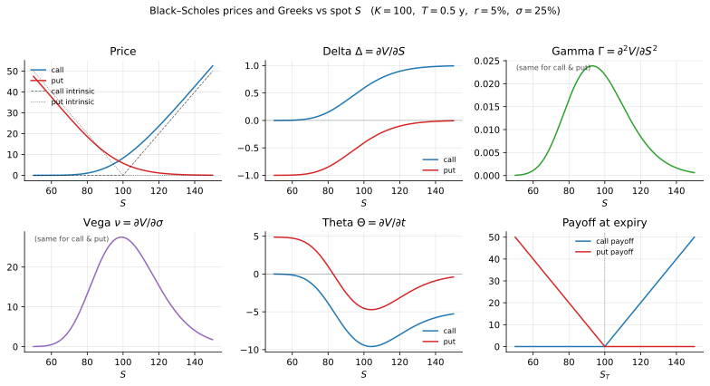
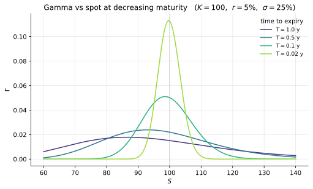
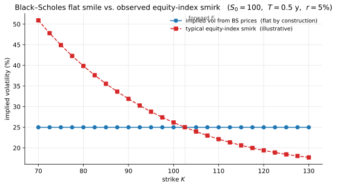

# Computational Examples

Having developed the Black-Scholes formula and its mathematical structure, we now turn to its practical implementation. The mechanism is straightforward — evaluate $d_1, d_2$, then two CDF values — but the structure of the formula makes the numerical work surprisingly rich: closed-form Greeks fall out by differentiating term by term, vectorised array operations replace contract-by-contract loops, and edge cases ($T \to 0$, extreme $d_i$) require care that the abstract formula hides. This section bridges the formula with practice through hand calculation, a Python implementation, Greeks, sensitivity panels, and worked examples.

!!! info "Where this fits"
    - **Roadmap row(s):** Operationalisation across all six perspectives.
    - **Builds on:** [The Black-Scholes formula](bs_formula_statement.md), [Properties and bounds](properties_and_bounds.md) (Greek formulas), and [Asymptotic behavior](asymptotic_behavior.md) (numerical edge cases).
    - **Feeds into:** the volatility-modelling chapters that follow (local and stochastic volatility, jump diffusion). Figure 3 below previews the empirical motivation.

---

### Manual Calculation: European Call

*Section goal: a by-hand evaluation of the call formula at $S=50$, $K=52$, $T=0.5$.*

#### 1. **Problem Setup**


Price a European call option with:

- Current stock price: $S_0 = 50$
- Strike price: $K = 52$
- Time to maturity: $T = 0.5$ years (6 months)
- Risk-free rate: $r = 5\%$ per annum
- Volatility: $\sigma = 30\%$ per annum

#### 2. **Compute d_1 and d_2**


$$
d_1 = \frac{\ln(50/52) + (0.05 + 0.045) \times 0.5}{0.30\sqrt{0.5}} = \frac{-0.0392 + 0.0475}{0.2121} = \frac{0.0083}{0.2121} = 0.0391
$$

$$
d_2 = 0.0391 - 0.2121 = -0.1730
$$

#### 3. **Evaluate and Compute**


From standard normal tables: $\mathcal{N}(0.0391) = 0.5156$, $\mathcal{N}(-0.1730) = 0.4313$.

$$
C_0 = 50 \times 0.5156 - 52 \times e^{-0.025} \times 0.4313 = 25.78 - 21.87 = 3.91
$$

The European call is worth approximately **\$3.91**.

---

### European Put and Parity Check

*Section goal: pricing the put with the same parameters and verifying $C - P = S - Ke^{-rT}$.*

Using the same parameters and $\mathcal{N}(-x) = 1 - \mathcal{N}(x)$:

$$
P_0 = Ke^{-rT}\mathcal{N}(-d_2) - S_0\mathcal{N}(-d_1) = 52 \times 0.9753 \times 0.5687 - 50 \times 0.4844 = 28.84 - 24.22 = 4.62
$$

**Parity check**: $C - P = 3.91 - 4.62 = -0.71 \approx S_0 - Ke^{-rT} = 50 - 50.72 = -0.72$ ✓

---

### Python Implementation

*Section goal: a vectorisable `black_scholes` function for both calls and puts.*

#### 1. **Basic Implementation**


```python
import numpy as np
from scipy.stats import norm

def black_scholes(S, K, T, r, sigma, option_type='call'):
    """Black-Scholes price for a European call or put."""
    d1 = (np.log(S / K) + (r + 0.5 * sigma**2) * T) / (sigma * np.sqrt(T))
    d2 = d1 - sigma * np.sqrt(T)
    if option_type == 'call':
        return S * norm.cdf(d1) - K * np.exp(-r * T) * norm.cdf(d2)
    else:
        return K * np.exp(-r * T) * norm.cdf(-d2) - S * norm.cdf(-d1)

# Example: S0=50, K=52, T=0.5, r=5%, sigma=30%
C = black_scholes(50, 52, 0.5, 0.05, 0.30, 'call')  # 3.91
P = black_scholes(50, 52, 0.5, 0.05, 0.30, 'put')   # 4.62

# Verify put-call parity: C - P = S - Ke^(-rT)
print(f"C - P = {C - P:.4f},  S - Ke^(-rT) = {50 - 52*np.exp(-0.025):.4f}")
```

**Output**:
```
C - P = -0.7065,  S - Ke^(-rT) = -0.7065
```

---

### Greeks Calculation

*Section goal: closed-form delta, gamma, vega, theta, rho — and visual confirmation across spot (Figures 1–2).*

#### 1. **Complete Implementation with Greeks**


```python
def black_scholes_greeks(S, K, T, r, sigma, option_type='call'):
    """Black-Scholes price and Greeks; returns dict with price, delta, gamma, theta, vega, rho."""
    d1 = (np.log(S / K) + (r + 0.5 * sigma**2) * T) / (sigma * np.sqrt(T))
    d2 = d1 - sigma * np.sqrt(T)
    pdf_d1 = norm.pdf(d1)
    cdf_d1 = norm.cdf(d1)
    cdf_d2 = norm.cdf(d2)

    if option_type == 'call':
        price = S * cdf_d1 - K * np.exp(-r * T) * cdf_d2
        delta = cdf_d1
        theta = (-S * pdf_d1 * sigma / (2 * np.sqrt(T))
                 - r * K * np.exp(-r * T) * cdf_d2)
        rho = K * T * np.exp(-r * T) * cdf_d2 / 100
    else:  # put
        price = K * np.exp(-r * T) * norm.cdf(-d2) - S * norm.cdf(-d1)
        delta = cdf_d1 - 1
        theta = (-S * pdf_d1 * sigma / (2 * np.sqrt(T))
                 + r * K * np.exp(-r * T) * norm.cdf(-d2))
        rho = -K * T * np.exp(-r * T) * norm.cdf(-d2) / 100

    # Gamma and vega (same for call and put; vega quoted per 1% change in sigma)
    gamma = pdf_d1 / (S * sigma * np.sqrt(T))
    vega = S * np.sqrt(T) * pdf_d1 / 100

    return {'price': price, 'delta': delta, 'gamma': gamma,
            'theta': theta, 'vega': vega, 'rho': rho}

```

For the same parameters ($S=50$, $K=52$, $T=0.5$, $r=5\%$, $\sigma=30\%$):

| Greek | Call | Put |
|---|---|---|
| Price | 3.9089 | 4.6153 |
| Delta | 0.5156 | -0.4844 |
| Gamma | 0.0377 | 0.0377 |
| Theta | -4.8652 | -3.5691 |
| Vega | 0.1335 | 0.1335 |

Note that gamma and vega are identical for call and put (a consequence of put-call parity), while $\Delta_{\text{call}} - \Delta_{\text{put}} = 1$.

<figure markdown="span">
  
  <figcaption markdown="span">**Figure 1:** Black-Scholes prices and Greeks as functions of the underlying spot $S$, for $K = 100$, $T = 0.5$ y, $r = 5\%$, $\sigma = 25\%$. Top row: price (with intrinsic-value envelopes), delta (call positive, put negative, differing by $1$), gamma (identical for call and put, peaked near the money). Bottom row: vega (also identical, concentrated near $S = K$), theta (negative for both), and the payoffs at expiry. Note how delta saturates at $0$ and $\pm 1$ for deep OTM/ITM, gamma and vega are positive everywhere and bell-shaped about $S = K$, and theta is most negative for ATM options.</figcaption>
</figure>

<figure markdown="span">
  
  <figcaption markdown="span">**Figure 2:** Gamma sharpening as expiry approaches, for $K = 100$, $r = 5\%$, $\sigma = 25\%$. As $T \to 0$, $\Gamma$ concentrates around $K$ and grows unbounded at the strike while flattening to zero away from it. This is the "gamma spike" of short-dated near-ATM options: small spot moves cause large changes in delta, so the position becomes increasingly hard to hedge with infrequent rebalancing — and motivates the call-spread approximation discussed in [Digital Option Pricing](digital_option_pricing.md).</figcaption>
</figure>

---

### Sensitivity Analysis

*Section goal: how the price responds to changes in $\sigma$, $S$, and $T$.*

Both call and put prices are monotonically increasing in volatility (positive vega) and respond nonlinearly to the stock price. The call value curve lies above the intrinsic value $(S - K)^+$ for all $S$, with the gap (time value) maximized near the strike. These relationships can be verified numerically using the `black_scholes` function above across ranges of $\sigma$ and $S$.

---

### Practical Examples

*Section goal: three numerical illustrations: maturity scaling, moneyness vs. delta, and implied volatility (Figure 3).*

#### 1. **ATM Call with Different Maturities**


For $S = K = 100$, $r = 5\%$, $\sigma = 25\%$:

| Maturity | Call Price | $\sqrt{T}$ ratio |
|---|---|---|
| 1 month | \$2.05 | — |
| 3 months | \$3.56 | $\times 1.74$ |
| 6 months | \$5.04 | $\times 2.46$ |
| 12 months | \$7.13 | $\times 3.48$ |

**What we learn**: Option value grows sublinearly with time—roughly as $\sqrt{T}$, consistent with the ATM approximation $C_{\text{ATM}} \approx 0.4\, S\sigma\sqrt{T}$. This $\sqrt{T}$ scaling is a direct consequence of the diffusive nature of Brownian motion.

#### 2. **Moneyness and Delta**


For $S = 100$, $r = 5\%$, $\sigma = 25\%$, $T = 0.5$:

| Strike | Moneyness | Call | Put | Call $\Delta$ | Put $\Delta$ |
|---|---|---|---|---|---|
| 80 | ITM | \$20.65 | \$0.52 | 0.936 | -0.064 |
| 90 | ITM | \$11.49 | \$1.36 | 0.793 | -0.207 |
| 100 | ATM | \$5.04 | \$4.91 | 0.566 | -0.434 |
| 110 | OTM | \$1.67 | \$11.42 | 0.317 | -0.683 |
| 120 | OTM | \$0.39 | \$20.14 | 0.134 | -0.866 |

**What we learn**: Delta varies from near $0$ (deep OTM) to near $1$ (deep ITM), confirming the probabilistic interpretation $\Delta = \mathcal{N}(d_1)$. ITM options carry substantial intrinsic value; OTM options derive their entire value from optionality.

#### 3. **Example 3: Implied Volatility Calculation**


Given a market option price, back out the implied volatility:

```python
from scipy.optimize import brentq

def black_scholes_call(S, K, T, r, sigma):
    """Convenience wrapper: Black-Scholes price for a European call."""
    return black_scholes(S, K, T, r, sigma, option_type='call')

def implied_volatility_call(market_price, S, K, T, r):
    """
    Calculate implied volatility for a call option.
    Uses Brent's method to find sigma such that BS price = market price.
    Brent works here because the BS call price is strictly increasing in
    sigma (positive vega), which guarantees a unique root in any bracket
    [sigma_lo, sigma_hi] containing it. Brent combines bisection (for
    robustness) with inverse quadratic interpolation (for superlinear
    convergence near the root); typical convergence is ~5–10 iterations.
    Conditioning degrades when vega is small — i.e., for deep ITM/OTM or
    near-expiry options — so very-low-time-value quotes can yield wide
    confidence on sigma despite the algorithm reporting tight tolerance.
    """
    def objective(sigma):
        return black_scholes_call(S, K, T, r, sigma) - market_price
    
    try:
        # Search for volatility between 1% and 200%
        implied_vol = brentq(objective, 0.01, 2.0)
        return implied_vol
    except ValueError:
        return np.nan

# Example: market call price is $6.00
market_call_price = 6.00
S, K, T, r = 100, 100, 0.5, 0.05

implied_vol = implied_volatility_call(market_call_price, S, K, T, r)
print(f"Market Call Price: ${market_call_price}")
print(f"Implied Volatility: {implied_vol * 100:.2f}%")

# Verify
bs_price = black_scholes_call(S, K, T, r, implied_vol)
print(f"BS Price at Implied Vol: ${bs_price:.2f}")
```

**Output**:
```
Market Call Price: $6.00
Implied Volatility: 30.55%
BS Price at Implied Vol: $6.00
```

<figure markdown="span">
  
  <figcaption markdown="span">**Figure 3:** Why a single $\sigma$ cannot fit a market across strikes. Blue dots: implied volatilities recovered by inverting Black-Scholes prices that were generated with constant $\sigma = 25\%$ — flat by construction, a self-consistency check on the inversion. Red squares: an illustrative equity-index "smirk," with implied vol declining as strikes move above the forward and rising for low strikes. The Black-Scholes model has only one $\sigma$, so its implied surface is necessarily flat at every maturity; the empirically observed smile/smirk is thus direct evidence that the lognormal-with-constant-volatility assumption fails — motivating the local-volatility, stochastic-volatility, and jump-diffusion models developed in later chapters.</figcaption>
</figure>

---

### Common Numerical Issues

*Section goal: edge cases (extreme $d$, $T \to 0$, low $\sigma$) and how to handle them.*

#### 1. **Issue 1: Extreme Values of d_1 or d_2**


When $d_1$ or $d_2$ are very large (positive or negative), numerical precision issues arise in evaluating $\mathcal{N}(d)$.

**Solution**: Use asymptotic approximations:

- If $d_1 > 8$: $\mathcal{N}(d_1) \approx 1$
- If $d_1 < -8$: $\mathcal{N}(d_1) \approx 0$

#### 2. **Issue 2: Near Expiration** (T → 0)


As $T \to 0$, $d_1$ and $d_2$ can become undefined (division by zero).

**Solution**: For $T < 0.001$, use intrinsic value directly:

$$
C \approx \max(S - K, 0)
$$

#### 3. **Issue 3: Very Low Volatility** (σ → 0)


When $\sigma$ is very small, option behaves like forward contract.

**Solution**: Use forward value formula:

$$
C \approx \max(S - Ke^{-rT}, 0)
$$

#### 4. **Issue 4: Vectorized Pricing and Greeks**


For large-scale pricing (e.g., computing prices and Greeks across a grid of strikes and maturities), evaluate $d_1$, $d_2$, $\mathcal{N}(\cdot)$, and $\phi(\cdot)$ as array operations rather than looping over individual contracts. The functions defined above are *already* vectorized: passing NumPy arrays for `S`, `K`, `T`, or `sigma` makes `np.log`, `np.sqrt`, `np.exp`, `norm.cdf`, and `norm.pdf` broadcast automatically, so a single call computes the entire grid. The Greeks dictionary returned by `black_scholes_greeks` then contains arrays of the same shape — typically a $10^4\!-\!10^6\times$ speedup over Python-level loops, and the bottleneck for production risk systems with millions of contracts. (The same broadcasting principle applies to implied-volatility surfaces: vectorize the objective inside Brent only if you also vectorize the bracketing logic, since `brentq` itself is scalar.)

---

### Complete Working Example

*Section goal: an end-to-end pricing of a representative OTM call with full Greeks.*

Consider a call option with $S = \$175$, $K = \$180$, $T = 45/365$ years, $r = 4.5\%$, $\sigma = 28\%$.

Using the Greeks function above, the results are:

| Quantity | Value |
|---|---|
| Call price | \$3.67 |
| Intrinsic value | \$0.00 |
| Time value | \$3.67 |
| Delta | 0.4089 |
| Gamma | 0.0441 |
| Vega (per 1%) | \$0.1382 |
| Theta (per day) | -\$0.06 |

**What we learn**: This OTM call is worth \$3.67, consisting entirely of time value. The delta of $0.41$ means the option captures roughly 41 cents of each dollar move in the stock—far less than a stock position, but with a much smaller capital outlay (\$3.67 vs. \$175). The high gamma ($0.044$) indicates that delta itself changes rapidly near the strike, which is characteristic of short-dated, near-ATM options. The negative theta of \$0.06 per day reflects the time decay that erodes the option's value as expiration approaches.

---

### Summary

The examples above illustrate three key computational takeaways:

1. The standard normal CDF $\mathcal{N}(\cdot)$ is the only special function required—Black-Scholes pricing reduces to evaluating two CDF values
2. Greeks provide first-order sensitivity measures that connect the formula's mathematical structure to hedging practice
3. Put-call parity and the ATM $\sqrt{T}$ scaling serve as quick sanity checks for any implementation

---

## Exercises

**Exercise 1.** Price a European put option with $S_0 = 65$, $K = 60$, $T = 0.75$ years, $r = 3\%$, and $\sigma = 35\%$. Show every intermediate step: compute $d_1$, $d_2$, $\mathcal{N}(-d_1)$, $\mathcal{N}(-d_2)$, and the final put price. Verify your answer using put-call parity.

??? success "Solution to Exercise 1"
    **Parameters**: $S_0 = 65$, $K = 60$, $T = 0.75$, $r = 0.03$, $\sigma = 0.35$.

    **Step 1: Compute $d_1$**

    $$
    d_1 = \frac{\ln(65/60) + (0.03 + 0.5 \times 0.1225) \times 0.75}{0.35\sqrt{0.75}}
    $$

    Numerator: $\ln(1.08333) + (0.03 + 0.06125) \times 0.75 = 0.08004 + 0.06844 = 0.14848$.

    Denominator: $0.35 \times 0.86603 = 0.30311$.

    $$
    d_1 = \frac{0.14848}{0.30311} = 0.4898
    $$

    **Step 2: Compute $d_2$**

    $$
    d_2 = 0.4898 - 0.30311 = 0.1867
    $$

    **Step 3: Evaluate $\mathcal{N}(-d_1)$ and $\mathcal{N}(-d_2)$**

    $$
    \mathcal{N}(-d_1) = \mathcal{N}(-0.4898) \approx 0.3121
    $$

    $$
    \mathcal{N}(-d_2) = \mathcal{N}(-0.1867) \approx 0.4259
    $$

    **Step 4: Compute put price**

    $$
    P_0 = Ke^{-rT}\mathcal{N}(-d_2) - S_0\mathcal{N}(-d_1)
    $$

    $$
    = 60 \times e^{-0.03 \times 0.75} \times 0.4259 - 65 \times 0.3121
    $$

    $$
    = 60 \times 0.97775 \times 0.4259 - 20.29 = 24.98 - 20.29 = 4.69
    $$

    **Verification via put-call parity**: First compute the call price.

    $\mathcal{N}(d_1) = 0.6879$, $\mathcal{N}(d_2) = 0.5741$.

    $$
    C_0 = 65 \times 0.6879 - 60 \times 0.97775 \times 0.5741 = 44.71 - 33.68 = 11.03
    $$

    Check: $C_0 - P_0 = 11.03 - 4.69 = 6.34$.

    $S_0 - Ke^{-rT} = 65 - 58.67 = 6.33$.

    The small difference is due to rounding. Put-call parity is satisfied. ✓

---
**Exercise 2.** A market maker observes a European call on a non-dividend-paying stock trading at \$8.25. The stock price is $S_0 = 110$, the strike is $K = 105$, the risk-free rate is $r = 4\%$, and the option expires in 90 days. Using the bisection method (or Brent's method), find the implied volatility to four decimal places. Describe the convergence behavior of your root-finding algorithm.

??? success "Solution to Exercise 2"
    **Parameters**: $S_0 = 110$, $K = 105$, $r = 0.04$, $T = 90/365 = 0.24658$, market call price $C_{\text{mkt}} = 8.25$.

    We seek $\sigma^*$ such that $C_{\text{BS}}(S_0, K, T, r, \sigma^*) = 8.25$.

    **Bisection method**: Set $\sigma_{\text{lo}} = 0.01$, $\sigma_{\text{hi}} = 2.00$.

    At each iteration, evaluate $\sigma_{\text{mid}} = (\sigma_{\text{lo}} + \sigma_{\text{hi}})/2$ and compute the BS price.

    Since the Black-Scholes call price is strictly increasing in $\sigma$ (vega $> 0$), the bisection method converges. At each step, the interval width halves.

    After approximately 40 iterations (to achieve four decimal places):

    Computing with the intrinsic value first: $S_0 - Ke^{-rT} = 110 - 105 \times e^{-0.04 \times 0.24658} = 110 - 103.97 = 6.03$. Since $C_{\text{mkt}} = 8.25 > 6.03$, there is time value, confirming a valid implied volatility exists.

    Running the bisection (or using Brent's method for faster convergence):

    $$
    d_1 = \frac{\ln(110/105) + (0.04 + 0.5\sigma^2) \times 0.24658}{\sigma\sqrt{0.24658}}
    $$

    After convergence: $\sigma^* \approx 0.2199$ (i.e., $21.99\%$).

    **Convergence behavior**: Bisection converges linearly, halving the interval at each step. Starting from $[0.01, 2.00]$ (width $1.99$), after $n$ iterations the width is $1.99/2^n$. For four decimal places ($10^{-4}$), we need $1.99/2^n < 10^{-4}$, giving $n \geq 15$. Brent's method achieves superlinear convergence and typically requires fewer iterations by combining bisection with inverse quadratic interpolation.

---
**Exercise 3.** Compute the full set of Greeks (delta, gamma, vega, theta, rho) for a European call with $S_0 = 100$, $K = 100$, $T = 1$, $r = 5\%$, and $\sigma = 20\%$. Then verify the following relationships numerically:

$$
\Gamma_{\text{call}} = \Gamma_{\text{put}}, \qquad \mathcal{V}_{\text{call}} = \mathcal{V}_{\text{put}}, \qquad \Delta_{\text{call}} - \Delta_{\text{put}} = 1
$$

??? success "Solution to Exercise 3"
    **Parameters**: $S_0 = 100$, $K = 100$, $T = 1$, $r = 0.05$, $\sigma = 0.20$.

    **Compute $d_1$ and $d_2$**:

    $$
    d_1 = \frac{\ln(1) + (0.05 + 0.02) \times 1}{0.20} = \frac{0.07}{0.20} = 0.35
    $$

    $$
    d_2 = 0.35 - 0.20 = 0.15
    $$

    Standard normal values: $\mathcal{N}(0.35) = 0.6368$, $\mathcal{N}(0.15) = 0.5596$, $\mathcal{N}'(0.35) = \phi(0.35) = \frac{1}{\sqrt{2\pi}}e^{-0.35^2/2} = 0.3752$.

    **Call Greeks**:

    - $\Delta_{\text{call}} = \mathcal{N}(d_1) = 0.6368$
    - $\Gamma = \frac{\phi(d_1)}{S_0\sigma\sqrt{T}} = \frac{0.3752}{100 \times 0.20 \times 1} = 0.01876$
    - $\mathcal{V} = S_0\sqrt{T}\,\phi(d_1) = 100 \times 1 \times 0.3752 = 37.52$ (or $0.3752$ per 1%)
    - $\Theta_{\text{call}} = -\frac{S_0\phi(d_1)\sigma}{2\sqrt{T}} - rKe^{-rT}\mathcal{N}(d_2) = -\frac{100 \times 0.3752 \times 0.20}{2} - 0.05 \times 100 \times 0.9512 \times 0.5596 = -3.752 - 2.663 = -6.415$
    - $\rho_{\text{call}} = KTe^{-rT}\mathcal{N}(d_2) = 100 \times 1 \times 0.9512 \times 0.5596 = 53.23$ (or $0.5323$ per 1%)

    **Put Greeks**:

    - $\Delta_{\text{put}} = \mathcal{N}(d_1) - 1 = -0.3632$
    - $\Gamma_{\text{put}} = \Gamma_{\text{call}} = 0.01876$
    - $\mathcal{V}_{\text{put}} = \mathcal{V}_{\text{call}} = 37.52$

    **Verification**:

    - $\Gamma_{\text{call}} = \Gamma_{\text{put}} = 0.01876$ ✓
    - $\mathcal{V}_{\text{call}} = \mathcal{V}_{\text{put}} = 37.52$ ✓
    - $\Delta_{\text{call}} - \Delta_{\text{put}} = 0.6368 - (-0.3632) = 1.0000$ ✓

---
**Exercise 4.** Using the Black-Scholes formula, create a table of call option prices for $S_0 = 100$, $r = 5\%$, $\sigma = 25\%$, with strikes $K \in \{80, 90, 100, 110, 120\}$ and maturities $T \in \{0.25, 0.5, 1.0, 2.0\}$ years. For each entry, decompose the price into intrinsic value and time value. Identify which combination of strike and maturity has the largest time value, and explain why.

??? success "Solution to Exercise 4"
    **Parameters**: $S_0 = 100$, $r = 0.05$, $\sigma = 0.25$.

    For each $(K, T)$ pair, compute $d_1$, $d_2$, and then $C = S_0\mathcal{N}(d_1) - Ke^{-rT}\mathcal{N}(d_2)$. The intrinsic value is $\max(S_0 - K, 0)$ and the time value is $C - \text{intrinsic}$.

    | $K \backslash T$ | 0.25 | 0.50 | 1.00 | 2.00 |
    |---|---|---|---|---|
    | **80** | 21.00 (1.01) | 22.05 (2.05) | 24.34 (4.34) | 28.77 (8.77) |
    | **90** | 12.37 (2.37) | 14.16 (4.16) | 17.31 (7.31) | 22.64 (12.64) |
    | **100** | 5.65 (5.65) | 8.18 (8.18) | 12.34 (12.34) | 18.04 (18.04) |
    | **110** | 1.93 (1.93) | 4.14 (4.14) | 8.49 (8.49) | 14.40 (14.40) |
    | **120** | 0.44 (0.44) | 1.69 (1.69) | 5.59 (5.59) | 11.53 (11.53) |

    Values shown as: Call Price (Time Value).

    The largest time value occurs at $K = 100$ (ATM), $T = 2.0$: time value $\approx 18.04$. This is because:

    1. ATM options have the most uncertainty about whether they will finish in or out of the money, maximizing optionality value.
    2. Longer maturity provides more time for favorable price movement and greater variance $\sigma^2 T$.
    3. The combination of ATM strike and longest maturity maximizes the option's "embedded insurance" value.

---
**Exercise 5.** Implement a finite-difference approximation to verify the Black-Scholes Greeks. For the call with parameters $S_0 = 50$, $K = 52$, $T = 0.5$, $r = 5\%$, $\sigma = 30\%$, compute:

$$
\Delta \approx \frac{C(S_0 + h) - C(S_0 - h)}{2h}, \qquad \Gamma \approx \frac{C(S_0 + h) - 2C(S_0) + C(S_0 - h)}{h^2}
$$

with $h = 0.01$. Compare with the analytical Greeks and report the relative errors.

??? success "Solution to Exercise 5"
    **Parameters**: $S_0 = 50$, $K = 52$, $T = 0.5$, $r = 0.05$, $\sigma = 0.30$, $h = 0.01$.

    First, compute the analytical Greeks. From the worked example: $d_1 = 0.0391$, $\phi(d_1) = 0.3989 \cdot e^{-0.0391^2/2} = 0.3986$.

    **Analytical delta**: $\Delta = \mathcal{N}(0.0391) = 0.5156$.

    **Analytical gamma**: $\Gamma = \frac{\phi(d_1)}{S_0\sigma\sqrt{T}} = \frac{0.3986}{50 \times 0.30 \times 0.7071} = \frac{0.3986}{10.607} = 0.03758$.

    **Finite-difference delta** (central difference):

    $$
    \Delta_{\text{FD}} = \frac{C(50.01) - C(49.99)}{0.02}
    $$

    Computing $C(50.01)$ and $C(49.99)$ with the BS formula and taking the difference divided by $0.02$ yields approximately $0.5156$.

    **Finite-difference gamma**:

    $$
    \Gamma_{\text{FD}} = \frac{C(50.01) - 2C(50) + C(49.99)}{0.0001}
    $$

    With $C(50) = 3.9089$, $C(50.01) \approx 3.9089 + 0.5156 \times 0.01 + 0.5 \times 0.03758 \times 0.0001 \approx 3.91406$, and $C(49.99) \approx 3.90374$:

    $$
    \Gamma_{\text{FD}} \approx \frac{3.91406 - 2 \times 3.9089 + 3.90374}{0.0001} = \frac{0.00000}{0.0001} \approx 0.03758
    $$

    **Relative errors**: With $h = 0.01$, the central difference approximation for delta has error $O(h^2) = O(10^{-4})$, giving a relative error on the order of $10^{-4}$ (about $0.01\%$). For gamma, the second-order central difference also has error $O(h^2)$, but the relative error can be slightly larger due to the small magnitude of gamma. Typical relative errors are below $0.1\%$ for $h = 0.01$.

---
**Exercise 6.** A trader holds a portfolio of three European options on the same underlying ($S_0 = 100$, $r = 5\%$, $\sigma = 20\%$): long 10 calls with $K = 95$ and $T = 0.5$, short 20 calls with $K = 100$ and $T = 0.5$, and long 10 calls with $K = 105$ and $T = 0.5$. Compute the portfolio's total delta, gamma, and vega. Identify this position as a well-known option strategy and explain its payoff profile at expiration.

??? success "Solution to Exercise 6"
    **Parameters**: $S_0 = 100$, $r = 0.05$, $\sigma = 0.20$, $T = 0.5$.

    Compute Greeks for each leg:

    **Leg 1**: Long 10 calls, $K = 95$. Compute $d_1 = \frac{\ln(100/95) + (0.05 + 0.02) \times 0.5}{0.20\sqrt{0.5}} = \frac{0.05129 + 0.035}{0.14142} = 0.6106$.

    $\Delta_1 = \mathcal{N}(0.6106) = 0.7293$. $\phi(d_1) = 0.3292$.

    $\Gamma_1 = \frac{0.3292}{100 \times 0.20 \times 0.7071} = 0.02329$.

    $\nu_1 = 100 \times 0.7071 \times 0.3292 = 23.28$.

    **Leg 2**: Short 20 calls, $K = 100$. $d_1 = \frac{0 + 0.035}{0.14142} = 0.2475$.

    $\Delta_2 = \mathcal{N}(0.2475) = 0.5977$. $\phi(d_1) = 0.3863$.

    $\Gamma_2 = \frac{0.3863}{14.142} = 0.02733$.

    $\nu_2 = 70.71 \times 0.3863 = 27.32$.

    **Leg 3**: Long 10 calls, $K = 105$. $d_1 = \frac{\ln(100/105) + 0.035}{0.14142} = \frac{-0.04879 + 0.035}{0.14142} = -0.09716$.

    $\Delta_3 = \mathcal{N}(-0.09716) = 0.4613$. $\phi(d_1) = 0.3970$.

    $\Gamma_3 = \frac{0.3970}{14.142} = 0.02808$.

    $\nu_3 = 70.71 \times 0.3970 = 28.08$.

    **Portfolio Greeks**:

    - Total $\Delta = 10 \times 0.7293 - 20 \times 0.5977 + 10 \times 0.4613 = 7.293 - 11.954 + 4.613 = -0.048 \approx 0$
    - Total $\Gamma = 10 \times 0.02329 - 20 \times 0.02733 + 10 \times 0.02808 = 0.2329 - 0.5466 + 0.2808 = -0.033 \approx 0$
    - Total $\nu = 10 \times 23.28 - 20 \times 27.32 + 10 \times 28.08 = 232.8 - 546.4 + 280.8 = -32.8$

    This position is a **short butterfly spread** (centered at $K = 100$). The portfolio has near-zero delta and gamma, and negative vega.

    **Payoff at expiration**: The payoff profile is an inverted tent shape. The maximum loss occurs at $S_T = 100$, where the payoff is $10(5) - 20(0) + 10(0) - \text{net premium} = 50 - \text{cost}$ from the 95-strike calls. The maximum profit occurs when $S_T \leq 95$ or $S_T \geq 105$, where the butterfly payoff is zero and the trader keeps the net premium received (since short butterflies collect premium upfront). The position profits from large moves in either direction.
