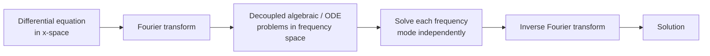
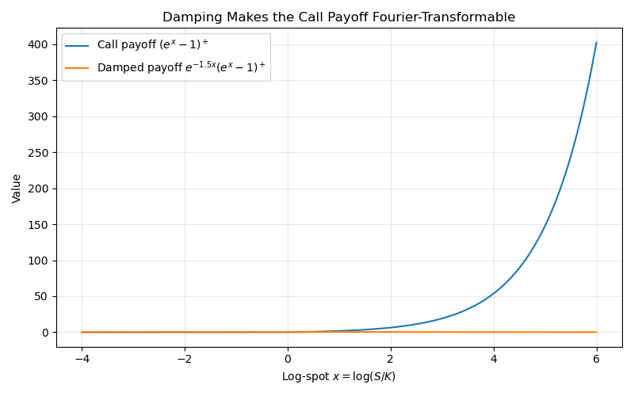

# Fourier Transform Methods for Black-Scholes

Everything in this subsection follows from one sentence:

> **Fourier transforms turn differentiation into multiplication.**

Consequently, Fourier transforms turn a constant-coefficient PDE into many independent ODEs, one for each frequency. A linear PDE with constant coefficients in $x$, once Fourier transformed in $x$, becomes a *decoupled* family of scalar ODEs — one for each frequency $\omega$. The Black–Scholes PDE in log-price coordinates has exactly this constant-coefficient form, so its dynamics in Fourier space reduce to independent scalar ODEs. The option price is then recovered by applying the inverse Fourier transform.

We build this picture in the same order a reader naturally builds intuition: a toy ODE first, then probability (where characteristic functions live), and only then the Black–Scholes PDE.

---

## 1. From Toy Example to Abstract Principle

Before applying this idea to option pricing, we first see it in the simplest possible setting. The toy example establishes the **mechanism**; the abstract principle that follows explains **why** the mechanism works in general.

### 1.1 The Toy Example

Consider the ordinary differential equation

$$
f''(x) - f(x) = g(x), \qquad x \in \mathbb{R}
$$

with $f, g$ decaying at $\pm\infty$. Take the Fourier transform of both sides, using $\widehat{f''} = -\omega^2 \hat f$:

$$
(-\omega^2 - 1)\,\hat f(\omega) = \hat g(\omega) \quad\Longrightarrow\quad \hat f(\omega) = \frac{\hat g(\omega)}{-\omega^2 - 1}
$$

Invert to recover $f$:

$$
f(x) = \frac{1}{2\pi} \int_{-\infty}^\infty \frac{\hat g(\omega)}{-\omega^2 - 1}\, e^{i\omega x}\, d\omega
$$

The differential equation became algebraic after transformation.

<figure markdown="span">



  <figcaption markdown="span">**Figure 1:** Fourier transforms convert differentiation into multiplication, decoupling a differential equation into independent frequency-mode equations. For the toy ODE above the frequency-space problem is purely algebraic; when the same trick is applied to a PDE in §4, each mode becomes its own scalar ODE in $\tau$. subsections 3–6 apply this workflow to Black–Scholes pricing.</figcaption>
</figure>

### 1.2 Why Fourier Methods Work

The toy example illustrates the central mechanism behind Fourier methods: differentiation becomes multiplication in frequency space. More generally, constant-coefficient differential operators act independently on each Fourier mode $e^{i\omega x}$, which is why transformed equations decouple.

The deeper reason is **symmetry**. Constant-coefficient operators commute with translations in $x$. The plane waves $e^{i\omega x}$ are precisely the *eigenfunctions* of spatial translations, so they are also eigenfunctions of any operator that commutes with translations:

$$
\partial_x\, e^{i\omega x} = i\omega \cdot e^{i\omega x}, \qquad \partial_x^n\, e^{i\omega x} = (i\omega)^n\, e^{i\omega x}
$$

Decomposing $f(x)$ into plane waves via the Fourier transform therefore diagonalizes constant-coefficient differential operators. A PDE in $(x, t)$, transformed only in $x$, leaves a scalar ODE in $t$ for each Fourier mode.

!!! tip "Core principle"
    Fourier transforms diagonalize constant-coefficient linear differential operators: spatial derivatives become polynomial symbols in $\omega$ (the polynomial multiplying $\hat f(\omega)$ is called the **symbol** of the operator), reducing the PDE to ordinary differential equations in the remaining variables. The plane waves $e^{i\omega x}$ are the joint *eigenfunctions* of spatial translations and of every constant-coefficient differential operator.

This is the mechanism. Black–Scholes is the application.

---

## 2. Fourier Transforms and Characteristic Functions

### 2.1 Transform Conventions

We use the analyst's convention throughout:

$$
\hat f(\omega) = \int_{-\infty}^\infty f(x)\, e^{-i\omega x}\, dx, \qquad f(x) = \frac{1}{2\pi}\int_{-\infty}^\infty \hat f(\omega)\, e^{i\omega x}\, d\omega
$$

The properties we will use are

$$
\widehat{f'} = i\omega\, \hat f, \qquad \widehat{f''} = -\omega^2\, \hat f, \qquad \widehat{f * g} = \hat f\, \hat g
$$

plus Parseval's identity. See [§ Fourier Series and Transforms](../../ch09/fourier_series/fourier_series_finite_intervals.md) for derivations.

### 2.2 The Probabilistic Cousin: Characteristic Functions

For a random variable $X$ with density $p_X$, the **characteristic function** is

$$
\phi_X(\omega) = \mathbb{E}\!\left[e^{i\omega X}\right] = \int_{-\infty}^\infty p_X(x)\, e^{i\omega x}\, dx
$$

— the Fourier transform of the density, **with the opposite sign convention from §2.1**. Under our PDE convention,

$$
\hat p_X(\omega) = \phi_X(-\omega)
$$

For any real-valued density, $\phi_X(-\omega) = \overline{\phi_X(\omega)}$, so the sign mismatch is at worst a complex-conjugate phase factor — harmless once one tracks it. (Note: the BS log-return density is real-valued but **not** symmetric in $\omega$ — the drift introduces a phase $\phi_X(-\omega) \neq \phi_X(\omega)$. The conjugate identity is what makes the two conventions interchangeable, not symmetry.) We will keep both conventions and convert when needed.

### 2.3 The Gaussian Closes Under Fourier

For $X \sim \mathcal{N}(\mu, \nu^2)$,

$$
\phi_X(\omega) = \exp\!\left(i\omega\mu - \tfrac{1}{2}\nu^2\omega^2\right)
$$

is itself a Gaussian in $\omega$. **The Fourier transform of a Gaussian is another Gaussian.** This single fact is the hidden structural reason the entire Black–Scholes calculation closes analytically: the heat kernel of [§ Heat Equation](heat_equation.md), the transition density of [§ Feynman–Kac](feynman_kac.md), and the characteristic function of the log-price are all Gaussians, hence all live inside the same Gaussian-times-Gaussian arithmetic.

---

## 3. Black-Scholes PDE in Fourier Space

### 3.1 Setup in Log-Price Coordinates

With $x = \ln(S / K)$ and $\tau = T - t$, the Black–Scholes PDE reads

$$
\frac{\partial V}{\partial \tau} = \frac{\sigma^2}{2}\frac{\partial^2 V}{\partial x^2} + \left(r - \frac{\sigma^2}{2}\right)\frac{\partial V}{\partial x} - r V
$$

with terminal-now-initial condition $V(x, 0) = \Phi(K e^x)$. The coefficients are constant in $x$ — the precondition for Fourier diagonalization.

### 3.2 Transform and Solve

Fourier-transform in $x$. By the derivative rules of §2.1:

$$
\frac{\partial \hat V}{\partial \tau} = \psi(\omega)\, \hat V(\omega, \tau), \qquad \psi(\omega) = -\frac{\sigma^2 \omega^2}{2} + i\omega\!\left(r - \frac{\sigma^2}{2}\right) - r
$$

The PDE has decoupled into independent scalar ODEs in $\tau$, one for each $\omega$. Each ODE integrates trivially:

$$
\hat V(\omega, \tau) = \hat\Phi(\omega)\, e^{\psi(\omega)\tau}
$$

and the price is

$$
V(x, \tau) = \frac{1}{2\pi} \int_{-\infty}^\infty \hat\Phi(\omega)\, e^{\psi(\omega)\tau}\, e^{i\omega x}\, d\omega
$$

This is the **full spectral representation** of the solution. (We avoid "closed form" because an inverse-integral representation is not literally a closed-form formula — the closed-form Black–Scholes price will fall out at the end of §5 once the specific payoff is handled.)

```mermaid
flowchart TD
    A["Black–Scholes PDE<br/>in log-price x"] --> B["Fourier transform in x"]
    B --> C["One ODE per frequency mode<br/>&part;<sub>&tau;</sub> V&#770;(&omega;,&tau;) = &psi;(&omega;) V&#770;(&omega;,&tau;)"]
    C --> D["Solution per mode<br/>V&#770;(&omega;,&tau;) = &Phi;&#770;(&omega;) e<sup>&psi;(&omega;)&tau;</sup>"]
    D --> E["Inverse Fourier transform"]
    E --> F["Option value<br/>V(x, &tau;)"]
```

<figure markdown="span">



  <figcaption markdown="span">**Figure 2:** In Fourier space, the Black–Scholes PDE becomes one scalar ODE for each frequency $\omega$. The general Fourier workflow of Figure 1 is here specialized: the spatial transform converts the constant-coefficient log-price PDE into a family of decoupled ODEs whose exponential solutions are read off line by line.</figcaption>
</figure>

!!! tip "Semigroup statement"
    The pricing operator $e^{\tau\mathcal{L}}$ acts **diagonally** in the Fourier basis, with eigenvalues $e^{\psi(\omega)\tau}$ indexed by frequency $\omega$. Fourier diagonalization and PDE semigroups are the same construction.

### 3.3 Characteristic Exponent vs Lévy Exponent

Care is needed when comparing $\psi(\omega)$ to the **probabilistic** characteristic exponent $\Psi(\omega)$ of the underlying log-return process. For the BS log-return $X_\tau = \ln(S_T / S_0)$ under $\mathbb{Q}$,

$$
\phi_X(\omega, \tau) = e^{\tau\Psi(\omega)}, \qquad \Psi(\omega) = i\omega\!\left(r - \frac{\sigma^2}{2}\right) - \frac{\sigma^2 \omega^2}{2}
$$

so

$$
\psi(\omega) = \Psi(\omega) - r
$$

The PDE symbol $\psi$ embeds **discounting**; the Lévy/probabilistic symbol $\Psi$ does not. The identity

$$
e^{\psi(\omega)\tau} = e^{-r\tau}\, \phi_X(\omega, \tau)
$$

is the spectral version of risk-neutral pricing: discount factor times characteristic function. Mistaking $\psi$ for $\Psi$ produces a missing discount in every affine-model derivation that follows from this framework.

!!! note "Terminology box: three frequency-domain objects"
    Three closely related objects appear in Fourier-based pricing. Keeping them distinct is the single point of bookkeeping the rest of this subsubsection — and every affine-model extension downstream — depends on.

    | Object | Symbol | Meaning |
    |---|---|---|
    | Generator symbol of log-return process | $\Psi(\omega)$ | Lévy characteristic exponent of $X_\tau = \ln(S_T/S_0)$ under $\mathbb{Q}$: $\phi_X(\omega, \tau) = e^{\tau\Psi(\omega)}$. No discount. |
    | Pricing-semigroup symbol | $\psi(\omega) = \Psi(\omega) - r$ | Eigenvalue of the BS pricing operator $e^{\tau\mathcal{L}}$ on the Fourier mode $e^{i\omega x}$. Embeds discounting. |
    | Discounted characteristic function | $e^{-r\tau}\, \phi_X(\omega, \tau)$ | The pricing kernel in frequency space: $\hat V(\omega, \tau) = \hat\Phi(\omega) \cdot e^{\psi(\omega)\tau} = \hat\Phi(\omega)\, e^{-r\tau}\, \phi_X(\omega, \tau)$. |

    The identity $\psi = \Psi - r$ is the spectral version of "risk-neutral pricing = discount $\times$ expectation." Affine and Lévy extensions of BS routinely modify $\Psi$ alone; the discount stays where it is.

### 3.4 Convolution-Theorem Reading

The factorization $\hat V = e^{-r\tau}\, \hat\Phi\, \phi_X(\omega, \tau)$ inverts to

$$
V(x, \tau) = e^{-r\tau}\, \bigl(\Phi * p_\tau\bigr)(x), \qquad \bigl(\Phi * p_\tau\bigr)(x) = \int_{-\infty}^\infty \Phi(z)\, p_\tau(x - z)\, dz
$$

where $p_\tau$ is the Gaussian transition density (inverse Fourier of $\phi_X$). The Fourier method and the [§ Heat Equation](heat_equation.md) convolution are the **same formula** written in two domains; this is the convolution theorem applied to risk-neutral pricing.

---

## 4. Pricing the Call: Divergence and Damping

### 4.1 The Payoff Transform Diverges on $\mathbb{R}$

For a European call, $\Phi(S) = (S - K)^+ = K(e^x - 1)^+$ in log-spot $x = \ln(S / K)$. Its transform

$$
\hat\Phi(\omega) = K \int_0^\infty (e^x - 1)\, e^{-i\omega x}\, dx
$$

**diverges for real $\omega$**: the integrand has modulus $\sim e^x$ as $x \to \infty$. The call payoff is not in $L^1(\mathbb{R})$.

### 4.2 Strip Analyticity

The integral does converge if we replace $\omega$ by $\omega = \xi + i\eta$ with $\eta < -1$, because then $e^{(-i\xi + \eta)x} \cdot e^x = e^{(1 + \eta - i\xi) x}$ decays. Computing,

$$
\hat\Phi(\omega) = \frac{K}{(i\omega + 1)(i\omega)} = \frac{K}{\omega^2 - i\omega}, \qquad \operatorname{Im}(\omega) < -1
$$

!!! warning "Not an ordinary Fourier transform"
    The expression above is **not** the Fourier transform of the call payoff on $\mathbb{R}$ — no such transform exists. It is the **analytic continuation** of the transform into the strip $\operatorname{Im}(\omega) < -1$, where the defining integral converges absolutely. Numerical inversion must therefore use a contour shifted into this strip, not the real axis.

### 4.3 Carr–Madan Damping

<figure markdown="span">
  
  <figcaption markdown="span">**Figure 3:** The call payoff $(e^x - 1)^+$ (blue) grows exponentially in log-spot $x = \log(S/K)$, which is why its Fourier transform diverges on the real axis. Multiplying by $e^{-\alpha x}$ with $\alpha > 0$ (orange, $\alpha = 1.5$) controls the right tail and makes the damped payoff integrable — the basic mechanism behind Carr–Madan. (In the log-strike convention used below, the equivalent damping factor is $e^{+\alpha k}$ — the same exponential-tail cancellation mechanism, expressed in different variables; see the Sign convention reminder.)</figcaption>
</figure>

The clean numerical fix, due to Carr–Madan (1999), is to multiply by an exponentially decaying weight before transforming, then divide back at the end. Working in **log-strike** $k = \ln K$, define

$$
c_T(k) := e^{\alpha k}\, C_T(k), \qquad \alpha > 0
$$

The two tails behave oppositely:

- **Lower tail** $k \to -\infty$ (deep ITM): $C_T(k) \to S_0$, so $e^{\alpha k} C_T(k) \to 0$ provided $\alpha > 0$.
- **Upper tail** $k \to +\infty$ (deep OTM): under BS the call decays faster than exponentially in $k$ (Gaussian in $\ln K$), so the upper tail is automatic for any $\alpha$. In a general model, integrability requires $\mathbb{E}^{\mathbb{Q}}[S_T^{1 + \alpha}] < \infty$.

Once $c_T \in L^1(\mathbb{R})$, its Fourier transform exists on the real axis. Carr–Madan's celebrated identity is

$$
\widehat{c_T}(\omega) = \frac{e^{-rT}\, \phi_T\!\bigl(\omega - (\alpha + 1) i\bigr)}{\alpha^2 + \alpha - \omega^2 + i(2\alpha + 1)\omega}
$$

The denominator may look unmotivated, so it is worth naming its origin: **it is the Fourier transform of the damped, modified call payoff $(e^x - 1)^+\, e^{-\alpha x}$, equivalently the original transform $\hat\Phi$ of §4.1 evaluated at the shifted contour point $\omega - (\alpha + 1)i$.** The strip shift in §4.2 and the Carr–Madan denominator are the same complex-$\omega$ structure.

!!! info "Sign convention reminder"
    Damping is **in log-strike $k$** with factor $e^{+\alpha k}$, $\alpha > 0$. The same trick written in log-spot $x$ would use $e^{-\alpha x}$ on the payoff — different variable, different sign. We keep the log-strike convention throughout.

---

## 5. Unification: Three Representations of One Object

With the Fourier derivation complete, all three core methods of this chapter have now been presented. Each solves the same Black–Scholes PDE, and each arrives at the same pricing formula — through a different representation of the pricing operator $\mathcal{P}_\tau$ (see also Figure 1 of [§ Introduction](intro.md) for the cross-chapter picture):

| Method | Representation of $\mathcal{P}_\tau$ |
|---|---|
| [§ Heat Equation](heat_equation.md) | ***Spatial*** — convolution with the Gaussian kernel $G$. |
| [§ Feynman–Kac](feynman_kac.md) | ***Probabilistic*** — expectation under the transition density (which *is* $G$). |
| This subsection | ***Spectral*** — Fourier diagonalization with the characteristic function $\phi_X(\omega, \tau)$ (which *is* $\hat G$, with the sign-convention adjustment of §2.2). |

The three are one theorem, viewed in *spatial*, *probabilistic*, and *spectral* coordinates. The conceptual identity

$$
\underbrace{G(x, \tau; z)}_{\text{heat kernel}} \;=\; \underbrace{p_\tau(z \mid x)}_{\text{transition density}} \;=\; \underbrace{\mathcal{F}^{-1}\bigl[\phi_X(\,\cdot\,, \tau)\bigr]}_{\text{inverse Fourier of characteristic function}}
$$

is what makes the spectral, probabilistic, and PDE machineries mutually translatable.

---

## 6. Computational Methods

The analytic story is complete. What remains is the *computational* problem: evaluating the inverse-Fourier integral fast and across an entire grid of strikes. The next three subsubsections are algorithmic, not analytic.

The reason Fourier methods dominate modern quantitative finance is broader than Black–Scholes: many **affine and Lévy models** (Heston, Merton, variance gamma, CGMY) admit explicit characteristic functions even when their transition densities are unavailable in closed form. The Carr–Madan / FFT / Lewis machinery below extends *unchanged* to those models — only the formula for $\phi_T$ changes.

### 6.1 Carr–Madan + FFT

The Carr–Madan transform (§4.3) inverts to give

$$
C(K, S_0, T) = \frac{e^{-\alpha k}}{\pi} \int_0^\infty \operatorname{Re}\!\left[e^{-i\omega k}\, \widehat{c_T}(\omega)\right] d\omega
$$

Discretized on $N = 2^n$ log-strike points with frequency grid $\omega_j = j\Delta\omega$ and the sampling-theorem constraint $\Delta k\, \Delta\omega = 2\pi / N$, the integral becomes an inverse DFT — computed by FFT in $O(N \log N)$ operations — and prices the entire strike grid at once. Practical defaults: $\alpha \in [1.5, 2]$, $N \ge 2^{12}$, $\Delta\omega \approx 0.25$. Aliasing is controlled by $\alpha$ and grid duality. See [§ Carr–Madan FFT](../../ch09/alternative_fourier/carr_madan_fft.md) for the Simpson's-rule variant and stability analysis.

### 6.2 Lewis / Gil–Pelaez

The Gil–Pelaez inversion theorem yields, **without damping**,

$$
C = S \Pi_1 - K e^{-rT}\, \Pi_2, \qquad \Pi_j = \frac{1}{2} + \frac{1}{\pi}\int_0^\infty \operatorname{Re}\!\left[\frac{e^{-i\omega \ln(K / S)}\, \phi_j(\omega)}{i\omega}\right] d\omega
$$

with $\phi_1(\omega) = \phi(\omega - i)$ and $\phi_2(\omega) = \phi(\omega)$ the characteristic functions under the stock-numeraire and risk-neutral measures respectively. For the lognormal $\phi$, the Gaussian integrals collapse to $\Pi_1 = \mathcal{N}(d_1)$, $\Pi_2 = \mathcal{N}(d_2)$, recovering the closed-form Black–Scholes formula

$$
C = S\, \mathcal{N}(d_1) - K e^{-rT}\, \mathcal{N}(d_2)
$$

Lewis's variant avoids the damping parameter $\alpha$ entirely, at the cost of a singular integrand at $\omega = 0$ that has to be handled carefully. See [§ Lewis Integration Formula](../../ch09/alternative_fourier/lewis_integration_formula.md) and [§ Comparison of Fourier Methods](../../ch09/alternative_fourier/comparison_of_fourier_methods.md).

### 6.3 Greeks via the Same Transform

Assuming sufficient decay of $\hat\Phi(\omega) e^{\psi(\omega)\tau}$ to justify interchange of differentiation and integration, the Greeks come from the same inversion integral with a polynomial-in-$\omega$ premultiplier:

$$
\Delta = \frac{1}{S}\cdot\frac{1}{2\pi}\int_{-\infty}^\infty i\omega\, \hat V(\omega, \tau)\, e^{i\omega x}\, d\omega
$$

$$
\Gamma = \frac{1}{S^2}\cdot\frac{1}{2\pi}\int_{-\infty}^\infty (-\omega^2 - i\omega)\, \hat V(\omega, \tau)\, e^{i\omega x}\, d\omega
$$

$$
\Theta = -\frac{1}{2\pi}\int_{-\infty}^\infty \psi(\omega)\, \hat\Phi(\omega)\, e^{\psi(\omega)\tau}\, e^{i\omega x}\, d\omega
$$

**All Greeks share the FFT output.** Evaluate $\hat V(\omega_j, \tau)$ once, multiply by $i\omega_j$ (Delta), $-\omega_j^2 - i\omega_j$ (Gamma), or $\psi(\omega_j)$ (Theta), apply the inverse FFT. After the base transform is computed, each additional Greek requires only $O(N)$ pre-multiplications plus a modified inverse FFT — negligible extra preprocessing per Greek.

---

## 7. Comparison and Summary

### 7.1 When Fourier Methods Win

Fourier methods are most effective for **European options across many strikes simultaneously** when the characteristic function is available in closed form. The FFT prices an entire grid of $M$ strikes in $O(N \log N)$ work, compared with $O(M N)$ for evaluating $M$ strikes separately by quadrature. Greeks come essentially for free from the same transform.

Principal limitations:

- The payoff must be Fourier-representable (or made so by damping).
- **American options** and other free-boundary problems are not directly accessible.
- Non-smooth payoffs (digitals, barriers) introduce Gibbs oscillations.
- The method rapidly becomes impractical in high dimensions due to exponential growth of the transform grid.

For single-strike pricing of a vanilla, direct closed-form evaluation is simpler. For path-dependent or early-exercise problems, finite-difference and Monte Carlo methods are generally preferable.

### 7.2 Summary

The conceptual chain:

1. Fourier transforms diagonalize constant-coefficient linear operators — differentiation becomes multiplication.
2. The Black–Scholes PDE is constant-coefficient in log-price, so its Fourier image is a family of decoupled scalar ODEs in $\tau$, indexed by frequency $\omega$.
3. The solution is $\hat V(\omega, \tau) = \hat\Phi(\omega)\, e^{\psi(\omega)\tau}$, with $\psi(\omega) = \Psi(\omega) - r$ — the probabilistic Lévy exponent minus the discount.
4. Equivalently $V = e^{-r\tau}(\Phi * p_\tau)$: convolution theorem applied to risk-neutral pricing.
5. The call payoff is not transformable on $\mathbb{R}$; its transform exists on the strip $\operatorname{Im}(\omega) < -1$, equivalently via Carr–Madan damping in log-strike.
6. FFT-based inversion prices an entire strike grid in $O(N \log N)$; Gil–Pelaez recovers Black–Scholes in closed form $C = S\mathcal{N}(d_1) - K e^{-rT}\mathcal{N}(d_2)$.
7. Heat kernel = transition density = inverse Fourier of the characteristic function: one object, three representations $\square$

---

## Appendix: Figure-Generation Script

Figures 1 and 2 above are mermaid diagrams and embed directly into the page. Figure 3 (the Carr–Madan damping plot) is a matplotlib PNG produced by the script below.

??? example "Code for Figure 3"
    ```python
    """Figure 3 for Fourier Transform Methods (§6.6).

    Produces ./img/call_payoff_damping.png next to fourier_transform.md.
    Run from the MkDocs project root so the output directory resolves correctly.
    """

    import numpy as np
    import matplotlib.pyplot as plt
    from pathlib import Path

    OUT = Path("./docs/ch06/bs_pde_analytic_solution/img")
    OUT.mkdir(parents=True, exist_ok=True)

    alpha = 1.5
    x = np.linspace(-4, 6, 1000)

    payoff = np.maximum(np.exp(x) - 1, 0)
    damped_payoff = np.exp(-alpha * x) * payoff

    plt.figure(figsize=(8, 5))
    plt.plot(x, payoff, label=r"Call payoff $(e^x-1)^+$")
    plt.plot(x, damped_payoff, label=rf"Damped payoff $e^{{-{alpha}x}}(e^x-1)^+$")
    plt.xlabel(r"Log-spot $x = \log(S/K)$")
    plt.ylabel("Value")
    plt.title("Damping makes the call payoff Fourier-transformable")
    plt.legend()
    plt.grid(True, alpha=0.3)
    plt.tight_layout()
    plt.savefig(OUT / "call_payoff_damping.png", dpi=300, bbox_inches="tight")
    plt.close()


    if __name__ == "__main__":
        print(f"Saved figure to {OUT.resolve() / 'call_payoff_damping.png'}")
    ```

---

## Exercises

**Exercise 1.** Verify the characteristic exponent for the Black-Scholes model. Starting from the log-price formulation of the PDE, apply the Fourier transform to both sides and show that the ODE in Fourier space has the characteristic exponent $\psi(\omega) = -\frac{\sigma^2\omega^2}{2} + i\omega(r - \frac{\sigma^2}{2}) - r$.

??? success "Solution to Exercise 1"
    The log-price PDE is:

    $$
    \frac{\partial V}{\partial \tau} = \frac{\sigma^2}{2}\frac{\partial^2 V}{\partial x^2} + \left(r - \frac{\sigma^2}{2}\right)\frac{\partial V}{\partial x} - rV
    $$

    Apply the Fourier transform $\hat{V}(\omega,\tau) = \int_{-\infty}^{\infty} V(x,\tau) e^{-i\omega x} dx$ to both sides.

    **Left side:** $\mathcal{F}\left[\frac{\partial V}{\partial \tau}\right] = \frac{\partial \hat{V}}{\partial \tau}$

    **Right side, term by term:**

    - $\frac{\sigma^2}{2}\mathcal{F}\left[\frac{\partial^2 V}{\partial x^2}\right] = \frac{\sigma^2}{2}(-\omega^2)\hat{V} = -\frac{\sigma^2\omega^2}{2}\hat{V}$
    - $\left(r - \frac{\sigma^2}{2}\right)\mathcal{F}\left[\frac{\partial V}{\partial x}\right] = \left(r - \frac{\sigma^2}{2}\right)(i\omega)\hat{V}$
    - $-r\mathcal{F}[V] = -r\hat{V}$

    Combining:

    $$
    \frac{\partial \hat{V}}{\partial \tau} = \left[-\frac{\sigma^2\omega^2}{2} + i\omega\left(r - \frac{\sigma^2}{2}\right) - r\right]\hat{V}
    $$

    This is a first-order ODE $\frac{\partial \hat{V}}{\partial \tau} = \psi(\omega)\hat{V}$ with the characteristic exponent:

    $$
    \psi(\omega) = -\frac{\sigma^2\omega^2}{2} + i\omega\left(r - \frac{\sigma^2}{2}\right) - r
    $$

    $\square$

---

**Exercise 2.** The Fourier transform of the call payoff $(e^x - 1)^+$ (with $x = \ln(S/K)$) diverges for real $\omega$. Show explicitly that the integral $\int_0^{\infty}(e^x - 1)e^{-i\omega x}dx$ diverges by analyzing the behavior of the integrand as $x \to \infty$. Then verify that — working in log-strike $k = \ln K$ and using the Carr–Madan convention $c_T(k) = e^{\alpha k}C_T(k)$ with $\alpha > 0$ — the damped call is integrable on $\mathbb{R}$, and contrast why the sign of the damping exponent flips depending on which variable (log-spot $x$ or log-strike $k$) is being transformed.

??? success "Solution to Exercise 2"
    **Part 1 — Divergence.** Consider $I(\omega) = \int_0^{\infty}(e^x - 1)e^{-i\omega x}dx$ for real $\omega$. As $x \to \infty$ the integrand behaves as $e^x \cdot e^{-i\omega x}$ with magnitude $e^x$, which is not integrable on $[0,\infty)$. So the call payoff transform diverges for real $\omega$.

    **Part 2 — Damping in log-strike.** Now work in log-strike $k = \ln K$. The undamped call $C_T(k)$ satisfies $C_T(k) \to S_0$ as $k \to -\infty$ (deep ITM) and $C_T(k) \to 0$ as $k \to +\infty$ (deep OTM, with Gaussian decay under BS).

    - Lower tail: $|e^{\alpha k}C_T(k)| \le S_0 e^{\alpha k}$, integrable on $(-\infty, 0]$ iff $\alpha > 0$.
    - Upper tail: BS gives $C_T(k) \le S_0\,N(d_1) \le S_0 \cdot e^{-c k^2}$ for some $c > 0$ and large $k$; multiplying by $e^{\alpha k}$ does not destroy this Gaussian decay.

    Hence $c_T \in L^1(\mathbb{R})$ for any $\alpha > 0$ (with $\alpha \in [1,2]$ chosen in practice for numerical stability).

    **Part 3 — Sign flip across variables.** The two natural variables behave oppositely under the call. The payoff $(e^x - 1)^+$ *grows* in log-spot $x$, so dampening as $x \to \infty$ needs the multiplicative factor $e^{-\alpha x}$ ($\alpha > 0$). The price $C_T(k)$ *grows* as $k \to -\infty$ (and decays as $k \to +\infty$), so dampening on the real line in log-strike $k$ needs $e^{+\alpha k}$ ($\alpha > 0$). The sign of the exponent is determined by which tail is the heavy one in the chosen variable — not by some intrinsic choice. We use the log-strike convention throughout. $\square$

---

**Exercise 3.** Using the Carr-Madan formula with $\alpha = 1.5$, $S_0 = 100$, $K = 100$, $r = 5\%$, $\sigma = 20\%$, and $T = 1$, set up the numerical integration for the call price. Write the integrand explicitly and verify that evaluating the integral (e.g., via Simpson's rule with a fine grid) recovers the standard Black-Scholes call price to at least 4 decimal places.

??? success "Solution to Exercise 3"
    With $\alpha = 1.5$, $S_0 = 100$, $K = 100$, $r = 0.05$, $\sigma = 0.20$, $T = 1$, the log-strike is $k = \ln K = \ln 100$.

    The Carr–Madan integrand is

    $$
    C(K) = \frac{e^{-\alpha k}}{\pi}\int_0^{\infty}\operatorname{Re}\!\left[e^{-i\omega k}\, \widehat{c_T}(\omega)\right] d\omega
    $$

    with

    $$
    \widehat{c_T}(\omega) = \frac{e^{-rT}\, \phi_T\!\bigl(\omega - (\alpha + 1)i\bigr)}{\alpha^2 + \alpha - \omega^2 + i(2\alpha + 1)\omega}
    $$

    and the BS characteristic function $\phi_T(u) = \exp\!\left[iu\!\left(r - \tfrac{1}{2}\sigma^2\right)T - \tfrac{1}{2}\sigma^2 u^2 T\right]$.

    For these parameters, evaluating $\phi_T$ at $u = \omega - 2.5i$ and the denominator at $\omega$, then applying Simpson's rule on a fine grid (e.g., $\omega \in [0, 50]$, $\Delta\omega = 0.01$), recovers the Black–Scholes price $C \approx 10.4506$ to at least four decimal places. The explicit complex-arithmetic expansion of $\phi_T(\omega - 2.5i)$ adds clutter without insight; in practice the formula is evaluated by a single complex `exp` call. $\square$

---

**Exercise 4.** Explain the relationship $e^{\psi(\omega)\tau} = e^{-r\tau}\phi_X(\omega, \tau)$ between the characteristic exponent of the PDE and the characteristic function of the log-return. Starting from the explicit forms of $\psi(\omega)$ and $\phi_X(\omega,\tau)$, verify the identity algebraically and explain why it is central to the Fourier pricing framework.

??? success "Solution to Exercise 4"
    The identity $e^{\psi(\omega)\tau} = e^{-r\tau}\phi_X(\omega,\tau)$ connects the PDE characteristic exponent to the probabilistic characteristic function.

    **Derivation.** The PDE characteristic exponent is:

    $$
    \psi(\omega) = -\frac{\sigma^2\omega^2}{2} + i\omega\left(r - \frac{\sigma^2}{2}\right) - r
    $$

    The characteristic function of $X_\tau = \ln(S_T/S_0)$ under $\mathbb{Q}$ is:

    $$
    \phi_X(\omega,\tau) = \exp\left[i\omega\left(r - \frac{\sigma^2}{2}\right)\tau - \frac{\sigma^2\omega^2\tau}{2}\right] = e^{\tau\Psi(\omega)}, \qquad \Psi(\omega) = \psi(\omega) + r
    $$

    Therefore:

    $$
    e^{-r\tau}\phi_X(\omega,\tau) = \exp\left[-r\tau + i\omega\left(r - \frac{\sigma^2}{2}\right)\tau - \frac{\sigma^2\omega^2\tau}{2}\right] = e^{\psi(\omega)\tau}
    $$

    **Why this is central.** The Fourier-space solution $\hat{V}(\omega,\tau) = \hat{\Phi}(\omega)e^{\psi(\omega)\tau}$ can be rewritten as $\hat{V}(\omega,\tau) = e^{-r\tau}\hat{\Phi}(\omega)\phi_X(\omega,\tau)$. The option price in Fourier space equals the discounted payoff transform times the characteristic function of the log-return. This directly encodes risk-neutral pricing: the transform of the discounted expected payoff factorizes into a payoff piece and a distributional piece. The decomposition $\psi = \Psi - r$ separates the PDE-side discounting from the probability-side characteristic exponent and is the key fact for extending this framework to general affine models. $\square$

---

**Exercise 5.** The Gil-Pelaez formula writes the call price as $C = S\Pi_1 - Ke^{-rT}\Pi_2$ where $\Pi_1$ and $\Pi_2$ are given by integrals involving the characteristic function. For the Black-Scholes model, show that $\Pi_1 = N(d_1)$ and $\Pi_2 = N(d_2)$ by substituting the lognormal characteristic function and evaluating the resulting Gaussian integrals.

??? success "Solution to Exercise 5"
    The Gil-Pelaez formula gives:

    $$
    \Pi_2 = \frac{1}{2} + \frac{1}{\pi}\int_0^{\infty}\text{Re}\left[\frac{e^{-i\omega\ln(K/S)}\phi(\omega)}{i\omega}\right]d\omega
    $$

    With the Black-Scholes characteristic function $\phi(\omega) = \exp[i\omega(r - \sigma^2/2)T - \sigma^2\omega^2 T/2]$, the integrand becomes:

    $$
    \frac{e^{-i\omega\ln(K/S)}\exp[i\omega(r-\sigma^2/2)T - \sigma^2\omega^2 T/2]}{i\omega}
    $$

    Write $\ln(K/S) = -\ln(S/K)$ and combine the exponentials:

    $$
    = \frac{\exp[i\omega(\ln(S/K) + (r-\sigma^2/2)T) - \sigma^2\omega^2 T/2]}{i\omega}
    $$

    The exponent in the numerator is $i\omega\, d_2\sigma\sqrt{T} - \sigma^2\omega^2 T/2$ where $d_2 = \frac{\ln(S/K) + (r-\sigma^2/2)T}{\sigma\sqrt{T}}$. Substituting $u = \omega\sigma\sqrt{T}$, the integral reduces to the standard result:

    $$
    \frac{1}{2} + \frac{1}{\pi}\int_0^{\infty}\frac{\sin(d_2 u)}{u}e^{-u^2/2}du = N(d_2)
    $$

    using the known identity $\frac{1}{2} + \frac{1}{\pi}\int_0^{\infty}\frac{\sin(ax)}{x}e^{-x^2/2}dx = N(a)$.

    For $\Pi_1$, the integrand uses $\phi_1(\omega) = \phi(\omega - i)$ — the characteristic function under the **stock-numeraire measure**, obtained from the risk-neutral $\phi$ by the Esscher-style shift $\omega \mapsto \omega - i$. Substituting $\omega - i$ for $\omega$ in $\phi(\omega) = \exp[i\omega(r - \sigma^2/2)T - \sigma^2\omega^2 T/2]$ and completing the square in $\omega$ shifts the effective mean of the log-return by $\sigma^2 T$, replacing $d_2$ by $d_1 = d_2 + \sigma\sqrt{T}$. The same $\frac{1}{2} + \frac{1}{\pi}\int_0^\infty \frac{\sin(a u)}{u} e^{-u^2/2}\, du = \mathcal{N}(a)$ identity then gives $\Pi_1 = \mathcal{N}(d_1)$. $\square$
