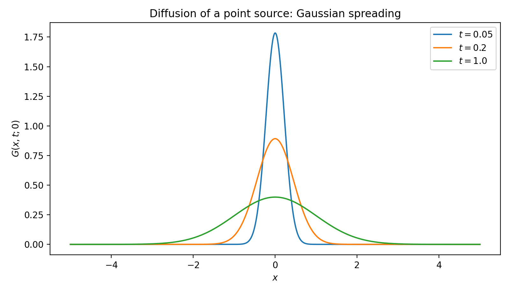
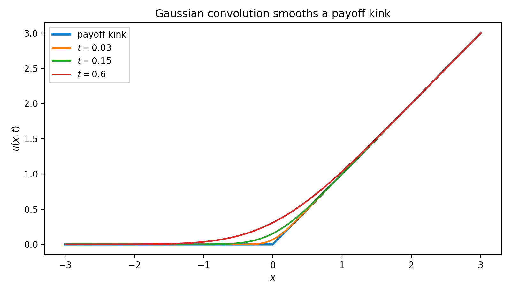
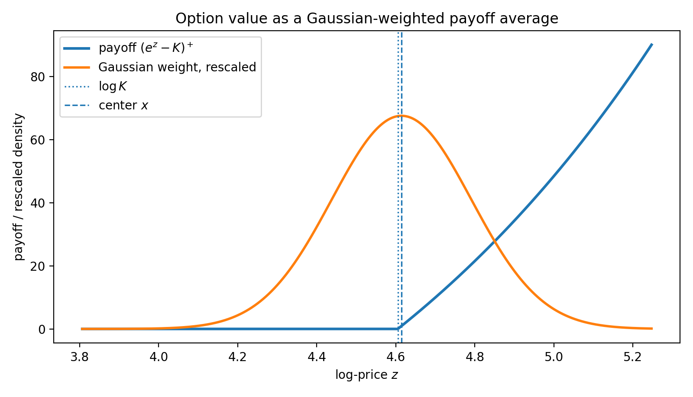
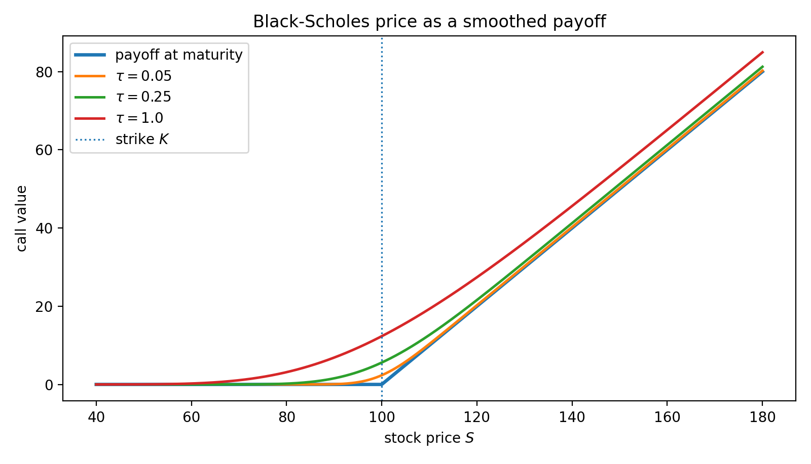

# Black-Scholes Formula via Heat Equation

The deepest statement of this subsection is one sentence:

> **Black–Scholes pricing is Gaussian diffusion in log-price space with time reversal.**

Everything else — the change of variables, the Green's function, the completing-the-square algebra, the $\mathcal{N}(d_1)$ and $\mathcal{N}(d_2)$ — is bookkeeping that turns this single idea into a formula. Before doing the bookkeeping we work the diffusion picture on its own, on the simplest possible problem, until the principle is visible. Only then is the Black–Scholes calculation what it should be: a re-expression of an already-understood diffusion in coordinates where the option payoff is the initial condition.

---

## 1. The Toy Problem: Diffusion of a Point Source

Before any finance, work the cleanest heat-equation problem in existence:

$$
u_t = \kappa\, u_{xx}, \qquad x \in \mathbb{R}, \qquad t > 0
$$

with the **point-source** initial condition

$$
u(x, 0) = \delta(x - z)
$$

— a unit of heat (or mass, or probability) concentrated at the single point $z$.

### 1.1 The Solution Is a Gaussian

The solution is the **Gaussian kernel**

$$
G(x, t;\, z) = \frac{1}{\sqrt{4\pi\kappa t}}\, \exp\!\left(-\frac{(x - z)^2}{4\kappa t}\right)
$$

This is a normal density centered at $z$ with variance $2\kappa t$. Two checks make it concrete:

- **Mass conservation.** $\int_{-\infty}^\infty G(x, t; z)\, dx = 1$ for every $t > 0$. The total heat does not change; it only spreads.
- **Point-source limit.** As $t \to 0^+$ the variance $2\kappa t \to 0$ and $G$ concentrates on $z$: $G(x, t; z) \to \delta(x - z)$.

A direct calculation (Exercise 1) verifies $G_t = \kappa G_{xx}$.

### 1.2 What This Picture Says

Look at the kernel for $t = 0.01,\, 0.1,\, 1.0$: a thin spike, a wider bump, and a flat hill. That is the entire content of the heat equation:

!!! tip "Core principle: diffusion = averaging"
    The heat equation forgets local information and replaces it with **Gaussian averages over nearby states**. Sharp spikes spread, kinks smooth, fine features disappear. Information at the scale $\ell$ is gone after time $t \sim \ell^2 / \kappa$.

This is the sentence to keep in mind through the rest of the subsection. Everything else is a corollary.

<figure markdown="span">
  
  <figcaption markdown="span">**Figure 1:** Three snapshots of the point-source solution $G(x, t; 0)$ for $\kappa = 0.5$ at $t = 0.05, 0.2, 1.0$. A tall narrow Gaussian at small $t$, a moderate bump at intermediate $t$, a low spread-out hill at large $t$ — the width grows like $\sqrt{2\kappa t}$, the peak height drops like $1/\sqrt{4\pi\kappa t}$, and the total area stays at $1$. This single picture is the heat equation: information is conserved in total but redistributed by Gaussian averaging.</figcaption>
</figure>

---

## 2. Superposition: From Point Source to Arbitrary Data

A general initial condition $\psi(x)$ is **a continuous sum of point sources weighted by $\psi$**:

$$
\psi(x) = \int_{-\infty}^\infty \psi(z)\, \delta(x - z)\, dz
$$

The heat equation is linear, so the time evolution of a sum is the sum of time evolutions. Each delta at $z$ becomes the Gaussian $G(\cdot, t; z)$, and the corresponding contribution to the solution is $\psi(z) G(\cdot, t; z)$. Adding them up:

$$
F(x, t) = \int_{-\infty}^\infty \psi(z)\, G(x, t; z)\, dz
$$

The convolution is **inevitable**, not formal: it is what "linearity + point-source response" forces.

### 2.1 Diffusion as a Weighted Average

Read the integral the other way: at the observation point $(x, t)$ the value $F(x, t)$ is

$$
F(x, t) = \int_{-\infty}^\infty \psi(z)\, \underbrace{G(x, t; z)}_{\text{Gaussian weight}}\, dz = \mathbb{E}\!\left[\psi(X)\right], \quad X \sim \mathcal{N}(x,\, 2\kappa t)
$$

so $F(x, t)$ is the **Gaussian-weighted average of $\psi$** over a window of width $\sqrt{2\kappa t}$ centered at $x$. Sharp features inside that window get smoothed out; features outside it have not yet had time to influence $(x, t)$.

### 2.2 Smoothing of Kinks

The most striking visual: take $\psi$ to be a single sharp kink, like $\psi(x) = \max(x, 0)$. For $t$ just slightly positive the kink at $0$ is replaced by a smooth curve that interpolates between $0$ on the left and $x$ on the right — the corner is regularized at scale $\sqrt{2\kappa t}$. As $t$ grows, the curve becomes ever more spread out.

This single picture — a sharp ramp smoothed by convolution with a Gaussian — is **why Black–Scholes prices for $\tau > 0$ are $C^\infty$ even though the payoff has a corner**, why gamma is finite, and why diffusion regularizes singularities.

<figure markdown="span">
  
  <figcaption markdown="span">**Figure 2:** The ramp $\psi(x) = \max(x, 0)$ (heavy line, $t = 0$) evolved under the heat equation with $\kappa = 0.5$, plotted at $t = 0.03, 0.15, 0.6$. At $t = 0$ the curve has a corner at $x = 0$; at every positive time the corner is replaced by a smooth $C^\infty$ join whose radius is $\sqrt{2\kappa t}$. This is exactly the mechanism by which Black–Scholes prices regularize the call payoff: gamma is finite at every $\tau > 0$ and diverges only as $\tau \to 0$.</figcaption>
</figure>

### 2.3 The Three Faces of the Same Object

The Gaussian kernel will appear later in this chapter under three different names. They are the same object viewed from different angles:

$$
\underbrace{G(x, t; z)}_{\text{heat kernel}} \;=\; \underbrace{p(z \mid x; t)}_{\text{transition density of Brownian motion}} \;=\; \underbrace{\mathcal{F}^{-1}\bigl[e^{-\kappa\omega^2 t}\bigr]}_{\text{inverse Fourier of the characteristic function}}
$$

We will use **all three** in the rest of the chapter. The PDE view ([here], [§ Fourier Transform](fourier_transform.md)), the probability view ([§ Feynman–Kac](feynman_kac.md)), and the spectral view ([§ Separation of Variables](separation_of_variables.md), [§ Fourier Transform](fourier_transform.md)) compute the same thing. Recognizing the identity is the intellectual payoff of the analytic-solutions chapter.

---

## 3. Black–Scholes as Diffusion in Log-Price Space

### 3.0 Why Black–Scholes Should Secretly Be Diffusion

Before any algebra, ask the question intuitively. Under the risk-neutral measure $\mathbb{Q}$, the log-price $\ln S_t$ is a Brownian motion with constant drift $r - \tfrac{1}{2}\sigma^2$ and constant diffusion coefficient $\sigma$ — the **simplest possible stochastic process after pure Brownian motion**. The transition density $p_\tau(z \mid x)$ of that log-price process is a Gaussian, exactly the kernel of §1. So the pricing functional

$$
V(S, t) = e^{-r\tau}\, \mathbb{E}^{\mathbb{Q}}\!\left[\Phi(S_T) \mid S_t = S\right]
$$

is a Gaussian-weighted average of payoffs — the §2 averaging operation, with the Gaussian width $\sigma\sqrt{\tau}$ set by the volatility and time-to-maturity. Diffusion-as-averaging is therefore not a metaphor for option pricing; it is the *literal mechanism*, hidden inside the BS PDE by an unfortunate choice of coordinates.

The coordinate change below makes that hidden diffusion visible. Each substitution removes one piece of the disguise: the time direction, the drift, and the discount.

### 3.1 The Three Transformations

The Black–Scholes PDE for $V(S, t)$ is

$$
\frac{\partial V}{\partial t} + \frac{1}{2}\sigma^2 S^2 \frac{\partial^2 V}{\partial S^2} + r S \frac{\partial V}{\partial S} - r V = 0
$$

with terminal condition $V(S, T) = (S - K)^+$ for a call. Variable coefficients, a zero-order term, a *terminal* (not initial) condition. **The claim is that this is §1's heat equation after a change of coordinates** — three transformations do all the work, and each has a one-sentence geometric meaning.

| Step | Substitution | What it accomplishes geometrically |
|---|---|---|
| 1 | $\tau = T - t$ | Reverses time: terminal data becomes initial data, and time flows forward from maturity into the past. |
| 2 | $x = \log S + (r - \tfrac{1}{2}\sigma^2)\tau$ | Moves into the **drifting frame** of the risk-neutral log-price process, so diffusion becomes centered and symmetric (no convection). |
| 3 | $F(x, \tau) = e^{r\tau} V(S, t)$ | Forward-compounds the option, eliminating the $-rV$ discount term. $F$ is the **undiscounted expected payoff**. |

Each step is motivated, not decorative: step 1 normalizes the direction of time, step 2 puts us in the frame where Brownian motion has no drift, step 3 strips off the constant-rate discount. After all three, only a clean diffusion remains.

### 3.2 The Resulting Heat Equation

After substitution and cancellation,

$$
\frac{\partial F}{\partial \tau} = \frac{1}{2}\sigma^2 \frac{\partial^2 F}{\partial x^2}
$$

with the **initial condition**

$$
F(x, 0) = \psi(x) = (e^x - K)^+
$$

— a sharp kink at $x = \log K$. This is the heat equation of §1 with diffusivity $\kappa = \tfrac{1}{2}\sigma^2$. Every statement in §1.2 is now a statement about Black–Scholes prices.

??? note "Algebra of the three transformations"
    **Chain rule.** Writing $V(S, t) = V(S(x, \tau), t(\tau))$ and using $\partial x / \partial t = -(r - \tfrac{1}{2}\sigma^2)$, $\partial \tau / \partial t = -1$, $\partial x / \partial S = 1/S$:

    $$
    \frac{\partial V}{\partial t} = -\left(r - \tfrac{1}{2}\sigma^2\right)\frac{\partial V}{\partial x} - \frac{\partial V}{\partial \tau}, \quad \frac{\partial V}{\partial S} = \frac{1}{S}\frac{\partial V}{\partial x}, \quad \frac{\partial^2 V}{\partial S^2} = \frac{1}{S^2}\!\left[\frac{\partial^2 V}{\partial x^2} - \frac{\partial V}{\partial x}\right]
    $$

    **Substitute into the BS PDE.** The first-order $\partial V/\partial x$ terms collected from $\partial V/\partial t$, the $rS\,\partial V/\partial S$ term, and the second-derivative correction sum to

    $$
    -\left(r - \tfrac{1}{2}\sigma^2\right) - \tfrac{1}{2}\sigma^2 + r = 0
    $$

    — they cancel **by construction**, because step 2 was chosen to make them cancel. What remains is

    $$
    -\frac{\partial V}{\partial \tau} + \frac{1}{2}\sigma^2 \frac{\partial^2 V}{\partial x^2} - r V = 0
    $$

    **Then $V = F\, e^{-r\tau}$:** $\partial V/\partial \tau = e^{-r\tau}(\partial F/\partial \tau - r F)$, so the $\pm rF$ pair cancels and the pure heat equation $F_\tau = \tfrac{1}{2}\sigma^2 F_{xx}$ emerges.

---

## 4. The Gaussian Kernel for the Black–Scholes Heat Equation

The kernel of §1, with $\kappa = \tfrac{1}{2}\sigma^2$, is the **Black–Scholes Green's function**:

$$
G(x, \tau; z) = \frac{1}{\sqrt{2\pi\sigma^2\tau}}\, \exp\!\left(-\frac{(x - z)^2}{2\sigma^2\tau}\right)
$$

This is a normal density with mean $z$ and variance $\sigma^2 \tau$. The superposition formula of §2 gives the solution outright:

$$
F(x, \tau) = \int_{-\infty}^\infty \psi(z)\, G(x, \tau; z)\, dz = \mathbb{E}^{\mathbb{Q}}\!\left[\psi(X_\tau) \mid X_0 = x\right]
$$

with $X_\tau \sim \mathcal{N}(x, \sigma^2\tau)$ — the risk-neutral log-price process in the drifting frame. **The convolution is the expectation.** Pricing under the heat equation and pricing under the risk-neutral measure are the same calculation written in two notations.

<figure markdown="span">
  
  <figcaption markdown="span">**Figure 3:** The call payoff $(e^z - K)^+$ (rising piecewise-linear curve) shown alongside the Gaussian kernel $G(x, \tau; \cdot)$ in log-price space, for $S_0 = K = 100$, $r = 0.05$, $\sigma = 0.25$, $\tau = 0.5$ (kernel rescaled for visual comparison). The dashed vertical line marks the kernel's center $x = \log S_0 + (r - \tfrac{1}{2}\sigma^2)\tau$; the dotted line marks $\log K$, where the payoff turns on. The option value $F(x, \tau)$ is the integral of payoff times kernel — a Gaussian-weighted average concentrated within $\pm \sigma\sqrt{\tau}$ of the kernel's center. Strike-side states get smaller weight, deep-ITM states larger weight, and the kernel's width $\sigma\sqrt{\tau}$ controls how much of the payoff is "in view."</figcaption>
</figure>

### 4.1 Semigroup Form

The pricing operation is the **heat semigroup** $\mathcal{P}_\tau = e^{\tau\kappa\partial_{xx}}$ acting on $\psi$:

$$
F(\cdot, \tau) = e^{\tau\kappa\partial_{xx}}\, \psi
$$

Convolution with $G$ is the kernel representation of this semigroup. The composition law $\mathcal{P}_{\tau_1}\,\mathcal{P}_{\tau_2} = \mathcal{P}_{\tau_1 + \tau_2}$ corresponds to the Gaussian convolution identity $G(\cdot, \tau_1; z) * G(\cdot, \tau_2; \cdot) = G(\cdot, \tau_1 + \tau_2; z)$ — "diffusing for $\tau_1$, then for $\tau_2$, is the same as diffusing for $\tau_1 + \tau_2$."

!!! info "Canonical home"
    This subsection is the **canonical derivation** of the heat kernel and of $(d_1, d_2)$ in this chapter. Subsequent subsections — [§ Feynman–Kac](feynman_kac.md), [§ Fourier Transform](fourier_transform.md), and others — derive the Black–Scholes formula from different angles but reference back here for the kernel and the completing-the-square step. The identity to remember is:

    $$
    \text{heat kernel} \;=\; \text{transition density} \;=\; \mathcal{F}^{-1}[\text{characteristic function}]
    $$

---

## 5. From Convolution to the Black–Scholes Formula

Specialize to the European call: $\psi(z) = (e^z - K)^+$. The call payoff is non-zero only for $z > \log K$, so

$$
F(x, \tau) = \underbrace{\int_{\log K}^\infty e^z\, G(x, \tau; z)\, dz}_{I_1} \;-\; K \underbrace{\int_{\log K}^\infty G(x, \tau; z)\, dz}_{I_2}
$$

Both integrals are now Gaussian integrals; both reduce to standard normal CDFs.

### 5.1 Strike Term: $I_2 = \mathcal{N}(d_2)$

$I_2$ is a Gaussian tail probability. Standardize with $Z = (z - x) / (\sigma\sqrt{\tau}) \sim \mathcal{N}(0, 1)$:

$$
I_2 = \mathbb{P}\!\left(Z \ge \frac{\log K - x}{\sigma\sqrt{\tau}}\right) = \mathcal{N}\!\left(\frac{x - \log K}{\sigma\sqrt{\tau}}\right) =: \mathcal{N}(d_2)
$$

with

$$
d_2 = \frac{x - \log K}{\sigma\sqrt{\tau}}
$$

### 5.2 Stock Term: $I_1 = e^{x + \sigma^2\tau / 2}\, \mathcal{N}(d_1)$

Complete the square in $I_1$'s exponent:

$$
z - \frac{(x - z)^2}{2\sigma^2\tau} = -\frac{\bigl[z - (x + \sigma^2\tau)\bigr]^2}{2\sigma^2\tau} + x + \frac{\sigma^2\tau}{2}
$$

Pull the constant out and standardize as before:

$$
I_1 = e^{x + \frac{\sigma^2\tau}{2}}\, \mathcal{N}\!\left(\frac{x + \sigma^2\tau - \log K}{\sigma\sqrt{\tau}}\right) =: e^{x + \frac{\sigma^2\tau}{2}}\, \mathcal{N}(d_1), \qquad d_1 = d_2 + \sigma\sqrt{\tau}
$$

??? note "Completing-the-square details"
    Combine: $z - (x - z)^2/(2\sigma^2\tau) = -[(x - z)^2 - 2\sigma^2\tau\, z] / (2\sigma^2\tau)$. Expanding gives $z^2 - 2z(x + \sigma^2\tau) + x^2$, which equals $[z - (x + \sigma^2\tau)]^2 - (x + \sigma^2\tau)^2 + x^2 = [z - (x + \sigma^2\tau)]^2 - 2x\sigma^2\tau - \sigma^4\tau^2$. Dividing by $-2\sigma^2\tau$ gives the displayed identity.

### 5.3 Synthesis

Combining,

$$
F(x, \tau) = e^{x + \frac{\sigma^2\tau}{2}}\, \mathcal{N}(d_1) - K\, \mathcal{N}(d_2)
$$

Undo the substitutions: $e^{x + \sigma^2\tau / 2} = S e^{r\tau}$ (substitute $x = \log S + (r - \tfrac{1}{2}\sigma^2)\tau$) and $V = F\, e^{-r\tau}$. The result is the **Black–Scholes formula**:

$$
\boxed{V(S, t) = S\, \mathcal{N}(d_1) - K\, e^{-r\tau}\, \mathcal{N}(d_2)}
$$

with

$$
d_1 = \frac{\log(S / K) + \left(r + \tfrac{1}{2}\sigma^2\right)\tau}{\sigma\sqrt{\tau}}, \qquad d_2 = d_1 - \sigma\sqrt{\tau} = \frac{\log(S / K) + \left(r - \tfrac{1}{2}\sigma^2\right)\tau}{\sigma\sqrt{\tau}}
$$

---

## 6. Interpretation: Diffusion = Averaging, Again

The formula is the §1 principle plus algebra. Reread it that way:

- $\mathcal{N}(d_2)$ is the **risk-neutral probability** that $S_T > K$ — the chance the call ends in-the-money. It is a Gaussian tail, because the log-price is normally distributed.
- $\mathcal{N}(d_1)$ is the same probability **under the stock-numeraire measure**; equivalently, the share of the conditional expectation $\mathbb{E}^{\mathbb{Q}}[S_T \mathbf{1}_{S_T > K}]$ relative to $S_0 e^{rT}$.
- $V(S, t)$ is a **Gaussian-weighted average of payoffs**, discounted: the §2 averaging principle, made concrete.

**Smoothing of the payoff.** The terminal payoff has a sharp kink at $S = K$. For any $\tau > 0$ the price $V(\cdot, t)$ is $C^\infty$ in $S$ — it is exactly the Gaussian-convolved version of the kink, in log-price coordinates. The radius of the regularization scales as $\sigma\sqrt{\tau}$: short-dated near-the-money options inherit much of the kink (large gamma), long-dated options are smooth (small gamma).

<figure markdown="span">
  
  <figcaption markdown="span">**Figure 4:** The European call price $V(S, t)$ for $K = 100$, $r = 0.05$, $\sigma = 0.25$, plotted at $\tau = 0, 0.05, 0.25, 1.0$. The heavy curve is the payoff at maturity, with its corner at $S = K = 100$ (dotted vertical line). For every $\tau > 0$ the price inherits the smoothing produced by Gaussian convolution in log-price space: as $\tau$ grows the curve flattens, the corner is replaced by a smoother and smoother rise, and OTM values lift off zero. The visible scale of smoothing is $\sigma\sqrt{\tau}$ in log-price space, exactly as in Figure 2 — Black–Scholes pricing is the same Gaussian-averaging mechanism applied to the call payoff.</figcaption>
</figure>

---

## 7. Summary

The conceptual chain — read it from top to bottom and the subsection's purpose is laid bare:

1. Heat equation = diffusion = Gaussian spreading from a point source.
2. Diffusion replaces local values by Gaussian-weighted averages over nearby states.
3. Linearity makes the solution a convolution: $F = \psi * G$.
4. The Black–Scholes PDE, after $(\tau, x, F)$ substitutions, **is** the heat equation in log-price space.
5. Solving it = convolving the payoff with the Gaussian kernel = taking a risk-neutral expectation = computing $\mathcal{N}(d_1)$ and $\mathcal{N}(d_2)$.
6. The same Gaussian appears as **heat kernel**, **Brownian transition density**, and **inverse Fourier of the characteristic function** — three faces of one object, exploited in the next three subsubsections.

In one compact memory hook:


The takeaway is the one sentence we started with:

> Black–Scholes pricing is Gaussian diffusion in log-price space $\square$

---

## Appendix: Figure-Generation Script

Figures 1–4 above were produced by a single script. The script is collected here so the chapter narrative is not interrupted by code.

??? example "Code for Figures 1–4"
    ```python
    """Figures for Heat Equation (§6.6).

    Produces four PNGs in ./img/ next to heat_equation.md.
    Run from the MkDocs project root so the output directory resolves correctly.
    """

    import numpy as np
    import matplotlib.pyplot as plt
    from pathlib import Path
    from math import erf, sqrt

    OUT = Path("./docs/ch06/bs_pde_analytic_solution/img")
    OUT.mkdir(parents=True, exist_ok=True)


    def Phi(a):
        return 0.5 * (1.0 + np.vectorize(erf)(a / sqrt(2.0)))


    def phi(a):
        return np.exp(-0.5 * a**2) / np.sqrt(2 * np.pi)


    def smoothed_call_kink(x, t, kappa):
        if t == 0:
            return np.maximum(x, 0.0)
        s = np.sqrt(2 * kappa * t)
        a = x / s
        return s * phi(a) + x * Phi(a)


    def bs_call(S, K, r, sigma, tau):
        if tau == 0:
            return np.maximum(S - K, 0.0)
        d1 = (np.log(S / K) + (r + 0.5 * sigma**2) * tau) / (sigma * np.sqrt(tau))
        d2 = d1 - sigma * np.sqrt(tau)
        return S * Phi(d1) - K * np.exp(-r * tau) * Phi(d2)


    # === Figure 1: Gaussian spreading from a point source ===

    kappa = 0.5
    z = 0.0
    x = np.linspace(-5, 5, 1200)
    plt.figure(figsize=(8, 4.6))
    for t in [0.05, 0.2, 1.0]:
        G = 1 / np.sqrt(4 * np.pi * kappa * t) * np.exp(-(x - z) ** 2 / (4 * kappa * t))
        plt.plot(x, G, label=rf"$t={t}$")
    plt.title("Diffusion of a point source: Gaussian spreading")
    plt.xlabel(r"$x$")
    plt.ylabel(r"$G(x,t;0)$")
    plt.legend()
    plt.tight_layout()
    plt.savefig(OUT / "heat_gaussian_spreading.png", dpi=200)
    plt.close()


    # === Figure 2: Gaussian smoothing of a payoff kink ===

    x = np.linspace(-3, 3, 1200)
    plt.figure(figsize=(8, 4.6))
    for t in [0.0, 0.03, 0.15, 0.6]:
        y = smoothed_call_kink(x, t, kappa)
        label = "payoff kink" if t == 0 else rf"$t={t}$"
        linewidth = 2.4 if t == 0 else 1.8
        plt.plot(x, y, label=label, linewidth=linewidth)
    plt.title("Gaussian convolution smooths a payoff kink")
    plt.xlabel(r"$x$")
    plt.ylabel(r"$u(x,t)$")
    plt.legend()
    plt.tight_layout()
    plt.savefig(OUT / "heat_kink_smoothing.png", dpi=200)
    plt.close()


    # === Figure 3: Gaussian averaging window in log-price space ===

    K = 100
    r = 0.05
    sigma = 0.25
    S0 = 100
    tau = 0.5
    x0 = np.log(S0) + (r - 0.5 * sigma**2) * tau
    z_grid = np.linspace(np.log(45), np.log(190), 1200)
    payoff = np.maximum(np.exp(z_grid) - K, 0.0)
    kernel = 1 / np.sqrt(2 * np.pi * sigma**2 * tau) * np.exp(
        -(z_grid - x0) ** 2 / (2 * sigma**2 * tau)
    )
    kernel_scaled = kernel / kernel.max() * payoff.max() * 0.75

    plt.figure(figsize=(8, 4.6))
    plt.plot(z_grid, payoff, linewidth=2.2, label=r"payoff $(e^z-K)^+$")
    plt.plot(z_grid, kernel_scaled, linewidth=2.0, label="Gaussian weight, rescaled")
    plt.axvline(np.log(K), linestyle=":", linewidth=1.2, label=r"$\log K$")
    plt.axvline(x0, linestyle="--", linewidth=1.2, label=r"center $x$")
    plt.title("Option value as a Gaussian-weighted payoff average")
    plt.xlabel(r"log-price $z$")
    plt.ylabel("payoff / rescaled density")
    plt.legend()
    plt.tight_layout()
    plt.savefig(OUT / "heat_gaussian_averaging_window.png", dpi=200)
    plt.close()


    # === Figure 4: Black-Scholes call price as smoothed payoff ===

    S = np.linspace(40, 180, 1200)
    plt.figure(figsize=(8, 4.6))
    for tau in [0.0, 0.05, 0.25, 1.0]:
        C = bs_call(S, K, r, sigma, tau)
        label = "payoff at maturity" if tau == 0 else rf"$\tau={tau}$"
        linewidth = 2.4 if tau == 0 else 1.8
        plt.plot(S, C, label=label, linewidth=linewidth)
    plt.axvline(K, linestyle=":", linewidth=1.2, label=r"strike $K$")
    plt.title("Black-Scholes price as a smoothed payoff")
    plt.xlabel(r"stock price $S$")
    plt.ylabel("call value")
    plt.legend()
    plt.tight_layout()
    plt.savefig(OUT / "heat_bs_call_smoothing.png", dpi=200)
    plt.close()


    if __name__ == "__main__":
        print(f"Saved figures to {OUT.resolve()}")
    ```

---

## Exercises

**Exercise 1.** Verify that the Green's function $G(x,\tau;z) = \frac{1}{\sqrt{2\pi\sigma^2\tau}}\exp\left(-\frac{(x-z)^2}{2\sigma^2\tau}\right)$ satisfies the heat equation $\frac{\partial G}{\partial \tau} = \frac{1}{2}\sigma^2 \frac{\partial^2 G}{\partial x^2}$ by computing both sides explicitly and showing they are equal.

??? success "Solution to Exercise 1"
    The Green's function is $G(x,\tau;z) = \frac{1}{\sqrt{2\pi\sigma^2\tau}}\exp\left(-\frac{(x-z)^2}{2\sigma^2\tau}\right)$.

    **Compute the left side** $\frac{\partial G}{\partial \tau}$. Let $u = \frac{(x-z)^2}{2\sigma^2\tau}$. Then:

    $$
    G = (2\pi\sigma^2\tau)^{-1/2} e^{-u}
    $$

    $$
    \frac{\partial G}{\partial \tau} = -\frac{1}{2\tau}G + G \cdot \frac{(x-z)^2}{2\sigma^2\tau^2} = G\left[-\frac{1}{2\tau} + \frac{(x-z)^2}{2\sigma^2\tau^2}\right]
    $$

    **Compute the right side** $\frac{1}{2}\sigma^2\frac{\partial^2 G}{\partial x^2}$. First:

    $$
    \frac{\partial G}{\partial x} = G \cdot \left(-\frac{x-z}{\sigma^2\tau}\right)
    $$

    $$
    \frac{\partial^2 G}{\partial x^2} = G \cdot \frac{(x-z)^2}{\sigma^4\tau^2} + G \cdot \left(-\frac{1}{\sigma^2\tau}\right) = G\left[\frac{(x-z)^2}{\sigma^4\tau^2} - \frac{1}{\sigma^2\tau}\right]
    $$

    Therefore:

    $$
    \frac{1}{2}\sigma^2\frac{\partial^2 G}{\partial x^2} = G\left[\frac{(x-z)^2}{2\sigma^2\tau^2} - \frac{1}{2\tau}\right]
    $$

    This equals $\frac{\partial G}{\partial \tau}$, confirming that $G$ satisfies the heat equation.

---

**Exercise 2.** Derive the Black-Scholes put formula using the heat equation approach. Start from the initial condition $\psi(x) = (K - e^x)^+$ and evaluate the two resulting Gaussian integrals. Verify that your answer matches the put formula $P = Ke^{-r\tau}\mathcal{N}(-d_2) - S\mathcal{N}(-d_1)$.

??? success "Solution to Exercise 2"
    For the European put, the initial condition is $\psi(x) = (K - e^x)^+ = K - e^x$ for $x < \ln K$ and $0$ for $x \geq \ln K$.

    The superposition integral is:

    $$
    F(x,\tau) = \int_{-\infty}^{\ln K}(K - e^z)\frac{1}{\sqrt{2\pi\sigma^2\tau}}\exp\left(-\frac{(x-z)^2}{2\sigma^2\tau}\right)dz
    $$

    Split into two integrals:

    $$
    F = K\underbrace{\int_{-\infty}^{\ln K}\frac{1}{\sqrt{2\pi\sigma^2\tau}}e^{-(x-z)^2/(2\sigma^2\tau)}dz}_{J_2} - \underbrace{\int_{-\infty}^{\ln K}e^z \frac{1}{\sqrt{2\pi\sigma^2\tau}}e^{-(x-z)^2/(2\sigma^2\tau)}dz}_{J_1}
    $$

    **Integral $J_2$:** With the substitution $Z = (z-x)/(\sigma\sqrt{\tau})$:

    $$
    J_2 = \mathbb{P}\left(Z \leq \frac{\ln K - x}{\sigma\sqrt{\tau}}\right) = \mathcal{N}\left(\frac{\ln K - x}{\sigma\sqrt{\tau}}\right) = \mathcal{N}(-d_2)
    $$

    **Integral $J_1$:** By the same completing-the-square technique as for the call:

    $$
    J_1 = e^{x + \sigma^2\tau/2}\mathcal{N}\left(\frac{\ln K - x - \sigma^2\tau}{\sigma\sqrt{\tau}}\right) = e^{x+\sigma^2\tau/2}\mathcal{N}(-d_1)
    $$

    Therefore:

    $$
    F(x,\tau) = K\mathcal{N}(-d_2) - e^{x+\sigma^2\tau/2}\mathcal{N}(-d_1)
    $$

    Transforming back with $e^{x+\sigma^2\tau/2} = Se^{r\tau}$ and $V = Fe^{-r\tau}$:

    $$
    P(S,t) = Ke^{-r\tau}\mathcal{N}(-d_2) - S\mathcal{N}(-d_1)
    $$

    This matches the standard put formula.

---

**Exercise 3.** In the transformation from the BS PDE to the heat equation, the first-order term cancels. Show this cancellation in detail: substitute the transformed derivatives into the PDE and verify that all $\frac{\partial V}{\partial x}$ terms cancel exactly.

??? success "Solution to Exercise 3"
    The transformed derivatives yield the following first-order terms in the PDE:

    $$
    -\left(r - \frac{1}{2}\sigma^2\right)\frac{\partial V}{\partial x} + r\frac{\partial V}{\partial x} - \frac{1}{2}\sigma^2\frac{\partial V}{\partial x}
    $$

    The first term comes from the time derivative transformation ($\frac{\partial V}{\partial t}$ contribution). The second term comes from the $rS\frac{\partial V}{\partial S} = r\frac{\partial V}{\partial x}$ term. The third term comes from the second-order term: $\frac{1}{2}\sigma^2 S^2\frac{\partial^2 V}{\partial S^2} = \frac{1}{2}\sigma^2\left(\frac{\partial^2 V}{\partial x^2} - \frac{\partial V}{\partial x}\right)$, contributing $-\frac{1}{2}\sigma^2\frac{\partial V}{\partial x}$.

    Summing all first-order coefficients:

    $$
    -r + \frac{1}{2}\sigma^2 + r - \frac{1}{2}\sigma^2 = 0
    $$

    The cancellation is exact. This happens because the transformation $x = \ln S + (r - \frac{1}{2}\sigma^2)\tau$ was specifically designed to incorporate the risk-neutral drift, thereby eliminating the convection (first-order) term from the PDE.

---

**Exercise 4.** The three transformations $(\tau, x, F)$ reduce the BS PDE to the heat equation with diffusivity $\kappa = \frac{1}{2}\sigma^2$. Investigate whether the substitution $y = x / (\sigma\sqrt{2})$ directly yields the unit-diffusivity heat equation $\frac{\partial F}{\partial \tau} = \frac{\partial^2 F}{\partial y^2}$. If not, determine the additional time rescaling required. Then express $d_1$ and $d_2$ in terms of the resulting variables.

??? success "Solution to Exercise 4"
    Define $y = x/(\sigma\sqrt{2})$. Then $x = \sigma\sqrt{2}\,y$ and the chain rule gives

    $$
    \frac{\partial^2 F}{\partial x^2} = \frac{1}{2\sigma^2}\frac{\partial^2 F}{\partial y^2}
    $$

    Substituting into $\frac{\partial F}{\partial \tau} = \frac{1}{2}\sigma^2\frac{\partial^2 F}{\partial x^2}$:

    $$
    \frac{\partial F}{\partial \tau} = \frac{1}{2}\sigma^2 \cdot \frac{1}{2\sigma^2}\frac{\partial^2 F}{\partial y^2} = \frac{1}{4}\frac{\partial^2 F}{\partial y^2}
    $$

    So the substitution $y = x/(\sigma\sqrt{2})$ alone does **not** give unit diffusivity — it gives diffusivity $1/4$. Pair it with the additional **time rescaling** $\tilde{\tau} = \tau / 4$. By the chain rule $\partial/\partial\tilde{\tau} = 4\, \partial/\partial\tau$, so

    $$
    \frac{\partial F}{\partial \tilde{\tau}} = 4\,\frac{\partial F}{\partial \tau} = 4 \cdot \frac{1}{4}\frac{\partial^2 F}{\partial y^2} = \frac{\partial^2 F}{\partial y^2}
    $$

    With **both** $y = x/(\sigma\sqrt{2})$ and $\tilde{\tau} = \tau/4$, the heat equation reaches unit diffusivity. In these variables, $x = \sigma\sqrt{2}\, y$ and $\tau = 4\tilde{\tau}$, so $\sigma\sqrt{\tau} = 2\sigma\sqrt{\tilde{\tau}}$ and $\sigma^2 \tau = 4\sigma^2 \tilde{\tau}$. Substituting:

    $$
    d_2 = \frac{x - \ln K}{\sigma\sqrt{\tau}} = \frac{\sigma\sqrt{2}\, y - \ln K}{2\sigma\sqrt{\tilde{\tau}}}
    $$

    $$
    d_1 = d_2 + \sigma\sqrt{\tau} = \frac{\sigma\sqrt{2}\, y - \ln K}{2\sigma\sqrt{\tilde{\tau}}} + 2\sigma\sqrt{\tilde{\tau}}
    $$

---

**Exercise 5.** Use the superposition integral to price a **digital call** with payoff $\psi(x) = \mathbf{1}_{\{e^x > K\}} = \mathbf{1}_{\{x > \ln K\}}$. Evaluate the resulting Gaussian integral and transform back to original variables to obtain $D_0 = e^{-rT}\mathcal{N}(d_2)$.

??? success "Solution to Exercise 5"
    The digital call payoff is $\psi(x) = \mathbf{1}_{\{x > \ln K\}}$. The superposition integral gives:

    $$
    F(x,\tau) = \int_{\ln K}^{\infty}\frac{1}{\sqrt{2\pi\sigma^2\tau}}\exp\left(-\frac{(x-z)^2}{2\sigma^2\tau}\right)dz
    $$

    This is a standard Gaussian tail probability. With $Z = (z - x)/(\sigma\sqrt{\tau})$:

    $$
    F(x,\tau) = \mathbb{P}\left(Z \geq \frac{\ln K - x}{\sigma\sqrt{\tau}}\right) = \mathcal{N}\left(\frac{x - \ln K}{\sigma\sqrt{\tau}}\right) = \mathcal{N}(d_2)
    $$

    where $d_2 = \frac{x - \ln K}{\sigma\sqrt{\tau}}$.

    Transforming back to original variables: $x = \ln S + (r - \frac{1}{2}\sigma^2)\tau$, so:

    $$
    d_2 = \frac{\ln S + (r - \frac{1}{2}\sigma^2)\tau - \ln K}{\sigma\sqrt{\tau}} = \frac{\ln(S/K) + (r - \frac{1}{2}\sigma^2)\tau}{\sigma\sqrt{\tau}}
    $$

    Since $V = Fe^{-r\tau}$ and $F = \mathcal{N}(d_2)$:

    $$
    D_0 = e^{-rT}\mathcal{N}(d_2)
    $$

    This is the price of a digital (cash-or-nothing) call paying \$1 if $S_T > K$.

---

**Exercise 6.** The heat equation approach requires the initial condition $\psi(x) = (e^x - K)^+$ to be integrable against the Green's function. Discuss what happens if the payoff grows faster than $e^{|x|}$ as $|x| \to \infty$. Give an example of a payoff for which the superposition integral diverges, and explain what this means financially.

??? success "Solution to Exercise 6"
    The superposition integral is $F(x,\tau) = \int_{-\infty}^{\infty}\psi(z)G(x,\tau;z)dz$ where $G$ is the Gaussian kernel with variance $\sigma^2\tau$.

    **Growth condition.** For the integral to converge, we need:

    $$
    \int_{-\infty}^{\infty}|\psi(z)| \cdot \frac{1}{\sqrt{2\pi\sigma^2\tau}}e^{-(x-z)^2/(2\sigma^2\tau)}dz < \infty
    $$

    The Gaussian kernel decays as $e^{-z^2/(2\sigma^2\tau)}$ for large $|z|$, so $\psi(z)$ can grow at most as $e^{cz^2}$ for some $c < 1/(2\sigma^2\tau)$ and the integral still converges. In particular, any payoff growing as $e^{\alpha|z|}$ (polynomial exponential growth) is integrable.

    **Divergent example.** Consider the payoff $\psi(z) = e^{z^2}$ (super-exponential growth). The integral becomes:

    $$
    \int_{-\infty}^{\infty}e^{z^2}\frac{1}{\sqrt{2\pi\sigma^2\tau}}e^{-(x-z)^2/(2\sigma^2\tau)}dz
    $$

    The exponent grows as $z^2 - z^2/(2\sigma^2\tau) = z^2(1 - 1/(2\sigma^2\tau))$. For $\tau > 1/(2\sigma^2)$, the coefficient is positive and the integral diverges.

    **Financial interpretation.** A payoff that grows faster than exponentially in $\ln S$ (i.e., super-polynomially in $S$) cannot be priced using the standard Green's function approach because the expected payoff under the risk-neutral measure is infinite. Such payoffs violate the integrability conditions needed for the risk-neutral pricing formula to hold. Financially, no finite amount of capital can replicate such a payoff, so it has no well-defined arbitrage-free price. The standard call payoff $(e^x - K)^+$ grows only as $e^x$ (linearly in $S$), which is within the allowable growth rate.
