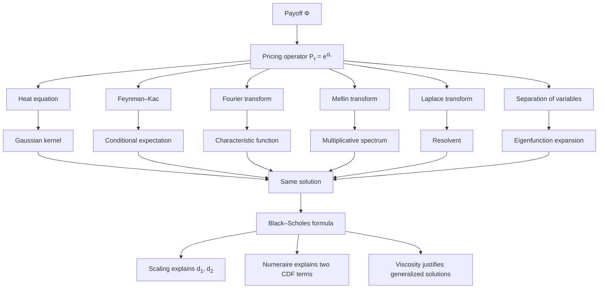
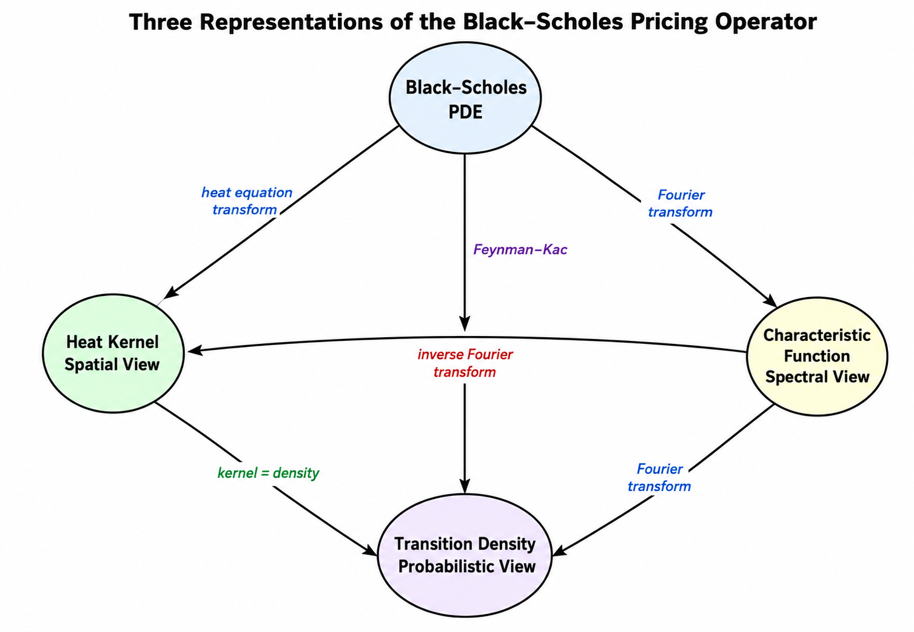

# Introduction --- Analytic Solutions of the Black--Scholes Equation

The Black--Scholes equation occupies a central place in mathematical finance as a rare example of a financial pricing problem whose underlying partial differential equation (PDE) is linear and admits a complete analytical solution. While the final pricing formula for a European option is compact, the mathematical structures underlying it are remarkably rich.

The central thesis of this section is simple:

> **There is one pricing operator. The chapter studies it through different mathematical representations.**

Each "method" below is not a separate derivation, but a different lens on the same object. The section is organized into a clear hierarchy:

* **Central spine:** Heat equation, Feynman--Kac, and Fourier methods. These three carry the conceptual weight and yield the pricing formula directly.
* **Secondary reinterpretations:** Similarity / scaling and change of numéraire, which re-explain the formula rather than re-derive it.
* **Advanced or alternative representations:** Mellin, Laplace, and separation of variables, which offer complementary viewpoints useful in specialized settings.
* **Theoretical foundation:** Viscosity solutions, which provide the rigorous framework when classical smoothness fails.

The section develops each layer in turn. Across them all, a single identity does most of the unifying work, stated next.

---

!!! note "Core Identity"
    Throughout this section, the **same object** appears under three different names. After the reduction to the heat equation on $(x,\tau)$,

    $$
    G(x,\tau) \;=\; p(x,\tau) \;=\; \frac{1}{2\pi}\int_{-\infty}^{\infty} e^{i\omega x}\,\varphi(\omega,\tau)\,d\omega
    $$

    where

    * $G(x,\tau)$ is the **heat kernel** of the transformed PDE,
    * $p(x,\tau)$ is the **transition density** of the underlying log-price (Feynman--Kac),
    * $\varphi(\omega,\tau)$ is the **characteristic function**, and the right-hand side is its inverse Fourier transform.

    These three are equivalent representations of the same object, under the standing assumptions of the chapter. Every later subsubsection --- heat kernel, probabilistic, Fourier, Mellin, Laplace --- can be read as a different way of computing or representing it. In more general settings (degenerate diffusions, jumps, boundary data) the distinctions between *distributional kernels*, *semigroup kernels*, *transition densities*, and *fundamental solutions* matter; here they coincide.

!!! note "On rigor"
    Different subsubsections of this chapter operate at different rigor levels: heuristic at the level of mechanisms and toy examples, analytic when the integrals are evaluated explicitly, probabilistic when the kernel is interpreted as a transition density, and semigroup/distributional when the operator viewpoint is invoked. Unless otherwise stated, formal manipulations can be justified in the standard semigroup/distribution frameworks; growth conditions, integrability, and contour assumptions are made tacitly where the construction is classical. The [§ Viscosity Solutions](viscosity_solutions.md) subsubsection supplies the rigorous foundation that ties the representations together when classical smoothness fails.

---

## Why So Many Methods?

At first glance, it may seem unnecessary to solve the same equation multiple times. However, the Black--Scholes model sits at the intersection of several mathematical disciplines:

* partial differential equations
* stochastic calculus
* harmonic analysis
* asymptotic and scaling methods

Each method simplifies a different part of the equation:

| Method            | Simplifies                             |
| ----------------- | -------------------------------------- |
| Heat equation     | removes drift and discounting          |
| Feynman--Kac      | replaces PDE with expectation          |
| Fourier transform | converts derivatives to multiplication |
| Mellin transform  | handles multiplicative structure in $S$ |
| Laplace transform | eliminates time dependence             |

Understanding these perspectives is not only intellectually valuable, but also practically important: modern models and numerical methods often rely on extending one of these viewpoints.

---

## Roadmap

The section is organized into four layers, in descending order of conceptual centrality. The hierarchy matters: the first layer is foundational, while the third is genuinely alternative rather than equally fundamental.

### 1. Central spine (the core methods)

These three subsections do the main work and yield the Black--Scholes formula directly:

* [§ Heat Equation](heat_equation.md) --- reduces the PDE to classical diffusion and exposes the Gaussian kernel.
* [§ Feynman--Kac](feynman_kac.md) --- gives the probabilistic representation as a discounted expectation.
* [§ Fourier Transform](fourier_transform.md) --- diagonalizes the operator in frequency space and underpins modern numerical schemes.

The Core Identity above ties these three together: they compute the same kernel.

### 2. Secondary reinterpretations

These do not solve the PDE again; they explain *why* the solution looks the way it does:

* [§ Similarity Solutions](similarity_solutions.md) --- explains the emergence of $d_1$ and $d_2$ through dimensional analysis.
* [§ Change of Numéraire](change_of_numeraire.md) --- reinterprets the two terms $\mathcal{N}(d_1)$ and $\mathcal{N}(d_2)$ as probabilities under different measures.

### 3. Advanced or alternative representations

These offer complementary viewpoints, useful in specialized contexts but not central to the core derivation:

* [§ Mellin Transform](mellin_transform.md) --- exploits the multiplicative structure of asset prices.
* [§ Laplace Transform](laplace_transform_in_time.md) --- removes time dependence and yields a resolvent representation.
* [§ Separation of Variables](separation_of_variables.md) --- reveals spectral structure on bounded domains.

### 4. Theoretical foundation

* [§ Viscosity Solutions](viscosity_solutions.md) --- provides the rigorous framework that justifies the PDE methods when classical smoothness fails.

---

## A Unifying View: One Operator, Three Representations

Every method in this section describes the same phenomenon: the payoff evolves under uncertainty over time, and the option value is the result of that evolution. All methods compute the same mathematical object:

> **the action of a linear pricing operator on the payoff function.**

We may write the option value abstractly as

$$
V(S,t) = \mathcal{P}_{\tau}[\Phi](S)
$$

where $\Phi$ is the payoff, $\tau = T - t$, and $\mathcal{P}_{\tau}$ is a linear operator that propagates the payoff backward in time.

Formally, one can write $\mathcal{P}_{\tau} = e^{\tau \mathcal{L}}$, where $\mathcal{L}$ is the Black--Scholes differential operator. This is the **semigroup structure** of pricing: composing two time intervals corresponds to applying the operator twice, just as $e^{(\tau_1+\tau_2)\mathcal{L}} = e^{\tau_1 \mathcal{L}} e^{\tau_2 \mathcal{L}}$.

The semigroup viewpoint is what makes the central representations consistent. The heat kernel and the inverse Fourier transform of $e^{\psi(\omega)\tau}$ are simply two ways of computing the same $e^{\tau\mathcal{L}}$. The Mellin and Laplace representations encountered later are further alternatives, useful in their own right, but conceptually downstream of this same exponential.

The apparent diversity of methods arises from representing this one operator in different coordinate systems.

---

### Diffusion Representation (Heat Equation)

After a suitable change of variables, the Black--Scholes PDE reduces to the heat equation. Its solution is given by convolution with the Gaussian kernel:

$$
\mathcal{P}_{\tau}[\Phi](x)
= \int_{-\infty}^{\infty} \Phi(z)\, G(x,\tau; z)\, dz
$$

where $G$ is the **heat kernel**.

Interpretation:

* Pricing is the **diffusion of the payoff**.
* Uncertainty spreads over time like heat.

---

### Probabilistic Representation (Feynman--Kac)

The same operator can be expressed as a conditional expectation:

$$
\mathcal{P}_{\tau}[\Phi](S)
= e^{-r\tau}\mathbb{E}^{\mathbb{Q}}[\Phi(S_T)\mid S_t = S]
$$

Interpretation:

* Pricing is the **expected discounted payoff**.
* The Gaussian kernel becomes the **transition density** of the log-price.

---

### Spectral Representation (Fourier Transform)

In frequency space, the operator becomes multiplication:

$$
\widehat{\mathcal{P}_{\tau}[\Phi]}(\omega)
= e^{\psi(\omega)\tau}\,\hat{\Phi}(\omega)
$$

where $\psi(\omega)$ is the characteristic exponent.

Interpretation:

* The operator is **diagonalized**.
* Evolution is encoded in the **characteristic function**.

---

### Core Equivalence

The three representations above are mathematically identical. The **heat kernel**, the **transition density**, and the **inverse Fourier transform of the characteristic function** are all the same object expressed differently. This is precisely the **Core Identity** boxed at the top of this introduction, restated here in operator form. Every subsequent subsubsection refers back to it.

<figure markdown="span">
  
  <figcaption markdown="span">**Figure 1:** The same pricing operator $\mathcal{P}_\tau = e^{\tau\mathcal{L}}$ acting on the payoff, viewed through three mathematically equivalent representations — convolution with the heat kernel $G$ ([§ Heat Equation](heat_equation.md)), risk-neutral expectation under the transition density $p_\tau$ ([§ Feynman–Kac](feynman_kac.md)), and Fourier diagonalization with eigenvalues $e^{\psi(\omega)\tau}$ ([§ Fourier Transform](fourier_transform.md)). The Core Identity $G = p_\tau = \mathcal{F}^{-1}[\phi_X(\,\cdot\,,\tau)]$ is the single fact that makes all three machineries mutually translatable.</figcaption>
</figure>

---

### Extensions and Structure

The three representations above form the central spine. The remaining subsections extend or reinterpret the same operator rather than add new fundamental pictures.

Alternative representations (useful in specialized contexts):

* **Mellin transform:** diagonalizes multiplicative structure in $S$.
* **Laplace transform:** removes time dependence and yields a resolvent.
* **Separation of variables:** reveals spectral structure on bounded domains.

Structural reinterpretations (which explain *why* the solution takes its form):

* **Scaling:** explains the emergence of $d_1, d_2$.
* **Numéraire change:** explains the decomposition into two probability terms.

Theoretical foundation:

* **Viscosity solutions:** ensure the operator is well-defined without smoothness.

---

## Final Insight

> **Option pricing is not about solving a PDE.
> It is about choosing the right representation of a single linear operator.**

Once this is understood:

* all methods become equivalent,
* their differences become conceptual rather than computational,
* and the structure of the Black--Scholes formula becomes inevitable.

The diversity of methods is therefore not a complication, but a reflection of the deep structure of the model.

## Exercises

**Exercise 1.** Summarize the main topics covered in this subsubsection in three to five sentences. Identify the key mathematical tools introduced.

??? success "Solution to Exercise 1"
    Answers will vary based on the specific content of the introductory subsubsection. A good summary should identify the central mathematical objects, the main theorems or results, and the connections to the broader theory developed in subsequent subsubsections.

---

**Exercise 2.** List two open questions or extensions mentioned in this introduction that are addressed in later subsubsections.

??? success "Solution to Exercise 2"
    Answers will vary. Students should identify specific claims or concepts that are stated without proof in the introduction and note where the full treatment appears later in the chapter.

