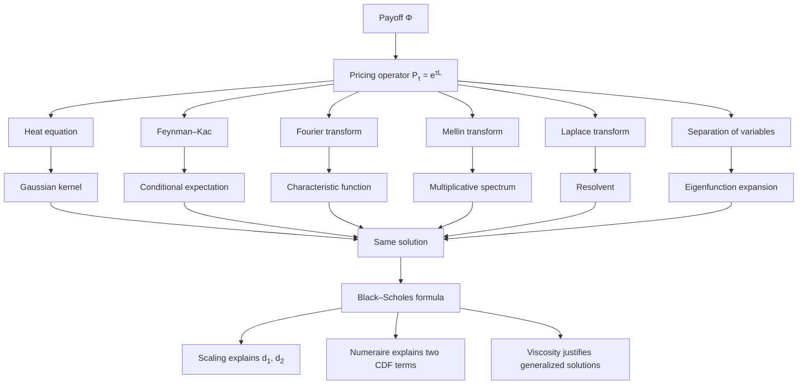

# Introduction --- Analytic Solutions of the Black--Scholes Equation

The Black--Scholes equation occupies a central place in mathematical finance as a rare example of a financial pricing problem whose underlying partial differential equation (PDE) is linear and admits a complete analytical solution. While the final pricing formula for a European option is compact, the mathematical structures underlying it are remarkably rich.

This chapter develops multiple analytic approaches to solving the Black--Scholes PDE, each revealing a different facet of the model:

* **Diffusion viewpoint (heat equation):** option prices arise from the propagation of uncertainty, analogous to heat flow.
* **Probabilistic viewpoint (Feynman--Kac):** prices are expectations under a risk-neutral measure.
* **Spectral viewpoint (Fourier methods):** the PDE can be diagonalized in frequency space, turning differential operators into algebraic ones.

Although all approaches ultimately lead to the same pricing formula, they are not redundant. Each method provides distinct insights:

* The **heat equation transformation** exposes the Gaussian structure and connects option pricing to classical diffusion.
* The **Feynman--Kac representation** establishes the deep link between PDEs and stochastic processes.
* The **Fourier transform** reveals the role of characteristic functions and forms the foundation of modern computational methods.

Beyond these core techniques, the chapter also explores several alternative methods:

* **Separation of variables**, which highlights spectral decompositions and is particularly useful on bounded domains.
* **Mellin transforms**, which exploit the multiplicative structure of asset prices.
* **Laplace transforms in time**, which convert the PDE into an ordinary differential equation in the spatial variable.

Finally, we examine broader structural perspectives:

* **Scaling and similarity**, which explain the emergence of the dimensionless variables $d_1$ and $d_2$.
* **Change of numeraire**, which interprets pricing formulas through measure changes.
* **Viscosity solutions**, which provide the rigorous framework required when classical smoothness fails.

---

## Why So Many Methods?

At first glance, it may seem unnecessary to solve the same equation multiple times. However, the Black--Scholes model sits at the intersection of several mathematical disciplines:

* partial differential equations
* stochastic calculus
* harmonic analysis
* asymptotic and scaling methods

Each method simplifies a different part of the equation:

| Method            | Simplifies                             |
| ----------------- | -------------------------------------- |
| Heat equation     | removes drift and discounting          |
| Feynman--Kac      | replaces PDE with expectation          |
| Fourier transform | converts derivatives to multiplication |
| Mellin transform  | handles multiplicative structure in $S$ |
| Laplace transform | eliminates time dependence             |

Understanding these perspectives is not only intellectually valuable, but also practically important: modern models and numerical methods often rely on extending one of these viewpoints.

---

## Roadmap

The chapter is organized into three layers:

### 1. Core analytic solutions

These form the backbone of the theory:

* Heat equation transformation
* Feynman--Kac representation
* Fourier transform methods

### 2. Alternative transform and spectral methods

These provide complementary techniques and deeper insight:

* Separation of variables
* Mellin transform
* Laplace transform

### 3. Structural and theoretical perspectives

These do not solve the Black--Scholes PDE directly. Instead, they illuminate the structure of the solution already obtained:

* **Similarity and scaling** explains *why* the formula depends on $S/K$, $\sigma\sqrt{\tau}$, and $r\tau$ through dimensional analysis.
* **Change of numeraire** reinterprets the two terms $\mathcal{N}(d_1)$ and $\mathcal{N}(d_2)$ as probabilities under different measures.
* **Viscosity solutions** provide the rigorous foundation that justifies the PDE methods when classical smoothness fails.

---

## A Unifying View: One Operator, Three Representations

Every method in this chapter describes the same phenomenon: the payoff evolves under uncertainty over time, and the option value is the result of that evolution. All methods compute the same mathematical object:

> **the action of a linear pricing operator on the payoff function.**

We may write the option value abstractly as

$$
V(S,t) = \mathcal{P}_{\tau}[\Phi](S)
$$

where $\Phi$ is the payoff, $\tau = T - t$, and $\mathcal{P}_{\tau}$ is a linear operator that propagates the payoff backward in time. Formally, $\mathcal{P}_{\tau} = e^{\tau \mathcal{L}}$, where $\mathcal{L}$ is the Black--Scholes differential operator. This **semigroup structure** is what makes the operator representations below consistent: the Fourier exponent $e^{\psi(\omega)\tau}$, the Mellin exponent $e^{-\Lambda(s)\tau}$, and the heat kernel are all manifestations of $e^{\tau \mathcal{L}}$ in different coordinate systems.

The apparent diversity of methods arises from representing this operator in different ways.

---

### Diffusion Representation (Heat Equation)

After a suitable change of variables, the Black--Scholes PDE reduces to the heat equation. Its solution is given by convolution with the Gaussian kernel:

$$
\mathcal{P}_{\tau}[\Phi](x)
= \int_{-\infty}^{\infty} \Phi(z)\, G(x,\tau; z)\, dz
$$

where $G$ is the **heat kernel**.

Interpretation:

* Pricing is the **diffusion of the payoff**.
* Uncertainty spreads over time like heat.

---

### Probabilistic Representation (Feynman--Kac)

The same operator can be expressed as a conditional expectation:

$$
\mathcal{P}_{\tau}[\Phi](S)
= e^{-r\tau}\mathbb{E}^{\mathbb{Q}}[\Phi(S_T)\mid S_t = S]
$$

Interpretation:

* Pricing is the **expected discounted payoff**.
* The Gaussian kernel becomes the **transition density** of the log-price.

---

### Spectral Representation (Fourier Transform)

In frequency space, the operator becomes multiplication:

$$
\widehat{\mathcal{P}_{\tau}[\Phi]}(\omega)
= e^{\psi(\omega)\tau}\,\hat{\Phi}(\omega)
$$

where $\psi(\omega)$ is the characteristic exponent.

Interpretation:

* The operator is **diagonalized**.
* Evolution is encoded in the **characteristic function**.

---

### Core Equivalence

These representations are mathematically identical:

* The **heat kernel**
* The **transition density**
* The **inverse Fourier transform of the characteristic function**

are all the same object expressed differently.

> **Heat kernel = transition density = Fourier-inverted characteristic function**

---

### Extensions and Structure

The remaining methods extend or interpret this operator:

* **Mellin transform:** diagonalizes multiplicative structure in $S$
* **Laplace transform:** removes time dependence
* **Separation of variables:** reveals spectral structure on bounded domains

Structural perspectives explain *why* the solution takes its form:

* **Scaling:** explains the emergence of $d_1, d_2$
* **Numeraire change:** explains the decomposition into two probability terms
* **Viscosity solutions:** ensure the operator is well-defined without smoothness

---

## Final Insight

> **Option pricing is not about solving a PDE.
> It is about choosing the right representation of a single linear operator.**

Once this is understood:

* all methods become equivalent,
* their differences become conceptual rather than computational,
* and the structure of the Black--Scholes formula becomes inevitable.

The diversity of methods is therefore not a complication, but a reflection of the deep structure of the model.
