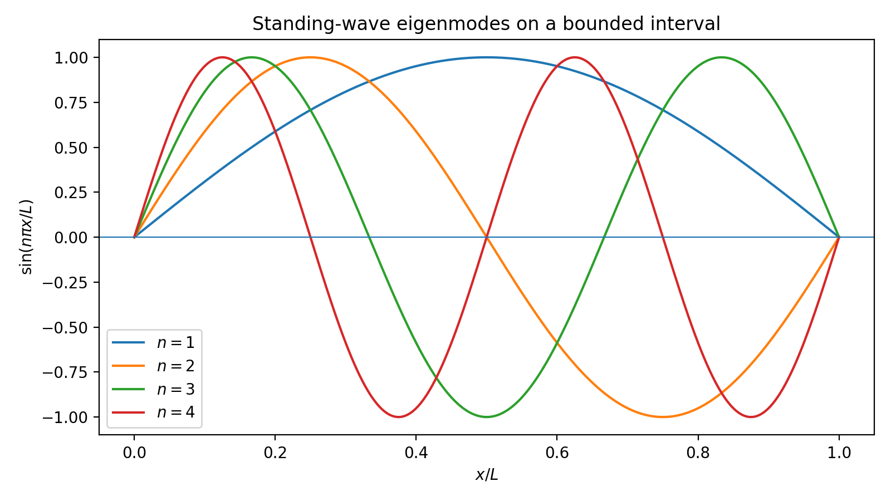
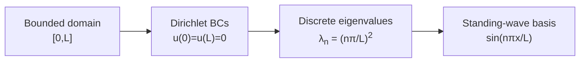
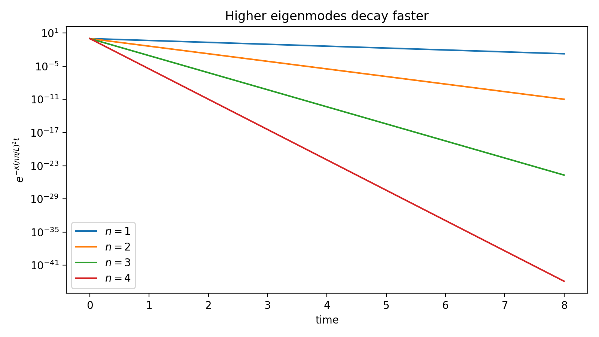
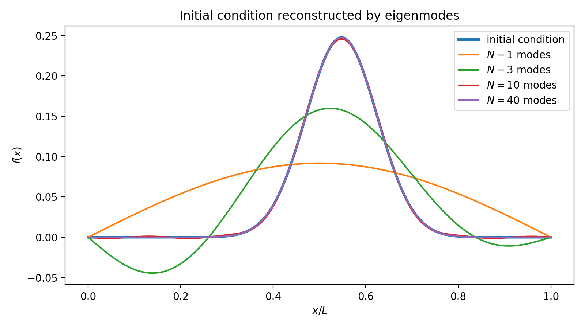
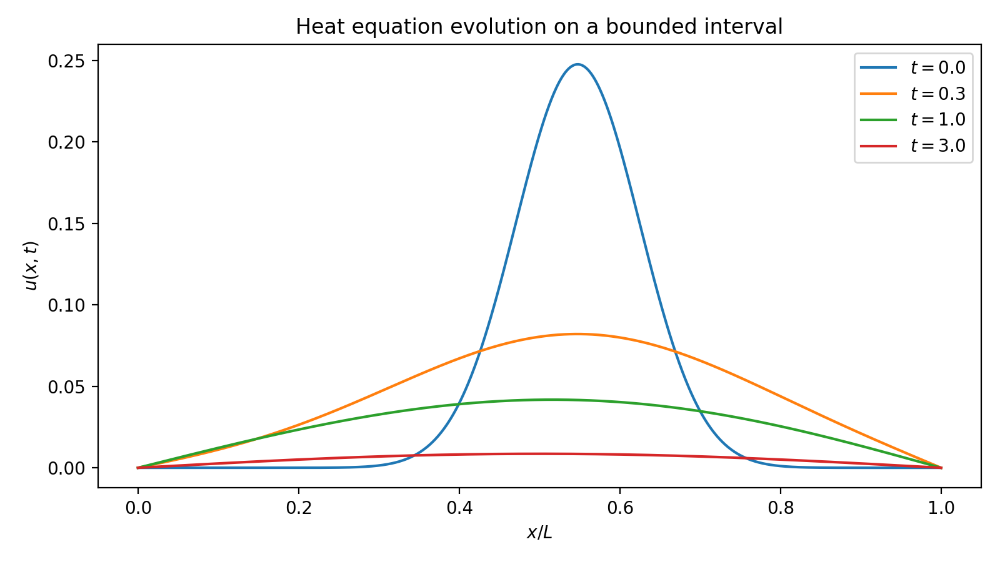
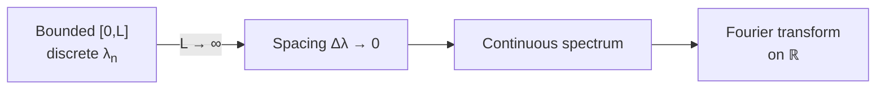
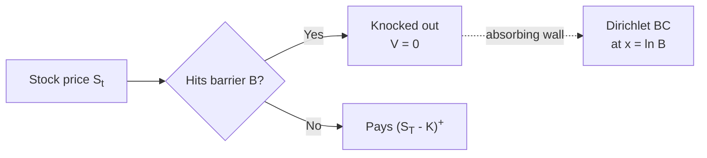
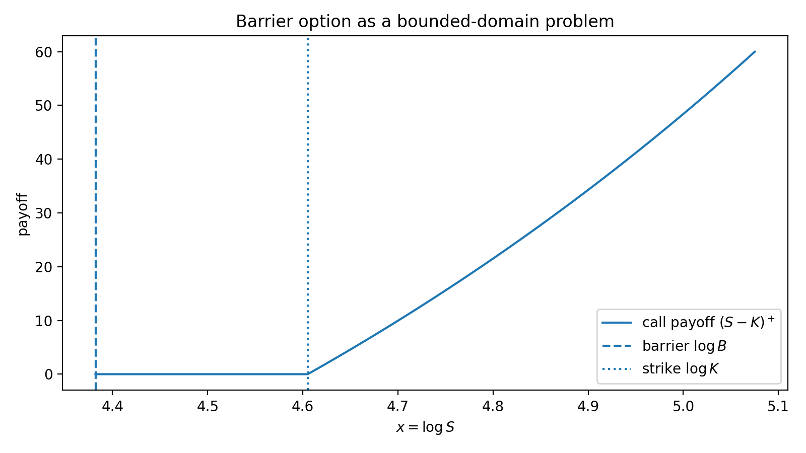
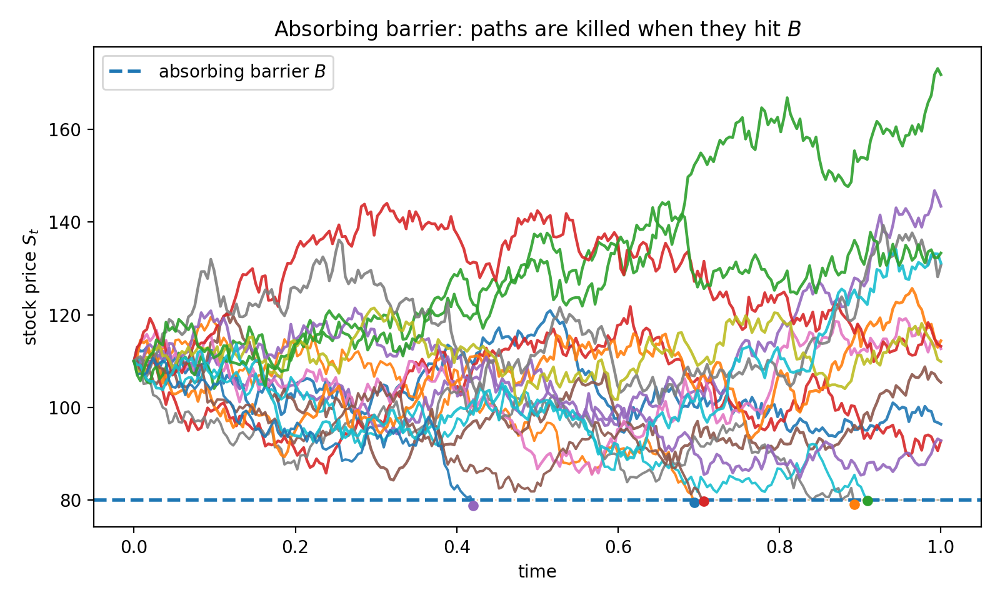

# Separation of Variables

Separation of variables is **not** the natural method for vanilla Black–Scholes on the infinite line — there the Fourier transform (see [§ Fourier Transform](fourier_transform.md)) dominates. Separation becomes essential when the pricing domain is **bounded**: barrier options impose Dirichlet conditions at one or both ends of the log-price interval, and these boundaries quantize the spectrum of the spatial operator into a discrete sequence of eigenmodes. The whole subsection is built around this single idea — **boundaries quantize the spectrum** — and works it out first on a toy heat equation, then on the transformed Black–Scholes PDE, and finally on a barrier option.

---

## 1. The Toy Problem: Heat Equation on an Interval

Before touching Black–Scholes, we work the simplest possible bounded problem. Everything that follows — eigenmodes, exponential decay, the Fourier limit, the barrier picture — is already visible here.

### 1.1 Setup

Consider

$$
u_t = \kappa\, u_{xx}, \qquad x \in [0, L], \qquad t > 0
$$

with homogeneous Dirichlet boundary conditions

$$
u(0, t) = u(L, t) = 0
$$

and initial data $u(x, 0) = f(x)$.

Read this physically: heat in a thin rod of length $L$, both ends held at temperature $0$. The rod cannot store an arbitrary temperature profile — the boundaries select a privileged family of shapes.

### 1.2 Separation Ansatz

Look for a product solution $u(x, t) = X(x)\, T(t)$. Substituting and dividing by $X T$:

$$
\frac{T'(t)}{\kappa\, T(t)} = \frac{X''(x)}{X(x)} = -\lambda
$$

Both sides equal a single constant $-\lambda$ because the left depends only on $t$ and the right only on $x$. This gives two ODEs:

$$
T'(t) = -\kappa \lambda\, T(t), \qquad X''(x) + \lambda\, X(x) = 0
$$

### 1.3 The Spatial Eigenvalue Problem

The spatial ODE with $X(0) = X(L) = 0$ admits non-trivial solutions only for discrete values

$$
\lambda_n = \left(\frac{n\pi}{L}\right)^2, \qquad n = 1, 2, 3, \ldots
$$

with corresponding eigenfunctions

$$
X_n(x) = \sin\!\left(\frac{n\pi x}{L}\right)
$$

<figure markdown="span">
  
  <figcaption markdown="span">**Figure 1:** First four eigenmodes $X_n(x) = \sin(n\pi x / L)$ on $[0,L]$. Each one vanishes at both endpoints (as the Dirichlet condition demands) and carries $n-1$ interior zeros. The mode count $n$ is exactly the number of half-wavelengths fitted into the interval — this is *why* the spectrum is discrete: the geometry of $[0,L]$ admits only sinusoids that close cleanly at both ends.</figcaption>
</figure>

These are the **standing waves** of the rod. The pair $(L, X_n)$ encodes everything geometric:

- $X_1$ has no interior zero — the smoothest mode.
- $X_n$ has $n - 1$ interior zeros — successively more oscillatory.
- All modes vanish at the ends, as required by the boundary conditions.



*Why boundaries quantize: a sinusoid on $[0,L]$ vanishing at both ends must fit a half-integer number of wavelengths, forcing $kL = n\pi$.*

### 1.4 Temporal Decay

The time ODE $T'_n = -\kappa\lambda_n T_n$ gives

$$
T_n(t) = e^{-\kappa\lambda_n t} = \exp\!\left[-\kappa\left(\frac{n\pi}{L}\right)^2 t\right]
$$

Higher modes decay **dramatically** faster than lower ones. Doubling $n$ quadruples the decay rate.

<figure markdown="span">
  
  <figcaption markdown="span">**Figure 2:** Log-scale plot of the temporal factor $T_n(t) = \exp[-\kappa(n\pi/L)^2 t]$ for $n = 1, 2, 3, 4$ with $\kappa = 0.08$, $L = 1$. The slope on a log scale is $-\kappa(n\pi/L)^2$, which grows like $n^2$ — so mode $n = 4$ decays sixteen times as fast as mode $n = 1$. After a short transient, only the principal mode $X_1$ survives in any appreciable amount: this is the quantitative form of "the bounded domain forgets sharp data quickly."</figcaption>
</figure>

This single fact governs the long-time behavior of every bounded-domain heat or pricing problem:

!!! tip "Mode hierarchy"
    For $t \gg L^2 / (\kappa\pi^2)$ the first mode dominates and the solution looks essentially like $c_1 \sin(\pi x / L) e^{-\kappa\pi^2 t / L^2}$. Sharp features in the initial data — kinks, jumps, oscillations — are encoded in the high-$n$ coefficients, which the operator forgets exponentially fast.

### 1.5 General Solution and Coefficient Formula

Linear superposition and orthogonality of the sines give

$$
u(x, t) = \sum_{n=1}^{\infty} c_n \sin\!\left(\frac{n\pi x}{L}\right) e^{-\kappa(n\pi/L)^2 t}
$$

with coefficients fixed by the initial data:

$$
c_n = \frac{2}{L}\int_0^L f(x) \sin\!\left(\frac{n\pi x}{L}\right) dx
$$

Decomposing $f$ into the eigenmode basis is the **bounded-domain analogue of Fourier analysis**: the orthogonality $\int_0^L \sin(m\pi x/L)\sin(n\pi x/L)\,dx = (L/2)\delta_{mn}$ plays exactly the role of $\int e^{i(\omega-\omega')x}dx = 2\pi\delta(\omega - \omega')$ for the transform on $\mathbb{R}$.

---

## 2. Geometric Interpretation: What the Eigenmodes Show

The toy problem rewards a careful look at what the modes *mean*. Three observations carry directly to the barrier-option setting.

### 2.1 Initial Condition as a Sum of Modes

Any continuous $f$ on $[0,L]$ with $f(0) = f(L) = 0$ decomposes uniquely into sines:

$$
f(x) = \sum_{n=1}^\infty c_n \sin\!\left(\frac{n\pi x}{L}\right)
$$

A localized bump near $x = L/2$ requires many modes; a smooth half-sine requires essentially only $X_1$. Sharpness in space ↔ slow decay of $|c_n|$ in $n$.

<figure markdown="span">
  
  <figcaption markdown="span">**Figure 3:** Partial-sum reconstruction of an asymmetric, localized initial condition $f(x) = e^{-80(x-0.55)^2} x(1-x)$ using $N = 1, 3, 10, 40$ sine modes. With one mode the approximation captures only the overall hump; three modes recover the asymmetry; ten modes are visually indistinguishable from the target; forty modes are pointwise exact. The number of modes needed to resolve $f$ is set by how sharp $f$ is, not by the size of the interval — this is the spatial-side meaning of the $c_n$ decay rate.</figcaption>
</figure>

### 2.2 First Mode = Long-Time Shape

For any payoff, after enough time the surviving profile is a multiple of $X_1$. This is the **principal eigenmode** of the system — the smoothest function compatible with the boundary conditions, and the one that dies slowest. Everything else is a transient.

<figure markdown="span">
  
  <figcaption markdown="span">**Figure 4:** Time evolution of the bounded-domain heat equation starting from the asymmetric bump of Figure 3, plotted at $t = 0, 0.3, 1.0, 3.0$ ($\kappa = 0.08$, $L = 1$, $N = 80$ modes). The localized peak is washed out almost immediately as the high-frequency components die off; by $t = 3$ the profile is a clean half-sine — a scalar multiple of the principal eigenmode $X_1$. The long-time shape is determined entirely by the geometry of the boundary conditions; the initial data only sets the amplitude.</figcaption>
</figure>

### 2.3 Higher Modes = Short-Time Corrections

The modes with $n \geq 2$ control how the solution adjusts from the initial profile to the principal eigenmode. They are oscillatory in space and decay rapidly in time:

$$
\frac{T_n(t)}{T_1(t)} = e^{-\kappa\pi^2(n^2 - 1) t / L^2}
$$

is already $e^{-3\kappa\pi^2 t / L^2}$ for $n = 2$. Short-time, high-frequency, localized features are exactly the regime where many modes contribute and the spectral picture is most useful.

---

## 3. The Infinite-Domain Limit: How Fourier Emerges

Push the boundaries apart, $L \to \infty$. The natural continuous parameter is the **wavenumber** $k_n = n\pi/L$, with spacing $\Delta k = \pi / L$. As $L \to \infty$, the spacing $\Delta k$ collapses to zero, and the discrete index $n$ relaxes into a continuous variable $k \in \mathbb{R}$; the eigenvalue itself becomes $\lambda(k) = \tfrac{1}{2}\sigma^2 k^2$ (or $\kappa k^2$ for the heat equation), so

$$
\Delta\lambda_n = \lambda_{n+1} - \lambda_n \sim 2k_n\, \Delta k \sim \frac{2n\pi^2}{L^2}
$$

also collapses to zero. The sum becomes an integral, the sine basis becomes complex exponentials, and the discrete Fourier *series* of the bounded interval becomes the Fourier *transform* of the line:

$$
\sum_n c_n \sin\!\left(\frac{n\pi x}{L}\right) \quad\xrightarrow{L\to\infty}\quad \int_{-\infty}^\infty \hat f(k)\, e^{i k x}\, dk
$$



*Bounded-domain separation and the Fourier transform are two regimes of the same spectral construction.* The discrete spectrum is genuine new mathematics precisely because the bounded domain produces it; on the line, the construction degenerates into the integral representation of [§ Fourier Transform](fourier_transform.md).

---

## 4. Barrier Options: The Natural Bounded Domain

Now the payoff. A **down-and-out call** with barrier $B$ pays $(S_T - K)^+$ at maturity *provided* the underlying never touches $B$ on $[0, T]$. If it does, the option is killed.

In log-price $x = \ln S$, the surviving paths live on the half-line $x > x_B := \ln B$. Truncating at a large upper level $x_{\max}$ gives the finite interval

$$
x \in [x_B,\, x_{\max}]
$$

with the boundary conditions

- $V(x_B, \tau) = 0$ — knocked out at the barrier,
- $V(x_{\max}, \tau) =$ deep-ITM asymptotic (e.g.\ $e^{x_{\max}} - K e^{-r\tau}$).

This is exactly the bounded setup of §1, only with the Black–Scholes operator replacing the simple Laplacian. **Barrier options are the canonical reason separation of variables earns its place in option pricing.**



*The barrier acts as an absorbing wall: paths that touch it are removed from the ensemble, exactly as a Dirichlet condition removes amplitude from the eigenfunction expansion.*

<figure markdown="span">
  
  <figcaption markdown="span">**Figure 5:** Down-and-out call payoff $(S - K)^+$ plotted in log-price space $x = \log S$, with barrier $B = 80$, strike $K = 100$ and upper truncation $S_{\max} = 160$. The dashed vertical line at $x = \log B$ is the absorbing wall — the Dirichlet boundary $V(x_B, \tau) = 0$ — and the dotted vertical line at $x = \log K$ marks the kink in the payoff. The geometry of the interval $[\log B, \log S_{\max}]$ is what the spatial operator's eigenmodes must respect; it is *this* picture, transplanted from the toy heat equation above, that justifies the whole apparatus.</figcaption>
</figure>

<figure markdown="span">
  
  <figcaption markdown="span">**Figure 6:** Eighteen simulated GBM paths with $S_0 = 110$, $\mu = 0.03$, $\sigma = 0.25$, $T = 1$, and barrier $B = 80$ (dashed horizontal line). Paths that touch $B$ are killed at the first-passage time (marker); the surviving paths deliver the payoff at maturity. This is the trajectory-level meaning of the Dirichlet condition $V(B, \tau) = 0$: the value at the barrier is zero because hitting the barrier terminates the contract. In a finite truncated domain, the surviving density is represented by the discrete eigenmodes of §6; on the half-line, the analogous representation has a continuous spectrum.</figcaption>
</figure>

---

## 5. What the Barrier Eigenmodes Will Look Like

Before doing the BS-specific eigenvalue calculation in §6, we can already predict the qualitative shape of the barrier-option solution by lifting the toy heat-equation observations of §§1–2 directly to the bounded barrier interval. Sturm–Liouville theory in §6 will *confirm* what the analogy already strongly suggests; getting the intuition first makes the formal machinery feel inevitable rather than imposed.

The toy heat equation on $[0, L]$ produced eigenmodes $X_n^{\text{toy}}(x) = \sin(n\pi x/L)$ with eigenvalues $\lambda_n^{\text{toy}} = (n\pi/L)^2$. The barrier-option problem replaces the toy Laplacian with the BS spatial operator on $[x_B, x_{\max}]$, but the *qualitative* features of the eigenmode sequence — first mode smoothest, higher modes oscillatory, exponential decay of mode $n$ at rate $\lambda_n$ — are governed by the *boundary geometry* alone, not by the specific operator. We can read off three observations now and verify them in §6.

### 5.1 First Mode: Long-Maturity Behavior

For large $\tau$, only the slowest-decaying mode survives. Writing the eventual eigenfunction expansion as $V(x, \tau) = \sum_n c_n X_n(x) e^{-\lambda_n \tau}$:

$$
V(x, \tau) \approx c_1 X_1(x)\, e^{-\lambda_1 \tau} \qquad \text{for } \tau \gg 1/(\lambda_2 - \lambda_1)
$$

A single shape, exponentially attenuated. The eigenvalue $\lambda_1$ is the **survival rate** of the option value: long-maturity barrier prices decay like $e^{-\lambda_1 \tau}$. The first mode is the smoothest profile compatible with vanishing at the barrier — supported in the interior, away from both boundaries — by direct analogy with the half-sine $\sin(\pi x/L)$ of §1.

### 5.2 Higher Modes: Short-Time Corrections

The high-$n$ modes carry the response to **sharp** features in the payoff — the kink at $S = K$ for a call, jumps in a digital, etc. By analogy with §1's sine modes, they oscillate in space with $n - 1$ interior nodes and decay in time as $e^{-\lambda_n \tau}$. Near $\tau = 0$, many modes contribute and the partial sum gives the **Gibbs-type** behavior expected near a non-smooth payoff; for $\tau \gtrsim 1/\lambda_2$ they have effectively vanished.

### 5.3 Mode Hierarchy and Time-to-Forget

In the toy problem $\lambda_n / \lambda_1 = n^2$; for the BS barrier operator the ratio still grows like $n^2$ (with a constant-coefficient perturbation). Mode $n$ is irrelevant once

$$
\tau \gtrsim \frac{1}{\lambda_n - \lambda_1}
$$

This is a quantitative version of "the bounded domain forgets sharp data quickly." Section 6 below makes the eigenvalue sequence $\{\lambda_n\}$ precise for the BS operator.

---

## 6. Separation on the Transformed Black–Scholes PDE

We now do the explicit construction the previous subsection presumed. The log-price change of variables ([§ Heat Equation](heat_equation.md)) turns the Black–Scholes PDE into the constant-coefficient form

$$
\frac{\partial V}{\partial \tau} = \frac{\sigma^2}{2}\frac{\partial^2 V}{\partial x^2} + \left(r - \frac{\sigma^2}{2}\right)\frac{\partial V}{\partial x} - rV
$$

on $x \in [x_B, x_{\max}]$ with the boundary conditions of §4 and terminal $V(x, 0) = \Phi(e^x)$ (after time reversal $\tau = T - t$).

### 6.1 Ansatz and Two ODEs

Setting $V(x, \tau) = X(x)\, T(\tau)$:

$$
\frac{T'(\tau)}{T(\tau)} = \frac{\frac{\sigma^2}{2} X''(x) + (r - \frac{\sigma^2}{2}) X'(x) - r X(x)}{X(x)} = -\lambda
$$

So $T(\tau) = e^{-\lambda\tau}$ and

$$
\frac{\sigma^2}{2}X'' + \left(r - \frac{\sigma^2}{2}\right) X' + (\lambda - r) X = 0, \qquad X(x_B) = X(x_{\max}) = 0
$$

### 6.2 Sturm–Liouville Form

The spatial operator carries both a second-derivative and a first-derivative term, so it is not symmetric in the unweighted $L^2$ inner product. The standard remedy is a **gauge transformation** $X(x) = e^{-\alpha x} Y(x)$ for a suitable constant $\alpha$, chosen to eliminate the first-derivative term. This reduces the eigenvalue problem to a self-adjoint second-order operator on $[x_B, x_{\max}]$ with Dirichlet boundary conditions — the canonical setting for Sturm–Liouville theory. Self-adjointness is what guarantees real eigenvalues, orthogonal eigenfunctions, and completeness — the structural properties that make spectral expansions possible.

Sturm–Liouville theory then guarantees exactly the eigenvalue picture used qualitatively in §5:

- a real, discrete, positive, increasing spectrum $0 < \lambda_1 < \lambda_2 < \cdots \to \infty$;
- orthogonal eigenfunctions $\{X_n\}$ complete in the appropriate weighted $L^2$;
- exponential damping $e^{-\lambda_n \tau}$ of the $n$-th component.

We do not need the full functional-analytic machinery — only the qualitative statement above, which underwrites §5's intuition and gives the picture of §1.4 in the present setting.

### 6.3 Eigenfunction Expansion

The full pricing formula is

$$
V(x, \tau) = \sum_{n=1}^\infty c_n\, X_n(x)\, e^{-\lambda_n \tau}, \qquad c_n = \frac{\langle \Phi(e^\cdot), X_n\rangle}{\langle X_n, X_n\rangle}
$$

with the inner product appropriate to the self-adjoint form of §6.2. Truncating at $N$ modes yields an error bounded by

$$
\big\lVert V - V_N \big\rVert \le C\, e^{-\lambda_{N+1} \tau}
$$

so convergence is exponential in $\tau$ — fast for moderate-to-long maturities, slow for $\tau$ near $0$. The qualitative observations of §5 are now confirmed quantitatively: first-mode dominance for $\tau \gg 1/(\lambda_2 - \lambda_1)$, Gibbs-type partial-sum behavior near $\tau = 0$, and the time-to-forget formula $\tau \gtrsim 1/(\lambda_n - \lambda_1)$ for mode $n$ to be negligible.

---

## 7. Method of Images: A Spectral Alternative

For a down-and-out call on the **half-line** $[B, \infty)$ — no upper truncation — separation produces a continuous spectrum (no second boundary) and the eigenfunction sum collapses to a closed form. Schematically, that closed form is the method of images:

$$
V_{\text{DO}}(S, t) = C_{\text{BS}}(S, t) - \left(\frac{B}{S}\right)^{p} C_{\text{BS}}\!\left(\frac{B^2}{S}, t\right)
$$

with a power $p$ determined by the drift of the log-price dynamics. The reflected term cancels the original on $S = B$, enforcing the Dirichlet condition.

!!! warning "Schematic only"
    The exact form of the exponent $p$ and the strike-reflection structure depend on the dividend yield, on the ordering $B \lessgtr K$, and on the precise rebate convention. The expression above is shown only to illustrate the *spectral idea* of cancellation at the barrier. A correct, dividend-aware closed-form formula belongs in a dedicated barrier-options subsection and should not be lifted from here as-is.

Conceptually:

!!! info "Two faces of the same boundary condition"
    Separation of variables enforces $V(x_B, \tau) = 0$ by choosing **eigenfunctions** that vanish there. The method of images enforces the same condition by **superposing** a reflected solution that cancels the original at the barrier. Both are spectral constructions; the method of images is the closed-form sibling that is available when the geometry is simple (single barrier, no upper truncation, constant coefficients).

For a **double-barrier** problem the closed form via images becomes an infinite sum of reflections — equivalent to, and no simpler than, the eigenfunction expansion.

---

## 8. Two Supporting Cases

### 8.1 Box Spread on a Bounded Interval

For $S \in [S_L, S_U]$ with constant boundary values $V(S_L, t) = A$ and $V(S_U, t) = B$, subtract the linear interpolant

$$
W(S, t) = V(S, t) - A - \frac{B - A}{S_U - S_L}(S - S_L)
$$

so $W$ satisfies homogeneous Dirichlet conditions and admits the standard eigenfunction expansion. The constant piece carries the "boundary data"; the eigenfunctions handle the dynamics.

### 8.2 Multi-Asset Options

For two assets $(S_1, S_2)$ the cross-derivative term in the Black–Scholes PDE prevents separation unless the correlation $\rho = 0$. In the uncorrelated case,

$$
V(S_1, S_2, t) = \sum_{m, n} c_{mn}\, X_m(S_1)\, Y_n(S_2)\, e^{-(\lambda_m + \lambda_n - r)(T - t)}
$$

For $\rho \neq 0$, diagonalize the covariance matrix first (principal components) and then separate in the rotated coordinates.

---

## 9. Computation

The pieces of a numerical scheme are:

- **Eigenvalues** — either by the shooting method (guess $\lambda$, integrate the ODE, match the right boundary) or by finite-difference discretization, yielding a matrix eigenvalue problem.
- **Coefficients** — projection integrals $c_n = \langle \Phi, X_n\rangle / \langle X_n, X_n\rangle$ evaluated by Gauss quadrature.
- **Truncation** — keep $N$ modes; error bound $\sim e^{-\lambda_{N+1}\tau}$. For $\tau$ near zero, increase $N$ or fall back to a finite-difference solver near maturity.

The mode count $N$ needed for a given accuracy scales like $\tau^{-1/2}$ near $\tau = 0$ and is essentially $1$–$5$ for $\tau$ at the year scale.

---

## 10. Where This Sits Among the Solution Representations

The pricing semigroup $e^{\tau\mathcal{L}}$ from [§ Introduction](intro.md) admits four equivalent representations, and separation of variables provides one of them — the **spectral** form:

$$
e^{\tau\mathcal{L}} V_0 = \begin{cases}
\displaystyle\sum_n e^{-\tau\lambda_n} \langle V_0, X_n\rangle X_n & \text{bounded domain (this subsection)} \\[4pt]
\displaystyle\int e^{-\tau\lambda} \langle V_0, \phi_\lambda\rangle \phi_\lambda\, d\lambda & \text{unbounded domain ([§ Fourier Transform](fourier_transform.md))}
\end{cases}
$$

The kernel form $\int G(x, y, \tau) V_0(y)\, dy$ is the subject of [§ Heat Equation](heat_equation.md); the probabilistic form $\mathbb{E}[V_0(X_\tau)]$ is the subject of [§ Feynman–Kac](feynman_kac.md). Separation of variables is the representation that turns barrier-option pricing into a **spectral problem on a bounded domain** — and on that domain it is genuinely the right tool.

---

## 11. Summary

| Regime | Spectrum | Right tool |
|---|---|---|
| Bounded $[x_B, x_{\max}]$, homogeneous BCs | Discrete $\{\lambda_n\}$ | **Eigenfunction expansion (this subsection)** |
| Unbounded $\mathbb{R}$ | Continuous | Fourier transform |
| Single barrier, half-line | Continuous with boundary constraint | Method of images / sine transform |
| Path-dependent / non-Markovian | — | Feynman–Kac + Monte Carlo |

The structural lesson is the one stated at the top of the subsection: **boundaries quantize the spectrum**. Vanilla options live on $\mathbb{R}$ and call for a continuous spectrum (Fourier). Barrier options live on a finite interval and call for a discrete one (separation of variables). The two are the same construction, separated only by the geometry of the state space $\square$

---

## Appendix: Figure-Generation Script

All six figures above were produced by a single script. Captions and discussion are in the body of the subsection; the script is collected here so the chapter narrative is not interrupted by code.

??? example "Code for Figures 1–6"
    ```python
    """Figures for Separation of Variables (§6.6).

    Produces six PNGs in ./img/ next to separation_of_variables.md.
    Run from the MkDocs project root so the output directory resolves correctly.
    """

    import numpy as np
    import matplotlib.pyplot as plt
    from pathlib import Path

    OUT = Path("./docs/ch06/bs_pde_analytic_solution/img")
    OUT.mkdir(parents=True, exist_ok=True)

    L = 1.0
    kappa = 0.08
    x = np.linspace(0, L, 1000)


    def f(x):
        return np.exp(-80 * (x - 0.55) ** 2) * x * (1 - x)


    # === Figure 1: standing-wave eigenmodes ===

    plt.figure(figsize=(8, 4.5))
    for n in [1, 2, 3, 4]:
        plt.plot(x, np.sin(n * np.pi * x / L), label=rf"$n={n}$")
    plt.axhline(0, linewidth=0.8)
    plt.title("Standing-wave eigenmodes on a bounded interval")
    plt.xlabel(r"$x/L$")
    plt.ylabel(r"$\sin(n\pi x/L)$")
    plt.legend()
    plt.tight_layout()
    plt.savefig(OUT / "separation_eigenmodes.png", dpi=200)
    plt.close()


    # === Figure 2: decay hierarchy of modes ===

    t = np.linspace(0, 8, 500)
    plt.figure(figsize=(8, 4.5))
    for n in [1, 2, 3, 4]:
        lam = (n * np.pi / L) ** 2
        plt.plot(t, np.exp(-kappa * lam * t), label=rf"$n={n}$")
    plt.title("Higher eigenmodes decay faster")
    plt.xlabel("time")
    plt.ylabel(r"$e^{-\kappa(n\pi/L)^2t}$")
    plt.yscale("log")
    plt.legend()
    plt.tight_layout()
    plt.savefig(OUT / "separation_mode_decay.png", dpi=200)
    plt.close()


    # === Figure 3: initial condition and sine-series reconstruction ===

    fx = f(x)
    plt.figure(figsize=(8, 4.5))
    plt.plot(x, fx, linewidth=2.5, label="initial condition")
    for N in [1, 3, 10, 40]:
        approx = np.zeros_like(x)
        for n in range(1, N + 1):
            basis = np.sin(n * np.pi * x / L)
            cn = 2 / L * np.trapz(fx * basis, x)
            approx += cn * basis
        plt.plot(x, approx, label=rf"$N={N}$ modes")
    plt.title("Initial condition reconstructed by eigenmodes")
    plt.xlabel(r"$x/L$")
    plt.ylabel(r"$f(x)$")
    plt.legend()
    plt.tight_layout()
    plt.savefig(OUT / "separation_initial_decomposition.png", dpi=200)
    plt.close()


    # === Figure 4: heat evolution to first-mode dominance ===

    N = 80
    coeffs = []
    for n in range(1, N + 1):
        basis = np.sin(n * np.pi * x / L)
        coeffs.append(2 / L * np.trapz(fx * basis, x))

    plt.figure(figsize=(8, 4.5))
    for tau in [0.0, 0.3, 1.0, 3.0]:
        u = np.zeros_like(x)
        for n, cn in enumerate(coeffs, start=1):
            lam = (n * np.pi / L) ** 2
            u += cn * np.sin(n * np.pi * x / L) * np.exp(-kappa * lam * tau)
        plt.plot(x, u, label=rf"$t={tau}$")
    plt.title("Heat equation evolution on a bounded interval")
    plt.xlabel(r"$x/L$")
    plt.ylabel(r"$u(x,t)$")
    plt.legend()
    plt.tight_layout()
    plt.savefig(OUT / "separation_heat_evolution.png", dpi=200)
    plt.close()


    # === Figure 5: barrier option geometry in log-price space ===

    B, K, Smax = 80, 100, 160
    S = np.linspace(B, Smax, 1000)
    xlog = np.log(S)
    payoff = np.maximum(S - K, 0)

    plt.figure(figsize=(8, 4.5))
    plt.plot(xlog, payoff, label=r"call payoff $(S-K)^+$")
    plt.axvline(np.log(B), linestyle="--", label=r"barrier $\log B$")
    plt.axvline(np.log(K), linestyle=":", label=r"strike $\log K$")
    plt.title("Barrier option as a bounded-domain problem")
    plt.xlabel(r"$x=\log S$")
    plt.ylabel("payoff")
    plt.legend()
    plt.tight_layout()
    plt.savefig(OUT / "separation_barrier_domain.png", dpi=200)
    plt.close()


    # === Figure 6: absorbing barrier / killed paths ===

    np.random.seed(7)

    S0 = 110
    mu = 0.03
    sigma_p = 0.25
    T = 1.0
    n_paths = 18
    n_steps = 252
    dt = T / n_steps
    t_grid = np.linspace(0, T, n_steps + 1)

    paths = np.zeros((n_paths, n_steps + 1))
    paths[:, 0] = S0
    for i in range(n_paths):
        for j in range(n_steps):
            z = np.random.normal()
            paths[i, j + 1] = paths[i, j] * np.exp(
                (mu - 0.5 * sigma_p**2) * dt + sigma_p * np.sqrt(dt) * z
            )

    plt.figure(figsize=(8, 4.8))
    for i in range(n_paths):
        path = paths[i]
        hit_idx = np.where(path <= B)[0]
        if len(hit_idx) > 0:
            h = hit_idx[0]
            plt.plot(t_grid[: h + 1], path[: h + 1], linewidth=1.4, alpha=0.9)
            plt.scatter(t_grid[h], path[h], s=25, zorder=3)
            plt.plot(
                t_grid[h:], np.full_like(t_grid[h:], B),
                linestyle=":", linewidth=0.8, alpha=0.4,
            )
        else:
            plt.plot(t_grid, path, linewidth=1.6, alpha=0.9)
    plt.axhline(B, linestyle="--", linewidth=2.0, label="absorbing barrier $B$")
    plt.title("Absorbing barrier: paths are killed when they hit $B$")
    plt.xlabel("time")
    plt.ylabel(r"stock price $S_t$")
    plt.legend()
    plt.tight_layout()
    plt.savefig(OUT / "separation_absorbing_barrier_paths.png", dpi=200)
    plt.close()


    if __name__ == "__main__":
        print(f"Saved figures to {OUT}")
    ```

---

## Exercises

**Exercise 1.** For the heat equation $\frac{\partial F}{\partial \tau} = \frac{1}{2}\sigma^2 \frac{\partial^2 F}{\partial x^2}$ on the domain $x \in (a, b)$ with $F(a, \tau) = F(b, \tau) = 0$ (a double-barrier knock-out option), apply separation of variables to show that the separated solutions are

$$
F_n(x, \tau) = \sin\!\left(\frac{n\pi(x-a)}{b-a}\right) e^{-\mu_n \tau}, \qquad \mu_n = \frac{1}{2}\sigma^2 \left(\frac{n\pi}{b-a}\right)^2
$$

for $n = 1, 2, \ldots$ (Use the positive decay convention $T_n' = -\mu_n T_n$ so that $e^{-\mu_n \tau}$ damps in $\tau$.)

??? success "Solution to Exercise 1"
    On $x \in (a,b)$ with $F(a,\tau) = F(b,\tau) = 0$, substitute $F(x,\tau) = X(x)T(\tau)$:

    $$
    X(x)T'(\tau) = \frac{1}{2}\sigma^2 X''(x)T(\tau)
    $$

    Divide by $X(x)T(\tau)$:

    $$
    \frac{T'(\tau)}{T(\tau)} = \frac{\frac{1}{2}\sigma^2 X''(x)}{X(x)} = -\mu
    $$

    for some separation constant $\mu$.

    **Spatial ODE:** $X'' + \frac{2\mu}{\sigma^2}X = 0$ with $X(a) = X(b) = 0$.

    Let $k^2 = \frac{2\mu}{\sigma^2}$. The general solution is $X(x) = A\sin(k(x-a)) + B\cos(k(x-a))$.

    Boundary condition $X(a) = 0$ gives $B = 0$. Boundary condition $X(b) = 0$ gives $\sin(k(b-a)) = 0$, so:

    $$
    k_n = \frac{n\pi}{b-a}, \quad n = 1, 2, 3, \ldots
    $$

    The eigenvalues are positive,

    $$
    \mu_n = \frac{\sigma^2 k_n^2}{2} = \frac{1}{2}\sigma^2\left(\frac{n\pi}{b-a}\right)^2
    $$

    and the time equation $T' = -\mu_n T$ gives the damping factor $T_n(\tau) = e^{-\mu_n \tau}$. The eigenfunctions are:

    $$
    X_n(x) = \sin\left(\frac{n\pi(x-a)}{b-a}\right)
    $$

---

**Exercise 2.** Using the eigenvalue decomposition from Exercise 1, write the solution for a European call option knocked out at barriers $S = B_l$ and $S = B_u$ (with $B_l < K < B_u$) as a Fourier sine series. Discuss the convergence rate of this series for smooth vs. non-smooth initial conditions.

??? success "Solution to Exercise 2"
    Using the eigenvalue decomposition, the solution for a double-barrier knock-out call in log-price space $x = \ln S$, with barriers at $x_l = \ln B_l$ and $x_u = \ln B_u$:

    $$
    F(x,\tau) = \sum_{n=1}^{\infty}c_n \sin\left(\frac{n\pi(x - x_l)}{x_u - x_l}\right)\exp\left(-\frac{\sigma^2}{2}\left(\frac{n\pi}{x_u - x_l}\right)^2\tau\right)
    $$

    The coefficients are determined by the initial condition $F(x,0) = (e^x - K)^+$ (after accounting for the drift removal and discounting transformations):

    $$
    c_n = \frac{2}{x_u - x_l}\int_{x_l}^{x_u}(e^z - K)^+\sin\left(\frac{n\pi(z-x_l)}{x_u - x_l}\right)dz
    $$

    Since the payoff is non-zero only for $z > \ln K$:

    $$
    c_n = \frac{2}{x_u - x_l}\int_{\ln K}^{x_u}(e^z - K)\sin\left(\frac{n\pi(z - x_l)}{x_u - x_l}\right)dz
    $$

    **Convergence rate:** For analytic initial data, the Fourier sine coefficients $c_n$ decay **exponentially** in $n$. For merely $C^\infty$ data they decay **faster than any power of $n$** — super-polynomial but not necessarily exponential. For the call payoff, which has a kink at $S = K$ (i.e., $\Phi''$ has a delta function), $c_n \sim O(n^{-2})$. This means the series converges as $O(1/N^2)$ for $N$ terms when $\tau = 0$, but for $\tau > 0$, the exponential decay $e^{-cn^2\tau}$ in time dramatically accelerates convergence regardless of the spatial smoothness.

---

**Exercise 3.** Explain why separation of variables with a discrete spectrum arises naturally for barrier options (bounded domain) but not for vanilla European options (unbounded domain). What replaces the discrete eigenvalue sum in the unbounded case?

??? success "Solution to Exercise 3"
    **Bounded domain (barrier options).** When barriers at $B_l$ and $B_u$ bound the stock price, the log-price domain $[\ln B_l, \ln B_u]$ is finite. The spatial operator with homogeneous Dirichlet boundary conditions has a **discrete spectrum**: positive eigenvalues $0 < \lambda_1 < \lambda_2 < \cdots \to +\infty$, with corresponding eigenfunctions forming a complete orthonormal basis (positive-decay convention: the $n$-th component decays as $e^{-\lambda_n \tau}$). The solution is a Fourier sine series (discrete sum).

    **Unbounded domain (vanilla options).** For vanilla European options, $S \in (0,\infty)$ so $x = \ln S \in (-\infty, \infty)$. There are no boundary conditions to constrain the eigenvalues, so the spectrum is **continuous**: the spatial frequencies form a continuous family parameterized by $\omega \in \mathbb{R}$, with separation constants $\lambda(\omega) = \tfrac{1}{2}\sigma^2 \omega^2$. The eigenfunctions $e^{i\omega x}$ are not square-integrable (they are generalized eigenfunctions).

    **What replaces the discrete sum.** The discrete eigenvalue sum $\sum_{n=1}^{\infty}c_n X_n(x)e^{-\lambda_n\tau}$ is replaced by the continuous Fourier integral:

    $$
    V(x,\tau) = \frac{1}{2\pi}\int_{-\infty}^{\infty}\hat{V}(\omega,0)e^{\psi(\omega)\tau}e^{i\omega x}d\omega
    $$

    This is the Fourier transform solution. The discrete-to-continuous transition is a manifestation of the general principle in spectral theory: as the domain $[a,b] \to (-\infty,\infty)$, the eigenvalue spacing $\Delta\lambda \sim \pi^2/(b-a)^2 \to 0$ and the sum becomes an integral.

---

**Exercise 4.** Consider the Black–Scholes PDE after the change of variables to the heat equation. Substitute $F(x,\tau) = X(x)T(\tau)$ and derive the two ODEs. Solve each ODE explicitly, identifying the separation constant $\lambda$.

??? success "Solution to Exercise 4"
    Starting from the heat equation $\frac{\partial F}{\partial \tau} = \frac{1}{2}\sigma^2\frac{\partial^2 F}{\partial x^2}$, substitute $F(x,\tau) = X(x)T(\tau)$:

    $$
    X(x)T'(\tau) = \frac{1}{2}\sigma^2 X''(x)T(\tau)
    $$

    Divide by $XT$:

    $$
    \frac{T'(\tau)}{T(\tau)} = \frac{\sigma^2}{2}\frac{X''(x)}{X(x)} = -\lambda
    $$

    **Time ODE:** $T' + \lambda T = 0$, with solution:

    $$
    T(\tau) = Ce^{-\lambda\tau}
    $$

    **Spatial ODE:** $\frac{\sigma^2}{2}X'' + \lambda X = 0$, or equivalently $X'' + \frac{2\lambda}{\sigma^2}X = 0$.

    For $\lambda > 0$: Let $k^2 = 2\lambda/\sigma^2$. Then $X(x) = A\cos(kx) + B\sin(kx)$, or equivalently $X(x) = Ce^{ikx} + De^{-ikx}$.

    For $\lambda < 0$: Let $\kappa^2 = -2\lambda/\sigma^2$. Then $X(x) = Ae^{\kappa x} + Be^{-\kappa x}$ (exponential solutions, not bounded on $\mathbb{R}$).

    For $\lambda = 0$: $X(x) = Ax + B$.

    On the infinite domain, boundedness requires $\lambda \geq 0$, and $k$ ranges continuously over $\mathbb{R}$, recovering the Fourier transform representation. The separation constant $\lambda = \frac{\sigma^2 k^2}{2}$ parametrizes the continuous spectrum.

---

**Exercise 5.** The four equivalent representations of the solution operator — eigenfunction expansion, Fourier integral, Green's function, and probabilistic expectation — are listed in the summary. For a European call on the domain $x \in (-\infty, \infty)$, verify that the Green's function representation (convolution with Gaussian) and the Fourier transform representation yield the same answer.

??? success "Solution to Exercise 5"
    **Green's function representation.** The solution is:

    $$
    V(x,\tau) = \int_{-\infty}^{\infty}\Phi(y)G(x-y,\tau)dy
    $$

    where $G(x,\tau) = \frac{1}{\sqrt{2\pi\sigma^2\tau}}e^{-x^2/(2\sigma^2\tau)}$.

    **Fourier transform representation.** The solution is:

    $$
    V(x,\tau) = \frac{1}{2\pi}\int_{-\infty}^{\infty}\hat{\Phi}(\omega)e^{-\sigma^2\omega^2\tau/2}e^{i\omega x}d\omega
    $$

    **Equivalence.** By the convolution theorem, $V = \Phi * G$ in real space corresponds to $\hat{V} = \hat{\Phi} \cdot \hat{G}$ in Fourier space. The Fourier transform of the Gaussian kernel is:

    $$
    \hat{G}(\omega,\tau) = \int_{-\infty}^{\infty}\frac{1}{\sqrt{2\pi\sigma^2\tau}}e^{-x^2/(2\sigma^2\tau)}e^{-i\omega x}dx = e^{-\sigma^2\omega^2\tau/2}
    $$

    Therefore:

    $$
    V(x,\tau) = \frac{1}{2\pi}\int_{-\infty}^{\infty}\hat{\Phi}(\omega)\hat{G}(\omega,\tau)e^{i\omega x}d\omega = \frac{1}{2\pi}\int_{-\infty}^{\infty}\hat{\Phi}(\omega)e^{-\sigma^2\omega^2\tau/2}e^{i\omega x}d\omega
    $$

    Applying the inverse Fourier transform of the product $\hat{\Phi}\cdot\hat{G}$ gives the convolution $\Phi * G$, confirming both representations are identical.

---

**Exercise 6.** For a down-and-out call with barrier at $S = B$ (where $B < K$), describe how the method of images can be used instead of separation of variables to satisfy the boundary condition $V(B, t) = 0$. What is the "image" solution, and how does the final formula relate to the standard Black–Scholes price?

??? success "Solution to Exercise 6"
    **Method of images.** The idea is to construct a solution that automatically satisfies $V(B,t) = 0$ by adding an "image" solution that cancels the original at $S = B$.

    Start with the standard Black–Scholes call price $C_{\text{BS}}(S,K,\tau)$. The "image" of a point source at $S$ reflected in the barrier $B$ is $B^2/S$ (in the stock price domain). The image solution is:

    $$
    V_{\text{image}}(S,t) = \left(\frac{B}{S}\right)^{2r/\sigma^2 - 1}C_{\text{BS}}\left(\frac{B^2}{S}, K, \tau\right)
    $$

    The power $\left(\frac{B}{S}\right)^{2r/\sigma^2 - 1}$ is chosen so that $V_{\text{image}}$ also satisfies the Black–Scholes PDE (this exponent arises from the drift term in the PDE).

    **Down-and-out call price:**

    $$
    V_{\text{DO}}(S,t) = C_{\text{BS}}(S,K,\tau) - \left(\frac{B}{S}\right)^{2r/\sigma^2 - 1}C_{\text{BS}}\left(\frac{B^2}{S}, K, \tau\right)
    $$

    **Verification at $S = B$:** When $S = B$:

    $$
    V_{\text{DO}}(B,t) = C_{\text{BS}}(B,K,\tau) - (1)^{2r/\sigma^2 - 1}C_{\text{BS}}(B,K,\tau) = 0
    $$

    The boundary condition is satisfied, and the structure (original BS price minus a reflected BS price) is simpler than an eigenfunction expansion since it requires no series truncation or computation of eigenvalues.

    !!! warning "Schematic only"
        The exponent $2r/\sigma^2 - 1$ shown above is the canonical exponent in the **zero-dividend, $B < K$** convention; the exact form changes once a dividend yield is included, when $B > K$, or when alternative rebate conventions are adopted. The formula here is intended only to illustrate the cancellation mechanism that enforces $V(B, t) = 0$, in line with the schematic caveat in §7 of the body. A definitive closed-form barrier-option price belongs in a dedicated barrier-options subsection.
