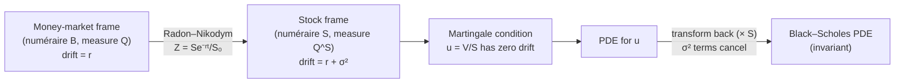

# Black–Scholes PDE via Change of Numéraire

This derivation removes the physical drift $\mu$ by **unit normalization**: expressing prices in units of the stock (rather than currency) shifts the drift under Girsanov's theorem, and the martingale condition in the new units produces the PDE. This is not about pricing differently—it is about changing the unit of account and observing that the pricing equation is invariant.

The Black–Scholes PDE can be derived without any delta-hedging or replication argument. Instead, one chooses the **stock as numéraire**, constructs the associated martingale measure via Girsanov's theorem, and imposes the condition that the normalized option price is a martingale. The PDE then emerges from setting the drift of this martingale to zero.

This derivation is conceptually distinct from the classical approaches (self-financing replication, risk-neutral pricing with the money market numéraire) and demonstrates the power of the [change-of-numéraire framework](../../ch01/fundamental_theorem_of_asset_pricing/numeraire_and_change_of_measure.md). The fact that a different numéraire and a different measure yield the same PDE is a concrete manifestation of pricing invariance.

## Setup

We work in the standard Black–Scholes model on a filtered probability space $(\Omega, \mathcal{F}, (\mathcal{F}_t)_{t \ge 0}, \mathbb{P})$ satisfying the usual conditions. Under the physical measure $\mathbb{P}$:

$$dS_t = \mu S_t\, dt + \sigma S_t\, dW_t$$

with constant parameters $\mu, \sigma > 0$, and a money market account $B_t = e^{rt}$ with constant rate $r$. Under the risk-neutral measure $\mathbb{Q}$ (the $B$-martingale measure):

$$dS_t = rS_t\, dt + \sigma S_t\, dW^{\mathbb{Q}}_t$$

We take the **stock** $S_t$ as numéraire. This is valid because $S_t$ is strictly positive and pays no dividends, so its discounted price $S_t e^{-rt}$ is a $\mathbb{Q}$-martingale. (When the stock pays dividends, the ex-dividend price alone is not a valid numéraire; one must use the total return process instead—see Exercise 5.) We derive the associated measure $\mathbb{Q}^S$, the stock dynamics under $\mathbb{Q}^S$, and ultimately the Black–Scholes PDE.

## Step 1: Density Process and Girsanov Transformation

### Radon–Nikodym Derivative

By the [change-of-numéraire theorem](../../ch01/fundamental_theorem_of_asset_pricing/numeraire_and_change_of_measure.md), the density process from $\mathbb{Q}$ to $\mathbb{Q}^S$ is

$$Z_t = \frac{d\mathbb{Q}^S}{d\mathbb{Q}}\bigg|_{\mathcal{F}_t} = \frac{S_t / S_0}{B_t / B_0} = \frac{S_t e^{-rt}}{S_0}$$

### Dynamics of Z_t

Apply Itô's product rule to $Z_t = (e^{-rt}/S_0) \cdot S_t$. Since $e^{-rt}$ is of bounded variation (zero quadratic variation), the cross-variation vanishes:

$$dZ_t = \frac{e^{-rt}}{S_0}\, dS_t + \frac{S_t}{S_0}\, d(e^{-rt}) = \frac{e^{-rt}}{S_0}\bigl(rS_t\, dt + \sigma S_t\, dW^{\mathbb{Q}}_t\bigr) - \frac{rS_t e^{-rt}}{S_0}\, dt$$

The $r\, dt$ terms cancel:

$$dZ_t = \frac{\sigma S_t e^{-rt}}{S_0}\, dW^{\mathbb{Q}}_t = \sigma Z_t\, dW^{\mathbb{Q}}_t$$

Therefore

$$\frac{dZ_t}{Z_t} = \sigma\, dW^{\mathbb{Q}}_t$$

This is a driftless geometric Brownian motion: $Z_t = \exp(\sigma W^{\mathbb{Q}}_t - \frac{1}{2}\sigma^2 t)$, the exponential martingale associated with the constant integrand $\sigma$. Since $\sigma$ is constant, $Z_t$ is a true $\mathbb{Q}$-martingale (not merely a local martingale) and defines a valid probability measure.

### Girsanov Transformation

Since the density process has volatility $\sigma$ (i.e., $dZ_t/Z_t = \sigma\, dW^{\mathbb{Q}}_t$), Girsanov's theorem gives the $\mathbb{Q}^S$-Brownian motion:

$$W^S_t = W^{\mathbb{Q}}_t - \sigma t$$

## Step 2: Dynamics Under the Stock Measure

### Stock Dynamics

Substitute $dW^{\mathbb{Q}}_t = dW^S_t + \sigma\, dt$:

$$dS_t = rS_t\, dt + \sigma S_t\bigl(dW^S_t + \sigma\, dt\bigr) = (r + \sigma^2)S_t\, dt + \sigma S_t\, dW^S_t$$

Under $\mathbb{Q}^S$, the stock drift increases from $r$ to $r + \sigma^2$. This is natural: the density $Z_T \propto S_T e^{-rT}$ up-weights high-$S_T$ paths, increasing the drift under the new measure.

### Verification: B_t / S_t Is a Q^S-Martingale

The defining property of $\mathbb{Q}^S$ is that all asset prices normalized by $S_t$ are martingales. We verify this for $B_t / S_t$.

Apply Itô's formula to $f(B_t, S_t) = B_t / S_t$, using $dB_t = rB_t\, dt$ and the $\mathbb{Q}^S$-dynamics of $S_t$:

$$d\!\left(\frac{B_t}{S_t}\right) = \frac{1}{S_t}\, dB_t - \frac{B_t}{S_t^2}\, dS_t + \frac{B_t}{S_t^3}\,(dS_t)^2$$

Computing each term:

$$= \frac{rB_t}{S_t}\, dt - \frac{B_t}{S_t}\bigl[(r + \sigma^2)\, dt + \sigma\, dW^S_t\bigr] + \frac{B_t}{S_t}\, \sigma^2\, dt$$

Collecting the drift:

$$\bigl[r - (r + \sigma^2) + \sigma^2\bigr]\frac{B_t}{S_t}\, dt = 0$$

The drift vanishes identically. Therefore

$$d\!\left(\frac{B_t}{S_t}\right) = -\frac{\sigma B_t}{S_t}\, dW^S_t$$

This driftless SDE shows $B_t/S_t$ is a local $\mathbb{Q}^S$-martingale. To confirm it is a true martingale, solve explicitly: $B_t/S_t = (B_0/S_0)\exp(-\sigma W_t^S - \frac{1}{2}\sigma^2 t)$, which is a Doléans-Dade exponential with constant integrand $-\sigma$. Since $\sigma$ is constant, $\mathbb{E}^{\mathbb{Q}^S}[B_t/S_t] = B_0/S_0$ for all $t$ (by the moment generating function of a Gaussian), so the process is a true $\mathbb{Q}^S$-martingale. $\checkmark$

## Step 3: The Martingale Condition for the Normalized Price

*Under $\mathbb{Q}^S$, any traded asset price normalized by $S_t$ is a martingale.*

Let $V(t, S)$ denote the option price as a function of time and the stock price. We assume $V \in C^{1,2}([0,T) \times (0,\infty))$ with at most polynomial growth. (The PDE holds on $[0,T) \times (0,\infty)$; the terminal condition $V(T, S) = \Phi(S)$ is imposed separately, since typical payoffs such as $(S - K)^+$ are not $C^2$.) These conditions are sufficient for Itô's formula to apply and, in the Black–Scholes setting, for the resulting local martingale to be a true martingale—polynomial growth of $V$ combined with the known moment bounds for GBM (see, e.g., Karatzas and Shreve, 1991, §3.3) provides the needed integrability. Under $\mathbb{Q}^S$, the normalized price

$$u(t, S) = \frac{V(t, S)}{S}$$

must be a martingale. We are not "forcing" a martingale—this is a consequence of no-arbitrage under the chosen numéraire: any no-arbitrage price, when denominated in units of the numéraire, must be a martingale under the associated measure.

By Itô's formula applied to $u(t, S_t)$, the process $u$ is first a local $\mathbb{Q}^S$-martingale. The polynomial growth condition on $V$, combined with known moment bounds for GBM, provides sufficient integrability in the Black–Scholes setting (using known moment bounds for GBM), so in this model the local martingale is a true martingale. The martingale condition requires the drift to vanish:

$$\frac{\partial u}{\partial t} + \mathcal{L}^S u = 0$$

where the generator $\mathcal{L}^S$ is:

$$\mathcal{L}^S = (r + \sigma^2)S\, \frac{\partial}{\partial S} + \frac{1}{2}\sigma^2 S^2\, \frac{\partial^2}{\partial S^2}$$

This gives the **PDE for the normalized price**:

$$\frac{\partial u}{\partial t} + (r + \sigma^2)S\, \frac{\partial u}{\partial S} + \frac{1}{2}\sigma^2 S^2\, \frac{\partial^2 u}{\partial S^2} = 0 \qquad (\star)$$

!!! tip "Intuition: changing units"
    The Radon–Nikodym derivative $Z_T \propto S_T$ reweights paths according to the terminal stock value, tilting the probability measure toward high-$S_T$ outcomes. In this tilted frame, normalized prices $V/S$ are driftless (martingales), and the stock drift shifts to $r + \sigma^2$. When we convert back to $V$, the extra Itô terms cancel exactly with the drift shift. The precise content is the change-of-numéraire theorem, which guarantees the PDE for $V$ is the same regardless of numéraire.

## Step 4: Transform Back to V

The PDE $(\star)$ governs the normalized price $u = V/S$ under the stock measure. Now we translate this back into a PDE for the option price $V$ itself, by expressing the derivatives of $u$ in terms of $V$ and substituting.

Since $V = S \cdot u$, express the derivatives of $u$ in terms of $V$:

$$\frac{\partial u}{\partial t} = \frac{1}{S}\frac{\partial V}{\partial t}$$

$$\frac{\partial u}{\partial S} = \frac{1}{S}\frac{\partial V}{\partial S} - \frac{V}{S^2}$$

$$\frac{\partial^2 u}{\partial S^2} = \frac{1}{S}\frac{\partial^2 V}{\partial S^2} - \frac{2}{S^2}\frac{\partial V}{\partial S} + \frac{2V}{S^3}$$

Substitute into $(\star)$ and multiply through by $S$. Collecting terms:

$$\frac{\partial V}{\partial t} + \underbrace{\bigl[(r + \sigma^2) - \sigma^2\bigr]}_{= \, r} S\frac{\partial V}{\partial S} + \frac{1}{2}\sigma^2 S^2\frac{\partial^2 V}{\partial S^2} + \underbrace{\bigl[-(r + \sigma^2) + \sigma^2\bigr]}_{= \, -r} V = 0$$

The $\sigma^2$ terms from the stock-measure drift and the Itô correction cancel perfectly, leaving:

$$\boxed{\frac{\partial V}{\partial t} + rS\frac{\partial V}{\partial S} + \frac{1}{2}\sigma^2 S^2\frac{\partial^2 V}{\partial S^2} - rV = 0}$$

This is the **Black–Scholes PDE**—derived without explicitly constructing a replicating portfolio or hedging argument. (The underlying arbitrage-free pricing theory still relies on completeness and replication in the background; the point is that the *derivation method* avoids them.)

!!! note "Pricing invariance"
    The normalized price $u = V/S$ satisfies a PDE with drift coefficient $r + \sigma^2$ (reflecting the stock-measure dynamics), but the option price $V$ itself satisfies the standard Black–Scholes PDE with drift coefficient $r$ (the risk-neutral drift). The cancellation of $\sigma^2$ in the transformation is exact and guaranteed by the change-of-numéraire theorem: different numéraires give different PDEs for the normalized price, but the same PDE for $V$.

## Byproduct: Black–Scholes Formula as Two Probabilities

The stock-numéraire approach also yields an elegant decomposition of the Black–Scholes call price.

### Derivation

For a European call with payoff $(S_T - K)^+$, the stock-numéraire pricing formula gives

$$C_t = S_t\, \mathbb{E}^{\mathbb{Q}^S}\!\left[\frac{(S_T - K)^+}{S_T} \;\bigg|\; \mathcal{F}_t\right] = S_t\, \mathbb{E}^{\mathbb{Q}^S}\!\left[\mathbf{1}_{\{S_T > K\}}\!\left(1 - \frac{K}{S_T}\right) \;\bigg|\; \mathcal{F}_t\right]$$

Splitting the expectation:

$$C_t = S_t\, \mathbb{Q}^S(S_T > K \mid \mathcal{F}_t) - K\, \mathbb{E}^{\mathbb{Q}^S}\!\left[\frac{\mathbf{1}_{\{S_T > K\}}}{S_T} \;\bigg|\; \mathcal{F}_t\right]$$

For the second term, apply the abstract Bayes formula. Since $Z_t = S_t e^{-rt}/S_0$ and $Z_T = S_T e^{-rT}/S_0$:

$$\mathbb{E}^{\mathbb{Q}^S}\!\left[\frac{\mathbf{1}_{\{S_T > K\}}}{S_T} \;\bigg|\; \mathcal{F}_t\right] = \frac{1}{Z_t}\, \mathbb{E}^{\mathbb{Q}}\!\left[Z_T \cdot \frac{\mathbf{1}_{\{S_T > K\}}}{S_T} \;\bigg|\; \mathcal{F}_t\right] = \frac{1}{Z_t} \cdot \frac{e^{-rT}}{S_0}\, \mathbb{Q}(S_T > K \mid \mathcal{F}_t)$$

Substituting $S_0 Z_t = S_t e^{-rt}$:

$$= \frac{e^{-r(T-t)}}{S_t}\, \mathbb{Q}(S_T > K \mid \mathcal{F}_t)$$

Therefore:

$$C_t = S_t\, \mathbb{Q}^S(S_T > K \mid \mathcal{F}_t) - Ke^{-r(T-t)}\, \mathbb{Q}(S_T > K \mid \mathcal{F}_t)$$

### Identification with N(d_1) and N(d_2)

Under $\mathbb{Q}$, the stock drift is $r$, so $\ln S_T \mid \mathcal{F}_t \sim \mathcal{N}\!\left(\ln S_t + (r - \tfrac{1}{2}\sigma^2)\tau,\; \sigma^2\tau\right)$ where $\tau = T - t$. Therefore

$$\mathbb{Q}(S_T > K \mid \mathcal{F}_t) = N(d_2), \qquad d_2 = \frac{\ln(S_t/K) + (r - \frac{1}{2}\sigma^2)\tau}{\sigma\sqrt{\tau}}$$

Under $\mathbb{Q}^S$, the stock drift is $r + \sigma^2$, so $\ln S_T \mid \mathcal{F}_t \sim \mathcal{N}\!\left(\ln S_t + (r + \tfrac{1}{2}\sigma^2)\tau,\; \sigma^2\tau\right)$ (the Itô correction gives mean $r + \sigma^2 - \frac{1}{2}\sigma^2 = r + \frac{1}{2}\sigma^2$). Therefore

$$\mathbb{Q}^S(S_T > K \mid \mathcal{F}_t) = N(d_1), \qquad d_1 = \frac{\ln(S_t/K) + (r + \frac{1}{2}\sigma^2)\tau}{\sigma\sqrt{\tau}} = d_2 + \sigma\sqrt{\tau}$$

Combining:

$$\boxed{C_t = S_t\, N(d_1) - Ke^{-r(T-t)}\, N(d_2)}$$

The Black–Scholes formula emerges with a transparent probabilistic interpretation: $N(d_1)$ is the probability of exercise under the stock measure $\mathbb{Q}^S$, and $N(d_2)$ is the probability of exercise under the risk-neutral measure $\mathbb{Q}$.

!!! note "Why $d_1 \neq d_2$"
    The two probabilities differ because they are computed under different measures. Under $\mathbb{Q}^S$, paths where $S_T$ is large are up-weighted (since $Z_T \propto S_T$), shifting the log-normal mean upward by $\sigma^2 \tau$ relative to $\mathbb{Q}$. This increases the exercise probability from $N(d_2)$ to $N(d_1) = N(d_2 + \sigma\sqrt{\tau})$.

## Summary of the Derivation

The following diagram summarizes the logical flow:

The logical structure is:

1. **Choose numéraire**: take $N_t = S_t$ (the stock).
2. **Construct the density process**: $Z_t = S_t e^{-rt}/S_0$, verify $dZ_t/Z_t = \sigma\, dW^{\mathbb{Q}}_t$.
3. **Apply Girsanov**: $W^S_t = W^{\mathbb{Q}}_t - \sigma t$ is a $\mathbb{Q}^S$-Brownian motion.
4. **Derive stock dynamics under $\mathbb{Q}^S$**: drift becomes $r + \sigma^2$.
5. **Impose the martingale condition**: $u = V/S$ satisfies $\partial_t u + \mathcal{L}^S u = 0$.
6. **Transform back to $V$**: the $\sigma^2$ terms cancel, yielding the Black–Scholes PDE.

This derivation differs from the replication approach in *method*: it begins with measure theory (Girsanov's theorem, Radon–Nikodym derivatives) rather than self-financing portfolios, and obtains the PDE from a martingale condition rather than a hedging argument. Both approaches ultimately rest on the same theoretical foundations: **no-arbitrage** guarantees the existence of an equivalent martingale measure, and **completeness** (which in Black–Scholes is equivalent to the ability to replicate) guarantees its uniqueness and hence the uniqueness of the price. The fact that both approaches yield the same equation reflects this deep connection, established by the [FTAP](../../ch01/fundamental_theorem_of_asset_pricing/fundamental_theorem_of_asset_pricing.md).

## References

- Geman, H., El Karoui, N., and Rochet, J.-C. (1995). *Changes of numéraire, changes of probability measure, and option pricing.* Journal of Applied Probability, 32(2), 443–458.

- Shreve, S. E. (2004). *Stochastic Calculus for Finance II: Continuous-Time Models.* Springer.

- Karatzas, I. and Shreve, S. E. (1991). *Brownian Motion and Stochastic Calculus.* 2nd edition, Springer.

- Björk, T. (2009). *Arbitrage Theory in Continuous Time.* 3rd edition, Oxford University Press.

---

## Exercises

**Exercise 1.** Verify that the density process $Z_t = S_t e^{-rt}/S_0$ is a $\mathbb{Q}$-martingale by showing that $dZ_t / Z_t = \sigma \, dW_t^{\mathbb{Q}}$ (i.e., the drift vanishes under $\mathbb{Q}$). Compute $\mathbb{E}^{\mathbb{Q}}[Z_T]$ and confirm it equals 1.

??? success "Solution to Exercise 1"
    Under $\mathbb{Q}$, the stock dynamics are $dS_t = rS_t\, dt + \sigma S_t\, dW_t^{\mathbb{Q}}$. The density process is $Z_t = S_t e^{-rt}/S_0$. Applying the product rule with $e^{-rt}/S_0$ (a deterministic, bounded-variation factor):

    $$dZ_t = \frac{e^{-rt}}{S_0}\, dS_t + \frac{S_t}{S_0}\, d(e^{-rt})$$

    Substituting the dynamics:

    $$dZ_t = \frac{e^{-rt}}{S_0}\bigl(rS_t\, dt + \sigma S_t\, dW_t^{\mathbb{Q}}\bigr) - \frac{rS_t e^{-rt}}{S_0}\, dt$$

    The $r\, dt$ terms cancel exactly:

    $$dZ_t = \frac{\sigma S_t e^{-rt}}{S_0}\, dW_t^{\mathbb{Q}} = \sigma Z_t\, dW_t^{\mathbb{Q}}$$

    Therefore $dZ_t / Z_t = \sigma\, dW_t^{\mathbb{Q}}$, which is driftless under $\mathbb{Q}$, confirming $Z_t$ is a $\mathbb{Q}$-local martingale.

    Solving the SDE: $Z_t = Z_0 \exp\!\bigl(\sigma W_t^{\mathbb{Q}} - \frac{1}{2}\sigma^2 t\bigr)$. Since $Z_0 = S_0 e^0 / S_0 = 1$, we have $Z_t = \exp\!\bigl(\sigma W_t^{\mathbb{Q}} - \frac{1}{2}\sigma^2 t\bigr)$. This is a Doléans-Dade exponential martingale. Computing the expectation:

    $$\mathbb{E}^{\mathbb{Q}}[Z_T] = \mathbb{E}^{\mathbb{Q}}\!\left[\exp\!\left(\sigma W_T^{\mathbb{Q}} - \frac{1}{2}\sigma^2 T\right)\right] = \exp\!\left(-\frac{1}{2}\sigma^2 T\right) \cdot \exp\!\left(\frac{1}{2}\sigma^2 T\right) = 1$$

    where we used the moment generating function $\mathbb{E}[e^{aW_T}] = e^{a^2 T/2}$. Since $\mathbb{E}^{\mathbb{Q}}[Z_T] = 1$, the process $Z_t$ is a true $\mathbb{Q}$-martingale and defines a valid probability measure $\mathbb{Q}^S$.

---

**Exercise 2.** Under the stock measure $\mathbb{Q}^S$, the process $u_t = V(t, S_t)/S_t$ is a martingale. Apply Ito's lemma to $u_t$ using the stock dynamics under $\mathbb{Q}^S$ and show that setting the drift of $u_t$ to zero yields the Black-Scholes PDE for $V$.

??? success "Solution to Exercise 2"
    Under $\mathbb{Q}^S$, the stock dynamics are $dS_t = (r + \sigma^2)S_t\, dt + \sigma S_t\, dW_t^S$. The normalized price is $u_t = V(t, S_t)/S_t$. Apply Itô's formula to $u(t, S) = V(t, S)/S$. We need the partial derivatives:

    $$\frac{\partial u}{\partial t} = \frac{1}{S}\frac{\partial V}{\partial t}$$

    $$\frac{\partial u}{\partial S} = \frac{1}{S}\frac{\partial V}{\partial S} - \frac{V}{S^2}$$

    $$\frac{\partial^2 u}{\partial S^2} = \frac{1}{S}\frac{\partial^2 V}{\partial S^2} - \frac{2}{S^2}\frac{\partial V}{\partial S} + \frac{2V}{S^3}$$

    The Itô expansion of $u(t, S_t)$ gives:

    $$du = \left(\frac{\partial u}{\partial t} + (r+\sigma^2)S\frac{\partial u}{\partial S} + \frac{1}{2}\sigma^2 S^2 \frac{\partial^2 u}{\partial S^2}\right)dt + \sigma S \frac{\partial u}{\partial S}\, dW_t^S$$

    Setting the drift to zero (the martingale condition under $\mathbb{Q}^S$):

    $$\frac{\partial u}{\partial t} + (r+\sigma^2)S\frac{\partial u}{\partial S} + \frac{1}{2}\sigma^2 S^2 \frac{\partial^2 u}{\partial S^2} = 0$$

    Substituting the derivatives of $u$ in terms of $V$ and multiplying through by $S$:

    $$\frac{\partial V}{\partial t} + (r+\sigma^2)\frac{\partial V}{\partial S} \cdot S - (r+\sigma^2)\frac{V}{S} \cdot S + \frac{1}{2}\sigma^2 S^2\!\left(\frac{1}{S}\frac{\partial^2 V}{\partial S^2} - \frac{2}{S^2}\frac{\partial V}{\partial S} + \frac{2V}{S^3}\right)\! S = 0$$

    Simplifying:

    $$\frac{\partial V}{\partial t} + \bigl[(r+\sigma^2) - \sigma^2\bigr]S\frac{\partial V}{\partial S} + \frac{1}{2}\sigma^2 S^2 \frac{\partial^2 V}{\partial S^2} + \bigl[-(r+\sigma^2) + \sigma^2\bigr]V = 0$$

    The $\sigma^2$ terms cancel in both brackets, yielding:

    $$\frac{\partial V}{\partial t} + rS\frac{\partial V}{\partial S} + \frac{1}{2}\sigma^2 S^2 \frac{\partial^2 V}{\partial S^2} - rV = 0$$

    This is the Black–Scholes PDE.

---

**Exercise 3.** Explain why $d_1 \neq d_2$ in the Black-Scholes formula from the change-of-numeraire perspective. Under $\mathbb{Q}^S$, what is the distribution of $\ln S_T$, and how does it differ from the distribution under $\mathbb{Q}$?

??? success "Solution to Exercise 3"
    The quantities $d_1$ and $d_2$ differ because they are computed under different probability measures, $\mathbb{Q}^S$ and $\mathbb{Q}$ respectively, and these measures assign different drifts to $\ln S_T$.

    **Under $\mathbb{Q}$ (risk-neutral measure):** The stock dynamics are $dS_t = rS_t\, dt + \sigma S_t\, dW_t^{\mathbb{Q}}$. By Itô's formula applied to $\ln S_t$:

    $$\ln S_T \mid \mathcal{F}_t \sim \mathcal{N}\!\left(\ln S_t + \left(r - \tfrac{1}{2}\sigma^2\right)\tau,\; \sigma^2\tau\right)$$

    where $\tau = T - t$. The exercise probability under $\mathbb{Q}$ is:

    $$\mathbb{Q}(S_T > K \mid \mathcal{F}_t) = N(d_2), \qquad d_2 = \frac{\ln(S_t/K) + (r - \frac{1}{2}\sigma^2)\tau}{\sigma\sqrt{\tau}}$$

    **Under $\mathbb{Q}^S$ (stock measure):** The stock dynamics are $dS_t = (r + \sigma^2)S_t\, dt + \sigma S_t\, dW_t^S$. Applying Itô's formula to $\ln S_t$:

    $$\ln S_T \mid \mathcal{F}_t \sim \mathcal{N}\!\left(\ln S_t + \left(r + \tfrac{1}{2}\sigma^2\right)\tau,\; \sigma^2\tau\right)$$

    The mean of $\ln S_T$ under $\mathbb{Q}^S$ is shifted upward by $\sigma^2\tau$ compared to $\mathbb{Q}$, because the Itô correction to the log gives $r + \sigma^2 - \frac{1}{2}\sigma^2 = r + \frac{1}{2}\sigma^2$. The exercise probability under $\mathbb{Q}^S$ is:

    $$\mathbb{Q}^S(S_T > K \mid \mathcal{F}_t) = N(d_1), \qquad d_1 = \frac{\ln(S_t/K) + (r + \frac{1}{2}\sigma^2)\tau}{\sigma\sqrt{\tau}} = d_2 + \sigma\sqrt{\tau}$$

    The difference $d_1 - d_2 = \sigma\sqrt{\tau}$ arises because the Radon–Nikodym derivative $d\mathbb{Q}^S/d\mathbb{Q} \propto S_T e^{-rT}$ up-weights paths where the stock ends high, shifting the mean of $\ln S_T$ upward and increasing the in-the-money probability.

---

**Exercise 4.** The change-of-numeraire approach does not require constructing a self-financing portfolio. Compare the logical structure of this derivation with the delta-hedging derivation. In particular, identify which assumption (no-arbitrage, completeness, or Girsanov's theorem) plays the role that the hedging argument plays in the classical approach.

??? success "Solution to Exercise 4"
    **Delta-hedging derivation:** Constructs a portfolio $\Pi = V - \Delta S$, applies Itô's formula under $\mathbb{P}$, chooses $\Delta = \partial V / \partial S$ to eliminate the $dW$ term, then invokes the no-arbitrage condition $d\Pi = r\Pi\, dt$. The key ingredients are: (i) a self-financing (or freeze-and-rebalance) portfolio construction, (ii) the ability to trade continuously, and (iii) the no-arbitrage principle.

    **Change-of-numéraire derivation:** Chooses $S_t$ as numéraire, constructs the density process $Z_t = S_t e^{-rt}/S_0$, applies Girsanov's theorem to define $\mathbb{Q}^S$, and requires $V/S$ to be a $\mathbb{Q}^S$-martingale. No portfolio is constructed; the PDE emerges from setting the drift of the normalized price to zero.

    The **key structural difference** is that the hedging argument in the classical approach is replaced by **Girsanov's theorem** in the change-of-numéraire approach. Specifically:

    - In the delta-hedging approach, the choice $\Delta = V_S$ eliminates risk and removes the physical drift $\mu$ from the PDE. The no-arbitrage condition then determines the discount rate.
    - In the change-of-numéraire approach, Girsanov's theorem absorbs the measure change from $\mathbb{Q}$ to $\mathbb{Q}^S$, modifying the stock drift from $r$ to $r + \sigma^2$. The martingale condition on $V/S$ then yields the PDE, and the $\sigma^2$ terms cancel when transforming back to $V$.

    Both approaches implicitly rely on **completeness** (to ensure uniqueness of the pricing measure) and **no-arbitrage** (to ensure existence of the measure). However, the change-of-numéraire approach makes the measure-theoretic structure explicit—Girsanov's theorem is the mathematical tool that plays the role of the hedging argument.

---

**Exercise 5.** Suppose the stock pays a continuous dividend yield $q$. The ex-dividend stock price alone is not a valid numéraire (its discounted price is not a $\mathbb{Q}$-martingale). Instead, use the **total return process** $\tilde{S}_t = e^{qt}S_t$ as numéraire, normalize by $\tilde{S}_t$, and show that the Black–Scholes PDE becomes $\frac{\partial V}{\partial t} + (r-q)S\frac{\partial V}{\partial S} + \frac{1}{2}\sigma^2 S^2 \frac{\partial^2 V}{\partial S^2} - rV = 0$.

??? success "Solution to Exercise 5"
    With a continuous dividend yield $q$, the stock price satisfies $dS_t = (r - q)S_t\, dt + \sigma S_t\, dW_t^{\mathbb{Q}}$ under $\mathbb{Q}$. The total return process $\tilde{S}_t = e^{qt} S_t$ satisfies $d\tilde{S}_t = r\tilde{S}_t\, dt + \sigma\tilde{S}_t\, dW_t^{\mathbb{Q}}$, so its discounted price $\tilde{S}_t e^{-rt}$ is a $\mathbb{Q}$-martingale, making $\tilde{S}_t$ a valid numéraire.

    **Density process.** The density from $\mathbb{Q}$ to $\mathbb{Q}^{\tilde{S}}$ is:

    $$Z_t = \frac{\tilde{S}_t / \tilde{S}_0}{B_t / B_0} = \frac{e^{qt} S_t e^{-rt}}{S_0} = \frac{S_t e^{-(r-q)t}}{S_0}$$

    Since $dZ_t/Z_t = \sigma\, dW_t^{\mathbb{Q}}$ (the $(r-q)\, dt$ terms cancel), $Z_t$ is a $\mathbb{Q}$-martingale.

    **Girsanov transformation.** Define $W_t^{\tilde{S}} = W_t^{\mathbb{Q}} - \sigma t$, a $\mathbb{Q}^{\tilde{S}}$-Brownian motion.

    **Stock dynamics under $\mathbb{Q}^{\tilde{S}}$.** Substituting $dW_t^{\mathbb{Q}} = dW_t^{\tilde{S}} + \sigma\, dt$:

    $$dS_t = (r - q + \sigma^2)S_t\, dt + \sigma S_t\, dW_t^{\tilde{S}}$$

    **Martingale condition.** The normalized price under the numéraire $\tilde{S}_t$ is $u = V/\tilde{S}_t = e^{-qt}V/S$. This must be a $\mathbb{Q}^{\tilde{S}}$-martingale. We compute the partial derivatives of $u(t, S) = e^{-qt}V(t,S)/S$:

    $$\frac{\partial u}{\partial t} = e^{-qt}\!\left(\frac{1}{S}\frac{\partial V}{\partial t} - \frac{qV}{S}\right)$$

    $$\frac{\partial u}{\partial S} = e^{-qt}\!\left(\frac{1}{S}\frac{\partial V}{\partial S} - \frac{V}{S^2}\right)$$

    $$\frac{\partial^2 u}{\partial S^2} = e^{-qt}\!\left(\frac{1}{S}\frac{\partial^2 V}{\partial S^2} - \frac{2}{S^2}\frac{\partial V}{\partial S} + \frac{2V}{S^3}\right)$$

    Setting the drift of $u(t, S_t)$ to zero, factoring out $e^{-qt}$, and multiplying through by $S$:

    $$\frac{\partial V}{\partial t} - qV + \bigl[(r-q+\sigma^2) - \sigma^2\bigr]S\frac{\partial V}{\partial S} + \frac{1}{2}\sigma^2 S^2\frac{\partial^2 V}{\partial S^2} + \bigl[-(r-q+\sigma^2) + \sigma^2\bigr]V = 0$$

    Collecting the $V$ terms: $-q - (r-q) = -r$. The $\sigma^2$ terms cancel in both brackets, yielding:

    $$\frac{\partial V}{\partial t} + (r-q)S\frac{\partial V}{\partial S} + \frac{1}{2}\sigma^2 S^2 \frac{\partial^2 V}{\partial S^2} - rV = 0$$

    This is the Black–Scholes PDE with continuous dividend yield $q$. The discounting coefficient is $-rV$ (not $-(r-q)V$) because the extra $-qV$ from differentiating $e^{-qt}$ in the normalization combines with $-(r-q)V$ from the spatial terms to produce $-rV$.

---

**Exercise 6.** Price a European call option directly using the stock measure $\mathbb{Q}^S$. Show that the call price can be written as $C = S\,\mathbb{Q}^S(S_T > K) - Ke^{-r\tau}\,\mathbb{Q}(S_T > K)$, evaluate both probabilities using the distributions of $\ln S_T$ under each measure, and verify that the result is $C = S\,\mathcal{N}(d_1) - Ke^{-r\tau}\,\mathcal{N}(d_2)$.

??? success "Solution to Exercise 6"
    The risk-neutral pricing formula for a European call with $\tau = T - t$ is:

    $$C = e^{-r\tau}\,\mathbb{E}^{\mathbb{Q}}\!\left[(S_T - K)^+\right] = e^{-r\tau}\,\mathbb{E}^{\mathbb{Q}}\!\left[S_T \mathbf{1}_{\{S_T > K\}}\right] - Ke^{-r\tau}\,\mathbb{Q}(S_T > K)$$

    **Second term.** Under $\mathbb{Q}$, $\ln S_T \sim \mathcal{N}\!\left(\ln S + (r - \tfrac{1}{2}\sigma^2)\tau,\; \sigma^2\tau\right)$. Writing $\ln S_T = \ln S + (r - \tfrac{1}{2}\sigma^2)\tau + \sigma\sqrt{\tau}\,Z$ with $Z \sim \mathcal{N}(0,1)$:

    $$\mathbb{Q}(S_T > K) = \mathbb{Q}\!\left(Z > \frac{\ln(K/S) - (r - \tfrac{1}{2}\sigma^2)\tau}{\sigma\sqrt{\tau}}\right) = \mathcal{N}(d_2)$$

    where $d_2 = \frac{\ln(S/K) + (r - \tfrac{1}{2}\sigma^2)\tau}{\sigma\sqrt{\tau}}$.

    **First term via change of numéraire.** Using the density $Z_T = S_T e^{-rT}/S_0$:

    $$e^{-r\tau}\,\mathbb{E}^{\mathbb{Q}}\!\left[S_T \mathbf{1}_{\{S_T > K\}}\right] = S\,\mathbb{E}^{\mathbb{Q}^S}\!\left[\mathbf{1}_{\{S_T > K\}}\right] = S\,\mathbb{Q}^S(S_T > K)$$

    Under $\mathbb{Q}^S$, the stock dynamics are $dS_t = (r + \sigma^2)S_t\,dt + \sigma S_t\,dW_t^S$, so $\ln S_T \sim \mathcal{N}\!\left(\ln S + (r + \tfrac{1}{2}\sigma^2)\tau,\; \sigma^2\tau\right)$. Therefore:

    $$\mathbb{Q}^S(S_T > K) = \mathcal{N}(d_1)$$

    where $d_1 = \frac{\ln(S/K) + (r + \tfrac{1}{2}\sigma^2)\tau}{\sigma\sqrt{\tau}} = d_2 + \sigma\sqrt{\tau}$.

    **Combining:**

    $$C = S\,\mathcal{N}(d_1) - Ke^{-r\tau}\,\mathcal{N}(d_2)$$

    This is the Black–Scholes call formula. The change-of-numéraire viewpoint makes the structure transparent: $\mathcal{N}(d_1)$ is the probability of finishing in the money under $\mathbb{Q}^S$ (the stock measure), while $\mathcal{N}(d_2)$ is the same probability under $\mathbb{Q}$ (the money-market measure). The two $d$-values differ by $\sigma\sqrt{\tau}$ because the stock drift is $\sigma^2$ higher under $\mathbb{Q}^S$.
